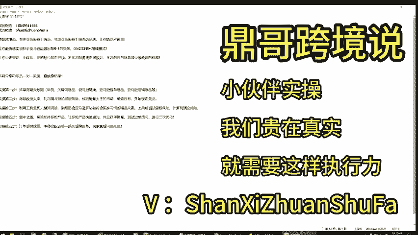
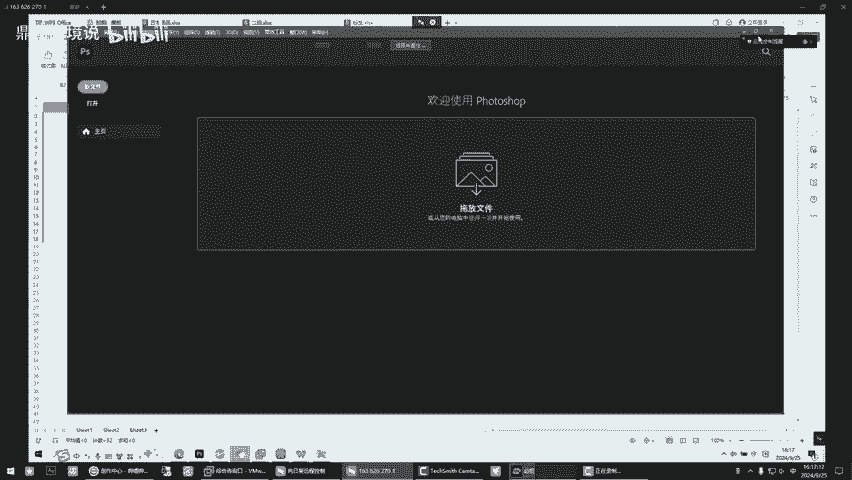
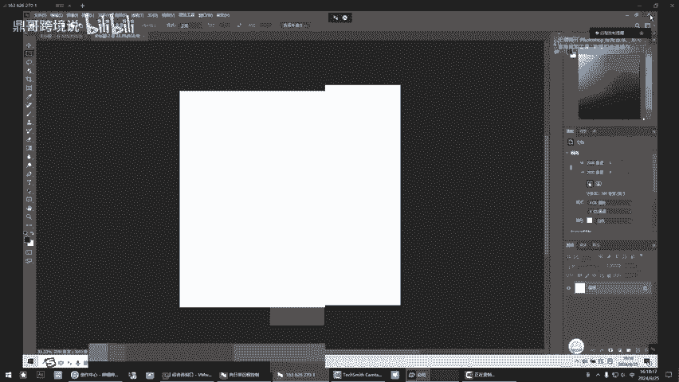

# 必看！亚马逊选品思路应该是什么样的，你没有执行力啥也是假的！简直了，小伙伴执行力！怎么这么有效！ - P1 - 鼎哥跨境说 - BV1wLsre3Ewz

hello，大家好，我是顶哥。很高兴呢今天又和小伙伴们见面了。😊，呃，老样子还是做个简单的自我介绍啊，顶格跨境说专注亚马逊的新手选品，独创亚马逊的新手综合选品法，让你选品不再难。

让你最快速的实现新手亚马逊运营出单，0到1的突破低成本的FBM轻铺翁模式，让你少走弯路少踩坑，谁的钱也是血汗钱，不学习就要被市场教训，学习的目的就是减少被教训的几率。本期分享的呢是和学员一对一实操。

直接拿结果。本期系列都是。因为顶哥这里只注重实操实操实操，咱们没有那么多的废话，直接拿结果啊。底下这个内容我就不说了，它是整个顶哥运营系列实操系列的步骤啊。

接下来我们直接开始。喂，阿丁啊哦。哎来来来，开始你给我复盘，你都做了些啥，到什么进度？哦，我做的这个。到什么进度了，跟我说一下，是你找的吗？嗯，目前就是现在我今天就是把这个。销量。对逼出来了。

就比心血调嗯。你不需你像再搞品牌，对品要查询，然后筛选不行的就提掉。对品不需要太多。咱们要测试出来，只要有销量的嗯，哎，你能玩，你但是他这个可能有有些呃，我到最后还得删删，肯定他肯定得删吧。

你两能不删了，对不对？对你看你这么多，你就你你不可能，我得肯定得删删，你精简到，你先挑出来几个以后再说吧。对你先挑出来几个先测试一下啊，测试一下。对对，看别人搞不搞，你先测试一下。嗯，先测一下。

然后那下面的是以后再再弄，不一定先一次性弄完。对对对。就是你我是看到呃那个日本的数据没没，那就我跟你说的那方法，抓100条，就是完成那个100条，你筛选一遍，没用的删掉，让他继续抓就行了。呃。

我抓完我我筛出来以后，我就没再动它我因为我这些这有有100多个嗯哎。

我就没这没得抓，我今天中午这不一直搞这个嘛对。😡，这日本数据呃还剩那两天的，我看没更新，我就没再动它没更新，你就不用再去采集嗯嗯。我装完筛完以后。啊。

这些有些这些都是一些呃还剩下的对我主要都把它都搞到这个桌面上那个了。对，主要弄到这里边了。😊，OK行，不错，继续努力。嗯嗯，这个就是它就是一个其实啊你没发现吗？它就是一个算账的过程，知道了吧？

你把账算明白，再把风险排除了，咱们按部就班的干就行了。对吧？你你你的作业就是什么，你别搞这么多啊，就是哪怕你拿出来，你自己认为可以的，嗯，我再带你咱们直接实操上架去看就行了啊。

现在今天你我我现在都搞搞几个就行。对，搞几个就行了。先把这个流程带你走完对。嗯，好好，别的没什么。那个呢那个这是一方面那个呃动了没有？金铺的那面在动了没？有没有在这边我我做这边做完了啊。

这边你再给我看一下，这边就是我找了品也不多啊，就是基本上就是都做到这个程度了，都就是词根指定词不就挑多了啊，记住啊，词太多啊，这个这个词是有点多了，词根控制在20个词根包括啊。

这个因为它这个品它这个是圣诞的那种东西，它是个它词比太多太多在删太多，你就用那个小类排名前十的，你不用20，自己灵活程度哦，这像这一种就是就就是差多对这个就差不多。嗯。

这个就我就不认识都是多都是有的多一点啊，没关系，他因为它多太多了以后，你在那个后台操作的时候也可复杂了，不是复杂，是浪费时间，一个一个的控制在20个左右就够了，够玩就行了。这这些应该就是够了差不多了嗯。

差不多这十几个嘛，十三四个吧，应该就是个啊。差不多这人少了。是你说是一溜这十十来20合起来合起来合起来20个对，20个以内，20个上下，20个以内都行。嗯，我就说是都是像多的，我再挑呗。😡，对对对。

我得看你的进度，你到了什么进度，咱们就干什么事儿，对吧？这样不行，到时候就是再挑出来点呗，这个就是超了。对，没事没事，到时候看情况。嗯，行行到了什么进度了？这个进度完了，你如果找出来。

你又你接下来你应该处理图片了，知道了吗？你要做哪个东西哦哦，你要处理图片了，我给你发过那个视频吧，就是以前我做图片的那个。嗯，没有没有没有，我一会儿给你发一下啊。

就我就以前我自己就是你把那个圆领弄明白就行了，没那么复杂。你先装个PS装了啊，是吧？嗯，那装了装了嗯，2014的对。其实可简单，没那没那么复杂，我给你。

就是一步一步的根儿找出来，就开始写文案。写文案之前，你先把图片处理好，处理好图片。你就文案着简单度，把这个你调一下这个。新建一个。他默认它是这个的啊，你先别管它默认，咱们改一下。哦。

嗯，它是慢还是咋的，不动了，这是慢默认他在在这个地方把这个参数改一下。常规下。把这些改成使用旧版。把别的去了。哦，然后controrl的Nctrl的N是新建，这个地方你把它改成像素，改成像素啊。

像素就上面对这个时候你你你预存应看2000乘以2000啊，你看你干一个什么事啊，这不是在重储路径是吧？以后你他你再打开就这样呗，cttrol的N是吧？

你看ctrl的加N出来直接就是这样子这个是默认的默认的，完后图片就用这个尺寸来处理，处理完了，你你你把图片，这两天琢磨会图片弄会了以后，就我就直接带你在ERP上连带文案带啥，就一器式操作了啊。

你首先得有图片文案简单有词根，我完了跟你说怎么组合啊。

就行，这个都都没毛病。我我一会儿我给你看一下，把那个视频给你发一下。他是我之前操作的，但你把那个思路弄明白，变体和这个图片这个两个思路弄清楚啊。哦，哎，我记得发过吧，给你没发过。嗯，没有。

这两天昨前天呃咱搞的是那个跟卖日本的，就没好了，没事，没发，我给你发，马上给你发哦哦。马上给你发，先这样。亚马逊首先是一个关键词网站，听懂啥意思了吧？记住它是关键词网站，也就是搜索性网站。

为什么重点必须得把词搞好，搞好词以后是不是解决了一部分，对吧？它是关键词网站，你得做取配。第二，图片吧，如果你技术好，那你就处理的好点。如果你技术不好，你能咱们说凑合者把这个事办了就行了，对吧？第三。

你得会玩流量，就这几个结合，嗯，没事，你在你看你记住啊，如果说不用的东西，你看这么多直接干掉它就完事了，对不对？我看见你就留这么多，可以啊，没有了再去抓没有了再去抓就完事了，对吧？

自己灵活掌握啊灵活掌握。

别的没啥别的没有啥。那今天咱们这个比较短，就是你走了两条路，一条是做了你去做一个A层的筛选啊，就你那个表A层的筛选。另外一个，你看看怎么做图和怎么讲变题，你一定要同步进行。因为你执行力我看见也可以。

那么你执行力你你给力，我就每天盯着你知道吧？你给我交作业，么哪一个关过了，怎么下下就去下一个环节，好吧，这就快多了。好好。那今天先这样，你先去琢磨吧，你第一，你琢磨出来你有上架的时候，你跟我说完了。

我就领着你上一次架，咱们就观察观察观察它数据就行了，好吧。嗯，好好好，那先这样啊。嗯，好嘞。😊。