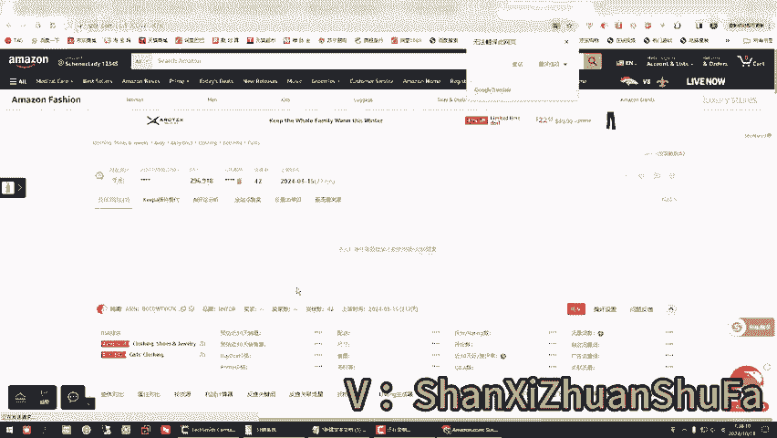
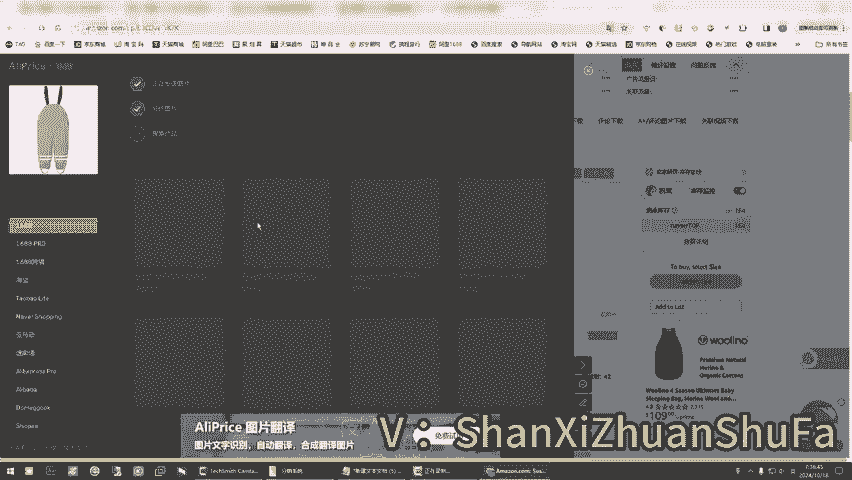
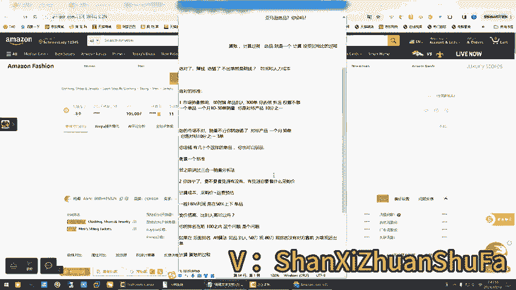
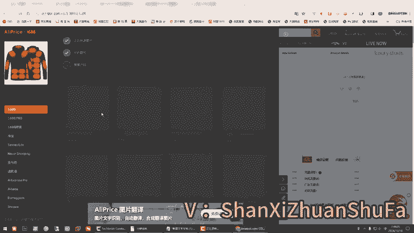
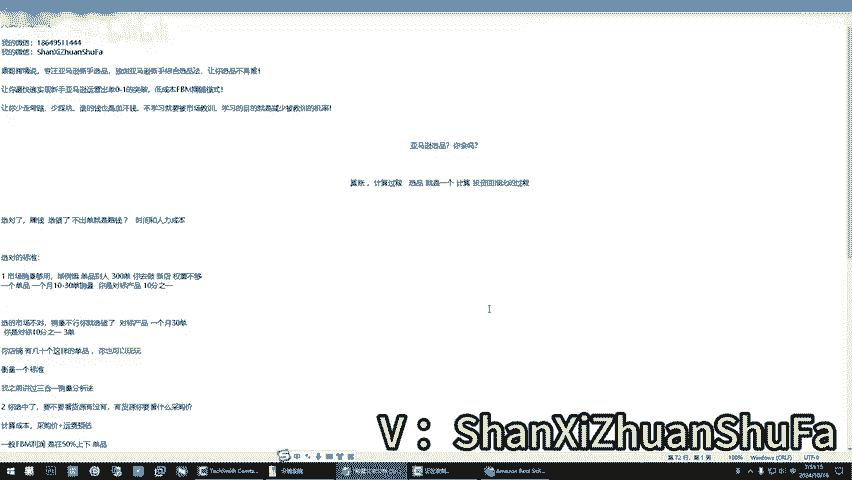

# 必看！亚马逊选品，你会吗？不走弯路，亚马逊新手选品直达式处理方案，你所不知道的选品方法！ - P1 - 鼎哥跨境说 - BV18ZyuYcEjM

🎼hello，大家好，我是顶哥，很高兴呢又和小伙伴们见面了。🎼呃，今现在呢是2024年10月18日的。早上7点多。锻炼完身体以后呢，坐在这里跟小伙伴们聊一聊。🎼啊，还是老杨子做个简单的自我介绍啊。

顶哥跨境说，专注亚马逊的新手选品，独创亚马逊的新手综合选品法，让你选品不再难。让你最快速的实现新手亚马逊运营出单0到1的突破，低成本拿BM。🎼精空模式啊，以前有跟麦，但跟麦现在讲的很少，因为。🎼呃。

这个店铺获取的太不容易了，那你少走弯路，少踩坑，谁的钱还是血汗钱，不学习就要被市场教训。学习的目的就是减少被教训的几率。那么今天的主题是什么？作为一个。想进入这个行业的，或者说已经进入了一段时间的啊。

亚马逊全品你会吗？对不对？那么这里。如果是老鸟，或者说。你经营了好几年了，那你绕过吧，是吧？我这个视频分享也是针对新手入门的啊，亚马逊选屏你会吗？那这个它它这个概念。🎼你说你选屏你会不会。

可能有别的小伙伴会说啊，我看了很多，我从这里选屏，我从那里选屏。🎼我从这里选名的类选美，对，没毛病。那么顶哥今天跟你们说一个我认为的亚马逊选品，它到底是什么样子的？其实玄敏啊，你看啊。

🎼那我认为的选品它是一个算账的过程，对吗？是不是？今天咱们就来捣论讨论这个话题啊，为什么说叫算账呢？可能这个话。呃，这个算账它不是贬义词，它是一个褒义词啊。就是计算。计算。过程叫算账对不对？是吧？

计算过程可能我讲的有点，我们这个地方它就叫算账。选品就是一个。计算。这个计算这个投资回报比的过程。我们统时来说他叫算账，你这个账能算得过来，说明你这个品就选对了。如果你这个账算不过来。

那你这个品就没选对是吧？就是说为啥我老说。选品你会吗？他会是在这个问题上，他不是说你真的不会选品。是吧。选对了。对不对？赚钱选错了。不出单就是赔钱。为什么时间成本嘛，对吧？时间。和。

人力成本是不是是不是你的时间成本和人力成本没毛病吧？其实我今天讲这个分享这个话题是什么意思？不希望你们。刚入门的小伙伴们走些弯路啊，你们不要被误导，你不要被我给你举个例子啊，你怎么就被误导了啊？

什么情况下你会被误导？你看。是不是有很多的这个。选品软件是不是选品分析的等，你是不是你看的多了，你会眼花缭乱。实话说，你看的多了，你真会眼花缭乱，我不骗你，真的你真的会眼花缭乱。那么。

咱们回到这个问题的本质啊。什么叫选对了？什么叫不出单，选错了就不出单赔钱。对吧。选对的标准。一、市场。销亮。够用。对不对？是不是？如果。你选的这个品市场销量。不齐。就是说人家排的前面的。都不怎么出单。

对不对？那你上去你能不能出多少单，你告诉我，你能出，你能出多少单，是不是？对吧。咱们今天就给你们掰扯掰扯这个问题啊，选对市场够用，漂亮不行，你就选错了呗，够用。举例啊。别人300单。对吧你去做新店。

权重不够，是不是？你。十单到30单可以吧。这什么意思呢？举例说，一个单品啊一个单品。别人一个月300单，你去做了新店全程不够。你你一个月。你就算是模仿一个月初十单到30单的销量，是不是？可不可以？

可不可以啊，就是说一个单品。可以吗？一个月。是吧可不可以，你是人家的，你是对标产品的10分之1。可不可以？先弄别它的前提是市场销量必须够用。如果市场销量不够用，你进去也是打水漂，对吧？为所说。

你如果说选的市场不对。你就选错了嘛，是吧，销量不行嘛。😡，是吧举例说，对标产品。一个月。3十单。你是对标的。10分之1。你觉得能不能做啊？😡，当然这个东西也没有什么绝对，是不是没有什么绝对是吧？

如果你一个店铺这种方式，举例说10分之13单。是不是你店铺。有。几十个。这样的屏。单品你也可以玩一玩，对吧？你也可以你也可以玩玩，是不是你看你你你看是不是在一个算账的过程，它是不是一个算账，是不是算账。

对不对？是吧？首先你得衡量衡量一个标准，对吧？你看我之前讲过三合一。这个三合一这个销量销量。分析法是吧？好，那么第二个是什么呀？你选中了。要不要看。货源是不是有没有？对吧有货源。你要看什么？采购价。

这个统称为什么计算成本。对吧菜。采购价加运费预估运费的预估。对吧这个第二个，你看是不是咱们也是在算账的过程，是不是计算这个。😡，成本。对吧一般。FBM的。利润。是在。50%上下。啊，50%上下就单品。

我这是你看你自己计算一下，对不对？是在这个上面上下。😡，当你计算出了这个采购价和运费预估大概率出来的时候，你在上面再去加价嘛，对不对？有些小伙伴就会问我，你卖那么贵能行吗？卖贵了卖贵，是不是？

你看你卖的贵。😡，麦贵可以吗？你看你你没有这样的卖，就就是卖的价格高，这个打不出来。😡，和比别人高对吧？比别人高可以吗？😡，你看如果说你你的排名啊在。钱。100。之内。这个问题。是个问题。如果。

在后面的排名。A93法。你看。我这么跟你说，我们当初做这个FBM的时候，举个例子，同样一个品，同样一个品啊，同样的同品同品，别人在做举例说，别人50刀，对吧？我八0刀。我排名。没有对方没有对方靠前。

为啥我还出单？🤧嗯。😊，就有些时候啊。就是你们想的是你们想的。但实际上亚马逊这个算法很奇特，知道了吧？你们不要去考虑什么价格因素，如果考虑价格因素的话，你是考量在前小类排名前100名之内。

你冲到前面去了，人家对比性多了，你可以考虑价格因素。但如果说你的东西冲不到前面去，你在第十页或者12000排名的时候，价格是你考虑的吗？我就跟你说了，同样一个东西，它的价格相差。🎼相差大里也有会有人买。

以前我们做大件的时候，做猫砂盆，一个东西卖两三百刀，那别人卖100刀，那为什么两三0百刀的继续出没毛病，继续出呢？所以说价格因素不是你所考量的，你只管做你的对吧？你只管做你的，完后用我们的这个头流方法。

你只管做你的。你看到目前为止，我们是不是还是在计算成本，是不是还是在计计算？对吧计算算账的过程。嗯。对吧第三个是什么了？你看风险把控，风险把控是不是也是在算账，对不对？举例说有没有这个商标。😊，哦。

打错了，商标风险。还有这个版权风险，对吧？专利风享。对不对？你这个也叫算账，你前面两个弄对的时候，你第三个时候是不是你要看那个东西了，你基本上看完了以后，哎，他们三合一没毛病的时候。

你是不是要去做这个东西？来，我给你们举个简单例子吧，我的数据从哪里来？你看啊。我是给你以北美站为例，是不是这么多数据，我数据都是从这里来的。你看18日啊，这个刚更新的。

你看我这个里面有有抓取的数据这么多。你看我告诉你们，咱们回到这个地方，我们随便啊，你看我们拿北美站为例，随便啊，我就我就一个很简单的东西，小类排名1到100，我不是要做这个里面的产品，我是要做它的。

我是要找对标，听懂啥意思了吗？对标是不是。你看。这个情况它有FBA和FBM怎么怎么判断FBA和FBM啊，你看这个地方去判断啊，只看中国发货的，它是FBM啊，小类排名FBM是不是？哦。

你看我咱们先举个例子啊，我你不要去当它什么东西去，你不要去当它是个什么东西啊，我们我们打开去前台，我们看一下啊。换一下浏览器，打一下前台来，我跟你讲这个原理啊，就是我给你文字讲出来。

我再给你把这个原理给你弄明白它是什么意思，就是没有说哪有那么多复杂的东西。🎼有很多小伙伴啊，被背背背背一些是不是我不想去说了，同行之间的事情你们也不要了，对吧？你看我只是告诉你他是怎么来的这个东西。

价格不是你考量的，是不是价格不是你该考量别人卖是别人的价格，是不是那跟你有什么关系，对不对？😡，前提了，举例说，软件里面提示它是108的销量，因为我没有登录啊，我没有登录，我不登录了。

我之前讲过三合一这个销量加这个销量，再加软件里的销量啊，再除以三除以30天，你大概率计算出来，他是一天出几单还是几天出一单，听明白啥意思了吗？如果说他举例说一天出三单，那一个月是100单左右。

如果是三天出一单，那一天一个月是一个单品，如果说能做到一一个月十单做新自发货精铺新手上来，你是可以的。你如果做到这个程度的时候，请问你这个品是不是是不是找到这个品了。举例说啊举个例子说，这个品能做。

你这个时候是不是要干一件事情了，找货源了，是不是？

是不是有货源是吧？那么货源之间它是不是有价格，你是不是要去对比价格？对吧你对比了它的采购价格，采购价啊，举个例子说，他231件加运费，运费估计30啊，50多1件。那你乘两倍，是不是是吧？乘两倍。

你首先算你这个玩意儿能不能赚到钱，对吧？你先看别人举例说人家卖的多钱，你把你的采购成本加运费成本算出来以后，你再把他的卖的价格变成人民币，你算一下他以你的采购价加那个运费啊，下来你他卖这个价格。

你还能赚多少钱，对吧？如果说在这个基础上你还能赚20%，那可以，这个事情能做，那你因为你的出售价格跟他是不一样的。你的销售价格绝对跟他是不一样的，知道这个么意思吧？因为人家的小类排名前。

你你是绝对进不了这个一开始你是进不了这个排名的，你进不去，你充其量是在这个小类里面，啊，举例说1页左右20页啊，你是。真的进不了这个钱小类排名的，你一开始上去啊，呃这不是我打击，你们知道这个意思吧？

你听懂你看啊，还有刚才我们是不是找到这个分类了，我们做一个动作啊，你看你再不确定的情况下，我之前的视频里面分析过，你从这个地方干一件事情啊，干一件事情啊，你看啊。啊，我们干一件事情。你把这个小类搞进去。

是不是你看一下，整体看一下，整体看一下它这个类，就这个这个行业，就这个这个市场销量如何啊，它销量如何，它会到这个地方的，他会来这个地方啊，因为这个地方我就不操作了，我是跟你们讲这个思维。

之前我是说过的啊，之前我是讲过的。所以说你看我们是不是随随便便找一个品，找一个品的时候，你先计算是不是在计算，对吧？先你不这个地方我跟你们讲过，你别管人家卖多少钱啊，这个是季节性产品。

你不要管人家卖多少钱，你只管看它这个三合一的销量，再不确定去它小类看一下，看了三合一的销量的时候，你是不是能做这个事情啊，如果说你长期做。你准备长期做的时候，我之前讲过，你要去一个地方的什么地方。

你要去这个地方叫谷歌趋势啊，因为我没有开快乐上网，所以说打不开，去这个地方看一下它的主关键词的这个。趋势主关键词这像这个这个这这个基本上是主关键词，看一下它的这个它是热度是什么时候热啊，对吧？

所以说你要弄明白销量市场搞明白以后是不是计算一下，你主要最主要的计算是它一天能出几单，还是几天出一单，完了综合上来以后，你布局你的店铺，你布局你的店铺，这样的品价布局5个10个。

是不是新手记住记住一个啊，不要贪，不要贪，知道吗？不要贪心啊，贪必死。你贪心的结果只有一个你店铺被审核了，你被销量计增了，或者你被pass掉干掉了。听懂啥意思吗？新品最主要的是0到1出单去养权重。

有那么几个品能跟你出单的，先去养权重养。那么一两个月稳稳的时候，你再开始批量发发力，很多小伙伴们，我之前说过吧，你们的店铺是怎么死的，是不是我跟你们都说中啊，还有还有你们不要去听什么。我这么跟你们说啊。

拿你的新店铺，别人拿你新店铺光给你放了一批东西出单了，拿跟麦给你放到你自己资料，店铺里面出单了。你很兴高采烈的，你出单了。没过两月店铺死了，是不是应验了店铺死了，被扫号了，听懂什么意思了吗？想做跟麦。

不要用拿自己的资料来做啊，拿凡是我不管你们跟谁学的，拿你们自己的资料放了跟麦的品哈，你们想想吧，有点坑了哈。因为你的身份资料在亚马逊上只有一次机会，你如果因为这个事情被搞了。

我只能说你们擦烂你们的眼睛啊，动动你们的智慧，对不对？想出单，想赚钱也好，这个大家都理解，但是一定是合理的，符合规则的去做一些事情，每天我见证太多悲剧了，呃，这个不行了，那个死掉来的我怎么怎么对不对？

所以说我不想去在这个事情上去跟更多的解释什么，没有意义，对吧？你从一开始你种的什么样的粮食，总之，你到最后一定会得什么样的一个果实，这个是毋庸置疑的对吧？我是不是跟你们讲这个第一个找到市场以后。

是不是你先确定。确定它销量一天出几单，几天出一单。完后你去布局一下。如果这样的品你要去去这样布局，那么你选中了第二个是不是有没有货源？你像这种哎有货源的也好，或者什么的，有货源的时候。

你是不是要去对比价格了，是不是？

对吧你看是不是有货源。对不对？有货源情况，你是不是要对比价格，对比完价格以后就对比这些运费，怎么对比啊，你加起来以后，你去计算一下他卖多少钱，那么他卖多少钱以后兑换成人民币，知道怎么兑换人民币吧。

从这个地方从这个地方你看从这个地方是吧，工具箱汇率找到这个汇率，完后45。99啊，他卖的是45。99，对不对？45。99，是不是327个人民币，327个人民币，你算他卖一件是多钱，采采购成本举个例子说。

这个130啊130多是不是100，你就你这个地方你要抛去一个什么，你要抛去一个15%，327%乘以15%。亚马逊收的佣金才下来了，你的征记实际成本，实际成本以后减去。减去这个采购成本啊。

减去采购成本加运费成本，它是带电的，运费稍微会高一些，自发热带电的。那么结算呢就是你的利润空间。那你这个利润计算计算下来，他看到有没有20%，有20%能做。因为你卖的价格一定比他高。

你卖的价格一定比他高，听懂啥意思了吧？好，这就是这个东西，就是计算的过程。第二个，如果说你认为有利润啥都可以的时候，你是不是第三个时候你要看看什么，你去查呀，你去查他这个东西啊。

你举例说写了文案也好或者什么的，你要查这个东西有没有。品牌有没有这个违禁词是吧，或者说有没有这个专利去查组关键词，美国专利网站去查查完了看它的样子，这个有没有是吧？这一系列的过程你要去做。

是不是说亚马逊选品我为什么要出这个话题，你会做吗？难吗？是不是不难吧？就就三把斧嘛，这程咬金这三把斧，你是不是基本上把这个流程就搞定了。所以说你们新手也好，啥也好。就和咱们现实中，你去一个大型的商场。

是不是位置挺好的，流量大的是你的首选。你即使想在这个商场里做个什么，或者说你去模仿人家，是不是你要走那个流量大的销量好的，你找到一个对标去另外一个附近的商场，是不是找一个销量好好的这个档口。

你和他做一样的，是不是效果会差不多。你即使比别人差，你也差不了多少，对吧？那这么的讲，你就通俗明白了吧。是吧所以说这些数据是不是通过这个东西来的，是吧？所以说有些时候。🎼真的没那么难。

你看你是不是随随便便找一些品，随随便便，你去找品嘛，对不对？已经给你过滤出这么多来了，你能不能做啊，能不能做？请问能不能做1750，你看随随便便能不能做能不能找品，但你不一定记住一个核心啊。

你看到的不一定是真实的，你一定要找他背后的蓝海市场，请明白什么意思吗？蓝海市场。🎼你看这个是大小号，是吧人家自己的号，自己跟麦自己。是吧。🎼所以说这个东西难吗？就做跟麦更简单，是不是做根麦难吗？

首选有跟麦的哦。🎼这是有跟麦的对吧？首选有跟麦的，销量有跟麦的，是不是做个麦难吗？所以说今天我早上给大家分享这个就是说希望你们。一定要冷静下来，你弄明白自己要什么，你弄明白这个逻辑思维。

想明白逻辑思维的时候，你再做下一步动作。还有一个我跟大家探讨一个问题，尤其是新手入局啊，新手入局。这个止损成本啊止损成本很重要。为什么我跟你们讲这个？如果你能坚持做下去啊，如果你布局往长线布局。

你认为它是一个事业要长线做下去，你该投资的一个都少不了。如果你觉得是想试试水，那你控制在成本，一个W以内你的试水成本啊之内的。失水成本啊失水。哎，打字也不行了。对吧一个W之内你控制包括你学习成本。

因为你是无货源，店铺乱七八糟，月租等等控制在一个W之内。如果你。你坚持你坚持坚持了这个半年了啊，我跟你说，如果你你你做了半年。有效果。哎，你基本上。活下来了。真的。丁哥这里有啥说啥，你看。

顶哥是从2023年的4月份开始在B站分享。那这个过程中，我也经历了很多小伙伴成功，也有小伙伴失败，成功必然是执行力，加人家这个运气好，失败呢，必然有自己。失败有各式各样的问题。举例说，问题出在店铺上。

这个店铺有问题啊，本身它种子就有问题。另外还有一个就是急功近利的，急功近利的贪必死的那你也会去失败。其实有些时候亚马逊不是之前的亚马逊了，你说卷吧，他要卷，但是人家的规则越来越明确，越来越稳定。

你你一定要去你一定要去遵守别人的规则去做这个事情。如果说你你不遵守。你不能去讲人情，亚马逊不是人情社会，亚马逊是规则社会。在我们国家的话，可能说你去动动脑子，耍点小聪明可以。但是在亚马逊上。

你是不可以的。🎼玩黑科技的你觉得会长久吗？是吧？刷单的你觉得会长久吗？为什么去合理合规的去刷单呢？头流呀？那不就是合理合规的去刷单吗？利用亚马逊的广告去帮你测单嘛？是不是？所不是有些时候。🤧嗯。

讲的这么多，就是还是告诉你们，有些东西你们要抛开外面的这个。🎼万一你要看本质，它本质是一个什么东西，任何商业也好，或者说。电商平台你选品的核心，任何时候它是不是就是利润、销量、利润风险是不是这样子。

对不对？销量。对吧你看三把斧三就不能说三个关键点。对了，销量为王。对吧利润要大。是不是是不是风险不大，或者说对不对？你始终考量的就就6个关键词，你看是不是利润是不是销量利润。

分析是不是你要考量的这个选品的核心不就是这个东西吗？我跟你们说过。有些时候又跟我去较真，你看到的这个东西，你必你非得去做他吗？你能不能做他背后的蓝海市场，人家是这个做起来冲的前面。

你能不能他既然在这个类目市场能站了一周角，那你去做一些同类不同款的。举例说，你就王某某，身份证上名字跟你一样，同名同姓的人太多了，他长得一样吗？地址一样吗？不一样吧啊，我自己去悟啊这个东西是吧？

那就和这个小孩子一不一样。你去看一看。我非得我没有让你们非得去做一模一样的那你做一模一样的也可以啊，你只要把利润风险排除掉，也可以，没毛病嘛。所以说有些时候你把学明想那么复杂干什么？对不对？

干任何时候我们要的是效率效率效率、提升效能，对吧？我用工具帮你筛选出来，你只是就是抛砖引玉，从这个地方去找你背后的蓝海市场。那你一样吗？那你看这是不是个蓝海市场，你去他的小类呀。

你去他你去1688找他的同类不同款呀，你上呀，你怕什么呀，你上呀，是不是啊？是不是啊？你看去年这个是700两两年的品，是不是？也有呢上架时间很短的，你上一下，对不对？没人拦着你吧，你有什么害怕的？

对不对？你有什么害怕的？你像这些品121天，你可以去1688淘宝是吧？找他同类不同款呀，功功能属性一样的，你上呀。是不是？🎼但不管你怎么说，记住这三个关键词，销量、利润风险。还有你记住选品的过程。

你是就算账计算过程，选品就是一个算投资回报比的过程，明白了吗？它就是这么一个过程，别的。这是我个人见解啊，可能某些老师人家讲的不一样，但我我就是这三把斧啊，你听话了，你照做了，你就拿结果。

因为有贵在真实拿结果嘛，简单嘛，简化流程拿结果。好了，今天这节课咱们就分享到这里啊。祝小伙伴们大麦年底后半年了啊。

