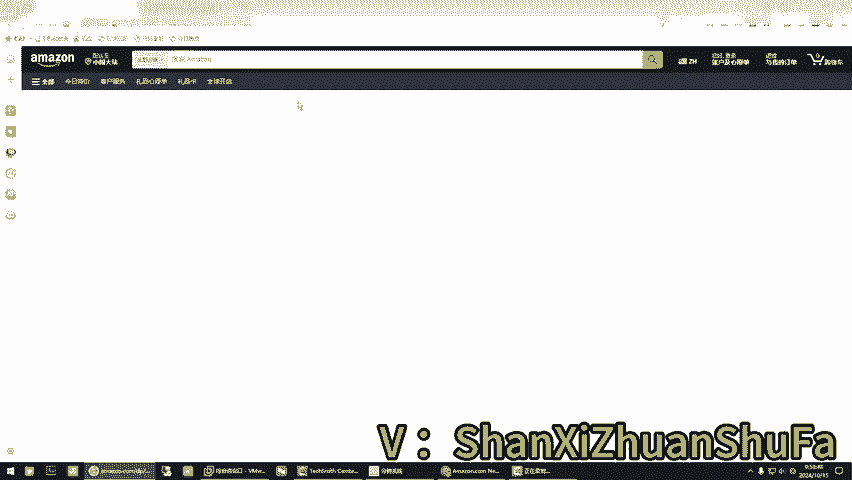
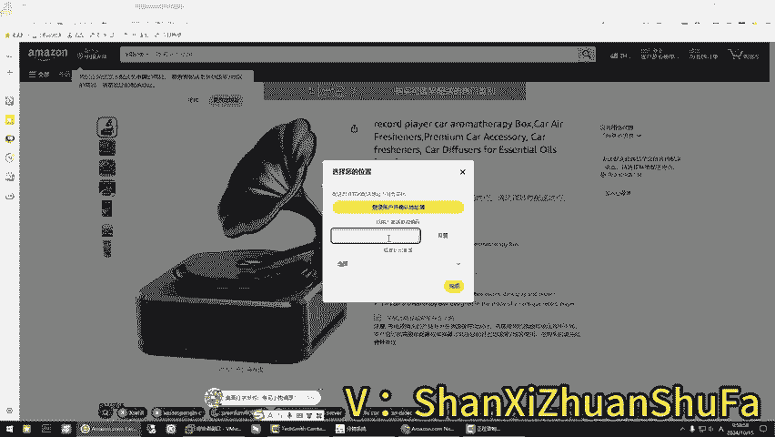
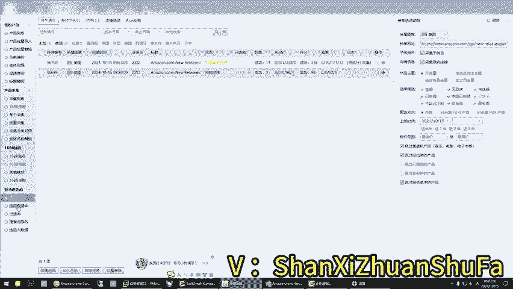

# 必看！你所不知道的亚马逊选品方法，亚马逊选品-鼎哥跨境说！ - P1 - 鼎哥跨境说 - BV1mTmHYeE2X

hello，大家好，我是顶哥，很高兴今天又和小伙伴们见面了。那么今天分享的是什么呢嗯。亚马逊的选品工具就是第四课。如何用这个榜单来选屏啊？首先呢这个是界面，这里面有一个榜单选品啊，新建一个选品。嗯。

大家看到了吧？我呢随意我随意就在这个咱们这看它AMZ123上面它有很多这个榜单是吧？很多榜单，是我就随便找一个吧，是不是我随便找一个这是它的榜单的总类目啊，你看榜单总类目，我们就找一个举个例子说。

我们找一个呃。配的就是这个宠物用品的类目啊，呃找个猫的，你看哎随便吧，我给大家找一个做做做演示啊。那我们把这个类目链接。它是这个小类目啊，小类目你看啊我放到这里，我放到这里啊。啊，这什么意思呢？

采集这个子类目就是说。它如果它本身就是子类目，它这个它这个没有什么作用。如果它如果说这个它底下还有类目，那就会采集子类目。你像这种的，它底下就是还是有类目的啊，你像上上面这个它基本上它就是子类目了。

那我们这个时候你看啊，如果如果你看它是什么意思呢？一般你选默认，你选那个全部，如果没有不点全部，你可能没有几个商品啊，不限近三年，你看跳过这个没出单的啊。基本上你看我们这样采集下来的数据。

我们等一等它会有个什么样的结果呢？这样的选品方式啊，你看作为1个FBM金铺也好或者什么也好。我们是要一个结果，你稍等一下啊，我把里面原来的数据库清除一下。榜单数据库，因为我之前是我们看一下啊。

那就是清空状态。我们稍微等一下，稍微等一下他抓来的数据啊。用行中哈就是给大家讲它是什么意思呢？有些时候啊，因为我这边的选品方法可能跟某些老师的不一样。呃，尤其是对这个FBM金铺一类的。

我用它来只是看一个市场，用它来去看市场，对吧？因为这个榜单，你看无论是新品榜还是销售榜或者标升榜，我我们大概率要看一个什么，我们大概率看的更多的是你有没有机会。

就是说在这个榜单里面做FBM的有没有机会啊，你不用管人家卖的怎么样，跟你没关系，我在视频里面反反复复强调过，大家做这个金铺，你不要试着想着往前冲啊，就是说你要控制好你的出单节奏，你如果真出单了。

你冲的前面了，说个很直白的话，如果你想当劣势，那我拦不住你，对吧？如果你想被别。人跟麦，那我也拦不住你。如果你自己有品牌，也就是说咱们自己有护城河的前提下，你冲的前面没有什么关系。

那如果说你自己没有这个护城河的情况下，你冲的前面你是不是就会被跟卖，被别人看到你是吗？嗯。我们等一等啊，我们看一下，因为它这个可能有网速延迟。我们等一等。对大家还在执行中。所以说更多的有些时候啊。

大家没那么难，你们一定要像什么学东西啊，学的是逻辑。那并不是说你手你你去你仿造别人的东西，你可以仿造。但你得弄清楚人家背后是怎么样的一个用营逻辑是吧？我们在找另一个分类的，它带的子类目的。

像这种它自己有子类目的，我们再作为这样的一个链接，再把它去添加一个任务啊，这个时候选择这个子类目。当然这种情况下是手动的那个全自动的也可以，就是说全自动。你需要把所有的举个例子，说榜单的链接啊。

你需要把所有的榜单的链接，你都把它去做到一个表格里面。然后你开启了外挂啊，也就是脚本它会全自动每一条它都给你采集，做一个类目的每一个榜单的都会给你采集。当然了我们用不上，为什么呢？因为我们只找够用的。

有些时候我们需要需要什么，我们需要一些精细化的，有些需要，我们需要一些海量的东西啊，我们看一下，你看它就把刚才那个咱们第一个第一个这个类目里就是。这个类目里面的。这个类目里面的数据他给你抓取回来了是吧？

他一共是抓了98条记录，过滤了两条。这个时候你看啊。销量排第一的哎，拍第一的是不是？这个时候你不用去关注人家注册没注册啊，你是选品，这个跟你没关系，这是人家商标注册了，跟你没关系，你选的是品类啊。

你大家你看一下销量，它一共是98个样品，就说白了第一页第二页过滤了两个，它有98个样品98个样品，这个里面居然有一个FBM的啊，这个这是通用品牌就就这个能排到前面去。也就是说这个市场。FBM啊。

他也有几率，是不是进得去，是不是进得去，对不对？你要看的是他能不能进得去，他是不是进得去了。你再往下看是吧？还有FBM的，也就是说整个第一页98个样本里面没有完全被FBA所垄断是吧？也有FBM的商品。

对不对？我的意思说，你别管人家注册没注册，你别管人家商标是什么？你要关注的是它这个东西它这个东西能挤入前，就是说前100名是不是行前100名，那说明他。是有有这个竞争力还可以，对吧？

那么你要做的是什么事情？我是不是反复在一些视频里面跟大家讲过要什么叫呃同类不同款是吧？因为他们的名字都一样，听懂是S网，名字是通用的，你可以同类不同款，是不是？那么我们看一下第二个。

那么这个估计也也会运行成功了，是吧，也成功了。那我们这个地方的数据也会多了，是不是现在变成了300多条记录，对吧？刚才98是不是它有别的东西进来了，是另一个，他连那个因为他连它的子类目，它都去抓取了。

是不是你还是看销量为王，你还是要看销量里面FBM的品是吧？你还是要看FBM品。🤧嗯。😊，我们大家看一下啊，是不是FBM的屏。就是这种方法，它不是说单独的你你马上就去做哪一款品。首先你把这个分类。第一。

你要看人家这个市场销量是不是代表市场。如果说整体这个类目啊，举个例子说，哎，它整体类目它这个整体类98个啊，你看338个，如果它整体类目它都不行的情况下，那你上去。

即使你冲到了前面你也不会有太好的结果是吧？那么如果说人家整体类目的销量是可以的啊，那销量是可以的那没毛病。那你是不是说。你首先选品是不是选市场，你因为FBM是点对面，它不是FB点对点。

你要搞清楚这个东西。FB和FBM是两个完全不同的东西啊。所以说你首先得确定这个市场，这个市场，就是这个面。你确定了这个面以后，你在这个面里面去挖掘背后的蓝海市场。举例说哦，这个是FBM的。

它做的是什么东西啊，它是狗笼子，是不是你可以去参考它同类不同款的，人家肯定有些时候它做的是海外仓，知道吧？有些时候是海外仓的不是呃那个FBA仓。所以说你自己要去看，你看明白了以后。

你就想想他是1个FBM的，为什么它能冲进来？像这个面具吧，它为什么能冲进来，是不是？哦，我们换一下浏览器，它为什么能冲进来？所以说有些时候啊顶哥跟你讲，抛个砖引个玉后面的事情如果你想做好，对吧？

你自己要琢磨事儿了。但是我们反过头来讲，是不是这样一个很简单的方式能让你确定这个市场，确定这个市场，你还做精铺能不能进入，可以吧？你们没有必要去看那些今天这个数据，那个数据你看多了，你会看花的。

尤其是作为一个新手的，你你真的会看花了，你知道了吗？有些时候笨办法是最好的办法，越简单的方法越好操作，你别搞那么多复杂的东西。我还是那句话，你搞得太复杂了，你把你自己会搞死，你不要不相信啊。

你会把你自己搞死的，真的。所以说。简简单单的是吧，用一个很简单的工具，我们马上能判断出来你要做的这个东西的市场。那这个东西是怎么来的呢？你看它又有一个源头，你是为什么会这么想，你看我首先举个例子说。

我在这个里面有个商品是吧？我在这个里面有个商品，哎，我这里面有个商品，我随意我随意找一个啊，你看我随意找一个东西啊，我只是给你随机是不是随机找一个东西。

是不是假设假设我去去到了这个呃一个亚马逊的前台这是假设啊。

我们先改了地址啊。

假设我们是不是找到了一个品，对不对？那你进了这个品以后，你你会不会看到它的分类，你会不会看到它的分类，就是小类，你会不会看到是吧？你如果看到它小类以后，你进去，是不是把这个链接就夺取了，是不是？请问。

是不是这样子的？我改一下浏览器，因为现在没有设置的，没有。做的默认是是老跳到360去啊，这个360是一个很有意思的浏览器啊。好嘞，那我们这个时候我们随意找一个吧，我们找一个销量好的哈。

我们找一个销量好的。我给你们大家把这个东西讲明白它是什么意思。你你不用管它是什么东西，你不用管是怎么获取这些。有些时候你不知道怎么获取小类。那我们等一下啊，他小类就出来了。如果你装的插件里面没小类。

那你从这个地方也能找到小类，是不是？网速问题，你看是不是这个地方也会有小类。那么你点右键新新新文件打开，是不是是不是你就把它的这个小类拿出来了。我的意思说。

你不知道没有装一些举例说卖家精灵或者欧陆一类的插件的时候，你怎么找找小类？这个地方往页面下面拉，它这里有看看这个地方就小类。你点开它以后，是不是就是它这个小类排名，整个小类就出来了，这个是它的大类啊。

这个是大类。这个是小类，我现在点不开，因为这个你看。网页有问题啊，那我告诉你们方法了，你点开它以后，其实就来就到了一个什么地方了，你就到了一个类似于和这个这个随便点一个，你就落类类似这样的列表。

你就到了这样一个里面了。因为我现在你看我打不开是吧？这个网速问题。我敲定不了。那我想要讲的是给你这个思维，这是一种选品方法，一种思维。你第一，选品不是说你马上就能选出来，是一步一步的筛选。第一。

你要确定你的合适的对标产品，那么这个是不是一个合适的对标产品。我没有说这个东西你能做啊，是这个思维，你想清楚，如果你不确定它这个东西，整体对你来说，你容不容易进入进入这个市场。

那么我建议你你去去小类里面爬一下，爬完了以后是不是得到这样的一个数据是不是会是不是会得到一个这样的数据，对吧？那你这个总体看一下它。看一下你想做的这个模式，它能不能进入这个市场。FB多是很正常。

如果你FBM相同下还能进得来，销量还可以。那这个时候你是不是要去深入的去研究一下了。好了，这节课我们就分享到这里啊，抛个砖引个域，这是悬频工具的第四节课，以后我会慢慢的给你们讲它这个每一个是怎么用的啊。

每一个怎么用，我会告诉你们怎么回事情啊。OK再见。

