# 必看！新手亚马逊fbm怎么选品-不懂就问，关于亚马逊选品的所有问题都带你实操！ - P1 - 鼎哥跨境说 - BV121sreSECi

好，鼎哥你好，今天呃开始喽，你先你先点开这个啊。你是不会打开这个吗？打开这个选择这个看嗯，咱们直接上来就实操。哎，怎么是移除呢？这个虚拟机怎么了？怎么出问题了？不。哦，你应该是开的一个呢。

应该是开的一个。对，就这样呢。

啊，你不能同时打开，就是他开着的时候。咱们就实操了啊。啊，你先等一下好，行，那个那个就是咱们打电话时呢，我是用手机来接通，能不能用电脑来接通呢？你是说咱俩语音通话是吧？😊，对，那可以的呀。

你你你在电脑上的微信接接通不就行了吗？挂断了再来一次就好吗，你挂断了，你你用电脑连我，你挂断了，你用电脑连我嗯。好的好的，哎哎哎。😊。

🎼。🎼这期呢还是带着小伙伴，一个刚入门的新手小伙伴，昨天给他弄了电脑系统的调试，今天开始使用工具实操，今天开始用工具实操了哦。

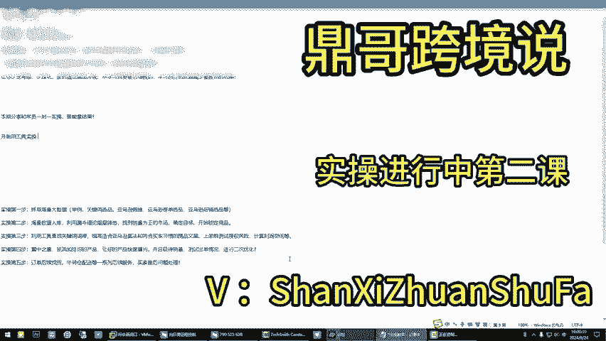

这下可以了吧。那，这回可以了。好的。等到进了系统以后，我给你调试一下程序，没毛病，你今天就去干一件事儿，抓数据啊，先抓数据，抓完数据，嗯，教你怎么搞。哎，他怎么卡在这里不动了呢？稍微等一等。😔。

那这个时候呢，我来给你。我就不知道怎么就跑到你这个桌面去了，这是让我很很很脑袋大的一个问题。我不知道这个这样，我就是点击右下角啊，右下角右鼠标放到右下角这儿一点空白的地方就到这儿了。

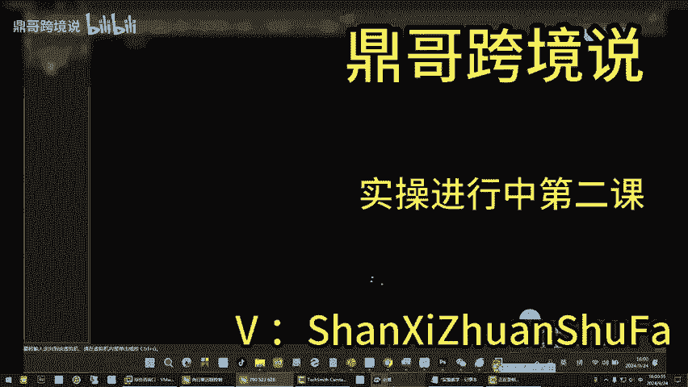

你登录一下这个系统播放这个地方是做产品使用的啊，你看添加商品。这个地方就是让你把你做好的图片，举例说啊，把它图片导进来。这个可简单了。后面我给你发的视频里都有很简单，没有像后台那么复杂。呃。

重点它在这个地方啊，这是二代选品啊，二代选品的时候，这个地方你先跳过，因为后面我会陆陆续续的给你把程序外挂写好啊，你直接看这里，你先变脑子，你看这里它不是有数据吗？北美是吧，你看啊嗯嗯。

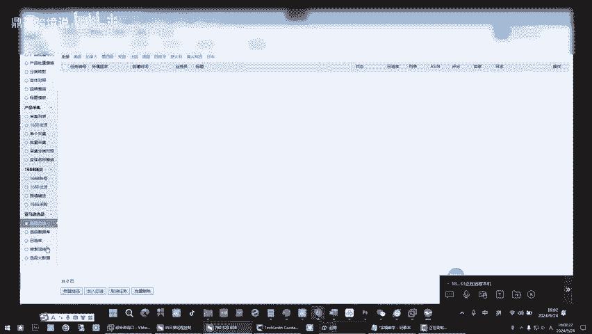

你这你在这里去练去试，你记住，不要怕犯错，永远记住，不要怕犯错，知道了吧？嗯。这个关掉，重开一下，好像是卡机了。

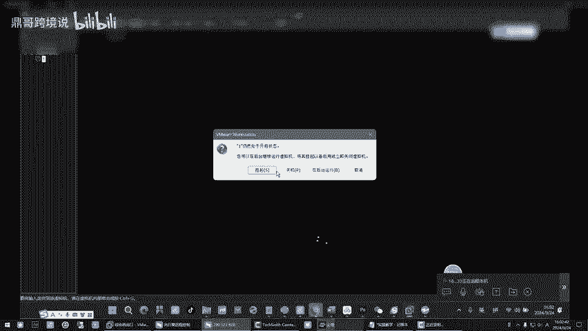

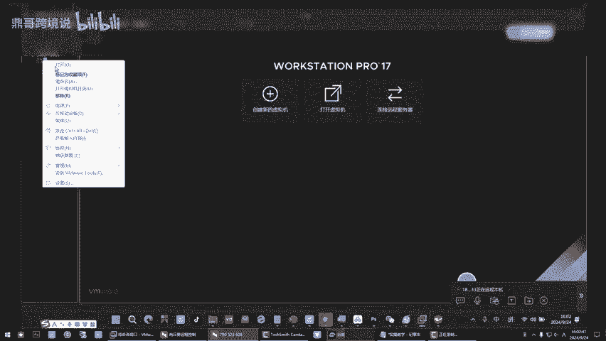

我就始终不明白这个这个在哪儿，我也不知道他在哪。没关系，他那个我昨天点开的时候也有嗯，让他拍。

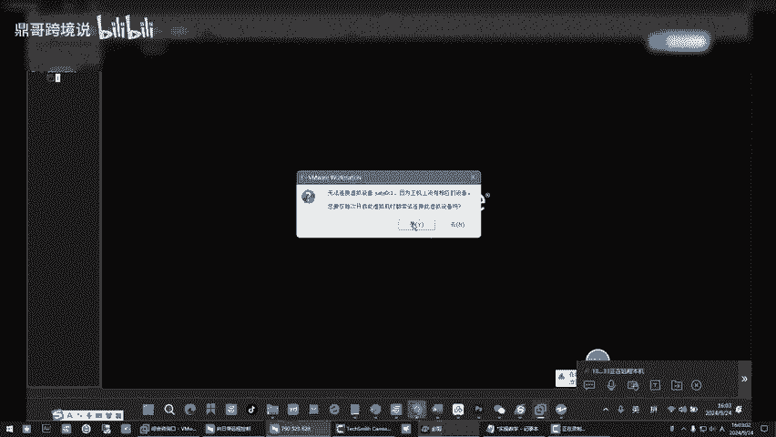

你看啊。我们先从自发货开始，你就选这个自发货，是不是中国自发货，我们肯定目标针对的是中国卖家的。你看这个地方是不是有注册的，未注册的，是不是？对，无品牌未注册。你现在你先从这个未注册。或者说无品牌开始。

你知道为什么？因为一开始你不要去盯人家有品牌的，后以后你可以去盯他。因为你现在的段位，你还没有办法去搞这个有品牌的和这个已注册的对吧？嗯我给你简单操作几个东西，你看啊这个排名小类排名也好。

你先别管你只看销量就完事了。一个月举例说50到100单是吧？嗯嗯，你咱们不要去，你看半年内上架的这个你随意自己选，是不是出来很多数据，是不是？对你你先别管他什么玩意儿，你先去你先去打开他前台去看一下啊。

我建议你用用那个。谷歌的对呀，容许，你看你最好把你这个东西关掉。这是啥呀？我你你你你啥呀，就你自己电脑里带的东西呗啊，这个很麻烦，你尽量。尽量是用一下谷歌的浏览器啊，这个是不是谷歌的这个不是吧。

这是EDGE这是这是IE吧。EDGE就是那个东西。现在IE叫EDGE。你把这个地方你先关掉，你把它设置为默认浏览器啊，默认的这些是这个是谷google的浏览器。对我们默认都要用google，你今天要去。

嗯，这是还是这个还是那个EDGE你在你看我，因为我都给你录着像呢，知道吧？你不会也没关系，我都给你录着呢。然后你去B站的时候。

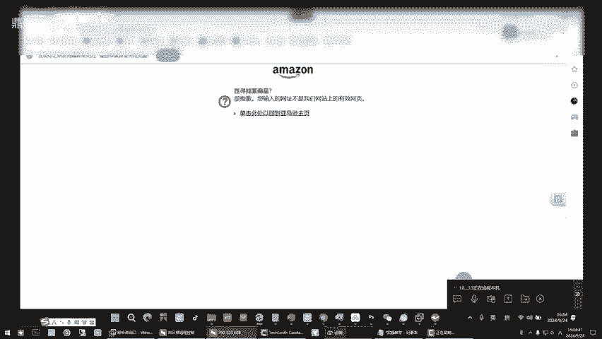

你就能找到我跟你这个沟通的视频，但肯定有些信息我是给你抹掉了，对吧？不可能暴露出来的。他这里不是有个浏览器嘛，是不是嗯呃有一个设置。默认将google谷歌这个设为默认值。好。

那这个时候我们再在这里再启动一下这个启动一下。

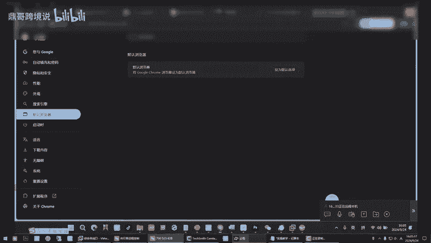

那这种情况是它变狗了，你不用管它啊，这是他我先给你把别就是点哪儿的，出来这个呗。点哪出来的啊？来，我跟你讲啊嗯，对。在这儿。看到了吧？啊，我是不是跟你链接，是不是给你随便找了找，就出来有销量的，变狗的。

就是死掉了。你继续下一个，你继下一个，你我的意思，今天跟你讲把逻辑思维搞清楚，你先别管它选不选你做，你先别管他你做不做这个你要搞的是你先要找手感和严感，知道了，这个是二代选品。

二代选品里面的数据它没有没有一没有一代的数据全核心，但是有些时候你作为一个参考值，你看我就随便给你点进，有的你看有的就有是吧？你作为一个参考值。还有你今天你去注册一个。

就是把一个什么东西注册一下卖家精灵的账号，你最好去去去搞一个淘宝上很便宜的啊，7天的那种二三十块钱搞一个。

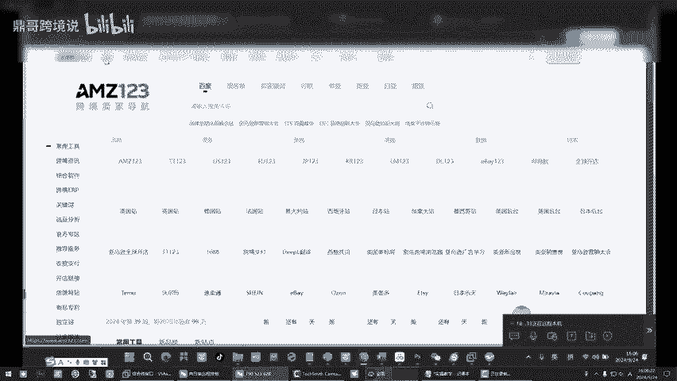

搞一个网页版，网页加插件版啊，今天你做一个事情，因为再把这个东西去注册一下，这个是免费的啊，你把它注册个账号就行啊，注册这个账号为什么？因为咱们的选品理论是是这个地方。

你看举例说卖卖家精灵的销量加这个欧陆的销量，再加我们软件自己的销量，三个，你记住三3个三个加起来除以3再除以30，你就能得到一个结果，得到个什么结果了，得到一个你大概率知道它的平均值啊。

你大概率会知道它的平均值。是哪三个数据呢？那，等一下我给你哪三个数相加，你先把这个插件先去把它安装啊，你先把这个插件。

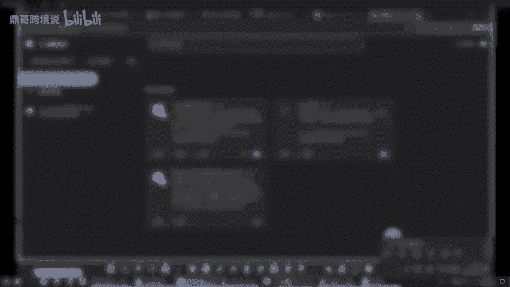

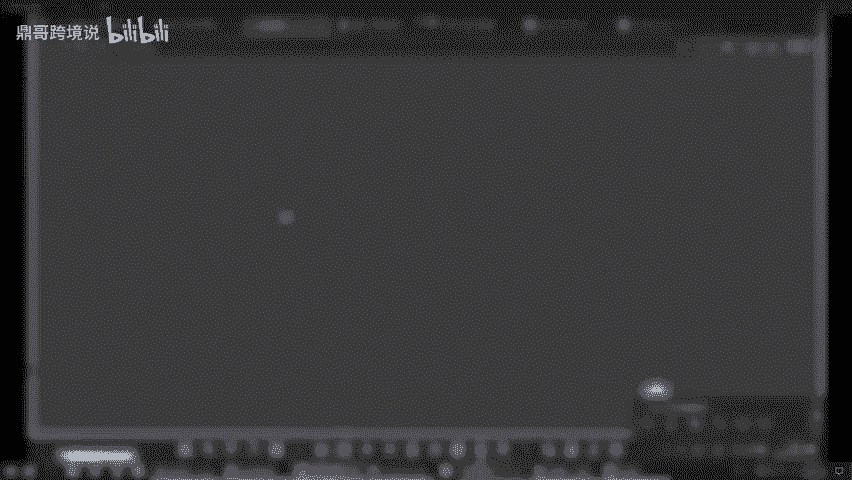

你有没有快乐上网，就就那个那个我我没有办法讲那个东西。就没有，那你最你那个东西你是需要去去搞一个的，因为呃有些是需要那个搭建一个，你懂吧？那个要不然你你用不了，尤其是日本站的前台。EDG是可以打开。

但是有些是还需要那个数据的。我们先去装它的插件，一会儿先去装一个。呃，先去装一个卖家精灵的插件啊，先装了卖家精灵的插件，装了卖家精灵的插件。就今天你把这个这个注册了也要，我们也要去装一个插件的。哎。

首页。😔，再来首广告。哎，对，插件。

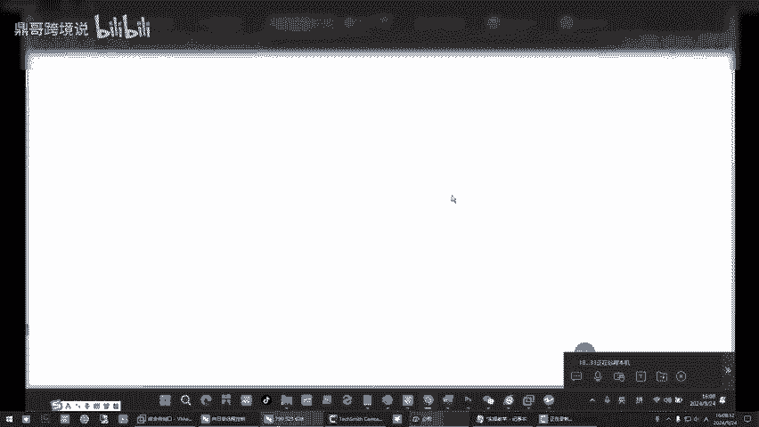

不能等我去求一支笔啊，我呀，你的电脑是怎么回事情啊，需要重启。

关起。

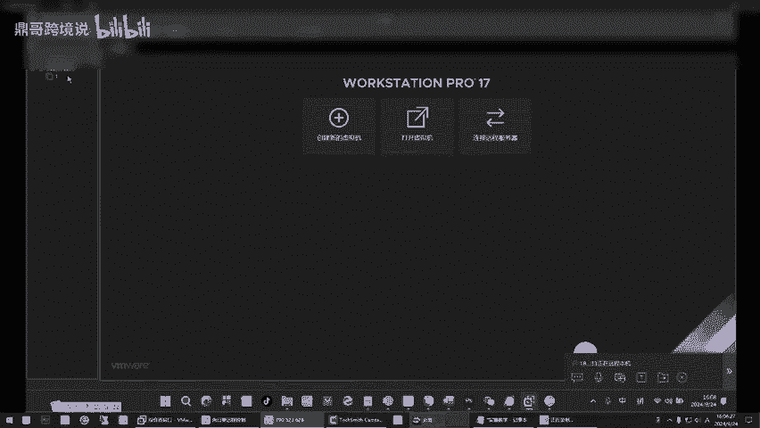

就是你记住一个公式，因为所有的查销量软件它都是虚的。所以说记住为什么要参考卖家精灵的数据，参考欧陆的销售数据，再参考这个这个软件里的销售数据，知道吧？三个加起来除以三再除以30。

你大概率就能计算出它计算出它的平均值啊，它当然不会是百分百总天吧，对，一天你除以三再除以30，就大概率计算出来几天能除以一单或者一天出几单。嗯，麻烦您再说一下，就是就是上个数据卖家精灵的销量数据。嗯呃。

欧陆的销量数据。

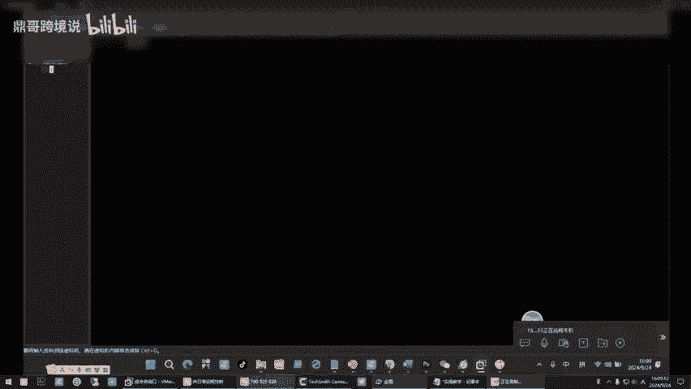

加加。软件内自己带的这个销量数据啊好嘞，三个加起来除以3，再除以30，就大概率你能好嘞，看到他。一天出几单或者几天出一单。嗯，嗯，明白了，我先给你弄的，把插件给你装了啊，你先把插件先装了。

干啥你也得需要一个好的。

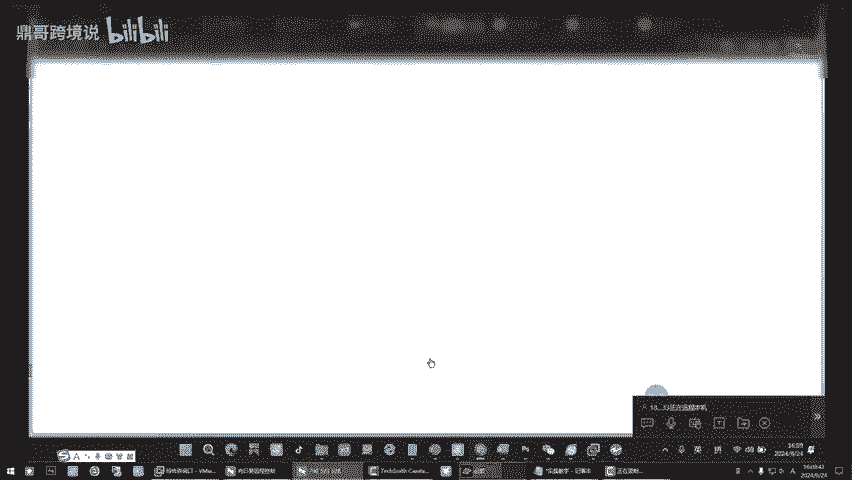

我一会儿给你完后下了课，给你发一个发一个链接，就是那个那个那个快乐上网的链接，你去好嘞，注册注册一个。然后那个是需要消费的那个因为我们自己也在用的那个东西的话，的，里面你就去。去找一个一年的就行。

一年也就100多，就154。因为因为你你那个东西你必须得用到，你不用到是不行的。嗯，尤其是以前是想买，不知道我给买哪个啊，我给你发的肯定是我自己用的，就是我都用了好几年了，以前我自己做过tktok。

因为我就用的那个东西。好嘞好嘞。😔，就是一些这种技术问题的话，我来去先帮你搞，因为你不太懂，对吧？这个这个电脑操作的东西。好，他解压到什么地方去了，我看一下这个目录。

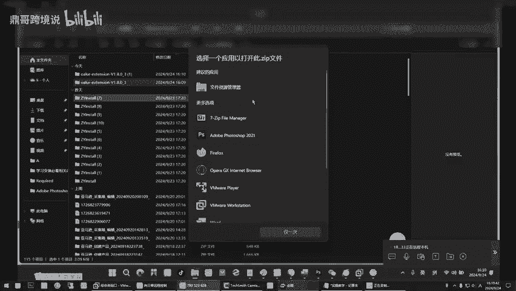

Cipan。😔，到老哒。嗯哦哦，我大概知道了。这个链接。也等一下在这个地方去。同步扩展程序。加载。把这个链接放上去。他你看为什么。你下载了，因为它是下载那个是。滴地落的那个是这个东西不一样。你看在这个。

下载里面它就没有。是吧。嗯嗯。所以说。这个有点麻烦。

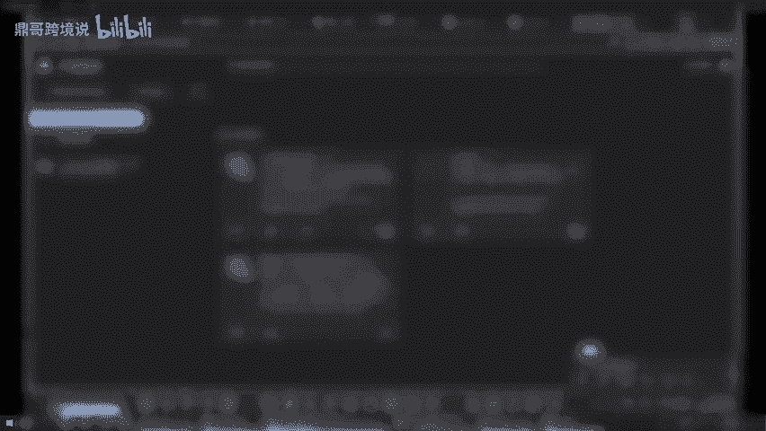

就是他在这儿，但他这个目录是这个。

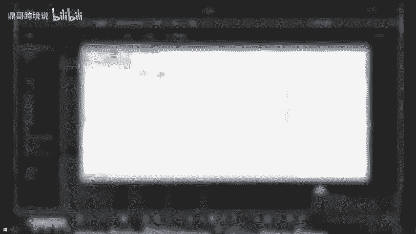

就是说你要找的是C盘。不下载了不是不不是你C盘。你得这个地方找C盘。用户。这个。用户里面的这个。还是这儿，但为什么没有那个程序呢？奇了怪的。解压出来的为什么没有？啊。

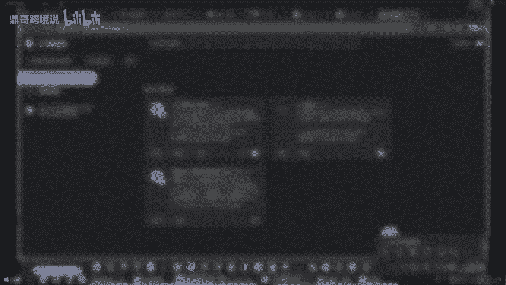

你看你重新安装个解压工具吧，这个工具。

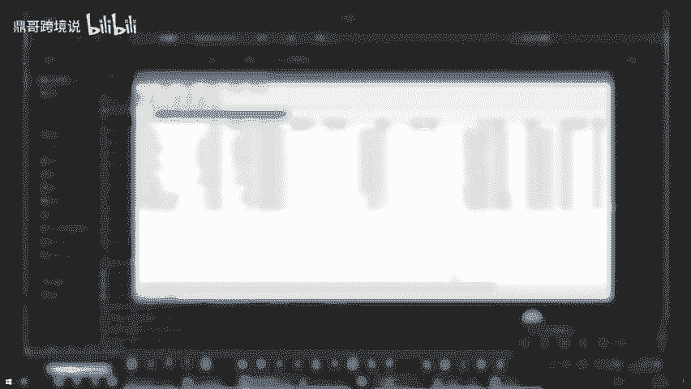

解压的。嗯嗯，其实我们已经下载了，你发现了吗？我看到了。下载了以后，但是它是需要解压。那么解压的时候，它应该。没有解压工具，它是个解压，但它没有解压，没有解压成功，没有解压出我们想要的结果。

它解压出来的路径是这个，但是这个它是dlo，你看那个是下载，它不一样。

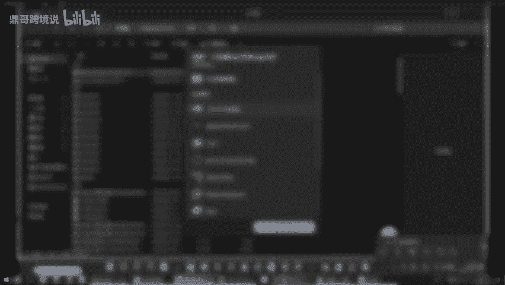

你那个目录跟他是不对的，你那个目录。你明白这意思，你的实际下载目录。你跟这个是没有关系的。你看你这个目，那是不是在桌面呢？等一下，我等一下，我看一下，我以前我设哦，我以前我设置过。

所以我下载的东西都放在那桌面了。你等一下哈，等等等等。你看看这桌面有没有。这个是吗？这个这个不是，这个是百度。这个不是不是不是不是。这个是百度。它其实就在这个地方，但这个文件夹是不对的。

你看是不是这儿对吧？嗯，他在这儿，那我们找的路径，这个路径就是。直接下载。但是你看他就没有。那点这个点这个呢，今天下载呢。今天下载的你你看点开它没有。这个不对不对，所以说不对。

他这个目录很很那个很麻烦这个目录，这个是子鸟的目录。你看按道理说。他就是这个里面，按道理说，它就是你以你的这个名义开头的，知道吧？开头的这个。这个下载里面，你看9月24日是吧？看明白了吧。

但是它里面是空的嗯。所以说。哎呀，这个就搞的人很麻烦了啊。是的。😊，我们把它换一个目录去解压一下。你打开的时候，接到桌面吧。啊，你把它复制到桌面。嗯，复制复制这个到桌面去。嗯，好。啊，稍等。

但是这个你还是得解压，你必须得解压出来。你最好就装一个。呃，重新装解压的软件。对，装一个那个温ra，或者说你不要用这个77什么的。你就那那现在装吧。你现在打开，它只要能目录在桌面也行。你看他的目录在哪。

你看你看他是不是默认就给你跑这儿去了。嗯。那啥呢？我们编辑一下，吧大家看能不能更改路径啊。我们设置一下能不能更改路径。文件夹。系统临时文件夹指定位置，我们更改一下。出面是吧。嗯嗯。对，我们试一下。

我们再重新把它解压一下。你看还呃桌面有了吗？现在。有没有解压出一个新的来？有没有解压出一个新的，我怎么就没看到呢？还就这一个没有了。我就不知道我就找不到他在哪里解压出来的。一直是这一个。哎呀，你这样吧。

这个问题怎么解决啊？我给你发个发个链接，你去搞吧，你去用那个东西来搞吧，那个直接直接在线就能装。你这个你这个电脑有点神奇哦。哈哈。是吧。是。因用这个能打开，但是。

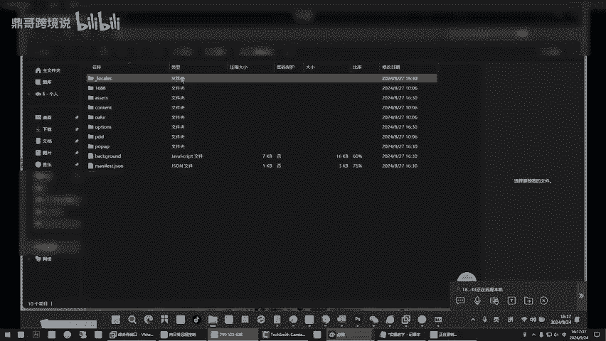

这是有点神，那你发链接吧，你给我发链接吧，重新弄吧。对他有点耽误事儿，有点神奇。你说这玩意儿。桌面上他也没有看他也没有是吧？嗯。我们先不管他这个了，等一下等一会儿，然后我给你发个链接。

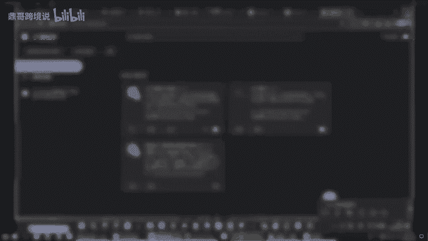

嗯，发个链接去搞，我们先看虚拟，我先给你。把该调试的调了，我先暂停一下，暂停录制，我给你发链接，我给你来，现在我在接着录啊，我来给你解释啊。

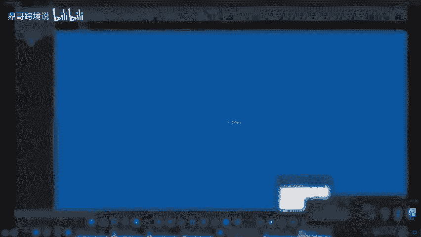

未注册他就什么都没有注册的，就是他为这个叫白名单，这个东西叫白名单啊，无品牌就有些商品它是没有品牌的，没品牌，它有白名单，有那种。哎呀，怎么其实他俩差不多，未注册，他就是没有注册过的无品牌，就是无品牌。

你看。看明白什么都没有空的。空的。Oh。他有些但是他在上架的时候，有如果没有白名单品牌词，能让他上架吗？呃，后面我教你怎么搞啊，怎么去检查它是怎么回事情。我现在先给你把那个搞定，咱们你打开你的谷歌。

我先我先把那几个插件搞定，我看见你的那个。呃，叫什么那个东西也好了，就是那个虚拟机里。今天咱们把主主要的先先搞定啊，主要的对不对？好的，一步一步来嗯。好的。嗯，谷歌已经打开了嗯。

然后呃鼎哥先给你把那几个东西先装了啊，装了以后呃好，我们打开AMZ123，抓紧点时间，我来给你搞这个啊。嗯嗯。如果它有两种装法，一种就是在这个地方啊，在这个地方管理程序，这个地方有一个谷歌商店。

你直接上谷歌商店啊，现在你就能打得开了，看见了吗？呃，卖卖家精灵，你这可以这样子，对啊，你用这种方式来装。如果你你链接了，就是刚才我是不是给你连上了，连上了以后，你用这种方式来装，这就快看明白了。

很快吧。

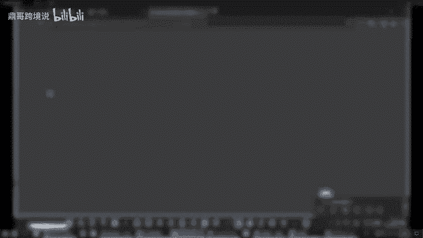

嗯，然后等一下啊，再给你再给你。谷歌商店这个地方再装一个欧欧路欧欧路那个字儿是哪一个O？这个哦草那个哪一个路啊，路路路。就是抓紧点时间，我们把正事儿干了，对吧？这是是不是啊？首先咱得干这事儿。

我是不是这个我不是这个路。他这个路是哪一个路来，你给我看一下这个这个这个路这个路啊，路啊啊，对对对，我们我们搜搜索一下。那个路路路是哪一个路？Okay。你说你自己说对，你说嗯。你来搜。嗯。路。啊。

你就这样搜一下，看能不能出来。哦，有有有有盲打他就出来了。好，这样子。我再给你装1个ALIPRICE稍等稍等啊，我给你再装个东西啊。ALIPRIE。这个1688助手1688助手。中国。TB啊这个。

这个是早货的啊早货的。先不管它了，我先给你把程序调试好，你该该买东西买东西，该什么，知道吧？只你只需要搞一个那个叫什么呃，卖家精灵的群。你看啊，你先打开这个打开这个你的你的账户，你自己登录。

我不知道你注册的账户是什么。我再来给你演示一下数错。对，因为我不我不清楚。

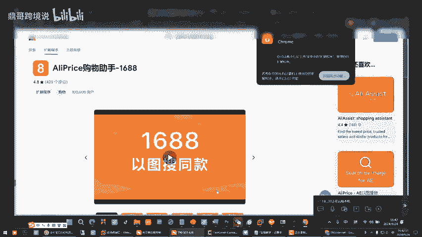

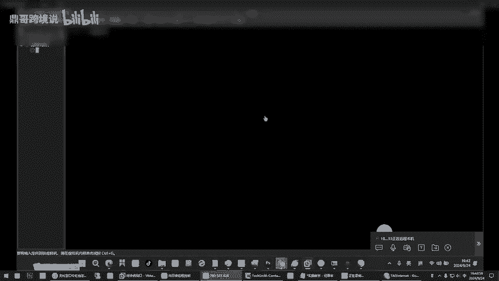

哦，已经已经已经是吧。对，好，登录一下。呃，昨天我给你的那4条，你获取了没有？如果你获取了以后，我获取了，哎，我我都获取了，获取了，它就会在这个地方出现。你看是不是有是吧？哦。

我们啊还真有先检测一下你的谷歌浏览器正常不正常，对吧？我们这个地方先看一下，今天你先你先学会怎么使用工具，咱么抓数据啊，好吧。嗯，好，因为你你得慢慢的来，设设是慢，其实是快。

我不建议你一下子搞得你你会晕了，知道了吧？你把逻辑关系搞清楚。刚才给你讲的那个东西叫盲选啊，不是它有数据了，你现在去看你不用去不用去怕他错，知道什么意思吗？胆子大一些，因为他不要钱，你看顶哥怎么操作啊。

A对应的AB对应的B，它是一个什么原理。你看他打开是一个什么原理啊。这就是我在昨天跟你视频的时候，在问你之前是怎么选的。好，我们现在用一种工具替代你之前的方法，好吧。

嗯嗯嗯这个时候他会提出一他会出现一个框啊，咱们这是真的是实操。咱俩是就和直播一样。你看啊这个地方它会出一个框，你现在先把这个拖到旁边去，你把你昨天注册的这个账号注册了吧。这个啊对他注册了哎。

你你你不要这样子，你自己在这里放，因为啊没事，我会给你打码的，没关系，你输吧，我会给你打码的。有的嗯，这些重要信息我都会打码。哎，拖过去拖过去。对。我大概率给你讲讲5点钟我们下课。

因为其实今天的课并不复杂，是咱们两个操作别的事，又耽误了事儿了，嗯，对吧？对。😔，你看你登录了吧？好，登录了之后，你就点那个确定。你你看神奇的事情开始，你不要动鼠标了，我也没动鼠标，看明白了。

他现在给你自动再开始把所有的数据先给你拿下来。你别动鼠标就行。你看为什么让你装虚拟机，你现在去回你的桌面，你打开这个桌面，是不是他在里面跑数据，是不是嗯，你不影响你桌面去桌面去筛选。

你看你看一会儿我教你这个地方它会出数据。这个地方记住它是二代选品，这个地方的数值你自己去筛选价格区间啊，排名，你永远记住排名要选择一啊，或者这个地方排名选择，只要选择了一，它就都是出单的产品。

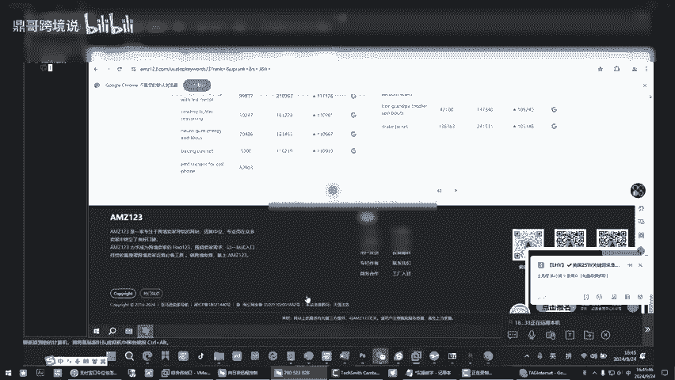

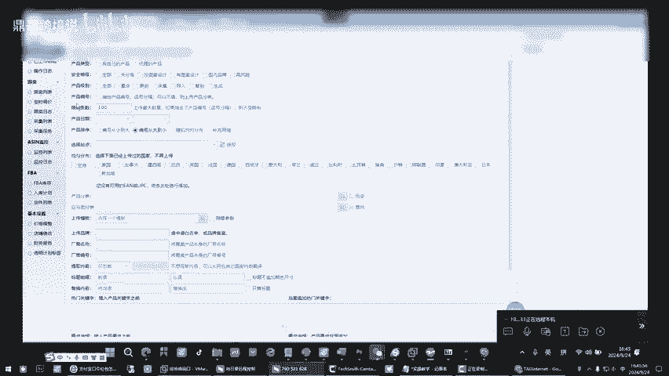

知道了吗？只要选择一，它就是出单的产品。只要你出过单，它就会有排名，这是亚马逊的铁规则。这个地方你会去你自己去看，你不你不用担心你选错，知道啥意思吧？你不用担心你选错。哦，你不用担心。

有些时候选品举例说你能看到的，别人看到顶哥，我们讲我教你的是看到就就和咱们钓鱼一样，你看到一个东西，我们要找他背后的蓝海市场啊。那个那个咱俩我给你教你，但我就不不咱们就不录了，知道了吧。

你自己知道就行了哦，就是这是个这个吧，就是录下来，让你这是最基础的操作，你要记住它是怎么操作的。熟练工嗯。我们我们你看他这个里面是不是还在给你自己跑数据，是不是对吧？我们谁也没有动弹，是啊。

这个完了我再给你演示一下，你今天就多练这个把这个练完了，明天或者后天我教你怎么筛选，我教你怎么地，你就能你看我再给你重申一个定义啊，选品其实选的是对标对标产品，选到对标产品以后。

我们从这个对标产品上去挖掘它背后的蓝海市场，就是我昨天是不是跟你讲过，你叫刘某某同名同姓的人非常多，是吗？嗯，对吧？但长得不一样。我们就要在这个涨的不一样上面下功夫。而我们这个名字又都叫刘某某。啊。

就是我在这里给你讲这个，等到在等你上架作品做文案的时候，你就知道怎么回事情了。嗯嗯。就咱们这进度是快的，我基本上我抽我的时间，因为这两天就明天我明天人家是正日子，就明天回门嘛，正日子啊，今天是去帮忙。

今天出嫁，明天所以说还得为你去喝点呢，哎不喝不，不能开车不敢喝没找我开车呢不敢喝嗯。现在交警查的非常严，你就骑个电动电动车啊，自行车要查你带脚蹬子的，不查不带脚蹬子的那种电动电动车。对，逮着你酒驾。

是都查的可狠。对，这不过人家也是为为安全考虑。所以说你看它它就会生成一个桌面生成一个文件啊，你看是不是美国数据A一会儿B，你自己操作啊。你看现在呢接下来我们要操作一个什么点这个启动启动了以后。

把它最最点用个这个这个箭头，让它去最右边我们现在嗯。就干什么事啊，他现在应该不出意外，他会自动操作。等一下我看一下啊。我先关闭一下，每次第一次启动的时候。他要这样子要关掉，这个，再重新开哦。

因为他这个程序没有办法，就是两个程序合起来是8000多个关键词。哦。这个和网速是有关系，你看现在开始了哦，对。没有，我就绑定你的店铺，稍等一下啊，这个要停止。哎，好。

要绑定你的在这个这个里面要绑定一下你的店铺啊。你现在把你店铺的邮箱发给我，店铺的邮箱发给我。我现在给你绑定，对，就登录邮箱，等一下，我先暂停一下啊。对我继续开始。你看我刚才给你设了设置了A。

你就设置一下B，你不能点B，你不能直接点B。为什么？你因为你没有执行这个B，先执行了这个B啊，采集B，你点这个采集B，你点这儿，他得先把那个关键词的数据给你抓取回来，你才能点那个全能B，知道了吧？

你看现在是不是因为你之前登录过这个登录过这个MZ的账号，你直接点确定，直接点确定就行了。点确定，这里有个确定。好，现在你不用管了，你等着你让他把B就是右右面的数据，知道吧？A就是左列的数据。嗯。哦。

你看抓完了用下B，这是第一代第一代产品。那第一代产品它是数据最新嘛，因为热搜词是亚马逊自己提供的，它数据比较新。那个二代它是已经抓好的数据，从那个里面你再去再去搞。他有些时候你就看到它就变狗了。

因为它数据比较时间长了。变狗就是被亚马逊给干掉了。喂。哦哦在听啊，我还以为断线了又。没有我听有点有点晕啊，不用，没事，你就知道他怎么操作就行了。所以说我不跟你解释那么多，操作完嗯有了数据，明天啊。

如果下午我回来的找，我再找你。我跟你说抓完数据以后怎么怎么干，你要干的是把卖家精灵那个去淘宝，就说索卖家精灵账号，网页加插件呗，谁的便宜，你就找谁，这个你会吧，是吧？谁花的钱少就找谁。

你你就需要买一个那个别的也不需要。嗯，等你抓完了数据，我再统一跟你讲一下这个流程逻辑啊。你这个就这一关你是需要多练的，多练练的练的手感和眼感后面。写文案那些就简单多了。上品更简单。

那个不像你之前那样上更简单。啊，哪能一天搞一个搞一天。我真搞一天，昨早上起来睁开眼睛开始搞，一直到晚上11点。你跟顶哥，我不会让你们那么麻烦的。很简单，你看现在搞数据不用你了，你这是电脑，这不用。

那他在给你干活，你要干的是这是在外边，外边这个地方这个这个列表，你看是不是出来数据了，你是不是我们才听了几个关键词，这就是热搜词里啊，那个热搜词啊，是不是热热热搜词就变成了as森是不是变成了A森。

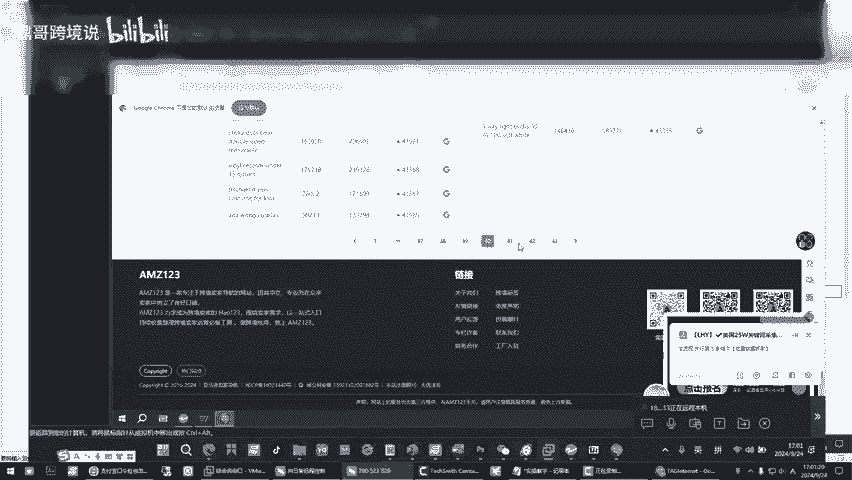

是吗？在哪呢？A啊，那就是那每一个热这个这个这个每一个热搜词变成了A森，因为我们才添加了6就添加了6个关键词。因为我给你停了嘛，我要让你操作嘛，对不对是吧？那你那你再他是不是你看运行成功。

就是那个你看我再给你讲解采集B完了，那你要点这个这个美国，你全能B地主第一步是采集B，但是这个采集B只用一次就行了啊，因为他抓了数据了，你每次不要去老点，只要他采集完成，你后面只点AB就AAB交替。

你看点一下点一下这个B啊，点一下它。把这个关掉先嗯，你点一下这个B啊。点一下这个B点了它就那个点了它运行，完了把这个把它去这个这个箭头点过去。点啥点而就不用管了。如果是这种情况，你就不用管了。

如果你看他也在执行是吧，我尽尽可能的，你看你等一下啊。记住一点，你重来一遍。重来一遍啊，我们重来一遍。嗯，你这个地方一定要最大化。最大化的时候嗯点这个B，我听你点一下，你看你自己点吧。嗯，点完了以后。

把这个箭头点一下这个箭头把它速度一点，这不去这儿了吗？是吧？行了，你别管了，剩下的事你别管了，好吧，是不是他已经开始运作了？😊，不用管了吧，行了，你可以上桌面上，你就点开桌面，这个你你就完事等就行了嘛。

是不是你看他是不是开始用作了，是不是嗯？他运行100条或者200条时候，他就停了，没事干进去。如果说运行停止以后再重新开始就行。遇到什么报错给我留言。好吧，咱们今天我就本来就先教会你这个工具怎么使用。

用回了工具，明天或者后天明天有时间我就告诉你下午，没有时间，就是后天再告诉你，这就开始带你上手选品了，那你拿结果了，行，知道了吗？没事干的时候，在这个地方琢磨，我刚才是不是给你演示了。

你就在这里琢磨数据，你随便看，随便点，他不问你要钱，你怕什么，你就点进去看呗。嗯，是不是变狗了，你就把它删掉吗？是不是？

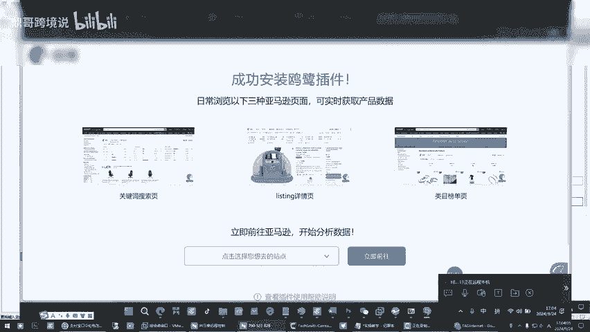

听懂了吗？把这个欧陆你也注册了，把这卖家精灵的号也搞定好不好？今天是你的作业啊。好，明白了吗？学会使用这个外挂，完了把该注册的注册了。明天有了些数据以后，我带你一步一步来，好吗？

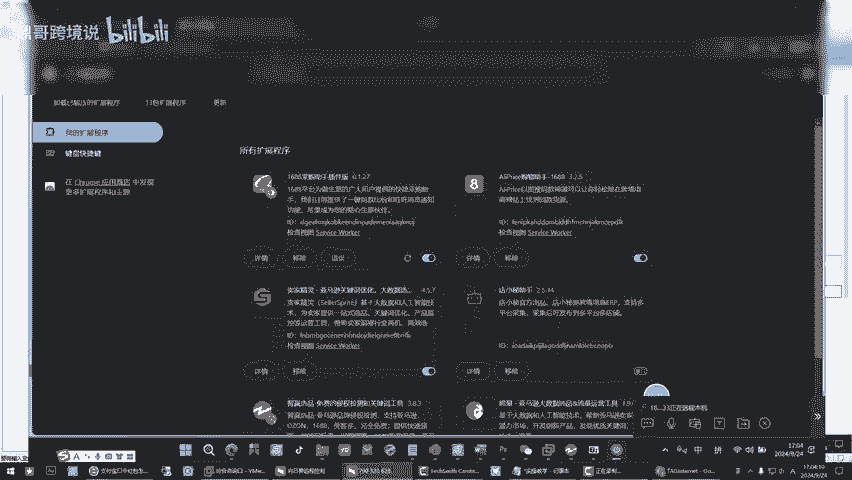

嗯嗯，你一定要自己学会，为什么让你交作业，你多练你才能会啊。你你不能说我都都还在我身上，那不是白搭了呗。是我知道知道一定要拿结果啊，你看妹子一定要拿结果，我们每一次的沟通一定要拿结果。

