# 必看！新手亚马逊选选品实操，有手就会，超简单的亚马逊选品实操技巧！ - P1 - 鼎哥跨境说 - BV18WxjeXEdJ

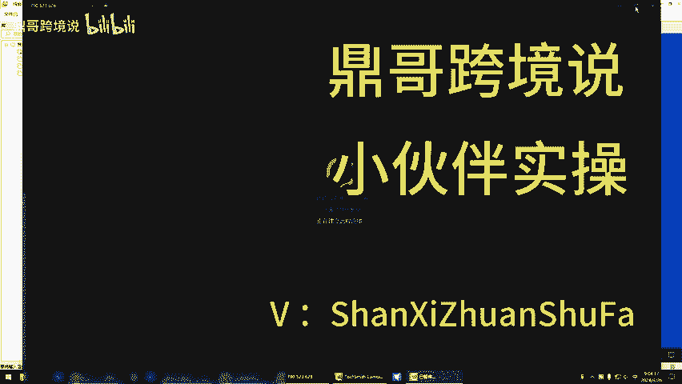

好嘞，咱们咱们先先去，你昨天提出点啥问题来，咱们一个一个来。把问题解决完，现在9点就开始给你告诉你怎么弄。嗯うん。问题在上边了。那个报错的事情，你不用管那个简单，那一会儿一两分钟就给你解决掉。嗯。

第一个就是在那个虚拟机里边，我那个浏览器啊是IE的。虚拟机里面的浏览器是IE的。哦，对。那你这个这个是这个是虚拟机吗？你看是吧。对。你怎么会是IE的浏览器？我给你装的是谷歌呀，你怎么变成IE了，等一下。

异地记忆吧。对。我不我跟你说，你你不要在这个东西，你你不要在虚拟机里面去。弄这个虚拟机里面，你记住你只跑数据啊，只跑数据。你要去看东西，你在外面看。因为它外面能跟这个它能同步登录，对吧？

我是我也不知道你这个怎么就回桌面，这怎么也学不会。啊啊，不是我给你找右侧这个一点击过了，你可你进里面看啊，就是。看数据的时候，你从这个这这个里面的直接登录前台，你只要把这个桌面的这个谷歌啊。

你把它搞成默认浏览器就行了。里面的那个虚拟机那个东西，你不要碰它。

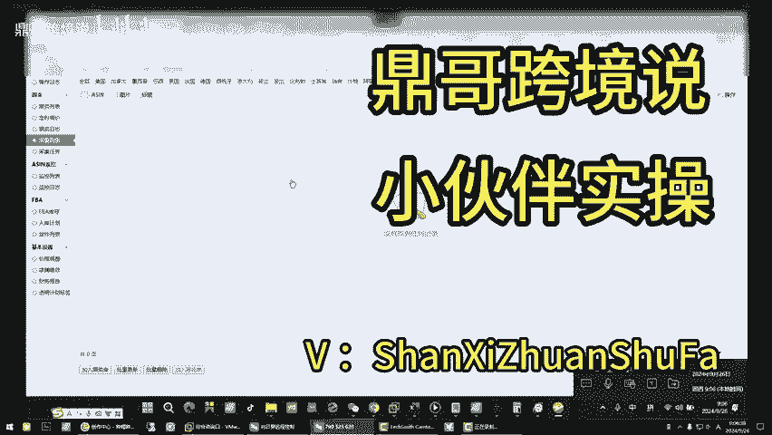

你在里面，如果说在里面。

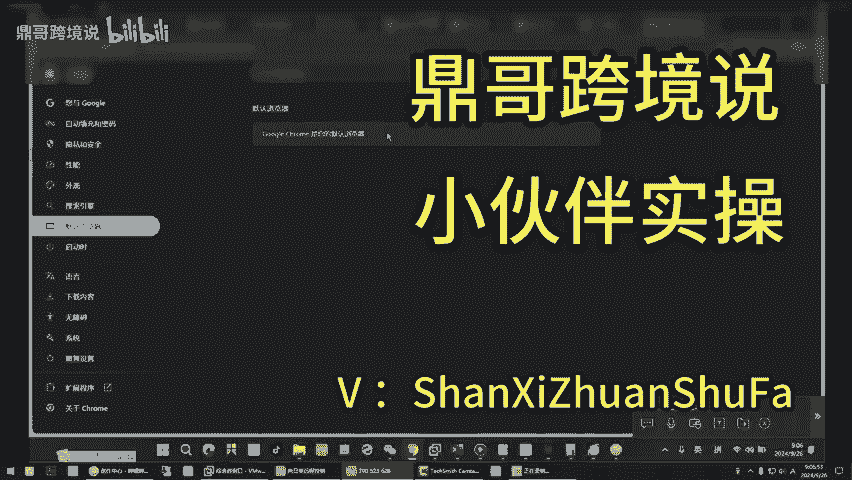

搞他他会很占用这个。哦。你看我先对我先给你关了机，等一下，我把这个关了重。就是分清楚在虚拟机里干什么，在外边干什么，对吧？本来装的虚拟机和外表它是同步进行的。你没有在里面，你只只管让他抓数据。

别的啥也别干。

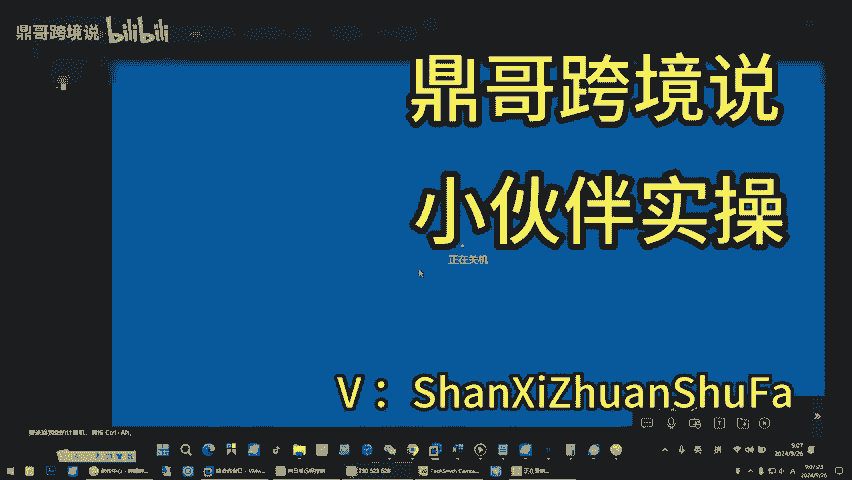

哦。你看这个地方你就得。我们先把它处理一下，对吧？清理一下磁盘，你看。就是我打开那些东西里边就占用空间了。对对对对对，所以说。

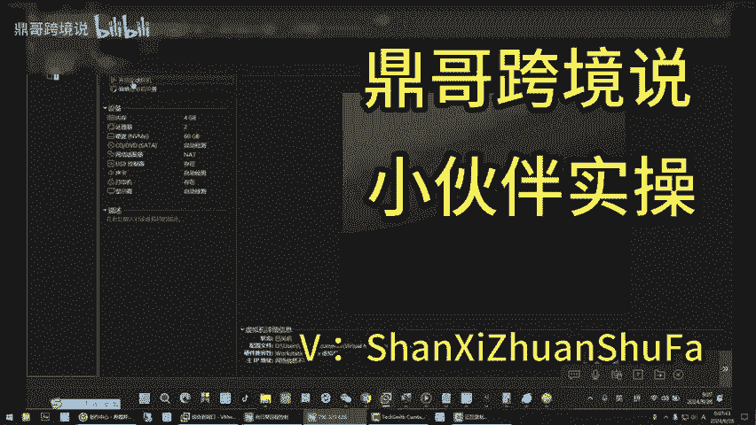

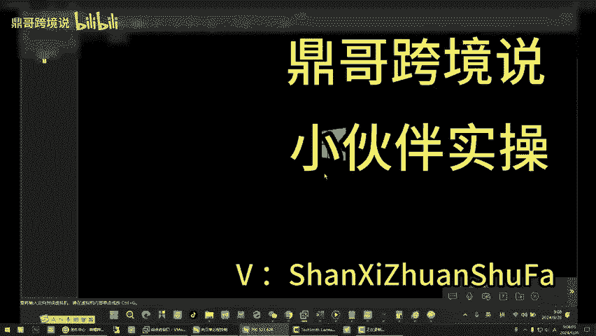

一子这个啊，你看你是在外边，这不是啊，你外边我看一下你跑了多少数据，我就知道你干了多少活。一共才跑了200条，这个这个地方不够啊，你怎么地也得跑个将近1000条，这个任务怎么地也得跑1000条的记录。

你看我只要给你一筛选，你看我筛选你就没了。首先你现在不能碰这个FBA的号，FBA的没有你现在是有。你才384条记录，对吧？你看小磊拍这但是哥我我这边跑多少条记录，不是那个影刀那个里边跑的吗？是跑跟？

不是说他结束以后你能继续开始呀，它结束以后它会停，运行成功，运行成功，你再点一下，它又自动开始了。啊，反复点呗。对，就是它提示你运行成功以后，你就再点一下，开始就OK了。这。但关键词我都是跑了一次。

A版跑了一次，B版跑了一次关键词，你要不停的跑，你你你看这个。它只有一个清零已完成，这不是没了吗？你把这个地方你你只你只管干这个事儿，这里面就记住啊，里面只管只管跑数据。别的不用管。嗯。我再给你讲一下。

你要达成这个同步协调的这个作用，知道了吧？里面跑数据，外面筛选数据啊。那我点那个操作那个地方，自然它就弹出那个这个在虚拟机里啊啊，你不就完事了吗？你看现在我再给你开始跑，对吧？嗯。这怕会弹出那个。

失败的对话扣，我刚才又这你就不用管了，你直接点这个是桌面的，你里面让他跑去不用管了。桌面你看一刷新嘛，没了吗？他不是又开始了吗？你因为你只有抓了200条记录，200条记录你看。你这数据不够。

小类排名1到100的只有两个。来，我给你看一下，你像这个根麦数量很多，这个是适合于根麦的啊。就是说你做姿如果说。呃。来，我这么跟你讲。你这个时候你要看东西，点这啊，点这他不就去了前台了吗？去了前台。

你最好前台是把它搞成谷歌。我不知道你是不是这个是不是谷歌浏览器啊。是的，这是gogle。那你装了谷歌以后，你这个这个这个登录一下，这两个先登录一下。登录登录啥呀，你得登录账号呀，对吧？你看谷歌账号啊。

不是卖家，谷歌账号我没有登录过卖家卖家精灵不是谷歌啊你看你这边登录了，是不是他就有了个数据啊，你再把这个也登录欧陆欧陆，你到期，你不需要不需要买，你不不用买，我们只看他下这个销量数据，你扫码登录进去。

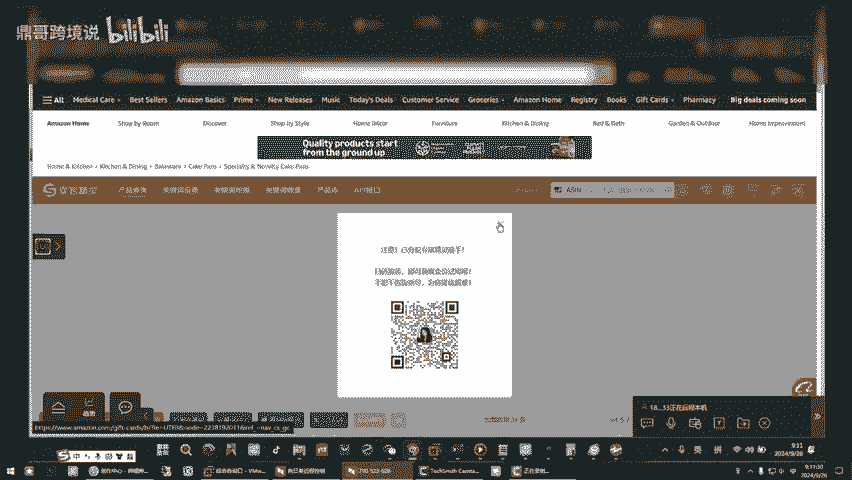

嗯，好。嗯。你这个数据不够，你还得抓知道了吗？你到最后你要去做一个表格，你把你选来的东西。要。做作业你来去给我复盘。我今天再给你讲一遍啊，你看按我之前的方法，你你这个自己做一个表格啊。

就是说你看它的销量加它的销量再加我不是让你做这个品啊，我不是让你做，我是拿这个东西给你讲这个逻逻辑思维，知道了吧？嗯嗯，827，你你自己加一下，827加这个503加459除以3再除以30。

你是不是大概率算出来这个东西一天。日出多少单了是吧？嗯，是吧？好。换句话说，其实这种商品还是安全的。为什么这么多跟卖人都在跟，说明是没事儿。听懂了吧？嗯，他上架时间是从哪看出这个是是跟卖的呢？

卖家数卖家26个。啊嗯嗯还有这个地方，你看卖家这么多，你看见了没？这就是跟卖产品，跟卖产品写的卖家，这不是卖家数吗？这不是不购物车吗？卖家的编号吗？这么多这是从软件里面看。

如果说从前前台你看点这个卖家是不是出来一6是吧？嗯，如果是人家个人做的，就卖家一，就是人家一一个人在做，这个就是有跟卖的，这个是有跟卖的，知道了吧？这种就是有跟卖的，而且上架时间4个月，4个月内的新品。

它这个就属于那种。应该是个万圣节挂钩吧，这个东西咱也不清楚啊，这个对对对是吧？它原来价格很高，它是被跟麦跟的给跟的给价格低了。他并不是说人家咋的。嗯，咱一步一步的给你回答，你看你昨天问我什么插件什么。

这不是就能看这个不是写的FBM吗？现在不BM卖家嘛，对吧？哦，这不是吗？这是近30天的销量，你自己算一下459加8加503加这个呃多少来？827，你你总和除以3除以30，你现在就算一下。

你是不是得出它得出来一个。平均值日出多少单或者几天出一单，平均值不就算出来了吗。嗯，稍等，我看一下啊，变3器我打开。对，这有些东西可简单了，你就是你不要看827加503上。

503加再加459459459等于，然后除以3除以3再除以3，再乘以30。对你算得出来的结果是什么？等于19。8，那就是就是人家日每天均下来一天能出20单左右。当然它只是个平均值啊。但。

人家一天总数能出20单，如果你去做这个产品，你不用去全摊，你能出人家的3分之14分之1就行了，知道啥意思吧？任何时候咱不要去往前冲，别人吃肉了，你喝点汤安全比啥都重要。我不是让你做这个品啊。

是是是现在顶哥已经给你讲这个逻辑思维了。首先先确定他这个销量。市场如何，对吧？是不是他在他的小类排名是前十五的哦，你就你可以进去去打开他这个小类小类，它都是这种这种，你看这什么东西？有一个方法。

你看啊你看进来以后，你大概率看他这个市场复制了这个链接了吧，是吧，小类链接。你看我怎么操作的，在这个二代选品这儿。选拼方法。这个榜单这里。这个。这个你看呢先选全部，你主要是看什么，看它整体的市场如何。

他就会把他就会把你这个整个的这个他的小类啊进来以后的销量都抓了，因为他们我是不是跟你讲过，他叫的名字一样，他长得不一样，是不是？嗯嗯，是不是叫的名字一样，主关键词大概率差不多，但长得不一样是吗？对对吧？

所以说我一每天我都在跟你灌输这种思想，就告诉你一定要弄明白。当然我当然了，我不是让你去做这个的，你去做这个也可以。首先他。这么多卖家说明它是安全的，它也是个4个月内的新品啊，就是说白了可以去练练手。

可以去练练手啊。当然我视频里面咱们曝光了这个东西，我建议你不要做一做就很多人就跟上了都啊。对对うん。哎，那个你说想问一下啊，就是咱们那个采集任务和采集列表那个。那个都分别是啥呢？

采集任务就是把那个热搜词的关键词一条一条给你添，你看是不是一条一条把关键词给你添加进来了，添加进来以后任务采集列表就是把你把你添加进去的关键词变成了A塞。asan这不是asen吗？

就这些asen就是那些关你添加了的关键词变成这个样子了。啊，那我再点一下哈，我看能不能是跳到那个外边那个网页啊，可以啊，直接就来了呀啊，没毛病啊哦，他审事就审事，不用你手动一条一条去。

他现在就等于把这些词都给你搞回来，搞回来以后，我们把它变成了as是吧？那变成了asen，是不是我们要做的就是在这个地方做一个数字筛选嘛，做了筛选以后是不是就出来结果了，对不对？你出来结果以后，是吧？

我们。只看中国卖家是不是现在目前为止只有两条数据，因为你因为你这个地方数据少，知道你怎么地，这个地方也得有1000条记录差不多，对吧？你这个数据少，我只能给你拿这个来举个例子。

你像这个我们你你不用管它是什么产品，你先听这个思路啊，你像这个产品进来以后，它是单独的呃，就他一个卖家，你看啊。你看就他一个卖家。是吧。就是人家就他一个卖家。这个的销量呢它就不多。你看这个数据还没出来。

这个是15。你像这种的40，我觉得它销量不会太大。所以说这种啊你也不用去参考它什么。因为呃做自发货，如果说他那个人家你仿就是你要去模仿，或者说找的这个对标产品的。这个数量没有在一个月。

没有在100单上下，你就没有必要考虑，因为他自己都做不起来，你去做他，你能超过他吗？是不是？对对，你这道理人家一个月出300单，你人家3分之1啊，你能出个八九十单也不错了，是吧？他都出不了30单。

到了你手上是不是一个月只有几单？是你因为你付出的时间和精力是一样的，对吧？你做东西是不是？所以说你现在你看等你没办法，你数据少嘛，你现今天要跑数据让他跑吧，咱来给你给你解答别的问题啊，你没有办法。

你只有等这个数据多了，你看他现在是不是正在就运行中，等他变成功的时候，他这个地方变成成功以后，他这个地方就会进得来数据，知道了吧？好，这个让他跑的，你看你如果这里没数据，我不是跟你讲过吗？

你在这个地方可以去练手在这个里面可以去找找数据是不是是吧？自发货数1到3个未注册的啊，是不是这种我的这个里边右右侧那个我一点，就是在那个虚拟机里边不不别在虚拟机就在外面操作啊。

这不在外面是我就是我是说现在就这个页面右侧这个东西，我一点击。他就跑错，就是在虚拟机里边就出现那个报错。对函数你虚拟机我你只干这个事就行了嘛。你看它是不是只干这个事儿，看见了，它在动啊。对不对？嗯。

是吧，他还在动，虽然说我没有放大屏幕，它是不是在动？看见了，你那我这个到底要不要看呢？你不你只在外边看，你是不是明白意思了吧？虚拟机里面让他跑数据，你所有的执行在外边，这不是这个桌面上嘛，对不对？

这个你看我鼠标点的这个啊啊啊，所有的操作你都在外边操作，你不用去里边操作，明白了吗？你看这不是它在外边，这不是有吗？外边是不是你看你刷新一下，这是刷新是不是有数据了，看刚进来一个，对不对，是吧？

你看马上就进来一个。所以说那就是我我电脑的桌面上也有一个这个对呀，我都跟你说过，它是同步的嘛？明白，你不虚虚拟机的目的是让他在里面给你干活，它不影响你电脑桌面干别的事儿，知道了吧？你桌面你同时登录。

你看它是不是一条一条的给给你往进添加，是不是对吧？啊，那添加完以后，它就会在这个地方它就会出数据嘛，只不过你现在数据少，他出不来，它需要需要时间嘛，对不对？是吧？你看这个地方它在加载。

就是在干这个的过程中，你不用去管它，你就去这个二代选品这里，二代选品是不是你看随意找一些数据，你看它就有销量的，你看这个东西也好，啥也好，是不是你看是吧？嗯，你看变狗的你就不用管它了。

有些时候它这个数据它不行，它就会变狗是吧？你看变狗的不用管它。有数据的你就可以去参考嘛，对不对？你可以去参考你这个东西啊，你自己去决定啊，我是给你讲思路呢，知道了吧？你看。

假设假设这个东西是你准备你看起来想做的东西。那你刚才我是不是给你交了算销量的平均值？你像这个人家就他自己在干，他不让你去跟麦他，看他跟麦下策是的就啥意思？你如果说去做了自建链接。

就是我们自己去做一个自建链接，这个东西不能做啊，他有汉字，听明白了吧？不要去碰他，我是给你讲思路呢。做自我们做自建链接跟它没有关系，跟它没关系啊，知道了吧？这个地方你也就练练手，练练手。

你去你今天我教你个作业啊，今天啊我就要开始给你教教你交作业了。第一呢这个地方你要把它搞到呃搞到这个。等一下我这里堵住了，现在是69条记录，你今天把它搞到最少是500条记录，500到1000，知道了吗？

你就干这个事情啊，把这个搞定它。林哥，我想问一下哈，采集任务是采集关键词，对关键词是影刀的那个呃呃先把引镜刀打开一下哈，啊，不不不，你先别动啊，你先别动，你想看引刀，在这个里面看，它不是正在运行吗？

对不对？是不是他的引刀在运行，对吧？嗯，你不用点它，你你看。我来给你讲一下这个逻辑思维，它是怎么运作的。第一步是不是用引导把那个热搜词我们都给抓取下来了。叫美国数据A美国数据B是吧，是不是把那个热搜词。

关键词拿回来以后要干什么？关键词一般得点就得点几次呢？我昨天只只点了一次，什么点几次，你是用心完毕吗？用行成功以后，你在它不是用行成功，它就会变成一个绿色这个地方我给你停一下吧，停了，我给你对吧？

你看啊它运行成功时候，它这个地方就变变成那个用心成功了，运心成功以后啊，它就会这个地方它不会跳到这个界面，它在这个地方运心成功，你这有个键和这个操作是一样的，你就点它一次你直接点我想问一下，就是这个哥。

我想问一下，就是下边25万关键词个和B版不用采了，这个什么时候才采集啊，什么时候采集，我给你我给你这里。

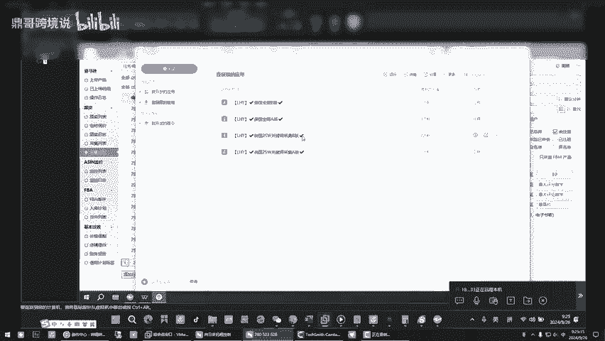

演示一下啊。我给你讲清楚，他这个地方你看啊。他是他是。

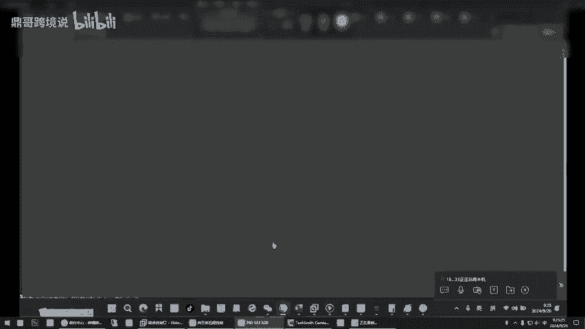

你稍等，你看他这个更新日期。哎，有于时间他基本上一周更新一次，他你什么时候看见这个地方的日期变了，你就用那个啊再重新让让这个新数据。再去抓取一。那那个我在抓取新数据的时候，比如说这个A版。

我我去点点几次呢，就点一次，然后成功了吗，就成功了呀。嗯，那你说我刚才运行的少吗？只有我条特别少吗？你是只有200多票，你是我跟你讲。这个就是等那个热搜词的日期变了以后，你只用一下啊，A一下B一下啊。

你要长点这两个这两个是执行，刚才是不是点开了，是不是你看点开它是不是再执行，对吧？它运行了200条记录，它自己就停了，停了的时候你就手手动再让它执行就行了。A和B这个要多点啊。

别的那个前面那个25万那个不用管那个只点一次，那是那个是根据根据这个日期来变的，采集它最新的永远是咱们用最新的对，所以一周采集一次。

然后看人家A的时候对A你要不停的不停的去去但他完毕了200条完了它停了，你就点一次停了，你就点一次，点一次是200，那就是如果才2000条的话，就是得点10次对吧？1000条就够了分别1000条就够了。

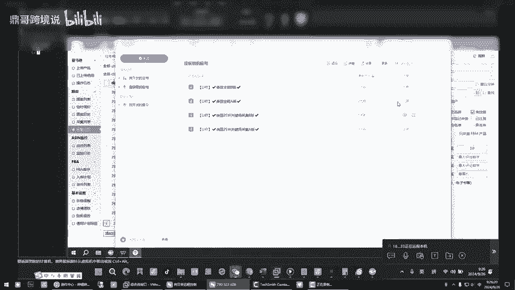

1000条，那就是5次呗。是啊，你稍明白了，这地方明白了，我等一下，我去接个电话。哎，来，我我们呃刚才说到哪儿，就是呃它是同步的，你不用担心你在外面做的事儿，就是在外面哎筛选数据就可以，对吧？

他如这个地方跑数据的时候，你可以去这个二代选品这个地方，你去看。刚才我不是让你看了一下那个榜单嘛？我给你举了个例子是吧？举了个例子，我们看一下。

你首先是不是要确定人家的市场怎么样，是不是对吧？你确定人家市场，你看他整个把那个就那个。就咱们点进去那个类目啊，他把这个数据它都出来了是吧？你看是不是这个大概率，它这个总的销量它就出来了。

你首先你得看嘛，人家你得确定人家这个销量的市场，而而且你得看一条是什么数据啊，他这个地方嗯。我们就定500条类目是啥呀？类目类目来，我给你打开看这咱们什么什么时候点的类目了？你是不是进了这儿了？

这个地方是它的大类，这个地方是小类啊啊小类。对，这个地方是大类。我给你看一下大类。你点进去大类以后，你看它的链接是不是这个分类，这是家居啊，厨房家居吧，应该是这个这叫大类啊，刚才你点的那个东西叫小类。

这个叫小类，小类是什么意思？你看。大类里边要分很多小类。对，就是它的子类目延伸出去的子类目，这个是大类目啊。这个就是这个就是子类目SP这个嗯你看嗯是不是。是。是吧这个大类目大类目下面的小类目。

刚才给你抓了一下小类目，这个抓他的目的是为什我们是怎么抓的小类目，我们就是怎么是根据类目去抓的。你把它链接复制了就好了嘛？复制。复制嗯你看啊嗯嗯这里有个怎么去做这个事情呢？首先在这个里面你去添加条链接。

我第一次是全部全部。有些时候我们要看一下它是不是FBA垄断。你看现在我就不点全部了。我就不点全部是什么意思啊？嗯嗯嗯啊他有可能啊就没数据了。为什么你点了全部，你看我给你先让他去抓的。

你先看他抓进来的数据库，这不是榜单选品库吗？你看这个里面它是不是都是FBA啊，你要想清楚这个。如果都是FBA，那么第一，它的销量可以，它竞争也很大。也就是说你做这个东西你不用想着去呃去去抢排名。

你抢不了。你要做的就是哎，你后面我就说过，你他也有自发货，看到了吧？还可以说明第一页和第二页里面他他这个路子还没有绝了，他不光是说哎，不光都是那个叫什么FBA他也有自发货，知道了吧？还是有能一席之地。

你还是能。当然我们做这个东西也不会去去冲的这个第一页和第二页去，我们一定在后面。是吧一定要在后面，你在前面就是劣势。说实话呢，你想这这帮的数据咱们都能看得到，别人的看不到吗，对不对？是。

所以说看这个的目的，咱是为了看一下它这个总体，你看月销量是吧？总体看一下它这个市场，那基本上是被FBA垄断的。你要做FBA你做不了，你也别去做。你看UFBM的销量可以的，是吧？嗯，对不对？

FBM的是不是啊？你要看这个，如果还有F就是FBM它还是能能进了这个市场的，知道了吧？也就这个品你发现了吗？出来好的就这个品这个品你想去如果你想去练练手，练练手啊，你不要抱太大的希望。

你可以你可以去把这个产品去你做一个文案，对吧？就是你做一个产品去练一下手，就在这个地方，你可以去。做一个产品知道了吧？做一个产品明白啥意思吧？嗯啊去上架一个车啊，不不，你先得去。

你你你不是原来有店小蜜嘛，对不对？是吧？嗯，对，那我给你举个简，你上店小蜜，把他们的链接都抓下来，抓这个链接是为了要用它的图片和文案后面要去改的，就是就要去改，知道了吧？就是我们拿来去改。

你看你在这里面看的时候啊，你因为他我们先看一下这个这是咱们的数据嘛，是不是对吧？你找到那个。哎，不不对不对，在这个地方选米数据库。我们找到这个哎。就找到这个数据列表里面。我们找到中国。

先找到购物车是中国的对吧？你再找到FBM的啊，你看来，我们我们找到FBM的，我们这个时候我们手动看一下，它这个是FBM的，是不是你去前台，对吧？你把这个链接，你复制到那个店小秘里，你对你去。

电小蜜打开是吗？对，打开店小蜜。这这个就已经已经延伸到哪了，延伸到后面还给你去做文案了。那这个地方它不是有有一个这么个东西吗？你看是不是对吧？嗯，哎，你就把它你不用去认了，你就把它采集。

它不光能采集1688。他能采集这么个玩意儿。拿下来他是为了干嘛，是为了呃去用他的图片和文案。当然了，你去1688找到。这个货源你也得采集回来。其实做一个产品呢，就是把好几家的产品，你把它糅合到一起。

是不是那个图片也好，或者文案也好。嗯，糅合到一起就是你的，对不对？你看你这个地方他不就采集回来了吗？采集回来时候。你的图片你不就能用它的图片吗？你这不是能能把它全部导出吗？导出完了，我们再再去修改吗？

是不是然后等后面的课，我再给你讲这个啊哈，只是告诉你他能干这个事儿。然后这不是他的文案吗？他的标题也好，啥2好，我们等他有我们就能用，没有，我们就不用他。他他一家没有没关系，是不是你看是不是还有别家有。

是不是这个他俩是一家的啊，你就弄一个就行。你在看别的。如果有别人是不是也在跟你做这个一样的时候是吧，你是不是可以借鉴他的这个你是不是一样，你把他的链接抓了，他是不是有标题？他是不是有5点，是不是？

他是不是有描述，对不对？你就多抓几个，是不是把他的这个东西都拿回来了，然后你自己抓吧，我是跟你讲把这个。把这个。逻辑思维搞清楚啊。这个能明白吧？好几家的东西咱们拿回来揉合到一起，就是咱自己东西啊。

不用管他们什么的，这个后面你自己操作，就今天教你的作意是第一把这个地方的数据量，你给我跑跑的差不多了，现在有点少啊，有点少数据库这个样子对这个是数据库，对吧？他少了以后，你这里你你看一筛选。

你就出不了多少数据，因为你现在这个地方少，你早上看的时候才几百条，现在2000多条了，是吧？你让他继续抓。嗯，哎，你让他继续抓，现在才135。反正他停的时候，它到200条，它自动这你看这个地方报错了。

你知道为什么？你看肯定是我们不知道点，你不知道点什么东西了，这个时候就要关掉了，这个地方报错了，报错了，知道了吧？这个地方不执行，他报错了，你看了吗？是吧？对，报错，有的时候就这样，你不要。

这就是你动或者说不行，无意中动了鼠标虚拟。

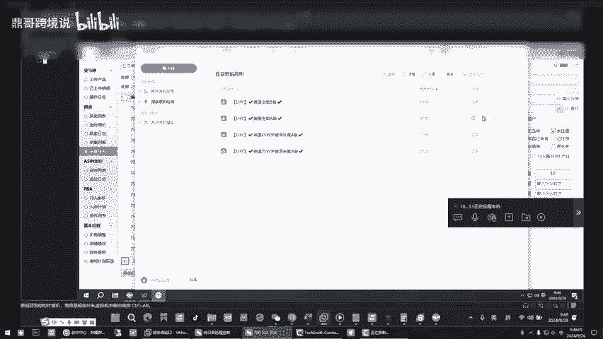

这个时候报错的时候，你就点让他重新开始哎，重新开始，对吧？嗯。重新开始就好了，这是不是就好了嗯。嗯。这个时候你还是回桌面去，你不用搭理他桌面该看。有些时候你要关注这个地方，如果这个地方的数字不动了。

要么就是成功了，要么就是报错了啊。然后你进去处理一下。看这的数字。好，你看只要它是正常的，是不是它数字就变了，对吧？是哦，记住这些来，你还有还有哪些问题呢？你昨天提出来的。嗯，总体我看一下看一下。

那个报错已经解决了，那个不是什么大问题。那这个不用管了呗，反正不用管，因为我是在虚拟机里边去整。对，然后这欧陆的话也欧陆试用期结束以后我也不用买，不用买不用买，咱就是看他一下销量，预估销量。

那别的咱用不着哦，然后在在虚拟机跑数据的时候，我去我自己电脑上把那个ERP打开，这不是这你这不是现在打开的吗？你看这不是同步的吗？OK然后嗯这是这都没有是吗？这个是。其实也没有什么没毛病。

那你就今天把数据给我跑全，然后在那个二代选品这个地方，你自己去琢磨，你自己做个excel表啊，做个表，你认为你认为的。你看啊，你认为的你认为的写A，你可以保存起来。就说你认为的完了。

你给我讲你为什么选它，完后我再给你纠正，我告诉你该选还是不该选啊。多玩多练得多上手。行，然后我再问一下这个左侧这个列表选品大数据什么数据库选品方法，这个我能用到的就是呃选品大数据是吗？选品大数据。

它是已经已经抓好的数据。你像这个是我们抓的是新数据，知道了？它分成个老数据和新数据。对，这个地方是也也是抓数据的，你看也是抓数据的，你看这个地方只有成功的是6条，为什么刚才不是给你看了吗？

成功的只有6条，因为我们过滤了很多，是吧那个那个那我还想问一下哈，就是上边那个产品和和和和这个亚马逊的这个他们两个数据，这是新数据，这是旧数据。那他两个是分别看的吗？不你不是你可以我看完这个嗯。

我看完我让你看逊那个吗？我让你看数据的目的是让你多练延感手感延感，你去点，完后它不是能直接对应到前台吗？你前台不是装了插件了吗？你我跟你说，你别管它注册不注册，你是不是先点进去，你练手感延感。

点进来以后，你就要象征性的，你把它销量一加起来。用那个公式，你大概率你能计算出来这个品每天出几单或者几天出一单，知道了吧？你是不是我是跟你讲过，做这个亚马逊，它其实就是个算账的过程，是不是你得算的过来。

你上去以后，他还有个资金量沉淀的问题，别小看自发货，你如果初开单了，你就说垫资的，因为你要垫子采购成本和运费成本是吧？也就说你得考量好这个你是一天出几单的品。如果你真做到了你这个品报了。

你要考虑好你自己的垫资量啊，还是说你一开始稳稳的一个品两三天出一单，你就搞那四五个品，基本上一个月先给你慢慢的往前往下走的，在亚马逊你不要销售太快，销售的太快了，他会说你销量俱增，他会审核你账户知道吧？

反正这个事挺多，一开始稳扎稳打，因为这个外国人的思维跟咱们不一样，他认为你突然间短时间内你销量好，他就认为有可能你在作弊，好吧，他是这样子嗯。那个那个这三个数相加，那我这三个数的话。

我要是去打开三个网页吗？对啊，你在前台上呀，你你你去呃。这不是钱你咱们是不是从这儿就去了前台了，对吧？这个箭头。嗯嗯嗯嗯，你去了前台以后，你不是装这个上面欧陆和那个卖家精灵是不是体现出数据来了，是吧。

他在哪看见这三个数呢？这不是你是不是到了前台，你等一等他，这是不是进三，这是不是一个数，卖家精灵的数，这个数是欧陆的数量，你看到了是不是对吧？啊，这是欧陆的数，第二个数在哪？第三个数不就在这儿了呗。

你看你点的是这个吧，这个不是有数吗？月销量。这个销量是谁的呀？这是软件里面给你测出来的。啊，软件里边的507799，你看月销量这是一个数，是亚马逊软件啊。对完了你去前台，这不是卖家精灵的数。

欧陆的数三个数加起来除以3除以30。你当然了，你你你只对你感兴趣的A审去做这个动作啊。你不要去每一个都做你都累死你啊，是不是？是606，这个是你首先606这是什么？啊，首先考量的，你看这儿，别看那儿。

首先考量的是自发货，对吧？他这里不是有月销量吗？是不是啊？他这里就给你显示出来了。点进去前台为什么让你装插件装了插件是不是三合一？你大概率你先我为了让你练一个什么样的水平，你进去随便点一个品。

看到你计算大概率举例说他一天能出一单或者两天出一单的那这些品，那就能够你去能够你放在第一指标的，就是放在第一个筛选库里，首先他的销量满足一个月能30到50单，人家出30到50单。

或者人家能出100单上下，这是你首选的。因为他出单少，你就跟着做也出不了多少，他如果能做到一个月月销百单，咱们拿他3分之1或者5分之1，你这个品一个月出十单，也可以了吧。你毕竟是个新店铺是不是权重也低。

对不对？是吧？你店铺里要的是这样的品，你有好几个不就完事了。你是不是在这个过程中你就练了，你就你你弄的多了，是不是一看就知道大概率。首先你先别先确定它的销量是否符合你去选品的第一标准，市场嘛，销量为王。

它符合你这个标准的时候，你再看他是什么品，婴儿类的别碰，因为婴儿和医疗这些你不要去碰，知道了吧？因为他会问你要资质。受限商品有些东西是。嗯。你这个逻辑思维弄明白了没？让你这么做的原因是随便点开一个。

你大概率你先别管它是什么品，这个别碰啊，带液体的，带膏状的，不要碰啊，叫什么膏了吗？这个液体啊，你不要碰高的液的对做不了。还有你一开始做的那些包，你不要碰，带版权性的不要碰啊。嗯，好知道了？好好。

你像卖衣服鞋子的，卖鞋子的和衣服的，这些其实是可以做。但是卖衣服鞋子它有个什么问题啊？因为外国人的尺码跟我们不一样，他有些时候可能不是质量问题，他会因因为这个尺码的大与小，也可能人家比咱们长得壮。

你这个标准尺码，可能他上去就不标准了。但是做衣服和鞋子的，你可以百度去搜索那个欧洲的或者啥的编码表，他就有对比，知道吧？嗯哦，就是你记住这个原理，我讲我讲这个事情的原理是让你首先习惯性的看一个品。

就知道它大概率算出来是不是先符合你的标准，不符合你标准，直接pass掉，长得再漂亮，也把它pass掉，知道了吧？我等问问好上面就是这个。是个产品，上面写产品的这这这一一列啊，不是一列是一行。我是看产品。

还是看亚马逊呢？这个都看都看你这儿的数据齐活了，你就看这儿的嘛，你都你你看这个不它不冲突，哪个对你有用，那一样嘛？这儿得出来数据是不是你也要上前台去看，是不是对吧？你最终都要上前台去看，你到数据。

这是最新的数据，对，最新的因为那个关键词它是9月19号嘛，这才也就快了，快更新了。先教你这个产品那个呢产品那个它是老数据，你也可以去老数据里面并不代表没有金矿呀，你可以去自己筛选吗？这个里面它会也有。

你也可以通过分类来筛选啊，你看鞋子服装是吧？举例说，女孩的女孩的这个鞋子，对不对？我给你我是给你举个例子啊。我明白。有些时候零的数据它就是没数据。所以说它没数据，你就放弃没有数据。

就是里面没有合适的数据。这两个结合起来用这个这个吧，它是一代，我们叫一代选品，这个吧它是二代选品，知道吧？二代选品是不用跑数据，那一代选品呢它这个是数据量大，但是它有一些垃圾垃圾就是就是说垃圾这个产品。

我不是跟我们不搭干的，现在是液体了什么的那我们为什么说要进行两个结合呢，对吧？有些东西我们不能做，我们就把它pass掉了，为什么要设置这个分类，设置这个参数的筛选。为什么说我们首先要确定你搞次发货嘛。

700多条记录是吧？这个时候你看它它东西就出来了，对不对？

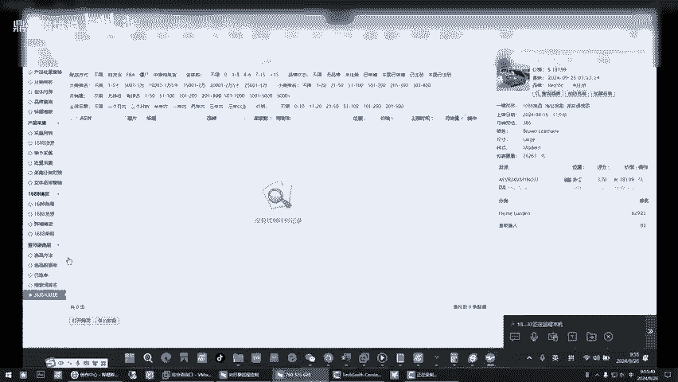

嗯哦，你一步一步来先今天呢那先教你这个，然后呢，你看我给你。你看刚才不是有这个吗？是不是对吧？110百对你看啊。你现在还是两个的数据没有出来呢，你看这么多人都是跟卖的。

有些时候他们我们我后面教你怎么去去他们店铺里去选品，我们直接就能把他店铺整个店铺给它端掉，知道吧？就是。就是就是整个他卖的啥玩意儿，销量好的，我们都能把它干掉，直接一一窝蜂给它端掉啊。

我们可以干这个事儿，你看。

你一步一步来，那选品的招式他招式非常多，所有的招式只是为了你能找到一些精准的品质。所以你看是不是是吧？你是不是他的店铺125个产品。咱们是不是找到了店铺里面所有的品了。

是不是你别管他是跟麦还这个太厉害了啊，有合适的我们就用不合适的，我们就放弃嘛，是吧？嗯嗯嗯，好，对不对？你看任何事你别管他啥，首先切记了，销量为王，对吧？

你像自发货低于一你你的对标产品它都一个月低于30单，你不用考虑你上去连三单你也做不了。对吧人家熬了那么久才出那么，你一个新店铺上去，是不是你要有权重，是不是对，是吧？所是说你看顶哥。

我更多的是跟你讲把原理，你的思维原理讲清楚，讲清楚原理，你再去实操的时候就快了，对吧？这个也不用你干啥，他自己给你跑数据，这个在跑数据的时候，我们就进去去盲选嘛，举例说是盲盒，对吧？哈，去练手。

为了找手感，是不是盲盒，对吧。哎，时常关注这个地方的这个数据，它有没有产生变化啊？100刚才136条，现在是205，他还得变啊，说明他还在用作的206这就属于正常的，你不用管它啊，你也不用去虚拟记的看。

其实点了A是吧，还得还没点B对我一会再把B再点几对这个地方的数据他如果死了不变了，说明要么里面是用心完毕，要么就是报错了，记住这从这去接起啊。哦。路长着呢，慢慢的别着急啊，一步一步教你你别着急啊啊。

林跟汉几个问题哈，我昨天看FBM那些产品，我看好多就是价格比较高，都是家具类，比如沙发大架子大，你别碰啊，你不要碰，你现在的这个水平，你碰不了。我实话跟你说，你如果做了半年以上，你。是你这个技术也好。

或者说实力也好，他们做家具类的都是海外仓，提早就把这个东西发过去了。哦，那他们那个我看是自发货呀，自发货的话，FB做不了那个东西。那仓储费那按GM。那FVM我看他那个重量，一个沙发什么的话，一个桌子。

他们是提前发过去的，他们走的海运，海运的运费就便宜，知道了吧？那不还要做海外仓吗？啊，是，但前提人家达到一定的积累了。他海运便宜，举例说你走正常的物流快递，举例说一公斤是30。

估计那个海运估计啊一公斤就十四五，你想吧，那运费便宜啊。提早发过去在海外仓，但是啊，他在海外也有仓库没。对卖大件的，如果说短时效在上面，那都是海外仓。你要从中国网过运走走那么多天，万一路上坏了呢。

你说是不是你赔的不光是采购成本，你还有运费呢，他们都提前发到海外仓那样子来卖。嗯。你现在看货，我以为是从中国一件一件往外卖的呢，小东西可以一件一件，但那个你现在探不上，我只能说你探不上。

不能代表说你后面不能做，但你现在探不上。哦哦哦咱们咱们要做的就是能能现在我们能能去让自己适合自己的东西。好，然后我看看啊，还有我看咱们那个ERP边显示这个位置地方，有的是美国，有的是越南位置。

这就是卖家的位置，就是人家店铺注册时候的位置，就说白了资料是哪个国度的，那不这样吗？你看这不是就看出来了吗？你看这嘞，你看。你看这儿没有，在这个地方就会看出来呢。是不是？这是他的资料，他这个店铺的资料。

是吧你去打开看他嘛，你看是不是江西。地址嘛，就这个店铺注册店铺上面的那个营业执照的地址。啊，这个都能看到。对，就这个意思。然后还有在。还有这个我看他亚马逊前台们打折多少，这个这是怎么出来的呢？

立减多少立减10美元啊，有些时候他们是在做活动，举例说亚马逊不是有一种prome的，有一种会员就买了亚马逊的会员的话，呃，有可能会便宜一些。有的时候是你自己做了产品，做了个优惠券，做了个打折，知道了吧？

啊，是这样子，他会示他会显示这样。那那我那那我前期不用参加，不用碰这些，你跟做FBA的搞这些，你做自发货，你你不用去咱们闷声的赚钱稳定了啊，把比例算好，你去搞那个你要做FBA了，你就得做促销干什么。

你要用这个东西。你像这种就这种是自发货，这是自发货。如果说如果说FBA是什么？这个是这个SHIPS from，它是阿玛总点com，他就不是这种个人卖家。

这个这个知道这个就是他是从哪来个人卖家3030天以内看见了吗？那这个意思。如果第一个上面是写的阿玛总。哎，那就是FBA那这种就是FBM。那个鼎哥，我就是他那个店铺名，我能不能也像他似。

把我那个店铺名后边也加个USA。你的店铺名加个USC哦，你可以改墨西哥电话，你可以改，但是我劝你别乱动，你一稍店铺，你稍微一改个啥，呀马兄就审核你，我怕他别到时候审给你整个二审出来，你别动，知道了吧哦。

好的，像修改密码啥的都啊，对你尽量别碰他知道了吧？有些时候你无心之举给你带来灭顶之灾，你就就就这样子。哦，那我知道了嗯。行，别的没啥了吧，没啥了，我就准备买菜去，我就给孩子做饭啊，你去吧，你快去吧。

不好意思。😊，那今天先这样啊，好留哈嗯，好好好的好的，那样留言就好了哈哦，好嘞好嘞好，谢谢。哎，好，拜拜拜拜。😊。

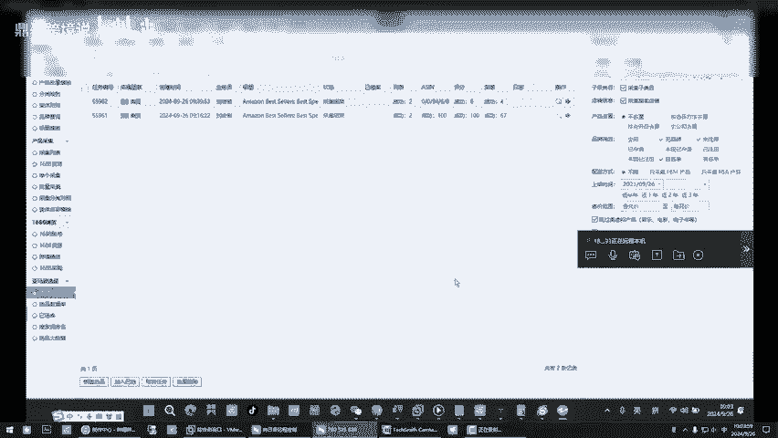