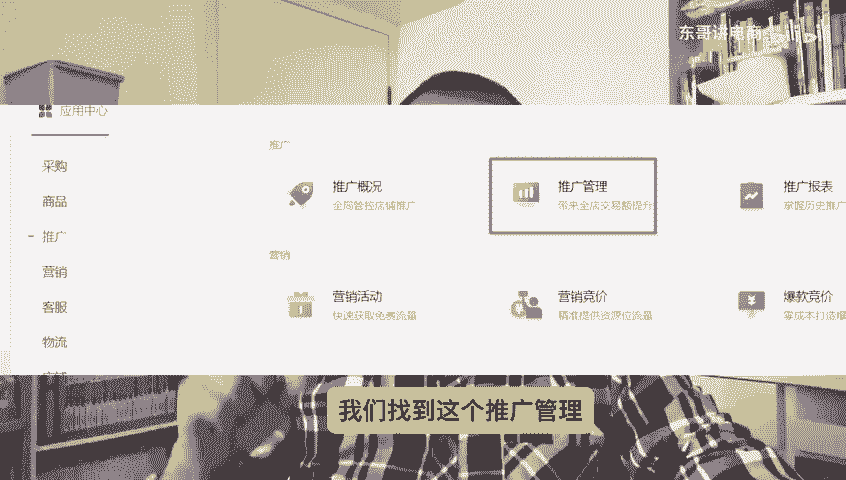
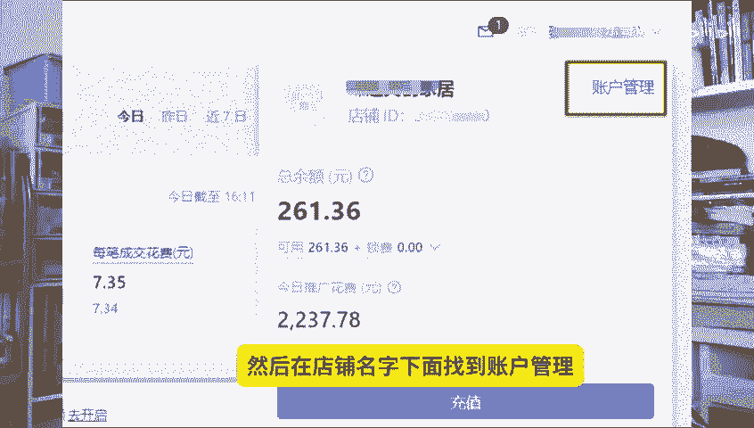
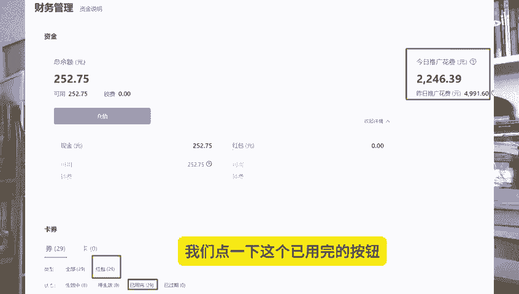
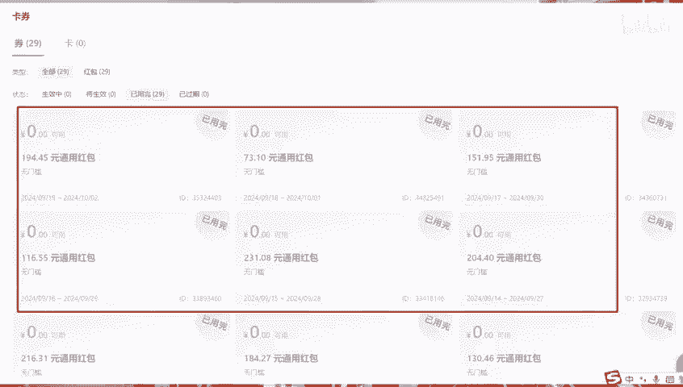
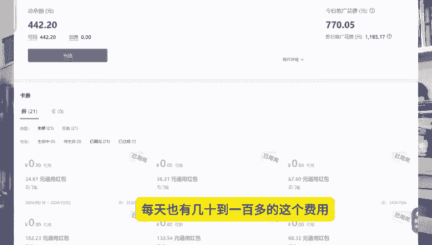

# 快来看看拼多多给你退还了多少推广费？ - P1 - 东哥讲电商 - BV1fisSeZELJ

只要做过拼多多推广的商家都知道啊，就是这个推广费用是占了这个运营成本的大部分。尤其是强废的产品。90%以上的比例啊，只要订单成交，都会扣除一定的这个推广费用。而且呢以前啊这个订单仅退款甚至秒退的单子。

这些退广费他都不给返还的。今年呢大约8月底到9月初呢，拼多多平台啊这方面呢做出了一定的一个调整，有符合条件的一些退广订单，退广费会退还给商家。当然这个退回啊。

不是以现金的形式返回到这个商家的银行账户上面。而是以呢以这个推广红包的形式啊发放到这个推广账户里。默认继续迎来推广商品了，其实这样也不错。具体退回多少的明细在哪里看呢？我们找到这个推广管理。

然后在店铺名字下面找到账户管理。

点开以后呢，会看到财务管理。我们看一下呢，比如说这个店铺今天推广费花了2246元，昨天呢花费是4991元。当然这是一个销售规模比较大的一个店铺了。然后下面呢有个红包29个已完29个。

我们点下这个已完的按钮，就会看到这个每天返还的推广红包。这个店铺每天都有100多到200多元的推广的这个返还红包了。

一个月下来也有大几千的这个返回的金额。这样呢我们看一下另外一个店铺，这个店铺每天是1000左右的这个推广费用。这个店铺退回来的这个返还金额呢，每天也有几10到100多的这个费用。

同样呢这个我们在拼多多商家版呢手机端也能看到，也是在推广账户财务管理界面也能看到这个返还红包这个明细。这个以前都是白白扔给平台的，现在呢能退还给商家也是一个不错的改变。

确确实实减轻了商家一部分的这个推广压力。比如说一个店铺一天能节省100左右，都可以雇一个客服了，对吧？这个是实实在在的改变了一个好的一个政策。

