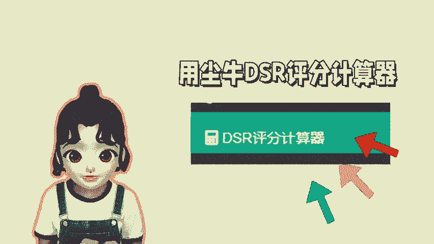
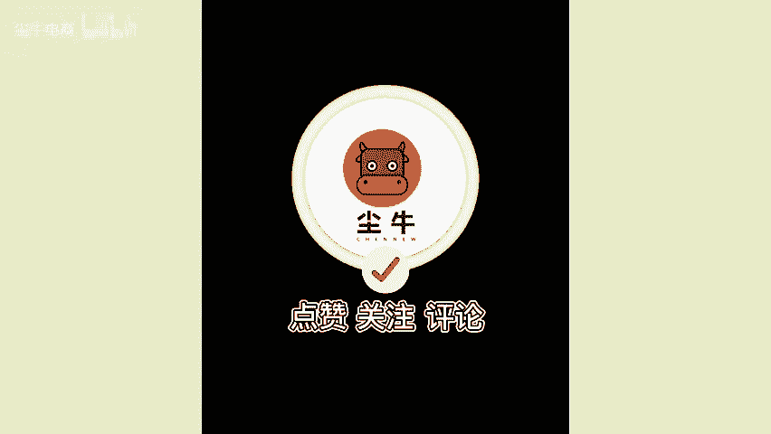

# 怎么计算单个商品的DSR评分？ - P1 - 尘牛电商 - BV14z2uYcEth

🎼现在做拼多多难免会出现一些售后问题，这些售后问题也会直接导致店铺的评分下滑，评分下降，对店铺的影响，这个就不用我多说了吧。商家如果想要提高商品的DSR评分，可以参考我这个方法。

就是去计算店铺的商品DSR评分，用陈牛里面的DSR评分计算器登录店铺后同步店铺的产品，在这里就会显示店铺商品进一个月的DSR评分，会显示商品的星级评分，右边有个评分提升建议。

可以根据对应所显示的需要的单量去找对应的资源去提升就可以了。因为店铺的评分，至少要维持在4。6分以上，流量才不会下降，年底了，难免要报名平台的各种活动，所以记得提前将商品的评分先提高。

后续也就能轻松报名平台的大促活动啦。😊。

