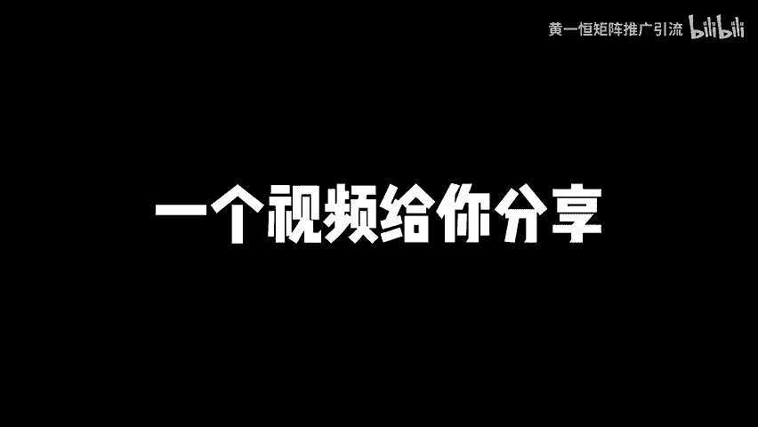
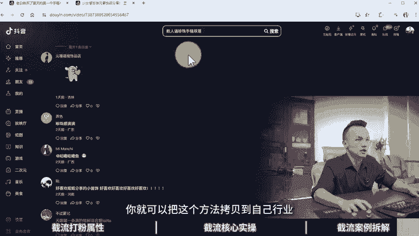

# 截流引流的方法和技巧，截流软件靠谱吗！截流是什么意思，截流软件是真的吗，截流方式，同行截流玩法，怎么引流截流，私域引流怎么做，引流脚本教学！ - P1 - 黄一恒矩阵推广引流 - BV1sT42167VX

截流，我以前觉得就是一条线头，现在我吃的是嘎嘎枪，真香啊，新手入籍C衣电商，最好的方式就是做截流了。今天给大家掰开揉碎了，拆解一下截流，季节废话，一个视频给你分享截流引流的方法和技巧，截流软件靠谱吗？

视频有点长，记得先收藏，一起来看，我给你分享截流打粉到底怎么样，截流的核心操作有哪些，还会给你拆解做的好的截流案例。现在看截流打粉属性，到底什么是截流。有的伙伴呢不太了解。

这里给大家简单解释一下截流就是用私人账号，借别人的评论区放钩子，就称之为截流。比如说如果你平常刷我的视频，打开评论区，你会发现，就会有很多同行在下面进行截流。比如这里面有一个视频是讲账号注册的。

就说到一级一号一网络，立马就有人卖流量卡，在下面评论为什么要买纯流量上网卡，养号还。

是什么一G一卡，这就是在评论器里面放的钩子，那能不能接到客户，自然可以找到一些精准有意向的客户，也可以吸引目标客户引流到自己示意。比如这里面有一个做珠宝的。我第一个不好看退了。

第二个超好看的链接我都问报了。打开一看，400多条评论各位伙伴光靠一个评论就引流到几百个人，而且这些全部都是全链接都是精准的客户，具体的这个主板案例，在后面我们会给大家详细的拆剪。第二个呢低成本。

咱们在搞节对的时候，设备要求我们准备一些二手手机就可以了。比如说这个红米 noteote9pro，咱们到嫌鱼上面淘二手一台的成本在400到500之间，配置在6加64G配置，有经验的可以到。便宜上面去淘。

价格便宜一些，没有经验的呢，担心翻车，可以到某都某岛上面找一些卖家，然后去购买价格的话贵30到50块钱也是可以的。接下来我们需要去注册平台账号，我们需要注册多平台账号进行开工。

一般我们在手机上面给下载一下抖音、快手视频号，小红书B站西瓜视频全部都下载一个遍，下载完之后，我们在操作时候需要注意啊，一级号有网络，这个什么意思？相当于我们一个手机的单个平台，我们是只放一个账号的。

如果你账号放多了，很容易导致关联。所以咱们不多开，防止设备关联，也不去连接wifi，也容易什么，导致这个IP关联，这一块呢一定要注意。第三个多赛道使用截流啊，基本上各类目人群都可以打。

所以截流可以说是四可所团队，只到你的同行只要有对标，我们就可以跑到对标账号下方进进解流。而且呢相对说比较稳定，工作量一天8个小时，通过账号多平台操作，每天导流10到100多人近10亿啊，都能做到。

这就是常见的节流打法。但是截流啊它的操作呢。相对来说就是要求就是我们需要去多去发评论，来来给别人进行点赞。那么活动性质啊就属于是搬砖活，强当纯粹就是每天早上来上班，要干到下班。

基本上得一直不断的做起来相对来说辛苦一点，但是门槛可以说是真的低，技术含量呢也是真的低。那截流有这么多优点，那有没有缺点呢也是有的。首先节优啊，它的新人倍数呢并不太足。

弥补方法就是我们在实意端做强人设输出，另外来提高转换，比如说你要多塞一些案例啊，包括实力以及顾作好平台，同时无法大规模量化，适合小团队操作。如果你有10个人，20个人没问题。但是如果你团队有300个人。

你说300个人全部搞节流，那肯定是不太适合他。另外就是整量需求，需要大量的人工和设备这一块呢有定的成本啊，大家如果有这个预算能接受，那我们可以开始搞。那怎么去搞来来看一下节流的一个核心操作。那有的伙伴。

在搞节流的时候，一定要了解到核心核心技术啊就是人效，什么是人效，就是流量依靠人效来稳定。可以说谁都可以玩。只要有人咱们就可以打。然后呢纯手工啊去发帖去发评论那去发内容去连线，不使用任何软件。

软件这一块啊，神器只会加速封号，废号流打法，就是操作账号，除非你账号特别特别多。因为现在搞账号特别麻烦，而且像抖音还是要强制跳死名啊，跳死名之后呢，就没有办法去搞这么多账号了，所以咱们在操作是吧。

尽量的不要使用这种什么神器啊或者软件之类的，很容易啊导致账号出问题。另外来看一下截流的一个啊误期。很多伙伴呢一旦软件没有软件建辑不开工，就想搞个软件点个按钮就可以开操作。这种软件啊很多年前呢可以玩。

现在基本上已经完全不行的。另外呢就是积母或者概念操作啊，导致很多账号被禁言或者被方禁。有的伙伴呢一在账号前中，感觉账号没有前中，去做不起来啊，没办法搞。还多伙伴呢明星这个上线期间想知道。

一天私信的上限是多少，能关注多少个评论的上限是多少？这些有高大侠，其实啊都是比较灵活的。还找伙伴来厕所点灯，什么意思？一个号在一个博主下面用一条评论复制连接干了50个作品。你说正常人会这样操作吗？

平台放过你了，博主看到之后，要说我看到我基本上直接一次性就把这个账号拉黑，全部删除，所以就等于什么没有操作。这也是为什么有的人发的评论别人不会删除，不删除是有原因的。首先记住流量是平台的。

并不是某个人的，你可以用大家都可以用。所以博主获得流量，你发评论也能获得流量。所以咱们在操作的时候，比如说首先你得点个关注吧。点个关注看粉丝评论的那我肯定不会删除粉丝评论的，毕竟他也是我的粉丝。

所以每个I平台都需要数据，彼此有贡献。另外评论的一个话术框架呀，就是我们要站在博主的角力，先夸奖一波。比如说博主这个视频啊真的很nice，真的很厉害，这样的话可以拉近关系啊，讲好话来让人认可。

接下来你在后面再打上自己的广告，放上自己钩子。那这样的话就不容易被删除。先支持一下博主再放上自己钩子，另外像黑评论的话，基本上你一发等本被删除。所以老伙伴去解决流量还喷别人两句那这肯定是玩不下去的。

所以截流其实核心就在于什么？要回归正常的操作。什么叫正常人操作，就人效打满。而不是说用软件打人，咱们是人工机械啊砌什么进行一个打板。所以这点呢非常重要。那正常人到底是如何操作的。首先我们是先刷视频。

刷完视频之后，把视频看一遍，看完之后呢，我们点一个赞，点完赞之后啊，接下来再去进行一个评论，评论完之后呢，我们给他上个关注。上个关注之后，接下来我们去找找有没有精准客户，找完精准客户之后呢。

我们可以聊聊私信，哎，这才是正常流程。一如伙伴直接跳过前面三步，一上来就评论，一上来就私信，你说不删你删层，不方你封程，所以做截流网就会发现，其实就是简单的事情重复做重复的事情呢，用心做。

所以他也可以说不适合所有人，他适合什么人操作，适合那种能认真对待每一件事情的人能把简单的事情做好的人，不能啊太过于浮躁眼高手，就觉得啊就得太辛苦了，就想搞个软件。那这种呢就不太适合没办法玩啊。

接下来看一个做的比较好的截流案例裁剪。这个方法你学会了之后啊，可以使用于任何品类都可以玩。那么账号呢是用这个纯数人号来进行操作的那评论期啊就是一个搞珠宝行业的，就专门选择珠宝样护肤品。

然后到里面吸引节流。所以这个方法你学会了，适用于所有的隐形参道都可以打。好，这里面呢我已经打开这两个视频，咱们来看一下。好，这个作品可以看到啊，我们点击这个评论区在评论区里面呢。

大家就可以看到啊超节白眼光，谁懂啊，到底。啊，哪有人问链接，你看这3小时前一小时前一天前一天前，你看啊，这里面就有很多这些就的比较好的，这一个应该是做的最好的了啊。我的白夜光带的越带越透了。

公主请说要链接，然后下方你看看多少链接给我办1000多条链接呀，1000多条什么概念，相当于广告这一条评论就截到了接近1000个精准的意向客户，这些全部都是精准的各位同学，你看这1个91条评论。

那这就是模板，他们怎么玩，你就怎么玩。而且这个1000多条呢，他是做的什么比较好一点的，为什么？他是6天前6天前也就是这个作品刚发布的时候，他是在第一时间做了评论，第一时间抢到的什么流量的一个黄金钱。

而有的伙伴你看像这种什么3小时前现在发的话，虽然显示在前面，但是呢流量其实已经啊大幅度的缩减。好，再来看一个。比如这里面有一个也是做这个珠宝的。好，打开一看手链手链想要链接。然后呢。

这是一个真实的评论啊，说明是个真实的用户。好，再往下方我们可以来找找这个夏天超级爱的猪猪，好，这里面就很多了啊，你看到这些好，告诉我价格让我使前下面就有什么就有9条评论，然后呢。

这里面还有个第一眼看怎么怎么样，然后呢又有三条回复，你看一下这些都是什么做的比较好的一些评论。说大家如果想玩好解流，最好的办法就是去研究一下珠宝赛道，看他们怎么玩，你就可以把这个方法拷贝到这己行业。

只要是理性群体都可以用这个方法来进行操作。好了，各伙伴我是黄一涵，只是说落地推广方法，刚才给大家拆解了珠宝赛道。

一个解流。那如果我们想去做更多流量怎么办呢？这时我们下期布局多流量管道，我给大家准备了18个平台的详细打法，教大家如何布局多流量管道，这些呢都是我原创的，可以通过主页来引取进行学习。

如果觉得这个视频比较不错的，请大家一键三连，感谢大家支持，咱们下个视频来再会。