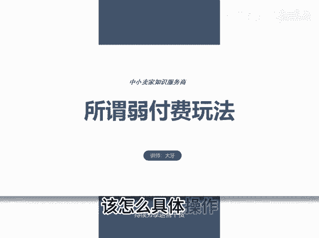
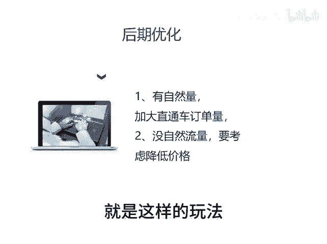

# 所谓弱付费玩法 - P1 - 千优电商教育 - BV1tmtzeHEY4

若付费该怎么做？很多朋友说我这品能不能做？若付费。还有人问若付费该怎么具体操作。其实我想说的是呢，路付费不是你想做就能做。因为很多博主在分享的时候，他没有告诉你若付费的前提。

这个视频呢我就好好的和大家聊一聊路付费的前提以及玩法。首先我们看什么是路付费。其实很简单，就是我们每天固定时间开车，这个时间是付费，在不开车的时间呢能够有订单进来，这种就称为弱付费。

它并不是说我开车就有流量，不开车就没有，不是这意思，就在不开车的时候，我们也要订单。首先呢路付费它是要求你产品价格要比同行相对有优势。就我们在上架链接的时候，你看一下同行的链接，就你的价格是不是有优势。

如果没有的话，做不成路付费。如果有，那么可以考虑。如果你没价格优势，那么你想办法把你的产品外露价格做到行业相对比较低也可以，这是第一步。第二步呢就是我们同款上架5到10条链接。为什么。😡。

上架5到10的链接呢，因为我们要测试嘛，这5到17号链接，你尽量做到标题关键词不一样。主图文案不一样。SKU不一样，价格呢有差别。那这样上下链接之后呢，就是报上活动，开上车，那报什么活动。

大促的21365，其他的大促能报的差不多就报了。然后得到直通车里面每个链接限额100块，同时呢保本出价，我们重点观察直通车烧完之后有没有自然流量，所以呢你的直通车要尽快的烧完。如果直通车烧不动。

你可以再提高出价，在前期微亏一点不要紧，怕的是直接烧不动，等到烧动之后，我们要观察怎么样呢？就是你直通车烧完之后，自然流量是不是超过30%，如果超过这时候你可以加大直通车的订单量。如果呢没有自然流量。

这时候你要考虑降低价格或者是降低外漏价格才能优化出自然流量，其实就是这样的玩耍。直通车加上免费，我是讲师大牙，欢迎大家扫码。😊。

添加我的微信，不方便扫码的朋友可以添加我的微信号，80221430。在这里给大家准备到了一套新手运营入门的大礼包，希望能够帮助大家。

