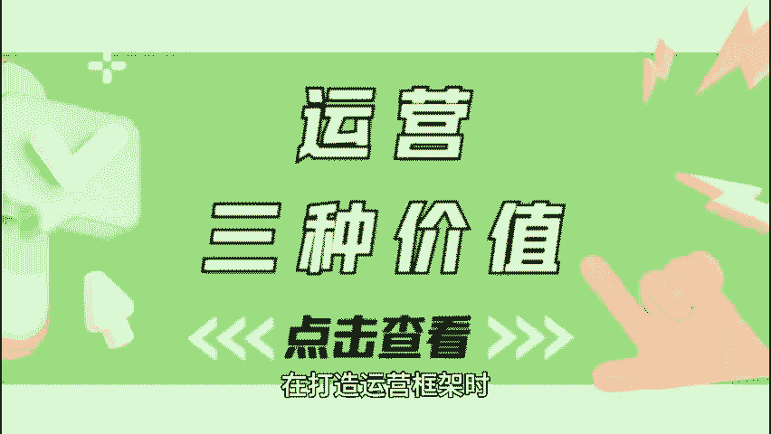
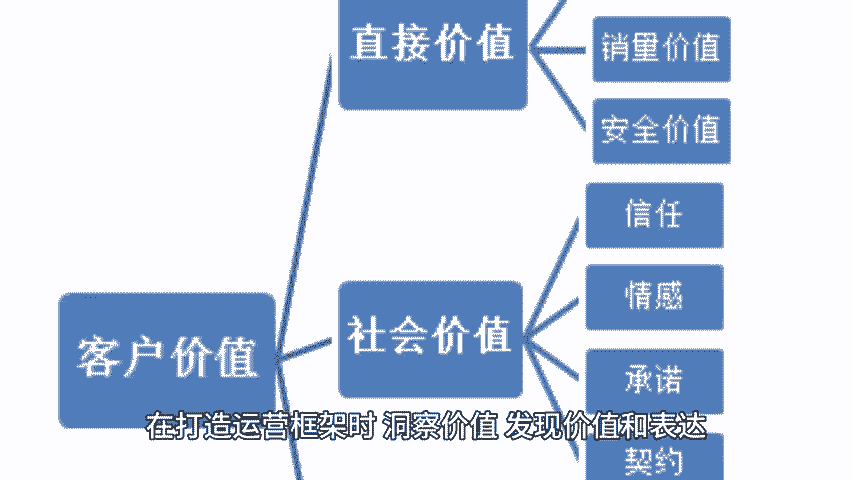

# 打造运营框架，这三种价值你必须满足！ - P1 - 私域运营咚咚 - BV1h6s8esEQc

🎼在打造运营框架时，我们需要重点关注的三种价值，就是洞察价值，发现价值和表达价值。想知道怎么做吗？赶紧看过来吧，以洞察价值了解用户的心，洞察价值可不是空洞的口号。

而是通过数据分析市场调研来深度了解用户的需求与市场动向，想象一下，如果你能清楚的知道用户在想什么？需要什么？那你的产品岂不是更容易被接受吗？比如通过分析用户的购买记录。你可以发现他们最喜欢的是什么款式。

进而优化你的产品线。2、发现价值不断创新，这意味着你需要在运营中不断探索新的机会，尝试不同的策略，初创企业可以通过小规模的市场测试，快速验证新产品的可行性。而且跨界合作也是个奇妙的主意。

比如一家健身房可以以健康食品品牌联名，推出饮食指导和健身课程的组合，轻松吸引到更多的用户群体，3、表达价值，与用户心灵沟通，这是把你的品牌价值。😊。

🎼产品优势传递给用户的重要环节，明确目标受众，制定个性化的传播方案，使用用户熟悉的语言，你就能与他们建立更深的联系。内容营销也是提高表达价值的绝佳手段哦。通过视频文章或直播与用户互动。

让他们不仅仅是观众，更是参与者，在打造运营框架时，洞察价值，发现价值和表达价值这三条路一定要走好。只有这样，你的品牌才能在瞬息万变的市场中稳稳立足，实现长久成功。😊。

