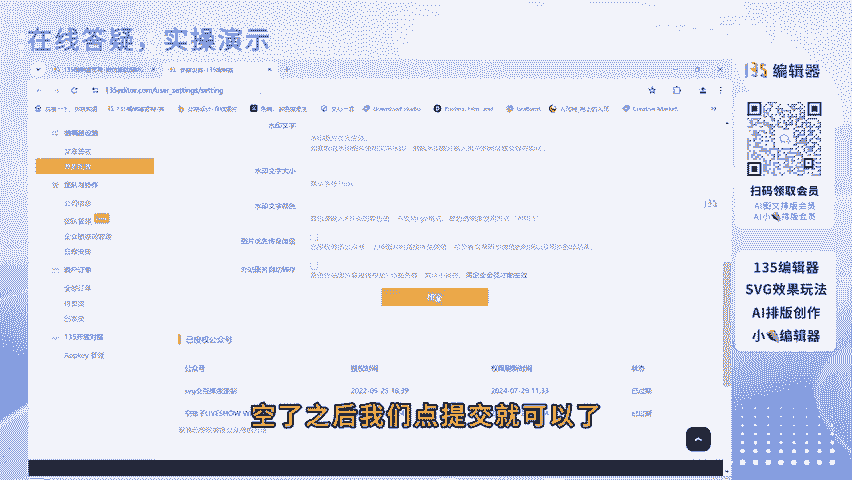
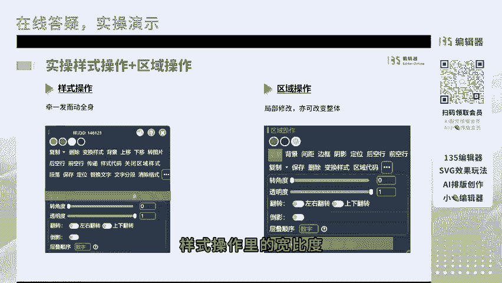
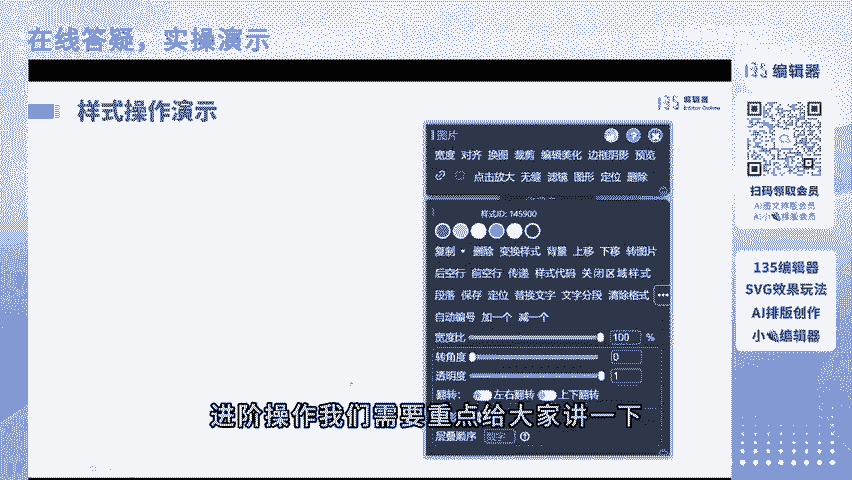
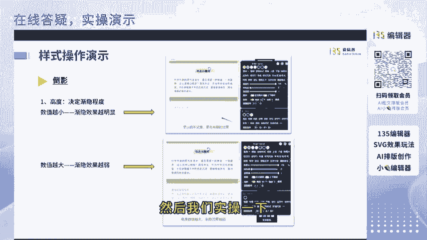
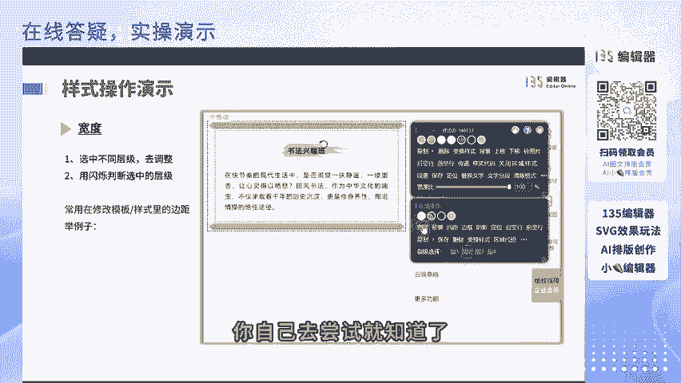
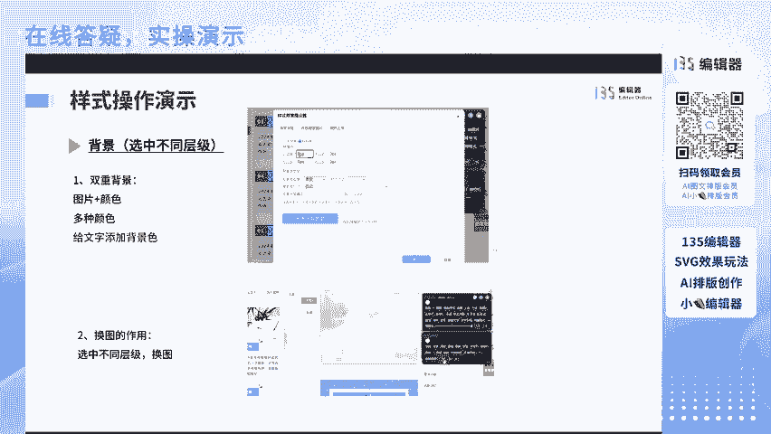
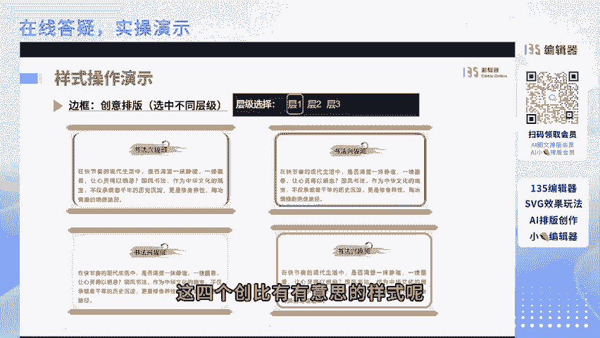
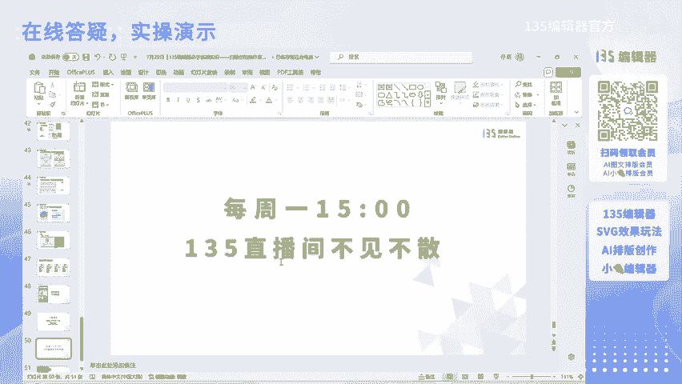

# 扫除你的操作盲点——小白如何逆袭为高手【135编辑器必学基础知识】 - P1 - 135编辑器官方 - BV1jf421i7Xi

嗯。那欢迎大家来到135编辑的直播间。接下来的两个小时直播里啊，非常开心的呢和大家一起去交流一下我们一些排版上的一些操作。啊，可以啊。好，没问题。可以说这两个小时之内啊能能解决你排版上90%的问题。

真正的能让你从小白逆袭到高手，这个是我敢打保证的。那接下来我们在等其他同学的同时，先给大家放一波福利，好不好啊？欢迎我们新进直播间的朋友们啊，我们进来之后可以看到我们左侧大家可以先领一下我们免费的会员。

左侧有一个二维码。大家可以扫码领一下我们135的AI排版的月会员，以及AI小红书的月会员是两个会员，是免费领取的哈，可以扫码自己领取一下，以及我们专门为。在我们右侧这里可以看得到，对不对？

右侧这个二维码这里领会员。喂。啊，好啊，我看到了，看到大家说可以了。那我们在正式讲我们的主题之前，先简单给大家介绍一下。我们有一个。等一下啊，我去喊一下其他同学。等我一下。大家先领一下左侧二维码。

这个有一两个月会员，一个是AI排版的会员，一个是小红书排版的会员。我们有一个直播间专属的福利，有一共有4个套餐。在我们直播间的。右下角。哎，稍等稍等稍等，马上片刻啊，我看看我们的购物袋怎么还没有上呢？

我稍后会给大家上一个购物袋，在我们的右下角有一个三个套餐，一个是针对我们小白有1个9。9米长鲜的会员价格，还有一个是蓝色的标签是135编辑器的终身会员。这个终身会员在我们官方网站不是经常有的。

它是属于一个不定期的一个掉落。但是在这个属于我们直播间专属的一个优惠。这个终身会员，而且我们送一个SVG编辑器的V一会员。这个V一会员也是终身的哦，只需要599米，只有直播间才能享受得到。

其他有一个橙色和粉色的标签，是我们对应的是笔格的终身会员以及AI排版的终身会员。笔格是对于小白来说，比如说一些公众号的封面啊，海报设影模板等等，大家都可以去看一看。那我们废话不多说。

我们正式进入今天的知识环节。我们今天主要讲两个大主题。第一个主题是如何全方位的掌握我们的新旧工具栏，以及第二个方面是样式操作工具栏怎样使用的？那为了方便大家去更好的观看体验呢，大家可以手机横屏观看。

能更清晰一些。如果有条件的话，咱们可以用电脑跟着继续操作一下，在。我直播的过程中，大家如果有什么问题呀，以及没有听明白的地方，都可以随时的告诉我，或者是点赞来引起我的注意哦。那在我们正式讲解之前呢。

我们先要认识一下135编辑器的面板，最左侧的。最左侧的这个叫工具栏，这里有我的文章，我的图片等等，大家都可以找得到。紧接着它的这个左侧黄色画框的分区域是我们的样式展示区。

我们可以搜索的自己排版所要的所有样式。蓝色的这个框区域是我们的素材编辑区域。

最右侧也就是我们常见的一些功能区域。比如说复制使用啊，导入文章等等。哦。问一下朋友们，可以听得见我的声音不？这个速度可以，是不是好？第一大方面就是全方位掌握新旧工具栏。那我们在掌握新旧工具栏之前呢。

要先认识一下如何切换我们的新旧工具栏。我们一共分为老版工具栏和新版的工具栏。嗯。老板的工具栏就是大家所看到的上面这部分，这里呢就是属于你一目了然。在这里你都可以随机随便的去点击操作。

新版工具栏就是底下这一个比较它的特点就是简洁方便。

给大家实操一下怎样去切换这个新旧老版和新版工具栏。这个所看到的就是我们的老板工具栏。如果如何切换呢？是点击这里鼠标放到右侧的功能设置上，我们会弹出一个这个框。然，我们勾选一下工具栏，这样就可以切换了。

这个状态就是我们的新版工具栏。你会发现没有你所要的不全，对不对？没关系，我们可以点插入，这里你可以找到其他的设置，或者呢我们还可以自己点击最右侧的加号，自定义编辑功能，自己去添加。但是一定要注意哦。

我们最多只能设置的是23个栏目。那我们继续切换回去，因为我个人比较喜欢用我们的老版的这个工具了，因为它是属于一目了然。这个没有问题，对不对？好嘞，我们继续下一个。欢迎新来的宝贝们。

新来新进直热圈的宝贝们，可以先领一下我们的会员，右侧有个码，扫码一下，我们可以领我们的AI排版会员和135和小红书的AI会员，2个月会员啊都是免费领取的。

那我们全方为实操一下工具栏的每一个功能点都是什么。先看一下它的文字格式的设置，我们分为基础操作和间接操作，基文字的基础操作，也就是我们这里所看到的。

比如说文字的加粗倾斜颜色、字体的对齐字间距下划线等一等。它的间接操作，也就是文字的阴影，文字的背景色边框，还有我们所能看到的这些文字的上标和下标。O接下来给大家实操一下。我来找一下。

是不是我的网速和你们不是很同步啊？我们看一下文字的加粗，找一下。选中文字在这里就可以加粗，直接实的它倾斜以及文字的下划线。文字的下划线也可以根据自己所需要的去修改颜色，在这里修改颜色。

这个色盘色盘的调取呢，有有的同学进来可能看不到色盘，我们点击一下，显示色盘四个字就能够看到这个色盘自己去拉取。就可以随便修改它的下划线的颜色。同样它的删除线也是如此的去设置颜色，字体的颜色这些都很基础。

就简单的给大家展示一下。那它的进间阶操作就是文字的阴影。我们在一些比较特色的排版当中可以看到就这些带阴影的文字都是怎么设置的呢？在我们135编辑器里都是可以进行自己设置这个地方1个T。

这里显示的是字体阴影。点进去，这里所有的都可以选择。比如说这个。点击确定就可以了。哦放大一下。而且呢你还可以自己DIY1个属于自己的。文字阴影在这里，你觉得这里不够，你用的话，也可以点击这里设置阴影。

我们还可以添加这里有它的偏移X轴Y轴都可以去添。这样。根据自己的喜好去随时的调节都可以。然后点击确定。看这个就是我们DIY的。还接下来是一个文字的背景色，这个文字背景色也通常用于我们排版当中。

比如说强调。重点呀都会用得到是在文字应的后面AB有个背景色，我们点击一下。这样就可以了。然后改改颜色就可以在这里。但是这里可以看到，你觉得它是紧贴着文字的对吧？有一个小技巧呢。

就是我们可以在一个文字的后面。给他空行，然后我们把这个公司的工资可以打到。再打一遍。这样你看着就会好看一些了，这是我们的一个文字背景色的一个小技巧。还有一个我们常见的呃上一次在我们的用户群体。

用户微信群里啊，都可以看到大家问这种文字的边框去怎么做呢？这个也很简单，但是在这里我们是看不到的，我们需要选中你所做文字边框的几个文字，然后就会自动弹出一个文字的辅助工具栏。

辅助工具栏这里有一个A在一个边框里，这个就是文字边框。这样就可以了。这个文字边框颜色大家也可以根据自己需要的去修改。还有一个就是文字的上标和下标，通常用于有一些宝贝是。谈一些。论文的参考文献呀等等。

这些经常会用得到，这是上标，这是下标，这是怎样去做的呢？我们也可以写一个，比如说A。这里写个B。文字的上标是选中你所需要做上标的文字。也会自动弹出一个文字辅助工具来。你好呀，宝贝啊。

我看到你给我打招呼了。选中它啊，有同学问这个辅助工具栏上来之后上来之后，你就可以看得见。在这里。看不见这个点这个三个省略号，就可以看到这个上标。这样上边就做好了，下标同样是选中弹出一个文字辅助工具来。

如果你看不到这个下标的标志，就是你没有点开它，点开这个三个省略号，点击它下标。这样就可以了。O这一趴大家有没有不懂的地方呀？如果有不懂的地方，可以评论区告诉我或者弹幕告诉我。可以听可以，是不是？

如果没问题的话，那么我们就就需要进行下一个环节了。ok。第二个是我们的。背景设置。哦，我看到有同学说我有一个点没有讲，是不是？好，我再继续上一个，有一个全文文字的样式，全文文字的样式在这里。

这个是我们的全文文字的样式，帮我找一下。听啥。全文文字的样式。点击这个你就可以跳，你可以对我们整篇的文字进行一个基础的设置。比如说行高字号、字间距以及等一等都可以进行设置。我们可以设置一下默认字体。

的这个默认字体大家一定要记得选择我们。不侵权的字体或者你已经购买版权的字体，颜色可以自己去改。然后手行缩进。断前句和断后距都可以进行去修改。以及他的对齐方式。点它就会应用到全文当中所有的文字当中。

所以大家一定要慎用啊。这就是全文的文字格式。还有一个是需要讲解的是我们的对齐方式。我们对齐有左对齐。左这是左对齐，可以看到这面是。右侧会参差不齐，这个我们不是常用，常用的可能就是句中对齐。

它适用于我们的一些短文案，不适用于成段的文案。还有就是右侧对齐，两端对齐，这里有一个首行缩进，首行缩进有一点是。非常需要注意的就是因为有的时候你复制一段文字进来呀。他并不是默认两端对齐的。

有时候你复制一段文字进来，可能他是。居左对齐，但是你要想既实现它的首行缩进，又想让两端文字对齐呢，我们都要同时选中两端对齐以及首行缩进。这样你才会能看起来更排版更美观一些。我们可以预览。

这样可以看到才是我们需要的。它后面的是我们的一个。两侧边距。这是两侧边距，我们一一给大家进行一个演示，以及断前句和断后句。断前句断后句它有一个什么作用啊？

比如说我不想让这两段文字中间啊离得太离的一行的距离，一行距离我觉得可能太空了。那这个时候我们通常就会用到断前距以及断后句。还有一个是字间距的问题。字间距呢我们通常用的是1。5的字间距，行间距呢1。

75或者是2，但一定要秉承一个原则，就是我们的行间距一定要大于字间距，这样在排版上看起来才会更美观一些。还有一个需要特别注意的哦。对，还有一个同学提醒我一个全文文字样式里有一个英文断词。

这个通常会遇到一些英文排版同学。他会觉得有的时候先给大家演示一下。你复制进来，你也不知道他有没有断词。这是断词。附进来的时候，预览的时候不只是预览，还有你排版的时候，我们会发现一个单词它断开了。在这里。

你看这个单词断开了，那我们。预览的时候看着就不是很美观，那我们就需要自己给它调整一下。在这里全文文字样式里把这个英文断词让我们改为补断词，应用到全文就可以了，这样就可以了。ok我们进行下一个环节。

大家如果有条件，可以跟着我们具体实操一下，这个能听明白不？我讲明白了吗？讲明白可以大家可以在评论区跟我互动一下，打一个一。如果没懂的话，可以在评论区随时告诉我。第二个非常重要的一个工具栏的。

功能点就是背景设置，我们的背景设置一共有3种。比如说图片背景，常见的图片背景，还有颜色背景，颜色背景分为我们常见的纯色背景和渐变色背景。再就是我们的双背景，双背景可以看到动态图，在纯色上面动。

这个后面给大家实操演示。还有就是多种颜色的背景。我们先看一下图片背景的设置是如何设置的。图片背景。有的同学问我的图片背景设置为什么不完美呀？那这里有个非常关键的几个点，一定要注意，大家可以截屏。

记一下我们的知识点。一会儿我在实操中也会给大家具体的演示。我们点开这个背景设置里啊，上下左右边距，推荐大家都设V0。这个为什么呢？因为它方便于你后续去更改全文两侧的边距。

这个一会给大家演示这个背景图的尺寸，这里是特别重要的，通常选择的就是水平拉伸等比，对其方式是居中重复方式是竖值重复，这个是。最优的一个解。而且如果你要上上传自己设自己设计的一个背景图的话。

一定要注意图片不能大小不能大于4M。如果你超过了，在微信，你复制到微信公众号是不显示的。建议呢我们是680的一个宽高度也要控制在4000以内。一般呢2000左右，我个人觉得是比较合适的。

太超过2000的话，就会加载比较慢一些。那我们带大家一起实操一下。这里的背景设置。在背景设置里，我们点开背景设置，在这个文字的后面这里。可以看到这个是背景。我们有在线背景，可供大家去随时的选择。

这里有很多。我们随便选择一个。这里是改为0，这一会儿讲一下为什么要都改为0尺寸呢？我们改为水平等比拉伸，居中重复方式，垂直重复，这就可以了。加一些。Okay。这样就做好了。

为什么要我们的背景要给它设置一个两侧。上上下和左右边距都要是零了。因为有的时候有的同学会说我怎么改我模板两侧的这个边距呀，我想让它小一点。如果你设置为十的话，就不好设，就不好随时去修改了。这样修改的话。

你就可以随意的去改我们每个样式的宽度，就方便你能达到你所要排版的每一个宽度可以自定义这个宽度，所以。我们这样这样方便你去改它的宽度，所以才让大家设置为0的。还有一个就是这个为什么会设置为。垂直重复呢。

如果我们设置其他重复啊，我们可以看一下，选择一个我的背景。比如说这个你看到它会整体的拉伸了。平铺。水平重复。因为有的时候它就属于不显示了，所以我们这个最重要的一个设置就用它的垂直重复。就可以。

这个有没有不太明白的同学呀？如果有的话，可以直接的告诉我哦。啊，欢迎新来的宝贝们。新来的宝贝们可以扫我们右侧的一个二维码，先领一下我们两个免费的阅读会员哦。一个是我们的AI排版的会员。

一个是我们小红书的AI会员是免费领取的哦。扫码我扫右侧的这个二维码，找我们工作人员就可以免费领取了。那我们继续下一环节，没有问题的话，我们就继续了。第二个背景设置有一个是颜色的背景设置。

纯色也就是我们右侧所看到的这是纯色的背景，还有。渐变色的背景渐变色的背景，这个有没有知道渐变色背景是怎么设置的呢？我看我们宝贝有很多是我们的老用户，有知道的吗？有知道的话可以在评论区告诉我哦。有吗？

有没有知道我们的渐变背景是怎么设置的？那我先给大家演示一下，我看大家听的太投入了，想听我讲啊，可以，如果有条件呢，大家可以拿出电脑自己跟着我一起实操一下。我们纯色背景嗯同样的。习惯上我们都给它设置为0。

选择一个颜色。颜色这个背景图设置啊，你就无所谓了，这里的背景图就不需要设置了。这只是对于背景图的一个设置。这就是纯色的设置。还有一个渐变色的设置，我不知道大家有没有看到在这个位置有一个渐变色。

我们可以勾选一下。这样它就是渐变色了，但是有没有看到它不是很明显，但是它是有渐变色的。这就是刚刚我提到它的渐变色勾选的渐变它是不明显的。但是它存在的，它是属于从中间往两边的一个渐变。呃。

在PS里可以说叫。镜像简变也可以这么说，叫镜像简变。不是很专业，但它是从中间往两边，我可以给大家看一下它为什么是有渐变的。我们看一下，吸一下颜色就知道中间是这个色质，越往两边颜色越深，看得到变化吧。

能看得到吗？能看到给我打个一啊。中间是浅色的一个橙色。越往两侧颜色越深，这是从中间往两边的一个渐变。好，可以听得见。这个能懂对吧？但是这个我们不推荐呀，看起来不明显，对吧？

我们要用的话就要用一个明显的用一个明显的渐变色，就是我们需要这个时候我们就需要我们的配色方案了。这个挡住我了。配色方案。啊，有的同学说这个配色方案自己的电脑上为什么没有啊，有没有知道这个配色方案。

我们怎么需要怎么给它调出来呢？有知道的吗？正常呢我们是在功能设置这里，这里有一个隐藏的，我们勾选一下就会隐藏，把这个勾选去掉，就会可以看到我们的配色方案。想要全纹有一个明显的渐变色。

在这里我们选择一个全纹换色。在下面有一个渐变色。这样我们就有一个渐变色背景了啊。对，但是大家也发现了，它是属于全文换色，是把你所有的样式也换了。所以呢我们使用这个配色方案里的渐变色，有个非常重要的一点。

需要注意，就是在你排版整个你的文章之前，先随便用一个样式。换成一个渐变色，后续再进行其他的排版，不然你所有的东西都变成一个颜色了，对吧？这样的话这样就可以了，这是一个渐变色的设置。这个可以听得懂。

对不对？好，继续下一个。再下一个就是双背景的设置，图片加颜色以及多种颜色。图片加颜色我们分为静态图和动态图。静态图就是我们右侧看到的这个飞机的。绿色背景这个是属于。静态图动态图就是什么？

后面看到这个例子。飞起来的这个是它的静态图。不动态图这个静态图，静态的双色背景呢一定要记得需要设置的是PNG的格式，同样和我们背景图设置的大小一样，一定要3M以内，宽也是680，高是4000以内。

动态图有一个不同的一点，需要注意的就是动画一定不能超过300帧。如果你超过了300帧是不显示的。同样也是建议大家是4M以内宽高和静态图一样，这样是是一个安全的设置。对一个多种颜色的这个背景呢。

我们后面会给大家详细讲解，我们先演示一下图片渐雅加颜色这个双色背景。清空一下。好。图片是在这里，我们一样是点击背景。我先找一个PNG格式的图片。比如说我还是找一个这飞机吧。我们回到背景设置。

同样我们选中一个颜色。我要选择重复设置。因为有图有背景图片，所以我们要按照这个尺寸来水平拉伸等比税税数值重复，以及居中对齐。那这样呢可以看到我们的双色背景图片加静态图的就设置好了。

那图片加静加动态图的呢。也是同样的步骤，我们改一个动态图，动态我们可以在。135编辑器的在线背景图，在线背景图就找一个。比如说这个。飞起的颗粒。我们改一个颜色。红色更能更明显一点。哎。

这样双我们的双背景就制作好了。这个有没有问题呀？如果听听明白，听得懂的，大家可以评论区给我扣个一啊。如果有问题的话，可以在评论区告诉我我的速度慢吗？还是说我的速度快呀，来问一问大家。如果慢或快的话。

大家可以给我一个建议。我来根据大家的需求来调整一下。对我看到大家提醒了，手机观看的话，提醒你横屏观看会更。好一点。那接下来我们继续看一个全文图片样式的设置。有的同学说。

我不想一个一个图片去设置我的剧中啊。还有禁止放大缩小等等。我想一键设置我全文的图片，这样可以吗？可以，当然可以。那135编辑器是属于无所不能。我们找一个啊。比如这个你看着。啊。

有的时候你会发现我自己拖拽了，它不是居中的，一一拖拽它就居左了，是怎么回事呢？是你没有设置。我们点一下这个对齐方式，全文居中就可以看到它自动的居中对齐了。这个尤其适用于我们随意拖拽图片大小的时候。

不想一个个设置居中，我们就用这个居中。还有一个想让图片无缝，全文都无缝的，就点无缝设置。啊，回消息。你问了什么？宝贝，你可以再刷一下，麻烦看一下。哪里有不太懂的吗？可以再说一遍。

我刚刚没有看到你说你问的问题是什么？啊，你今天买了模板啊，怎么？买了模板出现了什么问题吗？还是说不会修改呀？那我们欢迎新进群，新进直播间的朋友们啊。

新进直播间的朋友们可以先领一下我们免费送的两个阅度会员，扫右侧的二维码，有1个135的AI排版阅读会员，还有1个AI小红书排版会员，2个阅度会员哦，可以扫码找我们的工作人员进行领取。那个背景图啊。

我看到你说了，那个背景图片复制到别的地方，有水印，一直改不了啊。有水印的这个问题。嗯，你是复制到公众号是吧？有一点需要注意的就是你公众号平台自己先去看一下，把那个水印先关闭，在135里呢。

也可以一个关闭一个水印，右侧看到这个了吗？这个。鼠标放到你的昵称上面，我教你怎么改，你没有水印啊，然后鼠标放到昵称上面，你就会弹出这个对话框，有个水印设置。在这里呢水印设置我们把这个改为无水印设置。

然后把这些全部都给它清空。清把这些全部都给它清空，全部是空，空了之后，我们点提交就可以了。点完提交，我们回到编辑你的界面，刷新一下编辑器，刷新一下编辑器之后。

再把你应用的排版的这个模板呢复制粘贴你的公众号后台，这样去操作，看一下还有没有水印。如果再有水印的话，你还可以嗯找一下我们的工作人员，我给你一对一的去再教你一遍，右侧扫码，可以找一下。

好吧。你先去操作一下，那我们先进行下一个问题。下一个操作。我们刚刚讲到了全文图片样式的设置。那我们继续讲这个问题。全文图片样式我们是讲到它可以。五缝全文的图片无缝。还可以让全文的图片进行一个圆形的设置。

这样。还可以进行全文进行一个把全文的图片都加一个边框。我想给全文的图片都加一个边框怎么办呢？选中图片。我们点击边框阴影，这里有所有的边框阴影的格式，我们选择一个我们选中一个这个啊。改一下圆景。

改一下圆角，然后改一下颜色。如果你想应用到全文，就点击应用到全文所有图片。OK这样就成了啊，我看看背景图可以无缝衔接了吗？可以的。

这个刚刚讲到了背景图无缝衔接最关键的点就是啊首先你要确保你的图是不带白边的啊。如果你带白边就不行了。你想背景图无缝衔接。在这里是很重要的一个。我们。点背景点背景设置。上传你的背景图，我已经上传了。

我就选择一个我的背景图啊。有。然后背景图的尺寸呢，我们选择水平拉伸等比，对齐方式选择居中。是重复方式选择竖值重复这个背景图尺尺寸，这里这三个是非常重要的一点。这个就是它的无缝，这样就可以去看到。

这是这后面文字就是我的一个背景图，就可以看到它全部重复的背景，我的背景图，这样就可以。不同模板，不同背景啊，没的问题。这个我们一会儿就要讲到了啊，可以期待一下。那大家可以给我点个赞。点点赞啊。然后如果。

讲到你非常感兴趣的问题呢，要要喊你的同事来听，可以转发一下我们的直播间到你的群里，或者到自己的朋友圈，喊一下其他同学一起来听。这个模板不同背景同学要听着啊，彩虹同学马上我们就要到了。这个是在我们后面讲。

我们继续讲它的上传图片，单图和多传多图，这个大家应该是比较熟悉的了。那这个位这个呢我就给大家快速的讲一下。在这里就是单图上传和多图上传。我们有需要特别注意的一点哈，图片上传有一个大小的限制。

同样是GIF动态图呢，所以说这里不能超过5M动画不能超过300帧。但是为了让你的图顺利的弄起来呢，最好一般就是3M左右就够用了。然后它的图片嗯静态图呢宽高层级是不能大于300万的。

公众号的要求是图片不能超过10M。当然你在135编辑器里多图上传是可以超过10M的，但是它会给你压缩的，给你压缩到10M以内。就这个就是一个图片的上传问题。那我们继续有这个是一个非常关键的一点。

表格工具，通常会遇到我们的学员讲我们怎么删除，怎么插入表格，怎么移动啊，还有对齐，以及行高列宽表格属性的边框啊，单元格背景色度怎么修改呢？这个接下来给大家一一的进行讲解。如果有条件。

大家可以拿电脑进行一个实操。插入表格我们有两两个操作，一个是在我们的工具栏这里直接插入表格。还有个就是我们直接去样式中心。先使用我们的一个表格样式，有回放的，但是我们需要等2到3个工作日回放。

这个回放是需要去B站。B站搜一下135编辑器，找一下我们的官方。2到3个工作日之后，你就可以看到本期的一个回放。那接下来我给大家依次展示一下。这个表格表格的删除插入OK。插入是在这里插入一个表格。

这里几行几列，大家可以自己去插入。你要想调出表格操作的一个工具，是需要怎么去调出来的呢？调出表格操作面板，一个是鼠标右键，还有一个是通过区域操作里的一个表格操作。在这里。插入表格之后，点击一下。

这里有个闪烁，光标在这里之后，鼠标右键，这里是一系列的表格的一个操作。还有就是当你插入了表格之后，我们会弹出一个。样式操作的这样一个工具栏。在这里呢我们有一个表格操作。有的同学说没有的表格操作怎么办呢？

那就是你还没有开启我们的区域样式。开启一下区域样式，就可以看到我们的表格操作几个字。让我想删除这一行怎么操作呢？你。我先演示一下，用鼠标右键删除当前行就可以了。在这里呢也是这两个操作是完全一样的。

只是所在的位置不一样啊，你可以都可以看见删除当前行。插入表格也是鼠标右键，比如说向左插入，向前插入都可以。我都给大家演示一下啊，后插入行，这都可以。然后还有一个移动表格，我们我移动一下，我们换一下。

然后打几个字。比如说想把表这一系列这一表这个我给它移到别的地方，怎么移动呢？我们点击表格。有个表格行列的移动，表格行上移或表格行下移。这样就直接移动了，这个有没有讲清楚啊，讲清楚可以给我打个一啊。

或者这个有没有。感觉我操作太快，不明白的都可以在我们的评论区告诉我。没有的话，我们就进行下一个。有个移动，还有一有个移动对齐方式。接下来就是我们这种单元格的颜色是需要怎样去修改的呢？

也是需要通过区域操作这个背景里进行一个修改。来，我们操作一下这个单元格颜色。这个一定要把这个操作面板给它调出来啊，这个知道怎么调出来。对的吧，这个再演示一下，开启区域操作，然后点击它点击背景。

进入背景设置，选择颜色。这样。就设置了我们的单元格的颜色。表格还有一个。单元格的音。有一个表格，表格的单元格的一个属性。这里。表格。这是一种方法，一共两个方法，一个是通过表格单元格属性。我어。

可以右键标了鼠标右键表格单元格的属性，这个自动弹出了我们的背景色，这这里看出白的，然后我们鼠标点一下就会弹出我们的色盘。选择一个颜色确定。两种方法都可以设置。一个是我们区域背景里的区域操作里的背景。

一个是鼠标右键单元格。单元格单元格的属性或者是表格操作点开也会出现表格单元格的属性。这个可以懂，对吧？好。那表格的这种边框需要怎么设置呢？通常也是需要鼠标右键。来，我实操一下。边框看一下鼠标右键。表格。

这个有点遮挡了，我用上次。表格属性看到啊表格表格属性，这6个表格边框也是鼠标点击一下就会跳出来。可以看到这里已经能看到它的这个示例已经变成了我们的A。这样它的边框就可以进行修改了。

这就是它的边框颜色的调整。那这里如果嗯我看到有的之前有同学会问，我不想要边框，但我还想要表格，我想让边框变成透明色。这有没有同学知道怎么才能让颜色变成透明呢？哎，这个又折挡了。好。有知道的吗？

有知道怎么才能让我们的颜色变成透明吗？也是同样这里啊，我们是在颜色这里做个文章，比如说表格边框这个颜色呀，这个地方。选无色吗？也对，但是我们没有无色设置是怎么设置呢？这我们进来之后呢，我先把这个关闭。

表格边框，我们点击一下，弹出这个色盘啊，我们选择哪个就是哪个？这个A代表的就是透明度，一就代表的是越这样改为零，它就会变成透明的颜色了。我好像改成功了，我改一下。给他改成0。这样你可以看到它是背景。

它这个边框是边框颜色就变成透明了，点击确定。可以看到了，我还可以在这里设置表格，实际还是存在的，但是边框是没有颜色的了，这个就是边框变成透明色的，这就是颜色变成透明色。

也就是把A这个A一改为零就变成透明色了。这个是通用的。啊，高级是不是这个特别好用，后面我们还会涉及到这个非常重要啊。那我们继续进行。还有一个就是我们的单元格的对齐方式啊。

比如说上面我看到这个135编辑器和笔格设计，它都在最左侧，我们怎样才能达到让它在居中呢？上下左右它它这个空隙啊都是一样的，需要怎么操作呢？演示通过我们的表格操作里的单元格对齐方式选择一个居中。我。

给大家找一个。我有个表格。这个表格。比如这个笔格设计，我想让这个文字居中，我点击它直接有个表格操作，有个表格单元格对齐，这个就和我们的excel表格一样的操作。然后我们选择这个居中，哎，这样就可以了。

这样就是你的文字就变成居中了。但是这个需要你一个一个这样去操作设置了。这个挺这个明白了没？明白，可以给我打个一。哇，好多人呐来欢迎我们新进直播间的宝贝们。然后新进直播间的表宝贝们呢可以领一下我们的免费。

我们有两个免费的阅读会员给大家啊，一个是我们的135的AI排版会员，一个是我们小红书的AI排版会员，扫我们的右侧二维码，找工作人员免费领取哦。这个什么时候有SVG的教程直播呀？有的。嗯，SVG。

本周你关注，你可以预约一下我们的直播间，我们我们每周一、周二、周三、周四都有直播。上次上上周我上次我们进行了一个上周直播了，这周也会有。然后随时关注一下，预约一下，到时候我们会进行一个。提醒的。

或者你可以扫码进扫右侧的码，找我们工作人员呢进一下我们的社群，我们也会在社群告诉大家什么时候有具体的SVG教程直播，怎么领会员啊？右侧可以看到我们的这个直播界面右侧有个二维码，扫码领会员。

1个AI排版的会员，一个小红书排版的会员。对，我们上节课就有了。OK那我们进行下一个啊单元格对齐，这里讲完了，还有一个。比较关键的两个点就是行高和列宽是怎么调整的呢？行高先讲行高。

行高有一个非常简单的方法，就是回车键。还有一个就是通过间距去调整，我先给大家进行一个演示。比如说回车键。这样就改了，这个很简单，对不对？但是这个呢不能达到的一个是什么呢？就是你这样去改的话，改的是。

我只我需要写两行文字啊，如果我是单行的文字，我想让这135编辑器站到中间，这个是实现不了的这回车键是实现不了的，就没有办法。那还有一个就是说我们所说的一个间距，可以改我们的行高。

这个也是需要把我们的样式操作这个面板调出来啊，然后点击区域样式，开启区域样式这样。间距啊，我们选择内间内边距，哎，它怎么跳出去了？比如说我们改一下上下左右的间距。没选中，不好意思。20。

这个表格怎么出了问题？我再加入再插入一个表格，比是这个。135。编辑器。这样。点击间距内间距。我们可以选中一下，上面是15嗯。可以看到上面就已经开始变化了，左侧20，右侧20。它在中间了。

我们再改一下它的对齐方式，这样看着更明显。再改大一点。302525这样。他就在中间了。这就是行高。这样去海改航高，一个惠车间，一个是间距的航高。还有一个是通过还有一个裂宽需要怎么去改的呢？

裂宽是需要通过宽度去调整。这里。点击宽度，这里有个百分比。哎，你随便去拖拽就能调整它的列宽了。嗯，一般用居中这样就可以了。有的同学就会问，难道他不能像excel表格一样。

我拖中两个单元格之间这个中间线去调整吗？能的，但是为什么不推荐呢？因为它非常的不好选中啊。你看我你看我这么熟悉的一个手，都很不容易选中这个中间线去调整它的宽度，还有它的行高。

所以我们不推荐去用那个选的不容易选中，用这两个方法啊。进行下一个操作，就是我们还有一个格式刷和提取样式的区别。有没有同学知道我们的格式刷和提取样式有什么区别吗？最关键的区别是什么呢？有没有知道的呀？

有知道的可以在评论区告诉我。我们格式刷呢。找一下。あいや。隔式刷是在这个里一个小刷子。就代表我们的一个格式刷。格式刷它有一个区别，就是最大的一个区别，就是格式刷，它能它能只能刷文字的颜色。

文字的大小、文字清斜下划线加粗等等。它是无法实现刷你的字间距行间距以及它这个两侧的对齐，以及它的对齐方式是不能刷，是不能实现的，只能刷这些。操作一下就晓得了。比如说我让上面下面的文字变成上面。

我们就选择一个格式刷，点击这个。格式刷单次是单次秒杀，双击就可以开启连续秒杀。你可以看到对吧？这里呢你可以看到我们都实现了它的加粗以及它这个颜色的变化，还有下划线。但是它的字间距和行间距都没有去实现。

这个是实现不了的，格式刷是实现不了的。但是我们可以用其他方法实现，也就是我们的提取格式，提取格式是能够实现，格式刷所不能实现的。再这样选中你所需要提取的文字，然后点击提取样式。哎。

我们可以看到鼠标放上去可以看到我们提取了文字的颜色、字号的大小、行高以及字间距。然后应用到下面呢是选中下面这段文字，点击一下，这样就可以使用了。但两者有一个共同点是可以发现的，它都不能。

让你实现对齐方式的格式刷或者是提取文字的这个对齐方式都是不能实现的。但提取格式有一点实现不了的就是。倾斜这个倾斜是实现不了，倾斜一下给大家操作一下。比如说倾斜。提取一下啊。提取样式。提取。

但是它提取不到我们的倾斜。应用一下，这是我们刚刚提取的，看这个倾斜是提取不了的。还有一个是对齐方式，比如说两端对齐。用格式刷也是不能实现的。都是无法实现。用我们的这个。同样是没不能实现的。

对其方式就需要大家自己去手动进行一个操作。那。我们。讲一下okK这个可以明白不明白，可以给我打个一哦。我们还有其他就是加入一下特殊字符啊。对，明白，如果不方便打一呢，那就点点赞。

右下角点一下那个免费的赞。就是大拇指的这个，我们还有个特殊字符。特殊字符。在这里。一些创意排版你都可以用到。比如说这些星芒啊，你不想自己去设置，在这里都可以找到数字符号以及箭头、拼音、日文、希腊文俄文。

其他都有。这样就可以不用去找，还有这个表情也是在这有的，没有QQ表情。这样加上你的加上一些特殊字符或者是表情。会让你的排版更加的有趣味性。那还有一个就是我们的清除格式。清除格式呢啊，这个应该最先讲了。

这个没有讲到，现在讲也没事，清除格式。比如说我这段文字，这个清除格式是说。我们在所有排版在你正式排版之前，必须要先清除一下我们的文字格式，不然你的排版会会乱掉的。

如果你从word里或者是其他地方复制文字进来，你会发现有白底儿。这个时候呢我们就需要点击一下清除格式，排版之前一定要先清除格式。O。下一个就是查询替换的一个功能。在这里。查找。给我查一下135编辑器。

你就可以查找，在这里就出来了。上一个，然后我想替换呢，同样是135变音器，我给替换成笔格设计。这就相当于我们word里的查询替换，就不需要你自己用眼睛去找那了，哦你全部替换。OK就可以了。

你看135变辑器这几个字就替换成比格设计了。还有一个就是我们全文的自动排版，全文有个自动排版，就是我不想一一段一段文字自己去清除格式。这个时候我们就用到了全文的一个自动排版。要要要不要等一下。

这儿呢全是自动排版电烫。点这个全按自动排版，有个小魔术棒的位置，在这里你可以直接设置好，我清除格式，清除字号，清除字体，这些是常用的一个清除格式，清除字号清除。清除字体。因为这些是呃扫除你所有的障碍。

就让你的文字成一个。裸的状态就你排版就不会错了，这样就可以执行。看全部都清浮了，这样就可以了。嗯，格式是这个里头还有没有上面讲的这些知识点，大家有没有不太懂的呀。如果有不懂的，可以在评论区告诉我。

我看我看一下，我们讲了有一个小时了，啊我们给大家抽个奖吧，好不好？那我们抽奖的时候呢，大家可以。我们抽个奖，在我们的评论区输入我们的口令就可以。图文排版就用135编辑器刷起来。

一会儿我截屏给大家进行一个抽奖，我们抽三个人吧。然后送出我们的135编器的会员，三个人送三个会员。3天的135编辑器的会员可以刷起来，一会儿我进行截屏给大家看看谁能中奖。然后在我们抽奖的时候。

大家可以先在我们的评论区刷起来。在我们抽奖之前呢，先给大家再送一个福利，就是我们的右侧啊，欢迎我们新进直播间的朋友们啊。我们右侧有个二维码，大家可以先领一领我们免费的两个月度会员。

右侧二维码扫码领取的是我们AI排版的会员，一个月度会员。还有一个是小红书的AI排版会员，这都是免费领取的。扫右侧的二维码，找我们的工作人员领取。然后我们等一等其他人，然后刷一下我们的口令就是图文排版。

就用135编辑器。还有一个福利是我们直播间专属的。就是我们有套餐。有个会员套餐。在我们右右下角有个购物袋啊，购物袋就是。里面对应4个标签，有黄色的黄色标签是对应我们的一个月月会员是9。9米。

这个是比我们官网。价格是便宜很多的，是我们直播间专属的一个。对于非常适合一个尝鲜的新手来说，还有就是嗯如果大家不不会设计怎么办呢？那没问题，我们可以用笔格设计的终身会员，非常适合小白设计，里面有。

我们的封面图的模板，公众号封面图的模板以及海报设计的模板。还有一个就是我们AI终身排版会员，是我们嗯比如说我是刚进入这个行业，我对编辑器也不熟悉怎么办呢？没问题的，我们可以用AI排版会员。

如果你先不想购买怎么办？我们可以先体验一下，体验一下就扫我们的右侧二维码，找我们工作人员领取一下我们的AI排版会员和我们的小红书AI会员都是可以进行一个领取。

先领我们可以先尝鲜一下我们的AI排版会员是什么样的，再进行去购买也可以的。还有一个重磅的福利是我们直播间专属，就是这个终身会员的。我们社群里有很多的小伙伴们问什么时候会有终身会员呢？哎，现在就有了啊。

可以转发到转发给你的朋友，把我们直播间转发给你的朋友来我们的直播间进行一个下单。这个终身会员呢，我们还送一个SVG编辑器的V一会员，这个V一会员也是终身的哟，是所有的SVG编辑器里。

V一等级的互动效果全部是免费使用的，只需要599米。抽中。好。现在是我们抽奖中哦，想抽奖的，我们可以把直播间分享到啊分享给你的朋友来看一看，需要终身会员的，一定要抓紧这个时间啊。除了我们的直播间。

你是妈几乎很难找到我们的终身会员。因为这个在我们官网是属于不定期的掉落，凭运气在直播间你是可以拿得到的，是在有我们右下角有一个。购物袋我们选那个蓝色标签就可以看得到。好好，马上就抽。

抽奖okK我马上就要抽奖给大家倒计时抽奖了啊。拿我倒计时以我这边的手机为准，大家现在滚动起来。5。4321。ok我截图了啊。中奖的呢，我们可以。中奖的我们扫右侧的二维码。

找我们的官找我们的官方工作人员去领取我们的会员，3天的135变辑器会员。中奖的三个人是有我这里的看得到的是黑嘿一个等嘿黑同学，还有等一下也不回家。我们抽3个。还有一个是两个句号同学，三个同学中奖了哈。

再说一遍是黑黑同学，等一下也不回家。还有还有是两个句号的这个同学找一下我们工作人员右侧。扫码添加工作人员输入兑奖即可以领取。我先喝一口水啊。这一盘的内容大家有没有不理解的？如果不理解的话。

可以随时在评论区告诉我。当然呢你也可以如果评论区怕我看不见了，你就可以疯狂的点赞提醒一下我，这样我也是能够可以看看得到的。欢迎我们的。新进直播间的同同学新进直播间的同学记得领取一下我们的会员。

扫右侧二维码，领两个月度会员就可以了。那我们继续进行下一盘内容，可以不？下一排内容是样式操作工具栏，是怎样使用的？这个是非常重要的一点啊。

如何开启如何开启区域操作？这个左侧的这个是属于我们的基础版本。可以说叫旧版本。右侧这是新版的一个全局的版本操作，但是我们需要切换一下。有的同学进来之后会发用编辑器会发现我只有这个基础版本。

我想我想要切换到右侧这个版本怎么切换呢？在这里。我先找一个样式给大家讲这个。这里。切换的话鼠标放到功能设置这里，然后最上面有个切换到基础旧版，勾选一下这个弹出来的就是旧版的一个样式操作的工具栏。

如果你想切换到新版的鼠标，然后把这个勾选取消掉。哎，这样就是新版的新版这里。我们。先进来，它是自动的，不会让你开启区域样式。你可能看到的是这样一个，我们需要点击这个开启区域样式。

你才会出现所有全部的样式操作面板，这样就全面了。是这样进行一个操作。那我们看一下区域样，我们的样式操作和区域操作样式操作在这里可以看到吧，这样我们显写上了放大一些。样式操作红色字体样式操作。

这个蓝色的就是区域操作。这个正常是在这个下面呢，我给挪到这里来。样式操作和区域操作有一个。不同点大家知道是什么不同点吗？有没有知道的，有知道的可以在评论区告诉我。

它最大的一个不同点就是样式操作控制的是我们整个样式的修改，可以说是牵引发耳动全身区域操作，你既可以进行一个局部的修改，也可以进行一个整体的修改。因为它有一个秘密武器。什么是秘密武器？有没有知道的。

有没有知道我们区域操作里最最重要的一个点，最关键的一个点是什么？就是我们的层级选择。这个后面我们会去讲，我们可以看到有一定的区别，这个宽比度啊，样式操作里的宽比度在区域操作里是变成了一个宽度。

那样式操作先给大家实操，我们也是会给大家一个一个进行一个演示。样式操作我们分为基础知识和进阶操作，进阶操作非常非常的重要。基础操作。你找一下。哎哎。基础操作有一个锁定面板。

这个我们正常习惯它就会自动在这个地方。如果你不想让它在这儿，我想在让它在左侧没问题，我们给它拖过来给它锁住，它就固定在这里了。你看下次你再打开，它就在这一个地方了，看到了，对不对？我们给它解开。

还有一个样式ID，这个有个样式ID有没有知道这个I样式ID的作用是什么呢？钥匙ID有个作用就是。上次有个同学问老师，我怎么才能知道这篇文章里这个样式。用的是哪一个样式啊，我们怎么才能快速找到呢？哎。

这个就来了。样式ID样式ID你点击它弹出这个工具栏，我们点击一下样式ID就复制了。你想找到它复制之后在这里粘贴，这样我们就可以快速的找到，找到同款的样式，这就是样式ID的作用。样式ID还有一个作用就是。

你还可以嗯当工作人员问你啊，你的这个问题，你的样式是哪个问题，是是哪个样式啊，哪个样式出问题了。问你的样式ID就是这个你点击它点击这个复制给他就可以了。还有进行一个样式颜色的修改，样式颜色的修改。

鼠标放到这我们颜色的圈圈上，哪个颜色闪烁？比如说我想改这个浅的这个黄色，闪烁就代明我可以改变改的是这个颜色。这样我想改这个下划线的颜色。那下划线闪烁了，我就可以改他。啊，我改成透明了这个。文字的颜色。

就点击你的文字颜色去修改就可以了。复制粘贴。我想复制这个。样式我们可以点复制。用这个你可以直接这样去粘贴。还有一个就是我不想粘贴怎么办呢？那我就复制并插入，就自动粘贴了，这就是复制并插入，我想剪切。

比如说剪切，我想放到它上面呢，我就前空行一下。粘贴粘贴的快捷键就是contrl加V。样式的删除操作，这个都很简单。OK这样你就删除了哈。还有一个变换样式，变换样式就是样式替换成别的样式，你不用删除。

我直接替换点击它。编好像是。不能展示这个展示这个。系。但是他有时候变换就会把你原来的那个文字也加入进来，这样是变换的。这个我不是通常用它。也有很多同学喜欢用它，这样都可以。

我更喜欢的就是自己去插入一个样式这样。就可以瞬间变换了。还有一个叫上下移动，比如说想把这个样式移到。加一个。我想把它移到它两个之间，那我们就这样移动就行，或者呢我拖住它这样去移动，上下做上下移动。

你想移动到什么位置都可以。还有一个叫转图片。转图边，我们找一段文字。这个我通常会用到，如果我的排版当中有英文的话。我为了让这个英文就是显得。如果我就想让英文在编编辑器里显示什么？

就不让它形成一个变量因素，因为我们排版是一个变量因素，不同手机显示的不一样，我想让它固定，这个时候就用转图片就行。呀我转图片。转太频繁了哈。就点击它就行，正常点它就行。但这个转伏片呢是。需要会员的。

这个时候呢需要会员，那你你不想买。那么多的会员，那这个时候你可以去花9。9米尝鲜一下我们的月度会员，先尝鲜一下，感觉不错呢，我们再入其他的会员是吧？我们黄色的标签就是我们的135的月度会员，啊。

蓝色标签是终身会员，这个终身会员一定要抓紧啊。如果有买终身会员的小小朋朋友们，可以转发给你的朋友来直播间去购买。Okay。嗯啊。我们还有一个叫样式代码，这个样式代码通常对于我们新手小白来说呀，嗯不是。

特别那么的好操作。如果你达到了一定的高手程度啊，可能会好操作一些。我给大家简单操作一下。嗯。比如。我想去掉背景。这样。而去掉背景呢，我们除了有一个万能的操作，就是清除格式，一键去除背景。还有一个就是。

在我们的这个。要是代码里。这里有一个背景色。然后这样去去掉。哎，没有怎么在这里？这个需要精准的去选择。哎，我看看啊，等我找一下。这呢这个。

background the image就代表的是我们的背景图的这个代码。然后给他。删掉选中删掉就可以了。嗯，这个怎么没删掉呢？稍等一刻啊。这个。没有我的那个。我自己加一个背景。好嘞，这里。啊，有点热。

给我热蒙了。这个这个是样式样式代码的背景，我还要去删样式代码的背景，我竟然去想删全文代码的背景，不好意思，朋友们，这样式代码的背景。这带背景的样式很少啊。我加一个样式背景。比如说这样式代码。

我加一个样式代码的背景，给他加一个背景。加一个颜色，加黑色明显一点。我想把这个黑色去掉。就在样式代码里。这里有一个background在开头这儿。color这个是黑色，我把黑色给它去掉。

这就是样式代码的一个作用。删掉。唉，这样就删掉了，这是样式代码的。O。这样我们就删掉了。那我么。样式代码。还有个替换文字，文字分段和清除格式。替换文字。我就把还是用这段文字给大家。

这个替换文字就跟刚刚我们讲这里个查询替换是一样的。替换文字，同样你输入你所需要替换的文字，换成你要的内容就可以了，这个就不去掩示了。文字分段，比如说我有好大段一个文字。我不想自己手动去分段怎么办呢？

这个时候你就用文字分段自动给我们分了。比如说在这同一个哎呀。在这里。文字分段就自动分段了就可以清除格式呢。这样。点击一下清除格式，通常用于样式里的清除格式。这个。我想不想用这个样式，我只想留下文字。

我就点清除格式。这样就清除成功了，这是属于样式面板操作里的基础一个操作。我们下面看一下间阶操作，间阶操作我们需要重点给大家讲一下，这个非常的那个重要。

间阶操作先讲一下它的背景，双色背景。啊，对，我们刚刚那个同学呢要看一下一个模板，我要改成多个背景，我找一下啊。有一个同学需要听那个我们多色背景的同学哪里去了，去给我去把他叫来听。

我们讲到他所要听的了多个背景。再好。这个非常重要啊，我们双色北京有图片加。颜色就我们这个飞机加背景色，还有个就是纯色多个纯色。比如说我们这个大背景是一个豆沙色。

我想要在全文的背景下设置这种多个颜色是怎么样设置呢？我们先讲这个。这个哎呀。我们先讲一个图片。图片减牙色的设置，这个我就不强调了，这个上面我们都强调了，一定要注意我们静态图和和偏辑图的这个尺寸。

我们想要设置它的一个，比如说图片加一个颜色的。复制一下。嗯。哎，我没复制进来。我想要给这段文字加个背景。就加一个图片加颜色的背景。我还是加一个背景色。我怎么有点卡住了，这电影色怎么出不来呢？嗯。😊，哎。

我的背景颜色怎么出不来了，我刷新一下，看是我的问题，还是。编辑器在哪里出现了问题？点击背景。OK啊，是我的问题，卡住了。我们点击这个背景色，我想要有一个图片，我们还是找飞机吧。

飞机它是一个右侧选击这个飞机。OK这颜色换一个有点重复了。换成一个还是换成绿色。然后一直是竖直重复，对齐放水居中图片的尺寸、水平拉伸等比。那这样就设置好了。那我想要设置多个颜色的背景是怎么样呢？

我们就用后空行一定要用后空行哦，不然你如果你回车你没法设置。后空行加一个。同样也是。把这个让文字粘贴一写。背景。颜色。哎，这样没有问题了。那这样呢我不想重复这样设置，我可以复制插入一下。复制插入一下。

我改一下颜色。我只需要设置一个，剩下我改颜色不就可以了，对不对？这样。这就是我们多色背景。那我们大背景色我再给它加一个全文的大背景色。加一个。这个颜色。同样给设置为0。O。啊。这个就多种背景就设置好了。

这样就是多色背景就设置OK了。这个有没有讲明白啊，讲明白可以在评论区给我扣个一。笑脸彩虹同学有没有听明白？这个会操作了不这个能操作了不？这个会操作的是吧？这个会操作了，如果是选模板加背景呢。

模板加背景也没有问题。啊，我找一个模板给你演示一下。比如说我的收藏里我找一个。这个整套是。选择一个别的。这个。呀，这是。企业会员的，我找一个整泡的是这个。500块钱再不改变。你如果你要想改变全文背景。

对，文文字背景，你模板背景也可以啊，这里你不是也是加入我们的全文的一个背景吗？我们先给它设置背景色，同样是给它设置背景色。然后我们在这里。去添加你所要的所需要的样式就可以了。然后复制插入。

我再换一个颜色背景。你在这里输入文字呢，就是文字背景色。你在这里输入在这个背景里输入样式呢，就是我们的样式背景色。这样就设置可以了，你这个这里你就一个模板里就有很多个多种背景了。这个背景和模板咋不一样。

大小，你说的背景和模板不一样，大小是什么意思呢？嗯，这个我没太听明白。你是想要这样吗？这个是我家的全文大背景，我不想要全文大背景就可以这样的。这是我给他进行了一个拉宽。我在这里给他加样式都可以。

这个就是一个文一文当中有多个颜，多个背景都可以。你是要这实现这样吗？就是模就是和模板底色的背景。模板和底色的背景。可能我还没理解到位吗？我理解的就是这上面你可以是模板。就是和模板底色的背景。

你说的是你是想一篇文章中使用多个模板，是这意思吗？啊。这个可能是我还没理解到位，你可以呢嗯把你的需求呢打出来，打到文字呢加一下我们的右侧工作人员下面的。然后在我下播之后呢。

我可以给你进行一个一对一的进行一个指导。扫右侧二维码，把你的问题发给我们的工作人员。然后后续呢我再给你进行一个详细的讲解，好不？就是模板背背景对此。就是把模板底色的背景变两种色。蓝色变绿色。

那先清除颜色。变一部分啊。啊，那不变一部分，你要先先给它清除颜色的。如果你想变一部分颜色，但是它已经有颜色的，这里你是改变不了的。除非你是这样模板，我点一下收藏。还还是要选一个有背景色的模板。

我们可以分开去使用啊。分开使用是不带有背景色的，不带有背景色的。啊，这是我不使用权的背件。这不带有背景色，比如说版头，我用这用了这个蓝色，后面不想用蓝色，我们就可以用刚才的那个选择。我去添加一个颜色。

然后把我们需要的这些我们给它单独加进来，哎，回车一下，这需要回车。是这样吗？这个背景有蓝色，有黄色，是这样吗？这样好，那我们先进行其他一个操作。如果没讲述清楚呢，那你可以扫二维码。

然后再跟我跟我详细讲一下，然后再给你录制一个视频啊，或者动态图都可以。我们先讲一个下一个啊。啊，讲下一个前后空行，就是刚刚一直强调前后空行一定要常用和多用。前后空行有一个作用，就是避免俄罗斯套娃。

什么叫俄罗斯套娃，一会给大家演示。如果你俄罗斯套完了，它就会出现一个样式的错乱，前空行呢就是顾名思义在样式前面加入空行，后空行在样式后面插入一个空行。我，关掉，O给找一个。样式前后空行。俄罗斯套娃。

我给你给大家讲一下什么叫俄罗斯套娃。嗯，找一个底色的模板。找一个底正文底色啊底色内容。即系。如果我只是回车去加一些样式，这样式不是很明显。那这个吧。俄罗斯套娃就是我在样式里，我不用我不用前后空旁。

我这样去添加。这个就叫俄罗斯套娃，你在这里套了一个又一个怎么办？如果你改的话，你一旦修改修改全部。潜一发而动天深的去修改了，所以这个是不推荐的，不推荐回车去加我们的一些样式。我们通常加样式呢。

就我们的前空行和后空行，前空行后空行去加样式，加文字啊，加排版啊等等这样去加。啊。谢谢你对我的肯定。欢迎我们新进群的朋友们啊。新进群的朋友们可以先领一波福利，就是我们免费送给大家两个月度会员。

一个是AI排版的会员，一个是我们小红书AI的会员，扫右侧的二维码，就可以免费的进行一个领取。😊，ok我们继续讲下一个下一个就是传递传递。传递它传递的是样式的颜色以及宽度应用到同样的样式当中。

是不是读起来有点拗口？实操还是需要实操。比如这个颜色我进行了一个修改。我使用了同一个颜同一个样式，我下面也想修改成上面这个颜色，怎么办？我这个时候就用到了传递，嗯，这样就进行了一个传递。

传递指传递的是颜色和宽比度，宽比度这个我也给大家进行一个演示。我还是同样改一下颜色。哎呀，这个太黑了哈。使用传递OK一定是同一个同一同种同样同一个样式，不好意思，嘴有点飘，同一个样式才能进行传递。

传递的只有颜色和它的宽比度，别的是进行不了传递的。还有一个是层叠顺序，这个层叠顺序就是之前我们说。它能让你的编辑器立刻变身为一个简单版本的PS这个层列顺序呃，你可以理解为我们PS里的。图层的一个顺序。

层叠顺序数字月。数数字越大，层级就越高。比如说数字二肯肯定二肯定比一大，对不对？它就在排在一上面。相当PS里的一个图层，它可用于调整元素的上下顺序。比如说这个这个你看的不明显，来给大家进行一个实操。

我改的这个颜色不是好看，我们用原来的这个。层叠顺序。有的时候我想让这个标题和这个下面这个样式紧挨着怎么办呢？这个时候这个定位一会后面讲啊。-20。如果我想让这个样式盖住这个标题，这你你修改的时候。

你觉得是盖住了，但它没有盖住我怎么样才能让它。把让他把标题的这个盖住呢，这个时候就用到了层叠顺序，层叠顺序是在这里打开这个面板之后，有3个省略号。然后点一下三个省略号，这里有个层叠顺序。数字越大。

层级越高。比如说我输入个2，你随便输入。再往上一点儿。Okay。这样就可以看到了，它是它这个图层不这个样式，就在这个样式的上面了。这个通常我们会用到一些创意排版会用到我给大家看一下之前改了一个。啊。

不是这个。有的一个哎。那个让我覆盖了。这也是负装是。这个通常用于创意排版，你可以自己去组合。你想让哪个样式再上呢？哪个样式的层叠顺序就比下面这个顺序高。你想让它再上呢，那我就输入一个9，它就在它上面了。

你这样就可以了，是不是很好玩，很有意思。这个直播有回放的，回放是需要2到3个工作日之后。在我们的B站搜索135编辑器，就可以看到我们的回放。这个理解了不？层列顺序，这个一定要理解这个层列顺序。后面。

我们还会用到这个层叠顺序。段落操作面板里的段落，这个段落呢就相当于我们的。全文的文字样式的修改。我们这里不是有一个全文文字样式修改吗？这个是应用到全文，但是我不想应用到全文。比如我改一下这个文字。加醋。

我想把下面这段文字改成上面这段文字加粗，我把字间距改小一点啊。是横间距改成1。5。让下面这段文字变成上面这段文字，我们除了格式刷以及去取。提取那个之外呢，我们还可以进行一个段落。点击这个段落。

在这个段落里是仅应用于一个段落。你可以在这里。进行一个行高的进行一个设置。这里字号字间距、横间距都可以进行一个调整。那在这里可以调整对齐。英文断词我就选择不断词，应用到本样式呢，就是单独的这个样式当中。

哎，它就进行调整了。那我们其他的这些样式就不会。去去修，就不会跟着改变而改变，这是一个段落。这是一个断落的一个作用。下面还有一个定位，这个定位的厉害了。定位通常用于我们的创意排版当中。

配合我们刚刚讲到的层叠顺序使用。定位呢。我给放大一下，是不是看不清了一个图。看不清没关系，一会儿还会给大家进行一个实操。定位点击这定位，我们会弹出弹出这个小工具栏，你可。你可以看到我们有一个左右偏移。

前间距后间距。左右偏移，你想向右的话就输入正数，向左就输入负数。前间距向上移填负数，向下移填正数，后间距就是下方这种上移呢，你就填负数，下移呢你就填正数。这里的数值是我做一个举例的作用。

对我们的层叠顺序的数字，你可以自己随意定啊，你想让可以随意定这个我给你演示。你想让他在它上面啊，你就让它高一点。比如说这个我刚刚设置的是9，是不是？那这个我比他大一个数字。大成十嗯。

数字随便输入就可以了。哦，我对我们每周都有一个直播。好。这个是定位，这个定定位我给大家实操一下，这是怎么操作的。可能有的同学我觉得我读不懂这个文字怎么办呢？找一下我收藏的样式。都是这个。定位。正数向右。

你想让这个往右呢向右移动，你还不想让它全部的。向右这样向右了，可以看到了。90。向左就负数，-50。不就可以。然后我们有一个前间距。强年去再加一个。20。40。向下移动，这就是向下移动，看到了吗？

这个定位向下移动填正数。它往下了，这个原来可以看到一个变化，这样填1个50向下移动就填正数，负数就是向上移动，添一个负数就上去了。后间距，你想让这个。样式离它更近一点，你可以调调它。下方内容上移添负数。

-40，它就上去了，对不对？然后你想让这两个样式离得远一点呢，那我们就填正数，这个就是一个定位。定位通常会用于一个创意排版，它怎么一个创意法呢？比如。我想把他把他们两个组合到一起。

我强硬的一个组合定位这样。哦。-2-。50。啊，不对，前后间去-50。不90吧。变化不大，这个数字是需要你自己去进行一个调节的。哎，这个定位。我想自己重新组合一个样式，比如说这个样式。

我想创造这个样式之后呢，就我们用到了定位，用到定位之后，我想让它显示这个样式在这个样式之上。我们就需要用到就是层叠顺序，这个层叠顺序我可以填一。你也可以填2，随便，只要你组合成就可以了。

然后这个还可以这个你填不填都可以，达到了你要的就可以了。哦哦刚才退回去了，再添一个啊。刚才一不小心触发了退回键。想让它在上面我就添个9。这个样式在这个样式上面。这个就形成了，这就是组合的一个创意样式。

通常一些我们模板中心一些作者都会用这个去自己创造一些DIY的样式。这就是我们的定位。这个点有没有不明白的，如果不明白，可以。告诉我哦。那没有的话，我们进行下一个，下一个叫加一个和减一个以及自动编号。

加减一个呢，它这个加减一个准只存在于我们的。正文段落样式就是这个。只存在一个正门段落样式。还会有一个如果带有数字编号的样式，还能实现我们的自动编号，而自动编号只存在于带有编号的样式当中。

比如说这个和这个都是可能实现自动编号的，你不用自己一个一个去修改它的数字。但是呢有一点需要注意，就是如果你用的不是编号的样式，你自己写个自己把样式改个数字，它能不能实现的，不能的。这个是不能的啊。

因为我们的编号样式是在代码中，它它已经有那个编号的那个代码了，所以它才能够识别。然后我们接下来接下来进行一个实操。加减一个这个。你看现在已经有3个了，我不想自己去复制粘贴，这个时候就用加一个。

加一减一个。加减一个。嗯。然后自动编号12345就可以了。这样就能实现了，这样你就不用自己去复制粘贴了。如果你自己想复制这个呢，嗯容易出现错乱的。你这样去复制是不不是这样复制的。

后面我也会教你怎样单独的去这样复制，但绝对不是这样去复制，这样复制会出现问题。这个样式就叫正文段落样式。我们可以在这里正文。有一个段落正文。它应用到段落段落正文里才会出现加减一个，不是所有样式都有。

一定要记得是段落正文里才有。宽比度啊宽比度的通常也是应用于我们的创意排版，还有就是它不会改变你。全文两侧的一个编距的一个问题，宽比度。啊，不如我先加一个背景吧，能更直观一点。这个背景不明显。

找一个明显的背景去。Okay。花笔都在这里OK。没问题了，这样就可以了。然后它不会改变你的全文两侧边距。比如说你全文我没有给它设置边距的。最好的一点就是我可以自己随意去调我每个样式。

每个部分的一个宽比度，这个时候就用到偏宽比度，它不会改变你两侧的这个原有的这个边距这个问题。然后他为什么说通常用于它一个创意排版呢？我们还是举个例子。书法。用这个距离。比如啊我就看中了这个样式。

这个底色的样式呢，我就喜欢这个底色样式，我想让它变成一个标题样式怎么办呢？这个时候我们就会用到一个宽比度。I'm。135编辑器你改一个颜色，文字改一个白色。17。我想让它变成一个剧组的一个标题。

只把它作为一个左标题，这个时候我们就可以用可以用宽敏度。这里宽密度看到了吗？调到你所需要的一个宽度，然后点击居左居中或者是居右都可以。这个你可以在有一些模板，你可以看到它会用到这些创意排版。

这是我们的创意排版会用到这个又学到了一张是不？那你学到这么多呢，记得给我点点赞。😊，你还可以吧。直播间分享给你的朋友啊，你的同事来学一学我们的。基础操作这个操作绝对是你日常当中都用得到的。

这节课你学下来啊，你绝对可以解决你的90%上的操作问题，我是可以打保票的哟。啊，欢迎我们新进群的朋友们，我们有免费的会员可以领取，我们有左侧二维码扫码找工作人员领取以下我们两个月度会员。

一个是AI排版的会员，一个是AI小红书的一个会员，真是干货满满。好，谢谢你的支持。我们后续内容会做的越来越好的。OK下一个就是一个转角度。

可以看到这个这两个样式啊是我自己组合的这个转角度也通常应用于创意排版。创意排版当中也要配合我们的层叠顺序和定位使用。这样的样式我们也能够看得到。如果有的。同学就会问了，我怎么做出这种样式呢？

这个时候我们可以用到转角度以及配合层叠和定位去使用，怎么去使用呢？给大家演示一下。清空一下。我们还是找那个样式给大家演示吧。这个看到了吧？这个。哎，这个就是我们自己这个是样式中心有的样式。

有很多我们越来越熟悉的同学就觉得我想自己做这个也是可以的，完全没有问题。比如这个我们找的这个样式，再随便找一个找个这个。做一个类似刚刚这种的是怎么做呢？我想让它转角度，点击这个啊，一定要先点三个省略号。

转角度这有一个关键点，就是你需要绕到360度来回旋转，旋转到你要的距离。你觉得这个不是我要的，不是你要的。哦，可以再转来回旋转，转到你要的角度为止。8。这样就可以。来回旋转360度旋转。

ok这个就不给券转了这个。然后做成做成做这个。然后我们用到它先转一个角度。找一个角度转角度。就转这个吧。转这个了，转上去了。有的时候我觉得。它离得有些远呢，这个时候我们就用到了定位，让它向上一点。

-50可以往上了，太大了，对吧？定位。然后我想让它始终在上面显示，虽然你看到它在上面了，但有的时候你碰到这个样式啊，你用了定位之后，它会覆盖到。就比如说像现在上面这个样式覆盖到了下面的样式。

你虽然看的你点它，你只有点它它才会在上面，但它实际还是在下面。这个时候我们就又会用到层叠顺序。我们加个3。哎，这回就可以看到了，无论你去怎么修改啊，手机预览也好也好呀，它都会在这个上面。

这个就是我们的转角度，转角度配合我们的层叠顺序和定位使用。这刚刚我们用到了定位，可以看到定位，然后还有一个层叠顺序，这个是非常关键的一点。OK这点。这点理解了不？这点理解了，可以给我。可以扣个一。

我看大家有没有理解，如果没理解，还可以再讲解一下啊。啊，那我们进行下一个下一个就是左右翻转，左右翻转也应用到我们的创业排版当中。通常也可以使配合我们的层叠顺序去使用。但是需要注意。

我们是多次要进行一个多次左右旋转。翻转，比如说这个样式，我想让它变成左侧的这个样式，我们需要怎么进行操作呢？给大家进行一个演示奥运会。我搜一下。巴黎这个奥运会我就还用那个样式给大家演示更直观一些。

比如说这种啊有的是带有镜像样式的，你可以去搜它的镜像样式。但是这种没有呢，没有这种时候我们就要需要自己去做一个。这个是通常我们用户会用到这个问题，我们可以使用它。旋转也是点击它弹出工具栏，点击这个。

出现一个左右翻转。ok。你会发现它进行了一个左右翻转，但是呢它是一个整体的翻转，文字也转了，图片也转了。这个时候就需要我们进行一个多次的左右翻转。什么叫多次的左右翻转呢？就想让文字给它正过来，点击它。

我们有个区域操作啊，我知道有大家说我没有区域操作怎么办呢？看那个样式操作，我们开启一下区域样式，然后同样在区域操作一定要选中它。什么叫选中呢？比如说出现这个蓝色虚线框，就代表你选中了，点击它。

也是三个省略号。然后点左右翻转。这个图片也可以进行一个左右翻转，就图片是反的，可能这个图片也看不太出来，但能看出图片也是反的。正常我不想让它图片进行反的。如果图片是反的，你上传的图片也会变成反的。

哦给看一下这个图片，你看。这个图片是反的，对不对？因为我本身这个图片它是这样的，它这个鞋在右侧，但是我换图之后，它是在左侧了，所以也需要把图片进行一个翻转。同样也是点一下这个图片，图片这里出现了虚线框。

啊，对，怎么突然的开始搞装修了，很突然。然后也是点它三个省略号，然后点击左右翻转。网站登不上啊，现在编辑器是正常的，你可以刷新一下试试，然后点左右翻转，这样就正了。就正哎。我们换回到原来的这个。

点击它进行一个左右翻转。这样图片也就变成了正确的一个位置，文字也变成了一个正确的位置。这个就是我们自己DIY的一个左右。镜像的一个样式，这个就是我我所提到的需要进行多次左右翻转的一个问题。

一定要记得把文字也转过来，这个懂没懂？这个讲清楚了不讲清楚了，可以扣一个一，我看大家有多少听懂的。如果没听懂，你就再讲一遍。哦，我喝一口水。对的，先整体翻转在区域翻转太聪明了，就是在这里。那。

这个这个是刚刚翻转的，就这几个翻转可以看到我把这些都给打开，你就看到了，我进行了两次或三两次翻转。因为这个样式比较简单，如果你。遇到一个里面特别多的，你就需要进行各种去翻转它。

这样多的样式我可以找一个什么叫多的样式呢？嗯。样式涂层太多的，好像没有太没有那么多。基本上其实我们样式中心镜像样式比较多，偶尔会碰到这种不是镜像样式的。比如这种左右图文，你就可以自己这样进行一个翻转。

听懂了是吧？听懂了，那我们进行下一个。倒影啊。倒影在这里是不是太这样能看得清吧。倒影也是在这个。操作区域操作面板里倒影它的高度决定它的见影的一个程度。数值越小呢，它见影的效果越明显。

可以看到这里这个看不清也，没事，一会儿给大家实操。数值越大呢，见影效果就会越弱，这样就没有那么完美。然后我们实操一下。

拿它实操也可以，都没问题，也是同样点击这个三个省略号。然后我们开启倒影啊，我需要把下面这个给它删掉啊。开启倒影可以看到了吧，这样倒影就出现了这个高度我设置的60，这个你可以随便设置数值越小。

你可以看到它的渐影效果越明显，也就是。显示的不是太那么完整，数值越大，见影效果越弱。就可能达达不到你那个从那个。有点渐变到透明的那种效果，想要渐变到透明那种效果，数值呢我们就可以给它用小一点。

这样就可以了，这就是它的倒影。这个偏移。说的是它的间距数值越大，这里个间距越大，数值越小，间距越小。20或者你完全可以不用设置，这就是倒影。这也是通常我们用到一些创意排版当中。可以增加给我们的排版。

增加一些趣味性，都是没问题的。OK这个倒影可以懂了哈，我们继续进行下一个，就是刚刚讲到这个偏移间距的大小。如果需有需要的，可以自己进行一个截图。还有个图片工具栏。图片工具栏。图片工具栏点击图片。

你会进行一不用它，我再换一个给大家。我没有一个上下图的。图片。用它也行。图片有的时候你想调整它宽度呢，就在这里调整。可以进行一个调整宽度。对齐这个对齐是很重要。嗯，有的时候比如说你插入一个图片呀。

插入一个图片。这个你想让他更剧左对齐，你就剧左就可以了。因为有的时候你点了它居左是没反应的，但通常我操作都都能反应。有的时候你点这个居组它不好用不好用，它不是不好用，它也有出现作用了。

这个时候你需要再给它居左一次，你点左对齐，它就会过来了。但通常我一般点击它这些都是比较好用的。偶尔你就会碰见那个情况，你就需要点两点两个对齐，一个左对齐，然后点击一下这个左对齐，然后你想换图的话。

我们就点击这个换图。如果你想按照我们的样式图片的大小去换图，那我们就点选择图片裁剪，就按照样式大小。模板的立体感怎么设置？你指的模板的立体感是什么立体感呢？我感觉这个你要把那个图片发出来。

可能更直观一些。模板的立体感，哎，你可以发给扫码发给我们的那个工作人员，我看一下什么是模板的立体感。这个我确实没有想到什么是模板的立体感。这个换图在这里就可以。然后换图我们有一个裁剪，这个裁剪呢哈。

你可以按照比例啊或者缩放啊去裁剪。这个裁剪我个人不是很推荐去用它。呃，因为我通常遇到大家会说我想裁剪，就是自己随意拖拽，随意拖拽的裁剪在这里，我们点换图，点裁剪图边。点自由在这里呢你可以随意的去拖拽。

你还可以放到任何的位置。这个裁剪我觉得更万能一些，这里还有比例的裁剪啊，你就不用自己去嗯先裁剪后上传，直接在腰像编辑里就可以进行一个裁剪，自由裁剪，就在这里，然后你还可以进行一个图片翻转。

左右上下翻转都可以。这样就可以了，然后编辑美化就是我们直接跳转到我们的一些跳转到这个笔格设计里。你可以进行一个色彩或者一些滤镜的调整都可以。

啊，我这个网速好像现在没有那么快了，这个就先不演示啊，看到了，可以看到这些。分方可以进行去调整这个细致的。就先不给大家讲下一节课会给大家着重讲一下我们这些图片的各种知识点。OK图片工求栏。

我们就简单的一个带过。然后我们讲接下来详细讲我们的区域样式的一个操作。我看一下时间啊，我们区域样式。我看能不能讲解完区域要能讲解完，今天多讲一会儿给大家。在讲解区域样式完，嗯。

大家可以先消化一下我们的这个全局样式。我我习惯把它这个面板叫全局面板了，这个就样式操作。这个样式操作这个这些知识点有没有大家不太懂的？如果有没讲的不太清楚的呢，可以在评论区告诉我。

或者你说哪个点我还可以再。再给大家讲一下都可以。大家可以先回顾一下，给大家两分钟的时间。今天争取给大家讲了，嗯，大家可以先消化一下，消化之前呢。我看看啊，哇，有这么多还有进群的伙伴们。

还有没有没领会员的伙伴啊？如果没领会员的伙伴呢，可以去扫我们右侧二维码，领一下我们AI排版的月度会员和小红书AI的排版阅度会员。如果你想购买我们的会员呢，现在是比比我们官网的这个很划算。

我们直播间有专属有专专门的一个会员价格。在右侧。在直播间右下角有一个购物袋里，黄色标签是我们对于新手来说。比如说我想尝试一下135编辑器，你可以入个9。9米。

然后我想不会自己设置公众号的模板以及海报的模板等等。我们就可以去用一下我们的笔格设计，可以入一下这个。AI排版的终身会员就是所有的排版，你只需要提供文案，剩下的排版交给我们的AI就行了，就可以去。

看一下我们粉色便签下，在右下角购物袋里399米，最重磅的就是我们的这个终身会员。需要买终身会员的小伙伴可以把我们的直播间分享给你的朋友。因为这个只有在直播间你才会得到终身会员呢，而且在直播间下单呢。

我们还会送1个SVG编辑器V1的会员也是终身的哟。在我们官网是一直没有的，只有在编辑器有是我们右下角蓝色标签的，右下角购物袋里的蓝色标签。好，欢迎我们新进直播间的朋友们。然后大家觉得讲的不错的呢。

可以点点赞，或者转发给你的朋友来听一听我们的干货。有没有问题呢？大家不用害羞，也不要矜持，有什么不懂的呢，都可以提问，还可以给大家进行一个反复的讲。今天干货真的满满的。

几乎你这节课学学完了90%操作问题就能解决了。okK我们进行下一个问题啊，下一个区域样式操作的演示，这个也是我们每一个每个功能也会逐一给大家演示。其实它和全局的这个。差不太多，但是也有一定的区别。

有没有人知道我们区域样式操作，它有一个自己的秘密武器是什么？有没有知道的？有没有小朋友知道的，有知道的可以在评论区打出来。我们最关键的区域操作，最关键的一个秘密武器，就是它的一个层级选择。

你必须要降服层级选择，你降服不了它，你想做一些样式的修改。可能。就达不到。那我们接下来进行给大家一一进行一个展示一个宽度啊。我们可以看一下右侧这个给大家放大一下设置。比如说我想修改一下这个两这个宽度。

选我们需要选中不同层级去修，去调整它的宽度。你怎么样才能确确定你所选中的层级呢？就是。鼠标放到不同层级进行一个闪烁，就代表每个不同层。你自己去尝试就知道了。这个通常用到我们。

修改的模板和样式的编距里。演示一下啊。还是用之前的这个。这个是经常经常用到的，非常的重要。比如说。比如这个宽度，这个颜色，这个浅的这个颜色，我想让它更。窄一点怎么办呢？比如说看他。对。

这个有个很重要的一点，这个层级选择啊对于很多同学来说，不可能一次性的选中。这要这个就需要你自己啊去尝试多操作就知道了。这个它闪烁闪烁的就是文字。文字的这部分，比如说文字我调宽度，就这样可以去调。

调个居组居中都可以。你看这样去调都行。然后我想选中这个位置层级看到闪烁了，对不对？然后去选择调整宽度。OK这样就可以调整了。这个是我们应用到样式当中。宽度也通常应用到一些修改模板。

一些模板嗯之前的一些模板，比如说一些比较相对老的一些模板呀。可能会大部分需要去掌握这个层需要去掌握这个宽度，选中层级去改。但是现在我们很多模板都更新了，不会出现让你这样去改。

因为这个对于我们很多小白操作用户新手来说不是很方便。比如说这个模板啊，这个模板表面上看，大家是不是在改模板当中，经常觉得我想改两侧的编距，我怎么改呀。这这这没法改，对吧？这个时候我们就用到了层级的选择。

比如这个层级，你可以看到层级。你需要去调，选中一层，一个一个耐心的去调，看到这个宽度，哎，百分百不对，不是这个层级。那我们就在鼠标框的层二上再选宽度，这回就对了，它变成了90%了，是不是我想给它让。

窄一点儿。可以自己去调动，这样就可以了。我，刚才是90，我给它调到90。97。这样是不是就修改了？那比如说上面这个层级，这个层级这个图片这个宽度边距我也想去修改上面这个你不知道去修改。

一定要自己不知道怎样去修改，一个一个去尝试，选中层一不是层2。不是，因为底下这个小箭头没有框潜进去，层3，哎，我觉得层三是选中它，点击一下宽度。哎，我发现它是百分百改不了。

那就证明选中的层级还是不对的那我们继续去选中层一不是层三，还不是层4，这就代表这个。样式整个的层级可以看到数字有变化了，就证明选对了，这个时候进行一个宽度的一个修改，这样就可以了。

这次学会了不这个听懂了不？就是呢投影有没有那种多种投影方式，还是说只有单一的下投影？嗯。有的。这个投影有的嗯。你说的那个投影可以叫投影。那个其实应该叫阴影。可以说阴影。

比如说我现在这个课件展示的这个阴影。这个一会儿给大家讲，马上就会讲到了阴影，这个有的你可以调阴影。对的，这个阴影一会儿就给大家讲到有。这个宽度懂了没？懂了的话可以打一个一。如果没懂，就给大家再讲一下。

对，单独图片大小，文字大小都可以调了，这个宽度没问题哈，你继续哟怎么回来了间距。模板里的两侧间距其实它跟宽度也差不多，也是同样选中不同层级。

这个层级是现在是不是意识到这个层级是我们区域操作里一个秘密武器了，它太重要了，一定要去掌握它，选都是要选中不同层级去调整，同样是更可以更改样式或模板里的两侧边距或者上下边距，也是给大家进行一个演示。

这是一个动图可能看不太清，我们实际给演示一下，不两侧边距同样我刚才通过调整宽度去调整了它这个两侧的那个距离，对不对？我除了可以调整宽度啊，有的时候我们可以通过调整间距，也是需要选中不同层级去看。哎。

我觉得这个是已经试了，我们可以尝试嘛，对吧？不要怕出错。点内间距。比如说左侧这个应该不是太高太宽了。我们看一下这个这个才是内内和外大家都可以去选择。嗯比如说添加一个左侧边距，30，这回可能看到了，对吧？

这是左侧。上下边距同样也可以选择。且可以调整。Y边距。40看到了啊。40，这就是它的外边距，内边距是这儿，现在调的是这个区域，这个虚蓝色虚向框的区域，它的内外。编剧。是这样的。

也是同样是选着不同层语去调，这个大家可以慢慢的去根据自己需要去慢慢的去调。这个不是说你一次性就能够选中的。一嗯O。这个编距就可以了。我看一下有什么问题，多图片的生成临时链接出现不完整现象，怎么解决？

你是临时链接多图片的临时链接，你是打开这个链接之后，里面的图片显示不全吗？是不是显示不全呢？刚刚这个层根据层经选选选中不同程序去调整间距，理解了不？星期天同学，你说的多图片的生成临时链接显示不全。

是指你这个点开链接之后，这个图片显示的不全吗？只显示一部分吗？是这个意思吗？还是说别的意思？那如果嗯你觉得描述的文字描述不清晰呢，你可以。嗯，录个视频呢或者是详细说一下，详细说呢。

你可以把那个加一下工作人员微信右侧有个二维码，扫一下工作人员微信，把你的问题发给我。发给我之后，我后续呢会给你进行一个一对一的讲解，好不好？有什么问题都可以问啊。然后欢迎新进群的直播间。

欢迎新进直播间的朋友们。然后我们右侧二维码可以领取我们的阅读会员，大家可以进行自己领取啊。月度会员哦。一个月哦，加起来是两个月AI排版的会员，免费送的。😊，那我们继续进另继续问题。

继续讲解我们样式操作里同样也有一个背景。同样也有一个背景的选择，有一个背景。这个双重背景我们前面也讲了，就是跟前面的操作一样的。只不过它是在这个区域样式里，区域样式的背景里操作。所以这个部分就不。

不给大家去讲解了，一会儿给大家讲解一下文字添加背景。就是这个你可以看一下这个动图。我想给这段文字加个白色的背景。就可以也是一定要选中不同层级。

然后试操一下。比如说这个我想给这个文字颜色添加背景，怎么才知道是是我选中的文字的这个层呢？我选择层衣。点击一下背景。我加一个白色背景。同样我也可以加一下编剧。左右上下左右。哎，这样就加了文字背景。

也是通过选中不同层级去加背景。这样就可以了。这个区域样式里的背景除了可以设置多种背景之外呢，我们还有一个换图，通常也会用到区域样式里的这个背景选中不同层级去换图，通常碰到一些啊比较特殊的图片样式。哦。

找一下，应该是这个图片样式，看看样式一。不是这个。哎，我记得收藏了一个。这个。比如说这种图片样式，我无法正常换图，我们是不是应该双击。哎，我双击没有反应，没有反应怎么办呢？

这个通常是在这里换背景或者这里换背景，这个不确定你需要自己去看。如果是在。样式操作里方面你可以自己去操作。比如说点击样式，然后点击背景设置啊，我发现这这里背景图，这里是空的那就证明不是在这里操作。

那后证明是在区域操作区域背景里操作换图，点击它。这回看到了吧，这个就是换图，你可以去上上传那一个图片。然后我之前上之前有图片，我就直接换了这样。这样我们就实现了一个换图。

这种比较特殊的一些图片样式需要这样去换的。刚刚我是操作比较熟练了，我知道这样一下选择之后，我就知道能换背景。但是如果你不熟练了，比如说我一不小心我点到文字了，你点击背景的话，那你肯定换不了图啊。

因为它不是。选中的最外层的，所以需要选中层级，选中不对，那就选中它。哎哎呀，不背景。不对，也是不对，对吧？不对之后，那我们就往回选。这个就对了，直到选择出现你看到的这个图的时候，就证明你选对了。

OK这个没问题了不。没问题，我们可以进行下一个。边框啊。边框也是。应用到我们的创意排版当中。创意排版当中呢，边框也是通过选中不同层级，这个不同层级太重要，这就是它秘密武器。比如说这4个。

这四个创比有有意思的样式呢都不是我们原样式，都是进行了一个创意的排版，用边框进行了一个排版。

左侧这个来我们实操一下。看我原来是这样的，四四方方的，但加入这个了，这个加入一个边框，也是选中不同层级。就是比如说你是老手了，我就知道我选中的是浅色区域这个层级，我加一个边框，然后点击边框之后点击实现。

可以调整上下左右的。弧度也可以调整。哎。颜色。嗯，这样就是创意的，你也可以都加英都加。上下左右都加边框都可以。这样都可以，同样你给文字加边框也是这样的都可以。这样就可以了。这你想变成创意一点呢。

那我就让他我不想要两侧有边框，那你就填为0，对吧？我想让他弧度大一点呢，我就添大一点，填小一点呢，我就填小一点，这就是创意的。边框哎，有没有同学知道我不想让上面有边框，我想让下面有边框改哪改哪个呢？

我上面元素了。上面我有边框，但我上下不想要边框，我想要左右出现这个这两个文字条出现在左右，有知道的吗？有知道的可以在评论区说一下。左右的话。那就是。左右有边框，上下没边框，我就给它改为0。嗯。

这样就可以了。然后弧度可以进行一个修改。20。都可以，这样就可以。同样我们还可以进行一个其他边框的一个设置。比如实线，我还可以，这里有虚线选择，这太大了。改为机。你也可以改为虚线。

也可以改为实线双线点线呀，都可以，都可以这样自己去操作。你像有遇到很多我们的用户说，我想给文字加边框，就在这里也是同样去加边框就行。进行一个边框。我给选个红色。这加边框，但是你会发现它顶到了两侧呀。

顶到两侧怎么办？这方法太多了，我可以加两侧变距，对不对？两侧边距。然后下面呢我不想要编距，那我就改这里的间距。嗯，这样就可以了。都是有很多种方法去改，也也可以通过间距去调整，你也可以通过两侧边距去调整。

都是没有问题的，方法特别多。大家可以在陆续的操作中自己去摸索出自己习惯的一个操作。这一趴有没有不太懂的朋友啊？哇，好多人啦。啊，我们有大家可以点点赞。然后把你觉得不错呢。

可以把我们直播间分享给你的朋友和同事，学一学我们的干货啊。那这一盘没有问题啊，没有问题，我进行下一个操作。刚刚谁问的那个上下左右可以出倒影了，这个我们可以用阴影来解决。一儿来解决。没有内阴影和外阴影。

这个就是外阴影，这个就是内阴影啊，你好嘞。但是这个也是需要选中不同层级去操作，我们怎么改这个呢？哎呀，不好意思，我误点了。呀我怎么又5点？找一下。可能你上来，我你选中的就是文字的这个部分。这个虚线啊啊。

对，这里说一下，有的新手宝贝们觉得这个虚线我不要我去掉行不行？这个虚线其实是不存在的，这就相当于光标的一个作用。光标它只是只是只是呃一个定位的作用，这个只是一个选中的一个作用，但是它实际不存在。

蓝色曲线代表人选中的是文字，然后你可以看。哎，这个。证明我选中的是他的阴影，点击阴影，我可以点击那阴影。上下左右偏移，你都可以，这我让它上偏移模糊的大小。都可以。这就是内阴影。

这是不是看起来稍微有一点立体感了，那我还可以进行一个外影。然后你通过调整上下左右的偏移来决定它是呃就是。用你的话来说是在上面倒影还是下面倒影来决定它的阴影的位置是在哪里。

然后模糊的半径你也可以选择让它模糊大一点，模糊小一点都可以这样去调整，这样就有有了一种立体感。在一些的。模板中心我们会看到有这种是不是？那大家可以去尝试操作一下这个阴影。这个懂了不？这个懂了。

可以扣一波一。啊，欢迎我们新进群新进直播间的朋友。新进直播间的朋友呢可以领一下我们的免费的月度会员。我们月度会员可以找我们工作人员领取领取，扫右侧二维码，我们免费送1个月的AI排版会员。

还有一个免费的月度会员，小红书的AI排版会员。那我们讲下一个前后空行，前后空行也是要选中不同层级。这个前前后空行啊比我们样式操作里的前后空行更重要了。为什么？比如说这个样式，我想在标题和文字中间加文字。

你这个时候你就用到的就是前前后空行，还有类似这种正文段落，你想加文字加样式都怎么加呢？给大家演示操作一下。为什么说有的时候你会发现哎，我想在他后面加文字怎么整啊？我回车肯定不行，对不对？那这个我回车。

那我就套玩了呀，嗯也行，但是不推荐。这个时候呢我们就用到了区域样式里区域操作里的前空行在中间加前空行。然后你想在文字后面加混空号，在这里你可以加你各种样式都是可以的。这个就是前后空号。

一定不要俄罗斯套娃啊，俄罗斯套娃就是你回车你去改你去加图加文字去加图加文字就容易你一改动这个这个区域，你整个这个区域就跟着变动，所以不推荐。都是一定要多用，一定要多用前空行，后空行前空行后空行去添加。

尤其是一些段落样式。这种碰到这种段落样式。这种段落样式有的同学就问，我就想在这个标题下面加，我还不想在这个文字的背景色里加怎么办呢？我们就用到前后括号，点击它前空号，在这里你可以加文字。也可以加样式。

都可以。然后后框框在这里，然后加图片，加文字，加样式都行。这样去操作去加。才会不改变原来的样式。不然如果你回车去家是不行的。这样这就是前后空行的一个魅力。强括行。可以，这个有没有不理解的。

不理解的可以在评论区告诉我。O我们加快一点速度啊。还有一个复制复制的作用，复制也是需要选中不同层级去实现样式的增加。这我给你演示一下，这个可能看你觉得不直观。比如这个我想实现多复制几个这个标题。

我要怎么去复制这个标题呀？因为一些段落正文呢，就刚刚那个序带序号的一些段落正文。段落正文，你可能通过加一个加一个，我就添加了，对吧？但是这种它没有段落，没有加一个减一个怎么办？这个时候你就用到了复制。

这个复制也是需要选中不同层级。这里再强调一下就是。这种我知道我一下子选中了整个，但是你不知道你选中了整个层级怎么办呢？需要通过闪烁去判断你是不是选中的需要整个层级。

比如说这个我选中了这个层级之后点复制里的复制并插入哎，就可以了。那我不想在这个紧接着下面插入，我想插入到后面里，记得用后空行，然后呢，点复制。Controlry。哎，这样就去增加了。

你可以增加到任何的地方都是可以的。这个就是复制的作用。还有一个，比如说你碰到这种。碰到这种段落样式，有的它不带加减一个的时候，你也可以需要这样去操作。除了加一个减一个，还可以这样去操作，都可以。

都没有问题。你还可以给它单独复制出来。然后后控行我放到别的地方，我放在这里都是可以的。这个就都可以，没有问题。然后下一个就是我们的保存，这个保存是保存成为自己的个人样式。

比如我想把它保存我自己的一个样式保存嗯。这个一定要记得我们免费用户只能保存三个个人样式，然后。有。我保存的比较满了，我删除一个给大家操作啊，在这里保存之后就在个人这里。啊，个人这里我删掉一个。

比如说删掉他。啊。我点保存了，它就提示你保存成了个人样式，OK就可以了。在样式个人里就可以找到。可以再看样式，我们点击个人是不是就看到了宝。可以保存自己的样式。同样这个保存也一样。

它俩都是一个作用都一样。然后你想删除的话，想删除某一个部分。比如说想删除它我。不推荐这样去删除，你删的不干净。也是选中不同层级去调整。然后选中它删除就可以了。这个你想变换样式。

这个在我们这里它跟它的作用是一样的。最新。比如说我把这个变换一下样式，这个地方我换成他。哎呀妈呀。这个变换样式啊，我个人觉得有的不太通用。但这个样式他可能就不太通用这个，我们换一个别的。嗯。

这个就他他对于有些样式是不适用的，对于有些样式适用的。这个根据样式去改变。这个有个区域代码是很常用，这个常用呢给。大家简单的讲一下。比如说我们拿这个举例啊。比如我用复制粘贴加了这个复制一下。

用最近最近的一个吧。用这个用这个眼是。我复制这个样式了，我我想给他复制到文字后面粘贴。粘贴之后，我发现这有个空行，我空行我我想回车这样去删除。但是你会发现把样式改变了。这个这个时候呢怎么删掉这个空行呢？

我们点击区域一定要选中哦。这个虚线代表选中了，点击区域代码。往下拉拉到最后看没看到P标签。P。这个代码就代表的是一个空行，把这个代码删掉就可以了。这个可以截一下图啊。这个代码删掉。

就证明这个哎是不是没有框行了，是不是在这个样式当中没有框行了，不会这个因为这俩是单独存在的，对不对？这个就很没有框行了。OK就没有了问题了。这个后面这些操作啊，比如说转角度透明度左右翻转啊。

这个我们在上一个都讲了，这里面的操作是大同小异，大同小异。这两个最关键的区别，可能就是我们的区域操作里多了一个层级选择，通过所有的这些操作呀，都会都是这个层级选择控制的是里面的所有操作。

你需要通过选中不同层级去操作这里面的样式就可以了。Okay。那我们大家还有没有不太懂的上面这些点，如果有不懂的呢，可以在评论区里说出来。然后呢，我们再给大家放一波福利吧。

还有没有没有领取我们那个月度会员的呀？我们月度会员在那个找我们工作人员可以领取一下，右侧有个二维码，可以扫一下。我们是一个月的AI排版会员，还有一个月的小红书的AI排版会员。这两个会员怎么这两个。

也是也会在我们后续直播间给大家讲到。那我们这次直播呢有个专属的直播间的福利，也就是我们购买会员的这个福利。第一个就对于我们长鲜的新手来说，如果你对编辑器不是很熟悉呢，你可以花个9。9米去尝试一下。

这个只有在直播间有啊在我们。在我们那个官网不是这个价格的，在右侧右下角有个购物袋，购物袋里对应的那个黄色标签就是。月会员。然后对于我们小新手的是新手小白来说呢。我不会自己设计呀，我还想要做公众号。

它的封面图怎么办呢？我们就用饼格设计的会员，终身会员。我们有一个终身会员选择橙色的一个标签。然后AI排版终身会员就是刚刚右侧扫码送的那个AI排版会员，我们会我们送那个是免费领的。

扫码是免费领一个月的AI排版会员。你可以先领1个月的AI排版会员尝试一下，你觉得不错，可以来我们直播间下单一下我们的AI排版的终身会员。这个就适合一些呃我刚进入行业呀，我还不知道怎么使用编辑器呢。

这个时候我们就交给AI排版就可以了，只需要你提供文案就行。最重要的是我们这个终身会员。终身会员在编官网的是有的时候你看不见，它属于不定时的掉落，可能运气好，你就会碰得到运气可能没有那么的好。

你就会找不到终身会员，这个终身会员有需要的呢，大家可以去嗯把直播间发给朋友，在我们直播间下单才有这个福利，然后我们还送1个SVG编辑器的V一的会员哦。这个V一会员也是终身的都是终身的，只需要599。

就可以了。这个笔格设计大家说那个图片模板在这里我给大家找一下这个在笔格设计这里你可以看到。在模板中心里，我们有公众号次图，公众号首图有很多很多，大家可以直接进行一个修改就行了，也可以进行一个换图修改啊。

文字啊等等都有。这里还有个海报、长图啊，或者是表情包啊一些都有。非常实用。大家可以按照自己的需要去选择。那以上呢下一次直播预约了，大家可以扫码预约一下我们下一次的直播。

我们每周一、周二、周三、周四、下午3点呢都有不同的直播内容提供给大家。大家如果有什么想看的，也可以在评论区告诉我们，或者说你扫码，告诉我一下我们工作人员，你想看什么都可以啊。

我刚刚之前有看到我们的宝贝说想看一下呃我们SVG的这个都都有的，后续都给大家安排。那我们明天的直播，是在下午3点会给大家讲一下8月营销。营销的运营灵感营营销日历。8月嘴瓢8月的营销日历。

就是我们8月都有哪些热点，可以写什么推文？我们明天直播间会给大家具体进行一个讲解。那我们下期预告啊，会给大家揭秘一下135的运营工具都有哪些。比如说我如何提取封面图以及我提取视频，想提取音频。

还想提取视频号，还有一些文字标题的出汗发芽呀，图片怎么切割裁剪压缩拼图，这些在标编辑器里全部都能实现。下期就给大家讲解一下这个。如果这期本期内容还有没听懂的呢，都可以扫码告诉我。

然后右侧有个码扫码告诉我啊，需要返场啊，或者是哪个点，还需要再讲解一下呀，都可以告诉我。然后下次直播再给大家讲一下，这期没有听懂的。好不好？然后我们下一次下一次直播就是每周一的直播啊。

在135的直播间呢跟大家不见不散。OK我们今天今天的直播就到这里了，我们下次讲的就是这里的内容，大家可以提前自己去预习一下语工具。如果你自己去使用，你觉得哪里不懂呢，你可以记下来。

然后下周一的时候可以来找我，我可以给你着重讲解一下，好不好？那我们今天的直播就到这里了，大家还有没有问题呀？如果没有问题的话，我们明天见哦，明天还有个直播，明天记得预约一下，我们预约一下。

扫码预约就可以了。预约明天8月营销日历的讲解。

