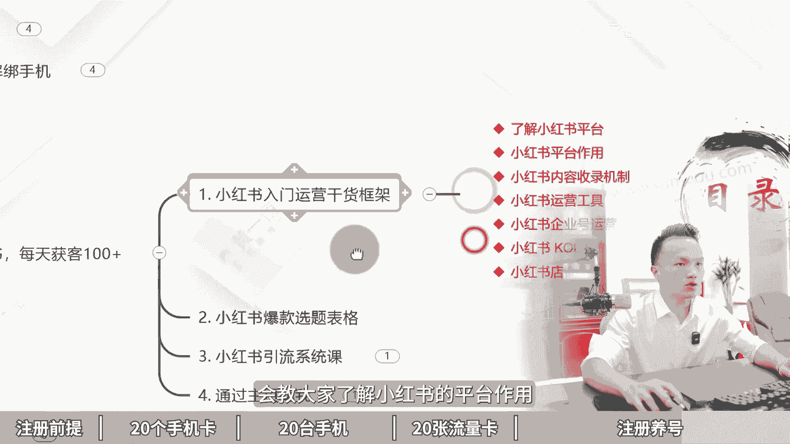

# 批量注册20个小红书账号，小红书无限注册新号教程！小红书账号注册，小红书注册账号，小红书注册教程，小红书注册新号，小红书新号如何快速起号，小红书新号怎么养； - P1 - 黄一恒矩阵推广引流 - BV1gf42127jV

又注册了20个小红书账号，我们公司刚来实习生，我叫他去注册小红书账号，他花了几个小时就注册好了，我们一起来看一下他怎么注册的啊，用实卡注册，然后换绑林业租注册卡，真是个人才，这个方法不错。

可以无限搞小红书高质量账号，一个视频教会你批量注册20个小红书账号，小红书无限注册新号教程。

详细教程在这里记得先收藏，并且来看会告诉你注册小红书的前提是什么，怎么准备，20个手机卡，20台手机，20张流量卡进行批量注册养号，首先来看注册前提，当我们在操作小红书的时候，都需要注意这个点。

否则后期基本上都会走弯路，就是一机一号一网络，我们在操作小红书时不多开，不使用任何的系统，多开，包括第三方多开软件，防止设备关联，也不去连接WIFI，很多伙伴习惯多个账号连接一个WIFI。

很容易导致IP关联，轻则限流，重则直接封号，那如果我们遇到封号之后怎么办呢，建议大家可以把设备恢复一下出厂设置，然后再继续进行使用，如果出现了封设备，这时候就只能更换设备使用了。

因为小红书这个平台比较特殊，它是会出现放设备，只要封了设备之后，在这台设备上面登录过的所有账号，都会关联对方，那如何去注册20个小红书账号呢，首先我们得准备20张手机卡。

在注册的时候优先使用这个实卡来进行注册，因为经过我们这一测试，实卡发布的流量它会大于这个信息卡，那什么是实卡，也就是我们在注册的时候，号码是18151319号段的，这种都是实卡，那如果咱们在注册的时候。

手机号是1716的号段，这种呢就是心里卡，那怎么去搞这么多实卡，我们可以自己去办理三大运营商的卡，一个运营商能办五张，30天，最多办一张，但是呢我们短时间之内也搞不到，那这时候怎么办。

我们可以找20个亲朋好友，因为在我们周边其实很多的亲朋好友，他们都没有使用小红书，我们可以用他们的号码来进行注册，注册完之后，这个账号嘞是实卡注册的，整体的质量是比较高，推流也比较不错。

一个月之后我们在换网上营业，足足的卡，通过这个方法就可以无限的产账号，这里呢我们也是需要配合上这个林业租的注册，卡种，注册卡怎么去找呢，非常简单，我们只需要去搜索林业租空格注册就可以买到。

价格来比较便宜，如果你买的比较多的情况下，十张大概需要花30块钱，一个人的话，可以实名30~50张卡，这些卡的都是正规卡，都是需要禁实名的，第二个我们还得准备20台手机。

因为我们做小红书需要遵循一机一号一网络，搞20个账号就得配20台手机，手机这一块我们使用的比较多的，有这个红米note8或者pro，那么其他型号呢也可以，并不是不能使用，之所以使用这个红米。

最主要的还是什么，性价比实在太高了，咱们如果去购买这个664G的配置，价格在350~400左右，那么手机这一块呢，大家可以直接通过，像我们是通过闲鱼进行购买啊，价格会比较优惠，如果你闲鱼上面怕翻车。

你也可以找一些店铺进行购买，也可以购买这个红米note8或者pro，价格在450~500左右，可以进行参考，咱们在购买手机的时候呢，只买这个664G配置，以及这个以上的。

否则当我们手机上面如果安装的app比较多，消息比较多的时候，这个手机非常卡顿，一旦太卡顿的话，我们基本上做起来的时候就非常难受，那购买渠道可以通过啊闲鱼上面去购买，价格会比较便宜一些。

也可以通过某东某宝找专业的卖家购买，会有售后服务，一台来贵30~50块钱，这个大家可以自己选择，有了手机卡和手机，接下来我们还需要配流量卡，为什么，因为我们手机里面它是没有流量的，我们的林业租租的卡。

它只能够收发1065短信，不能够打电话，也不能够上网，所以这时候我们得单独给它配流量卡，流量卡这一块呢，目前我们自己用的比较多的是这个物联网卡，为什么用它呢，最主要还是因为性价比比较高啊。

大家如果有其他卡也是可以的，性价比高到什么程度呢，如果咱们去购买的时候，69块钱能够使用两年，每个月有40G的流量，40G流量对于我们玩小红书来说，是完完全全能够满足的好，这种套餐价格啊。

整体是什么比较实惠的，大家可以自己找一下，如果实在找不到这种卡起到的，你也可以来找我，我把我的渠道来分享给大家，也是可以的，接下来咱们来看一下成本核算，如果我们现在一个团队，我们去搞熊书矩阵。

我们搞20个账号一起来做，我们需要多少钱，首先20张林业租租的卡，我们假设五块钱一张，需要100块钱，20台手机400块钱，我们合计，那么20台需要8000块钱，20张流量卡，假设69块钱一张。

我们需要花1380块钱，合计需要花9480块钱，平均运营一个账号的硬件成本，我们就需要投资500块钱左右，大家可以自己有一个啊心理预期，当我们有了手机卡，手机流量卡之后，接下来就要开始注册账号以及养号。

那怎么注册呢，注册这个非常简单，大家直接下载app，然后刷着刷着它会提示你进行注册就可以了，注册完之后，我们需要把这个资料都给他完善一下，那么资料这一块呢，我们只需要打开这个图片手机给大家示范一下。

我们点击我，然后点击这个编辑资料，在这里面我们把这些选项能填写的，尽量给它填写一下，更像是一个真实账号，另外前期新账号，大家比如说我们的昵称，签名里面不能有任何的广告信息，否则呢都很容易导致账号重置。

甚至直接就疯掉，包括大家如果你的行业比较敏感，也不要填太敏感的关键词，这第一个第二个呢我们还需要正常的活跃账号，如果你的账号注册完之后就不管了，就发布也是没什么流量的，咱们每天需要浏览30个作品。

点赞收藏20个作品，然后来评论5~10条，关注5~10个博主，这些都是可以的，只要是像正常的用户就行了，有活跃度也就可以了，那如果我们账号被封，那这时候该怎么办，账号被封，其实还有一种办法。

因为我们的手机就会被占用，想把手机号空出来来，我们可以配合上一些啊，比如说解码平台啦，然后呢把这个账号给他换出来，你原来手机又可以继续进行注册，解码平台这一块呢会比较难找一些，大家可以自己找一下。

实在找不到的，你也可以找我，我把我的渠道分享给大家，这种方式也是可以的，好了，各位板，那么当我们有个账号，如果想把小红书做好，光有账号还不行，如果你不会运营小红书，这些账号对你来说都是炮灰，那怎么办。

这个时候我们需要有小红书的一个运营，干货框架，会教大家了解小红书的评价作用。

内容收入机制，运营工具，企业号的投放，以及我们小红书的爆款选题模板，我们做的每一个小红书笔记，都是从爆款模板里面去挑选，收藏比，评论比，转发比比较高的来进行操作，建立在别人的数据基础指标之上。

也就是我们会看数据等于什么开卷考试，其实呢因为咱们的这个视频做太长，大家也看不完，也不太喜欢看，流量也比较小，所以我们还单独做了小红书的系统引流课，那么大概有接近两到三个小时。

会系统的教大家怎么去做这个小红书，这些呢都可以通过主页啊来进行一个领取学习，哈喽各位伙伴，我是黄一涵，制作落地推广方法，关于互联网推广，我还整理了18个平台的详细打法，教大家如何建立多广告流量。

那么每个管道都能够给你加到客户，这些呢都是我原创的，可以通过我的主页来领取进行学习，就可以学会在互联网里面如何去搞流量，如果觉得这个视频比较不错的，请大家一键三连，感谢大家支持。

