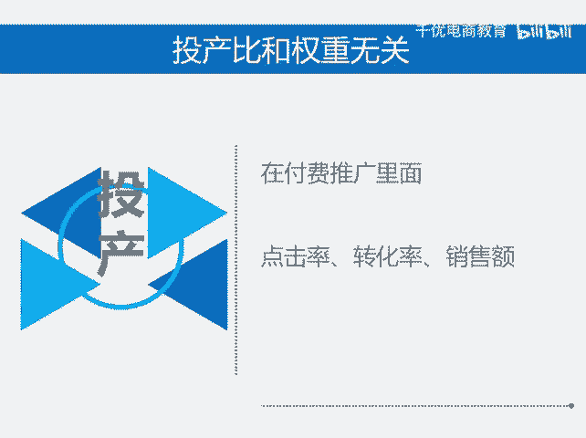

# 投产比对权重的影响有多大 - P1 - 千优电商教育 - BV1uZsSeyEof

当我们做付费推广的时候，是不是我们实际跑出来的投产比越高，我的链接权重越高呢？其实不是这样，昨天就有一个朋友问我？他说我能不能把直通车里补一些单，我说你的目的是什么？他说我让我的投产比高一些。

这样权重会提高。其实这个观点是错误的。首先你的投产比高代表你可能盈利，你的投产比高，和平台没有任何的关系，它没有半毛钱的关系，所以你的投产比再高，平台他不关心这个平台关心什么平台关心你的点击率。

你的转化率，你的销售额，因为这些都和平台的业绩有关，但是唯有投产比和平台无关。那么你必须了解投产比，它并不能决定你的权重。我是讲师大牙，欢迎大家扫码添加我的微信，不方便扫码的朋友可以添加我的微信号。

80221430。在这里给大家准备到了一套新手运营入门的大礼包，希望能够帮助大家。😡。

