# 投入时间少、终身收益、全自动化副业创收攻略（借助AI快速起号小红书实现变现） - P1 - 测吧测试开发 - BV1CyHjeYEtA

喂一涵，我们测试一下声音和画面，可以吧，好然后我们稍微等一会儿啊，稍微等一下其他同学啊，马上开始啊，我们马上开始，我们稍微等一下其他同学啊，我们再等个2分钟，然后我们就开始讲。

咱们直播间的同学有现在在做自媒体的吗，有没有啊，有的扣个一，有啊有，你跟身边的人聊一下，你会发现，其实身边很多人都已经开始在做自媒体了对吧，你就发现诶他工作好像也没耽误，然后自媒体做的也是风生水起的啊。

所以今天晚上呢就是跟大家去分享一下，那个小母收这个频道的一个呃运营啊，我先把这个过掉好，我们先不等了，我们一边讲，然后一边等其他同学进入这个直播间，然后今天晚上想跟大家分享的呢，主要是两个部分的内容。

第一第一部分内容的话，想跟大家去分享一下关于某书这个平台，然后它的一个运营的一些策略，以及它的一些平台的流量扶持，这一块有什么样的政策，再有就是在这个渠道的一些变现上，我们可以做什么事情。

然后呢第二部分呢会给大家去讲一下，怎么借助这个嗯AI大模型，然后去快速的去做一些嗯自媒体的一些素材啊，主要会分为两部分，一个是文生图的这样一个东西啊，大家都知道小红书其实大部分都是女性。

用女性粉丝嘛对吧，大家对于美观的东西啊都还是比较受欢迎，大家在那个打开你的小红书，小红书你都其实都是可以看到的对吧，你的首页上一些漂亮的图片，它的点击率总是比较高的，所以我会给大家去讲怎么借助大模型。

哎我不会做设计对吧，我不会PS，然后我怎么借助大模型，快速的去生成一些比较漂亮，然后比较啊有细节这种图片，然后呢在我就是会给大家讲一下，怎么借助大模型去快速的生成一些种草文章啊，好那我们接下来进入正题。

我们先考虑一下啊，我们为什么要去做这个小某书这个渠道呢，对吧啊，我给大家总结了几个点哈，我其实看了好几个平台，然后呢我是觉得就是某书这个平台的话，作为新手来说的话，相对来说还是比较友好的。

他的一些平台的推荐算法，对于咱们一个新手开始去做自媒体的起步啊，还是比较友好的，那这个渠道呢它其实有几个自己的重点特性，比如说它的一个人群质量相对来说是比较高的，然后它的变现能力呢也是相对比较强的。

那我们知道就是在中国，你们觉得哪两个渠道的人，什么样的人群赚的钱是最好赚的呀，大家觉得什么样的，什么样的群体的钱是最好赚的啊，可以在直播间跟我稍微互动一下啊，我这讲起来也会比较有激情一点对吧，然后呢。

嗯其实大家从自己的日常生活中也会发现，那最值得花钱的其实是两类群体，一类是女人对，还有还有呢就是母亲对吧，然后女性跟儿童其实是最最最会花钱的，然后也是最烧钱的两个群体。

但小小我说这个渠道呢它本身就是它的用户，70%就是女性的用户群体，所以相对来说它的一个人群质量还是比较高，然后变现能力也是比较强的啊，那第二我为什么推荐大家去做这个平台的一个，第二个原因呢。

就是它的一个种草属性相对来说是比较强的，我可以给大家讲一个例子，就是在上周的时候，我回了一趟老家，然后带我的小外甥女去了一趟市里去游玩，其实但我虽然是我是山东人哈，我是临沂的。

然后呢临沂市里呢其实我是没怎么逛过的，我再去查攻略的时候，像以前我们出去旅游，我们要去查攻略的话，我们都会去查什么呀，去哪儿网，马蜂网对吧，还有以前有一个穷游网对吧。

现在其实这几个平台也还在去写一些对应的，一些旅游攻略什么的，但是对于我来说的话，我再去查我去这个临沂市旅游的时候，我的旅游攻略我要住哪，我去哪个酒店，然后那个去哪些景点。

我其实都是从小母收这个渠道上去搜的啊，其实它里面会有很多这种种草的文章，这种种草文相对来说它的真实性也会非常的强，就这个人他自己亲身去过这个旅游景点，然后呢也会写一下他自己的一些攻略。

比如说你酒店住哪儿啊，或者怎么样的，那对于这种做种草文章来说，如果是说你可以开通这样的一个渠道合作的，这样变现能力的话，你是可以推荐一些对应的酒店的对吧，然后女生之间其实在这个平台上，你会发现。

如果你经常混这个平台，你会发现，女生之间也会比较容易形成一种信赖关系啊，诶我我发现这个女孩子去了，这还拍了自己很多真实的这种照片啊，他写的一些种草文章亲身体验，对我来说相对来说会比较有感知力一点啊。

那第三个渠道特点呢，其实就是啊它是一个内容为王的一个渠道啊，零粉其实也是有推荐，有爆款的，那可以给大家看一个这样的几个例子吧，那我们先说就是，一会儿我会给大家稍微去看一下。

都有什么样的一个例子来说明这个事情，那第四个点的话就是，内容制作门槛相对来说比较低，那你比如说我要去做B站，或者我要去做B站，或者我要去做视频号对吧，我们现在视频号上去直播，我们要去做视频号。

很多情况下我们都说露脸不露比，不露脸这个东西它的一个流量会不一样对吧，会更吸引人一点，会更具有真实性一点，那对于这个呃像我说这个渠道呢，你其实如果对于不想露脸的同学来说哈，我也不想录视频。

那这样的人来说的话，其实相对来说还是比较友好的，他的图文也是能比能报的啊，那我们来看一下关于人群质量这一块，我给大家举个例子，这个是我们之前在我们的嗯。

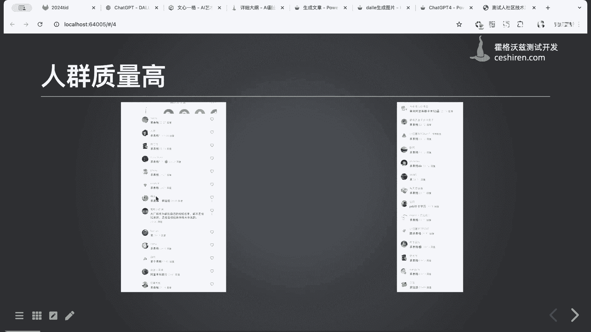

因为我们自己也运营了一个小红书的，一个呃账号，然后这个是我们发了一个关于大厂，在招聘这一块一些学历的一个要求，那大家可以从这些在留言上就可以看出来，其实很多人在下面留言，唉，我想要这个东西啊。

能不能给我发一下这个表格，那对于这样的群体来说的话，我们就会有一些私信和和互动的一些点对吧，然后你可以引导自己的私域里。

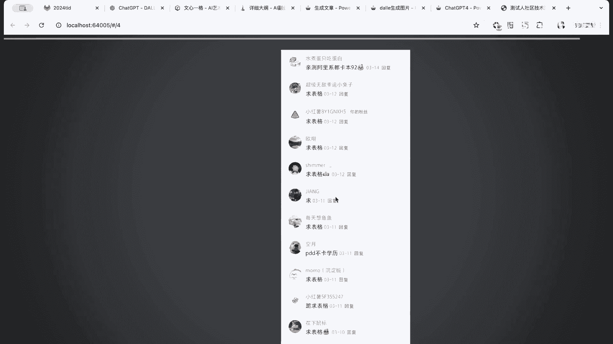

去做一些其他的商品的一些推荐呀等等啊，这是人均资料这一块那种草属性强。

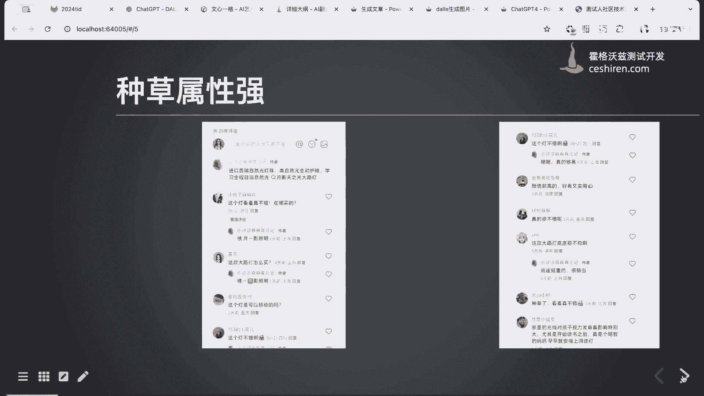

它体现在什么地方呢，其实大家也可以看一下小红书的一些渠道哈，你比如说这个这个妈妈育儿日记，他当时是分享了一个，他自己给孩子买了一个护眼灯，那其实你可以看一下他的留言条数，总共不多，只有29条对吧。

但是他的整个留言里面会有很多问题，唉这个路灯怎么买。

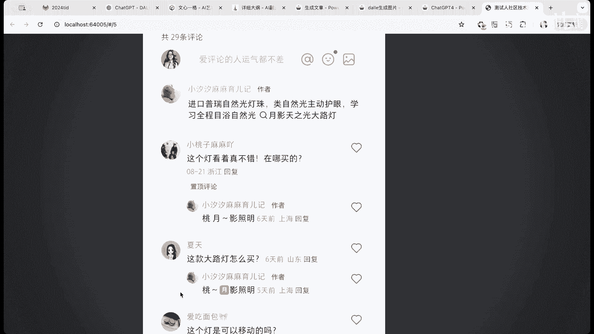

然后这个看起来不错，然后是在哪买的对吧，它的一个种草属性其实相对来说是比较强的啊，然后内容为王，这个是呃，这个是我在小红书上，就是我被推荐到的一个嗯素材。

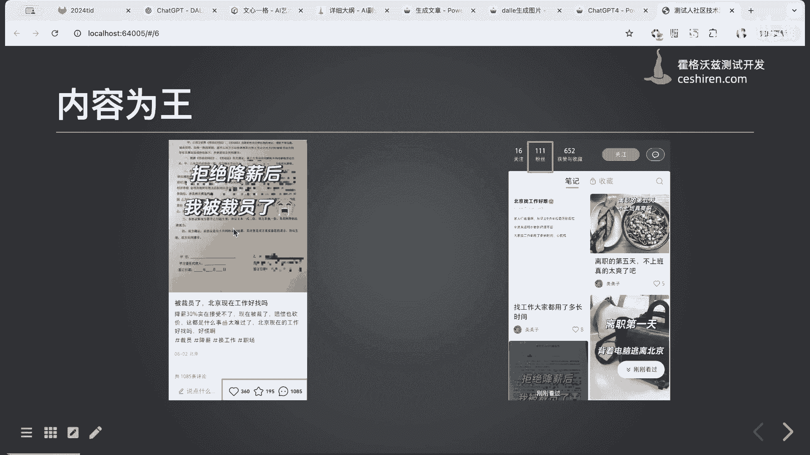

大家也可以看一下啊，这个是一个同学。

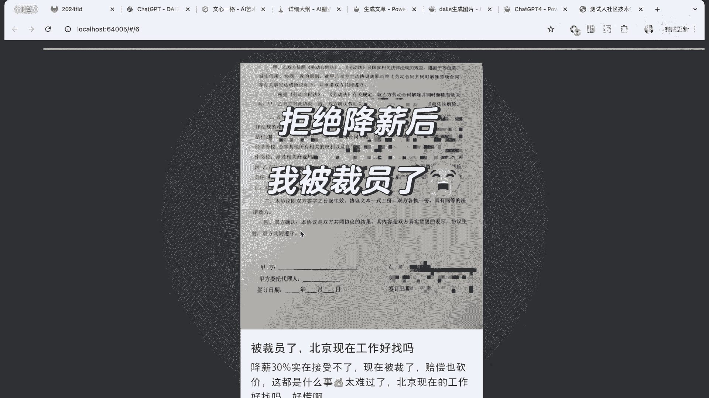

他写了一下，他自己就拒绝涨薪之后被裁员这样的一个经历，那大家其实可以看到他的一个数据的话，点赞量大概是360，然后收藏是195，评论大概有1085个对吧，那对于小某说这个平台来说。

它的一个互动数据是什么样子，会牵扯到系统对于你的推流会是什么样子，它的计算方式是你的点赞量加你的收藏量，加你的评论量有多少，然后系统就会去给你做一个排名和推荐，那其实这个这个用户的话，他其实粉丝数不多。

他粉丝数只有110一个啊，只有100多人，你看他写出来的文章，它的一个点赞量，互动率以及评论率都是非常高的，这也是为什么我前面跟大家说，就小米说这个渠道的话，其实也是零粉，你即便是说你现在从头开始做。

他也是有机会去做爆款文章的一个原因啊，然后再有就是呢啊简单给大家介绍了一下，我为什么要去做这个小米收这个渠道，然后给大家介绍了四个原因对吧，那接下来看一下对于小米说这个渠道来说。

如果我在这个渠道上去做自媒体，我可以有哪些变现的一个渠道啊，嗯给大家总结了几个点啊，一个是呢是自媒体的这种流量变现啊，就导流变现具体是怎么导流变现的，然后我后面会给大家讲，然后第二个的话其实就是小红书。

红书的这个呃蒲公英的这个平台一个广告啊，可以去接一些单啊，第三个的话其实就是直播带货，这个其实跟其他平台也是一样的啊，但直播的话它也有一定的门槛，相对来说的话门槛不是很高啊，还有就是你可以自己开店去。

这个是没有限制的啊，你只需要缴纳这个保证金1000块钱，但是这个是一个基础的保证金，要看你自己这个做的这个渠道是什么样子，做的一个品类是什么样子，不同的品类会有不同的保证金啊。

再有就是如果你是一个比较知名的人，你可以在上面去开通一些知识专栏，然后通过课程去变现，那接下来我会给大家去重点介绍这个自媒体，流量变现以及小红书蒲公呃，蒲公英平台这个广告的一个变现啊。

这个的话我简单给大家介绍一下，因为这个对于我们新手来说，然后去做这一块的话，门槛相对来说还是有点高啊，我们来看一下，然后我先说这几个不太重要的啊，一个是直播带货，直播带货的话。

他要求你粉丝数1000以上，你是可以开通直播带货，这样的一个呃，那个呃这样的一个那个呃功能的啊，然后你需要在自己的平台里，去做一些对应的选品啊，不同的一个商品的话，它会有不同的一个佣金。

这个大家粉丝数满1000之后，然后你在你的app上，你是可以看到如何去开通这个带货渠道的，然后再有就是其实对于我们来说，我们大部分同学，包括今天进直播间的同学来说的话。

基本上是那个嗯暂时的会比较多一点嘛对吧，大家都只是把这个事情当做一个副业来做，那如果你去做直播的话，你可能时间会没有那么多啊，所以就是这也是为什么这个渠道，我不太推荐大家去做这样一个原因啊。

第二个的话你是可以自己开店，那自己开店的话就是零粉也可以自己开店，那这种的话是对于一些，比如说我现在有一些我自己的商品想卖，而有的同学他是比较喜欢做烘培，或者说我比较喜欢做一些手工啊，或者怎么样的啊。

我之前关注一个up主，他是一个呃装修类的up主，然后她的老公呢是一个做手工能力比较强的人，然后呢他之前发过一个就是手工做的一个猫架，然后一个就是猫的一个房子，然后大家就非常喜欢。

然后他就把这个东西挂在这个平台上去卖啊，这个其实对于嗯，我们想只是想把它当做副业来做的，同学来说的话，其实还是有一定的门槛的啊，他需要你投入大量的精力和时间，难道我就是开通知专栏，开通知识专栏的话。

他的要求相对来说就会更苛刻一点，比如说你的粉丝数可能要大于1万人，才能申请啊，你通过的概率会比较高一点，另外呢你必须要有一些身份的一些认证啊，才可以嗯，开通的模式的话，你可以关注这个专栏成长学院。

然后你去给那个up主去留言，然后申请开通权限就可以，那这个知识专栏的话，平台跟博主的这样一个分成大概是三比七，也就是平台会收3%嗯，30%，然后我们自己拿70%，但你提现的时候。

平台还会再收取10%的这样一个，综合服务费啊，这个直播专栏直播的这个支持专栏的话，它是有跟我们做其他平台其实是一样的，有直播，有录播，也有1V1的这样一个专栏课程啊，那我接下来重点给大家去讲一下。

对于我们新手来说，方便我们去做的两种方式啊，一个呢是自媒体的这种流量变现，然后我讲的这个套路的话，它其实是适用于任何的一个平台啊，它其实主要去做一些导流变现啊，主要呢是我们要把流量导入我们的私域。

那可以在私域中去售卖一些产品对吧，然后我在这儿其实也会给大家去介绍一些，简单的规避平台的这样一些导流方式，但是呢这个是不保证百分百安全，因为任何一个平台的话，他其实都不希望你把他的粉丝。

吸引到你的私域里面去对吧，我还是希望说你在公寓里面去做一些运营，但是你去做一些私域，比如说小母书，我可以创建小米说的这个群聊，这个是完全没有问题的啊，平台是支持这一点的，但是如果是说你想引流到你的。

就比如说啊微信啊或者怎么样的，这可能就嗯平台会有一些对应的检测对吧，尤其是对于我们新号来说，我们想拿到一些平台的流量的话，很多的一些注意事项都会去呃，呃平台都会有一些算法去检测这个事情啊。

啊我们我在这简单给大家介绍几种方式啊，可以规避平台的这种导流方式，但是不保证百分百是安全的啊，大家在做的这个过程中呢，你可以就实时的去做一些调整啊，然后呢嗯你也可以去关注这两个。

就是属管家或者说队长了解小红书，小某说的一些具体的一个运营的一个规则，它会实时的去更新它，平台的一些就是违规的一些行为啊等等啊，当然第一个点大家可以把自己的这个id，然后改成自己的这个微信id。

然后简介里面可以放一些邮箱，或者是放自己全网同名这样的一个字样啊，这个其实是允许的，大家如果去关注我这个平台里那些up主的话，你可以看到很多up主，他其实是把简介里放到邮箱的啊。

这个其实是方便一些商业用户，然后去联系我们啊，再有就是引导用户私信你，比如说你发完一个种草文章之后，我可以在文末去准备一些资料啊，或者是模板呀，或者一些呃其他的一些福利类的产品啊。

引导大家去加入你的这个群聊，然后去领一个对应的一个资料啊，这个进了你的这个群聊之后呢，你就可以发自己的微信的一些二维码呀，或者是海报啊，然后那个让他们去加你，引流到你自己的私域里就可以啊。

这个的话基本上我们如果你去写种草文的话，大多数会在下面去说，哎很多人会给你留言说，唉我想问一下这个东西是在哪买，然后价格是多少之类的，然后我们多数会说诶私信你询价之类的，然后让大家去私信你。

然后或者是说加入你的群聊去了解这个事情啊，那这个呢自媒体导流变现呢，其实它主要运行的一个规则呢，就是我要把这个公寓里面的一些流量，引流到我自己的思里面去对吧，那什么叫思域，就是你个人的一些微信群体呀。

或者说你个人的QQ群呀怎么怎么样的啊，或者是你其他平台的一些群聊啊，你可以去直接去触达用户的啊，这个叫做是你的一个私域流量啊，你在你的私域流量，也可以去推荐你自己用过的一些东西，一些商品链接呀等等啊。

可以让他们去做一些嗯购买之类的动作，这个的话其实大家只要有流量，你去卖什么东西，其实最终都是由你自己来决定的对吧，你只要有稳定的比较好的货源，然后你比较你用过的比较好的产品。

都可以推荐给你的私域流量里的用户，然后去做这个事，去做一些产品的一个推荐，那在这儿的话，其实学生呢也给他，如果是说你没有对应的一些品类的选择啊，你也不知道要去卖什么，我现在思域导进来之后。

哎我微信群导了很多人了，但我也不知道怎么去变现对吧，那学生呢在这里其实给大家也提供了一个呃，自媒体导流的这样的一个合作案例啊，你比如说你去推广，我们霍格沃兹特开发学校的一些课程，那客单价的话。

我们可以按照这个提成呢，给到客单价的5%到20%啊，相当于就是一单提成，可能就是在300~3000单这样的啊，啊如果是说你有社群的私域流量啊，你可以去做社群的一些推广，或者是说一些朋友圈的一个推广。

那我举一个案例，就是这个是我之前对接过的一个渠道，也是在推咱们自己的这个我们学校的一些课程，然后他的一个单次的推广费用大概是8000块钱，只是在社社群里给你推一次，然后朋友圈里给你推一次。

他的一个单词推广费用就是8000块钱，我们已经合作了好几次了啊，再有就是你可以引导你的个人公众号上对吧，然后你去做一些这个呃推广，然后去接一些单子，然后你也可以去挣一些啊，这样的一个副业的一个费用。

那这种的话单次推广费用大概都是在8000到，800~3000之间，但是如果你的粉丝量会更多一点，那你的这个数量会会会会非常多啊，那个比如说我现在跟他合作的这个，这个是我原来合作的一个渠道。

然后他也是做主要是做公众号的一个推广的，然后他不需要做任何的文案的准备啊，或者怎么样的，相当于是我这边全部整好，整理好了对应的图文，然后他只需要发到自己的公众号就可以。

他的一个粉丝数的话大概是不到1万人，我们的一个合作家大概就是800块钱发一次啊，嗯然后这个是我们的学员，然后自己做的一个推课程推荐，然后做的一个引流，然后做的一个这个客人推荐。

他收取的一个这样的一个提成啊，大家也可以看一下，其实这样的截图我们非常非常多啊，如果是说你有流量，但是你不知道怎么去变现啊，你我是推荐大家可以去跟学校去做合作，然后你因为你自己本身是程序员嘛。

那你身边肯定也有非常多的一些程序员对吧，嗯大家对于提升自己的技能啊，或者是怎么样的，也都是有一定的需求的，然后如果你想去做这样的一个流量变现啊，你也可以联系我们啊。

我们都会给大家提供这样的一个变现机会的，啊啊哈哈，这位同学说这个嗯，那太香了啊，8000多得有多少有效客户，有效客户其实我们一般都是没办法去追踪的，因为首先比如说我有20万的粉丝也好。

或者我有10万的粉丝也好，我发出去之后到底有多少有效客户，是其实是跟很多因素都有关系的，比如说你给我的图文对吧，你会不会影响到你给我的图文，这个吸引力有多强，然后你可能会影响到这样的一个效果。

所以一般这样的推广不会去按效果付费，就是我大概有多少粉丝量，然后我给你发一次推广，大概费用是多少，但是我不保证这样的一个效果啊，这样的目前来说的话，渠道发大部分都是这样，那也有是说按效果付费的。

你比如说像原来我们跟一个行业里的QL，在合作的时候，其实相对来说他就是按结果付费，它除了一个基础的提成之外呢，还有基础的，还有那个一个承担之后的提成，最终他是从我们这边，然后一期课程赚了好几万块钱啊。

当然他是行业里一个QL啊，你公众号有1200粉丝了啊，一千一千二还是有一点点少啊，然后如果你是有小红书，你有1200了，你就可以去做一些呃变现的事情了啊，这个是在学校这边给大家提供的一些。

低自媒体合作的这样的一个案例，如果是说你有流量，然后你可以来跟我们合作啊，去做一些变现，然后呢接下来我得给大家看一下，第二个最重要的小母说的这样的一个平台的话，对于我们新手来说。

我们可能比较容易去做的就是这个蒲公英平台，那蒲公英平台呢，它其实是一个呃，小某书提供给商家和博主的这样一个链接，广告投放接单的这样一个官方平台，那如果是说你的粉丝数达到1000人啊。

你就可以去开通这样一个那个，蒲公英的这样一个平台，然后去可以去做一些接单，还有一些种草的这样的一个那个方法嗯，种草的这样一个那个呃赚佣金的，这样一个呃变现的一个事情啊，嗯笑笑同学怎么吸粉。

我后面会给大家讲啊，然后那个品牌方呢，可以通过这个平台去找一些对应的，合作的一些up主，哎比如说我看你做的是一个母婴的对吧，正好我这个产品也是一个母婴产品，然后我可能就会跟你去合作。

然后发起一些合作项目啊，我们的博主的话，也可以通过这个平台去做一些接单，有的时候就比如说你的你已经开通了之后，你在这个博主合作这个渠道里面，可以报名参与一些这个嗯，参参与一些这样的一个商家的一个招募啊。

你就可以去做一些接单，做一些种草，那嗯目前来说哈这个小某书这个平台的话，它其实是蒲公英这个平台的话，它累计已经有10万家的创作者，他的一个商家住户，商家这个用户呢大概是6万5000家海外企业。

海内外企业的这样的客户去入住啊，也就是说有这么多商家在这个平台上，那一定会有很多的商家，就在这个平台上发起一些推广的一些需求对吧，所以你经常会看到就说哎，有个人有人一个月好像接了十几单。

20几单都有可能，对不对，所以也是因为这个平台的话，它的一个企业用户是比较多的啊，它主要就是提供一个博主跟买手合作的，这样一个平台，那对于你在蒲公英这个平台上所做的，所有的收入的话。

小米说这个平台大概会抽取10%的一个，综合服务费，然后其他的服务费的话，你可以你可以自己直接提现啊，我给大家详细介绍一下关于蒲公英这个平台，它的一个两个合作方式，它主要是有两个在这。

其实我也给大家截了一个图哈哈，主要是如果你的一个呃粉丝数达到1000之后，你在你的app端，你可以看到创作者中心里面有一个收益，变现渠道，所以毕业渠道里面呢，其中有两条叫做博主合作跟买手合作。

这两个其实全部都是通过蒲公英这个平台，来提供给我们的博主的啊，那接下来我们看一下，来这个博主合作这一块怎么弄的啊，来以及我们是如何去入住蒲公英这个平台的，那蒲公英这个平台的话，它其实有几个门槛。

第一个是你要完成一些实名认证，实名认证的话就是你的小你的小母书，你要完成实名认证，一个人的身份的话，最多只能有两个项目收的账号啊，再有就是近期呢，你是没有违反这个小伙说的一个社区规范的。

那社区规范怎么看，大家打开你的这个小米说的app，大家在这儿可以看到有个社区公约啊，这个社区公约里会明确的写清楚，然后他的一个这个平台的一个限制是什么，它的一些违规行为都有什么啊。

大家在这都是可以看到的啊，再有就是你的粉丝数大于1000就可以开通啊，那有的同学可能嗯，有的我们直播间可能有部分同学也在做小魔术，这个平台哈可能会觉得哎呀老师，我涨粉好慢呀对吧，我怎么才能涨粉。

其实我觉得小红书这个平台来说哈，你可以开通这样一个平台的嗯，条件只是粉丝数大于1000，相对来说它是比较容易完成的啊，相对于其他的频道来说的话，它是相对来说还是比较容易完成的啊，然后呢大家去怎么去。

我说我这怎么去涨粉这个事情呢，后面我们也会给大家去讲，那比如说我们像我们现在在做这个AI的这个，副业班嘛，那这个副业班，可能一期一些班级里面就有好好几百人对吧，那大家互相关注一下。

然后是不是粉丝数就能涨的比较快啦，互相点个赞呀，然后一起去薅一下平台的流量啊，对吧啊，当然这个我们也会有一些对应的嗯操作哈，不能是说比如说我今天一下子关注了100人，然后100人一下子就关注了我。

那你这个账号可能就会被平台，然后认定为是一个啊违规的这样一个账号，会有一些对应的限流对吧，所以呢如果是说啊涨粉这个事情，我们后续也是一个循序渐进的过程啊，我们会通过比如说我们副业班的这个同学。

可以去做一些互关呀，或者怎么样啊有序互关啊，让大家去尽快的去达到这样一个啊，达到这样一个粉丝数啊，然后当你达到这个这个可以开通，这个入住蒲公英的这个平台之后呢，你在在你的那个小某书上，你打开你的app。

它会有一个合作中心，然后你点击这个合作中心之后呢，我们就会进入一个开通的这样一个内，内容合作申请的这样一个界面。

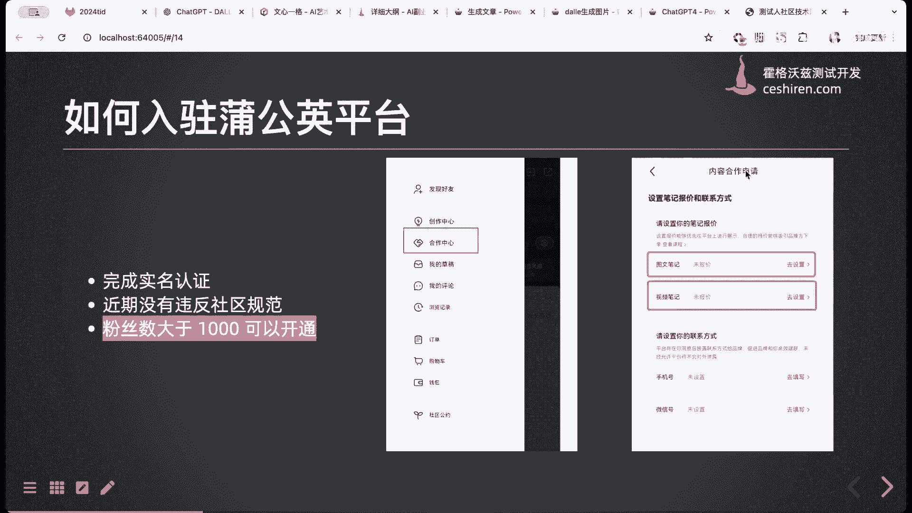

这个内容合作申请里面呢，你可以去设置你自己的一个报价，比如说你的图文笔记的报价是多少啊，你的一个视频笔记的报价是多少，大家可以都可以在这个。

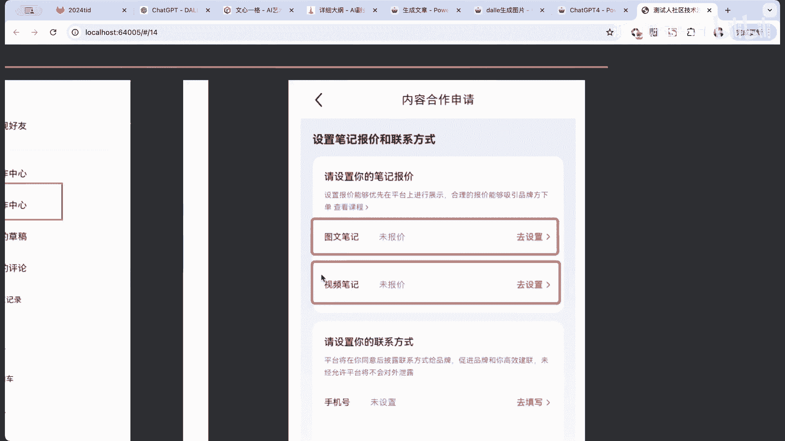

在这个平台上去做一些对应的设置啊，那比如说我图文笔记的一个报价，那有的同学可能是说哎老师我也不知道，我现在有1200的粉丝对吧，刚刚有同学说他小，他那个公众号有1200的粉丝，那我现在有1200的粉丝。

如果是说我这个报价报多少合适呢，那小伙说这个平台的话，基本上是你的报价大概是你粉丝量的10%，相对来说是比较合理的，但如果是说你实在不知道怎么报价。

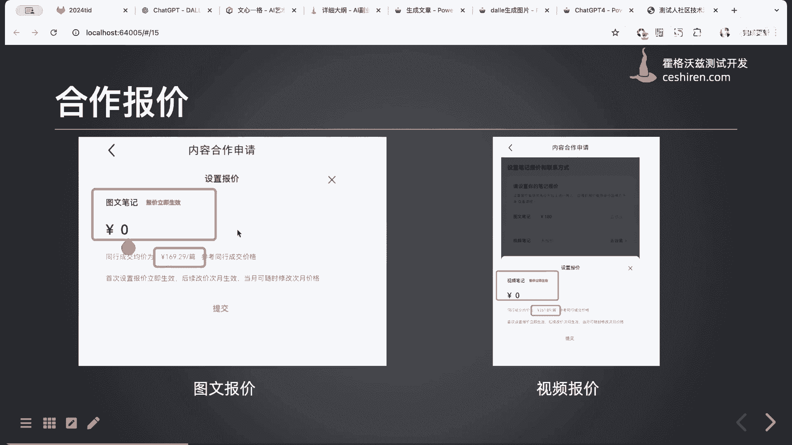

那我们官方的话其实也有一个推荐价格啊，他会根据你的这样的一个粉丝情况，然后告诉你跟你同等粉丝体量的人，它的一个成交均价大概是多少啊。

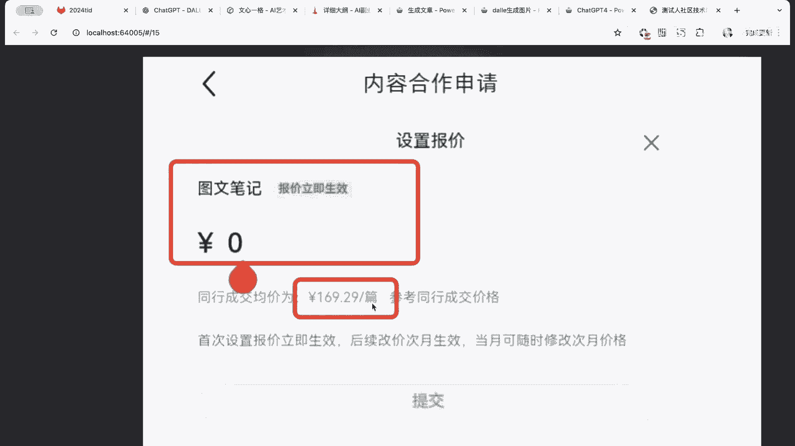

你可以通过参考这个价格去设置，你自己的这样的一个价格啊，大概是多少。

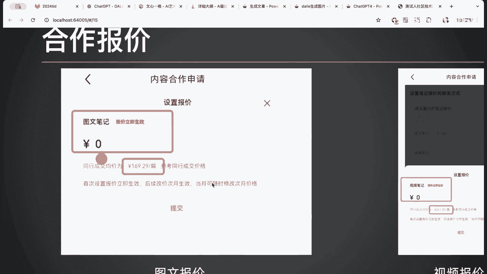

当然你也可以点击这个，参考这个同行的成交价格，去看更多的这样的一个呃报价啊。

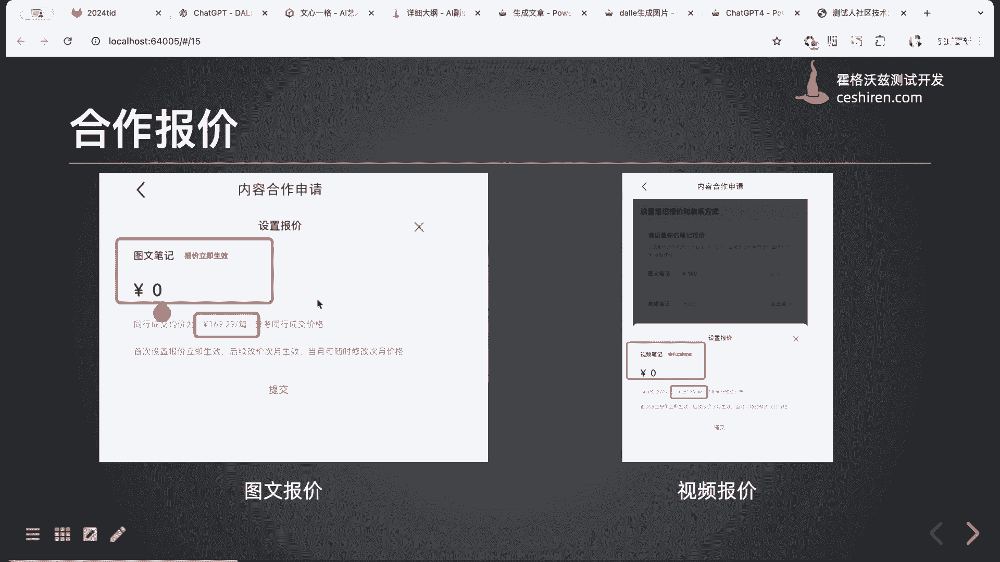

然后呢再有就是你可以把你的视频笔记去。

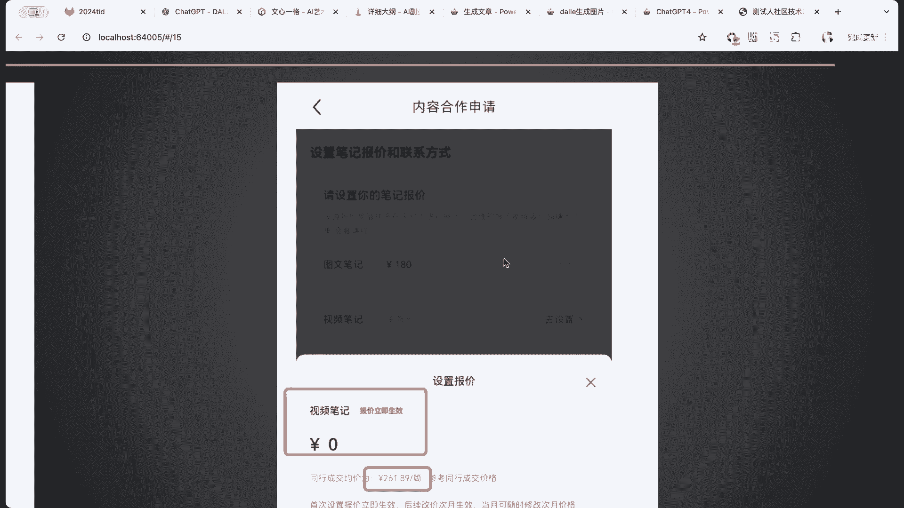

也可以去设置一下，大家可以看到啊，就是同样的这样的一个粉丝数。

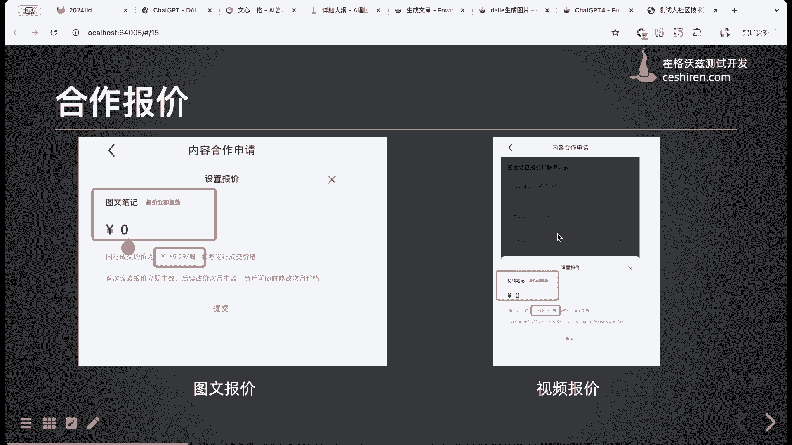

同样的一个账号，我的视频笔记是不是，就比我的这个图文笔记要贵很多呀对吧，我视频笔记官方推荐价格大概是160块钱，那我的这个视频笔记的话，官方推荐价格大概是260块钱，所以说对于就是有时间去拍一些视频。

去做种草的这样的那个人来说的话。

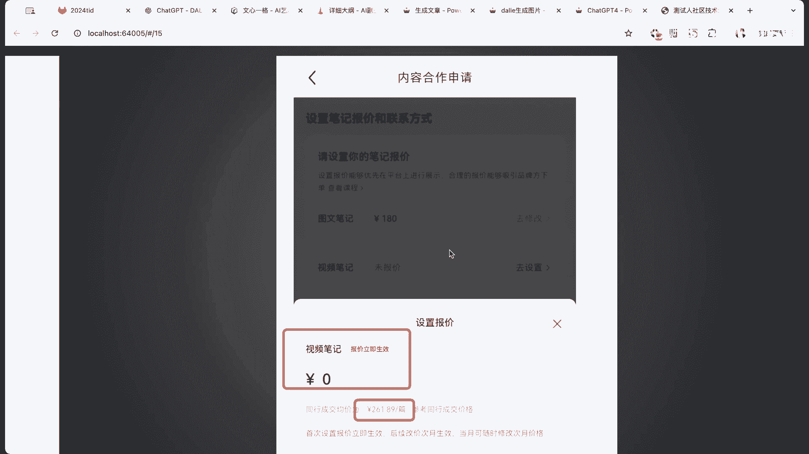

然后你可以那个啥，你可以去做一些视频笔记啊。

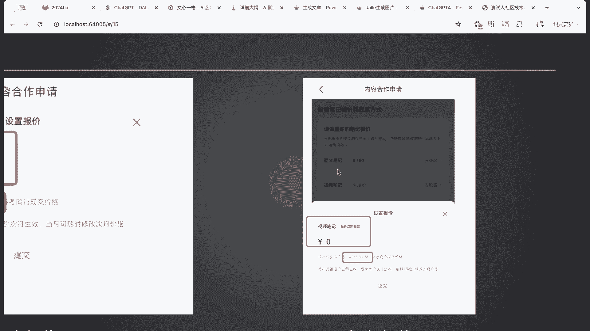

视频笔记的这样的报价稍微来说会高一点啊，这是这个合作报价这一块，那你设置完自己的报价之后呢，你也想知道，是说我在这个整个这个up主的这个群体里，我大概处于一个什么样的接什么样的阶层对吧。

什么样的一个level，然后我的这个竞争力大概是什么样子，我接单的一个竞争力大概是什么样子，那平台呢其实相对来说做的也是比较贴心的，比如说我把我的这个呃账号，然后我设置成我的图文。

报价大概是180块钱一天，然后呢通行报价大概是160块钱，那我自己的一个竞争力呢，它其实在这个平台上都会有展示啊，比如说嗯他的一个报价，建议我的报价是一个180每天。

然后处于100到200的一个成交区间，然后该成交区间的订单占比，大概是75。8%，也就是说在这个平台上，我能接到单的一个最大的一个概率，可能就是75。8%对吧，在100到200之间。

然后我可以去做一些对应的订单的一个成交啊，但是我如果想接一个2000到2000到3000的，这样的单子，概率就会比较低对吧，呃零呃，200到300的这样的一个概率就会比较低啊，这个是这一块。

那它设置报价的时候，需要注意的一个事情是什么呢，就是首次设置报价它是立即生效的，然后每个月的1月1号到25号，你是可以设置下一个月的报价，因为我们每个月粉丝数也会变嘛对吧，你也希望是说我的报价。

比如说像618了或者怎么样的，大家可能发需求的，这种发推广需求的公司比较多，那我希望在这个阶段，把我自己的报价稍微提高一下，你每个月都可以都可以去做你自己的，这样的一个价格调整啊，然后我们刚刚也说了。

那蒲公英平台的话主要有两个合作方式嘛，一个是博主的合作，一个是这个呃买手的合作对吧，那博主合作的话，它其实是一个一对多的一个内容合作方式，什么意思呢，就是品牌方蒲公英这个平台会招募一群博主。

来去推广我的一个产品啊，然后呢，博主可以通过这个合作广场报名，去参与这样一个项目啊，比如说这个这个是招募的啊，发了一个这个模特招募的对吧，然后合作预算大概是1~300，然后你可以去报名，报名通过之后呢。

你就可以对接这个品牌方，然后去产出你自己的这个种草文章也好，或者种草视频也好，去赚取你自己的这样一个推广费，那大家可以需要注意的一点是，大家在做账号的这个过程中呢，为了将来你可以顺利的接到单。

一定要在打造自己人设的过程中，去买一些你将来可以带货的一些商品，你比如说我做一个读书类的账号对吧，那我读书类的账号我可以带带货，带什么就带图书啊，或者带一些呃，像台灯啊或者课桌呀之类的这种产品。

我都是可以去带的对吧，也就是我后面会给大家去讲，大家在选择赛道的时候怎么去选啊，以及你在账号的这个过程中，怎么去植入这些营销点，然后让平台识别到啊，我可以给你推荐这样的一些报名的。

这样一些那个啊招募up博主，招募的这样一个推广啊，你可以在这里面去报名，因为不是说我只要开通了这个平台，我在这个我在这个蒲公英这个平台上，所有的博主的这种招聘我都可以看到，不是的。

平台会根据你的账号的一个调性啊，给你去推荐，他认为你可以接的一些广告啊，所以大家在做账号的这个过程中，你就必须要去做一些对应的动作，然后让平台识别到你可以接什么样的，这样的一个啊品类的一些东西。

方便你开通这个服用平台之后呢，这个嗯平台给你推荐对应的一些博主，招募的一些活动啊，啊这是这一块啊，大家可以去看一下啊，大概就是这个样子，然后你打开这个博主博主合作，然后会有很多的这种招募。

你点报名就可以，报名成功之后呢，然后会有一些联系方式，然后告诉你怎么去发啊，好接下来呢还有一个就是蒲公英合作平台的话，我们可能在这个小母书这个平台上，另外一个变现的就是买手合作，那买手合作的话。

其实就跟其他平台其实是差不多的，比如说我去做一些带货啊，比如说哎我去这个的话，它其实就不限品类了啊，你比如说我现在是做一个技术账号的，但是我也同样可以去带货，带这种什么男士的这种男友风的T恤衫啊。

然后或者是说这种这个小包啊之类的东西啊，这个是大家可以自己去这个选品中心去选品，然后嗯选择你自己认为在你的粉丝群体里来说，相对来说比较容易接受，比如说我是做一个嗯读书类的博主的。

那我可能就会去带领一些像这个嗯那个台灯啊，或者说我自己在读书的这个过程中，或者在看电视的这个过程中，比较爱吃这些小零食啊之类的啊，我都是可以去带货的，那在带货这个过程中的话。

嗯小某说的这种带货的品类的话，带货的渠道的话，它主要有两个，一个是小清单带货啊，小清单带所谓小清单带货呢，一会我会给大家展示它大概是一个什么东西，再有就是直播带货，也就是说我开通了这个蒲公英平台之后。

我可以去做一些对应的选品，那我选完这些品之后，我就可以在小红书上直接去开直播啊，大家如果注册了这个小母书这个账号的话，其实大家可以看到，你现在是就算是没有蒲公英的这样的一个啊，权限啊。

你也可以直接开通直播，开通直播对吧，但是你是带不了货的啊，如果你想带货，你必须要通过蒲公英这个平台，也就是说你必须要满足1000粉丝起步啊，你才可以去做这样一个事情，那所谓的小清单带货呢。

就是比如说我在这个选品中心，唉，我想带一下这个书啊，这个卡比巴拉不烦恼这本书对吧，我也不知道这个东西是个什么东西哈，但是我这次嗯，就上周上周去请那个，带我带我小外甥出去玩的时候，就发现他特别喜欢这个。

然后我就在小红书上搜了一下，他还真有这个这个产品啊，那我可以在带货这个过程中，选择这个小清单带货，然后你选择这个小清单带货之后呢，然后呢就会在你的这个呃，就会在你的这个个人账号上，然后会有一个小清单。

这样会列出来你带货的一些东西都有什么啊，你看大家在选完品之后，你看在这儿有两个，一个是小清单带货或者直播带货啊，都可以，你可以通过这两种方式去带货，然后呢我们做完选品，做完小清单带货之后，推荐大家。

如果你是通过种草文去带货的话，你就选小清单带货就可以啊，笑笑这个涨粉我后面会讲好吧，咱们不着急哈，我后面会给大家去讲怎么涨粉啊，然后大家去选完这个，先让我把这个渠道给大家介绍一下好不好。

然后选完这个小清单带货之后呢，你就可以在这看到，然后你再写再去写种草文章的时候，它会有个添加商品啊，你点击这个添加商品可以看到你想带什么商品，那你发布完之后呢，你的粉丝就会在你的这篇图文下面。

看到一个对应的这样的一个链接，这个链接里面呢会显示它可以去给你购买一些，对应的同款之类的啊，这个就是这个啊，通过笔记带货的这样一个方式啊，如果说你现在有粉丝了，你也可以去做这样一个事情啊。

你可以去开开通蒲公英的这样一个平台啊，好这个是我给大家简单讲的啊，小五说的这样五个这样的一个变现的一个渠道，那重点的话就是推荐大家去做这个啊，蒲公英这样一个平台，再有就是私域导流的一个变现啊。

通重点推荐这两个方式，尤其是想做这个啊私域流量的同学来说啊，好那接下来给大家去讲一下，那既然是说我们小小某书这个平台也不错对吧，然后呢这个带货的渠道我们也讲清楚了，那我怎么才能在这个平台上。

然后快速的涨粉，然后快速的去做一些变现的事情了啊，接下来给大家讲一下啊，那你比如说我现在是一个新手up主，我怎么去选择一个领域对吧，那很多同学是说，我现在我也不知道我自己擅长什么啊。

我也不知道我应该去选什么样的领域，那我在这儿呢给大家总结了，小小母书的这个十大热门领域都有什么啊，大家可以结合自己的这样的一个嗯，个人个人特色，然后去选择你自己想做的这样一个领域啊，那我们来看一下啊。

对于小米说这样的一个平台来说的话，好的赛道的话，它其实一定要有几个特征对吧，一个是它的一个市场需求量会比较大一点，你比如说我去做一个读书类的这样的一个博主，其实相对来说我能带的这样的一个产品的话。

它其实是嗯量是比较有限的，那小伙说这个平台哪几个渠道是市场，需求量是最大的，大家打开你想我说的这样一个平台。

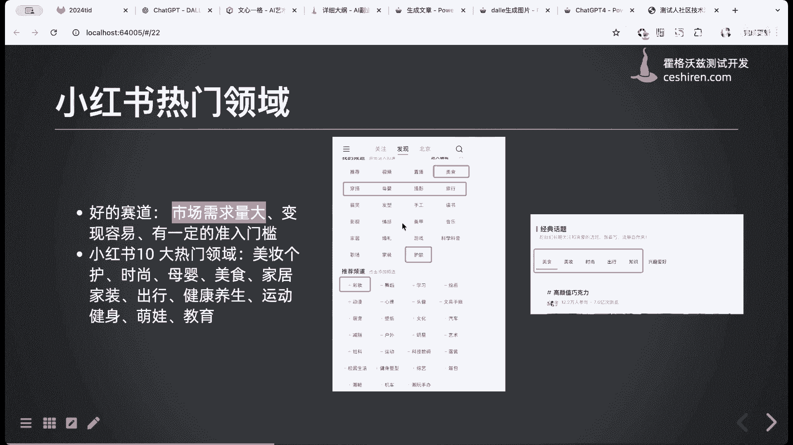

在发现这个页面，你可以点击这个渠道这一块儿啊，你可以看到像美食穿搭，母婴摄影，旅行护肤彩妆啊。

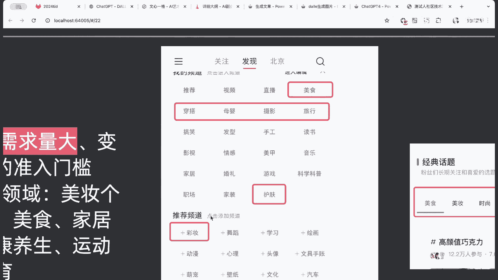

这几类，它的一个市场量都是比较大的啊，因为它属于是一个快消品，你比如说像零食啊，像那个护肤品或者像彩妆啊，它其实都是属于一个快消品啊，大家可以去看一下，这几个市场需求量相对是比较大的。

然后如果你不知道去怎么去做的话。

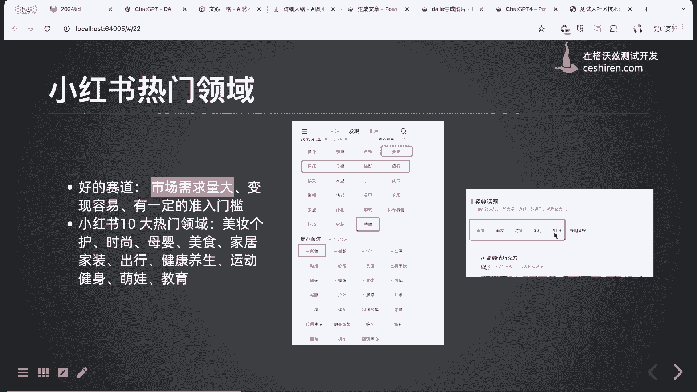

你可以在你那个PC端，然后你也可以看到小小母书的后台，也会给大家去推荐，比如说像美食美妆，时尚出行知识啊。

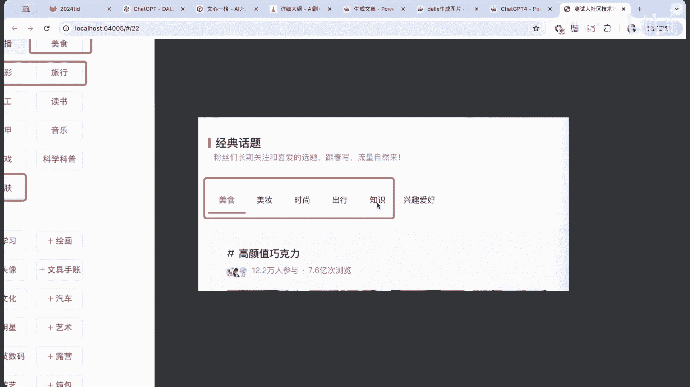

基本上小母书最大的几个品类，也就是这几个啊，然后再有就是它相对来说变现会比较容易一点，那其实我关注的一个up主，比如说他做的就是做的就是母婴的，大家如果去看他的小母说的这个账号的话。

你会发现他的每一篇文章，几乎都是在做一些小孩子或者是家里用到的，小物品的一个推荐，小物品的一个诱惑的，一个体验的一个感受的一个分享啊，它的一个变现能力是比较强的啊，有的有的你账号你打开之后。

你看他有很多粉丝，比如说像你分享一些啊京剧呀，或者怎么样，他粉丝也有很多，但是它的变现能力不一定强，因为它可以变现的商品是比较有限的啊，也是品牌在找你的时候，也要看你这个账号的一个调性是什么样子。

对吧啊，我不能说你去你是做母婴的，然后我让你去代理一个，就是嗯自行车或者是怎么样的东西对吧，所以就是大家再去做这个选择赛道的时候，然后去结合你自己的一个需求，然后去选这个市场需求量比较大的。

然后再有就是变现相对来说比较容易的啊，再有就是如果可以的话，去做一些有一定的准入门槛的啊，相对来说会嗯嗯，你的将来可能面临的竞争会比较小一点啊，那我在这给大家总结一下，小米说的这样一个十大热门领域啊。

比如说美妆客户其实是第一位的对吧，我们前面其实刚刚说了这个小，我说这个平台它的一个特色就是，它70%的用户是一个女性用户对吧，所以你在这个平台上去做美妆和客户，它其实是啊相对来说是比较热门的一个领域。

那这个的话其实做起来相对来说也比较简单，比如说我们女生啊，我们可能会用过很多很多的这种护肤品对吧，你我我觉得可能对于我来说，我可能从20几岁开始用护肤品，到现在，我可能用了不下一一两百件都是有的对吧。

你可以做一些这些产品的一些测评，然后可以可以去做一些对应的东西，如果你是一个化妆技能技术比较好的人，比如说哎我平时化妆化的就比较好看，那我也可以去做一些美妆的啊，再有就是你可以做一些时尚穿搭的。

那其实我了解到的行业里有这种时尚穿搭，在小红书这个平台上，一个月可以变现20万的人，他其实就是一个大学生，然后在做的，然后做的就是一些嗯穿搭，然后会有一些经常会有一些衣服品牌。

然后找他让他帮忙去带货啊之类的啊，再有就是母婴啊，我们知道这个小母书这个平台的话，母婴这个频道也是比较火热的，那如果是说直播间，咱们有妈妈，然后比较喜欢育儿啊，然后比较喜欢去做一些那个呃。

小小孩的一些营养品啊之类的，你可以去做这种母婴赛道，其实母婴赛道可以做的事情非常多，你比如说像育儿这一块儿啊，我们知道其实我们都是新时代的家长对吧，新时代家长在教育孩子的时候，有一个很大的特性是什么。

比如说你会去看很多跟育儿相关的一些书籍，同时把这些技能应用到你自己孩子的身上，然后你可以把你在日常过程中做的这些，育儿的这些小技巧作为文章写成文章，然后分享到这个平台上。

那同时你们家还孩子用的一些比较好的产品呀，或者看的一些比较好的绘本啊等等，你都可以在这个平台上去做一些分享，包括你作为母亲，然后你比如说你哺乳期或者妊娠期，你用哪些比较好的产品之类的。

你都可以在这个平台上去做一些对应的分享啊，这个母婴这个是一个非常大的一个体量啊，再有就是美食啊，美食其实也是一个非常好的一个，在小某书上也是一个非常好的一个渠道，这个渠道的话它其实主要分为两部分。

第一部分的话就是我去教别人怎么去变形，怎么去做美食对吧，还有一部分的话其实就是像探店呀，或者像做一些零食推荐呀之类的啊，其实我在做小红书这个渠道的时候，我自己其实也有想过是说想去做美食。

中国的这种美食地图这样的啊，去做一些美食地图，其实我们知道现在在take talk上，然后china travel这个词是比较火的对吧，很多咱们国家实实施了这个，144小时的这个过境迁之后呢。

很多老外其实来中国去做一些旅游啊之类的，他们对于中国的文化和美食，其实都是非常感兴趣的啊，你是你做美食这个品类的话，你不止在小母书这个平台上，可以去发对应的东西，你也可以发到海外的一些平台上啊。

一些老外其实是很喜欢这些东西的啊。

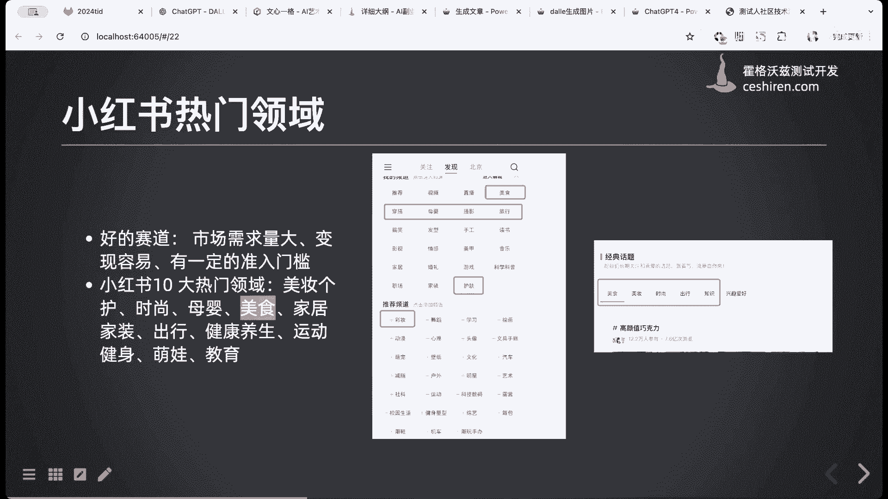

而且我可以跟大家讲，去海外的这种渠道的一个渠道流量费啊，会比国内的要稍等一下，诶，稍等一下哈，PPT有点问题。

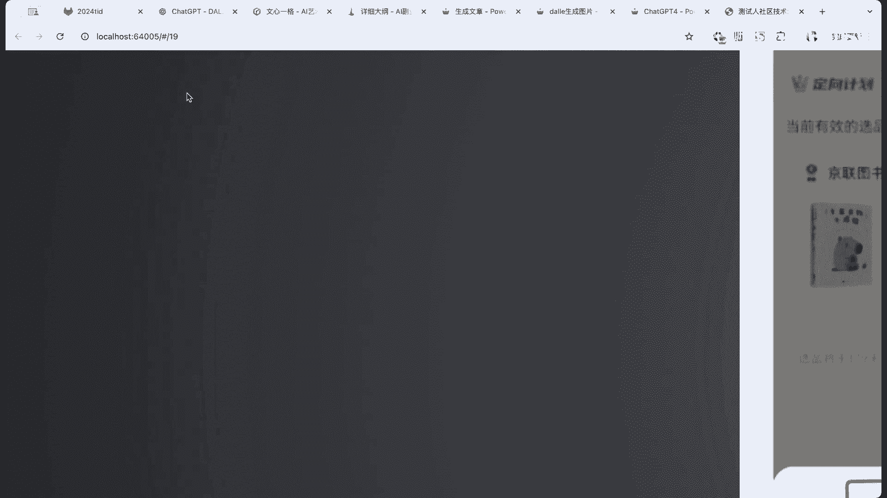

等一下我重新打开一下。

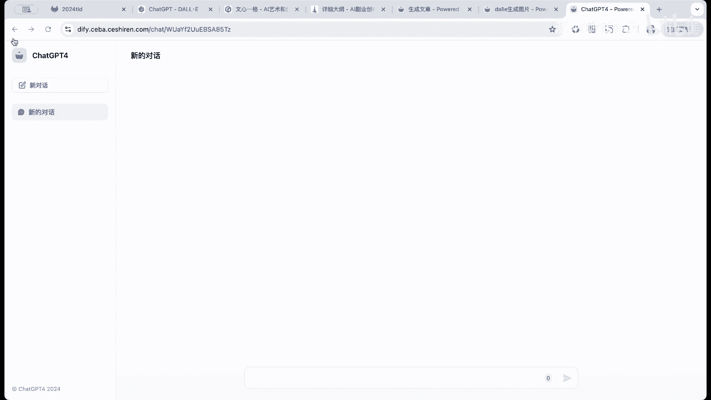

稍等一下，我重新打开一下我的这个。

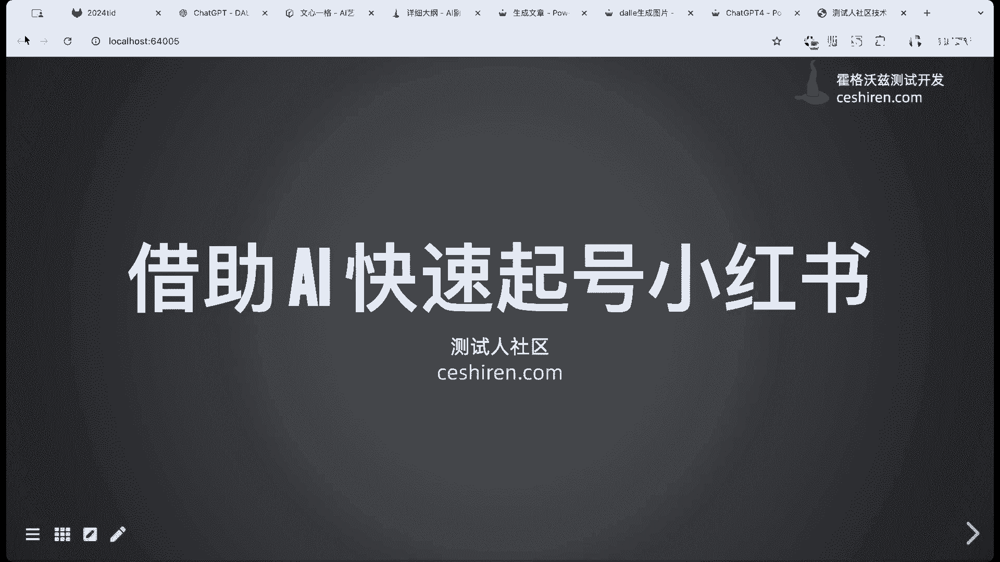

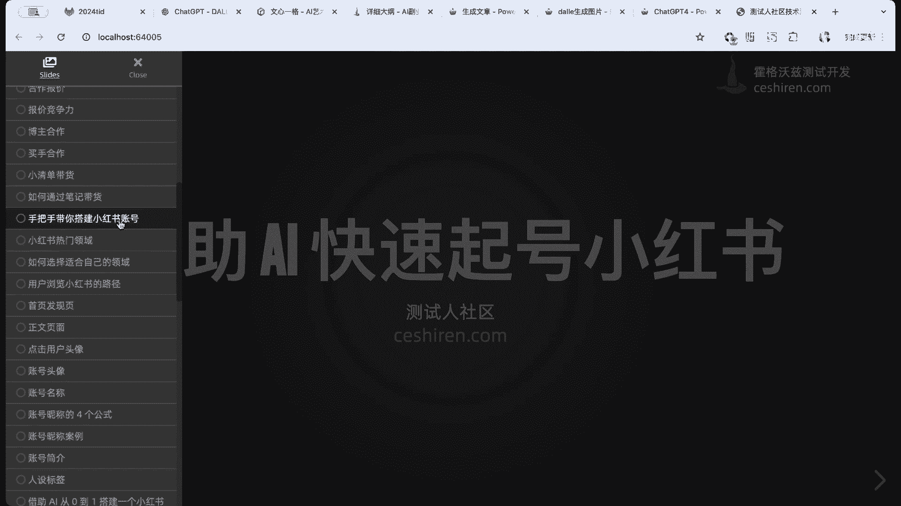

啊大家也可以去做一些这样的美食，这样的其实我自己曾经想过，我要去做一些中国的美食地图，然后讲一下中国的美食，它的历史是什么样子，他的做法大概是什么样子，然后你在这个区域。

你在哪家店可以吃到这个比较正宗的，这个那个产品，比较正宗的这个食品啊，这个的话其实你发到海外的这样的频道上，是非常受欢迎的啊，再有就是家居家装，然后这个其实也是比较受欢迎的渠道，你比如说家里的一些软装。

然后你用的比较好的，家里的一些用的比较好的盘子碗呀，台灯啊之类的，所有家居用品你都可以去做一些推荐啊，再有就是出行这一块儿啊，旅游啊或者是怎么样的这块，其实大家在这个小米书这个平台上，也可以看得到。

然后像之前新疆比较火的时候，那你打开这个小母书这个平台，基本上都是新疆的各类的旅游攻略等等啊，我自己现在出行，我基本上也是通过这个平台去查，然后有什么好吃的，有什么好玩的，然后订什么样的酒店。

我都是通过这个品牌去看，再有就是健康养生，然后对于我们程序员这个群体，或者是说对于我们全中国这种在职的工程师，的这样一个群体来说的话，建健康养生其实是非常大的一个市场领域。

将来已经是非常大的一个市场领域，我们知道其实中国人其实加班是比较多对吧，然后你的健康呢，多多少少都会有一些对应的一些嗯问题，然后如果我在这里面去讲一些养生的东西啊，我也可以获得比较好的流量。

那我养生的东西将来可以带货什么的，你比如说养生的一些产品，像养生壶啊或者之类的这些东西对吧，再有就是你的一些嗯养生的一些小工具呀，然后小食品啊之类的啊，都是可以做的啊，还有就是运动健身。

刚刚不是有直播间，也有同学在问吗，如果我是男生，我可以做什么对吧，你可以去做一些运动健身的这样的一个嗯品类，然后再有就是萌娃，萌娃的话就是你自己家的孩子的一些事情，然后你可以作为VLOG。

然后发到这个平台上，大家也是比较受欢迎的，女人其实对于两类东西她其实是很难拒绝的，一个是萌娃，一个是那种毛茸茸的小玩，小小宠物是非常难拒绝的啊，再有就是教育知识，教育这一块职场的一个教育啊。

再有就是嗯在小武书上你可以去看到，相对来说比较好做的几个教育频道，一个是心理咨询类的啊，心理心理类的啊，其实我们知道就是我们现在这个社会的话，我们都说是一个乌卡的时代对吧，它的不确定性非常大。

然后每个人的日常生活压力都很大，但间接产生的其实就是我们的健康问题和精，神健康的问题对吧，一个是生理健康的一个问题，一个是心理健康的一个问题，这两个品类其实将来是国内比较大的。

能产生消费市场的这样的一个品类啊，教育这块的话，它主要是像心理咨询呀，像这个职场的一些技能教育呀，尤其是一些比如说软技能的，像沟通方式啊等等的啊，都是做的比较好的啊，好多人做读书读书博主。

其实好的读书博主你如果能做好的话，是非常赚钱的啊，那嗯这个平台其实跟其他平台不太一样的，点是什么，你比如说我在某个视频视频平台上，我可能有4万多的粉丝，但是我相对来说变现能力是比较弱的。

但是如果你在小红书这个平台上，你做读书类的博主也好，你做任何一个博主也好，你如果有4万多粉丝或者有几万的粉丝，你都是非常非常的就是嗯吃香的，你都可以接到很多的这种推广啊，然后呢。

我们介绍了就是小米说的这样的十大的一个，热门领域之后，那我们对于个人来说，我怎么选择适合自己的领域对吧，那我觉得这个事情本身，我们是当做是一个副业来做，就是说你每天经历了一天特别辛苦的上班之后。

回到家还愿意去做的事情来说的话，我们首先肯定要选一个，你自己比较有热情的一个渠道，对对吧，你将来可以作为事业去做的一个渠道啊，再有就是你考虑一下，你自己是不是有什么擅长的事情啊。

比如说有的同学是说唉我就是喜欢读书，那我就可以去做一个读书类的博主对吧，然后再有就是，其实如果你是做读书类的博主的话，我是比较倾向推荐大家去做国学，这一块的东西啊，就是嗯大家其实从嗯各种国际新闻上。

其实也可以看到，那随着咱们国家这个国际影响力的阵容提高呢，海外学中文的，学中国文化的其实是非常多的啊，就是海外的这种这个渠道的话，他其实非常喜欢去研究中国的这种文化的啊，如果是说你正好也比较喜欢读书。

那你可以去做一些国学相关的一些东西，比如说一些诗词啊，或者介绍一些中国的这种古文化的呀，我最近在读，就是读庄子啊，就是你年少的时候去读庄子这个事情呢，你觉得好像没有那么大的这个感触啊，等你到了中年。

你再去读庄子这本书，你会发现老祖宗的智慧是非常非常的强大的啊，我们可以所有的历史事件，所有你现在所遇到的任何问题，你从老祖宗的智慧里都可以找到啊，也就是说你去做一些国学的东西，我其实说你做补血这东西呢。

主要是倾向于几个点，第一个点是你在国内频道可以做，你在国外的频道上也可以做啊，也可以去做嗯，因为现在国外像TIKTOK也好，或者是说TTER也好，YOUTUBE也好，其实有很多研究中国文化的这种老外。

他们非常非常喜欢研究中国文化，他们非常好奇中国人为什么会这么团结对吧，为什么中国人这个中国可以发展的这么快，他其实是有很大的那个文化研究在里面，然后大家可以去选择自己这个，比较擅长的一个渠道啊。

再有就是你有没有一直坚持在做的事情，哎比如说有的同学说哎老师我比较喜欢练瑜伽，我课下之后经常会去练瑜伽或者怎么样的啊，你找一个你自己一直在坚持做的事情，你可以把你自己生活里的东西变成。

将来可以给你变现的东西，那我后面其实也会给大家去看，就是我讲给大家去讲这个账号怎么去搭建，然后你的个人简介去怎么去说，怎么去写的时候呢，我会给大家去看一个瑜伽类的博主，他是一个在小红书，看。

小某书上有100多万粉丝的，这样一个瑜伽博主啊，其实在小某书上有100多万的粉丝的话，你的变现能力是非常强的啊，所以就是你考虑一下你自己的生活里面，你有没有对什么一直在坚持做的事情。

有的男生就比较喜欢做骑行是吧，周末经常去骑行啊，或者是怎么样的，那你可以做一些VLOG啊，去分享一些你这个骑行的一些VLOG啊，再有就是如果是说你自己确实是想象不出来，我自己到底擅长什么。

唉我也没有发现我对什么东西比较有热情啊，很多事情呢我都是做一段时间我就不想做了，然后也没有什么一直在坚持做的事情，那你可以问问身边的人啊，你的哪一项能力，别人相对来说是比较认可的。

那你就可以去在这一项能力上去做一些，对应的挖掘啊，去做一些东西啊，然后呢接下来呢我们给大家简单介绍一下，这个选择自己的领域之后呢，我们接下来会大家去教大家，怎么去从0~1的搭建。

这个小母书的这样一个账号啊，你想当旅游博主，如果只是副业的话，我觉得你没有必要全职去做这个事情很难，那你可以去周末，比如说你在你的当地去做一些那个city对吧，City walk，然后你可以分享一些。

你在你当下居住的这个城市里的一些事情啊，那我们先来想一下，我们要去搭建小小某书这样的一个账号，那我们如果是说作为一个普通用户，我怎么关注的一个up主呢，首先我们一般都是打开小红书的这个首页，之后呢。

会有一个发现页面对吧，然后我们会看到一些笔记的一些标题，和那个图片，唉我觉得这个标题写的很好，这个图片非常吸引，我会打开去看这个笔记的正文对吧，哎我看完这个笔记的正文之后。

我觉得它提供了我很多的一些实用价值，或者说情绪价值啊，提供情绪价值的，比如说是搞笑的这种博主对吧，然后我唉我发现我就可以去点击你的用户头像，去关注你，对不对，基本上用户去关注你的这样的一个路径。

就是这样，那我从发现页到看你的笔记正文到去关注你，那我们接下来就来看一下，用户路过的每一个路径上，我们要去怎么做优化才能涨粉对吧好，我们先来看一下啊，我们首先发现页，那发现页用户能看的东西是什么。

就是笔记的标题，笔记的封面，你的一个账号名称对吧，再有就是你的一个笔记的一个点赞量，大概是什么样子啊，那用户可以通过你笔记的标题，选的是说我觉得你这个东西吸引不吸引人啊，我想不想看，但是你的笔记的封面。

那小手书这个平台的话，因为他女性用户会比较多，大家可以看到是笔记封面相对来说比较温馨，比较比较柔美的，会比较受欢迎啊，再有就是你的账号名称是什么样，我能不能一眼识别到你这账号名称，对我有什么样的价值啊。

再有就是笔记的点赞量，你一篇笔记的点赞量越高，他可能点进去看的人也会更多啊，那我们点击这个之后，进入正文之后呢，他看到的其实就是你的笔记内容啊，以及你的点赞评论收藏对吧，啊有的时候我们点开一篇笔记。

我们重点看到的还是这个这个人的一些评论，对吧，我觉得评论区可能有的时候比你发的这个，那个给你发的这个文章都要精彩对吧，很多人也是冲着一些账号的评论区啊，他的一些固定粉丝都比较有意思。

然后我会固定去看一些评论区的东西啊，再有就是我们在这个评论区之后，到了这个正文页面之后呢，我们点击这个用户头像之后，我们可以看到什么，比如说账号的一个头像啊，账号的一个名称啊，账号的一个简介呀。

账号的背景图啊，以及你的主页视觉是什么样子对吧，我可以看到这些对应的信息，那既然用户可以通过我们的平台，看到这些对应的信息之后呢，那我们怎么去针对这些用户经过的每一个途径，然后去设定去买点。

可以让用户去嗯去关注到我们的一些点了，我接下来会给大家详细去讲啊，比如说从账号头像上，那我们可以账号头像上有几类的选择，比如说是真人头像啊，或者是IP漫画啊，或者是手绘啊都可以，那真人头像的话。

相对于IP漫画或者手绘来说的，它的一个真实感会更强一点，如果你不介意出境，那你的账号的一个头像，我建议你可以选择一些真人头像，如果你是做的一些比较专业类的东西，比如说我是一个知识类的up主啊。

我在讲这个呃怎么沟通一些沟通的技巧，那我用真人头像的时候，我可以用一些就是商务照片，作为我的一个真人头像，那还有一类呢就是品牌的一些logo，这个其实比较适用于企业这边，如果你是一个企业号。

在做入驻的时候，我可以去用一些品牌logo，到底是文字或者是风景类的一些照片，可以去做你的一个账号的一些头像啊，那再有就是账号名称，然后我这会儿一会儿会给大家去讲，怎么去去取自己的名字啊。

那账号名称的话，我们一般推荐大家就是使用专业领域，或者是兴趣领域加昵称就可以，我应该是贴了一些图啊，我给大家看一下账号昵称的案例，你比如说我们我们刚刚讲，我们这个做个人IP的时候。

我的这个账号名称采用专业领域或者兴趣领域，加昵称的这样一个方式对吧，那你比如说兴趣领域家女生，而这个ROY的这个瑜伽乐园对吧，它其实就是一个兴趣昵称，兴趣兴趣领域假昵称的这样一个账号方式啊。

再有就是一些专业岗位甲昵称，你比如说我可以叫这个啊，皮肤科胡云峰医生对吧，但是大家需要注意一点啊，如果你是专业岗位，尤其是医生，财经律师之类的这样的一些岗位的话，你是需要给小母书提供一些对应的资质证明。

你才可以去做这个事情啊，OK我们回归到这个账号名字，那账号一个好的账号名字呢，它有几个特性，第一个是一定要是简单易记的，易于传播的，那比如说像霍格沃兹才是开发学社，他其实就不是一个特别容易记的名字对吧。

很多人可能是说进来直播间好多次，我才能记得住你们家这个名字啊，长度的话尽量在两到五个字啊，呃另外呢小武说这个平台的话，它其实账号不是唯一的，也就是说是可以同名啊，大家在取这个名字的过程中。

你取完名字之后，可以在发现页面去搜索一下你这个名字，看一下你的这个名字重复的用户大概有多少，你排在第几名，然后来决定你要不要用这个名字啊，但需要注意的一点是，大家在注册完这个账号之后呢。

七天之内只能修改一次昵称啊，再就是拼写方便便于搜索，哎我有的时候，比如说我今天看了一个种草文章啊，我记住了这个up主的名字，但是我去搜索的时候，他这个字不好打，我也不好搜他对不对。

然后这个呢大家就是要注意一下，你在取名字的时候，一定要取一个拼写方便便于搜索的这样一个词，这样一个账号名称啊，再有就是多平台的话，比如说我们一般如果是做自媒体，我们会很多平台一起做对吧。

建议多个平台保持同一个账号，你比如说我可能平时看那个抖音，或者是看这个那个视频号号，或者是看其他平台视频类的平台会比较多一点，但我偶尔会去逛一下小母书这个平台，哎我今天在小母书这个平台看到你了。

那我可能喜欢看短视频的人，我会去搜一下短视频的平台，有没有同样的账号，你有没有在做短视频啊，所以推荐大家就是多平台，建议保持同一个账号就可以啊，再有就是刚刚说的避免重复，如果你是重复的。

你可以在发现页面去搜索一下，然后你看看你自己大概是排在用户里面的，第几个啊，那账号昵称呢给大家四个公式，大家可以按照自己的这种情况去取啊，取自己的名字啊，比如说你可以取一个真名，或者是常用的一些花名。

你比如说像霍格沃兹测试开发学社，那思涵这个名字可能在这个测试圈里，它就是一个比较好的IP对吧，如果我将来要去注册一个，小米说的这样一个平台，那我可能就直接取得测试工程师思涵，或者测试架构师思涵对吧。

我可以用自己的真名或者常用一些花名，来做一个做人做人的IP，那再有呢你就可以结合兴趣领域和昵称，那我刚刚给大家看的这个我们的这个瑜伽对吧，我可以是我的一个兴趣爱好加我的一个昵称啊，我昵称是rose对吧。

我的一个兴趣爱好的话就是瑜伽啊，我通过我的昵称账号啊，我在发现页面，我就能看到你这个博主是做什么事情的啊，再有就是昵称加爱好方向啊，再有就是专业岗位加昵称啊，在再有呢，还有就是啊。

这是你如果是做个人IP的话，你可以去从这四个方式里面去，按照这几个方式去取一个自己的名字，那再有就是本地自媒体，你可以用地域加功能啊，刚刚有个同学说他想做旅游类的博主对吧，但是没钱，然后还要上班。

也没时间对吧，那我推荐你，你可以先做你自己本地的这样一个地域加功能，加功能的这样一个账号啊，你比如说你可以做什么逛吃北京对吧，或者是说武汉自由行或者是怎么样的，你可以介绍一下你所在的城市。

它有哪些好玩的东西，然后它有哪些比较吸引人的地方啊，详细的去介绍一下就可以，因为我们知道都说旅游嘛，就是从自己待的地方去别人待厌的地方对吧，那你既然长期的生活在这个地方的话。

你对这个城市一定会有自己的一些认知，你经常去逛的哪些比较好的点，你经常去吃的哪些店，你都可以去做一些对应的这样的一些推荐，那再有就是，如果你是一个带货种草或者品牌宣传的，那你就用你自己的品牌加女称。

比如说像霍格沃兹特克拉学社，那我们其实就是一个品牌对吧，那我在这个小莫说这个渠道上做的话，我可能就叫霍格沃兹，测试开发学士这样一个名字啊，再有就是如果你日常分享的都是一些VLOG或者。

PLOG之类的这样的一些视频的话，你可以名称你自己取就可以，你想叫什么都可以，你可以取一个比较幽默的，但是要注意几点啊，就是你一定要是比较容易记，而且是便于搜索的啊，你是做日常类的VLOG的话。

你就随便取就可以了啊，这个没关系，那在这儿给大家几个案例，比如像真实名称的，像王心凌，她其实在自己这个呃小母书这个账号上，平台上也有他自己的账号啊，他就直接是叫自己的名字对吧，明星入驻这些平台的话。

他自己的名字本身就是一个IP，兴趣加兴趣领域加昵称的，然后比如说像LUCY的瑜伽乐园啊，再有就是比如说我刚刚说的地域的啊，你看这个像撒玩北京对吧，逛吃北京之类的等等啊，玩转北京之类的都可以啊。

你可以去按照你自己的兴趣爱好，或者是你所在的城市去取一个你自己的昵称，可以让用户一眼就知道啊，你这个up主是做什么事情的，那我们的用户在点关注的这个过程中，除了看见我们的账号还能看见什么呀。

就是我们的一个账号简介对吧，我们的账号简介是非常非常重要的一个事情，你的账号简介是在告诉每一个浏览，你见面的这个人，你是谁，你有什么擅长的方向，你能给我带来什么样的价值对吧，那在账号简介这一块的话。

我就推荐大家用这样一个那个公式来去写，你自己的个人简介就可以，比如说你的人设标签是什么啊，再有就是你的赛道标签是什么啊，让我们来看一下，比如说像你的人设标签，如果是你做你的人设标签的话。

我推荐大家就是一个核心人设标签，加两到三个副标签就可以啊，两到三个副标签，或者说核心人士的这个标签我应该怎么去选，比如说你可以选一些身份标签啊，你是程序员，你是一个架构师，你是一个老师，你是一个宝妈。

或者你是个导游等等，你可以做一个身份标签，比如说像这个账号啊，像这个账号，这个有100多万粉丝的这样一个账号，他其实给自己的这样的一个人设标签是什么，就是35岁投胎宝妈对吧。

那你看到这样一个账号简介的时候，作为一个妈妈，你是不是对他就很有共鸣，对不对，你是不是就很想关注一下她，哎我也是大连的这样一个宝妈对吧，我也想看产后相关的一些东西啊，再有呢就是证书类的标签。

你比如说你有一些营养师认证的认证，或者说你有一些瑜伽老师的这样一个认证啊，心理咨询师的一些认证对吧，或者有一些其他类的各种认证类的证书，你可以把它作为一个证书标签写到这里面去。

那同样的我们还是拿这个账号为例，你看他写的什么呀，全国瑜这个美国瑜伽联盟注册注册瑜伽师对吧，他其实是一个证书啊，再有就是你的技能标签是什么，有的同学说老师我这个身份的话。

我其实就是一个普通的宝妈或者普通的程序员，我好像也没有什么特殊的身份对吧，我也没考过对应的一些证书什么的，那我可以写什么，你可以写一些技能标签，你擅长做什么事情，比如说你是擅长学习啊。

你会分享一些学习的方法，你是比较擅长阅读对吧，自信经常会写一些书评之类的对吧，在我这是你时间管理，然后理财摄影旅行规划等等，大家都可以去写啊，再就是你如果实在没得写你的技能标签。

我觉得好像也没什么特殊的技能，那你可以去写一些爱好，比如说你的美食，你喜欢美食，你喜欢健身，喜欢骑行，喜欢插花等等，总之这个人设呢我们要打造的这个人设，就是要告诉每一个访问我这个账号的用户。

告诉他我是谁，我可以给你提供什么样的价值，我想让你通过这些标签，看到我是一个比较丰富的这样一个人，真实的人对吧，同时呢通过这些标签呢，你可以产生一些对应的身份认同和共鸣啊，这是这个哎呀。

哎呦我去这情况嗯，这是关于你人设标签的这个事情，那有的同学是说老师，我实在是不知道该怎么写啊，如果你实在不知道该怎么写啊，我我在这也会给大家去教一下大家啊，如果你实在不知道怎么写。

那你就要拆CPT帮你取啊，那我们可以去看一下啊，比如说你是一个小红书的，我们如果想跟chat gp，借助拆台GBT，去搭建一个这样的小红书账号的话，我们可以怎么去跟ChatGPT沟通。

首先我们要给他一些对应的提示词对吧，你这个提示词的一些模板，我要告诉他你的角色定位是什么啊，我的问题是什么，我想要达到的一个目标是什么，以及我的要求是什么，你要根据我的这些要求产出一些对应的东西。

那我们来看一下哈，我们可以借助一下小红书那个XTVT，我们怎么去做，快速的去构建一个小红书的这样一个账号啊。

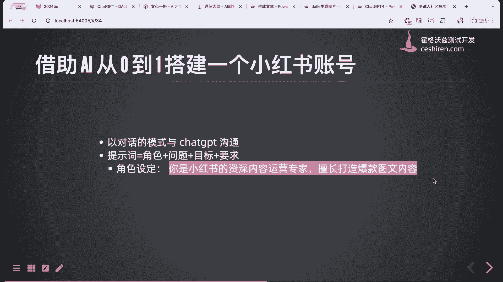

啊我打开我的XGPD4啊，我去跟他做一个对话啊，比如说我我们先去采用对话的这种方式，我先告诉他你是一个你的角色是什么对吧，你是一个小红书的一样，资深运营的这样一个专家。

然后你擅长的是打造的这样一个爆款的，图文内容对吧，然后他会告诉你啊，当然可以啊，作为一个小红书的内内容资深运营专家，然后我给你提供一些对应的一些建议对吧，那我们跟他产生了初步的这样一个对话之后呢。

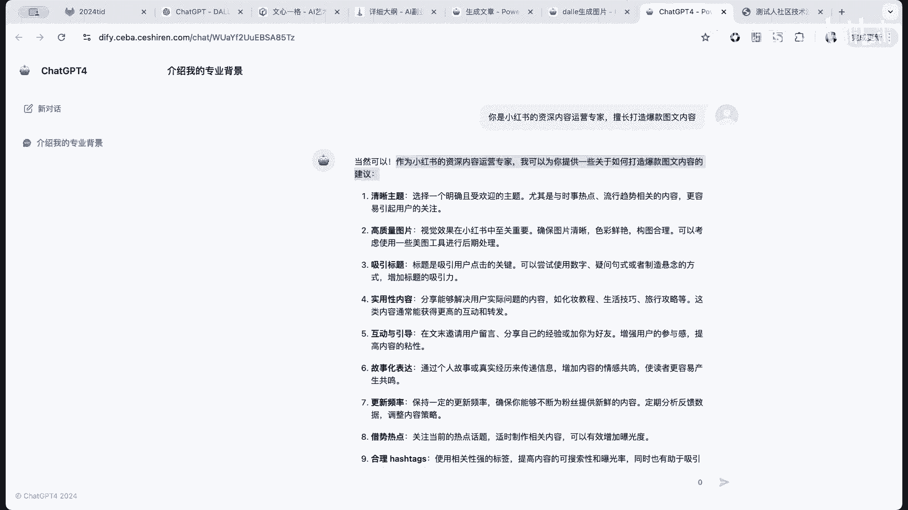

我接下来就要去生成我自己想要的一些东西啊，比如说我现在告诉他我是一个什么样的人对吧，我希望你帮我做什么样的事情啊，我刚刚已经说了，我们跟XGPG再去对话的时候，我们一个提示词的一个模板是什么呀。

我要告诉他我的角色是什么，我的问题是什么，我的目标是什么，以及我的要求是什么对吧，那我们来看一下我的这个，我写好的这个提示词哈，比如说我的身份是什么对吧，我的角色我已经告诉他了啊，我的目标是什么。

我希望在小红书分享一些这个美妆的一些内容，对吧，达到涨粉和快速变现的这样一个目的啊，请你帮我分析一下美妆账号的运营方式，以及变现变现逻辑啊。

那我们可以把这个画，然后发给我们的ChatGPT，但是大家有的时候在运行你自己的，XGP的时候，你会发现你生成的内容跟我生成的内容，可能会不太一样对吧，然后有的同学会发现是说哎老师。

我这个好像生成的不太精准，那其实是因为你自己对于你的这个啊账号，没有去做一些对应的呃模型训练啊，你可以多跟他做一些沟通，慢慢的你的这个模型就会越来越精准啊，你比如说呃我告诉他。

我要去让他提供我一些这个美妆账号的，一些运营方式以及变现逻辑，诶，他会帮我去说一下啊，美妆账号这个运营方式大概是什么啊，首先你要明确一下你的定位对吧，你是做一些产品的专业测评。

然后日常的一个日常的一个妆容，分享美妆技巧，护肤心得等啊，可以选择细分领域，更容易吸引这个精准粉丝啊，比如说我们直播间有些有些女性同学，她是比较擅长去做一些美妆或者化妆，这样的一些技巧的。

我可以去做这一块儿，还会有一些比较好的护肤心得的啊，也可以去做这一块儿啊，再有就是日期日期日常妆容的一些分享啊，那我们可以通过什么方式去做粉吸粉呢，啊，可以说你可以发一些高清的妆容的一个，前后对比图。

对吧啊，大家可以在小某书的这种平台上也好，或者是在视频号的这样各种平台上也好，你可以看到做美妆的，非常容易出出圈的内容是什么，就是你妆容前后的一个对比图，因为他的一个这个感知力。

给人的这种冲击力是非常强的啊，再有就是化妆的一个步骤头，你可以去做这些，然后再有就是产品的一些使用效果等等对吧，然后他会告诉你，你可以去做哪些细分的一些领域，以及你产生产出的这个图文内容。

可以是什么内容啊，再有就是你可以去做一些短视频对吧，增强直观的一个妆容的一个呈现过程，增强与观众的互动啊，你可以分享一些美妆教程等等啊，他还给你推荐了一些，你定期要去怎么做一些对应的互动啊，啊。

你可以看到，他其实给你回复的还是比较好的对吧，那我们来看一下它的变现逻辑，那对于美妆赛道来说，他也帮你说出了他的变现逻辑大概是什么，比如说当你的账号达到一定粉丝量之后。

你可以联系这个美妆品牌进行合作对吧，然后建立良好的口碑，品牌更愿意跟你合作之类的，然后产品代言，然后分成模式，其实我们刚刚说的啊，品牌合作，你可以走这个蒲公英的这个博主的那个合作，在分成模式的话。

你就可以走买手的那个合作啊，都可以，你还可以在线上去推广，去做一些自己的一些对应的课程对吧，然后他给我们提出了一些对应的一些，变现的一些逻辑。

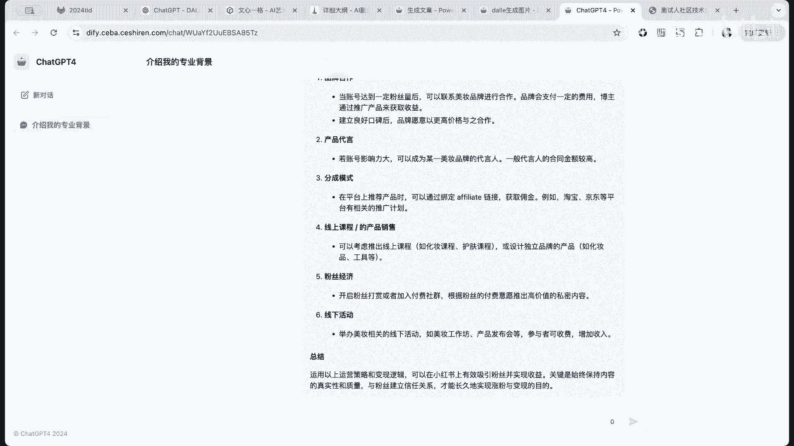

OK那我现在知道了我自己大概这样的一个，我要做这样一个赛道，然后我的一个逻辑是什么啊，我是用美妆作为一个那个嗯，作为一个案例去给大家去讲哈，你可以去按照你自己的这个赛道把改。

把提示词改成你自己的赛道就可以，那OK我们现在知道了，我们的账号的一个定位是什么样子，那我接下来呢想让他帮我生成，然后我的一个呃账号的一个名称，以及对应的一个简介啊，然后再有就是我会有一些小红书的。

小某书的这样一些特殊的一些要求对吧，然后我会帮忙写一下啊。

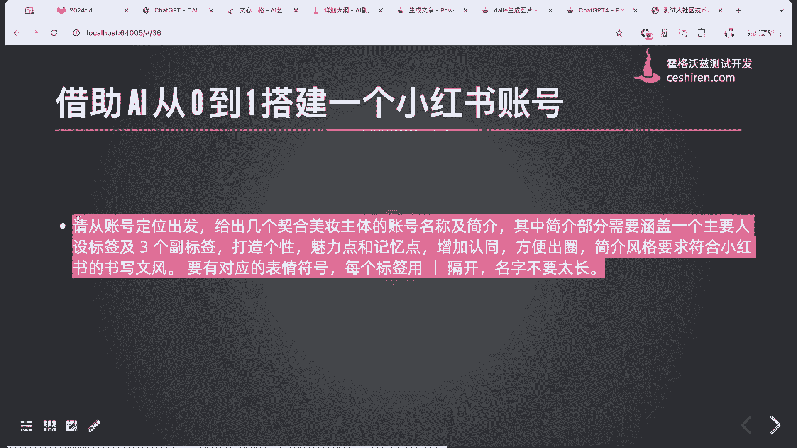

我们来让查GBT帮我们去生成一下，我我现在给到大家的提示词的话，基本上就是说如果你的这个模型没有经过训练，然后你拿这个提示词来去做的话，基本上问题也不太大啊，你比如说你看他现在给你做的一些这个呃。

做的一些名称也好，或者是做的一些简介也好，大家可以看到它基本上是比较符合小母书这样，一个平台的一些调性的对吧，那它会有一些对应的表情符号，然后会有一些对应的这样的一个标签啊，如果你觉得这几个账号不好。

然后我们也可以让他再去去生成，自己的其他的一些账号，那其实他给你的账号的话，当然我们前面刚刚已经跟大家说了，我们的一个主体账号，可以是，比如说是兴趣爱好加昵称这样的一个方式。

那我们也可以让他去再给我写一下，比如说我的一个啊账号名称的话，请采用，请采用，然后兴趣爱好，兴趣爱好加昵称的方式给出，你可以按照你自己想做的，或者想写想打造的一个IP形象，然后去跟他去做一些对话。

然后他会给你很多的这样一个这个那个呃，建议啊，比如说护肤小达人啊，护肤狂热爱好者，美妆小博，美妆小技巧，然后口碑产品推荐，日常妆容分享，它其实就是一个赛道标签对吧，就是你要看一下。

你能提供给用户的一些价值是什么啊，你比如说我觉得这个啊彩妆小仙女不错，哎我就想用这个账号了，那我们可以针对这个账号。

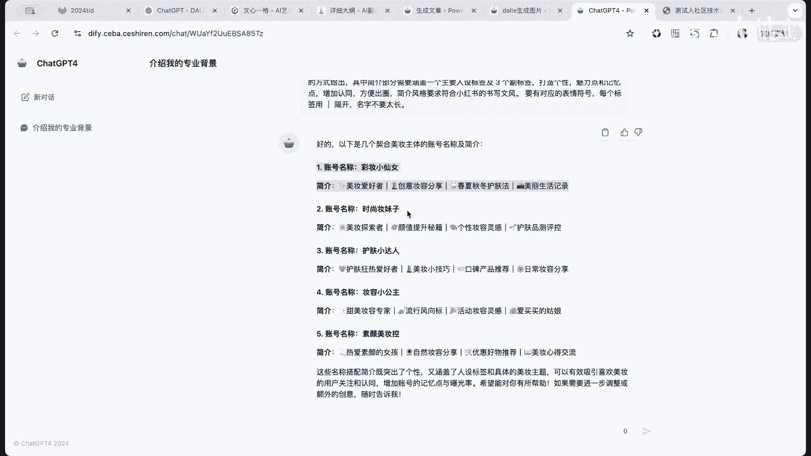

让他再进一步给出我们针对这样一个账号，它可以帮我们去生成一些，我们的一些运营的一些逻辑，比如说我告诉他哎我喜欢第几个设定啊，让我们开始第一篇的一个图文笔记吧，然后让它结合最近的一些热点。

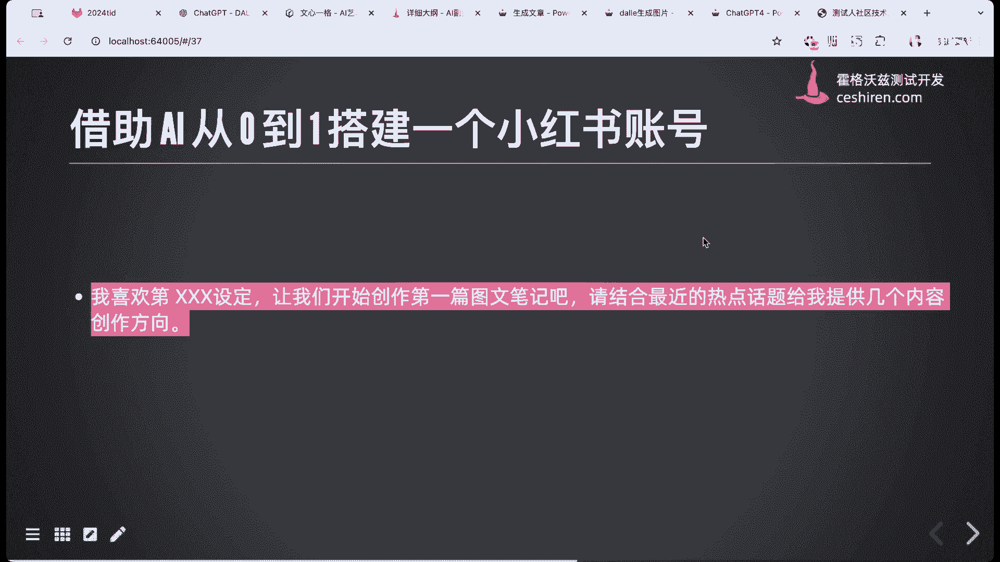

提供给我几个这样的一个方向，内容方向，有的同学在说我去做自媒体渠道的时候，其实我面临着很大的一个问题，就是选题的问题对吧，你不知道该怎么选题，你也不知道我要选什么样的题目。

然后会在这个平台上比较受欢迎对吧，那大家就可以去借助X的GPT，去做这样的一个设定，比如说我告诉他我比较喜欢第一个设定，然后让我们开始，然后创作第一篇图文笔记吧，然后结合最近的一些热点话题。

给我提供几个内容的创作方向啊，我们先让他升成上，然后我们来看一下直播间，同学的一些这个问题啊，啊我们来看一下问题啊，我们暂停一下，我们来看一下大家的一些问题，哦大家问题还是比较多哈。

我一开始看有海外平台嘛，然后那用不用注销小母书账号重新来，然后不用哈，你可以去把你自己原来的这个账号去，重新改一下你自己的昵称或者是简介啊，如果是说你现在想重新换一个赛道的话，也没关系。

除非是说你原来的账号已经被平台标记了，也就是说你自己发的同类的问内容比较多，已经被平台标记为某个up主了，然后呢你现在又想做其他的赛道，那我建议你重新起一个号，如果是说你本身流量就没有做起来，那没关系。

你可以把你自己现在这个号，然后去改一下昵称和简介，然后重新去去做就可以了啊，然后我看看大家有其他问题，男生做啥啊，男生可以去做一些健身啊，骑行啊，或者日常的VLOG分享啊，或者逛吃啊，美食啊之类的对吧。

本地的旅游攻略啊之类的都可以啊，男生男生有做化妆做的非常好的啊，你可以去看一下小朴树这个平台，有一个男生，他是做这个化妆的，然后他的粉丝还是蛮多的，如何AI自动化测试啊，你也可以去。

其实你可以去教别人怎么使用AI，大家其实对于程序员来说，比如说我们现在在用AI，我们觉得非常简单对吧，但是对于普通的用户来说，非程序员或者非互联网行业的人来说，AI用起来并不是特别简单的。

你可以去教别人怎么怎么做，怎么去做AI对吧，怎么使用AI去做一些提高工作效率的事情啊，中式养生可以吗，可以，书太多了，读不完啊，可以做杂吗，不可以做杂，如果是说你将来想要通过人设去做变现。

你的账号千万不要什么内容都发，因为这样的话，平台没办法把你标记成你是哪一个频道的，然后呢你你的流量推荐也好，你的这个后续你去开通蒲公英之后，你去做一些博主的合作也好，平台都不都不容易推荐到你。

而且商户就是企业端也不容易找到你啊，所以就是你起一个账号，你是做什么赛道，你就发什么赛道的内容，千万不要什么都发啊，又晒娃又分享护肤品，又读书，多大了，老师我我我很大啊，我年龄就不跟你们说了。

it's secret嗯，零基础多久才能变现啊，这个其实要看你自己做的这样的一个那个呃，账号的一个层次是什么样子啊，你比如说你想尽快的开通，去蒲公英这个平台的话，其实我前面也大家去说了吗。

我们可以怎么帮助大家快速的去达到涨粉，然后开通这个平台的目的，但是你能你能不能变现，你能变现多少，其实还要去看你自己的这个内容价值啊，你发的内容价值大概是什么样子的，擅长共情，擅长共情。

其实你可以做一些心理疗愈方面的东西啊，比如说你可以去借助大力模型，或者是MAJY这种模型，去生成一些心理治愈类的插画，配上一些心理疗愈的这样的一些那个文字啊，这个其实在小红书这个平台上。

也是比较受欢迎的啊，多平台账号，多平台账号内容不能一样吧，侧重点不同呃，多平台账号其实你比如说你是做视频类的，好几个视频类的平台账号，你是都可以发相同的内容也没问题的啊，会找bug可以吗。

可以你就是找茬大师，然后某某某，然后你可以去做一些产品的测评啊，哦今天内容会给大家介绍，小小某书这个平台怎么去做，以及怎么借助AI去做这个事情啊，怎么判定自己的流量有没有做起来界定标准。

我后面会给大家去解读这个平台的一些数据啊，我会教大家看哪些数据，这个数据代表的什么意思，你应该怎么去调整你的账号内容啊，啊刚才高客单热门的哪个商，哪个商单合作价比利润最高，没太看明白你这个问题啊。

你可以重新发一下怎么做分销，然后CP之类的分销的话，其实我刚刚跟大家已经看了啊，你达到1000粉丝之后，你去开通那个平台，你就可以去做一些带货的这样的一个分销啊，OK那我们接着我们的内容往下讲啊。

我现在看到我的这个XGPT已经跟我说了啊，我作为一个彩妆小仙女这样的一个账号的话，我可以去做哪些样的内容对吧，她会给我一些秋冬的这个流行，妆容的一些趋势啊，环保美妆的这样一些产品推荐对吧。

哎我觉得第二个比较好，我想去做一些对应的产品推荐，那我接下来就可以让他去帮我生成一些对应的，这样的一些文章，对吧啊，我先我我们接下来看一下，比如说我现在是你，比如说像我的话，我自己其实本身是一个敏感肌。

然后呢我在那个在北京的话，因为天气比较干嘛，一到冬天的话，其实是皮肤非常干燥的，那我就可以去写一些对应的一些这个，让他帮我生成一些对应的一些，护肤品的一些文章对吧，我后面会给大家去讲。

我们的这个五大爆款图文的，这样的一个模板是什么，我现在先给大家去看一下啊，其中一个模板，那OK我告诉他，你现在是小红书的一个运营专家，我现在想要写一篇关于这个产品的一个种草文，然后文章结构的话。

请你按照什么样的文章结构帮我去写，然后我告诉他，这个产品的主要的一个特性是什么，然后呢它的一个主要成分是什么，那我要求的一个文章风格的话，要符合这个渠道的一个种草文的风格，然后有对应的一些表情符号。

有关注点赞，收藏的一些引导，有详细的产品体验，那我们把它发给他，然后他就会帮你生成一篇比较好的种草文，大家都可以直接copy过来去做的啊，好那是我们借怎么借助拆GPT快速起号。

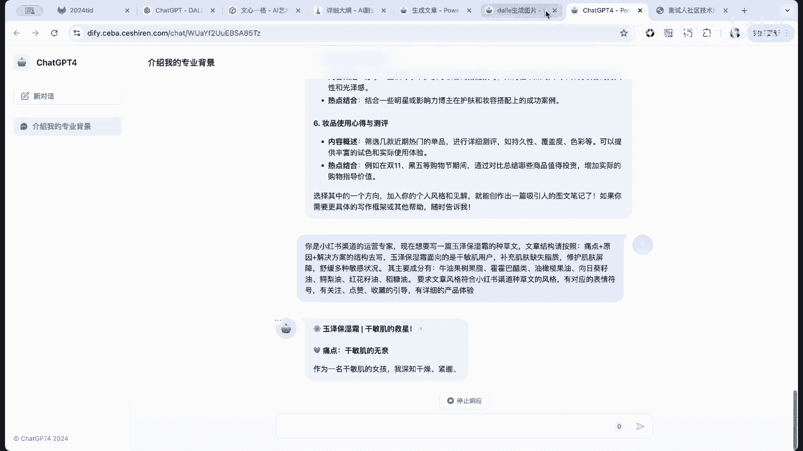

我们已经讲完了，那接下来呢给大家讲一下，那刚刚大家已经说了对吧，就说我怎么要写文章啊，笔记要怎么写呀，或者是某一个渠道，就是好多人都做了，我怎么才能做得比较出色呀对吧，那我们可以来看一下啊。

我如果想做这个渠道，我怎么去快速的产出一些高赞的种草文章啊，我在这儿会给大家分享，就是五个这个吸粉的这样的一个文案模板啊，我们先来看第一个模板，第一个模板的话，通常我们会说。

你可以是痛点或者是需求加原因加解决方案，加你提供的一个实用价值，这就是你在写种草文的时候，可以按照一个什么样的逻辑去说好，我们来看一下这个这个那个这个案例啊，这个案例的话，他这个账号是做什么的。

他是一个职场沟通技巧的，然后我们来看一下它的一个文章，他文章内容的话大家可以看，可以先看一下第一部分，他是说你是否曾经在工作中遇到沟通障碍，导致项目进展缓慢，情绪受挫等等。

他其实都是在描绘用户的这样一个痛点，对不对，然后接下来呢他给出了一个原因，它它归纳总结这个问这些所有问题产生的原因，是你向上沟通发生了问题对吧，所以他在原因这方面就说了一个。

提到了一个向上沟通的一个问题，他告诉你，上次如果想知道公司和部门的全局策略，所以要把自己的建议和想法与大局结合，要做好向上沟通这个事情对吧，那接下来会给对应的一个解决方案，对应的解决方案是什么。

比如说啊先理解上司的一些想法，提出自己的看法，尊重上司的权威，以及一些对应的这个沟通的一些原则等等，大家其实可以看到，这篇种草文其实相对来说是比较简单，比较简单对吧，但是你看他的数据。

他的点赞量有2670个人，收藏有2968个人，评论有16个人啊，所以说就是小母书这个平台的话，它其实是相对来说，对于我们新手来说是比较友好的这样一个平台，只要你的内容相对来说是比较有价值的。

那你一定会得到平台的一个流量推荐，但是大家一定要坚持去做这个事情，因为不是说我今天发一篇符合我老师，我按照你这个模板是什么一篇文章，我发出去就能报，不是这样的啊，你必须要一直去调整看数据。

然后去调整自己的内容产出，不断的调整到你符合这个渠道的调性为止啊，然后获得系统的这种流量推荐为止，这个是第一个这种新粉文案的一个模板，大家在写这个模板的时候，你可以直接把这个模板文案发给TGBT。

让他帮你去生成对应的文案，然后你针对他提供的一些文案的话，你可以发现人工智能提供的一些文案，它其实这个呃GBT的味还是很浓的，对不对，然后你可以对于他提供的一些文案。

再去做一些人工的这样的一些调整和修改啊，只把它作为是说提供给你思路的这样的，一个工具啊，千万不要照搬照抄啊，那第二个模板的话就是整合类干货，这种就是清单题，那大家知道，前段时间其实比较火的几个那个清单。

比如说像张一鸣在豆瓣的这个读书清单对吧，好多平台都在发啊，那这个呢其实就是我把各类的一些干货，或者是清单整理一下，然后我就总结出一篇文章去发，那我给大家看一下这个案例。

这个案例的话其实是这家那个呃卓创图书，他是卖书的啊。

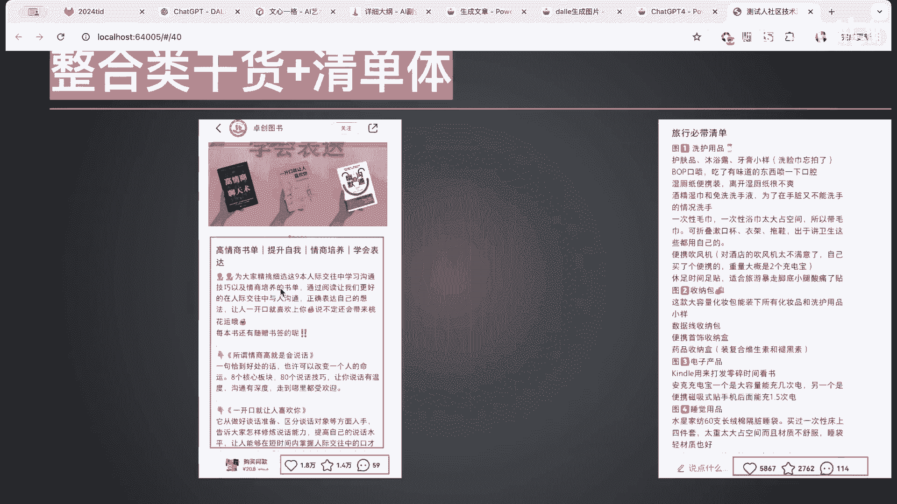

他给大家总结的一个书单是什么，就是高情商书单，提升自我情商培养，学会表达，然后他在这描述的是为大家挑选了九本，人际交往过程中的技巧，以及情商培养的这种书单啊，然后每本书可以赠送对应的书签。

然后它下面列了九本书，大家看一下他的一个粉丝量，它的一个这篇图文的一个量，你看他们点赞有1。8万，收藏有1。4万，然后评论有59个啊，他在这里面也加了自己的一个同款。

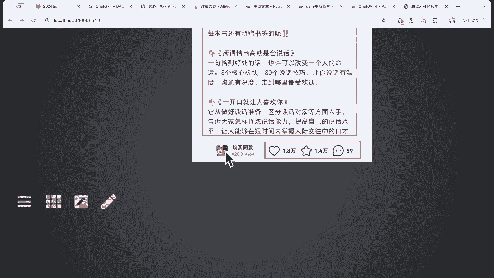

书籍的这样一个带货的一个链接啊，大家可以看到这是书单类的清单类的啊，我虽然不一定会读，但是我一定会去收藏，我会点赞对吧，那我们刚刚说小红书的这种平台推荐机制的话，它其实就是把你的这种互动数据加在一起。

你的数据高，然后你的这个呃系获得系统推荐的这样的，这样的机会就会更大，那这个呢也是一个清单，我们给大家去看一下，他发的呢是一个旅行的一个必备清单，而我们经常出差或者旅行的同学。

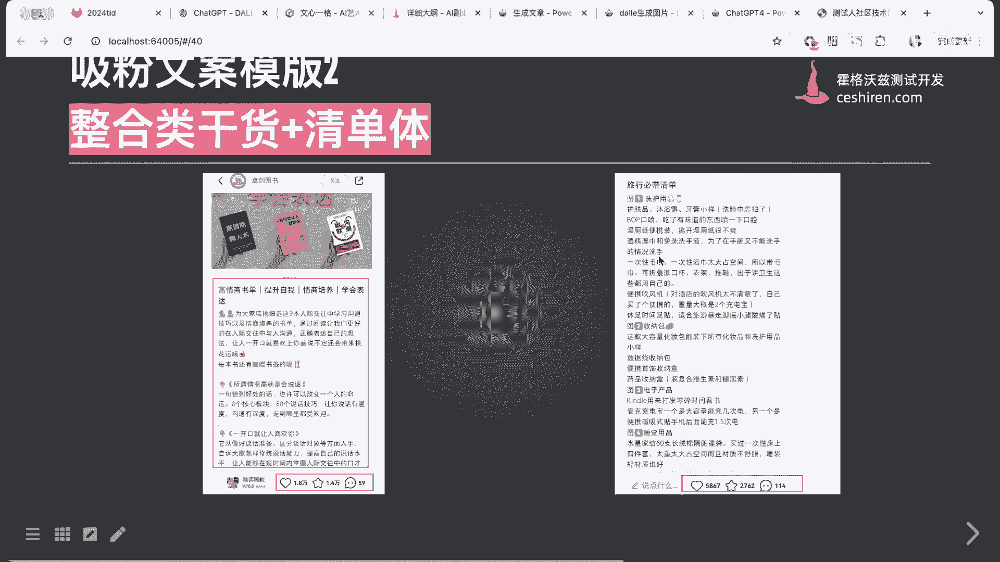

你可以去分享一下，你在出差的这个过程中，经常带的一些比较好的物品啊，你看一下他这个其实也非常简单，他就是列了一下我的一个洗护用品都有什么啊。

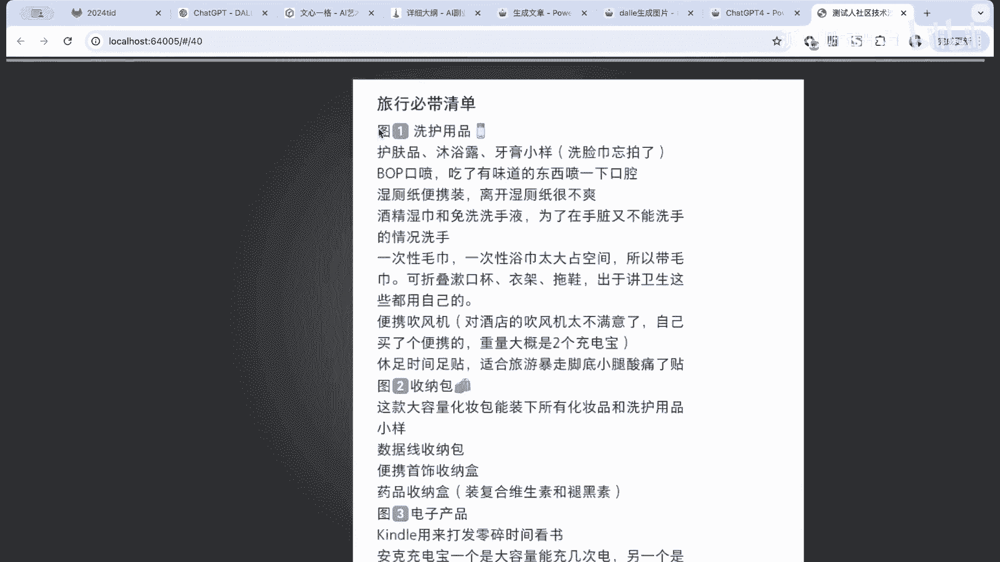

我收纳包都有什么啊，我的一个电子产品会带什么。

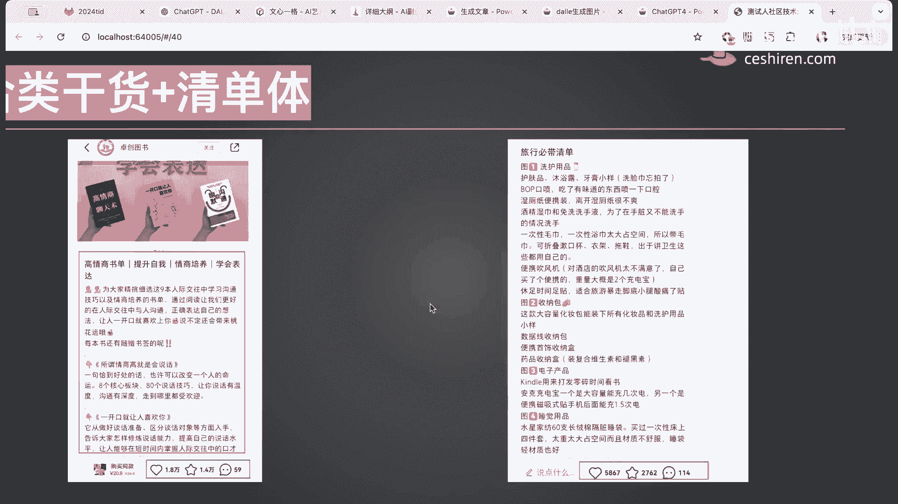

那你看一下它的数据，它的平台的一个点赞量，大概是5867个，然后收藏有2762个，然后另外有114个这样的一个评论啊。

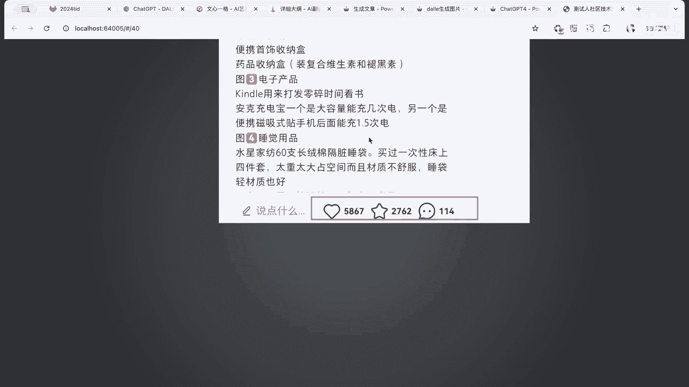

其实就是整合干货类清单题，在小某书这个平台上也是比较受欢迎的啊，这种文章这种类型的这种文章的话，你是最容易通过大模型去帮你去做生成的啊，嗯我之前其实有让他去生成，试着让他去生成的，张一鸣的那14本书。

他可以让他你把书单给他，他甚至把这个书的作者简介，这本书的简介都可以帮你写出来啊，你只需要调整一下，简单调整一下，然后复制到这个小红这个小母书上就可以了啊，这是这个模板二。

模板三的话就是第三类比较容易在小红书上，在小红书这个平台上报的这个文案类型，就是军训清单的一个整理，激发共鸣，人民日报经常会发一些比较惊艳的句子，然后大家就会总结，那我给大家看一下，这个人就是发了一些。

人民日报的一些比较好的一些句子。

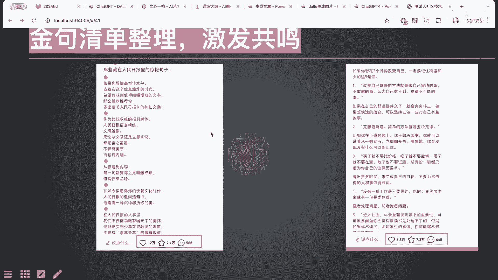

你看他说啊，如果你想提高写作水平，怎么怎么怎么样，然后作为比较权威的报刊媒体，它其实是推荐了一下这个东西，你看它的一个收藏量大概是多少，12万，点赞量大概是12万，然后收藏是7。1万啊。

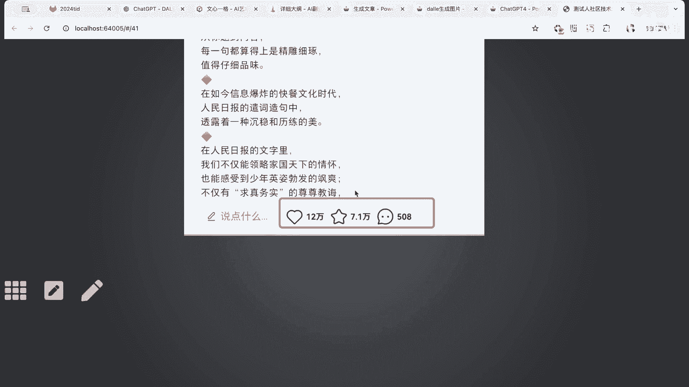

评论是508个，你看他分享什么东西的吗，其实基本上没什么分享他自己个人的东西对吧，但他就可以获得这么大的一个流量，然后这个呢其实也是另外一个人分享的，关于稻盛和夫的五句话啊。

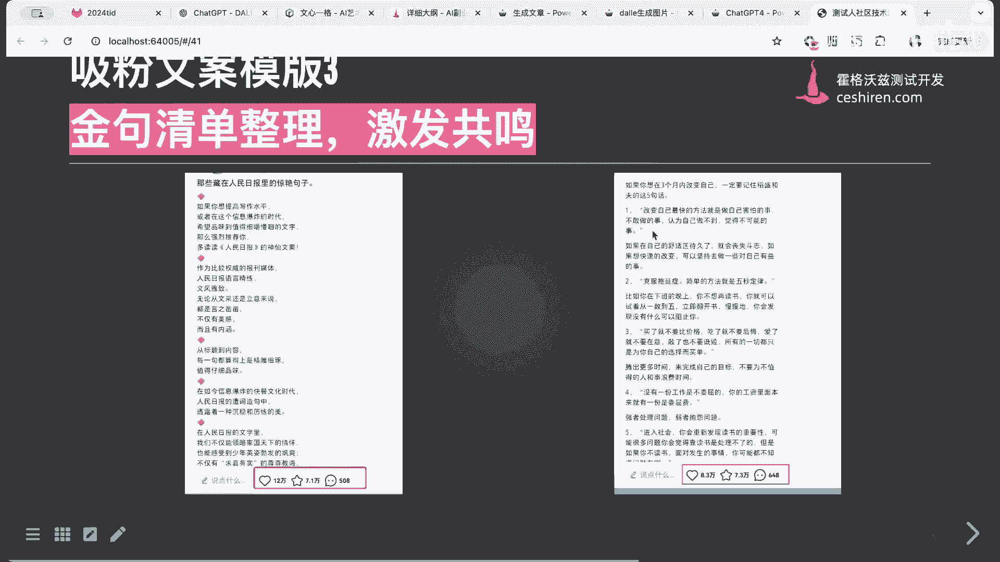

改变自己最快的一个方式怎么怎么样的啊。

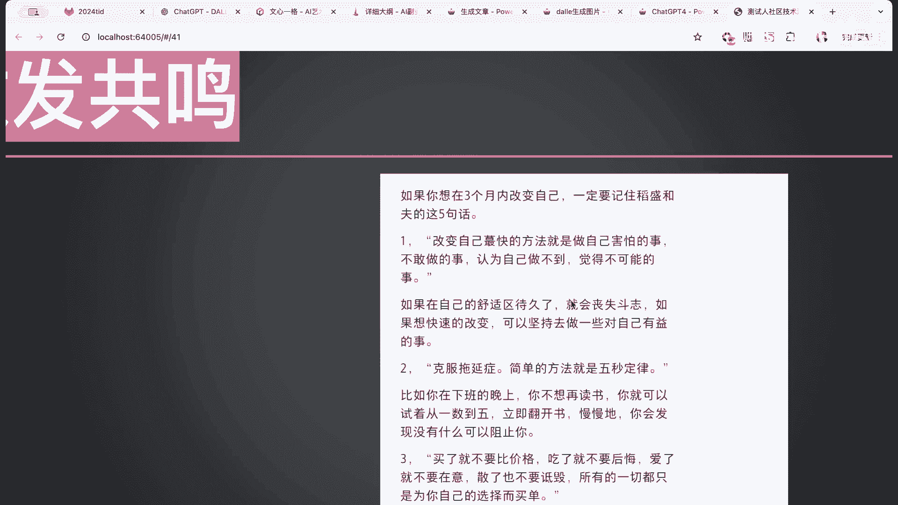

他只是摘取了稻盛和夫的五句话，你看一下它的一个数据是什么样子，他的点赞量大概是8。3万，收藏量大概是7。3万，评论大概是648个，就是这类的一些内容的话，在于小母书这个平台上是比较受欢迎的。

而且这种这种类型的文章，是比较容易做产出的啊，只要你坚持去发，坚持去调整，你一定可以让平台看到您啊，这是第三类，第四类的这种模板的话，就我们会说我们的一个吸粉干的模板。

我们可以这样写场景需求加产品加注意事项，你可以去种草，也可以去拔草，那刚刚不是咱们直播间，有同学说老师我擅长找bug啊，我能不能去找bug这个事情，那我就说你可以去做拔草的事情对吧。

你比如说我们大家日常用这些产品啊，我觉得它不好用，我就可以去分享这个产品不好用，帮大家去拔草啊，你也是有机会去报的对吧。

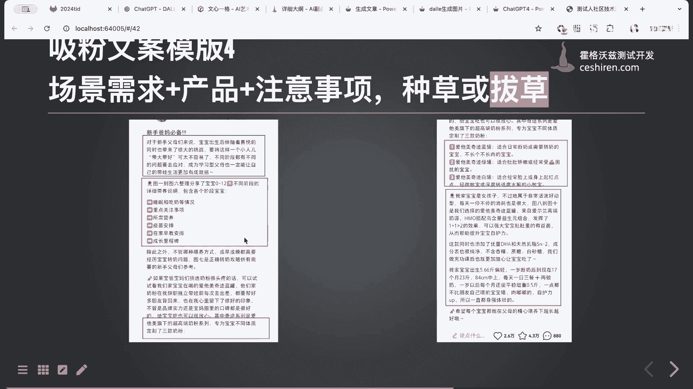

你比如说我给大家去看一下案例，然后这个案例的话给大家找了一个，就是新手爸妈准备的这些嗯品类，然后他就说了一个他自己是一个新手爸妈，然后呢整理了一个宝宝0~12个月，不同阶段的一个详细的营养说明。

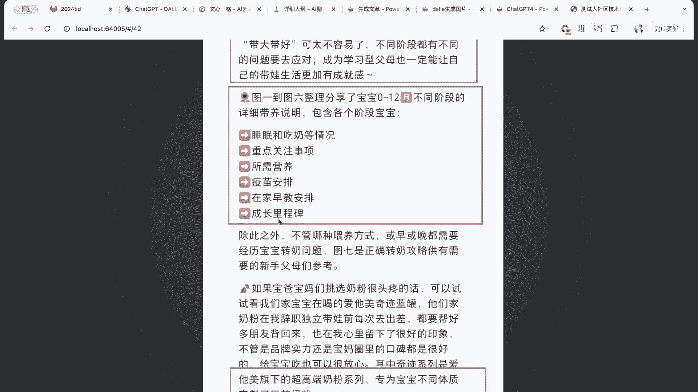

然后呢他还推荐了一些对应的一些奶粉啊，它的一个对应的一个奶粉是什么。

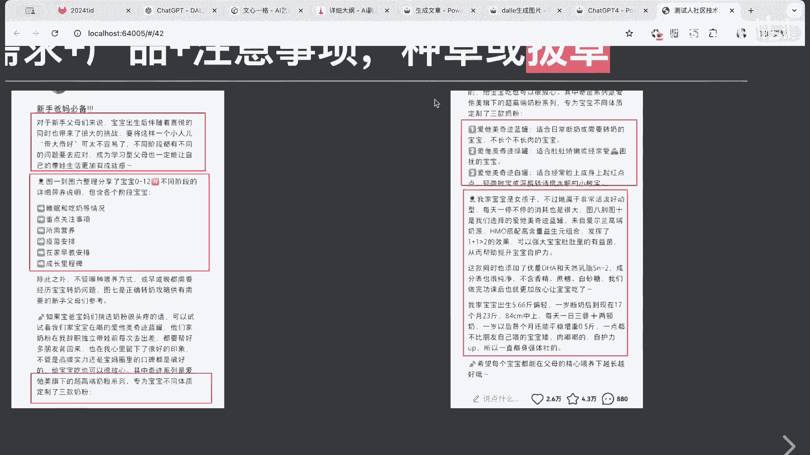

他推荐了三款对应的奶粉，那大家看一下，基本上就是按照这个场景需求，他就说他是一个新手的一个父母对吧，然后产品的话，它其实是推荐了三类的这样一个那个奶粉，然后他在这里面呢同时也说了这个他们家宝宝。

然后吃了这个奶粉之后是什么样子，然后一些需要注意的事项，他也在这里面说了，比如说在宝宝出生的时候是5。66斤，天津偏轻，然后断奶之后怎么怎么怎么样对吧，他也会写一些对应的这样的一些嗯，那个嗯注意事项。

那这种呢其实是比较容易获得宝妈的这样一个，日认同感的，你看他这个文章的数据，他的点赞量大概是2。6万，然后收藏是4。3万啊，评论是880个啊，大家就可以看到，其实小古书这个平台上。

你写任何一个品类的文章啊，你只要按照对应的这样的爆款，爆款的这种吸粉文案模板去写，其实是有机会去打造自己的爆款的啊，然后第五个这种吸粉网友模板的话，其实就是故事加经验类的总结加感悟。

然后你突出你自己的人设，大概是一个什么样子的，那这个人的话他其实就是分享了一下，他在这个小某说这个平台上，做自媒体的这样的一个经验啊，分享他自己的一个感受，然后他的一个数据，你看大家其实也可以看一下。

这个数据量也是很可观的啊。

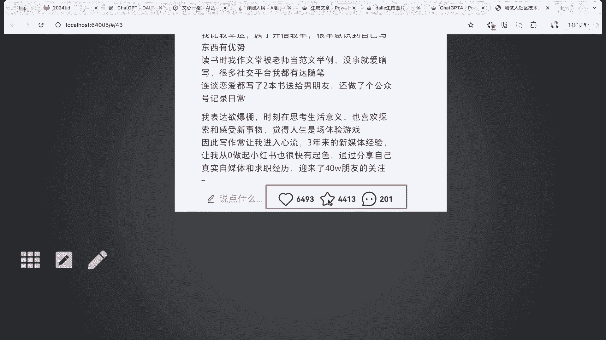

这是给大家推荐的五个，就是你如果在想读书这个平台上去写文案，你不知道怎么写的话，你可以去参考这几个模板啊，你把你需要做的一些产品，然后塞给HHPT。

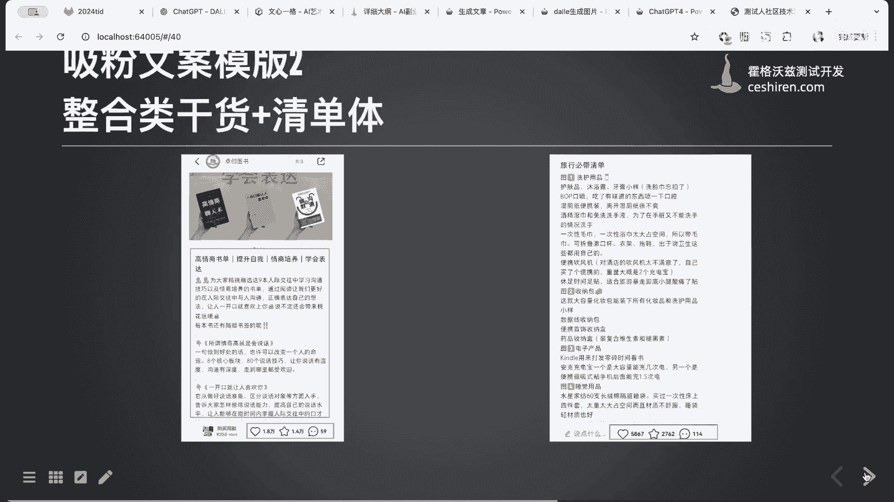

你把你想要的一个内容让他去帮你去做生成，你给它对应的模板内容，他会帮你去做做对应的生成啊，然后你在他的这个基础上去做一些修改。

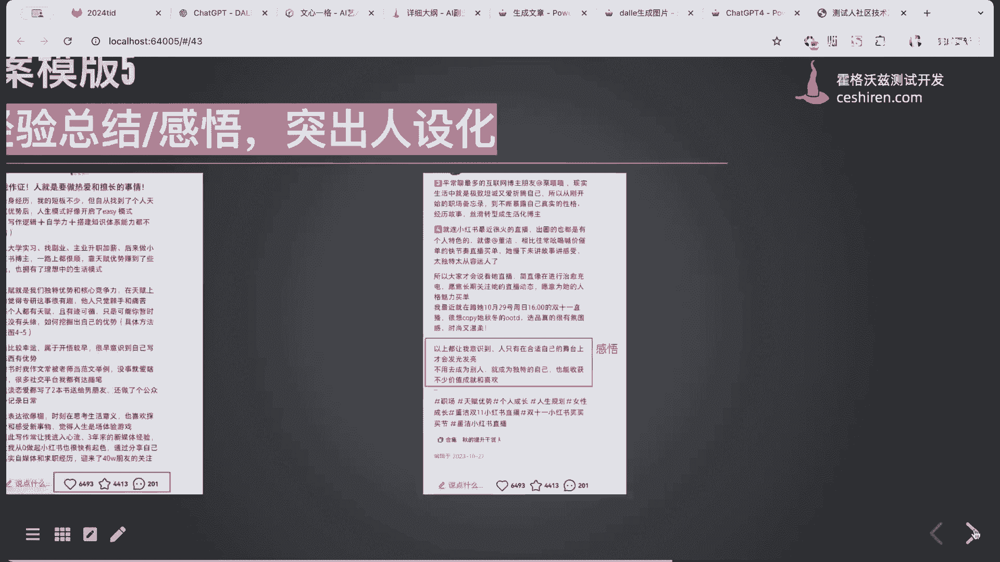

就可以啊，那我们来看一下，我刚刚让他去生成了一篇，我让他按照这个啊，文章内容是痛点加元音加解决方案的，这样的结构去写啊，帮我写了一篇这样的种草文，来我们来看一下，哎我会提到这个呃。

保湿霜是个干敏肌的救星对吧，这个标题，然后他的一个痛点是什么啊，作为一位干敏肌的女孩，是干燥紧绷刺痛的这样的一个滋味对吧，如果你是干燥皮肤的话，你看到这几个字，你是不是是非常有认同和感触的对吧。

然后每当季节变化或者气候干燥的时候，敏感的皮肤总是变得脆弱对吧，妆容也很难服帖对吧，我们俗称化妆界，我们经常说卡粉对吧，然后呢它的一个原因是什么原因呢，其实就是你的皮肤干燥缺水对吧，皮肤的屏障受损了。

那我们怎么修复这个屏障的一个受损情况呢，然后他会给你一些对应的这个产品的一个介绍，然后他自己的一个用户，一个它的体验是什么样子的啊，然后再来就是你到结尾的时候，会有一个引导对吧，引导用户去关注。

你去收藏，去点赞啊，这个呢就是我们可以借助拆机P去生成的，这样的一个图文，这个这个文章的话，其实大家相对来说，你看一下相对来说是不是比较，还是相对来说会比较糙一点对吧，或者是说他GBT的味儿比较浓。

我们稍后还会去需要人工去做一些对应的调整，对吧或者是需要配一些图的之类的，那有同学可能会说，那老师我要去配一些图，我可能不知道怎么配，我也不会设计，我也不知道怎么去从哪找图，我找图的话，我又怕侵权对吧。

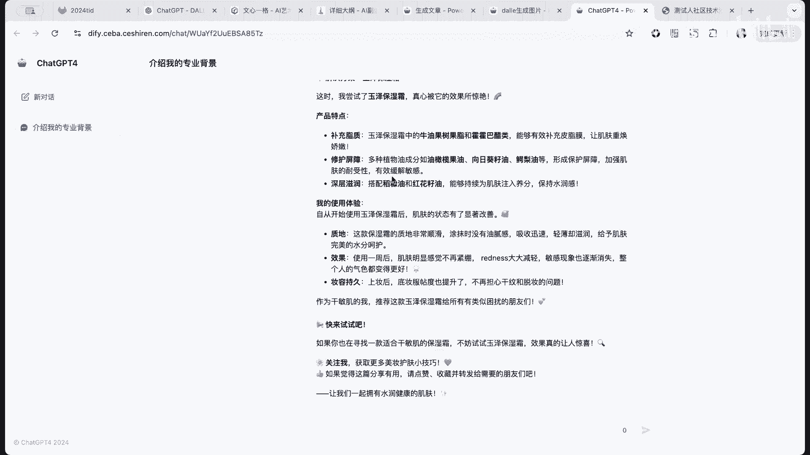

那我们可以去借助拆GBT，去帮我们去做一些图片的生成啊，我刚才在这儿给大家也录了一个，这个是我用另外一个生成的啊，其实就是同样的原理，然后让它去生成了，但你每次生成的这个东西的话。

它其实是每次都是嗯不一样的啊，你比如说这个相对来说它就会比较好一点，它会有一些这个表情符号会比较丰富啊，然后用户阅读体验会比较好啊等等，你如果觉得XGPT给你生成的内容不够优，不够优雅。

你可以让他继续去帮你去做优化。

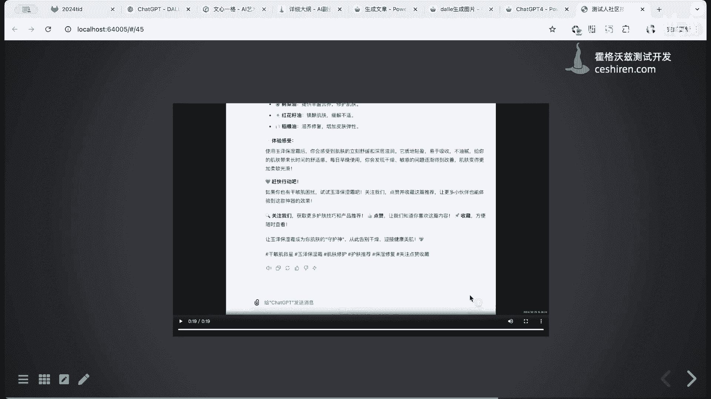

去做生成，这是这个，那么刚刚说了。

我们如果我们的文章只是干巴巴的文章，没有图片，然后好像挺影响观感的对吧，那我又不会设计图，又怕影响这种嗯侵犯版权怎么办，那我们就可以借助拆GBT去做一些文案，这个图片的一个生成啊。

那在文生图这个模型里面呢，我可以给大家推荐两个比较好的，我认为还可以的，一个是大理的这样的一个模型，它是拆GBT自带的一个模型，在我就是那个MAJOURNEY，MAJOURNEY那个呃模型。

然后大家可以用，还有就是stable diffusion这个工具，大家也可以用，那很多人可能会说老师我没办法去，我也没办法去购买这个东西，我怎么才能用上这个东西呢，那大家也不用担心啊。

我们对于我们的学员来说，我们会提供对应的工具，你在学习期间都可以免费去使用我们这些工具，你想光一个拆GPG4的模型，你一个月你可能费用也得到二十二十美金了，对吧，然后我们也会给大家提供对应的工具。

大家可以用啊这个搭理，或者是说MAJOURNEY的一些那个，纹身图的一些模型的话，其实你可以把它用来去做一些自媒体的素材啊，或者是广告的市场的一个营销啊，设计与艺术教育培训啊之类的啊。

都可以利用它去做一些图片的一些生成，那daddy的话，基本上我或者说MAJOURNEY的话，我们如果想要去做这个图片的生成啊，我们基本上就是嗯啊有同学说SD要求高了啊，SD要求会是会比较高一点啊。

大家如果学，我们在课程里面会给大家去讲SD这个东西，因为SD本身去做一些，是做一些高质量的影视壁纸啊，或者是营销类的产品的，这样的一个这样的一个那个呃营销图的时候。

其实他做出来的这个整体的感受会比拆GBT，或者会比搭理，或者会比MAJOURNEY直接生成的会好很多啊，这个熊猫兔是不是研究过这个SD啊，我看你还挺了解的这个东西啊，那么先来看一下。

如果我们要去做纹身图，我们的一个提示写模板应该去怎么去写啊，我们可以去主体对象加特征描述加环境，背景加图片风格加动作情境，你一定要把这几个描述清楚发给他，然后让他帮你生成，你比如说你像我用那个。

我们用那个打理生成一张图片，他一张图片可能就需要，比如说是0。28美金或者是怎么样的啊，所以你就是在描述的时候，你可以尽量描述的精准一点，这样它生成的图片质量会比较高一点，那对于主体对象的话。

我们去描述什么，主体对象其实就是你比如说你这里面是个人，是个男人，是个女人，是个动物，是猫还是狗，是建筑是什么样的建筑等等啊，你的图片的一个呃主体对象是什么啊，主体形象是什么。

再有就是你需要有一些对应的特征描述，比如说对象的一个具体特征，你的颜色呀，形状啊，姿势是什么样子呀对吧，再有就是要有一些环境背景的描述，我们比如说你这个嗯图片的这个对象，它所在的一个环境背景是什么。

比如你是室内户外城市自然等等对吧，还有去图片风格啊，你比如说对于搭理或者made journey来说，他其实支持非常多图片风格，比如说像写实啊，然后卡通啊，抽象啊，科幻风啊，油画呀，水彩啊等等啊。

他支持非常多的图片风格，所以你在生成这个图片的过程中，一定要告诉他，你想要的这种图片风格是什么样子的啊，再有就是你的动作意境大概是什么样，什么样子啊，描述清楚你的对象正在做一个什么样的动作。

或者是所处的一个情景是什么啊，一定要描述清楚，再有就是你希望这个图片的尺寸是什么，它的一个长宽比大概是什么样子，那就可以按照这个逻辑去做一些，图片的一些生成，那我们来看一个例子啊。

比如说我这个我这个让大地生成一个这个嗯，提示词，就是我给它提示词是一只威严的狮子，这个其实就是我们刚刚前面给大家说的，这个模板里面的主体对象对吧，然后有金色的毛发就是它的一个特征对吧。

他的一个姿势和动作是什么，站在悬崖峭壁上张大嘴巴是他的一个张大嘴巴，嘶吼是他的一个动作特征对吧，再有就是它的一个背景是什么啊，背景就是日出时分，然后你看这个MAJOURNEY就会帮我生成这搭理。

就会帮我生成这样一张图片啊，它会生成一个狮子，站在这种悬崖上的这样一个图片，那相对来说这个图片生成的质量，还是相对来说比较高的对吧，如果你是做自媒体渠道的运营，然后DDY也好，MAJOURNEY也好。

它生成的这种图片相对来说就比较美观，你可以去做一些封面图啊，本身就会比较吸引人一点啊，然后就是这个，你比如说我还可以让它生成一个，油画风格的对吧，这个是你帮我生成一个油画风格的狮子哎，他也可以做到。

他可以去做一些油画风格的，这样的一个图片生成啊，再有就是我还可以让他生成一些动漫，你比如说有些女生，她比较喜欢去做一些治愈类的插画，你可以去在那个呃小某书上也好，或者是说在其他的平台上也好，视频号也好。

你都可以去做一些治愈类的插画，也是比较受欢迎的啊，也可以去做一些动漫类的东西，你比如说我可以告诉她，哎我有一个美丽的年轻的女子对吧，这是我的一个主体内容，这个照片的主体内容，他留着长发。

穿着牛仔裤和白色T恤，脚上穿着白色的运动鞋啊，这是它的一个特征对吧，它的动作是什么呢，坐在一辆黑色的越野车的车顶上，开心地微笑着对吧，那大环境的背景是什么呢，背景是雪山草原，蓝天白云啊。

整个场景呈现出我的要求是什么，我要求你，整个场景呈现出阳光明媚的动画风格啊，细节精致，而是一副高分辨率的全身肖像，类似于中国画或者插画风格对吧，那大家要注意一点是什么。

你在用darling或者是made in journey，去那个嗯去生成这样的纹身图的时候呢，要需要注意一点，尤其是搭理他会去做一些嗯版权的一些检测，你比如说我想让它生成一个宫崎骏漫画风格的。

我出现宫崎骏这几个字，他就会告诉我那个不行，违反了一些东西啊，我必须要把宫崎骏这几个字去掉，然后改成动漫风格，才能给我生成对应的一些图片啊，这个是我用这个大理跟mate专女，各自生成了一张图片啊。

大家可以去看一下，你可以去生成这样的一些插画类的图片，作为你自己的这样一个呃，媒体账号的头像也好啊，或者是什么也好，或者是做你这个图文的配图也好，都可以去做啊，然后这个是我用生成的下午生成的这样一个。

我让它生成一个动漫风格的，你看他其实也可以帮我生成一个动漫风格的，这样的一个插画啊，可以在我的这个图文里面去做一些对应的插入。

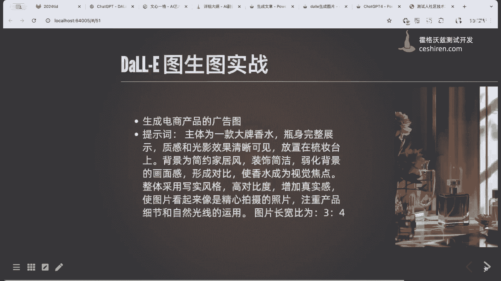

然后再有就是如果你想让它生成一些，广告类的图片，你比如说唉我现在想分享一款香水，或者想分享几个香水产品，然后我想去做一些小红书，好看一点的这样的一个封面图片，还有这个MAJOURNEY也好。

或者搭理也好，也都可以帮你去生成，做这样的生成这样的东西啊，你比如说我可以告诉他，你帮我生成一个大牌香水的，这样的一个那个图片，然后瓶身完整的展示质感和光影效果清晰可见，而放置在这个梳妆台上。

背景是简约的家居风对吧，然后装饰简洁，弱化背景的画面感形成对比，这个其实就是我对于他的一个要求，是什么样子啊，图片的长宽比是什么样子啊，三比四啊，他就会帮我生成这样的一些图片，你看其实相对来说。

它这个图片是非常美观的对吧，如果你把它作为小红书的这样的一个封面，图文的封面，然后也是比较受欢迎的啊，啊我来看一下这个，然后另外呢就是呃那个ti呢，它还有一个还有一个那个东西，它其实就是。

比如说我在这提前给大家录了一个视频哈。

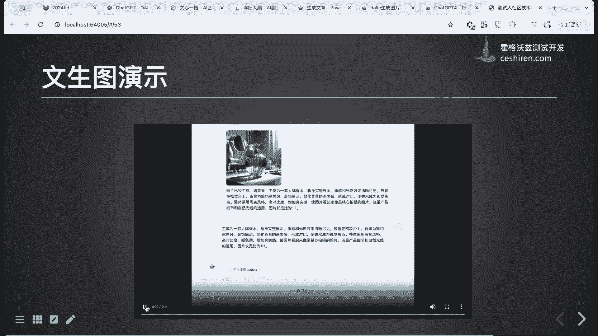

因为生成起来比较慢，所以我就提前录了视频给大家，比如说我告诉他，然后我主体是一款大牌香水，然后瓶身展示的是什么东西，我的比例是一比一，你帮我生成一个对应的图片，然后他就会帮我生成一个对应的。

这样的封面图啊。

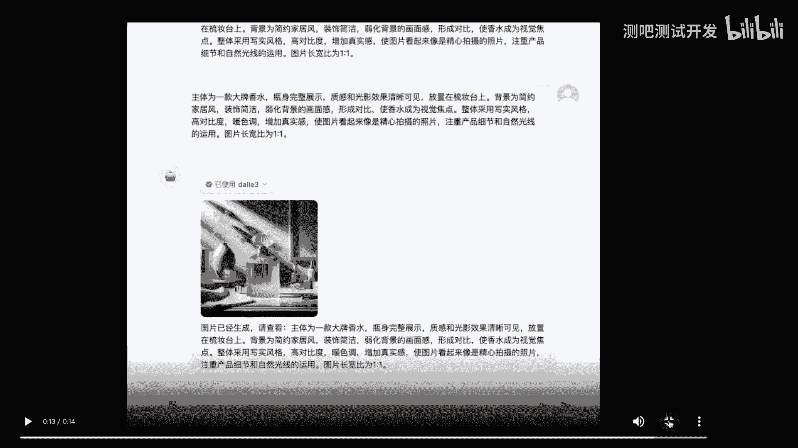

然后搭理的话，如果是说你们将来要去做这样的东西的话，我在这也给大家，我们也会给大家提供对应的这样的一个使用的，一些那个网站和那个呃和那个工具啊，大家也可以直接用我们这个平台去做啊。

另外呢搭理或者是MAJOURNEY呢，就比如说你如果是在网站上看到了某一个图片。

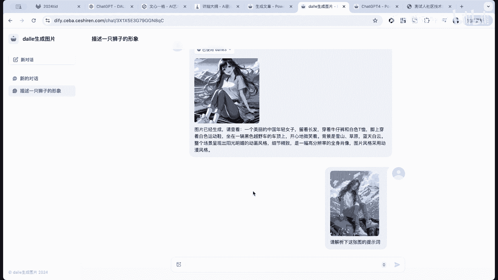

哎我觉得他很好，但是我不知道他的提示词该怎么写对吧。

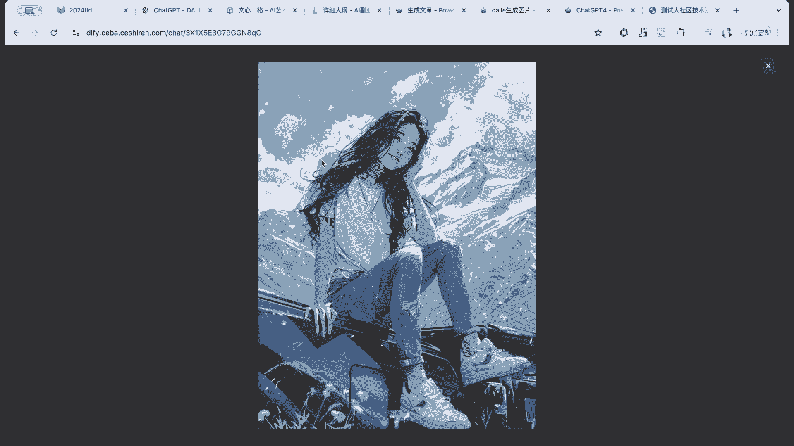

你也可以把这个图片直接塞给搭理搭理，它本身也是接受本地上传图片的，你可以在本地上传一张图片，然后让他帮你解析一下这张图的提示词是什么，然后生成出提示词来之后呢，你根据他给你的这种提示词。

然后你再去做一些更改，做一些你自己的调整，然后让它生成一些类似的这样的一些照片，这类似的这样的一些图片啊，都是可以的。

然后这个你看这是我用我可以给大家对比一下，这个是MAJOURNEY生成的一个香水的一个图片，然后这个是大理生成的啊，这样都是生成的一些产品图片啊，那我们日以后要去接广也好，接广告也好。

或者说我们要去做一些那个推广也好，那我们经常收到的是这样的需求对吧，甲方会给你一个特定的一个营销图，然后可能让你去自己生成这样的图片，去做一些营销推广，那这种图片应该怎么生成呢，后面我们会在大课里面。

我们也会去给大家去讲啊，就是因为这个的话，如果你单纯去用MAJOURNEY或者用搭理来做的话，它生成的图相对来说会比较死板一点，而且它没有办法完全识别到，你这个产品的一些轮廓，它会比较不自然。

那我们就必须要借助，我们其实刚刚像前面同学说的，这个还有stable diffusion这个工具啊，后面就因为这个工具，其实相对来说会比较繁琐一点，我们会在正课里面去给大家去做一些讲解啊。

公开课我就不讲这个东西了，太费时间了啊，搭理的话其实是相对来说会比较简单一点，包括MD这里是比较简单，你只需要按照我刚刚提供给大家的这样的一个，这个提示词的一些模板，你发给他。

他就会帮你生成一些对应的图片，当然搭理也好，没的真理也好，它生成的图片，不是说我生成第一张图片就会符合你的要求，对吧，我们一定会去需要去做一些微调，比如它生成完之后，你告诉他唉我觉得这张图片不太好。

哪个地方需要去做调整，都是可以去做调整的，另外搭理的话，他后期马上要出一个那个版本，就是它生成的图片，你可以在线针对这个图片再去做一些编辑啊，这个是文生图，也就是说我们可以借助拆GPT。

去帮我们去生成一些，我们在小小我说的这种图文里面，需要去做的一些事情，那搭理或者是说拆GBT，如果你想做漫画，比如有的，有的人可能对于做儿童绘本比较感兴趣啊。

他其实也是可以帮你去生成儿童绘本的啊，这个是我用搭理你，这第一张图是用made in journey生成的啊，第二张图是用大理来生成的，这样的一个绘本的绘本，你比如说我马上中秋节要到了对吧。

那我告诉他帮我生成一个中秋节的这样的绘本，的一个分镜方案，他会帮你分吃，那个会帮你产生出来，比如说我这个绘本里面会有哪几个画面，然后每个画面的描述是什么。

你只需要把对应画面的描述塞给这个MAJOURNEY，或者是塞给darling，它就会帮你生成对应的一个图，对应的一个图像，你比如说这个像梅珍女生成的啊，我告诉他，我们为什么要在中秋节去吃那个月饼对吧。

希望他讲一个这样的故事，那我让他设计了一个插画的一个封面图，然后就帮我设计了一个这样的一个插画，封面图啊，大家其实可以看到就是没专辑生成的，这个东西相对来说还是比较有这种画面风的，对吧。

绘画的这种风格的，那这个呢是我做了一个就是王子跟公主的，这样的一个绘本图案，然后我让她帮我生成了一个迪士尼风格的，这样的一个那个呃呃绘本的一个封面，那它也是大力，这是大力生产啊。

搭理帮我生成了这样一个图片，大家其实可以看到，这个是不是跟我们小时候读的，这个儿童绘本的封面就非常像了呀对吧，然后嗯其实大家去玩一下这几个绘图工具的话，就可以感受得到啊。

它其实现在这种大模型去生成对应的这种图文，生成对应的这种这种文章里面的，配图功能还是非常强大的，还有同学说，那老师我我我不用你们的工具，我用文心一言，其实也可以也可以百度，其实有一个文心一格。

大家也可以用，但是你看它生成的这个效果的话。

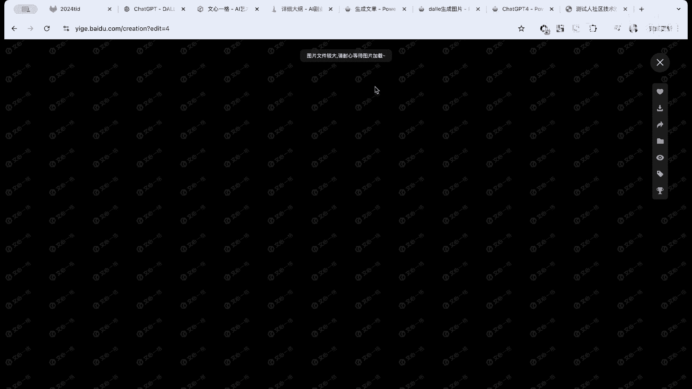

相对于就是made in jing也好，或者相对于搭理也好，它的一个这个呃呃效果还是不是特别好。

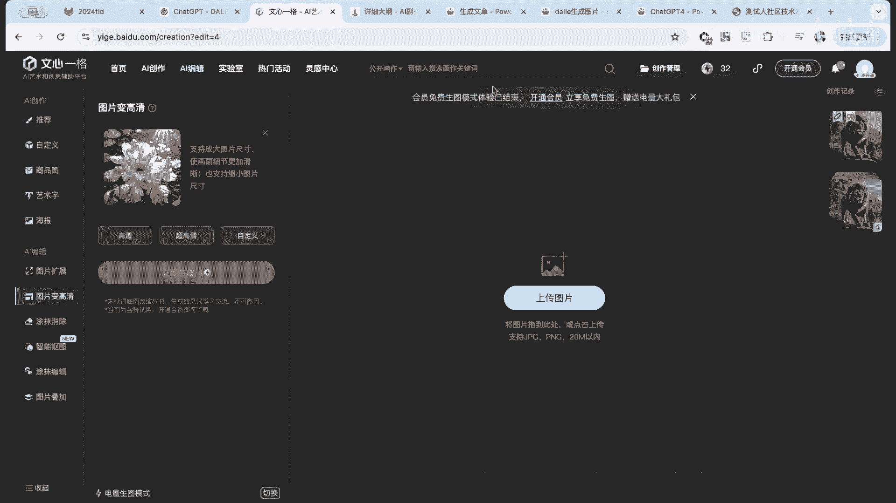

会会有一些对应的一个差别对吧，同样的一些提示词，但是就是文心一格生成的话，相对来说没有那么的优雅啊，这是这是这一块啊，就是文生图这一块我就不带着大家去实战了，大家课后可以去自己去试去试一下啊。

至于这种特定商品的营销图的话，我们会在正课里面给大家讲，因为这个相对来说会比较繁琐一点啊，OK那我们介绍了，我们怎么进入XGPT去生成种草文章，然后怎么在自己的种草文章里。

去借助这个大模型生成对应的一些图片对吧，让我们的图文看起来更有阅读感，那我们再来看一下，就是小某书这个平台，它那个算法机制是什么样子，我怎么才能获得平台的一些流量推荐对吧，那互联网所有的视频平台也好。

就是新媒体平台也好，它的一个机制的话主要分为三类，第一第一类就是订阅机制啊，你关注我，我想问你对应账号的内容啊，这种机制的一个代表人代表就是公众号对吧，公众号其实是非常典型的啊，就是它是一个你关注了他。

他就会给你推送对应的账号的一个内容，再去推荐，即使就是呃平台会根据你的浏览数据，然后去定位你喜欢什么样的东西，给你做一些定向推荐，再有就是搜索啊，用户搜索什么，然后平台就会推送什么样的相关内容。

当然这个内容你看到的内容排序，会有一些平台的算法啊，那小伙说这个平台的话，它其实就是推荐机制加搜索机制这样的一个啊，平台机制来给大家去做，做一些那个在发现页的一些流量展示的啊，推荐机制的话。

它一般是优先新发布的内容啊，也就是说我们刚刚说，如果是说你，如果是说比如说你去做一些发布这个呃，自己做账号的时候，你发现你发了这篇文章，或者说它的效果不太好或者怎么样的。

有些内容其实是你前面发了之后效果不好，不太好，隔一段时间你再发，你的效果可能就会不一样啊，再有就是搜索的，这它其实是优先这个新发布的内容啊，再有就是搜索机制的话，它是优先数据好的内容，其实我们刚刚说了。

小米说这个平台的话，它的数据好怎么来评定呢，其实就是看你的一个啊互动数据，互动数据的话就是你的点赞，收藏加评论的这样一个总和大概是什么样子，然后平台会根据这个去做一些对应的推荐啊。

那在做这个平台这个过程中呢，在做小组说这个平台过程中有几个需要避坑，然后会导致你可能拿不到这个平台，流量的几个点，大家在做的时候需要注意一点，一个是你的简介以及内容放个人信息，导流一直是导流微信的啊。

有的可能在做这个在做账号这个过程中，你的简介里就直接写了，还加微信，怎么怎么怎么样啊，这个其实会影响平台，对于你账号的这样一个导流，或者对于你的，对于你账号的这样内容的一个推荐的啊。

再有就是为了刷数据被官方识别到刷粉的啊，我们知道有些平台其实会有很多渠道，会提供刷粉这样的一个功能对吧，但是如果你被官方识别到是刷粉的话，你这个屏你这个账号后面都会被限流的啊。

所以大家去刷粉这个动作还是要谨慎的去做啊，再有就是召集导流变现，然后内容植入站外的这种引流信息的啊，然后还有抄袭搬运雷同度比较高的内容的啊，也会被平台识别到，然后也会影响你这个平台流量的推荐。

再有就是你的一个敏感词太多，然后利益诱导分享违规的好，违规的话，其实我们刚刚跟大家已经说了，大家可以去看那个社区公约，他在里面都会详细的告诉大家，你应该怎么去为那个遵守这个平台的规约。

它都有什么样的一些限制啊，怎么才能不违规，笔记的这个敏感词的话，我后面也会给大家推荐一些工具，大家可以写完之后呢，把它copy的这些工具里面去检测一下，你这个敏感词多不多，会不会被平台。

然后认定平台限流啊，嗯这是平台的一个规则，那其实刚刚有同学也说了，就是说我做了之后，我怎么知道我数据做的好不好对吧，然后我怎么去获得更多的这样的一个那个嗯，平台的一个推荐呢，就重点给大家讲几个数据。

一个是你的点击率大概是什么样子，点击，所谓点击率，就是你的点击数除以你的曝光量对吧，非观看量官方直接给出答案，然后它其实就是你官方平台，比如说你登录小红书的后台，他会告诉你你这个笔记的点击率是多少。

它其实都会有一些对应的数据，然后再有就是互动，互动的话就点赞，互动加收藏加分享啊，单位时间内他会给你计算，单位时间内有的同学一看，有的比如说有的up主他还置顶一个那个图文，一看哇，他数据很高啊。

但其实他积累了非常多的时间，那这种的话，它其实不一定会获得一个系统的一个推荐的啊，对因为系统算的是你的单位时间内，比如我算你每天的这样一个互动的一个数据，大概是多少，然后我会根据这个去做一些这个。

流量的一个推荐啊，再有就是你的转粉率，所谓转粉率的话，就是笔记的一个涨粉数跟观看量啊，对于这个小小虎说这个平台来说的话，一定搬up主可能会做到2%，然后我们新手的话能做到1%就不错了，什么意思。

就是你的观看量，也就是说你打开你的小红书这个app，打开你的笔记，你会看到一个小眼睛对吧，这个小眼睛代表的就是你的这个观看量，大概是什么样子，那你通过这个观看量涨粉的几个，其实是你的后台都有对应的数据。

你可以看到你自己的这个笔记的涨粉数是什么，是多少啊，会计算你的涨粉率，还有的同学说我发了一篇文章诶，我发现我的文章爆款挺多的，就我前面跟大家说，那个人发了一个他自己离职的这样的一个图片。

离职的这样一个图文对吧，然后它的一个互动数据还是很多的对吧，但是呢他的一个涨粉情况是非常少的对吧，这就说明你发了一篇迎合这个渠道的文章，但是你并没有涨粉啊，就是我们其实作为up主来说的话。

我们还要关注自己的一个转粉率，大概是什么样子，所有的这些数据的话，大家在你自己的一个账号里的图文，大概是数据是什么样子，小米说这个平台都给大家提供了，非常多的这样的一个数据啊，你比如说你在数据里面。

数据中心里面，你在你的创作中心打开你的创作中心啊，你这个打开就行，小米说APP，你点击创作中心，它有一个7日数据，然后你可以看到，比如说我看到单篇笔记的数据大概是什么样子，比如说我这篇笔记啊。

我的互动是25个，然后高于77%的同类，然后笔记涨粉了14个啊，高于90%的同类点击率很好，然后高于96%的同类对吧，完播率很好，高于83%的同类，然后呢，但是我有一点做的不好，就是我的视频画质一般。

然后低于81%的同类对吧，然后他会对你的这个呃，这篇笔记都会有一些对应的数据的一些评估啊，你可以去针对平台提供给你这个评估，去做一些对应的调整，你比如说如果你的点击率低，是什么影响你的点击率啊。

大家想一下，我在发现页看到你的这个图文，什么影响我的点击率啊，一个是你图文的封面图，一个是你图文的这个标题对吧，会影响我的点击率，但如果我的点击率不好，我是不是就要尝试去调整这两个字，这两个东西对不对。

然后再有就是互动，那互动的话，它其实是说明了你这篇图文的这个内容，价值是什么样子的啊，我觉得你写的这篇图文对我来说比较有共鸣，我可能就会给你点赞啊，我会我甚至会对我来说比较有价值，我可能会收藏对吧。

我甚至可能会分享给我自己的朋友去看啊，我可能会哎我比较有共鸣的情况下，我可能会跟你有一个评论的互动，对不对，如果你的互动数据不好，那就说明你这篇图文内容质量是有问题的。

那我们就要在内容质量上去做对应的调整对吧，那你要去看一下，然后我前面给大家说到的这个图文的，一些这个爆款图文的这样的一些文案模板，大概是什么样子啊，你你是按照哪个模板写的，符合哪一类的模板类型。

那有的同学会说老师我在做这个过程中，那我怎么看我自己的好不好，我也不知道，我也不知道该怎么调整，如果你不知道怎么调整，那你去找对标账号啊，比如说我现在要去做读书类的这样的一个账号。

那我就要去看小红书这个平台上，哪一个读书类的账号做的比较好，好，我去看一下他发了什么东西啊，它的一个内容是怎么写的，他的一个封面和标题是怎么做的啊，那我们可以去看一下它的一个对应的，对应的一个东西。

你找到你的对标账号，然后把这个对标账号他每天发的内容和标题，然后内容大概是什么样子，他那个互动数据是什么样子，你列一个表格全部统计出来，你培养自己的这种网感啊，时间长了之后，你自己就会培养出这种网感了。

你就会知道我发什么样的内容比较容易爆啊，再有就是转粉率，然后笔记涨粉除以这个观看量对吧，如果是我转粉率比好不好，可能会有什么原因啊，比如说你的这个嗯，你文章的底部没有去做一些引导对吧，我引导他关注我。

然后我引导他进我的思域等等，你没有去做一些对应的一些引导，然后只是写了一篇文章诶，我看完之后也挺有感触的，我也评论了一下，然后我回头找你可能找不着了对吧，所以就是我们在尾部一定要去留一个钩子啊。

那这些数据的话在PC端，大家去点开这个链接就可以看到，然后在app端的话点击创作日志，然后点击这个7日数据就可以看到啊，然后呢这个就是我今天晚上想要跟大家讲的，讲的其实相对来说会比较粗略一点。

也是想说通过这样一次公开课，相信大家对于这个平台，然后对于做新媒体，然后有一个自己的认知，然后去评估一下自己想不想做这个事情啊，愿不愿意做这个事情啊，那个那如果是说你想做这个事情，也愿意做这个事情。

但是只差一个方法的话，那大家也可以去学习我们这个AI的这样一个，副业班啊，在这个副业班里面，我们会给大家提供很多渠道的这样的一个运营，运营的一些经验，比如说像小母书啊，视频号啊。

然后take talk呀等等啊，我们会提供一些热门渠道，抖音啊等等，这会提供一些热门渠道的一些运营经验，让你少走一些弯路，那再有呢，我们也会充分在这个班级里面，发挥程序员的一些技术优势。

因为前面其实我刚看到有同学在问，是说是那个自动的吗，服务器24小时跑吗，其实这个是可以实现的对吧，程序员知道我们测试工程师也好，或者是我们这个开发工程师也好，我们都会做JK对吧，我们可以部署一个服务器。

然后让他定期帮我去产生内容，定期去分发，那我可以给大家看一下，我们现在在做的一个工具哈，这个是一个我们做的自动分发的这样一个工具，它其实原理非常简单，就是你只需要在这里面告诉我。

你想要生成一个什么样的这个文章类型，然后你想发到哪个渠道。

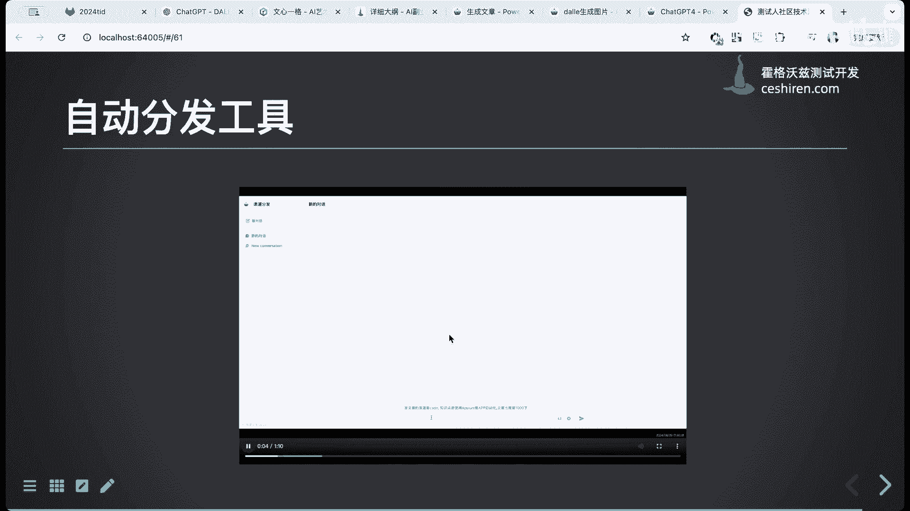

然后我会直接帮你去做对应的一个分发啊，一键就可以完成这样的东西，比如说我告诉他我发文章的渠道是CSDN，然后知识点是使用app，我做APP自动化，然后文章的长度是1000字。

然后请你帮我生成这样的一个这样的一个文章，同时发布到自动发布到4S店，这样一个平台上啊，会有一些自动分发的工具，你看它自动会去做这个事情啊，这些工具哈大家如果是报班学习，我们后面也会提供给大家。

大家也都可以直接用啊，你也不用自己去开发，自己去研究这块的技术了啊，你看他会把我生成的内容，然后去做这个复制粘贴，然后去做，我会告诉大家要加什么样的标签，然后告诉他在尾部要去做什么样的事情啊。

其实在我们这个工具里，都是给大家去做了集成的，所以你不需要去做太多。

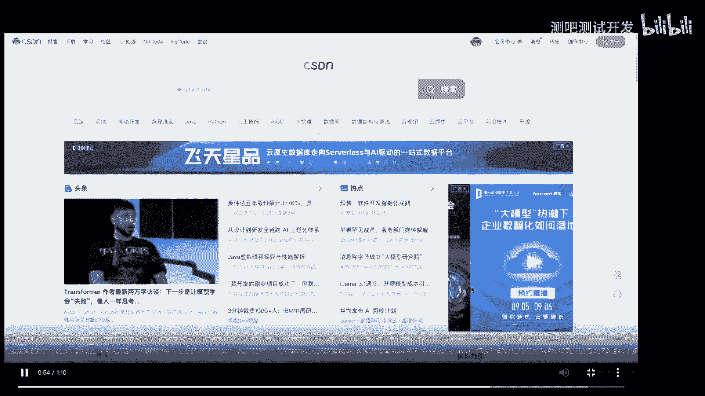

这种操人工操作性的东西啊，这是我们做的一个自动化分发的工具，因为我知道今天来听课的大部分都是程序员嘛，对吧，我们本身做这个事情，其实是比普通的运营人员是有技术优势的啊，再有就是会给大家讲解一些。

多平台的一些变现策略啊，你比如说刚刚有同学说哎呀老师涨粉好困难，怎么才能涨粉对吧，那我们同学之间我们大家都在做这个事情，能不能去做一些互相关注，或者互相去刷数据的这样一个事情啊，当然这些操作的话。

我后面会去讲啊，因为不太方便公开去讲这些事情，然后再有就是我们学校本身，也会给大家提供一个变现渠道，其实刚才给大家说了，你只要有流量，我们学校是有变现渠道的，你可以通过学校的这些变现渠道就直接变现啊。

推广学生的一些课程啊，然后推广一些我们的工具呀，或者是怎么样的，你都可以去做一些对应的变现啊，那我们在在这个课程里面，然后给大家提供自媒体运营的一些工具，比如像拆GPT4啊。

然后大理的这个文章图的模型啊，然后stable diffusion啊，视频剪辑工具啊，新媒体运营工具啊等等，我们都有做一些对应的开发，然后也会给大家拿去使用啊，这是我们对应的一个课程大纲。

对大家可以去看一下这个课程的话，其实我们是在这周六就要开班了啊。

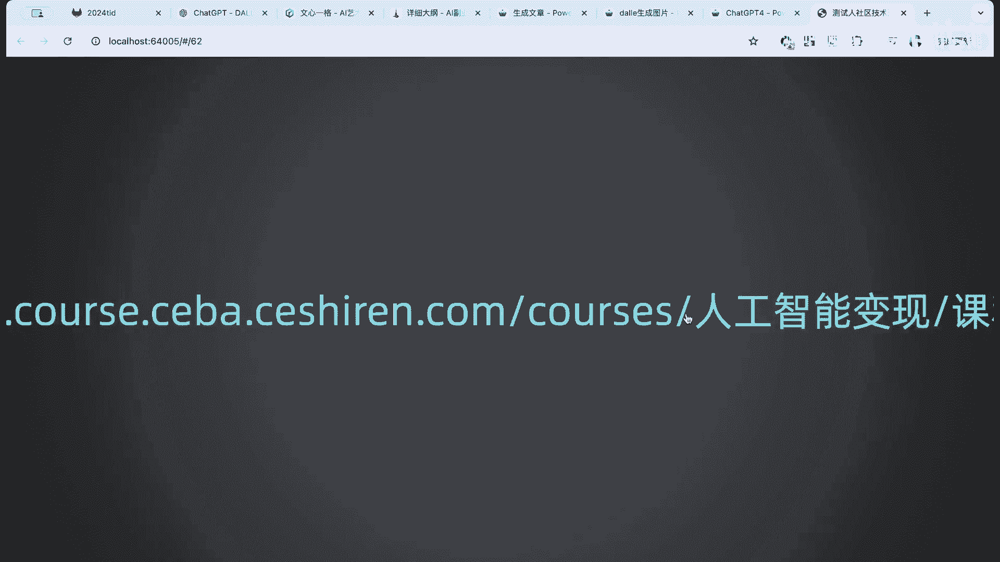

如果是说你比较感兴趣，然后也可以去直接在直播间下单购买也可以哈，因为我们今天是有一个直直播间的一个优惠，价格大概是3600的这样的一个价格啊，大家如果需要的话，也可以直接在直播间购买，购买之后呢。

你去联系我们的课程顾问，然后帮你开通课程选项就可以啊，我们是这周六就开始要开始开课，带着大家去做这个事情了，我们也会注册自己的新的账号，然后跟大家一起去从0~1去做副业，变现这个事情。

因为首先我们本身是做正业的对吧，我们一直在做技术号，然后这种那个运营类的账号的话，我们也跟也跟大家去，把我们做技术号的这种经验，沉淀到运营类的这种账号里，然后带着大家从0~1的。

去做一个这样的一个事情啊，我也我也想尝试一下，就是跟大家一起去尝试一下这样的一个变现，大概是什么样子，它到底能变现多少钱对吧啊，我们看到其实自媒体当然有很多人发，他的一个变现数据，你也不知道真假对吧。

什么事情只有我们自己去真的去做一下。

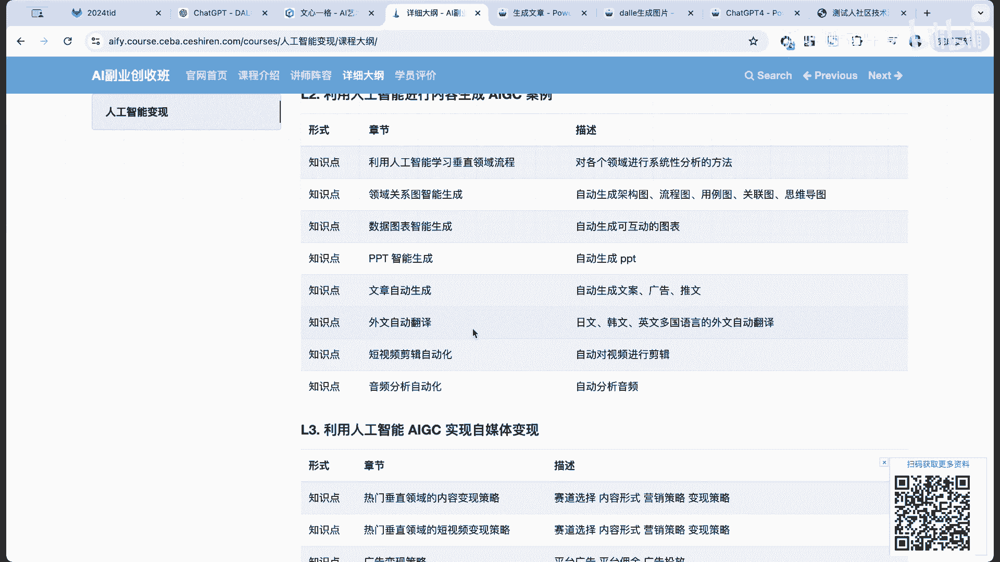

我们才能知道啊，好这个课程价格的话是嗯，今天直播间价格是3600啊，大家可以去，如果想去学习的话，大家可以去购买啊，直接购买也可以啊，然后你看我给我们给大家提供的这个差事，危机四的这种这些工具啊。

模型啊，以及视频剪辑的工具，新媒体自运营的这些工具，其实基于这些大模型的话，你本身你要去买这个东西，我还是蛮难的，像XTVT4，你个人的话可能没有没有一些渠道的话，你可能很难买得到这个东西啊。

我们都会提供给大家啊。

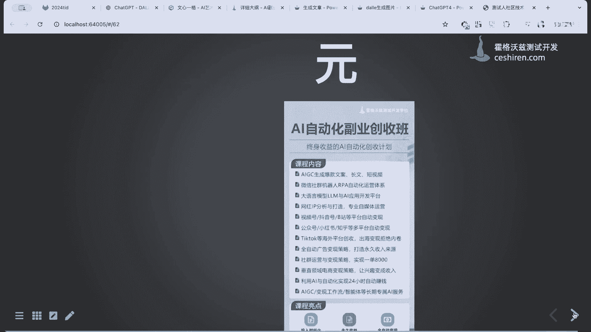

然后这个是我们的一个课程大纲，如果你想咨询一下去再去购买的话，你可以点击我们的这个，我给大家放一个那什么吧。

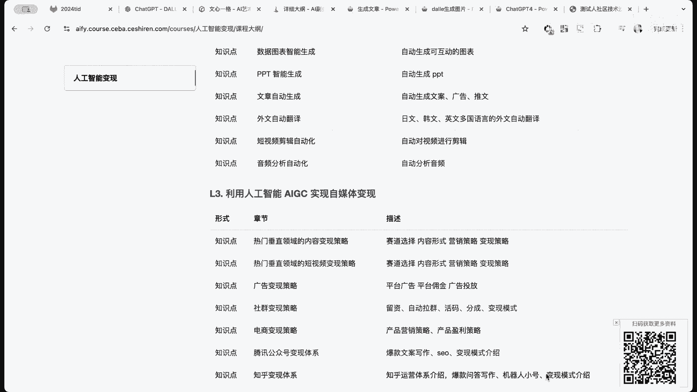

放一个二二维码，短暂的出现一下哈，大家可以扫码去，等会啊给大家放一个，我们那个助教把那个入群的这种方式，然后给大家发一下吧。

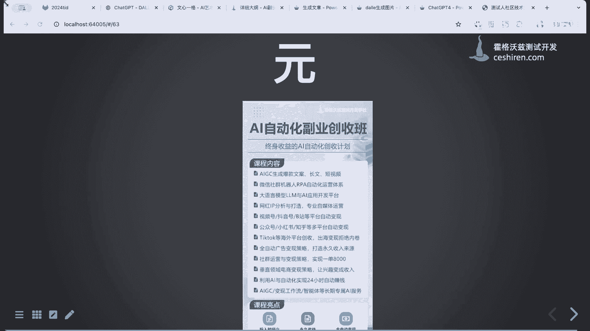

如果想入群去咨询的同学啊，你也可以直接去入群去咨询啊，我觉得还不能发，咳咳那这个课程大纲的话，我给大家简单看一下，然后我们第一个章节呢，会给大家介绍一些常用的这些嗯，那个GPT的一个模型。

然后我们比如说像那个四节跳动的抖音的啊，前段时间比较爆火的那个快手的，可怜大家用过吧，就是我会生成一些比较恶搞的图片，比如说孙悟空在吃鸡腿啊，或者怎么样的啊，快手其实是开发了一个自己的一个工具叫可怜。

然后也会去生成一些对应的一些那个嗯，比较有意思的图片，然后你放到图片里面还是比较吸引人的啊，我们也会给大家去介绍一些行业里比较用的，比较好的，做自媒体比较有用的一些模型好，再有就是呢。

我们会教大家怎么去做这种垂直领域的，这种那个呃嗯嗯，那个AIGC的这样的一些文章啊，或者是怎么样的对吧，你比如说你的文章的自动生成啊，然后有同学说老师你让我去写技术文章，我也写不出来。

那你可以去做一些外文的自动翻译对吧，你比如说像app吗，或者是selenium，这些官方文档的一个中文的翻译啊等等，你也可以去做这样的事情，我可以在外文翻译这个事情上，我可以给大家提供一个就是呃赛道。

就是大家有没有发现，就是从自从就是国家开放，这个144小时的过境迁之后呢，国外有很多up主，然后过去在YOUTUBE上也好，或者在其他平台上去讨论，对于中国的一些事情的讨论啊，有几个up主做的比较好。

就是他就是搬YOUTUBE上或者是搬那个TIKTOK上，大家关于中国的这种评论，或者是比较有意思的一些外文评论，我翻译成中文，然后做成图片，或者是做成视频，然后发到这种自媒体渠道上。

它的流量还是很可观的啊，再有就是你比如说你想做短视频，那我们也会教教大家怎么去做短视频的，这种剪辑，自动自动化去做剪辑啊，那第三部分呢会教大家去做这个，AIGC的这个自媒体的变现啊。

比如说热门这个垂直领域的内容，变现的一些策略大概是什么样子呀，刚刚有人看到说小问我就是小红书能投流吗，小红书是可以投流的啊，但是呢这个头留的这个东西呢，它是仅限于企业账号啊，个人账号也可以去做一些投留。

它的一个投流方式的话，就是相对来说会比较嗯，那个呃没有企业号的那个量大啊，你也可以去做一些投流啊，花个几十块钱去做一些投流，帮你涨涨粉对吧，也是可以的啊，然后我们会给大家去讲怎么去，如果你要投流。

我也会给大家去讲怎么去做投流，然后再有就是你的平台广告一些变现啊对吧，怎么薅平台的平台那个流量去做一些广告变现，然后再有就是社群变现，就刚刚说的给大家说的这个导流，导流到你的私语里面去。

然后那个嗯企业账号注册公司还是个人店铺，也可以，个人账号其实也可以做，那个什么也可以做投流啊，也可以做投流嗯，企业账号的话是投流的那个会可以做嗯，投流方式会多一点啊。

个人账号的话就是你可以做一些曝光类的战斗，投流啊，然后再有就是电商的一些变现策略，也会给大家去讲，然后再有智慧腾讯的公众号的变现体系是什么，怎么写报文，然后怎么这个爆款文案怎么去做他的SEO。

然后去薅这个平台的流量对吧，然后知乎的一个变现体系是什么，知乎其实也是一个比较好的变现体系，尤其是对于想做私域流量和，就是技术类的人来说啊，比如说我们在知乎上呢。

我们一年可能从知乎这个渠道来的一个那个呃，从从知乎这个渠道来到一个呃流量的话，我们大概可以变现到100万左右啊，所以知乎也是一个比较好的一个变现体系啊，小红书的话。

我们现在因为我们做了差不多不到半年的时间，我们现在是变现了20万吧啊20多万啊，然后刚刚大家提到的这个图文发布的，一些自动化呀，app端怎么去做自动化发布，然后这个网页的网页端怎么去做自动化分布。

就是自动化的一个发布对吧，也会给大家去讲，然后同时也会提供工具给大家啊，还有刚刚同学问到的24小时的吗，怎么去做对吧，你可以部署一个云服务器，然后让他24小时去跑都是可以的啊。

但是嗯我推荐大家在起号的阶段哈，在起号的阶段，还是要嗯人工的去做一些那个发送啊，就是因为你拆CPT也好，或者其他工具也好，生产的文章，我们人工还是要再去编辑一下再发嘛对吧，尤其是起号阶段啊。

你过了几号阶段之后，你可以去做自动化的东西啊，因为几号见到，其实我们就是本身我们自己没流量，那我们就要拿平台的流量嘛对吧，你如果是说你生成的这种东西，它的一个那个内容上就是嗯味儿比较浓的话。

其实你很难薅到平台的流量，所以起号阶段，我还是推荐大家去借助它生成文章，然后自己去做一些手工的编辑去发过去，然后过了几号阶段之后，我们就把它完全交给这个自动化的东西，去接管啊，小红书日更嘛。

嗯我们其实现在也没有做到日更，我们可能一周更个两到三次吧，但是因为我们在这个小这个平台，让我做的主要是技术类，技术类的嘛，其实相对来说嗯小某书这个平台做技术类的话，他没有做这种那个没有做那个嗯。

就像我刚刚说的，像母婴啊或者美妆啊什么，这个赛道会更好做一点啊，基础类的，在小母书这个平台上，我们算是变现比较少的，将来如果你们把号做大了，你们已经变现会比我们多的啊，课程大纲上面的二维码呗，好。

其实我觉得想做的哈就是百闻不如一试嘛，就你听很多人你也很心动，有的时候你看到这个嗯别人变现了，或者是某些up主发自己变现了多少，你也很心动对吧，但是你自己也不知道你自己能变现多少，那你去试一下嘛。

因为本身这个试错成本也不高，对不对，对于我们程序员来说，这个试错成本还是不高的对吧，3+6的这样一个价格，你看这个工具你也可以用，然后也有人带你去做这个事情，对不对，还给你提供一些变现的这样的一个啊。

我们这个20万的变现的话，因为我们主要是做课程嘛，就我们去做测试，测试的这样测试开发的这样一个课程，所以我们做的只要只有一个，就是我们做那个私域旅游。

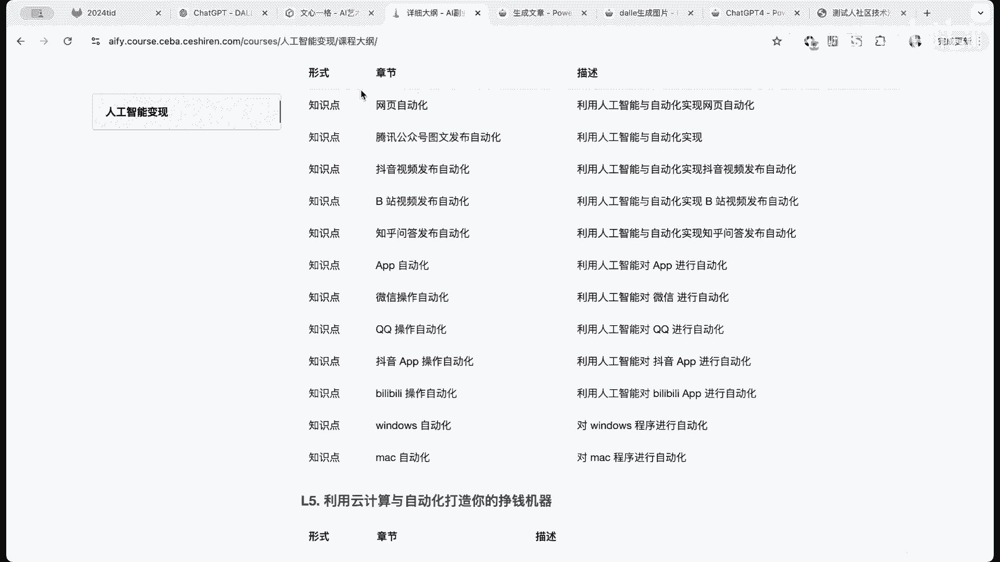

也就是我在这个变现方式里。

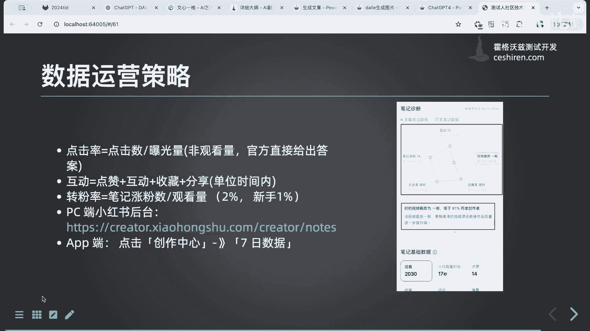

给大家提到的那个私域引流，我会引流到我的私欲，然后推荐我的课程让大家去购买啊，但是你们如果将来要做号，你们可以去带货，小红书的这样的一个小红书品啊，我觉得我今天晚上违规的太多了，你可以去做小母书。

这个平台上的，这些那个那个那个啥那个商商品啊，你不一定是说只带我们的产品，你可以也带其他类的产品啊，你们的变现变现的这种方式会比我们要多一点。

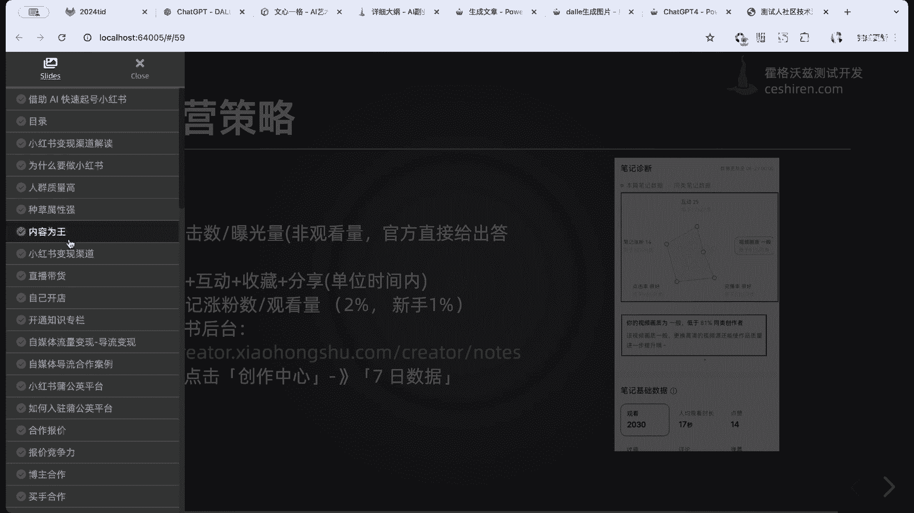

我们主要是做这个做自媒体流量变现，就是我会找到我的私域里，然后在私域里去收买我的课程啊，你们是可以直接在小某书上去写种草文，然后直接带货，也可以去做直播带货等等啊，对也可以带我们的这个课程呢。

我们课程变现比较快，因为我们课程那个会给的金额会比较多嘛，比如说你做一单，你可能就有这个嗯2000或者几千的价格，你带一个客单价高一点的话，你可能都会有就是几千块钱的收入。

但是这几千块钱如果你去做蒲公英平台，或者是你去做那个啊直播做那个嗯，小米说的这种商品带货的话，你可能时间要久一点才能得到这个啊，因为你本身是测试圈的嘛，你本身就有这个天然的这种流量在这里啊。

所以大家可以去用我们的号去做4S店，去做自己的4S店账号啊，去做自己的知乎账号啊，都是可以的啊，技术类的，如果你想做私域做技术类的变现，带货我们的课程，然后你可以去做这几个比较好的平台。

因为这个这几个平台我们也在做，然后大概是什么样子，收益是什么样子，跟大家也都说的是实实在在说的，都是真实的数据啊，你比如说像我刚给大家说，我们知乎平台我们可能一年变现了100万。

确确实实就是这个渠道来的人，可能购买课程的就加起来就100万啊，好然后我看一下大家我看一下啊，稍等一下，给大家共享一个这。

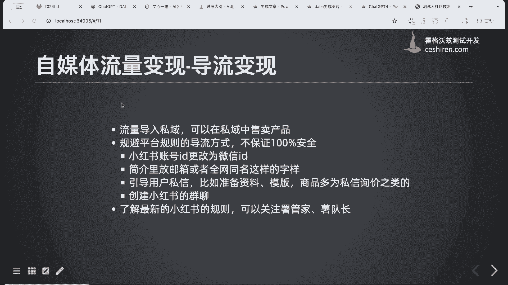

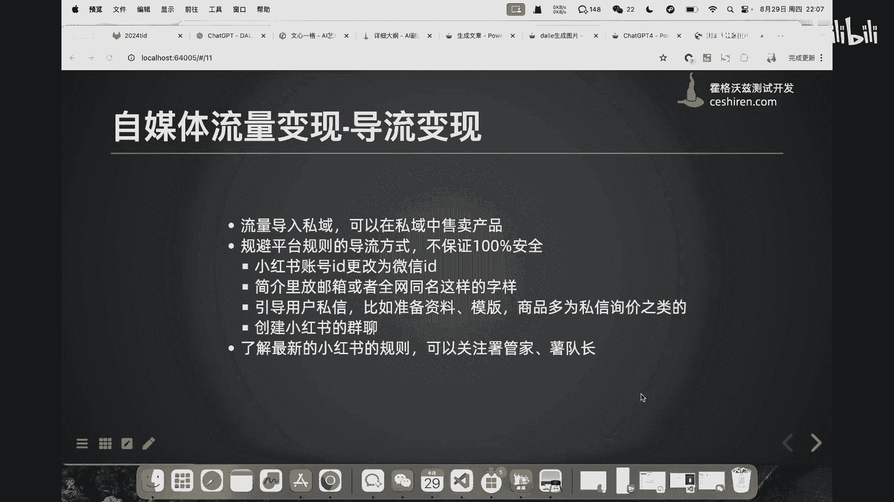

稍等一下，我给大家共享一个那个啥吧，然后刚刚没有没有那个入到那个什么的哈。

大家可以去按照这个进一下这个那个啥啊，简单给大家展示一下啊，我就不口述了，然后大家按照这个去可以记一下啊，结业后这些工具可以永久使用，这些结业后这些工具我们也会提供使用，但是肯定不能永久免费。

其实我刚刚也跟大家说了嘛，对吧，你做大理的这种模型的话，你可能一张图生成，你可能就0。28美元，那永久使用这个成本太高了啊，就你的学费可能都没有办法去支撑这个事情啊，这个不是哈。

这个是对于想要了解课程的同学啊，你可以照着操作一下啊，你也可以点击预约，然后去听，去了解一下这个课程，这个课程我们周六就要开课了，后续的这个收费的话，然后一定会给大家是可以接受的一个价格。

不会让你亏本啊，因为这个后续后续的这种收费策略的话，我们自己现在也还没有定下来啊，但是最起码你在学习期间，这几个月你都是可以免费用的啊，可以可以就是你有了自己的私域流量之后呢，我们其实是不限制你去带。

就是带什么样的货的啊，就你有了私域流量，你想带什么样的货都可以，这就是我为什么说，就是你们变现的方式比我们多嘛对吧，因为我们是只做我们自己一家的产品啊，比如说我今天晚上如果要卖个零食。

可能今天晚上买的人也很多对吧，你们可以做，但是我们可能做不了这个事情啊，可以挂很多很多产品，你想挂什么样的产品都可以，但是像嗯某书这些平台或者视频号的平台的话，它嗯一般会就是那个像某书平台的话。

它会限制这个呃虚拟产品，虚拟产品你可能是挂不了啊，但是我后面会在课程里面教大家，怎么有符合平台规则的情况下，然后你可以挂虚拟产品啊，我会我会给大家讲，但是这种事情不方便公开课上讲。

就大家可以选择你自己想做的一个赛道，其实我我整体感觉就是我说的这个平台的话，它对于一个新手来说还是比较友好的啊，因为对于尤其是不露脸的人，不想露脸的人来说啊，相对来说是比较友好一点。

因为他通过笔记就可以直接去做带货嘛，后面直播课讲，因为这个事情不方便公开讲，熊猫兔，我讲了我会被封的啊，就是有很多私密的话题，其实你看今天晚上我跟大家简单介绍一下，有些深入的东西，我不敢给大家讲。

因为他真的是不太方便公开去讲啊。

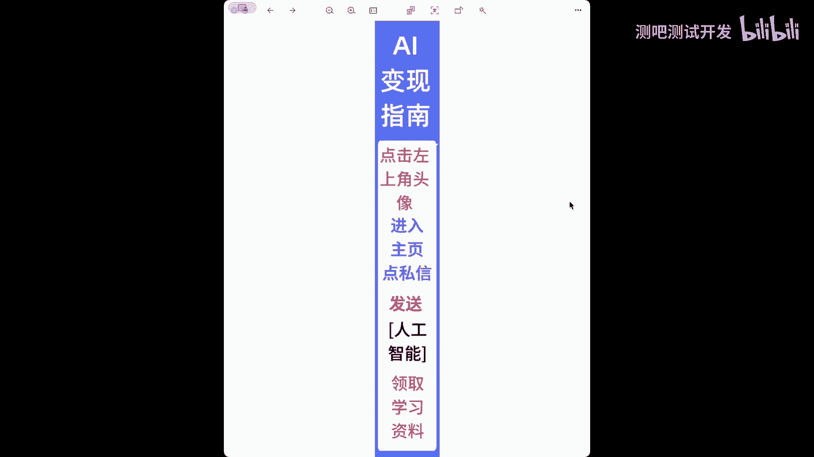

对大家对于想一起做副业，或者说想尝试一下做副业的同学来说哈，可以加入我们，用我们一起来搞钱搞搞试试啊，因为他试错成本确实不高啊，我们这个直播间的价格是3600元。

这个是直播间直播间的一个特有的一个优惠啊，我也想带着大家一起去做副业变现，其实我觉得大家现在上班可能也是想说，都不稳定嘛对吧，也是想说将来是说哎我有一个自己的事情做，哪怕说将来我被裁员了。

或者我不上班了，然后我也有一个收入在这啊，你都会想尝试一下，其实刚刚有个同学也说的也说的也是对的，就是说现在很多自媒体也好，很多人都在做对吧，那我们为什么能做好，就是你要有一些自己的运营策略啊。

要有一些你要懂平台，懂平台的机制，然后你要能看得懂平台的数据，知道怎么调整，调整的方向是什么啊，你才能做好，你你去看一下，就是比小某书的平台也好，就各种平台，你你自己身边可能有很多人都在做这个事情。

但是很多人就是啊我今天有一搭没一搭的发，发完之后，我也看不懂这个平台的一个数据是什么样子，怎么调整，我也不知道啊，都只是每天在按部就班的发，但是流量一直上不去对吧，那其实就是你的内容有问题。

或者是你的策略有问题吗，那你自己去研究这么多平台的话，你把这些平台研究透了，你可能都得花个一两年的时间，所以说就是我自己其实每年会花很多钱，去买支付费的东西，因为我觉得是这个这个方式。

是帮助我最快少走弯路的一个一个东西啊，我会跟行业里很多专家去聊这个事情，然后也会买一些知识付费的课程去学，然后嗯你确实能帮助你更快速的去提升，你比你自己摸索要快很多啊。

尤其是你比如说有的同学可能到现在刷CPT4，怎么用，可能都还不知道啊，那我们在这其实也是会给大家提供，就是对应的工具嘛，那你就省事嘛对吧，你只需要跟着照做就可以了啊，回本我肯定是回本了啊，因为你做好了。

你掌心呀或者怎么样嘛对吧，你都能回本，因为我不敢做副业的，我的老板天天盯着他，我咋敢做副业对吧，这次如果不是带着你们一起做副业的话，我是不敢做这个事情的啊，所以说就是想做的同学啊。

你可以直接购买这个课程，然后我们一起去做这个事情啊，因为我们确实是在运营这一块上啊，会有很多的一些经验想要跟大家去分享，也想要帮助大家去做变现，因为我我知道这个方式方法我也知道怎么弄。

但是我不能变现对吧，我不能去做这个事情，但我可以教你们去做这个事情啊，我的课程直播的话，后面看三老师那边的安排，然后这周六的话开营应该是三老师给大家过，我会重点去给大家介绍渠道。

然后介绍怎么去做这些渠道内容啊之类的啊，授课方式是每周六的晚上，然后直播加录播的这种方式啊，我觉得其实这个课程可能最有价值的，除了教你渠道运营的这些测试策略，变现方式，再有就是呢它提供的这个工具。

那还有就是你大家在一起嘛，那涨粉也快嘛对吧，但涨粉的策略咱也不能在公开课里说啊，感兴趣的同学可以在直播间直接下单哈，因为你去找课程顾问咨询也好，也是这个价格啊，今天晚上都是这个价格。

3600的这样一个直播价格，有想搞副业的，然后可以来试试，说不定你哪一天可能把你的副业做成主业了，是吧，老师会针对每个人有不同的策略吗，我会帮你们看你们的账号，就是你们起号之后。

如果你们比如说流量一直上不去呀，然后我也会帮大家去做一些账号的诊断，然后看看有什么问题需要怎么调整啊，前期大家几号阶段都可以在群里交流的，比如说你做的是哪个赛道对吧，你做的是哪个赛道，有什么样的问题呀。

都你都可以在群里去去那个交流取证号，其实你发的内容都差不多嘛，你不可能是说既做美食又做美妆，各种各种那个什么一起做啊，你们其实不是做品牌的话，我觉得其实没有太大必要去做举证这个事情，你搞不过来。

内容一样的，内容一样的，你就是做分发嘛，多平台分发嘛，好我理解错了，我以为你是在就是一个平台上，做多个账号的样子啊，因为一个平台做多个账号，也是品牌在做矩阵的这个过程中，会用到的一种策略啊。

当然你可以去做分发的，比如说我去做了一些比较好的视频，那我可以在多个视频平台上去发对吧，我可以在视频号发，我可以在那个那个另外两个对吧，某站然后某音的都可以发啊，好看看大家还有没有什么问题。

然后对这个课程感兴趣的同学哈，大家及时购买就可以哈，前期需要准备什么硬件吗，嗯准备好你的电脑就可以啊，如果你要做视频，然后你用自己的手机拍也可以啊，我其实今天本来想跟大家去，直接带大家去做一下。

给大家看一下大理的那个哈，但是因为时间问题比较比较紧张，时间内准备的内容有点多了，然后时间有点紧张，就只能粗略的给大家去介绍和演示一下，等你们政客的时候，我会详细给大家介绍啊。

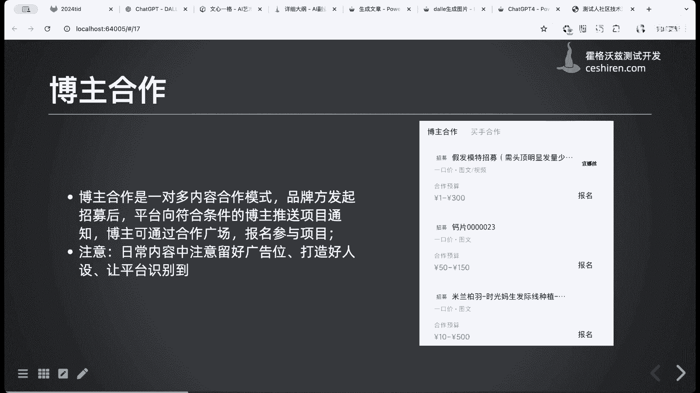

它其实就是要搭理它，是DLL有个横杠E嘛，发布什么。

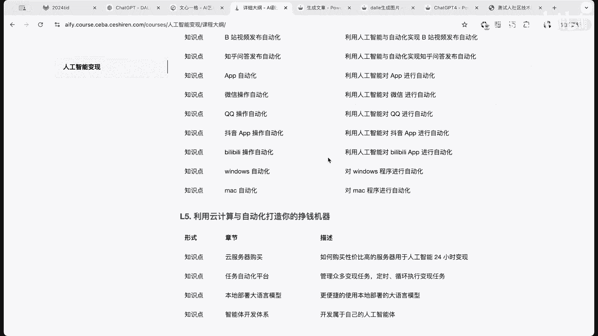

你刚刚说发布什么，就是自动化发布吗，我刚给大家录视频演示了一下。

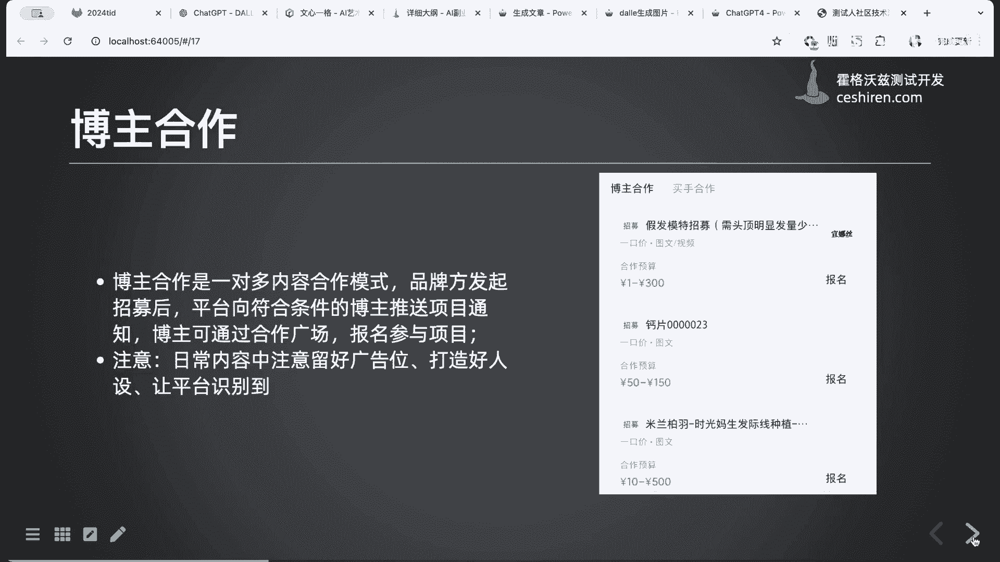

我再给大家看一下那个视频。

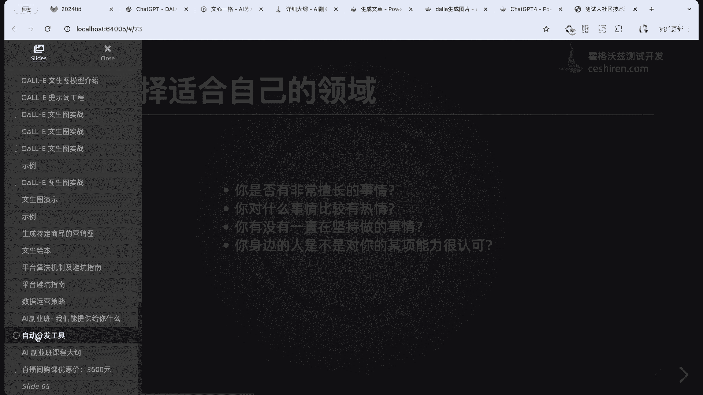

这个自动化分发工具，这个是我今天搞的一个，这个到后面会开放给大家使用的啊，演示一下，演示一下这个环境。

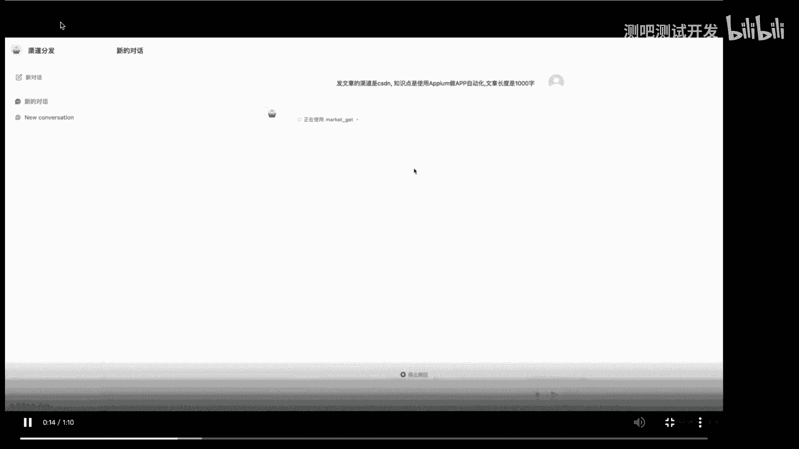

这个应该让他删掉了。

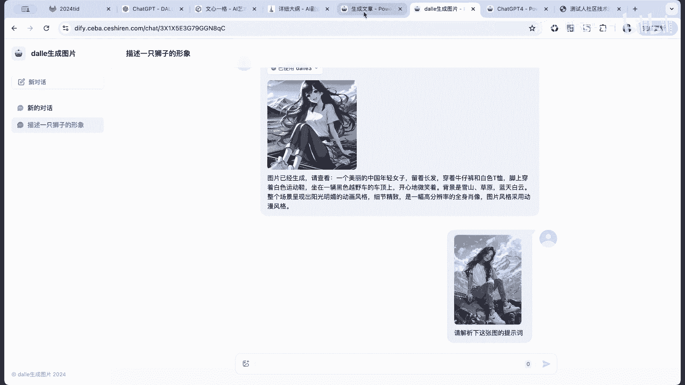

我后面去给大家去，下一次就去给大家做个演示吧。

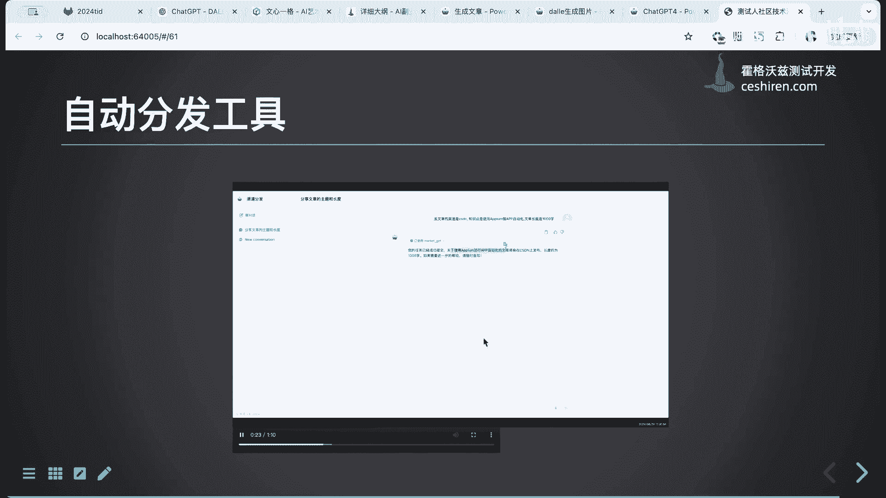

就就基本上就是这样一个东西，因为我今天做那个小红书的账号，那个纹身图的，那个时候，让那个开发把后面的模板给我给我弄掉了，要定时任务自动对，你可以把这个工具集成到你的JENKINS上。

然后去做一些定时的发布都是可以的啊，你让JS定时去执行这个这个这个脚本就可以吗，这个难不倒咱们程序员的，看看大家还有没有什么问题，然后关于这个班级，关于这个副业班啊，关于今天晚上讲的内容。

然后对于这个课程还在犹豫的同学啊，你也可以去跟我们的课程顾问去做一些咨询啊，去了解一些更细节的东西啊。

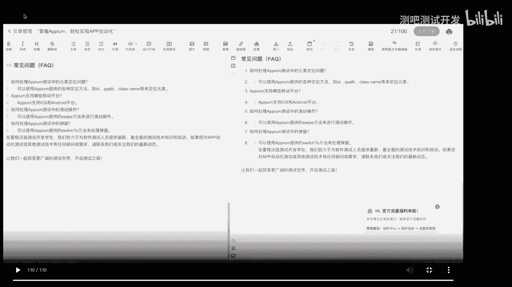

那如果大家都没有什么问题的话，我们今天的这个课就讲到这儿啊，哎还有人问是吧，老师每天要花多久时间做这个呀，嗯我觉得看你发布的一个内容是什么样子，比如说像我我可能发图文的话。

我基本上可能嗯半个小时我就够了啊，我一天一日更的话，我们下面穿这个地方，我写写完之后我会再去做一些更改啊，你发图文的话会时间要短一点，如果你要发视频的话，你可能时间稍微长一点啊。

我觉得怎么着一个小时也够了啊，就是建议前期大家去做这个号的时候嗯，不要花太多的时间，因为你花太久时间的话，我怕你们坚持不下来啊，就你也可以，如果保持不了日更，你就一周更个三次或者怎么样就可以啊。

数字人很贵的，那个你可以到时候等你的粉丝涨到1000以上，你可以去做直播带货了，然后你可以去考虑一下，但是那个很贵，就这个工具很贵，也有一些开源的，那个开源的效果没有特别好，我觉得这个渠道其实很适合。

比如说像宝妈呀什么的，你们有很多能分享的东西啊，我要生个孩子，我现在就做一个宝妈的渠道，宝妈的号做一个母婴的号，生的反而没时间带娃，嗯我之前关注一个up主，他其实是他都不只是周更。

他可能是就是两周可能才更一次，有推广他就更没推广，他就不更，但他现在粉丝也得上百万了，其实我觉得这个嗯跟多少，就是数量是是一个方面，但是质量更重要一点，哪怕你是一周更一次或者两周更一次。

但是你更的这个质量比较好也是可以的，就只要你的粉丝习惯，你更新的这样的一个进度嘛，就可以，那比如说像何同学，他半年可能才更一次，一年甚至可能就更个两次这样子，但他每次更你看多少人看对吧。

因为他那个视频就是质量比较高嘛，他没有办法做这种快速的生产，你前期如果投入不了太长时间的话，你就少投入点都是可以的啊，哦如果大家没有什么问题，那我们今天直播就到这了，然后已经买了课的同学。

我然后我们周六见啦，然后今天晚上就是重点跟大家粗略分享一下，这个平台的一些运营规则啊，后续会给大家介绍其他平台的一些运营规则啊，海外的一些账号，其实建议大家去注册一下，做一下，因为现在海外平台的流量。

费用比国内的要高很多，好吧，后续会给大家去讲，海外平台账号的一些运营之类的啊，那我们今天直播就先到这儿好。

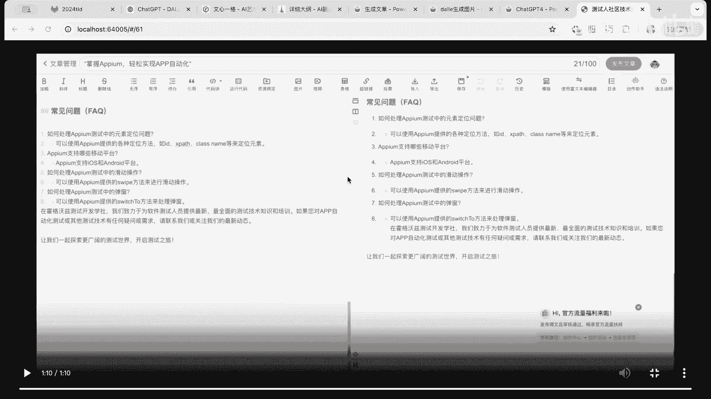