# 抖音4月最新暴力涨粉起号教程、每日连怼100条，轻松10万粉，无需剪辑，搬运简单。 - P1 - 沫尘创业网-冰淇淋 - BV1w1421d7YB

Hello，墨城社群的兄弟们，大家好，今天给大家更新一期，抖音暴力起号连队的一个教程，今天一天涨粉2。4万，纯手法搬运啊，我们看一下这个目标账号啊，就是每个视频连怼个一到200条，一天可以发75条。

两天大概可以涨三到4万的粉丝，运气好的话可以攒个10万粉啊，那我们废话不多说，直接开始实操，首先我们打开我们内部的一个小工具啊，呃我们把我们要搬运的视频把它添加进来，然后调整一下这些参数啊，这参数的话。

这上面四个必须选一个啊，下面你可以根据自己的需求去选啊，这里选好之后呢，我们这里也要把它选上啊，选好之后点击一键处理就可以了，然后调整好参数之后。

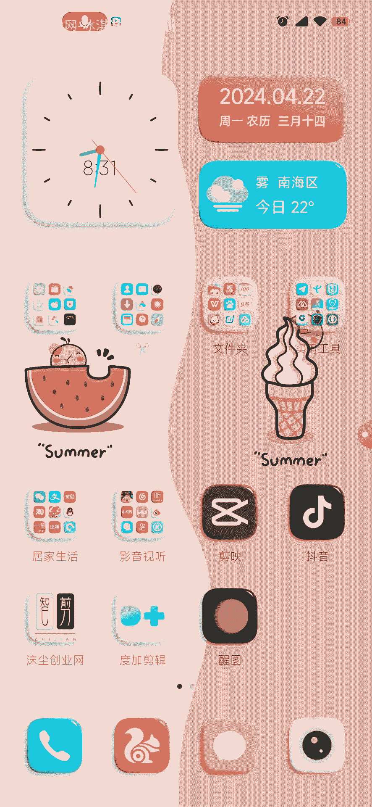

我们打开我们的检验啊，然后开始创作，这里我们选择这个素材库啊，这个素材库的素材的话，这个你们也可以自己去实拍一个啊，但是必须跟你要搬运的视频的时长，要是一样长的啊，然后我这里选择这个把它添加进来。

添加进来之后我们调整一下它的比例九比16。

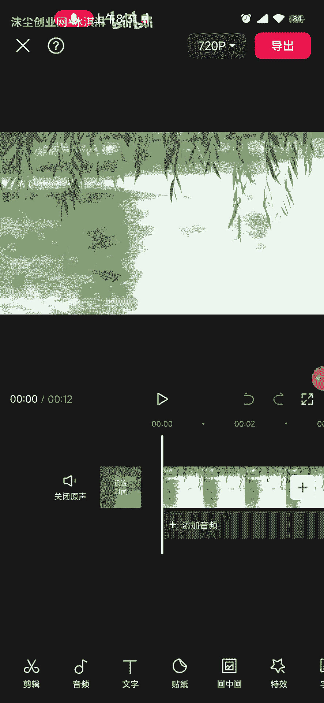

然后把它拉大嗯，就是能拉多大就拉多大啊，拉好之后确定，然后我们点这个画中画，新增新增画中画啊，这里我们选择我们要搬运的一个视频，把它添加进来啊，添加进来之后把它拉大拉大一点，好，拉大之后呢。

我们点这个复制，把它再复制一个，复制好之后把它拉下来，对齐啊，对齐之后我们点击第一个画中画，往后拉，这里有一个蒙版线性反转啊，然后我们再选第二个画中画蒙版，线性反转再反转，让我们调整一下它的这个参数啊。

这个参数的话，我们调这个Y轴调到四五就可以了啊，好调整之后，我们点一下它的特效哦，给它加一个特效。

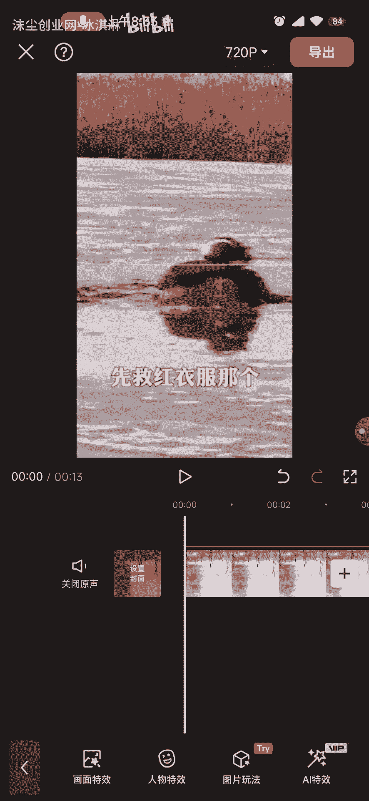

画面特效，好我们这里选择一个夏日泡泡啊。

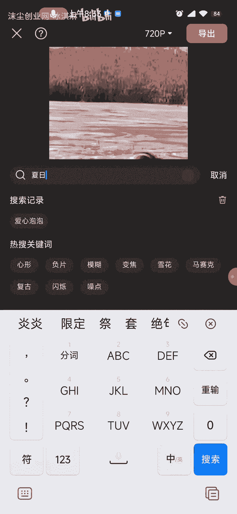

夏日泡泡收手好，他这个特效就出来了，我们点这个夏日泡泡给它运用上，好运算之后拿，他这个夏日泡泡就出来了啊，然后我们把它跟我们的这个搬运的视频，给他一起啊，好对齐，之后，作用对象啊，调一下作用对象全局好。

这样我们的特效就已经处理好了，好处理好之后呢。

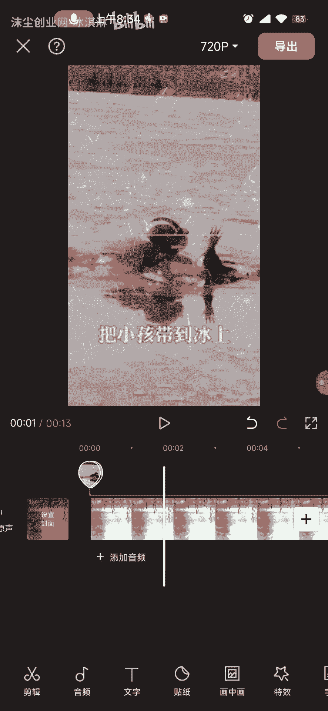

我们给它导出啊，在这里我们设置一下这个封面啊。

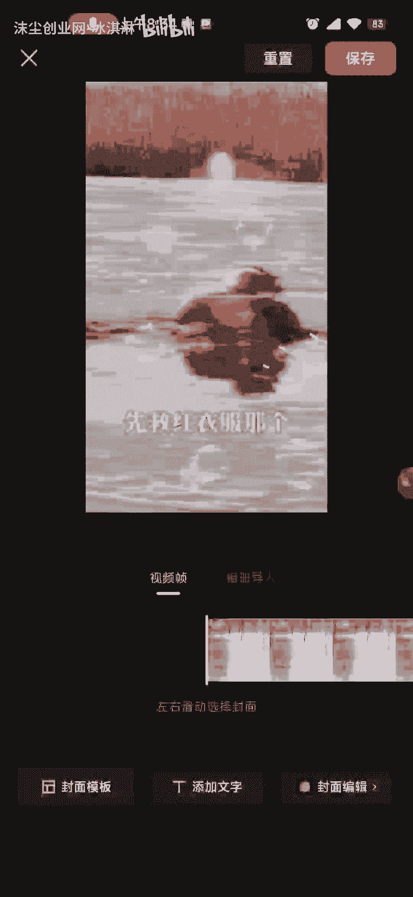

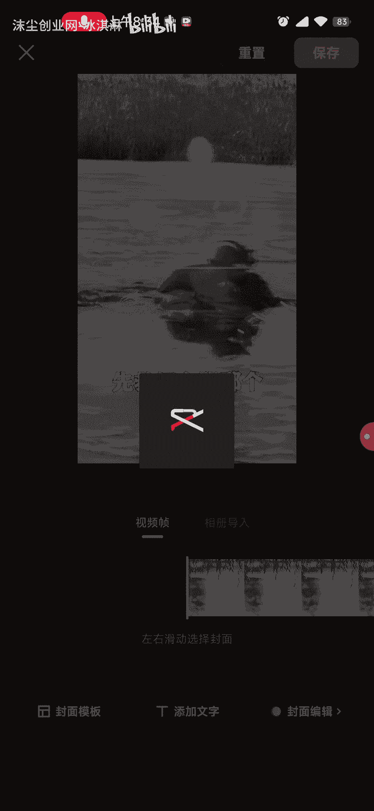

好我们这个封面给他保存一下啊。

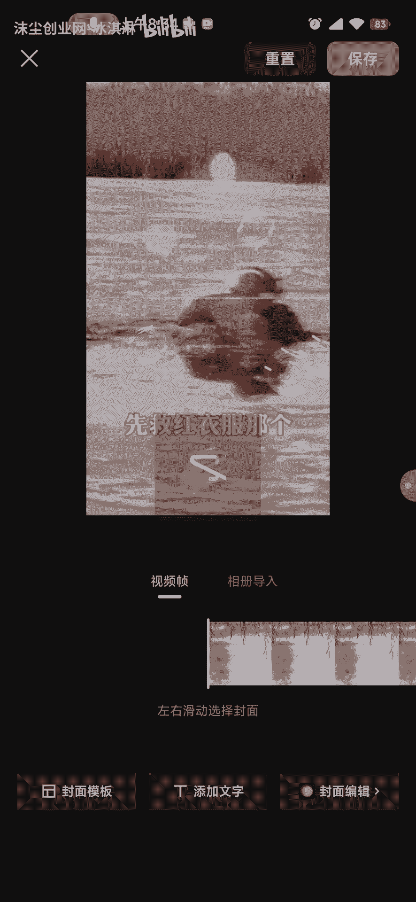

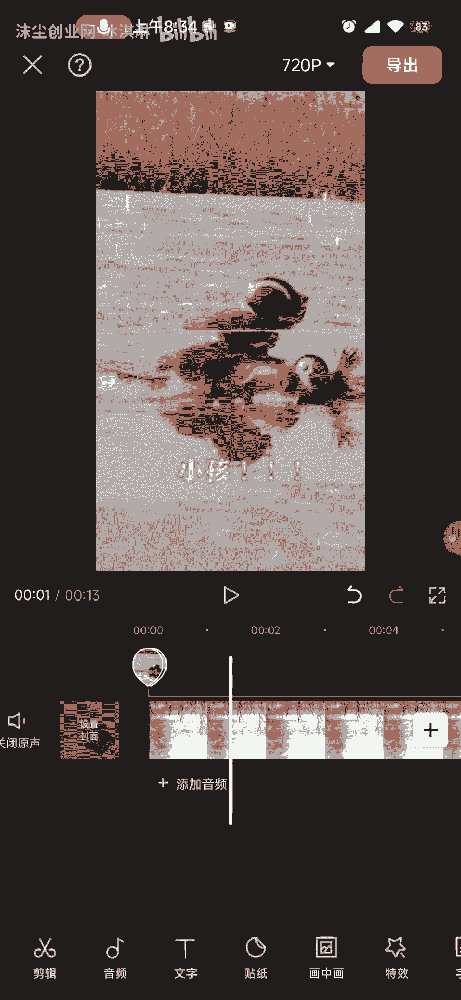

好保存好之后，我们给它导出，导出的时候，我们这个分辨率，分辨分辨率可以选720~1080啊，这个看你自己选啊。

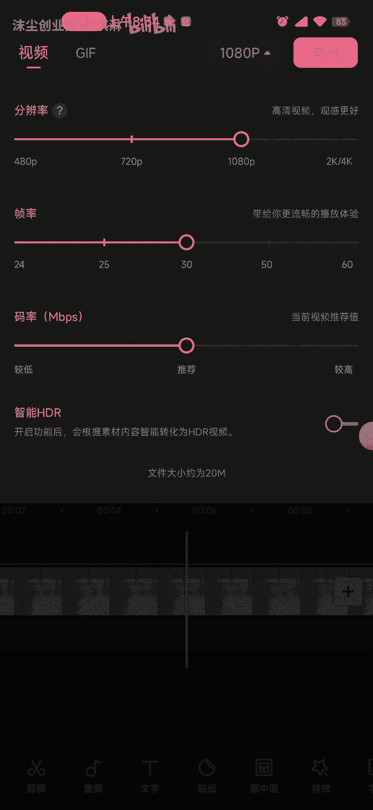

然后这个帧率的调到零，码率调到零好直接导出。

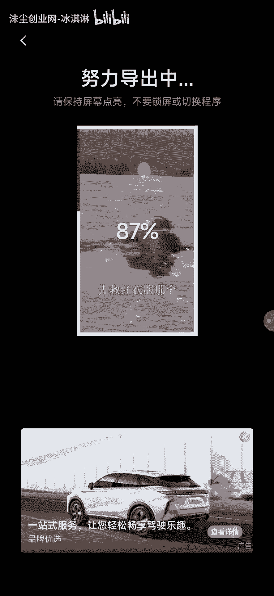

好导出之后呢，我们先不要去发布哦，我们再点击开始创作素材库。

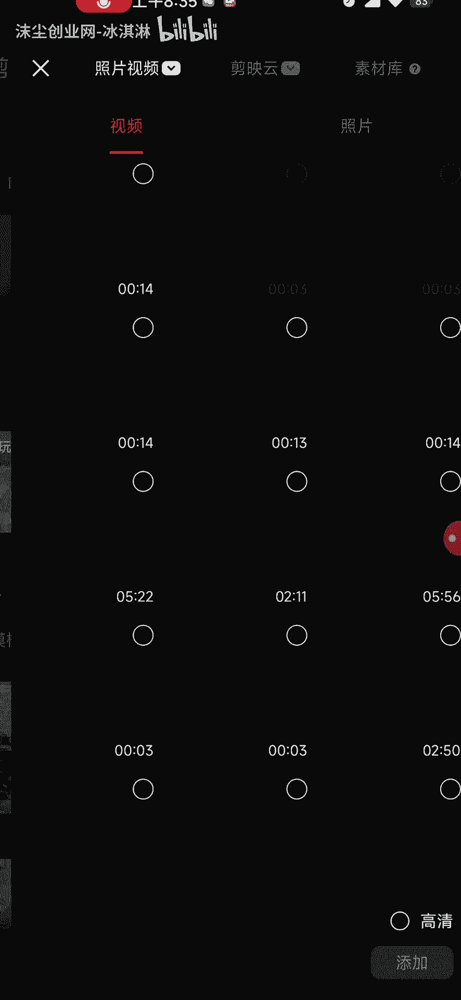

然后就是刚刚的操作，我们再重新来一遍啊，选择素材添加，调一下比例，九比16，把它拉大，好拉大之后选择画中画，新增画中画，然后把我们刚刚导出的那个视频，然后给它添加进来。

添加进来之后再复制一个来拉下来对齐，选择第一个画中画，选择蒙版线性反转，然后这个这个蒙版的话，我们调一下它的参数啊，调一下它的旋转啊，旋转的话，这个你们看着自己想怎么调就怎么调啊，像我的话。

我喜欢调到119，好确定，然后我们选择第二个画中画蒙版，线性反转，再反转调也调一下它的参数啊，这个参数要跟第一个对齐啊，我们第一个参数是多大，就是多大，然后我们把我们第一个画中画，第一个画中画。

把它拉大，第二个画中画也也把他拉大，这个的话你们可以先把它，蒙版啊，这里的话我刚刚忘记了，所以就呃在这里再重新调一下啊，这样的话我们的这个视频就已经做好了，然后嗯你们可以直接去发抖音啊。

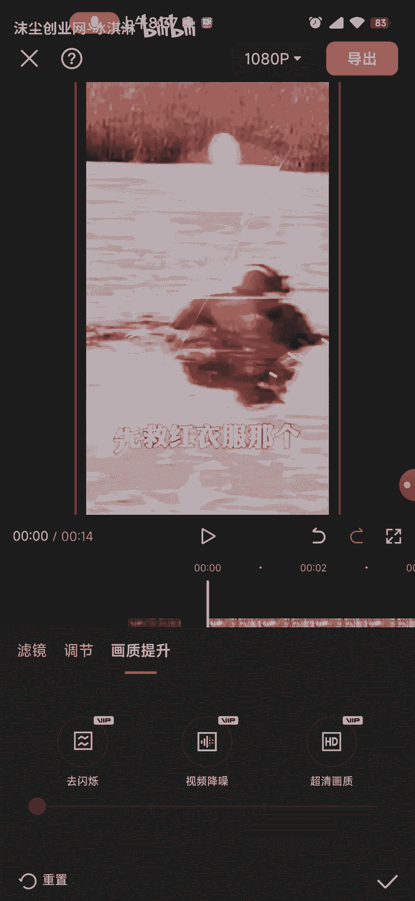

这个技术的话因为一天发的条数很多啊很多，然后呃如果你是新手小白的话，就很容易那个啥这个最好是工作室啊，或者老油条去用这个技术发啊，然后这里的话呃也是一样的哦，1080帧率把它调一下。

然后这里的话我们就可以直接导出去，发抖音了啊。

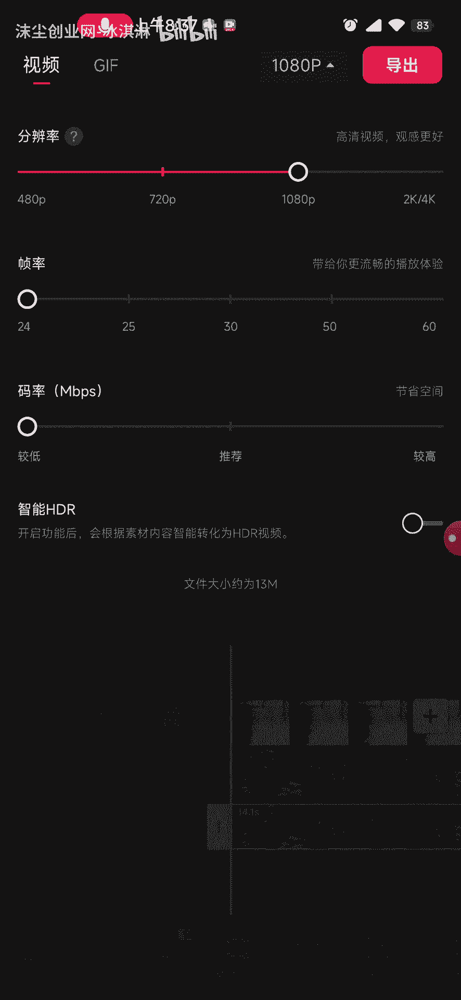