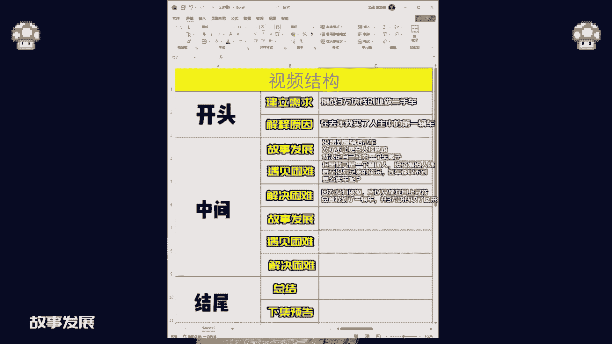

# 抖音万能起号五步法，找账号-定形式-抄选题-测爆款-复制爆款！3天养出高权重号！账号怎么做，一条视频教会你！收藏备用。 - P1 - 胡同种蘑菇 - BV12x4y1p7Qo

怎样做一个短视频账号，一期视频教会你，让我知道了，你有过想做短视频的打算，但是开始做的时候呢却不知道从何下手，没关系，这期就教你一个万能好用的起号方式，拆甜爬，听不懂没事，我们举例教学。

在开始特用哲的起号方式前，一定要想清楚一个问题，你想讲什么故事，可以树枝姐的工作经历，旅游经历，也可以记录自己做短视频的经历，有了故事就可以开始第一部了，拆解近亲火锅的视频，以这条上万赞的视频举例本。

看他是怎么开头，怎么发展，怎么结尾的，开头建立需求，我决定做自媒体了，这是我第一个VLOG，解释原因，我也想挖掘自身更多的可能性，成为更好的自己，中间故事发展，在两年前，我就想做自媒体，遇见困难。

但是因为心理防线没有突破，总以各种理由推脱解决困难，开始学习分析博主文案，拍摄手法，故事发展，在这个网络发达的时代，想通过自媒体多一份自己的收入，遇见困难，但是迟迟不敢拿起手机开始解决困难。

这世界上还有什么比穷更可怕的呢，结尾总结，与其自卑迷茫，不如落落大方的去做下集预告以后，我会在这里分享我的生活和故事，总结一下他的视频结构不是我见过最好的，但他视频的每一句话基本上都在诱导屏幕前。

想做短视频的你的情绪共鸣，知道了他的视频结构就可以进入第二步了，根据视频结构填写自己的行业，比如说我想做个二手车的账号，开头建立需求，我们可以写成挑战，3万块钱创业做二手车，故事发展可以改成。

在去年我买了人生中的第一辆车，没想到是辆泡水车，为了不让更多人被套路，我决定自己成为一个车贩组，遇见困难，但是我只是一个普通人，没资源，没人脉，甚至没有足够的资金，连车都收不到，怎么卖车了，解决困难。

因为没有资源，所以只能在网上寻找，总算找到一辆车，并3万块钱钱收了回来，故事发展这个地方我们可以衔接车辆的介绍。

比如是一个什么型号车子，后面再遇见困难，收车已经把3万块钱发完了，这车卖不出去就没欠收车了，解决困难，通过在二手网站上发起，找到一位买家，约好明天看车，结尾总结可以改成忙碌了一天，总算开张了，价集预告。

就等明天看车了，大家说我这台车能赚多少钱呢，写好了文案结构，接下来就是给整篇文案进行润色了，这一步的目的主要是让视频拍出来后，看起来更加的连贯且不违和，这一步很简单，相信大家都会，我就不过多解释了好了。

大家学会了吗，找视频结构是一个比较费时间精力的事情，如果你没有时间可以在评论区打球，带我这边有一份完整的学习资料，那下期再见。

