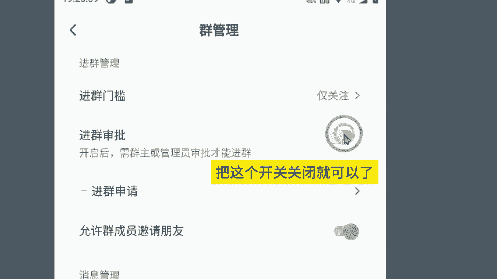

# 抖音不直播0粉创建可设置门槛的粉丝群 - P1 - 指尖轻创业 - BV14HxgefEGm

不直播领粉创建可以设置门槛的粉丝群。

点击消息。点左上角3杠。发起群聊。创建公开群聊。输入群聊名称。🎼这里面可以填写群简介。🎼勾选这个地方，在个人主页和直播间展示本群。🎼点击立即创建。🎼右上角三个点。🎼可以填写群公告。🎼点击群聊管理。

🎼设置进群门槛可以设置景观柱或者无要求，直接根据自己的需求去设置。🎼自动接收进群，把这个开关关闭就可以了。

