# 抖音二次原创黑线技术终级版 搭配工具和起号教程一天暴涨6万粉，效果真的太暴力，二次原创。百分百原创。 - P1 - 沫尘技术社群 - BV1TK421v7ie

陌尘的兄弟们大家好，给大家录一个黑线技术升级版嗯，首先打开我们这个削了工具，先去一下，从哈左右翻转，掐头去尾哈，然后才点击开始处理。

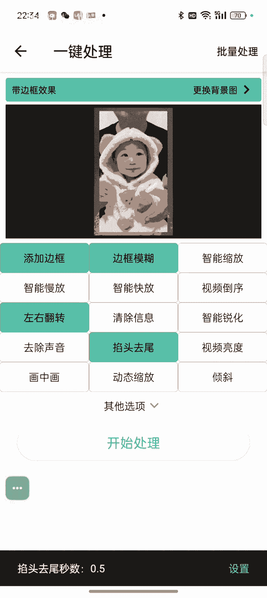

好处理完了。

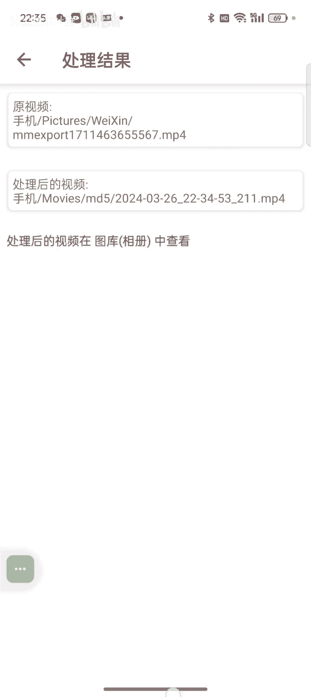

打开剪映，点击开始创作，这个时候我们可以拍一个素材，可以直接拍一个素材，也可以去我们的素材库里面去选一个素材，自己拍的会更好一些。

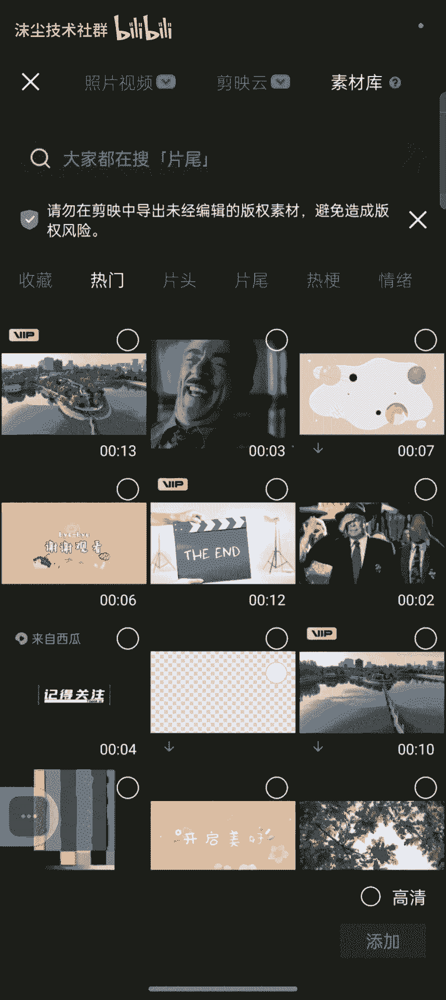

效果会更好啊。

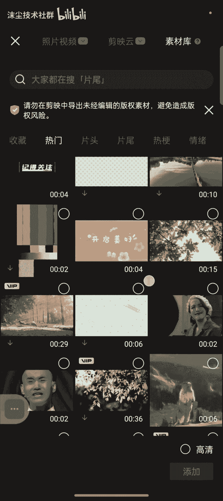

我们随便选一个不好，刚刚处理那个是十秒的。

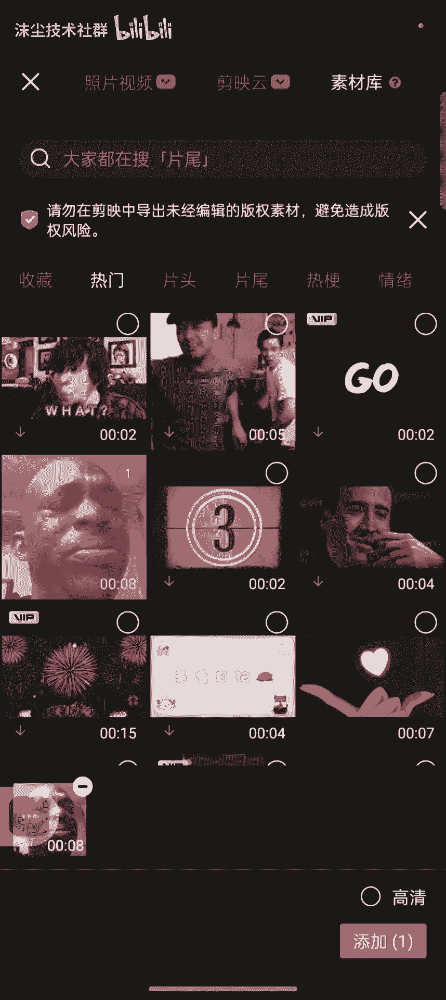

选个八秒才可以，然后比例比例给他调到九比16对，勾选中放大，把它铺满整个屏幕，然后我们再添加一个画中画，我们刚刚处理过的这个视频，就给它添加进来，给它放大好，然后选中它，我们再复制一个，复制一个下拉好。

我们都给他加上不同的滤镜哈，这个加一个滤镜，好我们就清晰嗯，调到50%这里吧，我们调到百分之百吧，百分之百的话，等一下看效果的时候会可以看的很明显，我们正常正常编辑的时候，我们调50%就可以了。

那样子的话会有驱虫效果，但是不影响观看哈，好我们选择第一个视频，第二个视频把声音给它关掉，把声音给它关掉，省得有重音哈啊啊啊，好，我们选择第一个视频，选择这个视频，然后蒙版线性and我们把在做旋转。

旋转到100多，我们做画质写解的，这样子就-59，-59，OK反转对勾，下面这一个也是一样，蒙版线性我们调整到一个旋转，这里桥神的-59的位置，-59，59号好-59，然后做个反转，好好这条线。

我们中间就有一条线处了，你看中间的话，这条线就出来了，这样子我们就做好了，然后在上面的话我们可以把这个给他变个速，变慢一点点，好给他拉满哈，可以变速拉满，变数拉满就可以了，然后我们再去加一个。

整体的我们再去加一个滤镜嗯，好久清晰调到50%左右哈，效果整个铺满，好然后再去做一个特效。

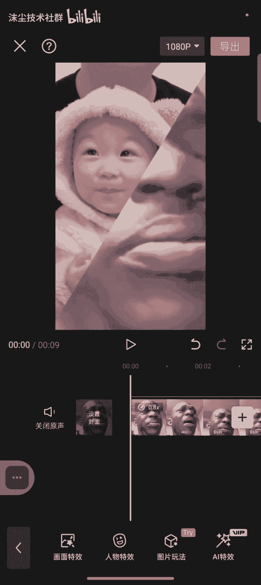

画面特效我们做一个爱心吧，在爱心的驱虫效果还是不错的。

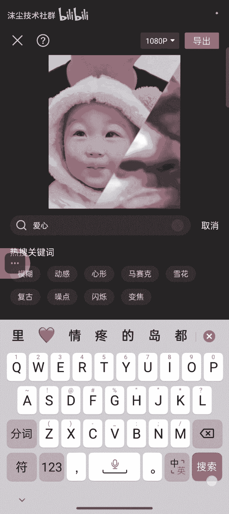

所以每次都选他一个像素爱心这么说，他好好穿丝调整一下，而速度调到5号五的效果是最好的，都跳到舞。

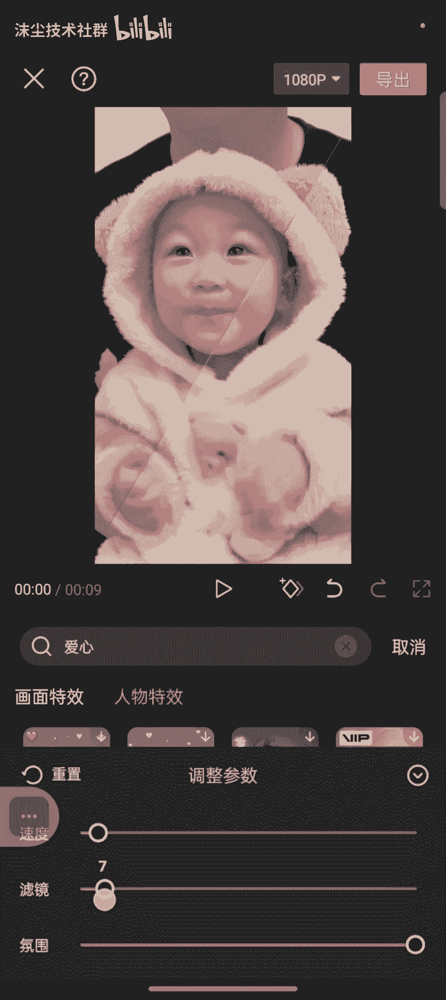

这么，对勾确定就可以了，然后我们把这个爱线索爱心也给他拉个麦。

好这就好，然后把那个封面设置一下，倒倒露个封面，哎是导入的封面，导入的封面，确定一下就OK，直接点击保存。

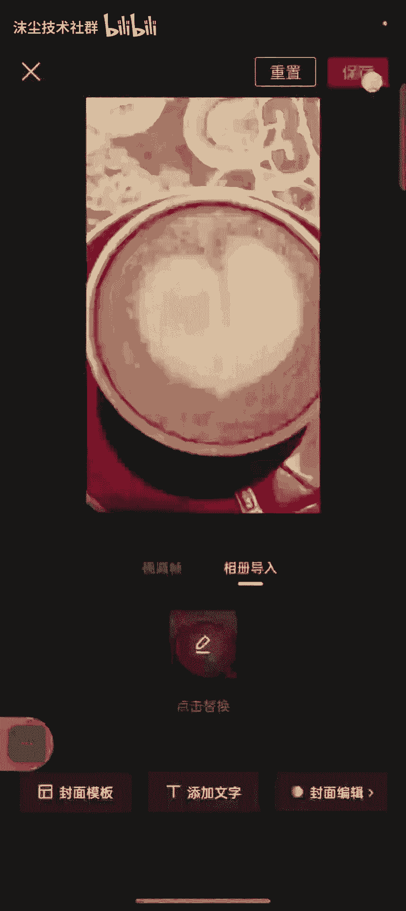

然后我们就可以去上船哈，正常这样子录的话。

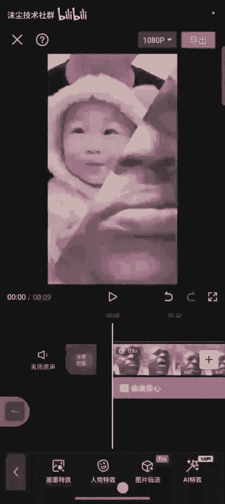

我们是百分之百可以过原创的，那我们去上船的时候，我们去卡一个模板，好完成。

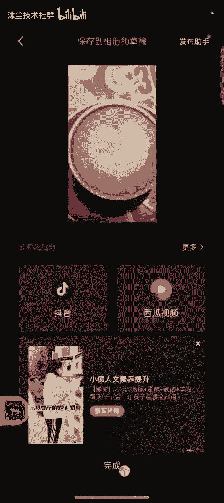

然后点击剪同款。

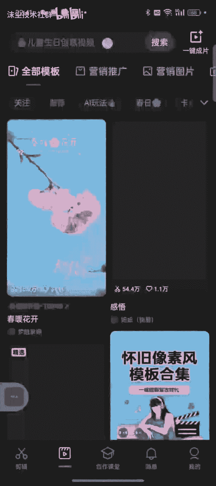

现在那个氛围，双重慢动作是目前是现在最火的一个模板号，氛围双重慢动作。

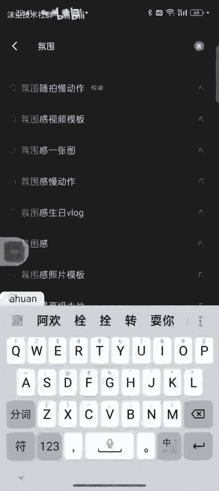

我们就选这个哎呀，68万赞就选这个吧，68万赞的这个西西点同款，然后我们可以随便卡一个好，点击下一步。

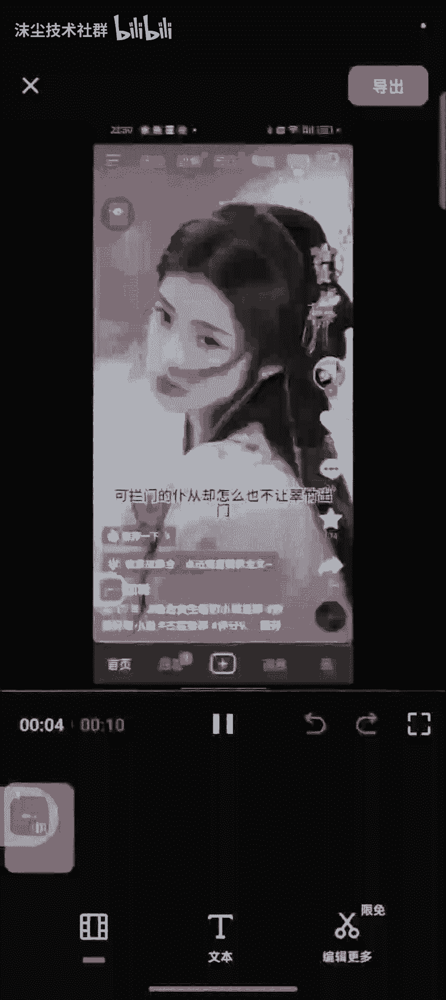

无水印保存并分享。

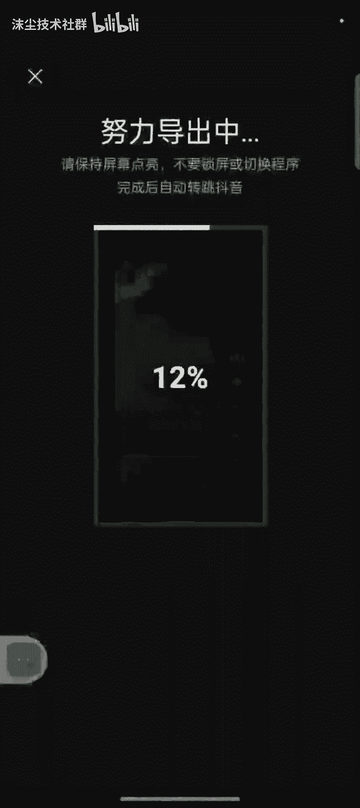

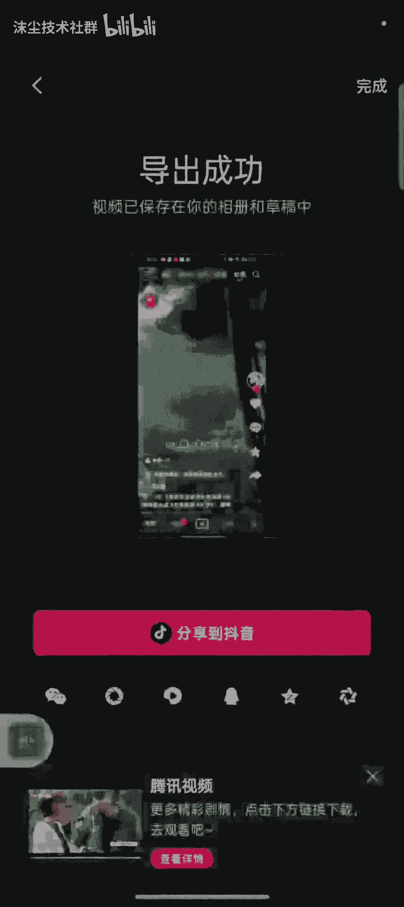

直接分享到抖音，然后我们点击这个剪切，把这个添加添加的刚刚我们处理好的这个视频。

点击确定，然后这个的话我们做个剪切，把它剪切到最短。

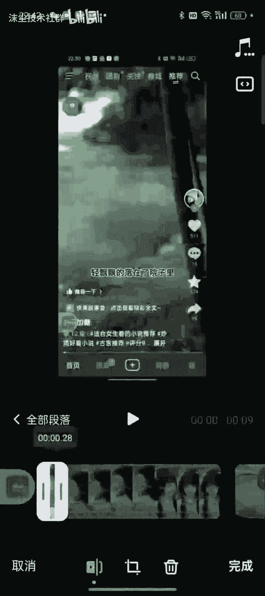

最短然后换个位置好，这个时候模板就卡上了哈。

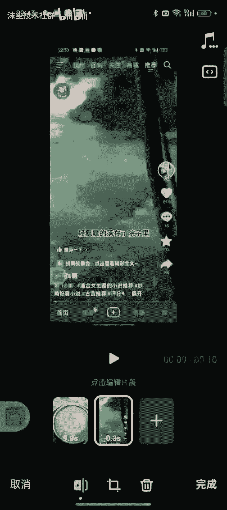

接着点击完成，然后点击下一步，直接添加话题发声就可以了，这个时候如果你要挂链接，就挂上链接，如果不挂链接，它就会嗯就会打上，我们卡了这个模板的这个标，点击发布就可以了。

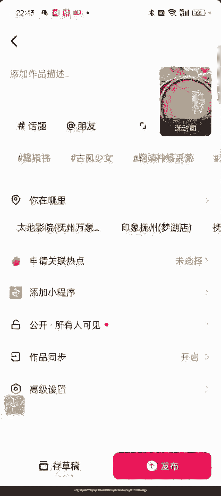