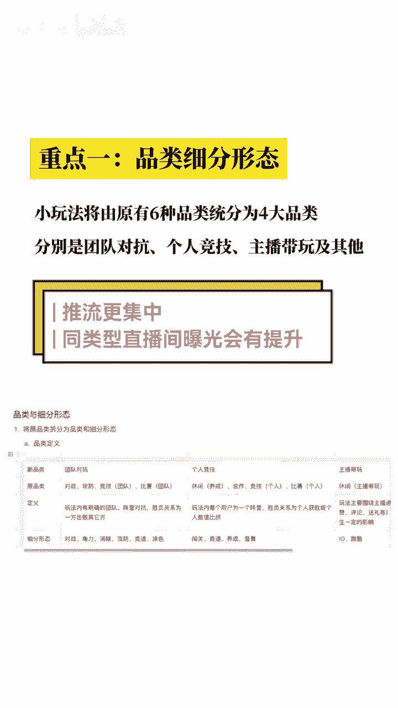
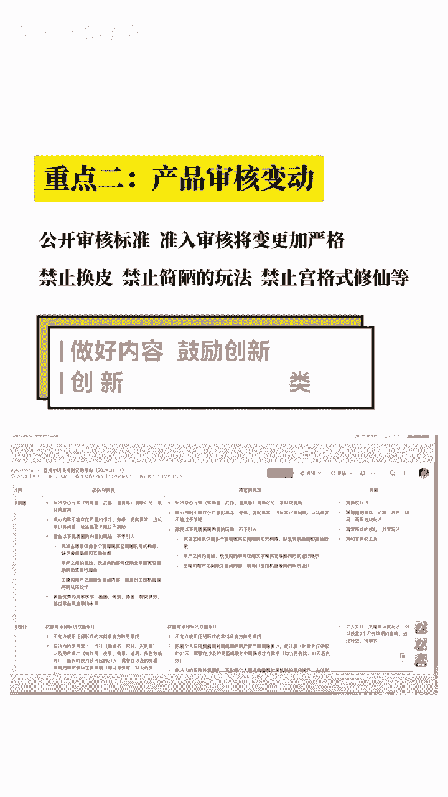
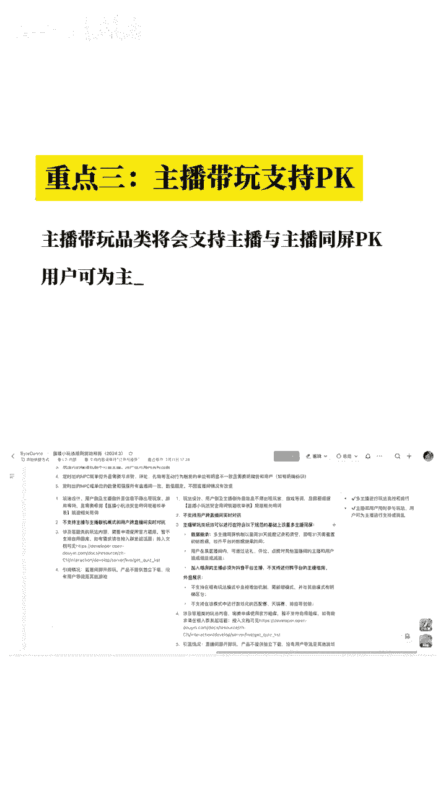

# 抖音弹幕游戏可以跨直播间PK了？太难啦，这将开启直播小玩法2.0时代呀！ - P1 - 指尖互游 - BV17b421h7fs

这次干货内容有点多，重点内容给大家已整理好，以免找不到，赶紧关注。

收藏重点一品类细分形态，小玩法将由于有六种品类，同分为四大品类，分别是团队对抗个人竞技，主播代玩及其他推流更集中，同类型直播间曝光会有提升。

重点二产品审核变动，公开审核标准，准入审核将变更加严格，禁止换皮，禁止简陋的玩法，禁止空格式修仙等，做好内容。

鼓励创新，创新类玩法会有扶持政策，重点三主播带玩支持pk，主播带文品类将会支持主播与主播同屏pk，用户可为主播进行支持或者捣乱pk形式。

新尝试对主播个人能力要求会更高，3月18日执行版本新规则。

