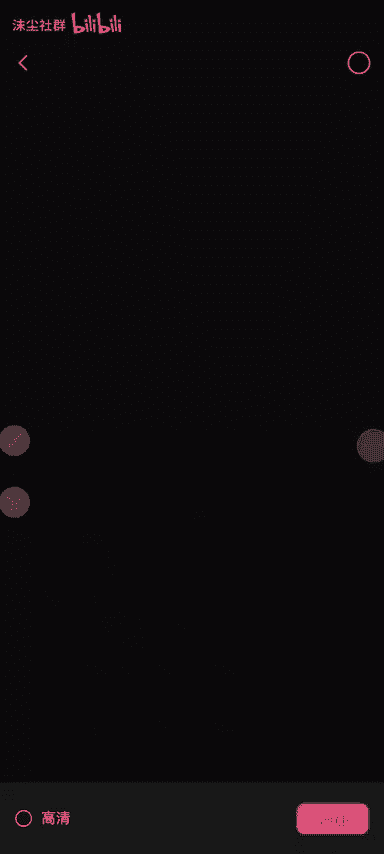
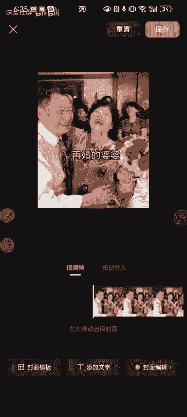
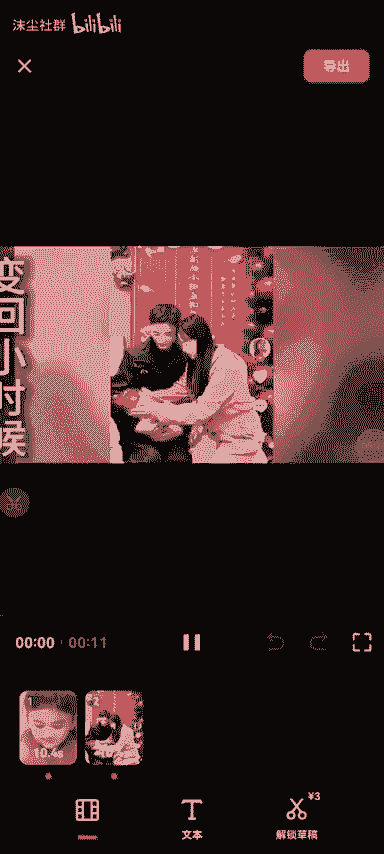
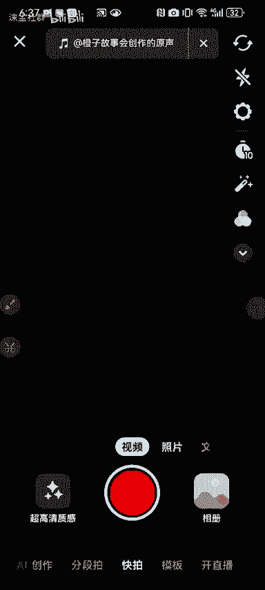
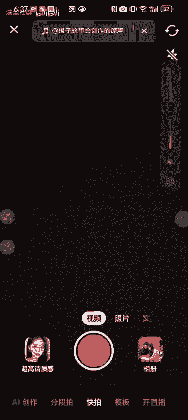
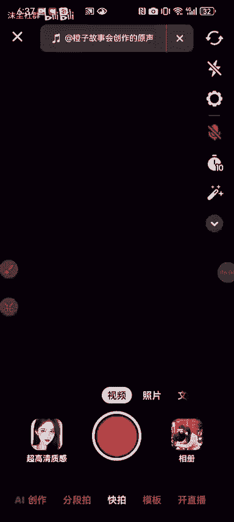

# 抖音故事会起号，纯原创，简单粗暴，无需任何剪辑，一个月68万粉 - P1 - 沫尘社群 - BV1Uz42187Ge

好墨城社群的兄弟们，大家下午好啊，今天给大家啊录制一个这个故事，会涨粉的一个教程啊，嗯这个方法的话啊涨粉很快，然后制作视频的话也比较简单啊，那么我们可以看一下这个对标账号啊，所有的视频都是几张图片啊。

53岁的婆婆再婚，儿媳随礼8万块钱，但是看到新郎以后看都是几张图片，然后加上这个背景音乐，主要的是背景音乐嗯，然后我们主要看的是这个号，这个号的话是使用的是那个，卡图文的一个技术啊。

靠图文的一个技术去去做的啊，比如说像这个作品，53岁的婆婆再婚，儿媳随礼8万块钱，这种作品啊，很简单，我们看这个号吧，哈因为这个是卡了65岁的公公，卡了模板的，知道吧，其实这种作品就是呃卡了。

从农村来找我借钱的一个图文啊，卡了三张图片的一个图文，我们拿这个这个号的这个第一个视频，去举个例吧，啊因为这个视频我测试了，你看就是一个音频啊，音频的话是这个啊，就是我们进去以后，你或者先给他收藏了啊。

先给他收藏，或者是我们先去百度去找那个图片啊，去搜索一下什么老年人结婚，结婚图片啊，老娘的结婚图片在这里去保存啊，保存个两到三张图片啊。

我这边已经保存了，我就不演示了啊，保存好以后到这个剪映里面去啊，打开剪映哼。

啊点开始剪辑，我们要把它转换成那个图文的形式，然后转换成视频的形式啊，你像我这里我保存了三张图片啊，比如说这一张选人进来好三秒是吧。

然后这里就是什么，嗯嗯我们看一下它是什么文案来着。

看一下对标是什么文案，再婚的婆婆对吧，就选一个再婚的婆婆，先把比例给他改一下啊，比例改成九比16，比例九比16啊，这个字可以拉大一点啊，然后文字拉下来一点，这样，好这个时候导出。

那选个封面吧，封面选择再导出，好导出。

好返回替换一下啊，替换一下，把那张图片替换进来，另外一张图片，我们卡的双图文啊，用这一张吧啊切换进来放大一点，这样好，差不多我封面选一下，导出，好这个时候还有一还有一个模板视频啊，剪同款。

因为他我们看对标用的对标账号用的，用的模板啊啊没卡，对标用的模板啊，这个啊这个用的模板是变回小时候的样子啊。

这个是需要需要解锁的啊，你就在这里搜这个变回小时候的样子啊，变回小时候的样子，你到这里发。

他是哪一个啊，400多万的一个使用量的，你可以不用跟他一样啊，你要跟他一样，你就去找那个400多万使用量的，你在哪里去了，那就随便来一个模板吧，啊只要能卡上模板就行了好吧，你只要能卡上模板。

你比如说啊用这个吧，6万，但是这个要解锁，随便选选个图片，下一步让它合成啊，好导出无水印。

导出，好这是返回啊。

直接可以退掉这个减一，我们看这个抖音啊，打开抖音，找到那个，对标账号啊，点击它这个下面这个碟片啊，选择拍同款下好，他这上面声音就已经过来了啊。

声音已经过来了啊，这个时候我们去卡个双头文，好选两张图片。

随便选两张啊，下一步往上滑，这里上滑，把我们刚才做好的这两个视频给他选进来啊，选进来，然后再把这个模板的这个视频选进来啊，这个模板好，卷进来以后把这两个图片擦掉，我们亲一下，儿媳瞬间坐不住了。

这到底是怎么回事呢，弟弟今好，这个时候已经做好了啊，做好了，然后呃这后面是一个模板视频，有没有看到啊，然后我们先点击下一步，就是选中这个模板视频，点下一步它出现剪同款了，对不对，返回。

然后把这个模板视频删掉啊，这时候我们听一下声音在不在，好声音是在的，然后我们点击下一步，哎不行，怎么我把视频没了，放到第一个吧，把这个模板视频放到第一个确定，然后点击下一步，好，有模板视频了以后返回。

删掉下一步，这个是安卓，我这个是安卓啊，安卓他有可能会掉这个模板啊，如果说你用苹果卡的，它就嗯就有了啊，或者是你可以这样这个模板视频是吧，进来我们点击下一步，然后裁剪一下啊，把这个模板视频裁一下。

给它裁到最后保存给他裁到一秒吧，因为现在只能一秒的，只能一秒的视频啊，0。0。01，好就这样听一下声音拼搏的人，所以两个人结婚之后都非常的努力，没过几年，他们就在好这个时候直接去发布就可以了啊。

这个是一个故事号起号的一个玩法啊，然后都会在我们这个社群的呃，这个创业网更新啊，啊我们公众号是墨城创业网，如果说你想学习更多的技术啊，可以在这个公众号去搜索一下，我们这个墨城创业网持续更新啊。

大量的这个啊涨粉啊，搬运的一些技术啊。

