# 抖音最新暴利起号玩法，矢量图视频起号，快速变现的玩法拆解。 - P1 - 可行思维 - BV1nm421x74J

最近啊有这么一种账号，起号率高达90%，视频的播放数据非常夸张，而且每个人都可以轻松制作，就是这种矢量图的风格视频我们直接看案例，爸爸的五次撑腰，换来孩子一生的抬头，第一次外人当面数落孩子时。

爸爸告诉对方，有时和我说。

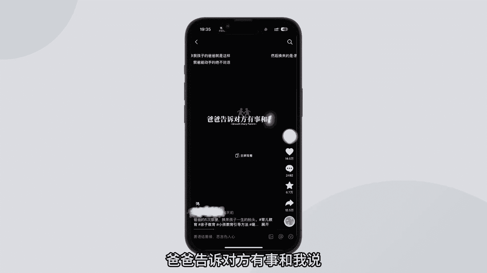

我的孩子我来教你，这个就是矢量图，视频的玩法，不只是可以做育儿领域。

还可以做创业领域，心理学，女性成长方面的等等。

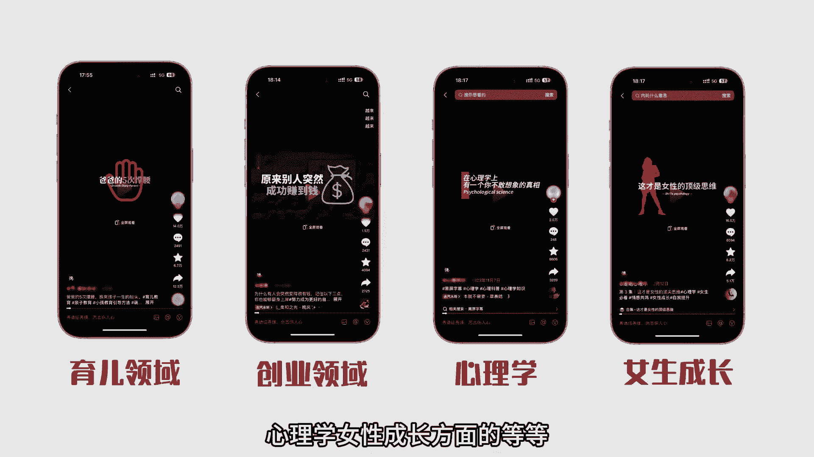

基本上都能快速的做出大爆款，那么这期视频我来手把手教会大家，如何去制作这种矢量图的视频，学会之后你也能运营一个可以快速变现的账号，先说一下这种矢量图账号的变现方法。

第一个当然是收徒弟教他们去制作这种账号，事实上已经有人在这么干了，第二种，橱窗带货变现，如果你是做女性成长，育儿相关的账号，可以在橱窗里卖一些相关的书籍去带货变现，第三种引流到私域卖课，卖服务变现。

像做育儿类，女性成长类的账号，这个客户群体都是消费大军，别说卖课了，就算是做淘宝客，也能搞到不少钞票，接下来我给大家演示矢量图。

视频的详细制作方法，一共分为三部，文案挖掘配音，制作视频剪辑，我们一步一步来，第一步先去找文案。

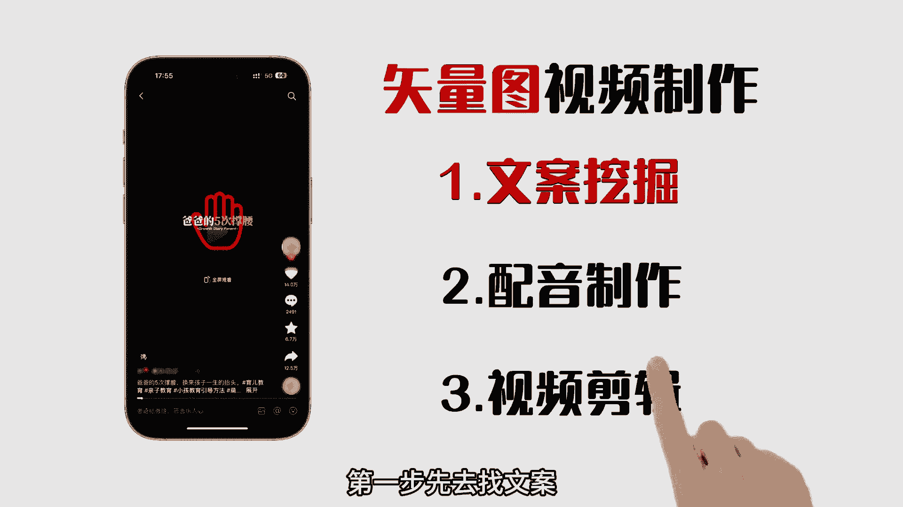

就拿这个预言内容给大家举例，文案这块可以切换到小红书平台去找素材，在小红书搜索一些跟育儿相关的知识，找到那些爆款的笔记，把笔记的内容保存下来，爆款文案就有了，第二步开始配音，这种矢量图视频的配音。

90%的博主用的都是魔音功法，这个角色的声音啊叫做魔幻声啊，就是这个我也推荐大家去用这个声音，因为出爆款的几率非常大。

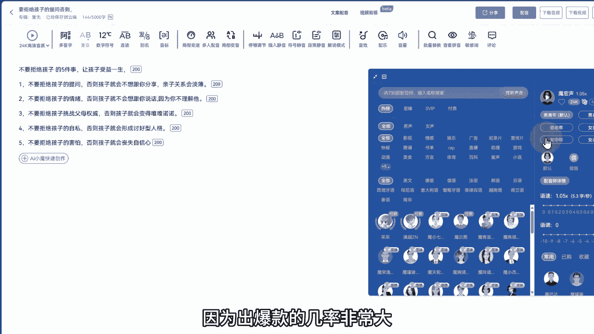

接着就是把刚才的文案复制到魔音工坊，保存音频就可以了，第三步剪辑视频。

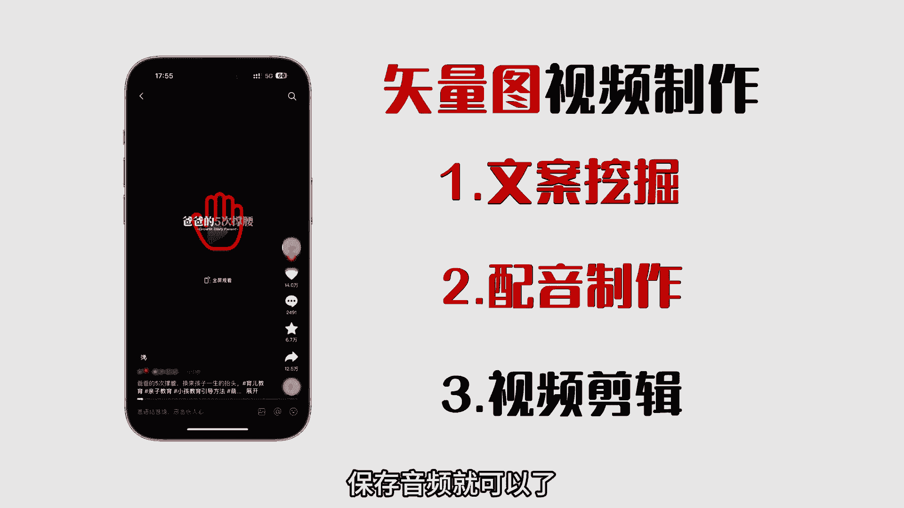

这一步其实也很简单，全程用剪映就能制作出来，有条件的兄弟建议去开一个简易的会员。

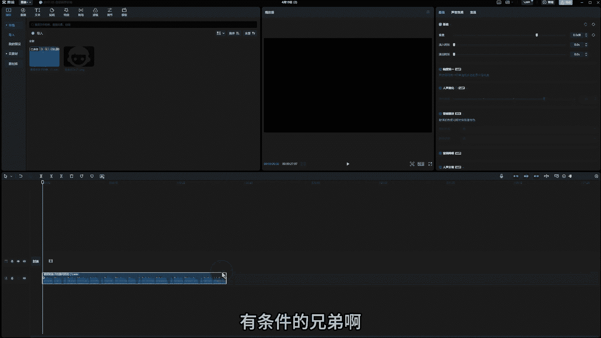

做出来的视频效果会更好看，先打开剪映。

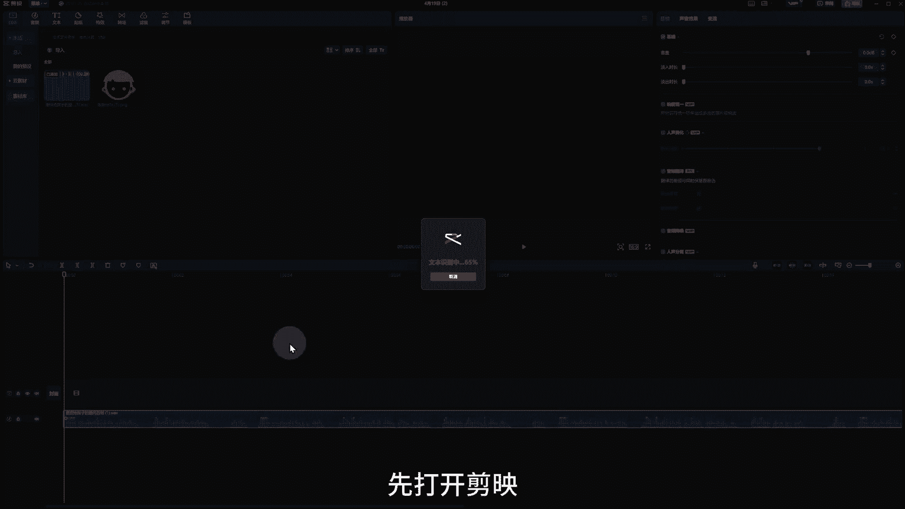

把刚才的音频文件拖进来，生成字幕，然后调节字幕的大小跟文字大小，调节到11左右，文字的话一般都是用的四元宋体，接下来就是去下载好对应的矢量图。

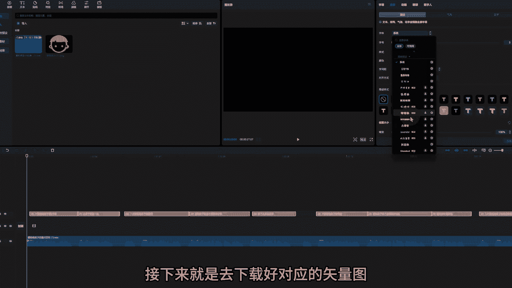

矢量图的素材用的是这个网站都是免费的，只需要花一些时间去找到，那些跟字幕情节对应的素材就可以了，比如我开头用的这个文案是关于孩子的，那么我就可以在这个网站里去搜索，孩子或者宝宝的一些关键词。

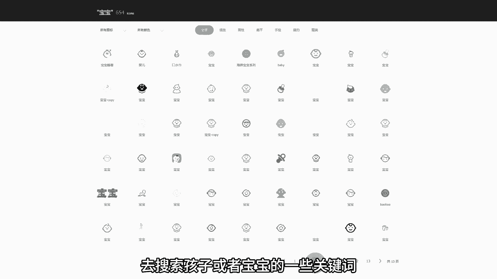

找到这些比较好看，符合这个文案的素材图，找到之后，把这个矢量图的颜色我们一般选择红色，再选择这个PNG的格式。

最后下载到电脑上，拖到检验里就可以了，现在所有的素材都有了，我们开始调节这些字幕的大小，颜色和排版，让整体的视频看起来美观，后面的每一段都是这样去调节，那排版在这里就不多说了。

唯一要注意的细节就是矢量图跟字幕的，出场动画，入场动画每一段都需要单独设置好，风格不需要太统一，但是一定要看起来非常的舒服炫酷，最后再加上这段背景音乐，矢量图的整个视频就制作好了。

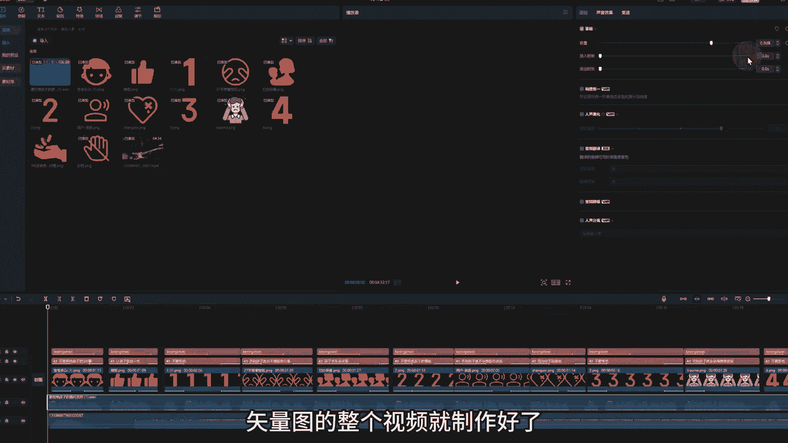

我们一起看一下成品视频，不要拒绝孩子的五件事，让孩子受益一生，不要拒绝孩子的提问，否则孩子就会不想跟你分享，亲子关系会淡薄，但你不要拒绝孩子的情绪，是不是有那味了。

这个就是矢量图视频快速起号的电脑制作教程。

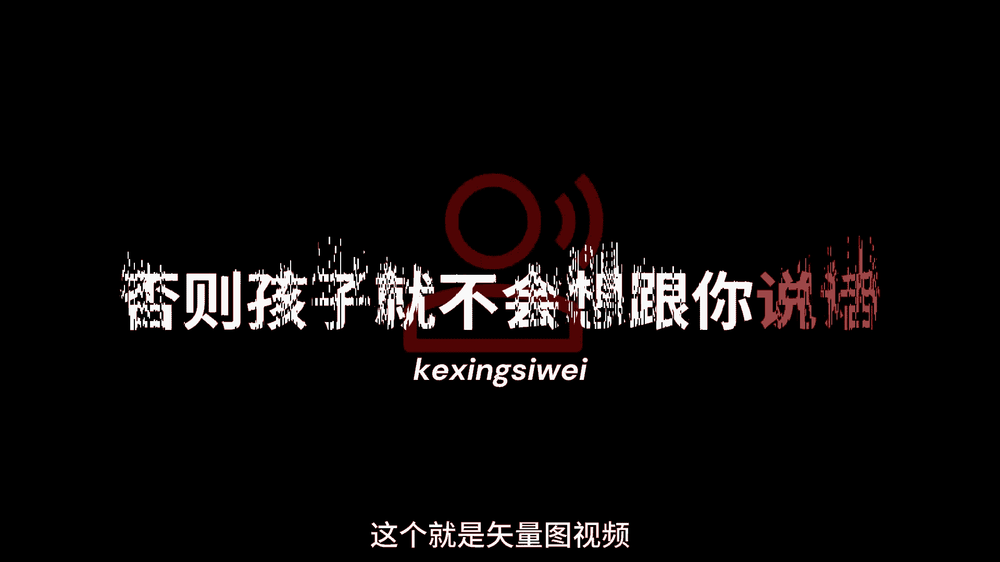

希望对大家有所帮助，当然我也整理了一份，关于手机版的详细制作方法，还有这些矢量图的素材，我都下载好了，你可以在我的可行思维回复矢量图来学习好了，那今天的分享就结束了。

