# 抖音最新视频去重技术，黑线技术终结版，搭配起号教程一天爆涨6w粉，无需剪辑百分之百过原创 - P1 - 沫尘社群 - BV1QH4y1n74N

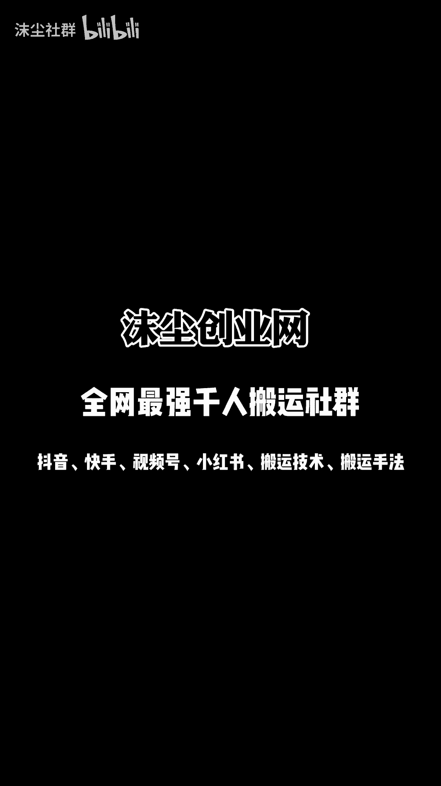

墨城社群的兄弟们，大家晚上好啊，今天给大家录制一个暴力涨粉的一个教程啊，连怼啊，这个账号一天的话是涨了差不多67万粉丝啊，然后，基本上全部都是连对我们废话不多说，直接上实操。

把你要驱虫的这个素材给它下载下来，下载下来以后，然后用我们这个内部工具去处理一下啊，然后怎么处理啊啊看我怎么选，然后你们都怎么选就可以了啊，然后导入视频，把视频导入进来以后啊，点击开始处理啊。

处理好了以后，我们打开剪映。

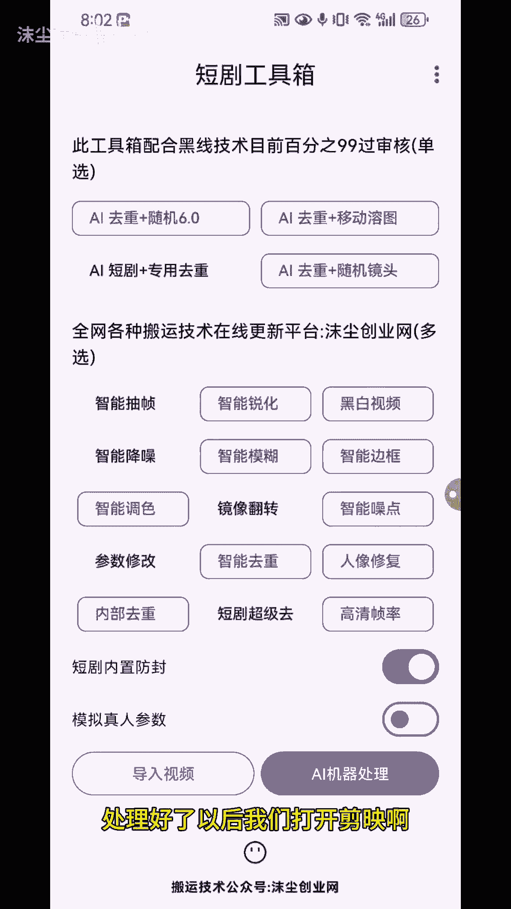

然后再进行操作啊啊啊第一步打开剪映，点击开始创作素材库，随便选一个素材啊，如果说你是实拍的更好啊，我这边是随便给大家演示一下啊。

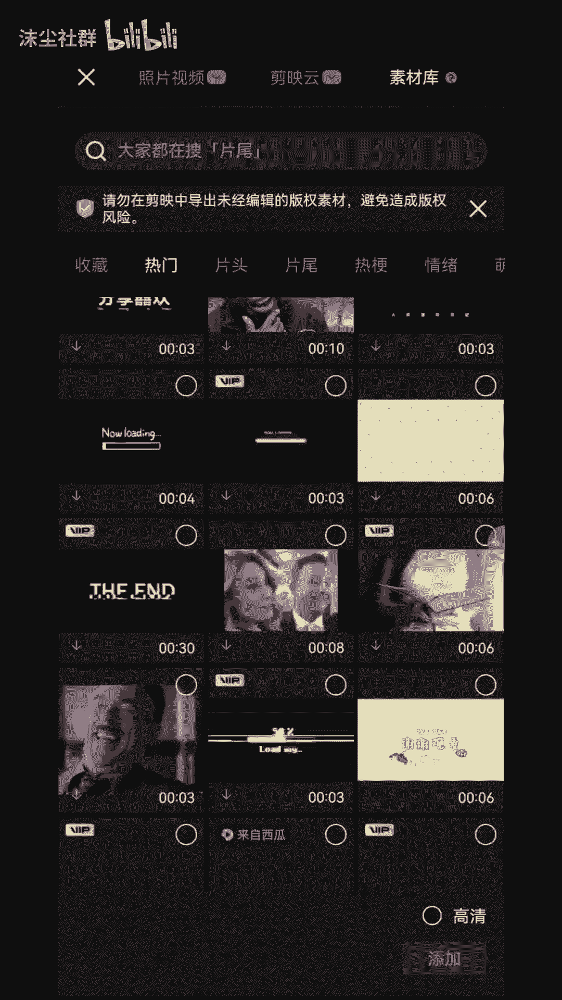

我随便找一个素材。

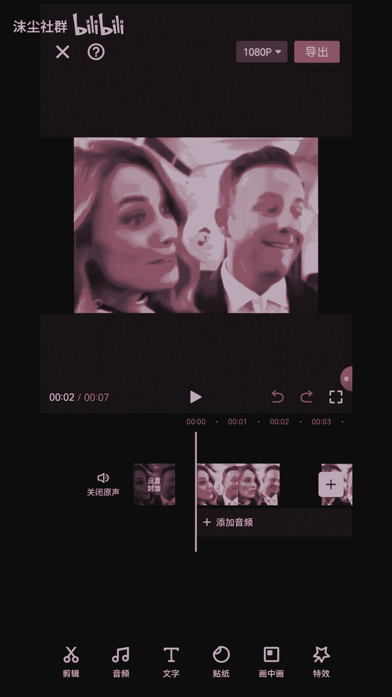

好了，这个时候我们把这个比例给他改一下，改到九比16拉大好，这个时候我们去添加你想要搬运的视频啊，你去好水印，想要搬运的视频，添加一个画中画，好我这边就选这个吧，好添加进来以后，给他放大。

其实正常的话我们直接给他放大一点，像这样把那个视频给它盖住，把那个字幕给它盖住，驱动效果会更好，然后这个时候我们点击一个镜像，编辑镜像一下给他，然后，复制啊，把这个视频复制一下，拉下来给它对齐。

对齐就可以了啊，把第二个的声音给它关掉，然后这个时候我们点击第一个画中画啊，第二个画中画第一个活动画给他点，选择蒙版线性反转，然后点击调整参数旋转，把这个旋转给它调一下啊，给它调到你如果说要中间的话。

黑线在中间，那么你就放在中间，放斜面，放斜面啊，一般我看那些对标都是放在斜面啊，像这样，我们调到119好确定，然后点击第二个画中画蒙版线性反转，调整参数，旋转给他也是跟他一样的，调到119。

119好可以了。

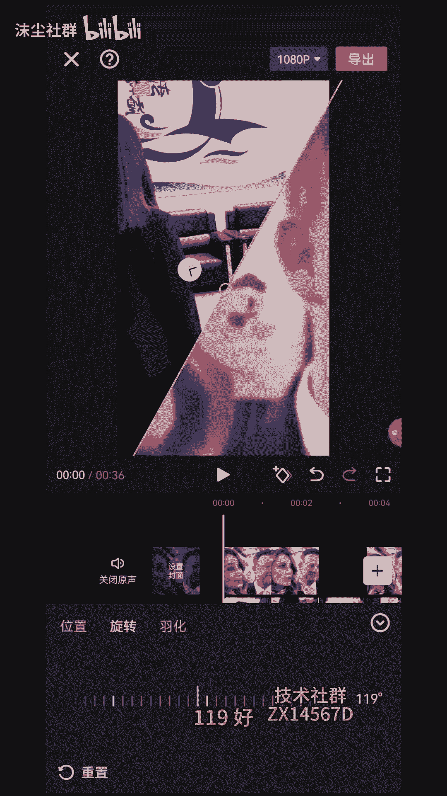

然后这个视频没过来，我们再点一下反转好点，对勾好，中间就有一条黑线了，然后这个黑线的话他不太明显啊，如果说我们想调大一点，怎么调好，想把这个黑线给他放宽一点，怎么放啊，点击一下这个视频。

选择蒙版调整参数，然后这个，把这个叉轴啊，你调到个五左右应该就差不多了，五左右已经可以了啊，哎你等一下你走什么走啊，然后第一个视频的话，最好是你手机里实拍的啊，你的这个素材有多长，你搬运的素材有多长。

你就给他放多长就可以了啊，看到没啊，你等一下你走什么走啊，让你的公主老公，然后这个时候一样的，我们加特效画面特效啊，随便搜啊，什么透明爱心啊，星星啊都可以啊，正常的最多的就是这个调整参数速度放慢。

这个氛围给他调到十七八，确定作用对象，全局啊拉满好，这个时候我们看哎你等一下你走什么走啊，让你有一些爱心的东西在上面。

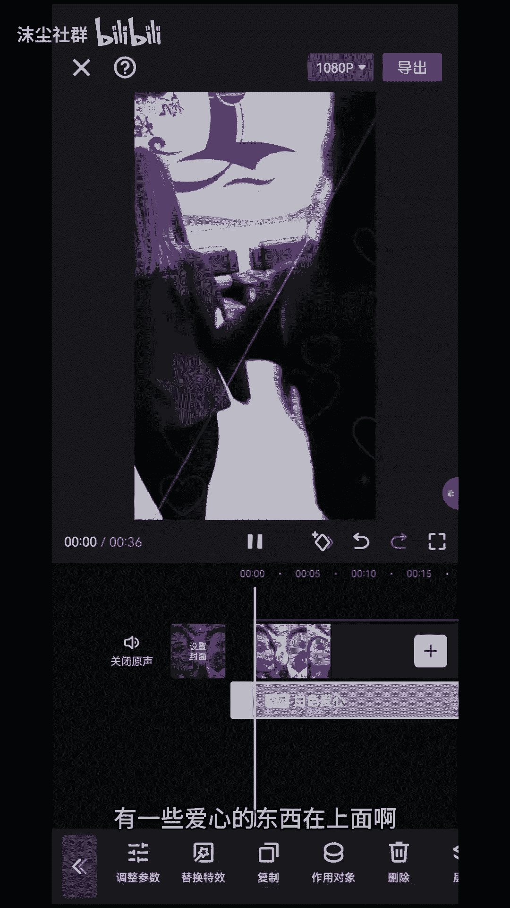

然后这个时候我们再加一个画面特效，升一升啊，像素爱心啊，这个像素爱心非常好用啊，驱虫效果非常的好，我们给它全部调到五，把参数给它调到五，五和六都可以，但是调到五是最好的，你等一下你走什么走啊。

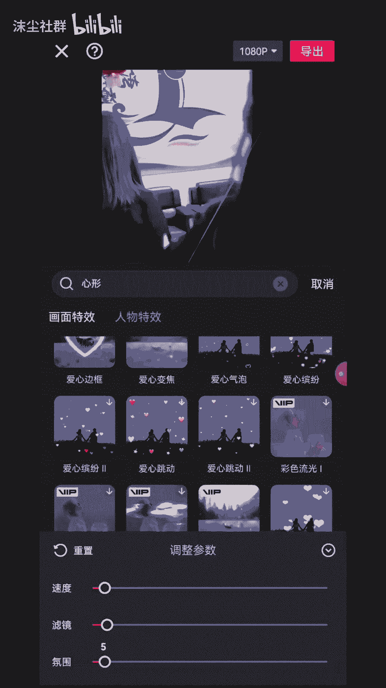

拉满作用对象选一下全视频啊，好等一下你走什么走啊，还有这个时候我们可以去抓一个操作，第一个画中画，我们点一下啊，选择滤镜清晰啊，我这边就不给大家拉拉那个了，我直接拉拉满，我给大家看一下效果。

第二个方的话再选择滤镜啊，我们选个这个，我给他拉满，然后我们看一下效果，他两个相当于这上面左面的这个视频，和右面的这个视频，它不是一个滤镜，知道吧，我只是调的太满，你们调的时候的话。

你们可以把那个滤镜给他拉到50%，他不是那么明显，但是它系统能检测出来吧，这是一个操作，然后这个时候我们字幕不是去掉了嘛。

对不对，我们把字幕已经全部给它去掉了，这个时候我们直接选择识别字幕啊，把字幕给它识别一下啊。

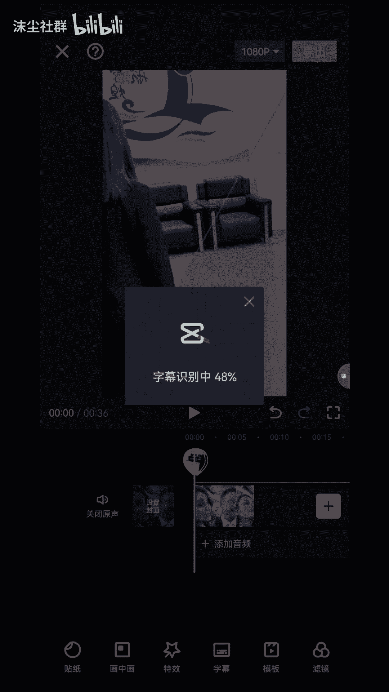

你看这个时候我们这个视频做出去，基本上都是百分之百的原创啊。

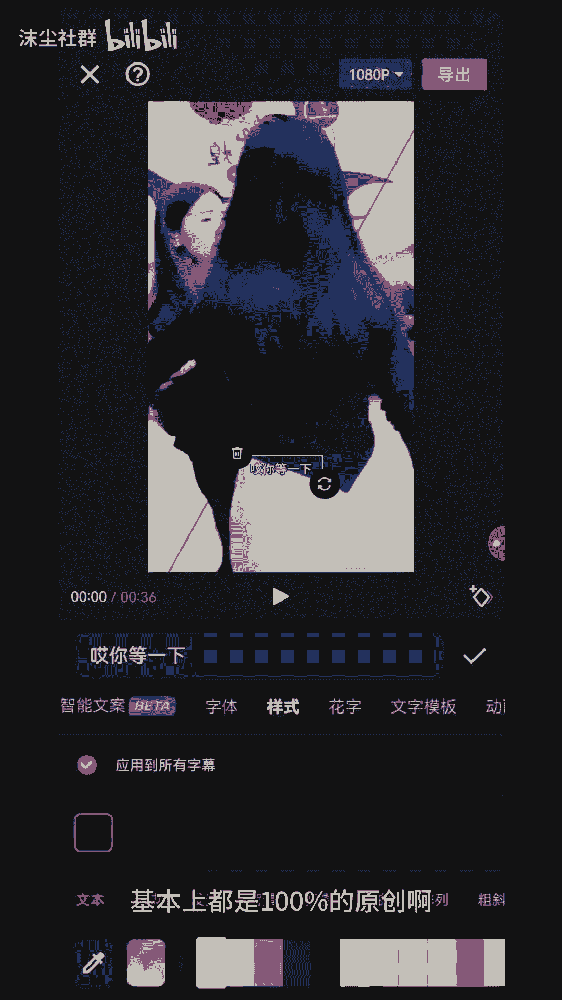

然后再加上我们再去卡一个模板啊。

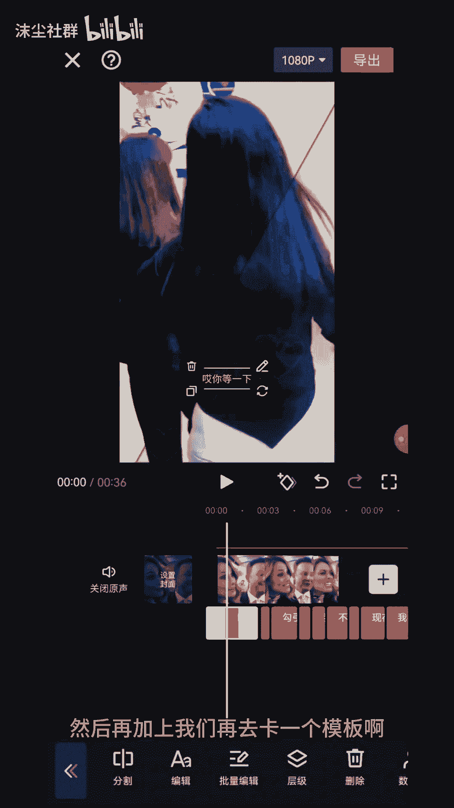

你给他拉下来一点也行啊，好这是做好以后直接导出啊。

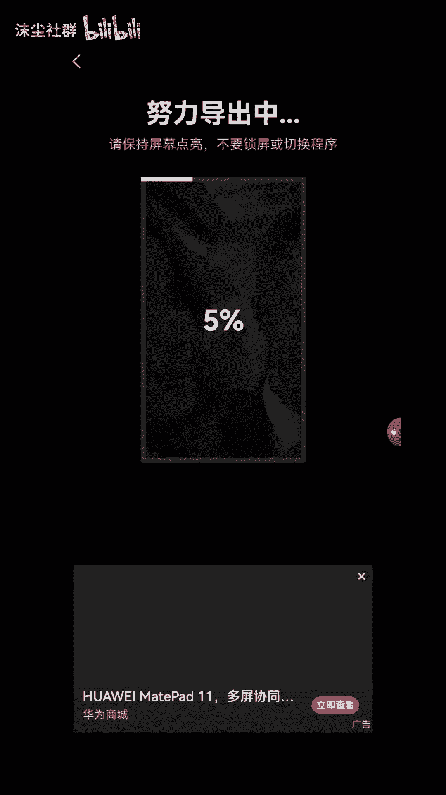

我记得这个呃封面给他选一下，我这边是忘选了啊。

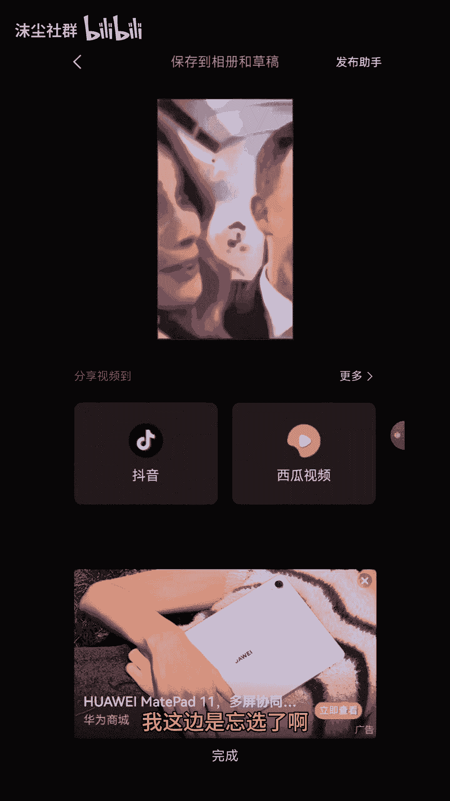

我给大家演示就就不再演示了啊，然后这个时候我们怎么去发布啊，我们已经导出来了，对不对，视频也导出来了，我们要选择剪同款去卡个模板。

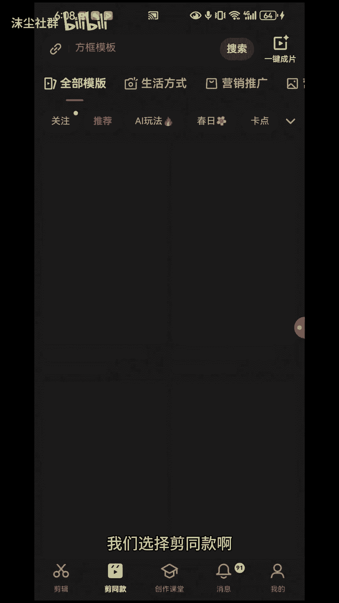

模板的话我们搜索一下，分为双重慢动作。

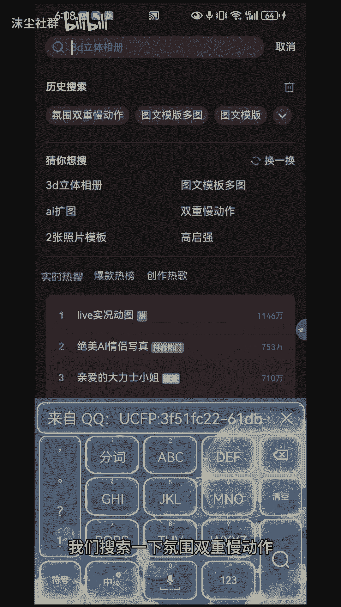

因为现在目前这个模板很火啊，大家去考的话，他流量是很高的啊，第一个抖音标准版啊，第一个哈氛围双重慢动作啊，或者是这个这个是最好的啊，这个也可以啊，还有这个也可以，60万的这个啊，我这边就有50万。

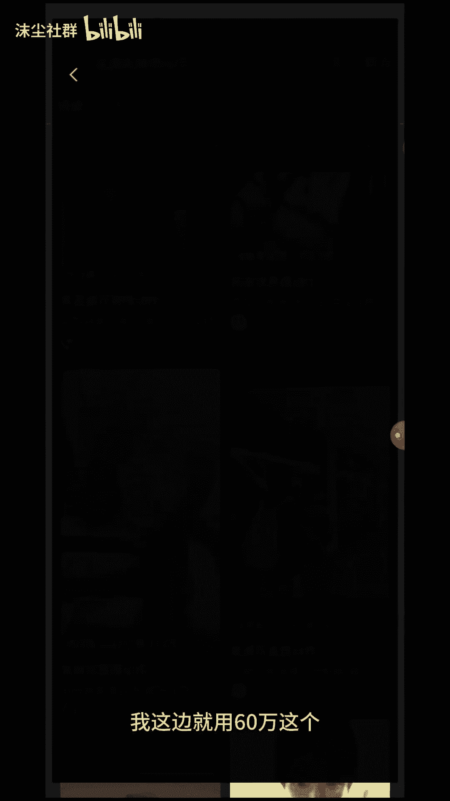

那个我点击剪同款，随便选选的视频照片都可以啊，下一步好导出，分享到抖音好点。

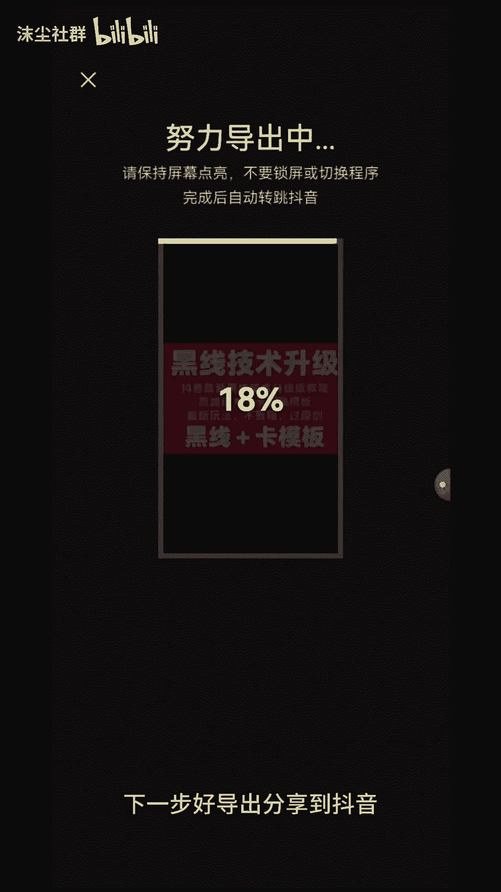

打开抖音。

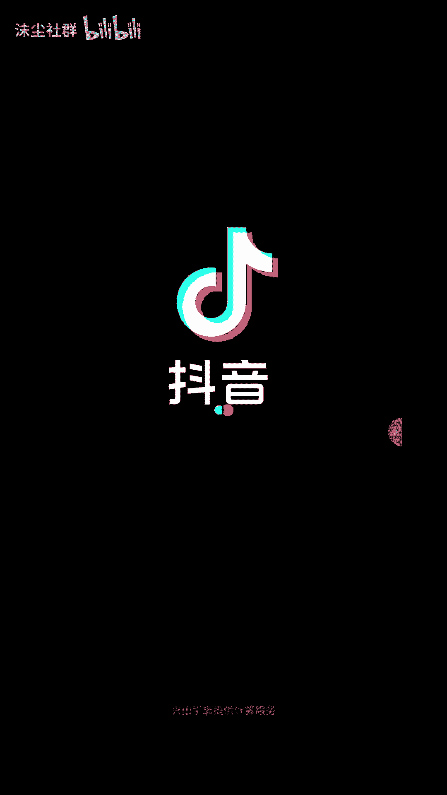

点击右上角裁剪全部段落添加。

把刚才导出的那个视频放进来，拉到前面，把这后面这个给他拉到零点几秒。

0。02。025秒，这个视频就做好了，然后画质增强选一下，就是你加滤镜的时候，你少加一点，我这边是给大家演示，让大家看到他这个视频的差异化，就是说它画面有所改变，我们搞出去的话，它是原创啊，你一定要看。

先把那个字的地方给他挡完了再去镜像啊，然后选择下一步，选择下一步以后，我们直接去选择想要的话题去发布啊，它发布出来的话，它是带有那个分为双重慢动作的一个模板啊，你如果说不挂车，他就是带了个模板了。

你挂车他就没有那个模板了，但是你是卡上了那个模板的啊，所以说只要去你去按照这个操作的话。

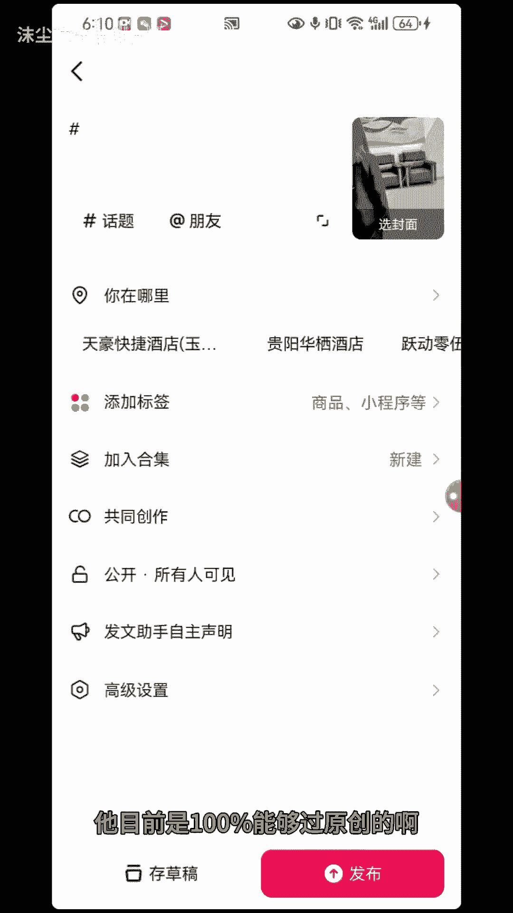