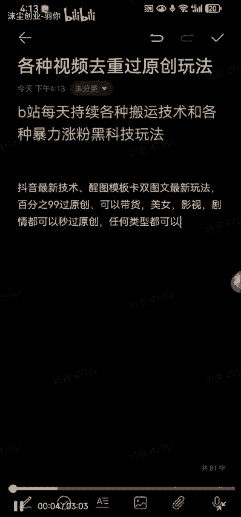
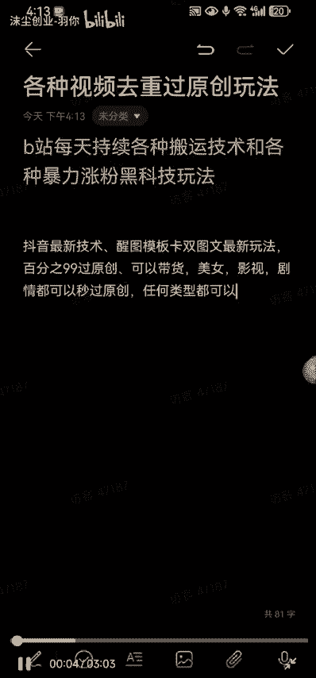
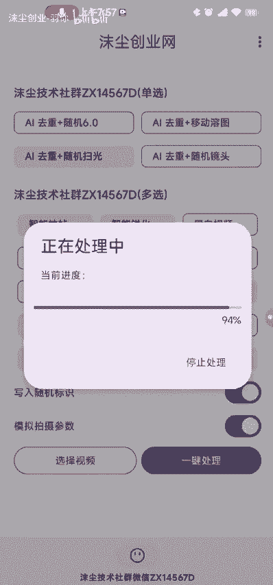
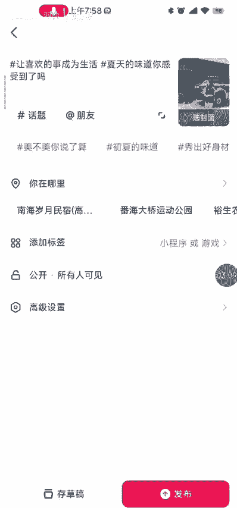

# 抖音最新醒图模板卡双图文技术，百分之99过原创。小白直接上手，效果相当暴力。 - P1 - 沫尘创业-羽你 - BV1ut42177sF

哈喽木城社群的兄弟们大家好，今天给大家更新一期抖音最新技术啊。

醒图模板卡，双图文最新玩法啊，这个的话是99%过原创嗯，可以带货啊，啊短剧啊，剧情啊，影视啊都可以秒过原创的啊，基本上任何类型都可以啊，嗯首先呃那我们废话不多说，直接开始实操啊。

首先我们打开我们的醒图啊，然后这里的话我们随便选择一个模板啊，比如说选择这个，然后选择好之后呢，我们这里随便选择一张图片啊，给它下载下来，这里没有什么太大的要求啊。

然后这里我们把这些不要的图片啊给它删掉，不要啊，点击本地相册啊，把我们刚刚下载好的图片给他拉进来了，好拉进来之后呢，我们出去打开我们内部的一个小工具啊，选择视频啊，把我们要搬运的视频给它添加进来。

好添加进来之后我们来设置它的一个参数啊，这个参数的话跟着我设置就可以了啊，我怎么设置，你们就怎么设置的，设置好之后，我们点一键处理。

好已经驱虫成功啊，然后我们继续打开新图，点这个发抖音有机会获得流量扶持啊，选择抖音，然后这左下角往上滑，这里有一个加号啊，我们点这个加号，把我们刚刚处理好的那个视频啊，给它添加进来。

然后我们这里的话把这个不需要的图片啊，把它删除掉，然后把这个视频往前面拉好，把这个音乐关掉，把画质增强一下，画质增强，然后下一步，这里我们把这个醒图的这个标签给它去掉。

去掉呃这个话题把洗头的话题去掉之后，这里你自己选择你想要的话题啊，啊这个标签这里的话嗯可以挂车啊，挂商品啊，挂小程序游戏都可以啊，这里选择一下你想要的封面，我们就可以直接发布抖音了啊好了。

