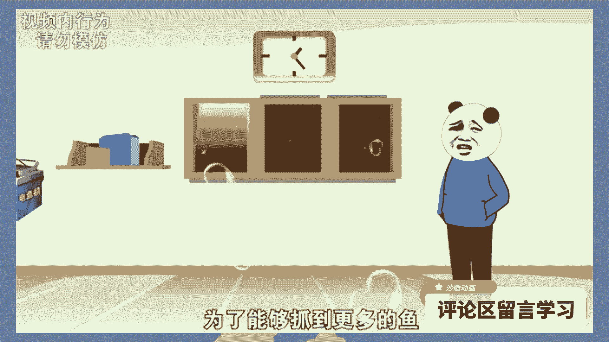
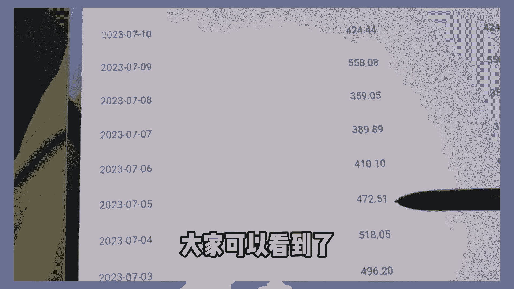
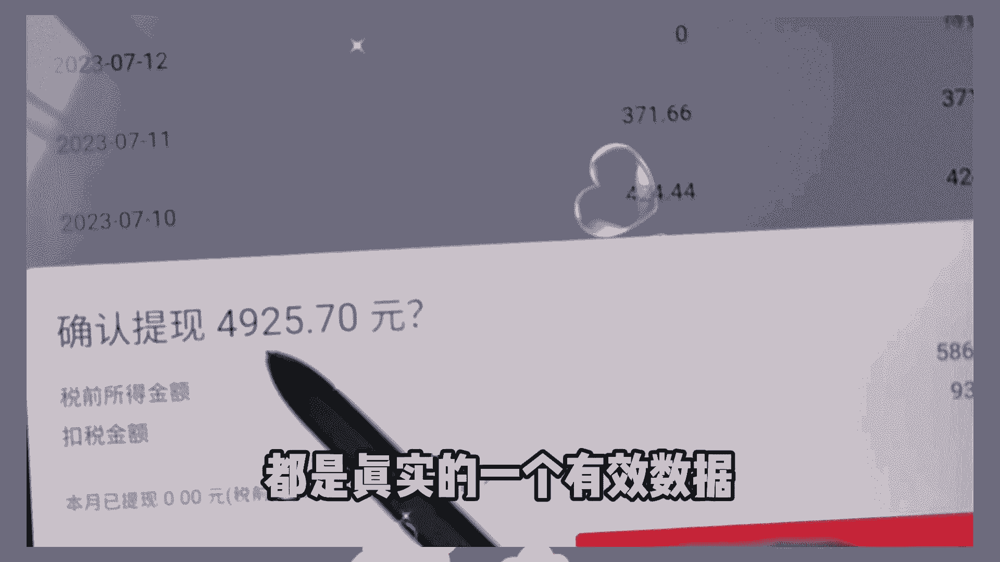

# 抖音最火沙雕动画制作，30天挣了2.1W，5分钟教会你详细教程，建议收藏 - P1 - 大明和大西 - BV17r421b73C

小时候生活在农村，我们村子周围有很多小河，村里的大人们经常会在河里捉鱼。

为了能够抓到更多的鱼，我爸买回来了一台电鱼机，那时候我也是第一次看到这种神器，你知道吗，像这样的沙雕动画视频，5分钟就能走出来。

相信很多朋友都刷到过，非常的受欢迎，今天呢是星期五，我刚好把我做沙雕动画的收益给大家看看啊，大家可以看到了，我上个月已经有几千块钱了。

每天都有个几百，都是真实的一个有效数据。

今天要给大家分享一下沙雕动画的详细教程，可以说是手把手教程了，视频比较长，建议先点赞收藏起来，反复观看好了，废话不多说，我们直接上干货，首先呢我们先打开剪辑工具，我们点开它，然后呢就有个动画视频。

在这里呢有个画布比例，我们选择16比九，然后呢分辨率我们改成1080P，然后呢帧率我们选择60，然后就有个预设场景，我们这边就选择一个乡村外景，然后呢我们就选择我们想要的一个外景。

接着我们再添加我们的角色，在这里我们选择一个人物，我们的人物我们就选择第一个即可，让我们点击创建作品，作品创建完成之后呢，我们就给它添加一个音频，我们点击音频，然后这里选择本地音乐。

把我们提前导出的视频音乐，我们给它导入进去。

我们这里点击使用，然后接着呢我们再调整我们的一个背景呀，把我们这个房子的位置我们给它移动一下啊，我们也看到这个地方也有围栏的地方，我们就把它删除，我们不要这个围栏，我们给它删掉。

人物呢我们也可以稍作修改，我们给它移一下，然后呢我们要接着根据我们的那个剧情啊，我们来给它调整一下，因为现在人物是静止的，我们要给它添加一个动作，我们点击添加动作，我们就根据剧情的需要来选择。

我们一个小L的动作，我们点击一个生气的动作，我们这边就选择一个生气的，然后呢我们再根据我们的剧情，然后呢我们再添加三个大公鸡，在这里呢我们就添加一个素材，我们直接在这上面搜索大公鸡，搜索出来。

我们可以看到这里有一些素材，我们点击添加去，让我们依次添加三只大公鸡啊，我们可以看到这些大公鸡的素材，已经添加进来了，然后呢我们可以看到它是一个静止的状态，在这里呢我们就点击它。

然后呢我们可以看到这个动画，然后我们就点击循环动画，我们这里选择一个雨刷，然后呢接着我们每一只啊我们都给它添加上去，这个动作设置好了之后呢，如果我们还想要再添加一些音频的话，我们可以点击这里添加音频。

然后在这里有个语音合成，这里呢，我们只需要把我们自己输入的一段文字呢，我们给它输入进去，然后接着我们可以看到这里有个选择声优，我们可以选择我们想要的一个播音员的声音，然后这里还有个背景音乐。

然后呢我们也是依次的进行后面的操作即可啦，好了，一个简单的视频就要制作完成了，像这样的视频啊，不用制作时间太长，如果是参加中视频计划的话，一般一分钟以上就够了，做的时候多思考一下，多多用点心。

像这样的视频发不出去，它的播放量都很高的，因为它是一个幽默搞笑类的沙雕动画，视频的受众群体非常庞大，男女老少都很喜欢看的，所以呢非常容易火起来，如果你也想要学会制作这样的沙雕动画视频，下方给我学习。

我都可以教给大家好了，本期的视频就分享到这。

