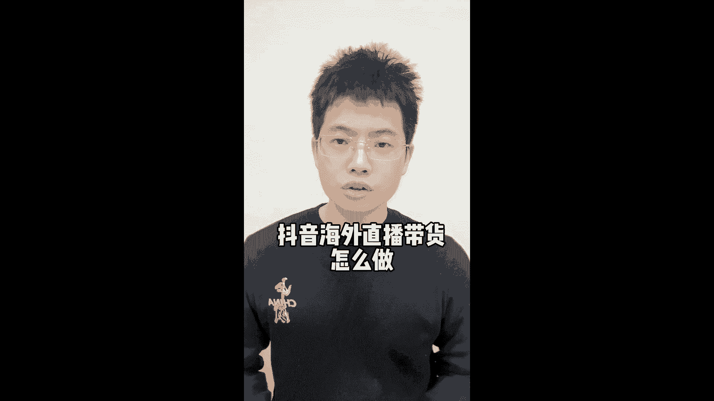
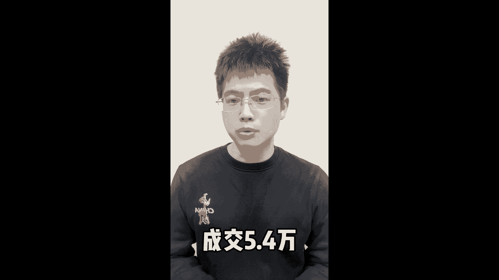
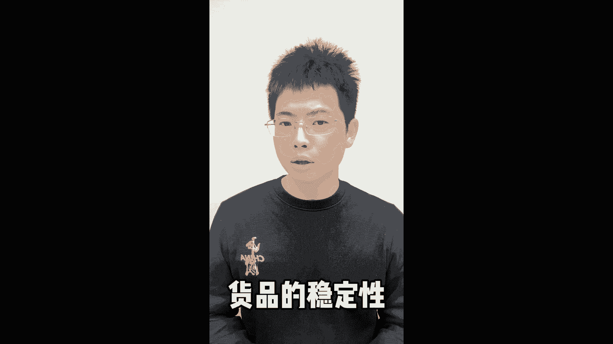
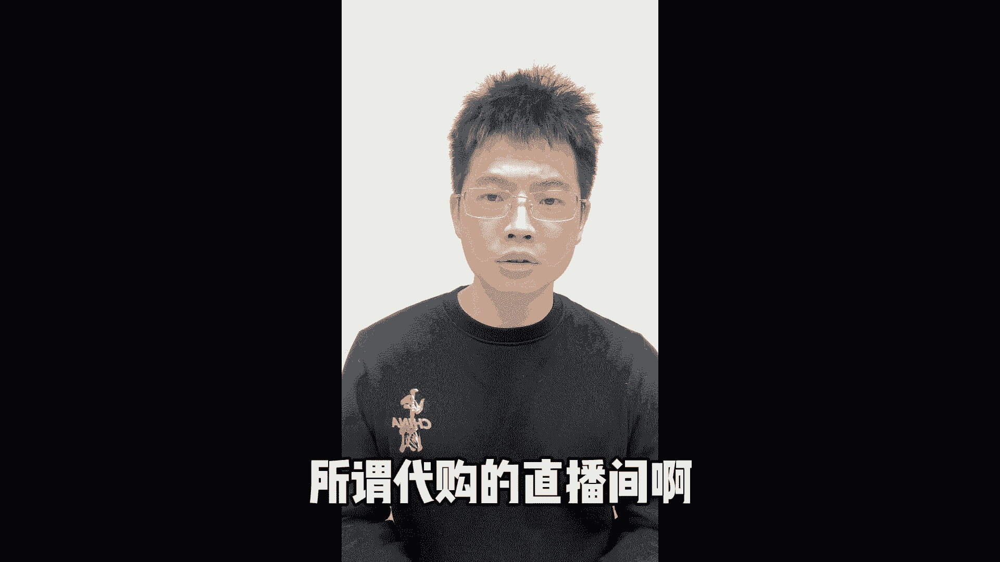
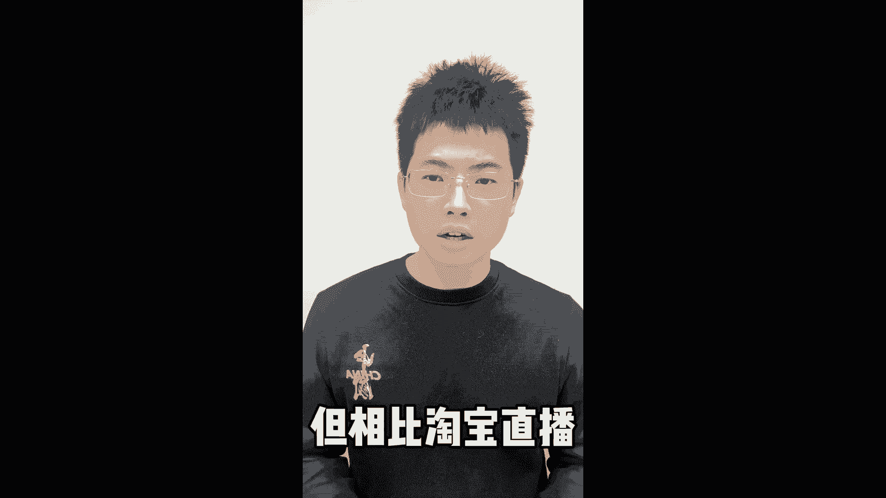
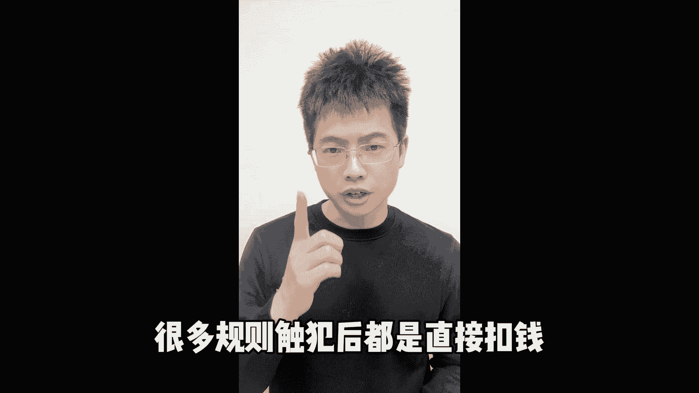

# 抖音海外直播带货怎么做？抖音海外代购直播间运营；抖音海外代购直播怎么做？抖音海外直播间如何起号？ - P1 - 白术说直播 - BV1tD42177hF

最近帮助海外代购直播间学号成功啊，直播第三场平均在线500多人，成交5。4万。

主要大部分的货品缺货没有很好的转化，海外代购最大的弊端就是货品的稳定性。

以及售后的处理，退换货高的前提下呢，非常容易亏本，所谓代购的直播间啊。

非产品质量问题都是不退不换的，直播代购兴趣与淘宝直播。

现在淘宝直播流量有些下滑，很多海外主播都是想要来到抖音上面发展，但相比淘宝直播。

抖音的规则是比较复杂的，很多规则触发后都是直接扣钱。

尤其是代购相关的产品，但是只要熟悉平台的规则，这些违规都是可以避免的。

如果你这边在海外也想做抖音直播代购啊。