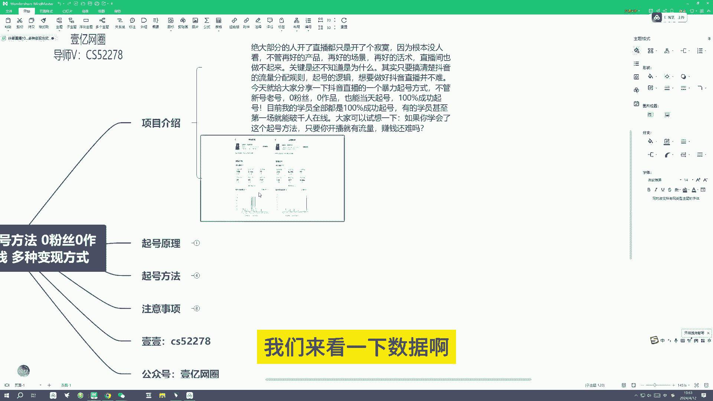
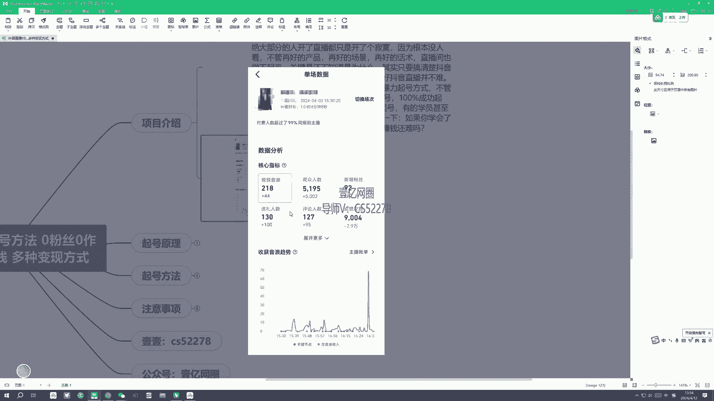
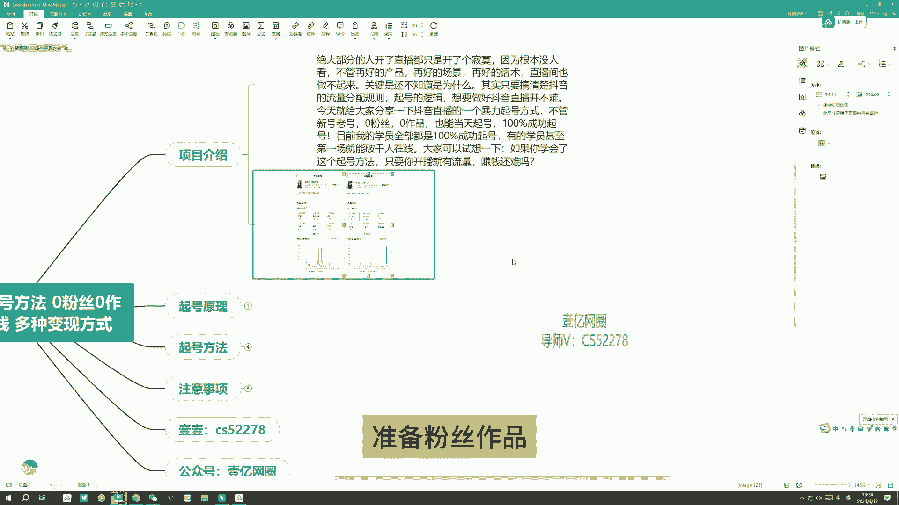
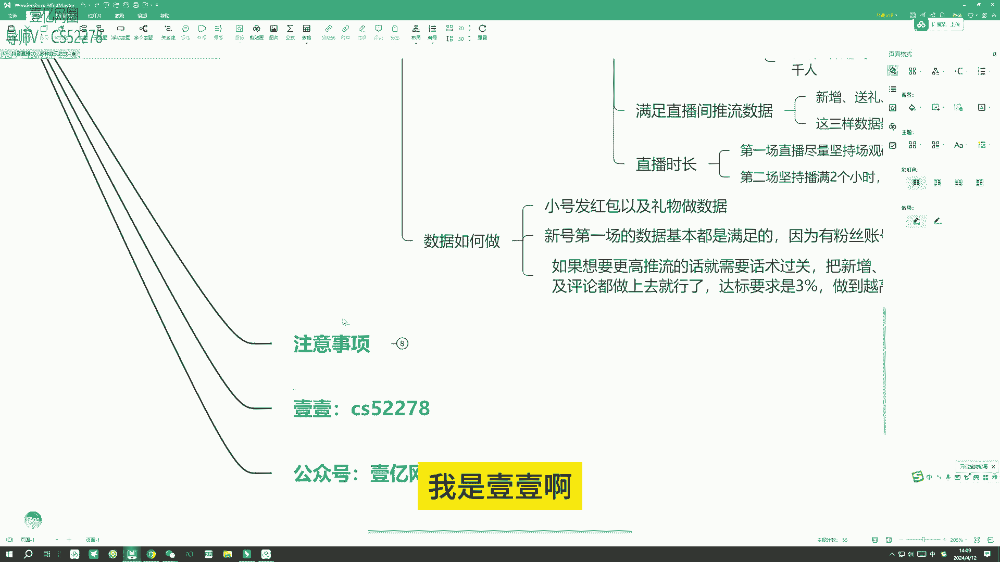
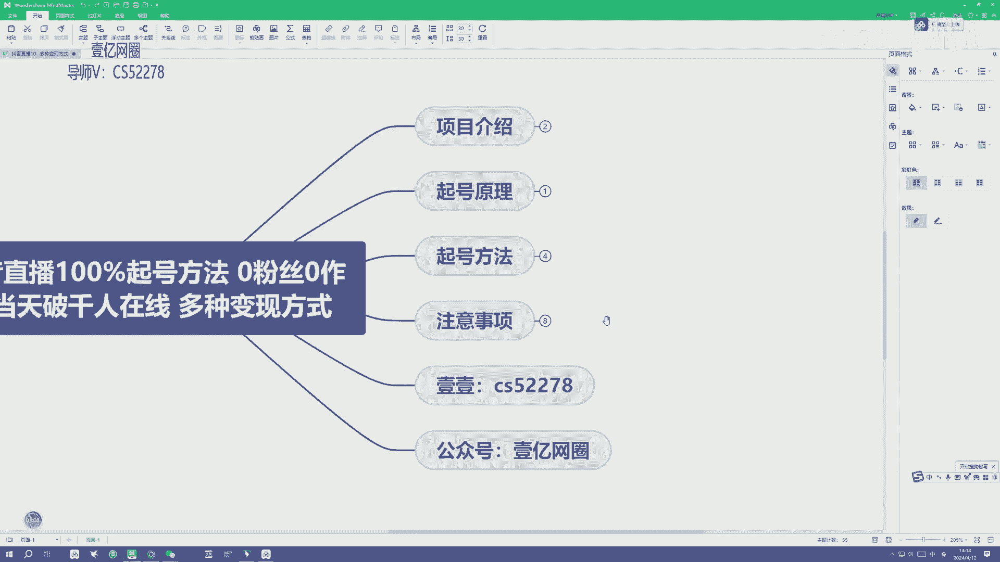
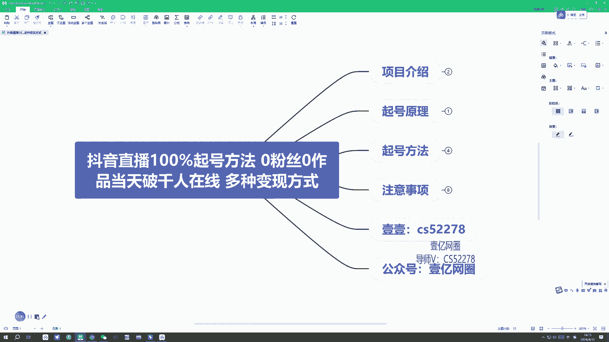

# 抖音直播起号方法视频教程 - P1 - abin阿彬 - BV1xA4m1c7dJ

大家好啊，我是导师依依，这节课给大家讲一下，这个抖音直播百分百的一个起号方法，零粉丝零作品当天可以破千人在线，多种变现方式，首先我们看一下项目介绍，抖音的一个日活量啊，现在接近7亿啊。

抖音直播更是抖音的一个非常重要的板块，只要掌握流量，不管你做什么，卖什么都能够起飞，很多人在抖音直播中已经赚的盆满钵满，而且每天还有大量的用户涌入直播板块，想要通过直播去打个翻身仗。

但是有绝大部分的人开了直播，都只是开了个寂寞，因为根本没人看，不管再好的产品啊，再好的场景，还有再好的话术，直播间也做不起来，关键是还不懂是为什么，其实啊，我们只要搞清楚抖音它的一个流量分配规则。

起号的逻辑，想要做好抖音直播并不难，今天的话就给大家分享一下，抖音直播的一个暴力起号方式，不管是新号，老号啊，零粉丝零作品也可以，当天起号百分百成功，7号这个方法的话，目前也是很多人在用的一个方法。

只要你去实操啊，只要你去尝试一下都是可以的，目前的话我的学员也全都是百分百成功，7号，有的学员甚至第一场他就能打破1000人在线，大家可以试想一下，如果你学会了这个起号方法，只要你开播就有流量啊。

你直播间就有人，那你想一下你赚钱还难吗，我们来看一下数据啊。

这个是一个新学员啊，一个新学员他的直播第一场，第一场的一个场馆啊，达到了2000，新增也有啊，评论也有，点赞也有，而且还有一点音浪，音浪收获，这个是第一场，第二场第二场的一个场啊。

就直接破了5000了啊，这个他跟第一场的一个数据对比啊。

他是有非常大的进步啊，所以说啊我们不需要去啊准备粉丝作品。

我们也可以去当天起号起号成功之后。

你可以带货或者是干嘛都可以啊，这个变现的方式非常多，我们来讲一下起号原理，几号原理的话就是运用抖音的一个推流机制，做好推流数据之后，抖音会把你的直播间推入更大的一个流量，成绩稳定数据后。

我们就算是起号成功了，接下来的话啊，不管你是要利用这个直播间啊，你去带货或者是做才艺主播，或者是去卖什么都可以啊，这个都是可以变现的，不需要发作品啊，没有没有那个粉丝的要求啊，我们零粉丝也可以做。

不需要养号来，下一节课的话，我给大家讲一下这个起号方法，这节课就到这里，谢谢大家，大家好，我是导师依依，这节课我们继续讲啊，抖音直播了一个百分之百的起号方法，我们直接讲一下起号方法。

首先的话我们需要账号设备，还有一个就是他的一个粉丝旗号的方法，还有如何做数据啊，我们一个个来，首先讲一下账号，新号老号都是可以做的，但是的话新号是更容易起号，因为新号的话它没有标签。

没有那些老号那么杂乱的标签，而且也没有违规过，没有开过直播，所以新号的话起号会相对更容易一点，老号的话有些老号啊，他标签杂乱，而且他开过直播的时候，因为长时间直播间没有人，这样的话也不是不能做啊。

也是能起的，但是的话相比于新号来说，我们需要多骑个一两场，这个大家也可以尽量用新号来做啊，来账号需要准备两个，一个账号是用来做直播的，另一个账号就是要用来，对这个直播间去做数据用的。

我们说一下账号标签啊，账号的标签啊，一般分为兴趣标签，还有创作者标签，兴趣标签的话，就是平时我们在刷什么类型的视频比较多，那抖音就会给这个账号打上，相对应的一个兴趣标签，创作者标签的话。

就是我们自己经常发什么样的视频啊，它就会是一个什么样的标签，所以直播间观众的一个标签很重要啊，尽量我们兴趣标签跟创作者标签啊，要标签一致，这个是对起号后期啊，起号后期的一个挽留起到一点作用啊。

前期的话我们不需要，前期的话他是我们新号零粉零作品，不需要养号啊，就直接开播就可以了，到后期的话你再找到你相对应的一个赛道，你再去做这个标签，来接下来讲一下设备，设备的话也是需要两台手机。

一台是用来做直播的，还有另一台就是用来看数据以及做数据的，就看这个直播间的数据以及数据用了，我们直播的时候可以露脸，也可以不露啊，这个关系不是太大，但是如果你不露脸的话，这个场景你直播的场景不能太差。

太差的话，这个留言啊，观众那个吸引力不太大，然后另一台手机的话，我们是要登同时登两个账号的哈，就是说我们要把那个主号在开直播间，这个号我们叫做主号啊，我们要登一个主号，然后再另外登一个小号。

主号啊是要登来看数据的啊，因为另一台手机本身第一台手机在直播，对不对，另外一台手台手机的话，它就是用来看数据，看这个直播间的数据，然后另一个我们就是登录小号啊，去做互动，做数据。

我们可以通过应用分身来登两个号，如果你没有应用分身的话，那就是在抖音软件里面，切换账号来操作就可以了，一般的安卓机都会有这个应用分身啊，如果没有的话，你就在抖音软件里面直接切换账号操作，也是可以的。

或者的话你手机多的话，你可以再准备一台手机啊，来我们讲一下啊，非常关键的这个起号方法啊，叫粉丝旗号，它不是鱼塘起号，大家不懂，有没有知道鱼塘起号了，以前的鱼塘起号，它也有点类似于现在这个起号方法。

但是的话以前的鱼塘起号就是你开播之后，他就会给你就是放一部分的那个粉丝进去，但是他这个是不活跃的，他只是挂的那个粉丝在里面，就是给你这个直播间充当一点人数，现在的这个起号方法的话啊。

就是我们去找30~50个粉丝账号，我们一般30~50个就可以了，不用太多，然后开播之后啊，让这些粉丝从关注页或者主页里面进去啊，有些主播说啊，不能从关注关注页或者是主页进入直播间啊。

那我个人觉得是比较搞笑的啊，因为我们新号开播，你不从那个主页或者关注跃进，你从哪里进，对不对，你不可能一下子开播，别人就能从广场上刷到你，所以说啊这个我们不用去管它。

我们直接就是从那个关注页或者主页进入，就可以了，这个的话，到时候就是我们去找这个粉丝账号的时候啊，我们正常情况都是去买嘛，因为嗯你如果你自己有30~50个小号，你也可以这样做，如果没有的话。

那就是去买粉丝账号的话，我们可以去百度找啊，也可以来找我，首先声明啊，我们这个方法你要用到粉丝账号的话，它是需要花米的，我个人啊不赚这个差价，你们不放心的话，也可以自己去百度找，如果找不到什么的话。

就可以来找我，这个我不赚你差价啊，这个很多人担心啊，就是说你找这个粉丝账号，那一场直播是不是要花很多钱啊，这个的话嗯，他的一个市价就是五块钱一个五块钱一个，就是你一场下来花个两三百，然后这个两三百的话。

你不用担心啊，只要你配合适当的变现方式，他这个启航成本是可以赚回来的，不会去亏波啊，比方说你这场直播，你现在是用了30个粉丝，对不对，30个，然后五块钱一个，那就是150，150的话。

只要你配合适当的变现方式，你这一场直播你是可以赚钱的，不会亏钱，这个大家不用担心啊，然后接下来讲一下这个直播间的推流机制，正常账号啊，正常账号一般30到50分钟之间，会有一次推流，慢。

推流账号一般是50到60分钟会有一次推流，这个时间点是什么意思呢，就是说我们新号开播之后不用就直接在那里啊，噼里啪啦的说一大堆啊，这个没有用嗯，你这个直播间还没有推流进来，你在那里一直说是没有用的。

你说的再好也没人进来听，对不对，他要到达这个时间节点之后才会给你推流，那你在30分钟之前或者40分钟之前，你可以不用说话，你就坐那里就可以了，没必要一直说一直说的那种。

就是对这个推流机制不了解的人才会这样，还有一个在在线人数达到260元之后啊，抖音会给你有一波极速推流啊，在这个极速推流期间，如果你把这个数据做好了，就很容易在线破千元了。

然后接下来就是这个直播间推流数据啊，我们需要是要满足什么数据啊，首先就是一个新增新增粉丝送礼人数，评论人数，这三个就是这三个，这三个数据最低的标准要达到厂关了3%，就是说啊比方说你第一场直播。

你的场馆是1000人，对不对，1000人的3%是多少，就是30，就是你在第一场直播，你一定要做到心中30%，这30个人3%啊，30个人送礼，30个人，评论条数也是30人制，这个是一个基本的一个条件啊。

就是说啊我们如果说啊，第一场我们就播到个1000人场关就下播的话，那这个数据是完全可以达到的，为什么这么说啊，因为我们前面是找了这个粉丝账号，对不对，粉丝账号会帮我们把这三个数据都做完啊。

就是说比方说你找30个人，那他们就会你这场直播就会有30个新增，30个送礼，30个评论，这些都会达到，但是如果你想播场关2000人怎么办，你想播2000元的话，你可以这个粉丝账号再做多一点，做50个。

然后的话你再适当的用一些话术引导，以及直播间的一个互动来达到剩下的一些标准，这样的话对你下一场的一个推流会啊，起个非常重要的作用，会起到非常重要的作用，还有一个直播时长，我们第一场直播啊。

尽量坚持闯关破千，有利于下一场直播的推流啊，就算你不破千啊，突然断播了也没关系啊，有些时候就是会有一些问题啊，就是说你准备不充足的话，比方说你手机过热发烫或者是手机没电。

或者是你直播的时候有哪些哪些话术啊，会就是造成违规被迫断播，这种都没事啊，但是如果没有这些情况的话，你就尽量把这个厂关坚持到破千，第二场的话就是要坚持播满两个小时，同时做好数据。

然后后面啊你在开播的时候流量就会稳定了，就是说啊我们只需要这个粉丝账号，我们只需要做一场到两场就可以了，第三场的话我们就不需要了，第三场的话，他会直接就是自然流量都是稳定流量了。

这些的话就是说你花费了这个粉丝的，这个米都是可以赚回来啊，比方说你有啊合适变现方式的时候，你在第一场直播啊，你比方说花了200块，你在直播的时候，你到后面推流，他是进来的，都是那种自然流，都是粉丝吗。

只要你有适当的那个变形方式啊，可以转化的话，那这个都是可以赚回来啊，我们都会尽量啊不会做到推波，接下来看一下怎么做，怎么做小号去发红包以及礼物，还有做互动来满足这个直播间的一个数据。

新号第一场的数据基本都是满足的，因为有这个粉丝账号在，所以我们不用太担心，我们只需要播到1000元下播就可以了，如果想要更高推流的话，那就需要话术过关，把新增送礼以及评论都做上去就可以了。

达标的要求是3%啊，但是你你可以做的更好，你把它做到6%，9%，10%，那下一场的话你就直接起飞了，这个跟你的话术有一点点关系，这个就是他的一个起号方法，还有什么不懂的话，都是可以问我啊。

因为我的学员啊用这个方法起号都是7号，成功了百分百成功，这个的话大家也可以去试一下，还有什么不懂的再问我吧，然后下一节课我们讲一下这个注意事项，好我是依依啊。

大家好，我是老师依依，这节课给大家录一下啊，这个开播的一个实操演示啊，我们开播就非常简单，我们点下面这个加号，点完之后我们如果是你想露脸的话，那你就是用前置摄像头来开播啊，前置摄像头的话，你就这样。

然后转过来就是对着自己来，这个的话，如果你用前置摄像头对着自己录脸播的话，他这个起号会更加好一点啊，如果你不想露脸，那你就是用后置的摄像头，后置摄像头的话，你看你的一个场景啊。

直播的一个场景是怎么样的一个设置啊，啊我之前起号的话就是直接这样对着电脑，就这样直接对着电脑来开直播，这个的话你要就是设置一定的一个场景，开播的时候嗯非常简单啊，如果我们啊新号新号的话。

是没办法去挂什么东西的，我们就不用挂，什么都不用挂，然后的话啊把那个设置啊，嗯直播间介绍的话，你可以去添加一下，比方说啊第一次直播啊，比较紧张或者怎么样啊，首播，然后啊这些没什么好事设置的啊。

还有清晰度什么的啊，这个允许观众查看资料，这个给关掉啊，这个要关掉同城啊，同城我们要把它关掉啊，我们不要那个同城的那个用户啊，还有那个抖音的一个基本设置啊，给大家看一下抖音的一个基本设置。

就是我们要把这个隐私设置啊，同称要关闭，还有就是啊找到我的方式，这里啊，这里这些也要关闭啊，就是说我们只要推荐页的人进来啊，还有这个，直播，这些全部都关闭啊，直播推荐啊，推荐给朋友什么的，这些全都关闭。

找到我的方式，还有那个同城都要关闭啊，我们只要他从那个推荐页里面进来就可以了，然后的话我们就下面开直播，开启直播，这个就给大家演示一下我们怎么去开播啊，还有那些啊抖音上面的一些设置啊。

开播之后我们就是用那个啊另外一台手机，另外一台手机的话是登了这个主号，还有另外一个小号的主号的话，就是拿来查看那个啊直播，当这是实时的一个数据啊，查看直播实时的数据啊，就是有直播间啊，进了多少个人。

他的一个啊新增新增了一个数量，还有评论的数量，送礼的数量，这些都达到多少，适合我们去下一步该怎么去操作，这个可以实时能看得到啊，然后啊小号的话就是开播之后，开播之后我们小号就进到这个直播间里面啊。

然后去发一些红包啊，然后发点小礼物什么的，然后在下面评论区活跃一下，就是啊互动一下啊，这个就是一个直播，我们直接点开启直播就可以了，点开启直播就可以了，如果还有什么不懂的话，大家都可以来问我。

这个都非常简单，大家好，我是导师依依，这节课给大家讲一下，抖音直播百分百起号方法的注意事项，首先的话我们一个账号最多只登录两个手机啊，虽然说它是可以同时登录五个手机，但是的话我们就登录两个就可以了。

避免它跳实名，要人脸识别，第二个的话起号是需要花米的，虽然配合变现方式可以做到不亏波甚至赚钱，但是我们也建议啊，你先练习好直播话术再去直播，不然的话你接不住流量的话，那你可能播起来就会有点麻烦。

先练习好话术再去直播，来第三个，我们新账号前两场一定要定时直播，比方说你今天是下午的三点直播，那你第二天也一定要在三点的时候开播，你不要去换时间啊，即使你断播了，第二天也是三点开播啊，这个打个比方。

就是说你要跟第一场的开播时间要一致，第四点，在我们直播间啊，达到大几百或者千人在线的时候，直播间啊会转到这个官方人工审核，这个时候我们注意一定不要违规啊，只要违规了都会被断播，这个要注意啊。

就是说你直播间的人数上去之后啊，这个就会有官方人工审核审核，你这个直播间的一个内容话术以及在干嘛，对不对，这个时候如果你是啊在卖东西啊，卖东西的话，你如果你没没有挂这个小黄车，或者是别的那个组件的话。

它也会提醒你啊，但是他一般不会断播，它只是提醒你这个时候提醒的话，那你就下播了，尽量啊尽量我们第一场的话先不用去卖东西啊，如果你有另外的一种变现方式的话，可以做，但是如果你是带货的话，就不要做了。

来我们讲一下变现方式，直播的变现方式非常多，我们可以去带货去教学，这个教学的话就是说啊，教别人怎么去起这个号啊，外面市面上的话是680，9801280都有啊，我这边的话没有那么贵啊。

但是的话你自己可以看着来啊，你可以去啊，收个680或者是580都可以啊，这个啊很多人是想要学这个东西的啊，所以说你可以教学，还有的话就是娱乐直播，娱乐直播的话，就是说你有一定的才艺或者是技能的话。

你可以去做这个直播，收礼物或者是啊变现什么都可以啊，还有就是可以转无人直播，你的直播间流量起来之后，如果你不想去啊，你不会带货啊，或者是你不想教学什么的，你可以转做无人直播，这个无人直播的话啊。

我们可以去也是可以无人直播带货，或者是无人直播播那种小游戏什么的啊，或者是播那个啊播影视什么的，这个是可以的，无人直播，还有就是游戏直播，游戏直播的话，嗯这个如果你会啊，这个是非常赚米的啊。

然后接下来第六点，直播场景以及话术，我们不要违规，你不要还没起号就去买东西啊，不要宣扬政治以及暴力啊什么什么的，注意一下这个直播间的场景，第七点啊，我们先确定好了变现方式，再去起号。

这个是啊大家需要注意的一点啊，你不要盲目的啊，比方说你看到了这个旗号的方法，你马上就想去尝试，但是的话你还没有变现方式，你去起号没有用啊，你没有变现方式，你去起号起了出来，那你怎么去变现，对不对。

如果没有合适的变现方式的话，大家也可以来找我啊，还有第八点就是了解更多项目的话，可以加一下下方联系方式，有什么不懂的话都可以问我，这个起号方法的话是啊，目前都在用的一个方法，百分百的7号成功。

大家可以去试一下，有什么不明白的，或者是有哪些步骤看不懂的都可以问我，谢谢大家。

