# 抖音直播起号的标准答案三部曲-小白必修课 - P1 - 希文文化传媒 - BV1dpvveBE3B

没录屏，我简单过一过啊，简单过一过啊，哈哈再讲再讲一遍啊，我觉得这个这也没人提醒我录屏，你没那个啊，这个玩法还是这个螺旋递增啊，我干这个人气啊，我们说你干直播这个干电商啊，要两个方面，一个叫人气。

一个是电商流量这个标签对吧，我们就要两个人气啊，前前边啊，我们说单论人气的话，那肯定就是做浅层数据啊，停留第一个互动啊，关注点赞对吧，那电商数据就是第一，你要保证第一个是人群定位啊，GMV要做好。

天色要做好啊，成交密度要做好，早点要做好，这是这几个数据啊，这几个数据要做好啊，然后准备一下这个设备啊，电脑和手机都可以啊，要学会看巨量百应后台看专业评和技术评啊。

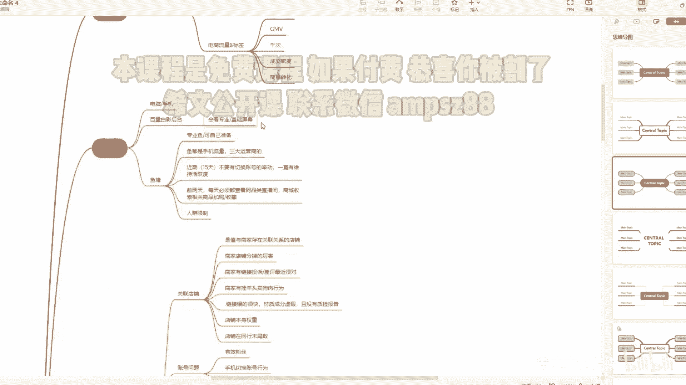

这个这个这个打开一下过一下啊，一般来说啊呵呵这个这个耐心点耐心点。

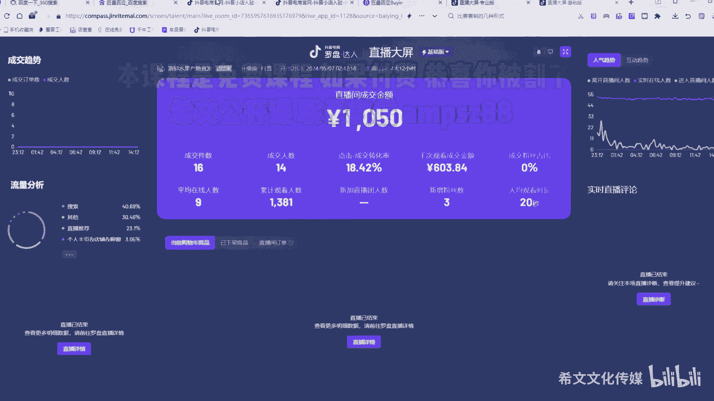

怪我啊，怪我这个没注意，我去没注意，没注意录屏啊，我重新给大家录一下。

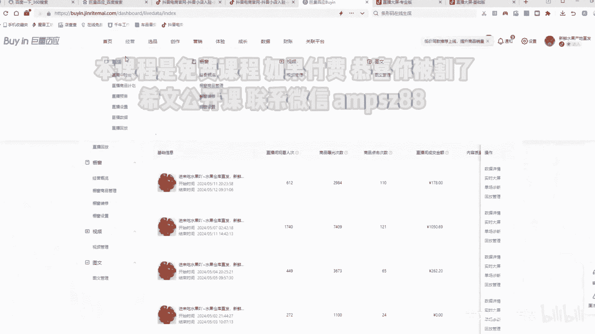

一般我们来到这个直播中控台啊，在这啊，在这啊，它会有一个什么这个5分钟的成交啊，那个人进进人啊，这边有个大屏监控点进就行，就是专业屏啊，专业屏里边我们点击数据点击正常是这样啊，点击流量分析。

点击流量分析啊，这个黄线就是直播推荐嘛，点赞啊，然后一般蓝线是付费的。

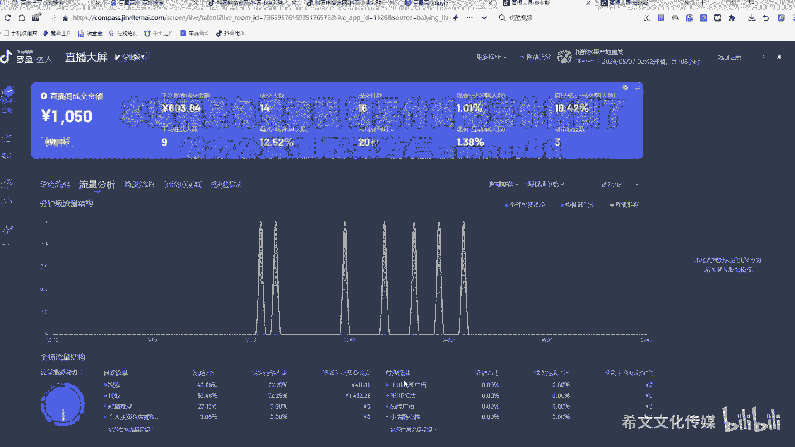

基础屏是在这挑这挑就基础平啊，就就就就这种状态，我说的打面板权重啊，都是这个哈，下回你们也提醒我一下这个KK开录屏。

然后用鱼的话就是要要要有几个注意的啊，就是可以自己准备啊，也要用不没有了哈，自己没办法准备了，就是要用鱼这个用专业语用好点的鱼对吧，这个鱼在做你的任务期间去给你直播间的时候，建议都要用手机流量。

三大运营商的，不要用这个什么人物联网卡啊等等啊，另外一个就是鱼一定要注意他，四五天之内不要有切换账号的举动，而且鱼要一直保持它的活跃度，就是他要正常使用的啊，然后那个我们用的都是三天局。

前两天就是看同行的品类直播间，去经常去看点击点击人家的小黄车啊，点点品看看先品的详情页好，最好去商城里边专门搜这个品啊，然后那个加购加收藏啊，另外一个就是人群限制，我说这个举个例子啊。

就是我们再去用鱼的时候，一定要限制人人的性别和年龄啊，比如说你卖女装一定不要用这个账号假，哪怕是背后操作的，这个人他是男的对吧，然后他的账号只要是女性标签，45岁的你都可以去用对吧。

你要保证你的鱼的标签是要对的啊，另外一个就是断流原因分析啊，一个是关联店铺的啊啊他有两个方面，一个是你带的这个品，他的商家店铺有问题啊，一个是你账号，因为有很多号是你买的子账号。

你的主账号的主店铺它有问题啊，他也会有限流呃，两个方面啊，一个是店铺掉分掉的比较严重啊，呃有可能是品的这个，他的主店铺掉分掉的比较严重，另外一个就是有可能是你这个子账号。

主账号的这个店铺掉分的比较严重啊，另外一个就是商家有投诉和差评啊，这个也是啊，一个你品的店铺和你的直道号的店铺啊，有时候大家说你我这个品带的没问题，嗯感觉没问题啊，但是我说你的号是是开的子弹号吧。

好我说你看看这个关联那个人的总店铺，是不是最近投诉比较多一些，也会影响你限流哈啊他一看哦，我确实是啊，大家一定要注意这点好吧，然后那个另外一些就是商家有挂羊头卖狗肉的，你比如说他标牛皮材质。

那发货是布的布的材质啊，挂完羊头卖狗肉的，另外一个就是比如说这些品报的很快，但是抖音要管控它啊，一查你的成分又造假，你又没有质检报告，就会导致你的店铺，你的关联的达人都会啊，另外一个就是店铺本身的权重。

你带的这个品的店铺本身权重它就很低，所所以说你的骑的时候就比较吃力啊，就流量会差一些啊，有时候也会断流啊，建议起号的时候啊，用比较好点的这个店铺的品啊，爆点的店铺的品啊，嗯然后那个你如果说想带自己的品。

那你就是在起号之后可以带走自己的品，账号问题啊，有效粉丝好吧，有天窗真人粉不要互相关注的啊，手机情况账号就你在直播前15天之内啊，都不要有切换账号的行为啊，那另外要保持这个账号活跃度。

然后直播设备就是我刚才说了，就疑似无人直播啊，什么意思啊，就是他没封你，他感觉你是无人直播，他给你限流啊，这个就是你你你再去拍他的时候，你用第二场你拉的时候，你真人去拉流量比这个好。

你排查先排查店铺问题品的问题，账号问题再排查排查你这个直播，这没问题，这个这几个是从上往下排排查的啊，大家不要弄错，行看完那个，大家也可以聊啊，聊聊可以聊天啊，有什么问题可以在这个屏幕上打我做回复啊。

然后那个一步一步排查，然后接着讲啊，这个该设备啊有重大违规和监控被监控了嗯，包括电脑和手机，就是你登的这个手机账号，都在这个以前那个手机啊被封过，被封过12分，那你这个建议你刷刷机再去再再去登号好吧。

然后你登过的电脑啊，那个以前经常被封过啊，你也去处理一下，一键修改仓库去处理处理一下是吧，然后那个你看我这里写的，就是手机有无重大违规啊，被关联是吧，或者是这个实名人有没有重大违规被关联。

有时候我们发现啊，这个人他的第一个账号那个12分了啊，然后那个被解出来之后，它往往他的流量不会很好，或者说他的权重会很差，需要打很久才能把这个题，当然这个也也也有例外的，也有解出来就好了。

我们发现一般哈，就是这个和这个人超过两次以上，你再去注册的新的抖音上去干，往往都是断流，往往都是断流啊，所以说自己的号且行且珍惜啊，然后网络的关联这个就不用说了啊，有些人还在问我，网络关联是什么。

一机一卡1IP，一个电脑，一个一个光猫，一根网线，一个电脑一个号对吧，这个这个都注意，不要再问我这种小白问题啊，那个那个那个一个光猫连多个路由器，多个网线连多台电脑能不能行，这种问题啊，百度一下好吧。

这肯定不行的啊，包括这个MMAC地址被平台记录了啊，这个都要去修改一下啊，或者是你直接换光猫，或者是直接的把后台去重启，这个我之前讲过那个网络怎么处理不，这里不是不知获得奖，然后再去判断一下。

是不是自己直播过程中出现了一些违规啊，嗯这个是我们一定要注意的哈，呃第一个话术B端弹窗有这个这个有问题，而且且且啊提示没啥问题啊，提示没啥问题，掉信用分了，你就有可能会被限流，尤其是话术判你虚假宣传。

第二个就是画面啊，违规或疑似违规，我们说之前带女装的，有个女的在那脱衣服，可能有点暴露，那那那个到后来到3月份，4月份去用了，那个素材都不好，流量都不好，都会谈一个这个这个比较敏感的一个违规啊。

所以说也要去判断一下这个花美有没有违规，一般来说没有太大的违规啊，然后直播间的素材违规啊，包括摄像头违规啊，低质谈低质啊，弹两次以上就会显示好，然后那个我们说了啊，在在起号阶段你谈违规啊，虽然说这个嗯。

他第一次我们说可能对流量的波动不是很大啊，但是谈必须必须会掉流量啊，必须会掉流量只是掉了多少的问题啊，建议就是一场直播不要弹两次好吧，不要弹两次，弹两次你就下了，就是就下了啊，如果说有扣分。

我们就停播一段时间再去搞啊，呃然后封面和标题敏感进行违规啊，然后那个品的那个投诉过多，那个那个虚售假太多对吧，然后账号的这个数据越来越差，卷不过同行是吧，你越打越差，打了那么一个月了。

两次233个两三个星期了，我建议啊这个号就别用了啊，因为你的数据跑不过人家了，你越跑你数据越差，你要你要么就用于直接往里边死冲，要么就用付费给他冲起来，但是往往这个过程很痛苦，又很烧钱。

建议这种靠注销对吧，注销再来一遍好吧，一模这种是最节约成本的好，然后你那种越来越差的话，会肯定会导致你本身的流量渠道太乱啊，就我刚才说的啊，我们的网络渠道肯定是这种，肯定是721是最好的。

或者是6631啊，60%的推荐啊，二十二十%的付费，10%的就是头条西瓜加其他加搜索啊，这个也是60%的直播推荐，30%的这个付费好，10%的其他啊头条和关注啊，都都是10%，这个是健康的哈。

除此之外啊，这个这个都稍微有点不健康，但是你起号阶段不用过多的去关注啊，起号阶段不要过度限度关注，主主要是你的稳号，这个你号起来之后你要稳住，你就要看这个啊。

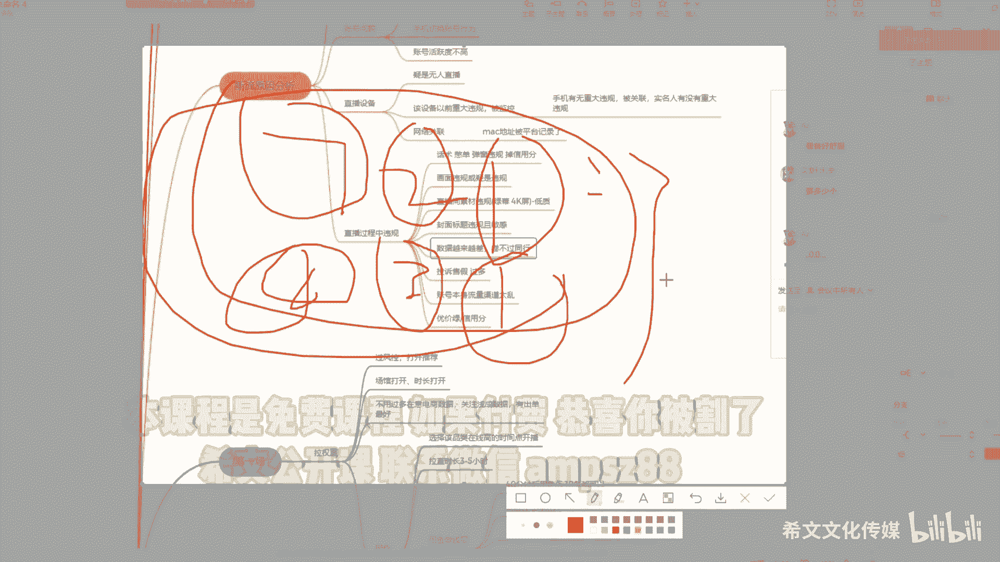

我们说这个这个流量加固是比较健康的啊，溢价率溢价率这个这个不会看油价率的，一定要学会看，在首页看这个价格表现啊，如果说掉的很厉害，那他肯定会限流的，口碑分对吧，我们说现在有口部分清零，你越来越差。

你流量会越来越差啊，随着你的成交的单越来越多，你口碑分会往下掉的啊，信用分我就这个就不用说了对吧，好这个以上的这个断流了，一定要去排查，逐一排查好吧，逐一排查啊，这个这个大家也去看一看。

这些学会排查一个号，那你后来出现断流，你都会排查，好回归正题啊，再正式讲啊，三天的这个四天的这个这个起号的一个操作啊，我们说讲第一场我们应该怎么干啊，这里还是不不分那个无人和真人哈。

那个真人直播是最推荐的啊，当然无人直播也可以这样搞，无人直播也是一样的，没没啥问题，只不过你准备的话术要好一点，第一场我们叫拉权重啊，呃正常不是一开播就断流吗，你拉一拉啊，你要么就两种方式嘛。

我之前这个4月份我讲的就是做这个叠头，强行给拉把权重拉起来啊，或者是你就拉时长拉权重也可以，现在主流的玩法就是切了啊，就切成了这种拉时长过风控的权重，当你用之前的截图用的习惯了拉权重。

做面板数据拉权重也可以啊，也可以啊，这里我现在啊推荐啊，就是那时候，大市场好，这个主要的目的就是播风控打开推荐啊，我们还是要为了打开推荐啊，这个把藏关打开，把四窗给打开啊，这时候我们不用过多的在意。

电商数据和人群标签，不用不用过多在意对吧，我们关注的是什么浅收数据啊，过多的就关注浅充数据，把你的直播推荐打开，有流量进来，先别管成交，当然有成交是最好，有成交是最好，怎么操作啊。

第一个你肯定要选一个该品类最高点的，这个最高的时间点点去开播，你比如说你卖老年品，你大晚上去卖老年品，你觉得你好干嘛对吧，有些人就经常问我卖一个老年品，老年的那个那个女装，为什么晚上销量这么差啊。

为什么都打打号，打了那么多天起不来，我说你几天几点开播，凌晨一点，我说凌晨一点，老头老太在是不是睡着了，或者是这个想给这个老头老太太买衣服的，那些宝妈们是不是也该睡觉了，我说只有咱们这种对吧。

小小年轻对吧，可能对吧，还没睡觉，但是人肯定会人数肯定是很少的，你要选一个相对来说这个品类再高的啊，这个这个稍微好点的时间去开播，也不是说非得给人家抢流量是吧，你选一个比较正常点的时间。

你别别这个你比如说你卖老年品，你非得干干晚上是吧，多不好啊，你要明白你的品在什么时间干好，你要不懂的，你就看看那个同行的数据，他们一般在稳号期间都是同一个数据去开播啊，统一这个时间段去开播。

然后那个拉时长拉不拉多久，3~5个小时好吧，3~5个小时都要用鱼啊，用鱼啊，用余这时候用余时干什么，做浅层数据，做浅层数据好，然后45分钟之后好，我们再去用鱼是吧，5~10条都可以是吧，你可以用五条。

也可以用十条，根据你的品类来啊，你去看一下，你如果说去干的这些品类，你比如说我去卖一个女装，我一看打开双方直播间，我靠都是百人在下，千人在下，你你那个你尤其是千人在线的直播间有好几个，你放五条。

我感觉这个光坐铁城跑跑跑，别人都不一定能跑得过，知道吧，你这时候就要放个十，你放十条啊，也要根据数据来啊，当然这个还是根据你自己自己的品哈，自己的品，然后那个呃鱼怎么进来啊，前两天还是做这个事啊。

前两天还做这个事这个事哈，查看同行内幕啊，首先你这些都是弄好的啊，你在去用品的时候，你就就要交代好，给堂主交代好这些事，然后这时候你开播的时候，他就进来啊，鱼一定要从鱼是什么，鱼就是刷手明白吗。

就比如说淘宝有刷单的对吧，给你做假数据的明白吗，然后那个嗯嗯，然后那个呃544十分钟之后再进啊，40分钟之后再进啊，前40分钟不要进，40分钟之后再让他们进啊，然后进入之后在你直播间里待5分钟啊。

打打评论啊啊做做潜入数据啊，互动互动啊，点点赞啊，不做关注啊，不要做关注好吧，然后让他这时候再退出去，待五到10分钟，他就退出去了，这是去干嘛，去同行直播间里，为什么要去同行直播间里去。

把同行直播间的人粘人过来，我们去粘人的，明白吗，这个搞过淘宝的，大家都知道好吧，截流啊，然后那个等着来个电话嗯，然后那个我们去粘人啊，粘的一些人都是比较好的，相对来说比较精准的啊。

去同行直播间里边让他待五到20分钟，最好待五到10分钟，五二十分钟太长了，好在再进来啊，在同行直播间里要做几个事啊，互动点赞，诋毁同行，诋毁同行，哎，你这个品怎么那么贵啊，你这品是不是不好啊。

诋毁诋毁他啊，让让赛马稍微往下降一降，降一降才方便你起号嘛对吧，然后那个最好是在同行直播间里拍下不付款，或者是哈最损账，拍下付款之后立马退款，为立马退款，知道吗，这样的话是对于同行有一种伤害。

对于对于这个鱼的标签，还有这个这个包括它的这个权重会更高啊，做这个行为，但是不推荐啊，太损啊太损了，但是大家都很损啊，这个企划阶段就不要以君子之道啊，论这个这个论这个事了啊，我建议都这样干就完了啊。

然后第一场安排一个鱼，你比如说你用五条鱼，你就安排一个鱼去去下单啊，或用四条鱼，你就安排两个鱼去下单，注意一点，不退款不退款，明白吗，你哪怕把这个钱包给这个包给这个余地都行，知道吧，你就不要退款。

退款会影响你的起号的节奏好吧，然后那个呃当然啊还有一种方式啊，就是你给这个这个给那个谁啊，给这个商家去谈，让他发空包，明白吗，发红包啊，然后这个嗯返返钱嘛，啊这个就是我们说用淘宝的刷刷单的思路。

有的商家同意啊，小体量的商家同意，大体量的商家一般不会这样做啊，对他的店铺有风险有风险，发现会发现他发红包会会制裁他，所以说啊，这个还是自己掏钱啊，掏点钱呗吧，你跟他价九块九了，你掏一单能怎么地对吧。

然后那个这个不退款吧，千万不要退款，另外一个就是这个而且还要让他好评啊，一定要让他好评，因为好评呃，好评之后会对于你的店铺会有一个抬升的啊，流量层级啊会有一个抬升的，这时候就是你在直播过程中啊。

3~5个小时你也要要去做互动，而不是光光靠鱼对吧，你要配合话术对吧，然后做填充数据，点对点怎么说啊，你比如说现在我这个就是看板啊，这么多人，我说小明小明大哥啊，你在我直播间里待了这么久了。

你你是哪里的啊，你是河南的吗，你看咱河南卖的这个什么卖卖的某某某饼，你吃过吗，小时候我们经常吃啊，那个那个那个那个你你你小时候没吃过吗，你你是几零后，你就给他留是吧，让他给你回啊，他聊不动。

你就聊聊下边这个人啊，就强行互动对吧，让他给你做前程，你看大哥，你做做了这么久，你去看看小黄车吧，能成交一单是一单，知道吧啊成交不了就无所谓啊，把浅重做起来停留互动对吧，关注这几个点做起来就好了。

然后那个嗯看黄线啊，要学会看黄线啊，一般用鱼之后就是一般用鱼之后40分钟，用鱼之后不会特别差啊，如果说啊，如果说你的曲线就是用于之后，你的曲线很差很差，你尤其是鱼在做你这个任务的时候。

根本就通过广场刷不进来，他提前给你店铺，哪怕是给你这个账号做了数据，就给你的短视频账号做了数据啊，给你的这个这个这个店铺，这个给你的账号做个关注啊，再去广场退出去，再去广场上去刷啊，然后还是找不到你的。

还是找不到你的那个找不到你的店，这个这个直播间，那肯定你要排查排查了，肯定是你的账号有问题啊，你要赔偿赔偿了啊，一般来说你的账号如果说没有什么问题，一般他是能找到的，能找到的啊，我们还有4分钟啊。

还有4分钟，然后一会儿我一会儿它就会关掉，关掉之后我会立马发号啊，接着就会讲，大概等34分钟就会讲啊，大家还是尽快进啊，啊没听到的，可能一些细节啊，你们没听到，对于你们来说，我认为是一种损失。

我今天讲的很细啊，咦我之前都在想，那讲那么细是一对于我们来说是一种损失啊，哼99块钱，那这就是一种损失啊，这第一场干的事啊，第一场还有不明白的吗，先问第一场有不明白，拍的吗，不明白的赶紧问好吧。

录了录了，我这刚才还补充录了一次哈，赶紧啊，趁8分钟我们问问第一场还有不明白的吗，好明白的都扣个一好吧，你让我知道你们呢在这个个个这个这个存在啊，有回放有回放，其他人其他人赶紧啊。

稍微懂了就慢慢懂就好了好吧，讲第一场啊，我们还是以这个权重啊，以权重为主，主要是打权重啊，你不要在乎太多东西，你在乎的东西越多，你越难干啊，注意用鱼的技巧啊，对的鱼一定要实名，他一定要实名的啊。

要不然他没办法给你拍，做电商数据的鱼一定要实名，你如果说啊这个鱼我们说是你是卖课啊，干娱乐，干其他类型，不做电商数据的，他可以不用实名，因为他只做，他去了，你直播间只做什么，只做人气数据啊。

他是不考核的，就是抖音好友，抖音好友的前提就是你找身边朋友可以啊，但但是不要提前关注我啊，但那你添加关注，那不就知道你是刷的吗啊，这个而且公式不是什么意思啊，这个警告光号扣分怎么做，而且公司都一个网。

你就扯网线呗，23块钱一个月谈一谈，没那么贵好吧，有网线啊，第一场不用微付费，我们现在在在讲的就是用鱼去破一破啊，不要去用微付费了，第二场我们去打微付费，第一场如果说黄线不够拉丝长，黄线都破不了。

而且就是越拉拉的越久，一般来说啊，账号同城给同城鱼嗯，也还可以也还可以啊，但是啊不推荐啊，不是很推荐自己养的鱼，大部分都是同城鱼，建议啊建议还是那个转专业鱼塘好，那个我把我打断了哈呵呵八长大了啊。

我接着讲啊，就是这个你账号你在这在3~5个小时之内啊。

我画一画，我简单画一画，我们说正常账号，正常账号，哪怕是你你有点断流，你期期间你是没有流量的，但越拉越长，一般是在两个小时以后，你肯定会分限流，真限流，哪怕是真限流的密度不是很大，他也会给流量。

如果说拉到3~5个小时，都是都还是断流。

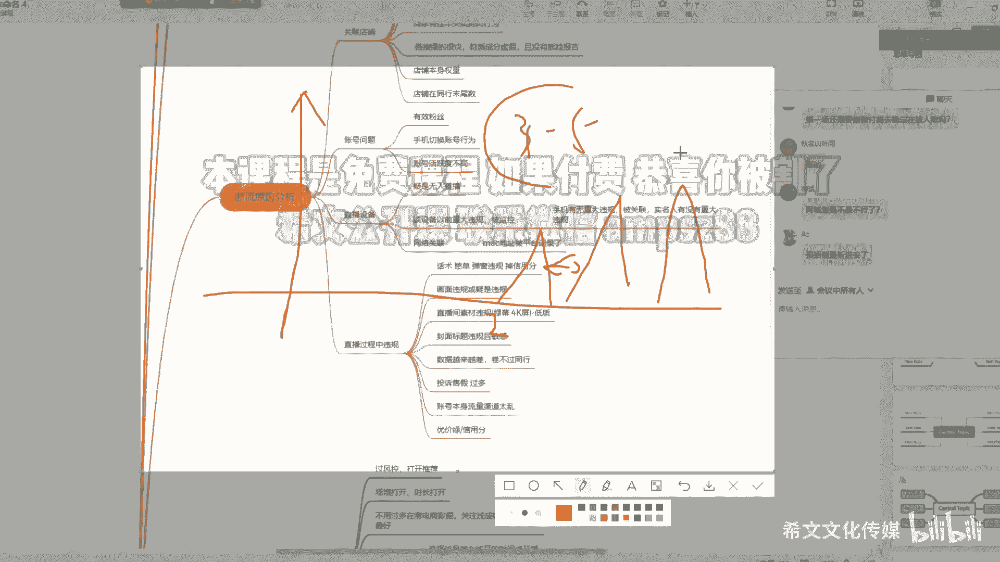

一定要排查问题，一定要排查问题，肯定是有问题啊，按照这个思路去排查，来店铺账号直播设备，直播过程中的违规，对对啊，一两个人都可以，但是你不能不能说这种射手也要断流啊，这种也叫断流，什么叫断流啊。

冒了一点，隔了很长很长时间又冒了一个头，这也叫断流，我说的哪种啊，就比如说，哪怕是隔35分钟啊，都45分钟啊，有一个两个流量，那都还可以，那你隔的时间太久，那肯定就是断流的一种行为，好吧。

还有其他问题吗，没其他问题，我先把这个关了啊，然后大家尽快进好吧，没其他问题我就结束了啊，好我第一场讲完了啊，第一场讲完了，有问题就问啊，我们再留2分钟好吧，留2分钟看有有有什么问题。

包括鱼的细节都要问啊，这个包括叠图，你们也可以问叠图的那个方法啊，一般我叠图就是4分钟，我一看他妈不推流了，三品打进去一般都是2+3。5加六，或者是嗯两个小时的这个自动推荐大成交啊。

主要是还是配合那个什么一般无人用的比较多，主要还是打面板数据啊，那个也是打面板数据，强行的把这个权重给拉上去啊，也一样的道理去，其实你要明白这个底层逻辑都是一样的，都是一样的。

其实所有的方法它最终的逻辑都是一样的啊，可能我讲的不是很专业啊，但是我参加的这个那个这个抖音的正规培训，比较多，听着听着就会了啊，有什么这个我讲的不对的地方，也希望各位同行啊同仁啊，批评指正好吧。

可能是我在对吧，去去实操的过程中啊，这个这个这个理解还不到位啊，行我们开始讲话，第二层嗯，第二场很关键啊，第二场很关键啊，第二场干什么做递增啊，做什么递增电商数据的递增啊，开始要做好，第二场。

就我们要考虑电商数据了，第一场我们是为了是把权重稍微拉一下啊，问一下啊，可能就是我们先把这个风控给过了，我们知道啊，信号一般来说会是有一定的这个风控了啊，尤其是我们现在啊，尤其是4月份之后。

不建议第一场上来干那个无人啊，因为上来干无人是有一定的限流的啊，无论你用什么途径啊，我可能会有个别例外，就上来会有会很好，但是我们实操了很多，很多号发现第一场一般限流都比较严重啊，比较严重啊。

然后那个做递增啊，打标签，从第二场开始打标签了啊，注意听啊，就是第二场一定是在第一场，没有任何违规的情况下，话术违规也没有，第一次也没有啊，也没有低频互动啊，如果说有啊有违规，你肯定你的流量不好啊。

那我们就不做第二场的动作，还是重复第一场的动作好吧，还是重复第一场速度，这这这句话你没有听懂，就我我在第二场的时候，如果说第一场我有违规，我就不要用第二场的方式了，我还是做第一场的数据啊。

违规大了我就停播一天啊，第一你比如说5月2号播好了，又违规了，5月3号不要播了，5月4号的播重复第一场的数据的行为，知道吧，然后看第一这个看5月4号了啊，5月4号了还可以，我们就干5月对。

干5月这个这个5月5号是干第二场，干第二场的动作，好实操，预埋玩法，一到200块钱的随心推上来就干，开播就投，开播就投，怎么投，两个两小时的智能这个成交智能配件啊，可以限制一下。

这个可以限制一下相似达人，但是一定要达人要和你这个品质相关的，提前找，提前找这个8~10个账号这个对标直播间啊，尤其是他这个撇翻动不是很大的，你不要找那种限制达人，你一收百货哗哗哗你就加进去了。

不要那样干，不要那样干，知道吧，他卖的百货太多了，总太百百货，你细分下来有很多东西是吧，你就要找你这个品要相似，拿来啊，你比如说你卖苹果，你找几个直播间，记住他的名字给他加进去啊，你不要找水果是吧。

你有收水果，那水果店铺他有很多对吧，他可能他那个直播间里他卖卖榴莲卖的好，他也叫水果对吧，某某某水果直播，你这个这个直播批发商对吧，他但是你给他加到相册达人里边了，他根据他的这个底层的标签给你推人。

为什么不成交啊，你过来问问问我为什么不成交，我问你你他加的你他你加的这个人他卖什么，你你一看卧槽，他卖榴莲，我说他卖榴莲，他怎么能成交，你的那个苹果呢，明白吗啊，一定要注意这点啊，然后用余额用余。

然后这一场用的鱼肯定是第一天用鱼的倍数，用鱼的倍数啊，然后那个啊用语我再多说一句啊，如果说你的口播能力很强，你的主播能力很强啊，你可以不用语，你可以用你的话术和你个人的魅力，包括你的品。

包括你的直播间的场景，搭建人货场三种去做这个数据叠加也可以啊，我们的用鱼主要是为了把数据去做起来，走捷径啊，如果说你不想用，那也那也那也可以，那就考验你的人货场好吧，然后咳开播25分钟啊。

你就尽量一到两条去做浅尝，还是一样重复上班的行为啊，进去5分钟退出去去做同行直播间里的动作啊，45分钟再进一到两条，陆陆续续的进，不要一块儿都进，不要一块录进，陆陆续续的进，然后进四条之后啊。

假如你用十条进四条之后好了，这时候你要判断啊，因为你投流了，你要有真实成交，你有真实成交的时候，你的余一定要跟拍，什么叫跟拍啊，就是比如说你上一秒你的付费也好，你的直播推荐成交也好，有成交了。

这时候你让你的鱼赶快再去拍一单，拍一单你的东西啊，然后那个为什么啊，我们知道啊，上5分钟的成交密度，完全决定你下5分钟的推流速度，这个逻辑大家都懂啊，这不用多讲了。

所以说我们要做的就是这种成交密度的递增啊，也是递增，什么意思呢，就比如说你在5分钟，5分钟之内啊，5分钟之内啊，有成交一单，你跟拍了一单，这两单对吧，后不一定在下雨5分钟，可能在下一个时间段。

5分钟之内成交了两单，这波推荐成交了两单，你这个时候要用余价成交两单，那做倍数要做第一单的，第一个时间段的倍数是吧，才会决定了你下一波的流量的大小，这样的话推流是源源不断的，听懂的扣个一。

没听懂的扣二再讲一遍，这没听懂吗哈，前一场不推荐退款啊，不不推荐退款，可以给他聊一聊，发红包好吧，就在就就就那几个同志比较活跃嘛，其他人都都都都挂挂播吗，哼没听懂再讲一遍啊，比如说啊。

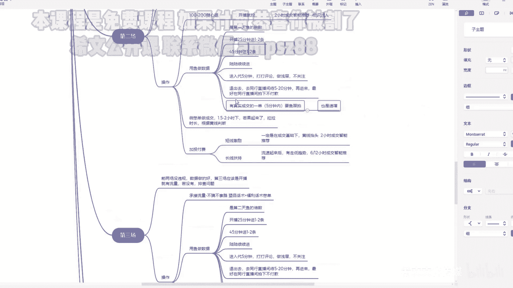

比如说我们在我假如说啊在5分钟到10分钟，十十五分钟到20分钟，这不都5分钟嘛是吧，假如说都5分钟，这时候成交了一单真实的真实成交啊，哪怕是付费和直播推荐都好，这时候你要运用你的语悦啊，告诉他再去配他。

在5分钟之内完成这个动作，知道吧，然后下一个成交的时候，你可能是十到15分钟没有真实成交，如果说在10~15到20分钟之间有了成交啊，假如说有了两单成交，这时候你要用你的鱼去拍两单。

这两单是完全是第一单的倍数，这个是递增的，明白吗，这个这个明白不明白。

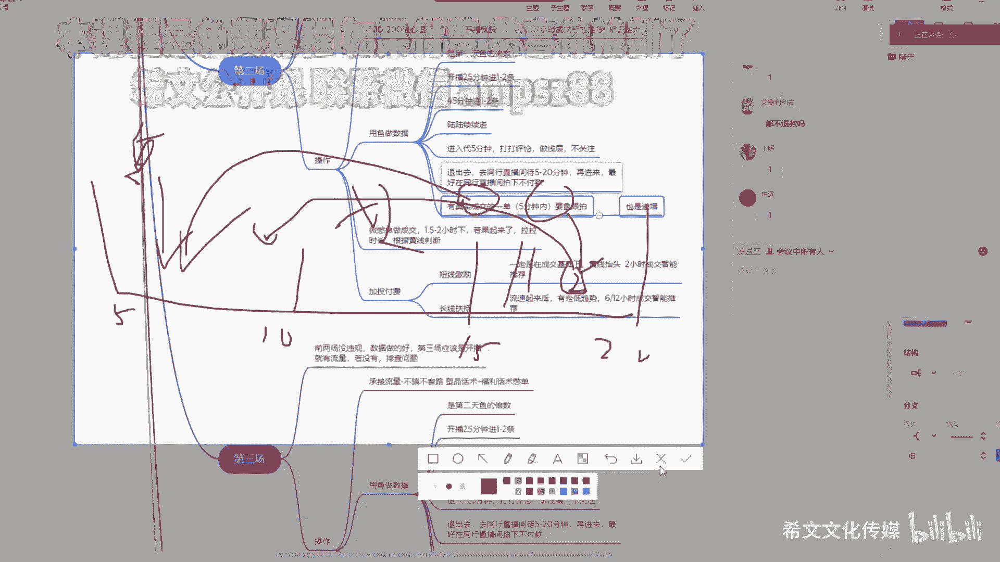

明白扣一明白扣一，可以嗯，这个很关键啊，在第二场你用于源源不断推流的一个秘诀啊，这个是很关键的，很多人不知道用于跟拍这一步，所以它这一步很关键，你用了用你就知道了，绝对好用好吧，这时候你去播的时候啊。

你要用配合未变单，因为你投流了对吧，你话术要改，你尽可能的去促进成交，哪怕是付费的成交，你这时候你就要干成交对吧，然后那个是A1。5到两个小时，我们去判断啊，若若啊起来了，起流了就拉时长好吧。

根据环线去判断，若没有起来，走低了1。5到两个小时之间就下播，明白吗，画一画这个画画流量图啊，比如说这个是1。5个小时啊，你的前边的流量都这样这样了啊，一般状况是这个很好拉四层对吧，然后如果说是这样啊。

下下下来了下来了，下播下播好吧，这个这个这个大家都能听得懂啊，如果说拉四堂的话，我们推荐是两再加两笔付费啊，一个是短线的啊，一定是在有你成交基础的情况下，黄线抬头了。

这时候打了两个小时成交自动推荐看人群，然后长线扶持，流速起来之后发现啊有走低的趋势啊，立马再追投一笔，就是投完短线了，投投完短线了，这个预埋啊，投放短线啊，然后再看这个流量，还有让往下走低。

再打一个6~12小时的这个长线扶持，这个明白吗，然后第二场基本就是这样干，第二场没听懂的，赶紧问，听懂的扣一好吧，留留5分钟好吧，5分钟大家这个不主动，我就当过了哈，就别别再问了。

后来问我这个有没有讲起号啊，过期过后，有没有想问的问题啊，没想问的问的问题扣个一好不好，和硫的用啥用啥都一样，用你那个直播号都可以用，用用小号授权的号也可以，有有有联系我行吗，联系我和小杨哥，小明。

你不是有小杨哥的联系方式吗，你去找他，还有其他问题吗，没其他问题我们就过了啊，看第三场好，第三场还是一定的基础，拉起来时长就不就看多久会下播，拉起来之后流量我跟你说啊，有有以下几个状态啊。

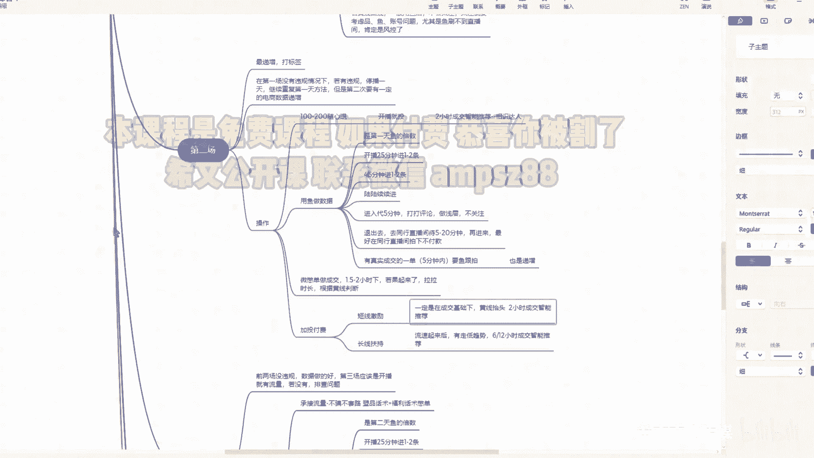

你比如说拉起来了啊，拉时长了或者起来了，这样如果说这样了，肯定是你违规了，或者是你账号有问题了，或者品有问题了，这叫一般会私有违规哈，这时候你要下播了，然后去排查排查问题，但是一般正常状态下都是这样。

我们我们一般都是在感觉要下，感觉要走低的情况下，尽可能的就就下坡，尤其是什么呢，他那个很重要的一个标准成交密度，我说过，这个成交密度完全是决定了你推流的速度啊，如果说你成交密度持续的走低啊。

大屏滚动的越来越慢，那你就下好吧，你第二天第二天就去播啊。

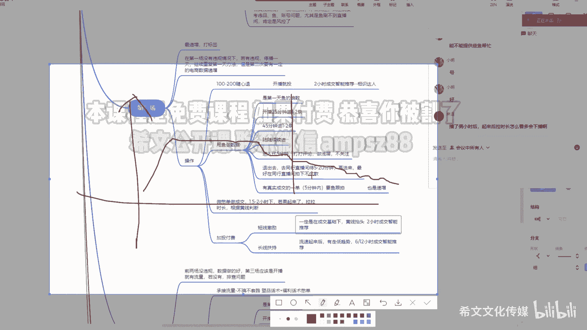

如果说啪啪啪很快再拉，明白吗，第三场第三场还是一定的前提啊，没有违规，第二场数据做的比第一场数据好，要判断一下啊，第二场数据如果说没有第一场做的好，一般来说啊都是做的好，因为你付费了嘛对吧。

没有第一场做的数据好重复第二场的行为啊，然后第三场应该是开播就有流量了，因为前两场做的铺垫好，第三场一般都有流量了，如果说没有流量断流了，第二场还给你流量，第三场断流了，一定要排查你的问题，还是那个啊。

一般啊一般来说如果说没有违规啊，呃还是同样的直播方式，那肯定是你的频有问题啊，你的频为例有什么问题呢，我举个例子啊，之前我们发现有些品就是我们隔了一段时间，有有有成，有有这个这个真实的这个人这个收到了。

他给他打差评了，他会他会第三场流量会很大，或者是在某个就是在你，比如你前两天带这个品还很好啊，可能这个品在11~3天就爆了，1~3天爆的对吧，这时候大家都没搜到这个搜到这个频啊。

我们可以说这个好评率为零啊，然后这个没有这个大家的这个好评的参与度啊，这时候这个这个看到，给个信息啊，然后那个哎呀讲到哪了，讲到这个好搞，你讲一下品的问题了，就是有些品啊可能起的时候品爆的会很快啊。

1~3天之内有的人没有收到这个货，他不知道这个品质好坏，他没有这个没有这个好评率的介入啊，恰巧是你带了这个皮啊，然后有有的这个是那个有的人，他去做做这个品了，咔咔咔给这个品差评率很高，那你带这个品。

我只能说恭喜你踩坑了啊对吧，踩坑了啊，你觉得这个品前期带的很好啊，没想到会是这种状态，一般是那种影响好吧，给我举个例子啊，一般如果说前两场没有问题，一般都是流量会好一些会好一些啊。

起码会比前两场会更好一点啊，好操作啊，这时候你要承接流量了啊，不骗不不套路啊，别别整那些这个这个买一送一，买二送二啊，不要整那些了哈，然后那个因为会有投诉的啊，素品花束加福利话术好吧，加浮力花束啊。

去别单这个花束，不懂的去搜一搜好吧，不这里不做过多细讲，主要讲方法啊，然后还是用鱼的做数据啊，用鱼做数据，这是有个前提啊，如果说你能力很强啊，人货场很强，能人货场把数据做起来。

这里考可以不考虑驴的因素哈，然后这里用于肯定是第二天的倍数啊，一样的开播25分钟进一到两条，15分钟进一到两条，陆陆续续的进啊，还是一样的啊，也是跟拍这里啊，我为什么说要注意做电商数据的递增。

就是你这一场你要去看啊，你要去看，你要去判断，我说你我这一场的数据签字啊，GMV啊，转化率我要考虑考虑，我要比第二场要好，如果说不好，尽快用于补，尽快用于补，假如你这里安排20条鱼。

你可以十条用用来补单，十条用来那个用来那个做浅层也没啥问题，不一定非得全部用来排单，明白我的意思吗，包括第二场，你不一定非得选择用来用来拍单啊，你可以控制一下好吧，然后那个还还是不退款啊，还不退款。

因为现在退款，退款率对于这个旗号还是有因数比较大的，亏点钱就亏点钱啊，亏点钱就亏点钱，能发空包是最好的啊，给那个那个给商家谈一谈，给商家谈一谈，一般你加上他微信，你都能跟他谈好吧，都能给他谈。

然后那个叫什么，这时候我们注意一点变化是什么地方呢，就是我们这里不做那个预埋了，就是付费，一开始不投了啊，我们做什么了，做这个正常的付费投了啊，就是一般我们现在会开始就有流量了，有流量了。

标签稍微有点精准了，我们把极速流打错字了啊，极速流承接过后，成交过后，最好是在有自然成交的基础下投，随心推，100块钱，打错字了，这里不是开播的图，还是两个小时啊，然后只能重交啊，像是狼人啊。

这里就回归了我们正常的这个正常的起号了啊，就是一般来说第三场数据是这样啊，给大家画一画，会有可能前期会没流量，会会来会来一波急速流啊，这时候尽可能的去码贬啊，嗯如果说没有成交啊，我没在集数流承接过后。

在这个稍微有抬头的基础下啊，我们打第一笔付费，第一笔付费啊，一笔付费啊，然后这时候流量会积起来啊，会积起来不会持续的走低，然后然后那个再去判断第二笔付费啊，第一笔付费就是这时候有成交了啊，流量也不会。

也不是这个直播推荐也不贴地的情况下啊，我们还是再稍微走低，我们介入第二笔付费好吧，第二笔付费啊，这里可以打3。5小时了啊，这个是两个小时嘛对吧，然后再打个长线啊，长线的话就是关注一下这个这个一般啊。

嗯有时候我都不关注，我就投完一段时间，感觉感觉该该投了，我就投六小时或12小时的啊，第三笔啊，回归正常了，回归正常图就是这样，这种去打好吧，如果说没抬起来，没流量怎么办，截头一笔看看截图一笔看看。

如果说都没烧，就接头一笔观察一段时间都没烧起来，我感觉有可能是限流了，有隐性的违规啊，有可能就是在后边会给你追封一个违规，或者是在下一场会追封一个违规啊，这这时候去判断一下好吧，有有很多这种情况。

就是这操投了两笔，上一场投投钱还没啥问题，这场他妈投了两笔没收不动啊，要么就是品的问题啊，品有违规啊，两个问题啊，两个问题好吧，去判断一下，一般会一般是违规，违规会这样，一般就是在你违规的前提下。

你的会付费一般是跑不起来的，而且流量会走低的啊，然后到后边就是稳住流量啊，稳住流量加固标签啊，这时候我们推荐啊，我们的流量加固一定是因为我也也打付费了，这时候我们一定要把自然那个成交给矫正过来。

矫正成什么样，它的占比一定是30%以上，最好是50%以上，不要再继续让付费作为主要的了，因为你现在标签稍微精准了，用你的话术福利的话术，竖屏的话术去贬啊，去码贬好吧。

一定要把这个自然成交的数据慢慢做起来，要不然你后来去切这个，切这个这个付费成交和自然成交的，来回切的时候比较慢啊，比较慢，这时候会有一个操作是什么，让鱼可以去做一拖三，为什么呢。

鱼我们可以认为是那个自然自然流量，然后去一拖三，就是一拖三，什么意思，就是一个与派三个链接，或是一般来说我们偷拍说拍三个连接，拍三个连接或者是拍三单，但是我们推荐是拍三个连接。

然后这时候会会为什么要这样干，主要是打的是成交密度，打的成交密度，这个鱼去拍的时候也是一样啊，也是在有嗯真实成交的时候跟拍跟拍，只不过跟拍的时候他不是拍一单了，他可能是一个鱼。

拍三个链接去加那个成交密度哦，就是为了要让它去破层级啊，去破层级加加标签，或者是让自然流去给你拍一拖二，一拖三都可以，就是一个人去拍两个链接啊，应该说姐姐你买的这个裤子，你搭配那个袜子好看，在4号链接。

你去看一看对吧，你今天拍了啊，你明天一块发你都能穿得上，看看这个穿搭的效果，你到时候试的时候也好，事尽可能让他去这样干，主要是为了打成交密度，成交密度打起来啊，因为直播推荐的从成交密度打起来啊。

那你这做这个坐姿，自然成交的这个占比就会往上抬就好做了，知道吧，他口子会给你开大了啊，然后配合着你的话术去做，然后这一场也是关键啊，做电商数据的递增，做第二场电商数据的递增，哪哪几个数据啊。

还是这几个数据啊，GMV千次，这个商品性转化这几个数据啊，一定要看，一定要去看，这个也是一样的，判断就是1。5个小时去判断啊，若若拉起来了就继续拉，如果没拉起来，一般来说第三场1。5小时绝对能拉起来。

如果说没有啥问题的话，如果说没拉起来，你就下播对吧，下播如果说村建数据下滑了，我们重复今天的动作，如果说第三场没有第二场数据打得好，尤其是直播推荐的直播推荐没做起来，就是我们说第三场你要做什么。

做直播推荐的成交的数据，要比第二场的直播推荐的数据要好，如果说没有做好，下一场还要重复第三场的动作和行为，好吧，这是第三场，大家看看有没有问题，有问题赶紧问好吧，对你这个就是限流了啊。

发发发短视频都扣扣分，一般直播是直播的啊，短视频是短视频的哼，有可能一账号本身就有问题，你这号就换换哎，我问一下，我问一个问题，那就是我我们不是想着做无人嘛，那那他妈的像这样子，1234场。

那我们要自己播吗，还是找主播播，自己播最早无有问题吗，哦自己播是吧，建议自己播，如果说你真想干无人干村务人也没啥问题，那你就考虑这个话术的问题，你比如说第一场你准备两套话术，你看你去买那些AI软件。

就是AI话术，你这个AI那个包括技术局也好，小黄鸭也好，是不是给你分了两套，一个叫憋单话术，拉停留话术对吧，一个是我们做素品话术，你准备两套嗯嗯啊两套配合着去播，对我这里讲的是一天一场哦，行行行。

那我先听啊，我建议哈还是真人真转无嗯，如果说不针转五也没啥问题啊，没没没无真转无，是不是就是说我比如说我先自己播了一场，播了一场，在播的同时我我自己录自己录自己，然后等我就是不播的时候，我直接切换。

不是你不播的时候同一场切换，啊啊啊就是同一同一场，我就是无缝衔接，这样切换嘛，哦哦行行行，那我先听啊，第三场数据要就提升百分之几，还是稍有提升，只要有提升就好啊，当然第三场肯定是要比第二场的。

提升的要更大一些啊，有递增，我认为有递增就好，我之前递增的数据也不是很好，但是第市场流量就会很好，这里这个我讲了不分，我开始给大家讲了，不分那个真人和无人，无人的话，我刚才开始讲了。

还是这个准备两套话术，哪怕你自己录自己的也可以啊，当然如果说你无人就一套话术怎么干啊，那你就要用鱼用的好一点呗，对吧，你的你的流量承接可能说承接的不好，那你就用鱼去冲，怎么用鱼去冲鱼。

在做这个做这个直播间里的这个呃互动的时候，他就说哎我已经拍了这个上回收到很好，你是让他们去做直播间的氛围轰轰动，来促使这些人，这个这个这些直播推荐的人去下单，就是羊群效应嘛对吧。

不一定非得用你的话术来勾引嘛对吧，当然话术肯定是最好的，那如果说你话术没有鱼的，这个羊群效应也是也是有效果的好吧，还有其他问题吗，没问题，我们接着讲第四场，第四场就是低市场，一般流量就好起来了。

稳住流量好吧，稳住流量破成绩，然后重新起号吧，重新起号吧，重新换个号吧，然后那个网络也换一换啊，然后那个基本也是重复第三的三天的动作啊，这时候你的用余量要减少了啊，要减少了，知道吧。

你这个可以减至第二天的余余量了，不一定非得非得在第四场做递增了，要根据你的情况来，如果第四场你的流，你前三的流量做的好，账号没有啥问题，你第四场的流量口子一定会很大，就同一时间开播流量口子一定会很大。

然后那个你可以把余量减少成，第二天的这个余量好，这时候呢投付费还是刚才讲的，还是刚才讲的黄线抬头且有真实成交，两个小时打进去，再有抬头，然后3。5小时啊，然后再打六小时或者12小时的打这个穿线。

然后然后这里就是重复第第第第第三天的行为，我就不不多讲了啊，破成绩我想讲一讲啊，怎么破啊，嗯第一个浅程要做好，停留要做好，你把停留能做好，把话术做好，把停留做好啊，你去破层级是非常简单的啊。

然后在一定的时间内，就在一定时间，你假如说在4分钟内啊，你把话术做好，然后停留，把把人给拉住，把人拉住好，然后配合的付费，这时候你可以截图付费，叠图付费鱼进来之前不是进两条吗，多进一些。

要不大不了全都进，你要破层级的时候，然后做成交密度在10分钟，这这10分钟之内一定要把成标密度做起来，而且做的要大一些，动作要大一些，是停留是关键，这个停留是关键，停留起来了，你的层级就好破了。

我们说层级破到260以上，打打付费，你这号成绩就破的很稳了，这时候还是还是要什么呢，之前我们说无人啊，我们要卡什么卡热卖是吧，加上鱼的这个氛围烘托是吧，可以去拉拉停留啊，或者你换一个换，换一个背景。

之前我们呢我举个例子，之前咳嗯我们有两套这个背景素材，一套就是正常的竖屏的，就是展示品的，另一套是什么呢，这个美女露露大腿，拿着这个品呢，找人录的，知道吧，在你想破城级的时候切过来，知道吗。

但是不要暴露的很厉害，要有这个这个背景素材啊，又有一定的的作用，就是吸引眼球，吸引停留的作用，就无人哈，这人你就不用这么搞，切过来，切过来之后，这时候停留会加大，加付费与烘托热脉弄上去。

这时候你把停留做起来，就把这个听说做起来，把这个成绩破了就非常简单，但是这个切过来的素材不建议停留太长时间，容易出违规，知道吧，建议就10分钟之内就把这事干了，或者半小时之内把这事干了就行了。

把事干了就行了啊，然后有的人动作大点的，他敢把这个他敢破成绩的时候，直接切他妈美女没有这个品的事，但是往往有可能会违规啊，建议你切的这个西经的素材，一定和你的品有一定的关系，好吧。

第四场主要是干这个事啊，行这1234市场这个具体的步骤和实操，大家有没有问题，没问题的扣扣一，有问题的扣扣二，赶紧问，三四个人有问题赶紧问好吧，没问题，咱就扣一，咱就尽快过，根据实操好吧。

你可能在别人那里听过是吧，在我这里也听过，可能我的一些细节啊，你可能听得更明白啊，然后那个那个具体的实操细节，可能别人给你讲的没那么明白，其实底层的原理完还是那句话，底层原理都差不多了啊。

前期都打群重嘛对吧，做数据做做数据叠加嘛啊定位人群嘛，稳住稳住人群嘛，做乘积为破那个破层级嘛，就做这几个对吧，最重要的还是实操，我今天我觉得讲的还是比较细的，就讲到这个鱼怎么进怎么进啊。

这个这个呃这个包括跟跟拍啊，这个一定要注意这点啊，这这些小细节去实操，明白了，我觉得你们几号就没那么难了，实操一到两个号，你绝对会玩这套玩法，好吧觉得对，有些人，是的这个这个都99讲的。

我今我觉得今天讲的我我很亏，呵呵NO，我很亏啊，实操一下，实操一下有效果对吧，来群里说一声对吧，没效果，在群里问一问，为啥没效果是吧，还是断流排查排查问题，你这有的人还是说我上来就断流。

就不懂得就去看看问题嘛对吧，第一要懂这玩意行吧，我看那个大家都呵呵哎呀，所以说这个99我讲这个课有点亏啊，同行同行直播间内是同一个产品，在同品种品类建议是同一个产品，知道吗。

建议同一个产品建议是同一个产品啊，朋友产品你好弄啊，标签更精准，就我跟你说的那个打厢式直播间，厢式达人一定是同频同频的，知道吧，你不要打这个同品类的，同品类范围太大，人群更不好精准，哈哈那你比较惨啊。

那你比较惨，好吧这个我希望99元群里的同志们啊，听到你今天讲的还可以有效果，在大群里边讲讲对吧，进99群还是有效果的是吧，不是说你进来操啥都啥都没学会，啥都不跟你讲，就就白嫖你99块钱，说实话。

九十九九块钱我真瞧不上啊，真瞧不上，好吧还还还有一忘了忘了，光跟你们唠嗑了啊，还有一点小赛道啊，小赛道啊，那个我自己最近弄了啊，象棋象棋和麻将啊，象棋和麻将可能之前这个有的人都已经打过了。

有的人都打过了，但是我最近实测，那你想搞点低保对吧，这个工作室的低保去弄一弄电脑就多一些嘛，然后那个去路了，去录了之后，你录录什么呢，我看看啊，你看波二象棋，直接打开看啊。

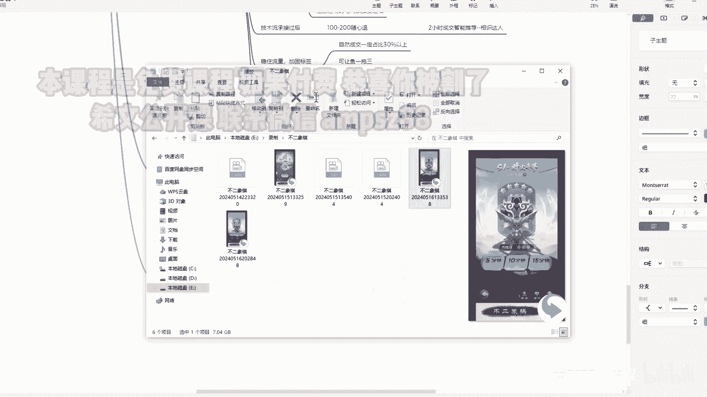

不讲虚的啊，直接打开看，看见没看见没，不要带有那种时间的，这种时间是人人家对齐的时间好吧，不要带那种那种那个这个直播时间了。

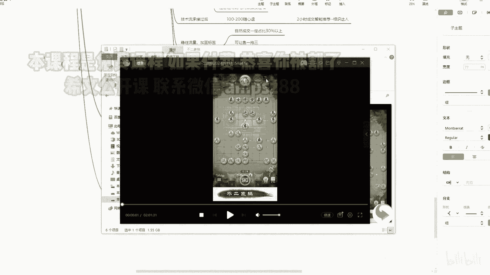

不要有真人出镜了，录这种好吧，录这种录了之后，你近期不要播啊，你不要你看我录了老多了，我录了老多，我几乎几乎每天都在录，然后这玩意儿起流老快了，我感觉这个这个素材我起流很快，然后都是那个男性了。

呵呵都是男性，入职之后放四五天，放四五天，四五天之后你再用好吧，四五天之后也在用，然后他的变现啊，一个是麦克有九块九的课，也有99的课，我觉得九块九的那个就好，然后九块九能挣七块钱一单。

或者是挂载小程序，就是别人点击这个勾勾，像象棋这个小程序啊，然后他没没没下载，每玩一次，每下载一次，他都会给你钱，都会给你钱，只不过这个看钱分多少吧。

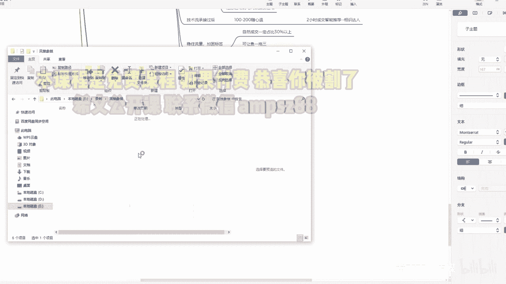

基本都很多都是勾勾勾的这群人啊，这群人有很多人也在搞无人。

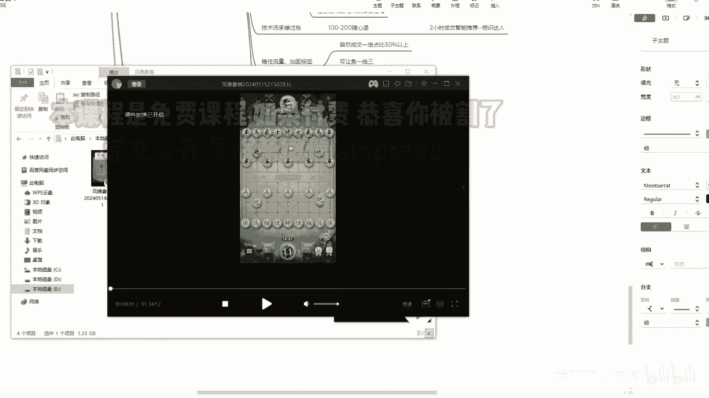

因为我录了，我在用的时候发现了，然后那个搭建啊，搭建讲一讲，直接用welcome推直推是吧，welcome直推顶层放人脸就行了，顶层放个真实摄像头，或者是放个真摄像头，拍转盘，拍人脸都可以好吧。

或者是用x cm加ab电脑，或者是XCM加采集卡叉cm，这个就是之前我讲过，就是那种什么实时收真啊，实时变更啊，那个放在B端啊，B端加个采集卡也好，或者加AB电脑也好，弄过来弄过来直接播啊，直接播。

一般来说没有事哈，一般来说没有事，稳定啊，一天不可能赚太多，因为它转化比较差，但是300块钱以上是有的，你百度搜一下是吧，百度搜一下这玩意儿35块钱一个月，还是永久，我忘了哈，实施抽帧的东西啊。

嗯你或者是买我们的AB电脑啊，我们是把它集集成在一起了啊，或者你们就是参赛M加NDI音频就不用分割，知道吧，因为你不卖货，我说过不卖货，你就不用不用管它，如果说不稳，觉得不稳的话，可以变音。

边音比较稳啊，小黄鸭也能变音，我之前那个那个我们研发的那个软件，也能变音啊，都能变音好吧，稳定在300+300加，这个就是增电费吗，网络挣电费，welcome的变音我还真没变过啊。

我用的都是小小黄鸭变音，小黄鸭变音我觉得挺好用的，听一个啊，听一个，高爆我搞过无人，啥意思就是变没变之前上了分，冰后冰前小黄鸭要钱哪580永久，他就是一个AI软件啊，AI软件，然后听一听啊。

那个小明你不是那个岳父，那个追光者，他不是有那个软件吗，那个或者我给你一套，我给你一套，你你就这么配合学员给你一套吧，最近刚报名了，听听啊，这是我看看这个钱兵因前没因后，眼前就是变形前网变强。

孩子的高考成绩和他所填报的志愿表单，能听到不一一检索，那怎么检呢，一个一个来先检，第一所东北电力，这所学校录取分572，他549钱呢，变变更钱啊，有孩子的高考成绩和他所填报的志愿表单，逐一检索啊。

怎么减呢，一个一个来先检第一所东北电力，听到没有，听到没有，我把这个共享声音给关了，就这个好，哎别关了，听到了吗啊，他是他声音不一样啊，听声音不一样，再听一遍啊，再听一遍，分不够，差老远了。

那你分数优先嘛，分不够，说啥都白搭，录不了对吧，那顺序看第二所吉林财经，这所学校录取分看录取分是541，他549哎够了，我觉得变音对于这种麦克还是卖那个啥，卖这个的，卖卖货带带那个卖卖啥的。

因为我不是有瑕疵啊，我因为我加了一个声音回响啊，加了个环境音，环境音它里边有个环境音，然后边音的话，我感觉我感觉有效果啊，我不知道这个其他人实操有没有效果，因为我前几几次也谈过，也谈过啊，谈过。

然后我编译之后就没谈过啊，我感觉变音还是有一定效果，这个这个这个切克闹啊，这个我不知道你你你有没有试过啊，你有经验可以给大家交流交流，推荐还是变异一下，可能会更稳一点，好好吧，今天就交流到这，有问题吗。

有问题赶紧问好吧，变没12分啥意思啊，变变了就变了，变了之后就扣12分了，还是变没变之前扣12分，我的我一般啊录别人的东西啊，我都是放四五天之后再播，知道吧，放四五天之后补他的这个违规的概率要小一点。

要小一点。

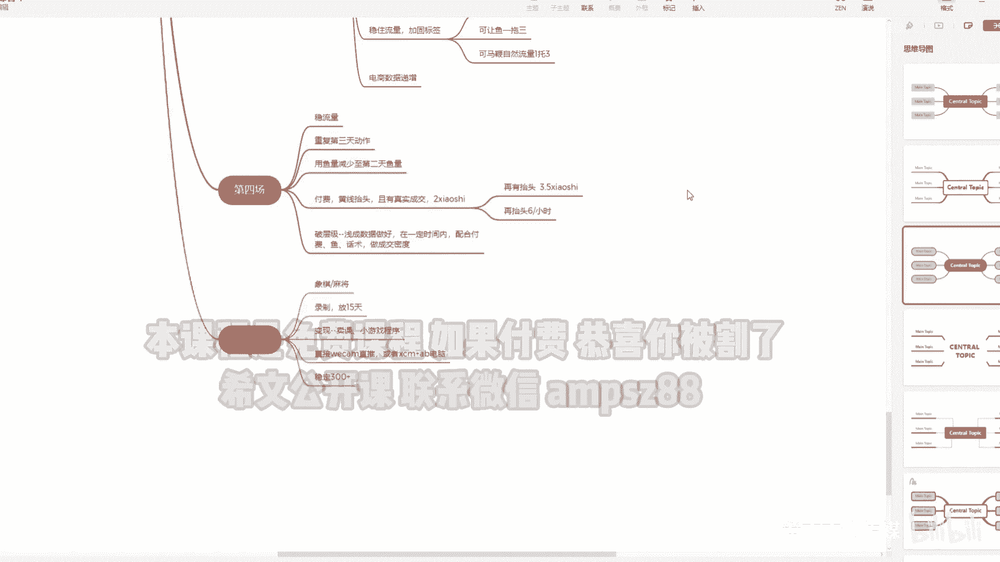

那今天那个那个那个孙博有没有进来啊，往往有什么这个做财经了，我忘跟他分享了，比如说私聊他吧，他那个哎我有我今天下午有点忙。

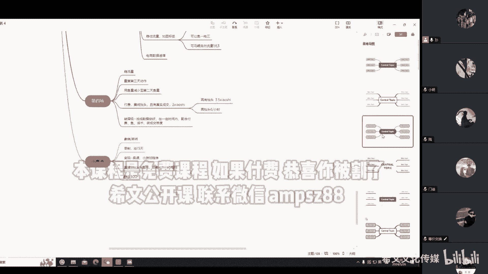

一直忙忙事好，看，变音只是我感觉有有有效果才会才会变了啊，才会变行，大家今天还有没有问题啊，没问题，我赶紧休息了啊，不跟你们瞎唠了好吧，去去去那个400人，几百人群里，你们在这个这个免费群里边嗯。

免费群里边那个说一说是吧，第99群还是有一定效果的啊行吧，那今天就到这啊，就这个不不讨论了，有问题就问好吧，然后那个具体实操步骤啊，可能我们在这个19802980啊，尤其是2980配跑的时候。

我们会有更好的一些步骤和改动啊，这个还是根据启航老师的步骤去去操作，好吧啊，他们配跑，他们肯定是老大啊，然后下周的话，下周的话这个配报学员啊，会更新一个防风的技术，抗举报抗费40吧，因为现在分40。

费40比较比较厉害，养生用什么软件，小黄鸭小黄鸭啊，然后背十字比较严重哈，我们还在测另台电脑还在跑嗯，color现在今天看了他的72个举报没啥问题，然后那个小黄鸭小黄鸭小明。

我不是说你你你那个你私聊我吧，监控摄像头做背景怎么样，不不怎么样啊，不怎么样把监控工厂了啊，会拉停留会好一点，会好一点啊，新软件是小黄鸭小黄鸭，他就是这个AI软件，就是把你的文字啊，这个变成文本。

也也有实时推理的功能，就是大家常卖的嘛，举什么那个这个窜天猴，通天猴，还有那个什么玩意，什么七只猫，之前那个在群里卖的那哥们儿啊，跟我说，他是这么，他是开发者来的，实际上他他妈是代理啊。

问我谈他妈100块钱一个月啊，200块钱一个月，我说这个我们现在都不用要便宜，我就帮你卖卖对吧，我又不挣钱，没打下来没打下来，他说好吧，群主我退退群了，我说你就退退就退呗，你来我群主要是卖你的软件。

你还不给群里的人便宜，是不啊，可以可以对吧，那几个陪跑耳机给定定一定鱼好不好，其他的应该就没啥事了啊，今天就到这啊，今天就到这，有什么问题再问好吧，小黄鸭玩哈，尽快学会这个软件很简单啊，真的很简单啊。

然后那个2980还会有更细的啊型号步骤啊，包括防风步骤会实时更新的，绝对不会让你们2980报的很亏，知道吧，2080肯定是我们的核心对吧，今天讲的肯定是很细了啊，我觉得这个在别人那里卖几千块钱。

都肯定是有的啊，但是2980是吧，肯定会换来我们比较亲密的这个互动啊，比较亲密的互动啊，行今天就到这啊，我一会把这个录制的那个发群里好吧，没有没有没那么幽默，我就我我平时爱怼人啊。

我这个平时不不愿意惯他们对吧，我又不差钱，呵呵测了啊。

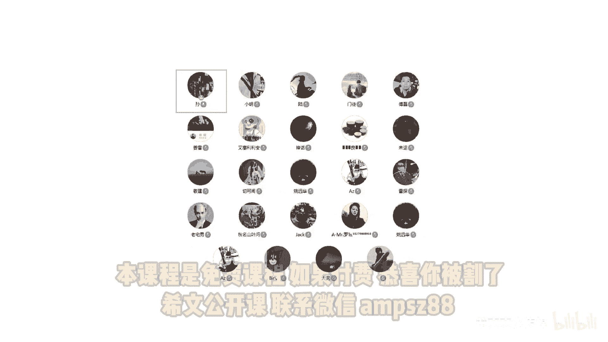