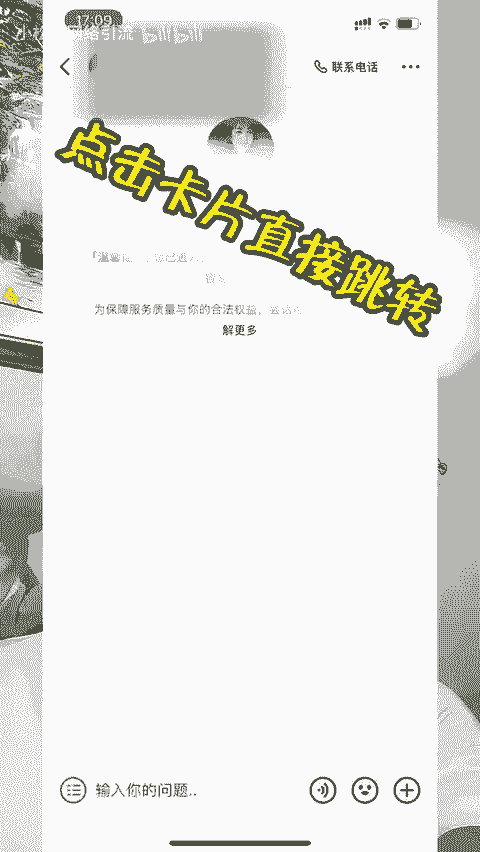
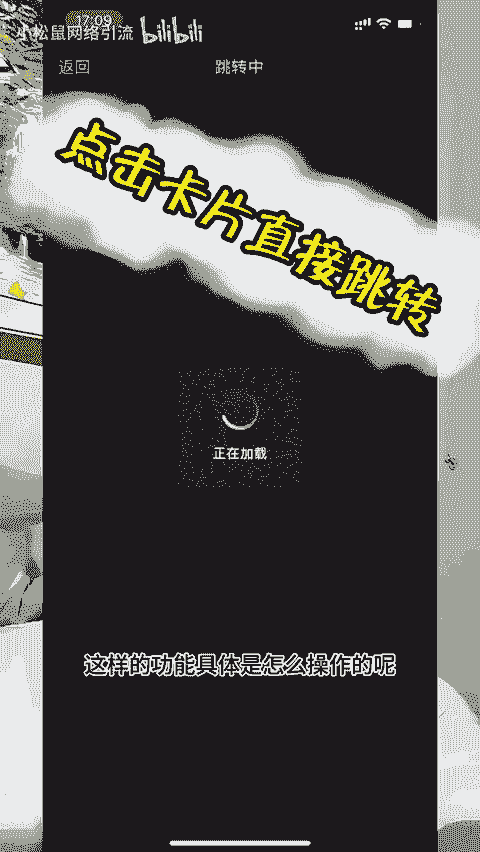

# 抖音私信卡片最新技术可以实现跳转微信详细教程分享 - P1 - 小松鼠网络引流 - BV1vf421q7M9

大家有没有见过这种功能，点击私信就可以自动弹出这样的一个小卡片，点击小卡片呢就可以直接跳转到微信，添加好友。这样的功能具体是怎么操作的呢？这期视频啊就给大家详细的讲解一下。

具体怎么配置这样的私信自动回复卡片，以及配置这样的卡片需要什么样的资质。首先呢需要咱们的抖音号是抖音的企业号栏威，或者说是抖音的普通企业号半蓝也可以。第二步呢就是需要用到咱们的获客平台助手。

咱们的获客平台的话呢，对接的就是抖音企业号的私信自动回复的一个功能。首先呢这个功能是官方的接口。所以说大家使用这个功能的话呢，是非常的安全的。接下来我教给大家如何搭配这个功能。首先呢登录咱们的获客后台。

然后点击右上角有一个新增按钮，我们在这里添加我们的跳转的账号就可以了。添加账号之后呢，后面有一个配置卡片。我们点进去之后呢，然后进行一个卡片的具体配置。比如说卡片的标题头像，这些还可以设。

是否自动撤回，也可以设置进入私信自动回复，或者是用户发消息再回复卡片，这些都是可以设置的。设置好以后呢，点击确定，最后呢打开开关就可以了。如果说你也想自己制作自动回复跳转卡片的话呢，自己不会操作的呀。

分分钟帮你搞定。