# 抖音自媒体短视频运营养号实战零基础小白教程、如何快速涨粉变现上热门 抖店／头条／短剧／推文赚钱攻略 - P10：猜你喜欢的玩法 - 无事打猴子 - BV1x324YVE2y

我们再看一下什么是猜你喜欢适合哪些人来做，我们怎么样才能获取到官方的免费流量。那前面呢我们讲到了啊精选联盟和店铺直播。那这些都是基于我们这个产品，我们自己去找人自己卖，那还有一种呢就是啥都不干。

让系统来给你推荐。这就叫做猜你喜欢，那说白了也叫流量捡漏嘛，也叫做蹭别人的流量，那么猜你喜欢它这个原理是从哪里来的？我们从传统的电商开始说，那淘宝呢最早的话它是一个搜索平台，你搜索什么。

他就给你推荐什么？直到2013年的手机淘宝APP上线以后啊，新的一个概念出来了，叫做千人千面，那千人千面是什么呢？比如说你是一个宝妈，对吧？你去淘宝买了孩子的奶粉。

那淘宝呢就可能会一直给你推荐类似的奶粉给你，对吧？多个类似的产品推给一个人。那这是淘宝，也就是我们搜索电商。但是在抖音上面呢，今天我可能搜索了奶粉。它系统呢可能就会给你推荐宝妈用户群体购买过的相关产品。

那有可能就会给你推荐纸尿裤啊，奶瓶啊。

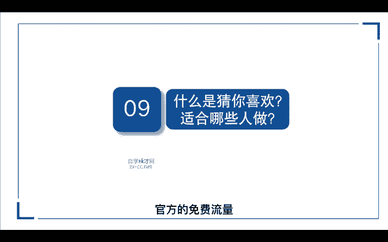

湿纸巾啊给你对吧？它是通过多维度的产品推荐给你多个产品推荐给一个人，这就是抖音。也就是我们说的兴趣电商。那从搜索的逻辑来看呢，一个是单点式的给你推荐一个品类，一个是多点式的给你推荐多个品类。

说白了一个是你自己决策，想要买什么啊，一个是别人帮你做决策，让你买什么啊，这就是淘宝和抖音的区别。那这也是搜索电商和兴趣电商的底层逻辑，对吧？就像我们去逛淘宝拼多多京东，我们都是目的很明确，对吧？

我今天想要买什么，我来搜完，买完我就走了，那抖音呢就是我们可能有时候会刷到一个带链接的视频，我可能点个赞对吧？我可能点点进去看了一下，那他就会根据用户平时刷视频的习惯啊，浏览习惯，以及我们购买的习惯。

和商品进行一个匹配，然后再通过拆你喜欢的界面推送给你，对吧？那么它是通过哪些维度来进行匹配呢？一个是我们的用户的标签，一个是产品的标签。用户的标签呢包含我们的。

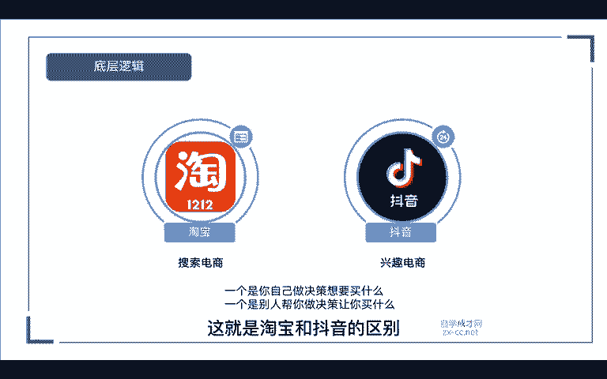

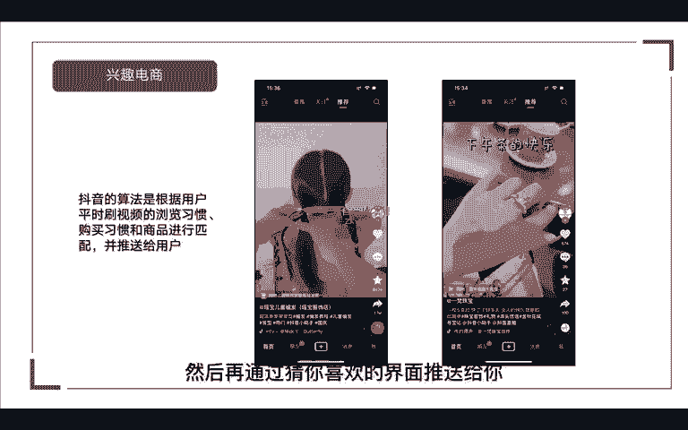

包含了我们的用户性别、年龄、浏览习惯、搜索兴趣，以及我们的购买习惯。那产品标签呢包含了我们的产品主图、价格、产品属性词以及我们的标题，对吧？那系统通过这两个标签匹配到合适的产品后，他就会推送给你了。

那猜你喜欢适合哪些人来做呢。任何人都可以做，包括我们任何的店铺它都具备一个免费获取流量的能力，不管我们是做直播店铺，还是做无货源店群，还是做做精选联盟，我们都可以做猜你喜欢啊，当然那些做过淘宝店群。

天猫店群拼多的店群的人，它更容易理解猜你喜欢的底层逻辑，对吧？那更适合这些人来做，我们再看一下猜你喜欢的流量来源，它的流量入口，主要通过哪哪些入口展现呢。第一个是我们的APP平台，比如说火山视频，对吧？

火山视频今日头条西瓜视频，那当你这产品做到爆款，上了热门的时候，销量高的时候呢，它系统都会给你推荐到这些平台。那还有一个就是通过抖音商城里面精选啊，比如说男装彩妆服肤肤。

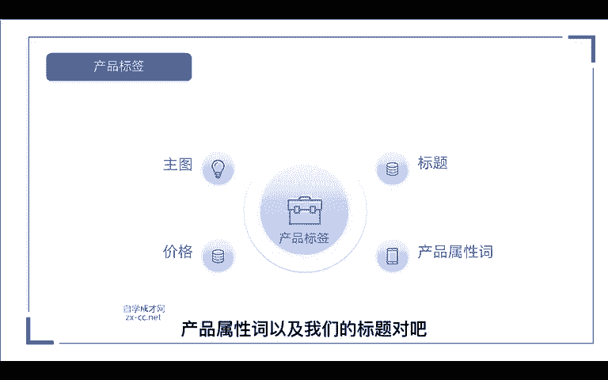

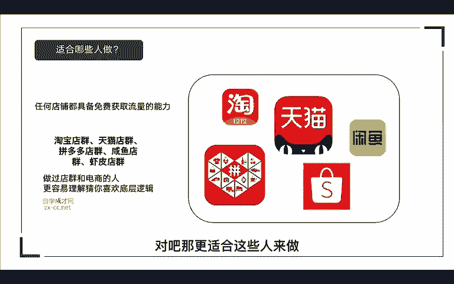

些类目里面，他给你推送出去。那第二个呢就是通过我们的订单页面管理。在我们抖音商城订单，我的订单里面，你往最下滑，它会出现一个你可能还会喜欢的产品。

那么这些产品呢都是通过前面我们讲的用户标签跟产品标签匹配了以后，系统给你推荐的那第三个呢就是通过我们的商品列表，比如说你去某一个直播间看到这个洗衣机，对吧？我们点进去往下滑滑到最下面。

它会推荐一个你可能还会喜欢的同类型的产品给你啊相似的洗衣机，那么上面呢都是我们流量的来源，那如何快速突破重围商到猜你喜欢呢？我们可以通过以下的5个维度，第一个呢，店铺的口碑分，第二个近期热销。

第三个价格匹配维度。第四个小类目榜单。第五个关键词匹配，我们先来看第一个店铺口碑分，里面包含了我们的商品体验服务体验物流体验。这个时候呢，我们就要去思考系统为什么会给你推荐。

那肯定是因为你的店铺综合分数高嘛，对吧？如果你的店铺综合分数不高。哪怕你的销量很高，他也不会给你推荐的因为一旦系统把你的产品。

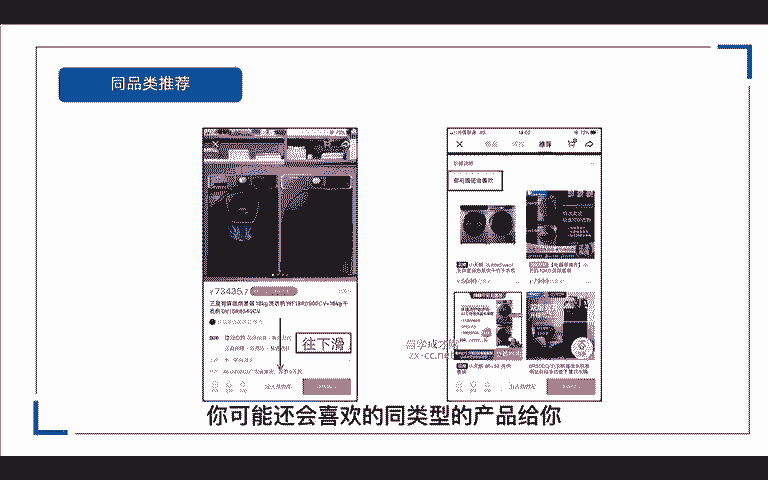

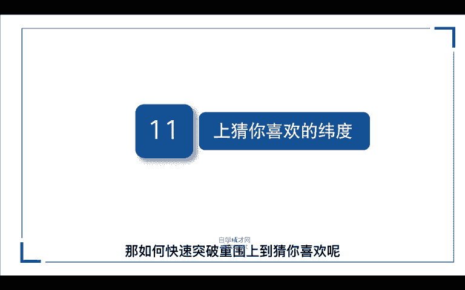

匹配给这个用户，他买了效果不好，他对这个平台是不是就失去了信心，就会觉得这个平台的产品不好嘛，对吧？是一个垃圾平台，就像多多坑一样。为什么大家觉得这个平台产品很不好？因为价格低嘛，服务跟不上，对吧？

所以它所有的综合维度就很低啊。于是这个平台就打上了一个很垃圾的平台标签嘛，所以我们一定要通过这三点维护好我们店铺的口碑分嘛，那第二个近期热销，当我们买完商品以后呢，它会推荐一个你可能还会喜欢。

那这里呢系统会给你推荐销量好的产品，那么你会发现这里所有的销量，不管是这个4940的还是这个7169的，它都是近期甚至是一个月以内产生销量最高的产品，我们通过数据呢就可以查看到，对吧？

它都是排在销量榜第一的，包括这个烟灰缸，对吧？它是它都是排在前面的，所以说我们的产品销量越高呢，我们的排名就越高。它拿到的免费流量就会越多，对吧？系统它自然就会给你推荐到猜你喜欢的界面。

第三个价格匹配度，我们看一下第一张图，1个23块多，1个14块多。

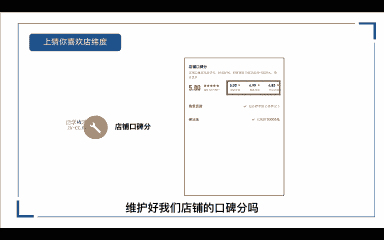

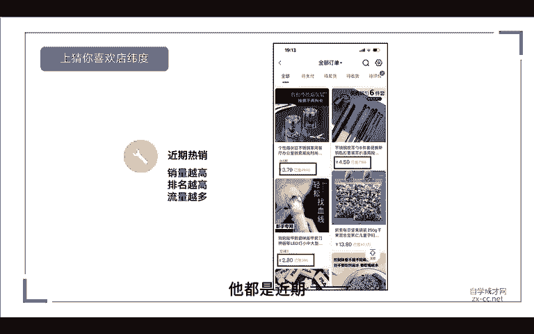

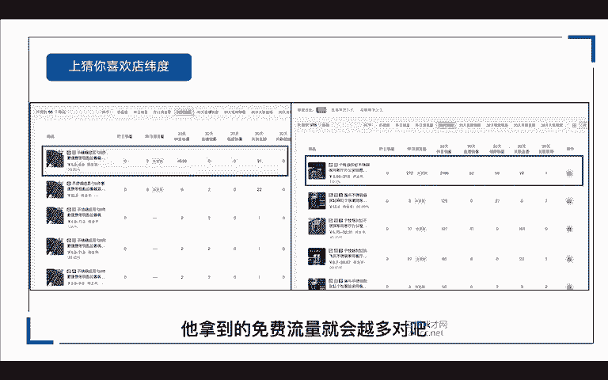

为什么这两个能排在排在前面呢？你看它价格差很多，对吧？比如说这个14。8块的，我们点进去看一下，那其实就是一个套路啊，你看十包装袋的它其实就是一个试用装，就最低的一个价格给你展示出来。

那为什么它会展示到这个23块，相差价格这么多的旁边呢？因为它的主图都一样啊，都类似啊，对吧？系统通过主图给你匹配的。那第二个这个一看明显就是玩店群的嘛，薅羊毛的嘛，两个价格差不多的产品同维度给你推荐嘛。

第四个小类目榜单，比如说这个JK的领结和这个鞋链，他们为什么销量这么低，还能排在前面。就因为它这个类目比较冷门嘛，对吧？没有人卖卖的人也很少。如果说你做小众类目的商品，那我们上猜你喜欢的几率是非常大的。

但前提是你这个类目呢是要有购买需求的。如果说连购买的人都没有，连一点基本的需求都没有，那你挂上去，你卖给谁啊，卖给鬼啊，对吧？最后一个关键词匹配，我们看下，比如说这个男士T恤，对吧？

你去搜索一个男士T恤，它系统就会根据你这个关键词，首先它。

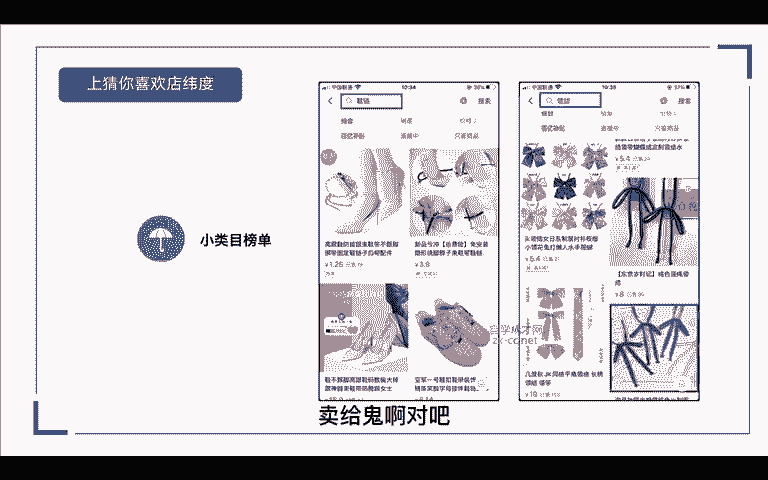

会匹配到一个精准的商品给你，就是它这个商品标题里面包含了这个关键词。所以说呢关键词匹配呢也是能够把你的产品推荐到猜你喜欢的。那么除了通过以上几个维度上到猜你喜欢，那我们商品的基础数据是不是就要做好呢？

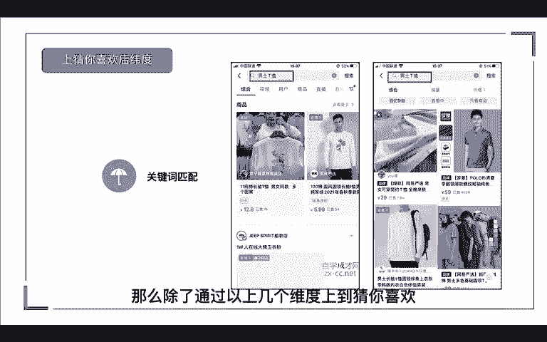