# 抖音自媒体短视频运营养号实战零基础小白教程、如何快速涨粉变现上热门 抖店／头条／短剧／推文赚钱攻略 - P12：精选联盟 - 无事打猴子 - BV1x324YVE2y

那什么是精选联盟适合什么样的人来做？那精选联盟呢？就是撮合商品和达人的1个CPS平台。CPS呢就是一个推荐奖励的机制啊，由平台统一的展示，让达人自己去筛选，说白了就是一个中介平台，对吧？

商家负责把产品上架上去，达人负责把产品拿过来卖，就这么简单，那么适合什么人来做呢？精选联盟他其实就是一个分销平台，对吧？那什么样的人会来做分销呢？一个是生产制造业的，他呢要么是产能过快。

第二种它本身就是做供应链的，他的资源很广，他可以融合1到10个品牌，甚至是N多个品牌，然后再由他统一的去分发给别人，说白了也是赚中间差价嘛，那还有一种呢就是资金要足够的，为什么呢？

因为你说白了你是供货的，对吧？你有可能下面有很多的主播合作，你可能今天这个主播给你带货了100万，另外一个主播给你带了100万，那也有可能一个主播一天给你卖了1000万。

那你是不是要有足够的资金才能干精选联盟呢？所以总结下来就是三种人，一个是有工厂，对吧？有。

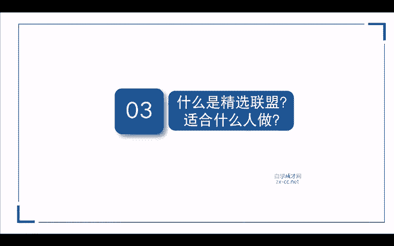

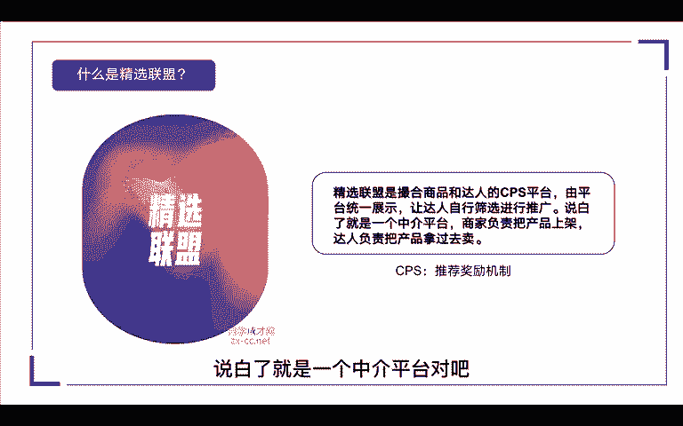

是供应链足够强。第三个是资金足够的那我们达到这样的条件来做精选联盟是最轻松的。那么精选联盟该怎么加入呢？啊，这里有加入精选联盟的一些条件。第一个呢是我们精选联盟的权限没有被关闭过或者小于3次。

意思就是说你开通过精选联盟，对吧？但是你可能因为某些违规的操作啊，导致你的权限被关闭过超过三次以上。那么你从此以后呢，这个小店就不能再入驻精选联盟，别人就不能给你带货了。

那第二个呢就是商家的体验分要大于4分。那这个分值呢它是根据平台的规则变动的啊，可能现在是4。0分，那也不能保证平台一直都是4。0分，可能它会降，可能它也会升啊，这个呢根据平台规则去变化的。

我们去开通精选联盟的时候，它会出现这个啊权限的要求，就刚刚我说的啊，关闭权限次数，还有就是我们的一个体验分，如果说你体验分低于4。0。你看这个3。75的，它就不能去挂精选联盟，它就不能入住啊。

那我们来通过后台去看一下怎么操作。

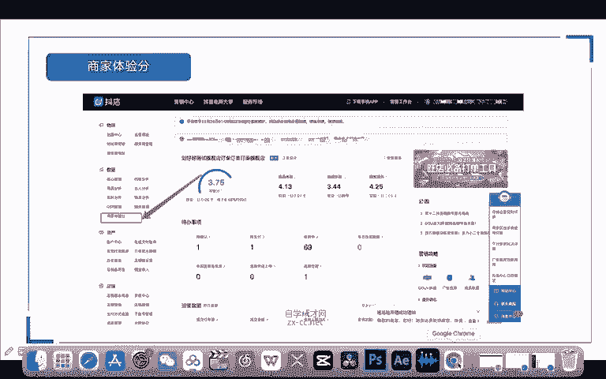

我们打开抖店后台以后呢，我们来到营销中心点击一下。在左侧的功能栏里面呢有一个精选联盟啊，这里面呢我们可以去创建我们的计划，点击一下计划管理。那进来以后呢，这里有三种计划啊，一个是普通计划。

一个是定向计划，还有一个就是专属计划。那普通计划呢是针对我们所有的达人。那定向计划和专属计划呢，都是针对我们有合作的达人啊，就是洽谈好，我给他设置定向佣金的啊，这三种计划是不同的。

那么三种计划它设置的要求呢也是不一样的。啊，这里有一个表格先可以给大家看一下。

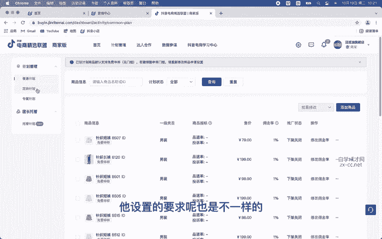

那普通计划的话，它的设置佣金区间在1%到5%，它不得低于1%。那专属计划的话，它是0%到5%。定向计划是0%到80%。那如果说你要进行后期要进行一个K单的话啊，我们选择普通计划，把它设置为1%啊。

佣金1%就可以了。那定向和专属呢是针对于我们合作的达人。那么怎么创建我们普通计划呢，我们点击右边添加商品，我们选择一款商品。

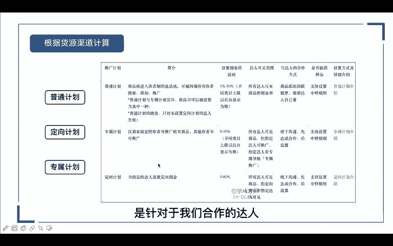

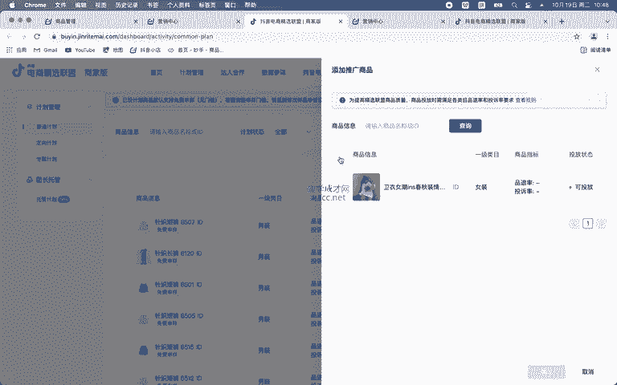

然后进来以后呢，这里会让你设置佣金，佣金呢在1%到50%，你都可以去设置。那如果说你的这个产品利润呃，空间比较大的话，我们可以给达人20%到30%之间根据自己去调整就可以了。比如说我这里。

据说我这里输入个20%。那这里有个生样的方式，可以免费生样。那这个就是呢给达人免费寄样品过去，或者是不支持生样啊，我这里选择不支持啊。如果说你的产品库存很多，对吧？确实需要呃达人去给你好好的带一下。

那我们可以免费给他寄个样品。

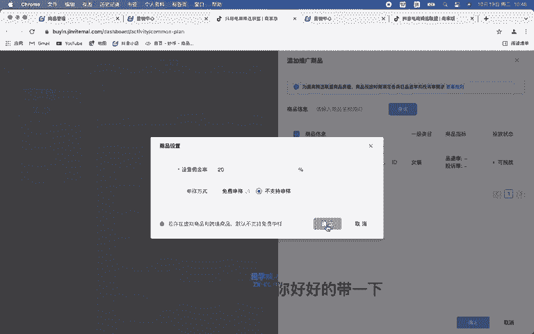

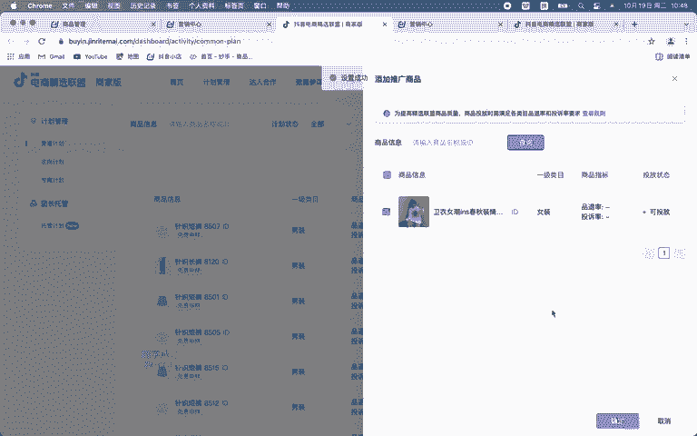

然后点击确定。那这样呢我们的佣金就设置好了，我们再回来看一下。

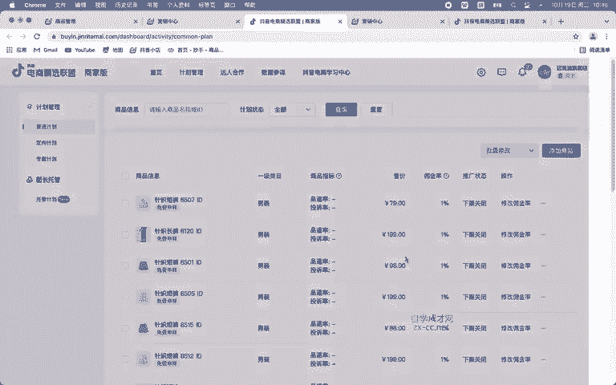

这里呢就会显示啊我们的售价是多少，佣金率是多少啊，如果说你要修改的话，在后期也是可以去操作的那这个是我们普通计划的设置。那还有一个定向计划呢，就是根据我们达人啊，合作达人去拿到它的UID啊。

这里点击新建新建定向计划。点进去呢，我们同样也是先选择产品，然后点击下一步。那这里的佣金率呢是针对我们合作的达人。比如说我这个普通计划设置了20%，对吧？那我这里可以给他设置25%或者是30%。

就根据你们提前谈好的，商量好的嘛。然后再设置我们的一个推广时间啊，比如说你这个计划啊，我计划在一个月之内啊，给他这个佣金的啊设置，那我们就可以设置到下个月的11号下个月19号，对吧？然后他到这个时候呢。

他这个佣金就自动结束了。达人那边呢就推广不了产品，对吧？他想要再推这款产品呢，就需要我们再来重新创建计划，接下来就是添加我们达人的啊账号，比如说他是抖音火山的，对吧？把它UID粘贴过来。

然后识别点击提交就可以了。这是我们的定向计划，那专属计划同样呢也是那样设置的啊，操作方法都一样，非常简单。那精选联盟有哪些玩法呢，前面也给大家说了，普通计划定向计划专属计划，针对人。

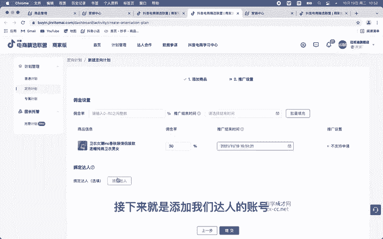

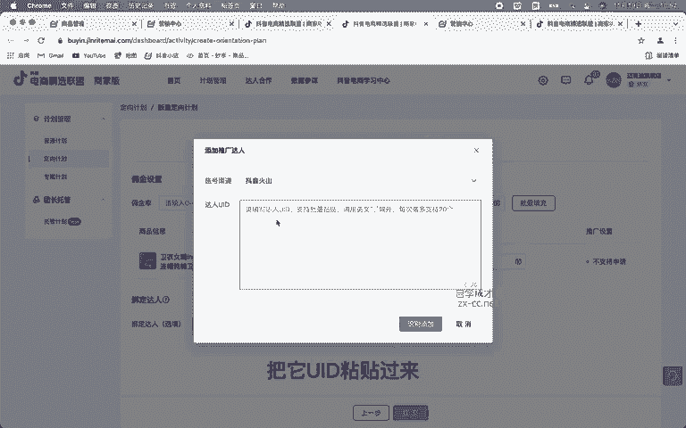

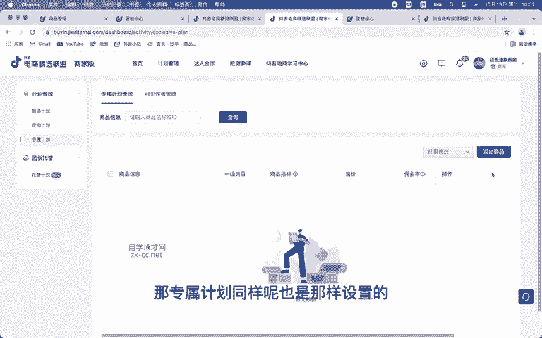

群不同，佣金也不同。根据我们的合作达人去设置就可以了。那总的来说呢，精选联盟它就是一个供销的平台，对吧？所以我们要考虑到两端，一个是消费者能接受我什么样的价格，一个是达人希望能赚到多少钱。

那精选联盟如何快速的去突破呢？首先如果你没有人愿意帮你带货的时候呢，我们肯定要花点钱，找一个大主播，对吧？你给他一点坑位费嘛。他只要能帮你带起来，底下的什么中小主播啊，你都不用去联系。

他们自然就会来找你，那大主播趁平台的流量，小主播肯定是称大主播的流量嘛，对吧？那如果说如果说大主播和小主播都帮你把销量带起来以后呢，我们可以做什么就可以做直播了嘛，对吧？你的佣金就可以省掉了。

你可以直接厂家最低的价格。比如说你给主播的价格是99，那我今天厂家直播卖，我卖个6979可不可以？那用户找谁买，那肯定是找你买啊，对吧？那所以说只要你的产品上架以后，能开通精选联盟呢。

我们都去把它给他开了啊，都把佣金给他挂上去就可以了。

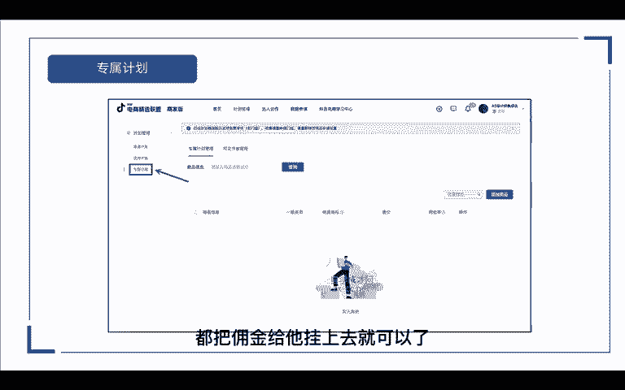