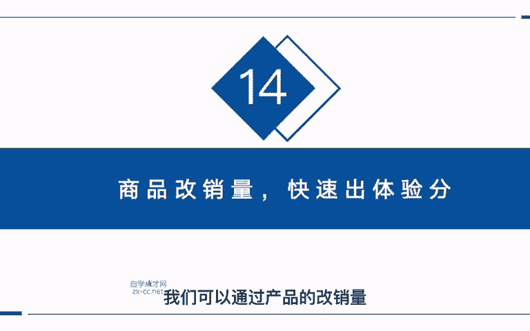
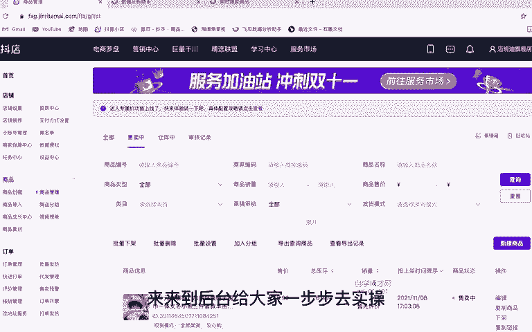
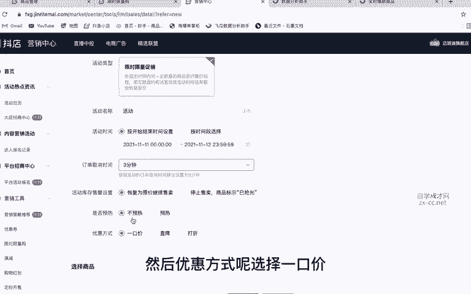
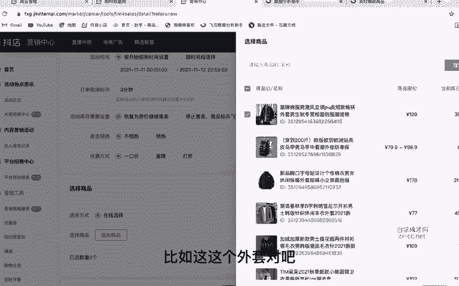
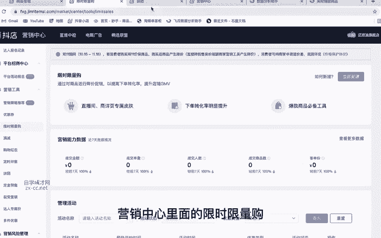

# 抖音自媒体短视频运营养号实战零基础小白教程、如何快速涨粉变现上热门 抖店／头条／短剧／推文赚钱攻略 - P13：商品改销量 - 无事打猴子 - BV1x324YVE2y

这节课我们来讲一下如何快速的出店铺的体验分。小店店铺想要快速的出体验分呢，必须要有30条的这个有效订单。那这30条有效订单呢，就是用户在收货以后啊。

给出了评价的订单才算有效的那我们要如何快速的出这个体验分呢啊，我们可以通过产品的改销量。那如何去改呢来来到后台给大家一步步去实操。我们可以通过两个方法，我们来到抖店后台以后呢，点击营销中心进来以后呢。

我们这里有一个限时限量购，我们可以去创建一个限时限量购，通过限时限量购里面的一个低价SKU去进行一个S单，达到我们的这个销量。来到限时限量购呢，我们点击新建啊，这里去新建一个限时限量购的一个活动。

那活动的名称呢，你可以随便去输入啊，随便去打一个。然后活动时间呢，根据你自己的情况来设置啊。比如说我们今天要S今天我就要把这三0单给到S万，对吧？我们选择一天也可以啊，选择两天也可以，然后。

订单取消的时间，我们这里选3分钟。然后这个呢我们选择恢复为原价，继续售卖啊，不预热，然后优惠方式呢选择一口价，然后去添加我们的一个商品。比如说这这个外套，对吧？我今天要去S这个外套啊，我们添加进来。

然后这里呢啊去设置我们的1个SKU在这里面呢，我们可以去批量的设置啊。比如说如果说你这个产品规格非常的多，我们一个个去输入就很麻烦，很费时间，我们可以在这里直接批量设置，那这里我们怎么去输入呢啊。

先把我们这个能优惠的价格把它输入进去，比如说这款衣服原价129对吧？啊，我最低能卖120，对吧？啊，1110吧，110，啊后库存的话，是根据我们当前的库存来设置啊，不能大于当前的库存。

比如说这款衣服它是1万的库存对吧？那你不能输入1001啊，它只能在1万以内，那这个库存的话，我们就根据这个去设置就好了。比如说我今天就秒200款，对吧？然后点击批量填充，那这里我们还要进行最后一步。

就是找到最下方这个SKU，我们把它价格呢改为0。01，你今天比如说你要S10单或者是S30单，对吧？我们就改成比如说你要S10单，我们就改十单。你要S30单，我们就改30单。那这里就设置完成。

设置完成以后，我们点击提交。当然在我们提交的时候呢，你要提前去找好，就是帮你拍单的人，对吧？给他沟通好。因为这个提交以后，他就在他就开始在我们小店去展示了。那如果说别的用户进来看了以后给你拍了。

是不是就损失很大，所以说我们要提前去找好帮我们拍单的人，然后再去提交，那么们可以算一下啊，30单啊，一单0。01分钱啊，0。01元，那30单下来才多少钱，是不是才三毛钱，对吧？而且我们这个抢完以后。

它是恢复原价继续去卖的，并不会影响我们商品的这个原价的SKU所以说对商品的权重是没有关系的。这是一个我们改销量的方法。那还有一个是什么呢？啊，是来到我们的这个拼团里面，拼团同样也是可以这样去操作的。

同样也是来到这里创建我们的活动名称啊，随便去创建一个。那这个拼团的时间呢，它只有一天的有效时间，我们就从当天的啊，比如说现在几点啊。现在4。4。02。对吧。哦，2。022点。02分。好。

到我们的呃晚上就到晚上12点吧。好，那这个成团数量我们就添加这个最小的数啊，5个。然后开团自动成团啊。然后这个订单取消时间呢，我们同样选择3分钟。这里呢去添加我们的商品啊，比如说同样我们选择这款商品吧。

那这里的设置方法呢，其实跟刚才我们这个限时限量购一样的啊，都是一样的，去设置一下，比如说110，对吧？跟刚才一样啊，库存今天拍200单然后批量填充，同样也是把我们最后一个SKU改成0。01啊。

比如说我今天拍50单这个衣服啊，然后呢再去提交啊，记住一定要先跟我们那个拍单的人跟他沟通好啊，我们什么时候上架，让他及时去准备，你可以让他先关注你店铺的抖音账号，提前进入到我们的小店啊，去拍就可以了。

把这个库存给他拍完就行了。注意啊，一定不能让别人去薅到你这个羊毛，那我们这里可以选择一些客单价比较低一点的啊，你就不要选择这么高的，选择那种十几块二十几块的都可以啊。那种如果真的被薅到羊毛的话。

损失也能。最小化，这就是我们两种去改销量的方法。记住啊，一定不能从这个商品详情页里面去改这个SDKU的价格啊，不能从这里面去操作。我们只能通过这个营销中心里面的限时限量购和这个拼团去操作。

