# 抖音自媒体短视频运营养号实战零基础小白教程、如何快速涨粉变现上热门 抖店／头条／短剧／推文赚钱攻略 - P14：小店基础搭建 - 无事打猴子 - BV1x324YVE2y

这节课我们讲一下啊，小店的基础搭建，就是我们开通小店以后呢，我们要去做哪些动作，把我们的店铺做到精细化的运营。首先我们来到我们的小店后台，在我们店铺的支付方式里面呢。

我们去把这四个支付功能都给它全部打开啊。这四个功能全部开通以后呢，我们后期提现啊，才能正常的提现到我们的账户，不管是我们的对公账户或者是我们的个人账户啊，都是必须先开通这几个账户才可以提现的。

那么接下来来到我们的商家保障中心里面啊，去把我们的这个运费险给它打开。那开通运费险以后呢，会有一定的流量倾斜。那它这个运费险的价格呢也不是特别的高啊，几毛钱就可以了。那开通运费险以后有哪些好处呢？

第一个呢可以增加我们商品的曝光增加19%，就是消费者在退货的时候呢，系统它会自动的理赔，就可以打消一些顾客下单的，它的顾虑，对吧？那还有呢就是可以提升我们的一个转化率啊，还有一个就可以降低客户的投诉啊。

这是我们开通运费险的好处。然后我们再回到我们的首页。

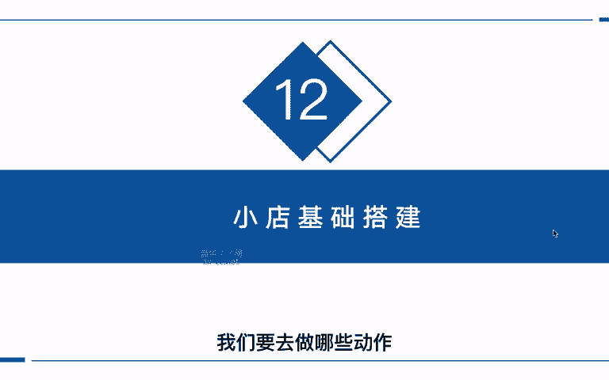

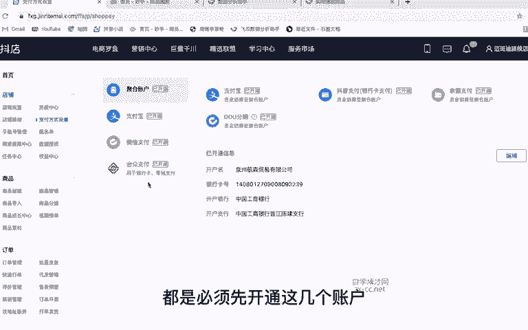

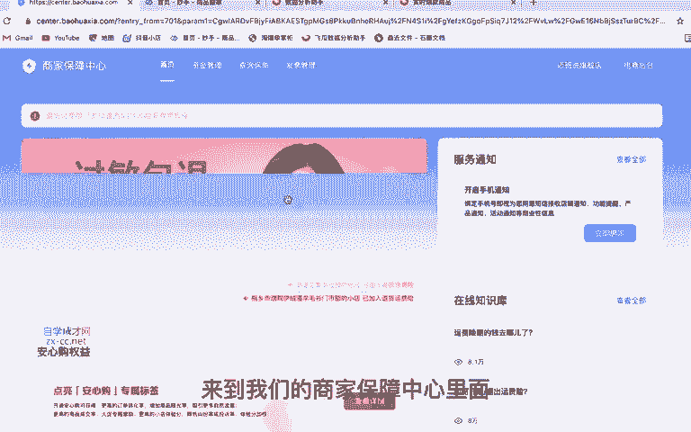

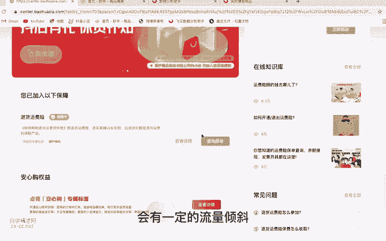

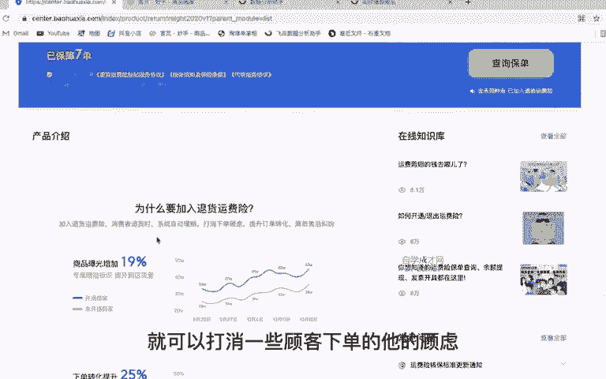

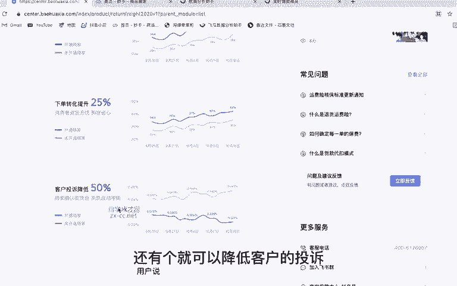

啊，往下滑找到这个急速退款的助手。点进去以后呢，我们把这个未发货仅退款给它打开系统呢它会识别在小于300元以内的产品啊，并且是下单时间在6个小时以内没有发货的订单。如果说有客户退款。

它会进行一个急速的退款。那我们这个退货退款呢，就不用去选了啊。那这里开通完成以后呢，我们回到这个商家保障中心，我们往下滑，这里呢会有一个安心购啊，去把它开通一下。

它的要求呢就是必须要把这些各项功能全部开通。你可以看一下这里有没有开通。如果说已经开通的话，这里是已开通。没有开通，它显示是一个未开通的状态，我们去把它每个功能把它打开，然后再加入这个安心购。

这个安心购呢，在用户购买我们产品的时候，就在我们商品的详情页，它会有一个安心购。这样呢有便于提高我们订单的转化率以及成交率，还可以提升我们商家的体验分好处是非常多的。那么开通完安心购以后呢。

我们继续往下滑啊，找到我们的地址库管理。

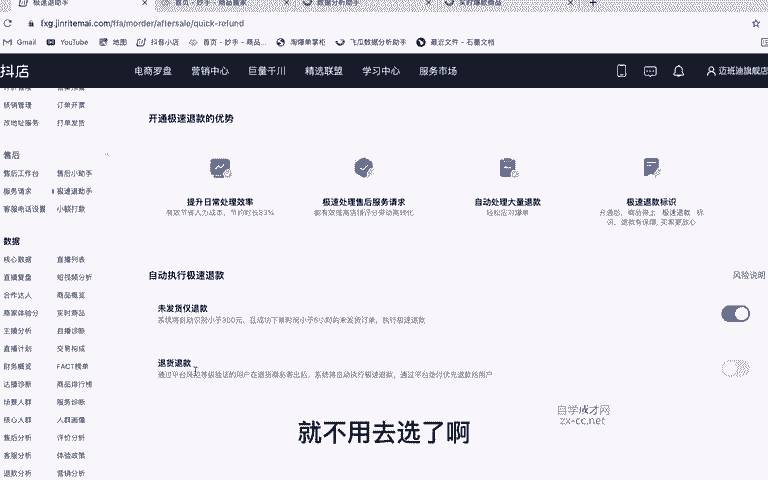

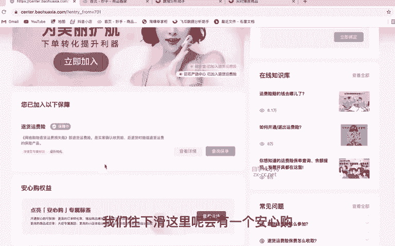

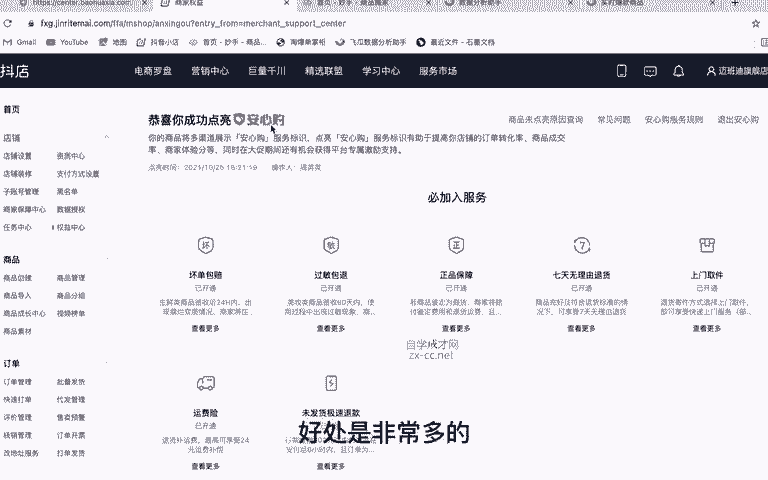

那在这里面呢去添加我们一个默认发货和默认退货的地址。因为有的同学是做无货源，对吧？我们的上家呢非常多，他的仓库地址也不一样，而且平台最近有一个闪电退货的规则，就是说用户在退货的时候呢。

系统会默认的发送一个退货的地址，也就是我们的地址库里面默认的退货地址。那这里呢我们就要提前去跟商家对接好啊，把他的退货地址给他要过来，我们再填到这里面，下节课呢我会给大家讲闪电退货的那个策略。

我们如何去创建多地址的退货策略啊，我们在下节课来给大家讲。那如果说有的商家啊，他可能不会给你退货地址，那怎么办呢？我们可以随便去填写一个地址，然后在这个详细地址里面呢，我们可以去添加一些话术啊。

比如说退货请联系客服，对吧？或者是说该地址不作为退货地址。因为我们的仓库比较多啊，如果说要退货的话，联系客服。这个地址不作为退换货的地址啊，在这里把它输入进去，编辑一段话术就可以了。然后呢。

在这里把它设为默认发货和默认退货的地。

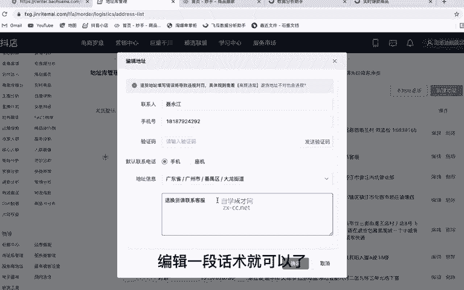

那这样就解决了我们部分没有退货地址的同学啊，该如何去设置。那接下来来到我们的运费模板，这里呢去新建一个啊属于自己的运费模板。因为新店铺的话，它这里只有一个全国包邮的默认的。

而且不支持修改的那如果说我们想要添加自己的运费模板。我们点击进去啊，点击这里新建模板，那这里呢输入我们模板的名称，比如说设置一个啊部分地区包邮啊，或者是什么什么包邮啊，根据你自己的情况来设置。

然后设输入完成名称以后呢，我们这里选择发货的地址，也就是你发货的地址从哪里发啊，这去填写就可以了。然后运费设置呢，这里有三个模板选择啊，一个是阶梯计价，阶梯计价是什么意思呢？

就比如说它是按键或者是按重量，比如说一件以内啊，多少钱运费，每增加一件啊，增加多少钱的运费。那还有一个呢是固定运费，固定运费呢，就是说不管你是多少件或者是多少重量的，都是一定的运费。那还有第三个呢。

就是卖家包邮。是什么产品都是卖家给你包邮。那这点我建议大家去设置这个阶梯的计价。如果说你是卖衣服，对吧？卖服装，我们就按件按件数来计。如果说你是卖水果，对吧？我们就按重量来计。那这里呢我们可以去输入。

比如说一件以内啊，0元包邮，对吧？每增加一件啊，我们0元啊，就可以了。那如果说有的地方对吧？它是需要邮费的，比如说一些偏远地区新疆啊，内蒙啊、西藏这些，对吧？我们在这里去添加一下啊，添加地区这里去选择。

比如说澳门对吧？还有这个嗯内蒙古。

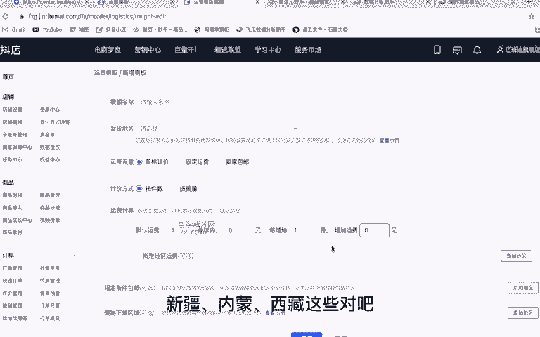

还有这个台湾、香港、新疆、西藏，对吧？选择完成以后呢，我们点击确定啊，这里呢去选择，比如说一件以内，它可能要30元的运费，对吧？那如果说每增加一件，它有重量啊，可能需要加5块加10块。

这个呢就要根据你们的那个物流去核算啊，具体需要多少运费，那这里填写完成以后呢，我们一定要把它打上勾啊，选择把它选择上，那下面呢还有两个一个是指定条件包邮，比如说啊全场满多少件或者满多少元包邮啊。

这个也可以去设置啊，一般呢我们这里是不设置的，因为我们都是包邮了嘛，对吧？那还有就是一些下限制下单的区域，比如说一些现在比较疫情比较严重的地方，他是不支持送货的啊，那这里我们可以去添加。

比如说最近疫情哪些区域区域不能送货的，我们把它添加进去就可以了。那用户在购买的时候，如果说他填写的地址是当前疫情比较严重的那么它就没有办法下单啊，选择完成以后呢，我们点击保存，我们这个运费模板就。

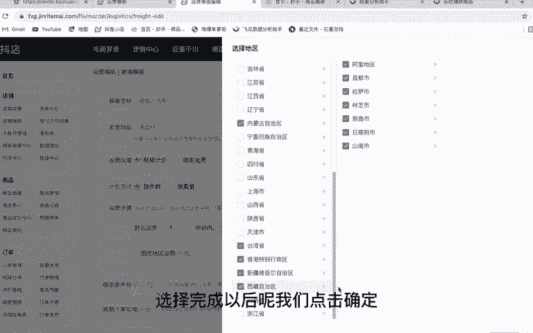

创建完成了。那设置完成以后啊，我们来到运费模板这里就可以看到我们刚才新建的模板以及我们被使用的商品有多少个啊。那么到这里以后呢，我们整个店铺的前期基础搭建就已经完成了。

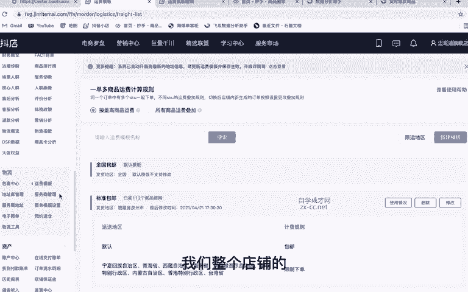