# 抖音自媒体短视频运营养号实战零基础小白教程、如何快速涨粉变现上热门 抖店／头条／短剧／推文赚钱攻略 - P2：短剧推广 - 无事打猴子 - BV1x324YVE2y

只有努力和付出才能得到收获。小朋友们可千万不要给鸭蛋大神来找你们的机会哦。短推广今好做说你刷视频过但具体怎么好做，也不说要不然就是加他好友开始收费今天我就当恶人了，从授权剪辑发布流点收转发举报下架到了。

首先打开小果授权进入页面，我们会看到上方有抖音快手视频号自己想做哪个平台的点击哪个接下来找到你想推广剧集也有一些爆推荐剪辑哪点击对应的剧集申请推广码这个名称随便填，然后选好平台抖音申请推广。

接着点击立即推广，这时候会自动打开对应的平台，比如快手抖音相册。

选择你提前剪辑好的视频。下一步，这时候你会发现这个小程序链接就自动挂上了，点击发布完事儿。这些短句素材从哪找？官方已经给我们提供了群公告第六条就是骗单素材实时更新的。想做短剧的直接关注我，给我留言。

短剧，我会安排给你们资料的。😊。

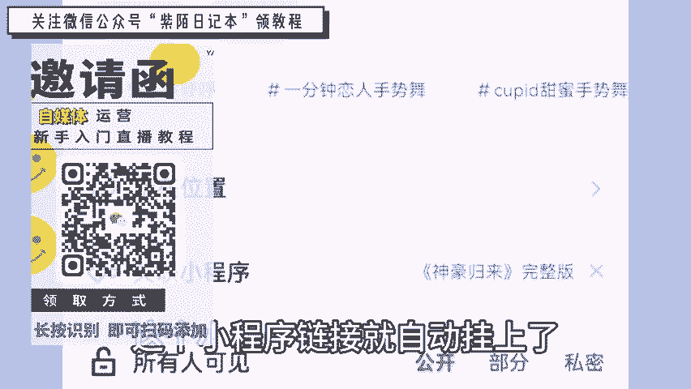

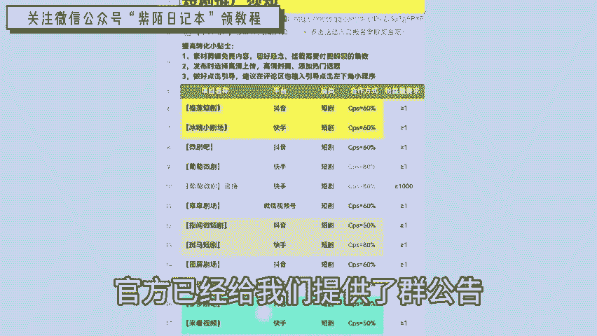

真大最又还出来办事啊。腰挺好啊。🎼但项目是抖音短剧推广暴力玩法，无视粉丝数，简单上手做原创，轻松日入500家。🎼首先我们去看一下项目介绍，看一下我们这个团队做短期推广的一个效果。

首先大家可以看一下这个短期推广，它最高的一个收益是5万5万块钱。

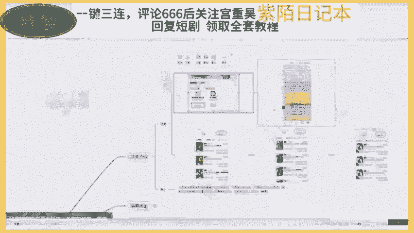

🎼然后这个是平台给我们的一个提成，60%到70%。后一般的话都是65%以上，65%到70%。🎼所以说平台对我们这个短期推广做的扶持力度是非常大的。🎼只要我们有这个执行力，并且按照这一课的流程去做。

我们会得到一个很好的结果。🎼然后看一下我们这个学员做一个结果。🎼这都是当天的收益。当天这位学员是100多块钱。🎼然后这是另外另外一个学员的，另外学员是500多。🎼都是一些当天的收益。

🎼然后这个呢是另外一个学员，近30日就是一个月的收益。🎼比大部分人打工赚的钱都要多。🎼这还是一个账号的。如果说我们。

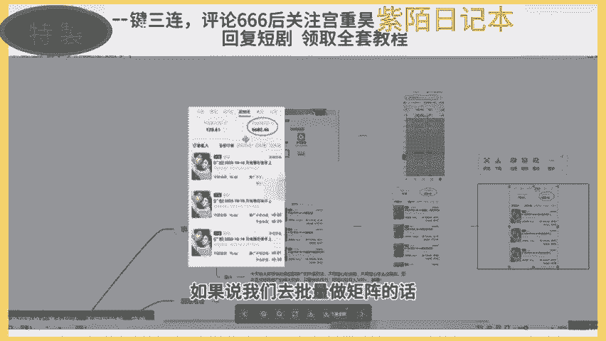

🎼去批量做取针的话，一个月7000块钱。然后我们两个号的话就是1万多，三个号的话就过万过2万了。🎼目前这个抖音现在对短期推广扶持力度非常大，所以说大家要抓住这个机会。😊。

🎼然后给大家讲一下我们这个项目的一个简介。今天给大家带来的是短期推广的升级玩法，不用担心粉丝数，不用担心怎么过原创。粉丝数有些人就是很苦恼于，我没有一些粉丝，我没法做。

通过这节课你就可以获得一个名粉能做短期推广的一个方法。而且这种是暴力的玩法，不用去操心过原创问题。常按照这个方法来说，他要涛作品全部都是原创。🎼而后现在呢正是抖音短剧推广的爆破阶段，只要你有执行力。

轻松轻轻松松就能日入50战，是一个躺赚模式，非常暴力有玩法。好这个项目的话，我们是以项目介绍前期准备。好一个大家最关心的问题，就是如何获取短期授权以及套码，还有项目实涛发布的一些注意事想要变形方式。

围绕这几个方式来给大家做一个详细的展开描述。这节课给大家讲一下对我们短期推广这个项目的前期准备目动。🎼首先呢我们需要两个东西，一个是我们设备的相关东西，还有一个是账号的相关东西。

🎼设备的话我们需要一部手机。🎼不用电脑，不需要电脑、苹果和、安卓的都可以，其他的没有什么要求。😡，🎼账号的话，我们这些有很多需要注意的细节，大家一定要注意一下。🎼我们会从四个方面给大家讲一下。

特别是注册账号，还有养号，账号一个大造，还有一个怎么去找对个账号以及对个账号，他们的一个展现形式都是什么样的？🎼好，我们先看一下。🎼注册账号的话，建议大家使用流量去注册账号，并且用流量去运营账号。

不要去连接了wifi，并且呢要保证一机一卡一号，不要去随意的切换账号。🎼然后这里边推荐大家去用流量卡玩这个项目。流量卡的话，它月租比较便宜，并且呢。🎼他那个。🎼流量是非常多的。

有的流量卡19块钱或者是15块钱，它就有上百G或者是几十G。所以说流量卡非常划算。🎼第二部分呢就是我们的一个养号，账号注册完之后，我们需要。🎼进行养号，养号的分为两个步骤。第一步骤就是搜索相关的账号。

因为我们账号账号刚注册完之后肯定推荐里边没有那些相关的账号，所以说我们要要去直接进行一个搜索，并且适当的点赞收藏和彩单。好有第二个就是。🎼第三天，我们去修改账号的一些信息，就是账号打到访边的。

并且发布几条作品观察流量的情况。🎼这个给大家演示一下。

🎼比如说这是我刚注册的一个账号，然后推广页里推荐页里里面肯定是没有这些团聚推广相关的东西。所以说我们要直接搜索玩去推广。🎼然后点视频。🎼直接搜索短剧，然后这个点视频，然后就可以这个看看看。

🎼然后下边你就直接这么像推荐页主下滑一样，所有都是短剧阵容的发，然后并且就是点赞，然后看到好看的话就进行一个评论。然后并且收藏或者是转发。然后这个下单的话，单独给大家说一下。

下单就是比如说你在刷推荐页的时候，看到一个有人在直播直播的话，正好他那个直播间里面有个1块钱2块钱或者几性的东西。就是他在为他的直播间带流量，然后可以进行一个下单，这样会身高我们就个账号权重情况。

然后第三件话就是我们去需要基本账号信息。然后在这里边给大家说一下账号信息，怎么去修改啊，就涉及到这个账号一个打造。打造的话，我们分成演示四个方面，头像名称，个人点介还有背景，然后分别给大家都说一下。

头像的话推荐大家去看贝贝账号。然后这里边给大家有3个推荐的东享。🎼就是看起来比较个性一点，或者是符合你自己的一个人设。女生的话就是设成女生的头像。男生的话设置成你的男生的头像，找宝图也可以。

🎼然后或者是什么多短剧，什么多电影这种大法就可以。那他这个好像。🎼可是很多用的都是动漫，大家用去需用你的动漫头像就可以。🎼然后名称的话，这也没有什么过多的要求，就是要彰显出你是来做什么的。

比方说你是做短剧退广的，你要起一个什么什么短剧，比如说小猫短剧，小花短剧或者什么什么艾追剧，给他们说剧场这些都行。🎼好，第三个就是个人简介，个人简介里边需要大家注意的注意的有几个点。

第一个就是我们要演示和头像和名称一样，就是代表出我们是做什么。🎼这里就是日更精品上头短剧。我喜欢留个关注法，就是引导业的关注。好，这里边呢就是也是在短剧更新中。好，感谢点赞和关注。

也是引导业点赞引导的关注。这是第一个需要大家注意的点。另外一个就是我们可以进行一个引流，但是这引流语游说法，就是我们粉丝数必须达到10万或者是5万以上之后，你台可以在这里面进行一个联系方式的填写。

要不然肯定会对你账号带来榜龄响，比如说给你进行一个降传降降虫。降完虫之后，用账号的没有什流量，所以说这个是大家需要注意的一个点。😊，🎼然后第四个的话就是背景图。

背景模呼背景图的话就是可以找同超区下载一下。然后这一围给大家准备有两个。🎼比如说他这种的话，点一下，然后点下载。🎼就直接保存到我们的相册里面，拿什么。🎼或是这个，然后我们点一下，然后再点开下载。

直接用同行的就可以。🎼好，剩下的就是一个对标账号，然后这里边给大家列举有三个对标账号，然后这三个的话都是做的非常好的三个人，大家可以去抖音上去专门搜索一下这三个人，然后按照人家的一个方式进行一个模仿。

😊，🎼另外一个就是给大家说一下，我们怎么去找这该账号。🎼对边账号的对标账号的获去的话，比如说我们搜索出来之后，你直接直接在这放大镜里边搜索搜索完之后，我们点的是他。😊，🎼他就是我们的一个对标账号。

🎼找的标段号，第一个需要注意的也就是做看他的粉丝15颗作品数。如果说她的作品数是女王说她是1万个，她有20万粉丝，这种的话说明他作者作品肯定是不好的，一万的作品太长20万。

🎼基本上就是你他的作品有100个到200个之间。🎼20万很正常，然后200到400个作品之间，然后是40万到60万，这种是比较正常的一个对比。所以说大家就要去找这样的账号。🎼然后他就是我们的一个对标了。

对标之后我们可以点下边这个。🎼头下边这些都是一些我们的自备账号。然后根据我刚才给你说的那个规矩，能那个规则，然后去找他是否是符合咱们的一个自别账号。如果符合的话，要去研究他的作品。

在哪些方面是值得我们学习呢？🎼所以说这这个账号我们大家按照这种方式的找的话，一天都能找上50个桶100个桶。🎼好，这节课就给大家讲到这儿，聊后这些东西大家都要去实操一下。

只有实操过了之后才能明白其中的是怎么进行一个。🎼打造就好了，这节课给大家讲一下我如何去获取短剧的授权以及车方码。🎼Oh。🎼。🎼如果。🎼贝一课给大家讲一下我们的一个项目实操。我们拿到短期素材之后。

怎么把它变成国际的原创作品？🎼按照这个来举例吧，就是我要去推广这个短剧，然后它这里边会给我们一个项目说明，后开库，我们直接去复制吧北部打开我们这区展台，看一下它是。🎼还要记一下这个多多剧场。

然后记一下他这个名字，我什么时候来打工，记完之后，我们在这里面是可以寻找找一下。因为他这里边很多短剧我们需要去找。🎼他这个上美国汇总表单以后，下面的话都是各个剧场的一些短具。

所以说我们要去找到一个多多剧场。🎼这边不好找，然后给大家推荐一个好找的一个方式，就是往下找。它这有个汇总表单项目名称，然后我们去找我们的多多早剧，多多剧找。🎼要这要多多聚赏。🎼然后不到后走。🎼好没有。

他也是60%到70%。🎼他这有链接点击过去就跳出来。🎼看阿弟的第一名，他若是按照这个。🎼收益的一个高低顺序排序的，他第一名就是他，所以说我们要去推广，这里边就有一个绑百度网盘的一个素材。

🎼然后大家也要去看一下，他这个后边最后边有没有这个立车一高转啊。如果有的话，我们去走路，没有的话，我们会做的。🎼好，我们点一打。🎼把它这个素材保存到我们自己的百度网盘里。🎼好，我们保存。🎼好。

保存完之后，我们在电脑上面它下载一下。🎼然后封面他也给准备好了。🎼好，我们进一个下来。🎼他一共40多集，我们全部得下来一拿。

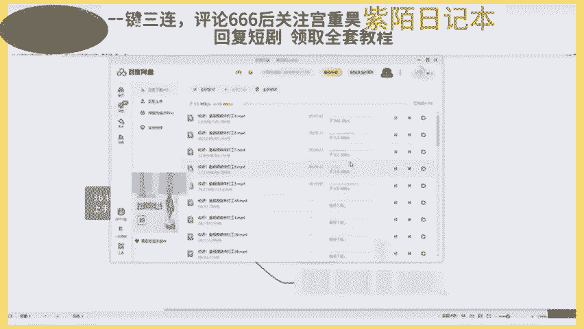

🎼有点慢哈有点慢，我看到他下来。我们先用前三级或者枪弩进来说一下。

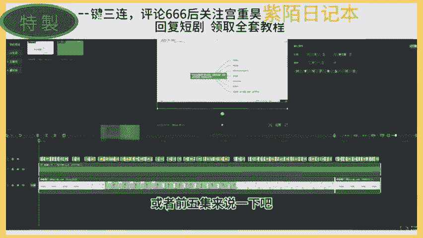

🎼首先呢我们就是打开剪易，打开来剪易之后，把素材导入简来。

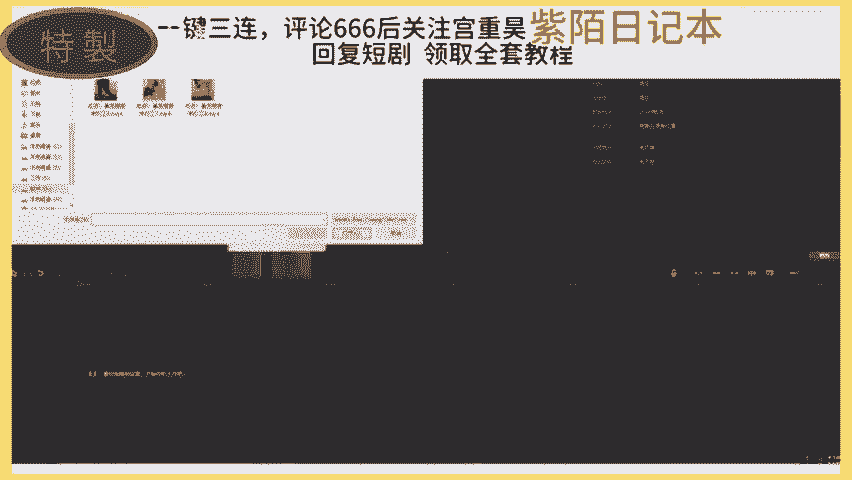

🎼好，我们就来678来说吧，678。然后把封门拖下去。好，把分门推下去。🎼然后我们就把六第6集。🎼还有第七集、第8集全部打入进来。第7集。

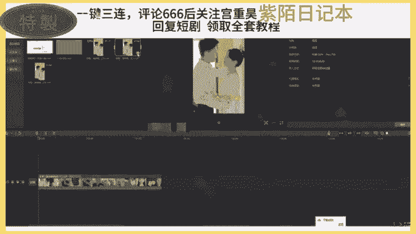

🎼你把级倒起来。🎼好，在做我们这个实操之前，我先首先给大家介绍一下我们每一些实操步骤吧。第一步就是寻找爆款短剧频下载。这个我们已经做完了，老子剪映做完了。然后呢，后边的都是我们一些进行原创的一些技巧。

这些技巧的话，大家一定要保存一下，一月不能漏，我们一定要每一步每一步的去添加。😊。

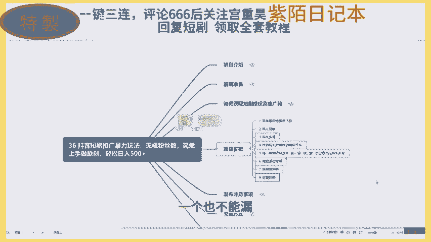

🎼然后给大家说一下插头去尾是啥意思？🎼他都去了你究看他一开始。🎼还有这第6集。我把音量调小。🎼看他这就是有个第六季，有个开头，只需要把这个开头给砍去了就行。🎼这位又没有敌六技能，我们把它直接点这个按键。

或者是快捷键康收加B也行，然后把它给删了。大家看一下。🎼没有任何影响，我们只是把他那个开头给去了。因为我们要去做一个将近20分钟或者将近30分钟的一个短具。如果有他那个的话，就很影响郭打。

比如说这个如果说海苔有他那个开头后，我们会是看开到一个什么样的结果。🎼别人说一个有什么问题吗？结果呢？🎼直接咔带着琴了，就是很开了很多很很麻烦。😡，🎼飞说，我们要让他连贯起来，旅如客开场。😡，他只说。

🎼有什么问题吗？然后到第二集了，到第二集之后，他这有又有一个有什么问题嘛？所以说这两个我们要先保留一个。😡，🎼因为我们是掐头去尾。🎼第一个片段我们已经掐头了，但是没有趣味。

所以说我们要把第一个片段里边那个有什么问题吗我们他去了。😡，🎼好，那我在这儿删除。🎼然后第一个看片段，我们就掐头去尾。🎼弄好了，然后第二个片段进行一个插头处理。🎼好，那这什么我们前面你就给他删了。😡。

来家看一下。🎼他是不是就已经连贯起来了，连贯起来之后，我没有去去搞第二个的去？🎼好，现在的话我们就是。🎼因为这个第二段和第三段开iggo，最后和这个第三段开头没有重复，所以说我们第二个就不用去问。

然后然后这个第三组，我们要进行一个插头，就是把这个第8集给拿去了。🎼好，然后我们直接裁剪，就是有时候你会裁剪出，就把它一句话板撤或两句话板撤，没有关系，等连贯钱就行，让我们看一眼。🎼看是不是很年贯。

所以说没有关系，这没有关系然后。🎼第三个我们就实际行一个巨味。

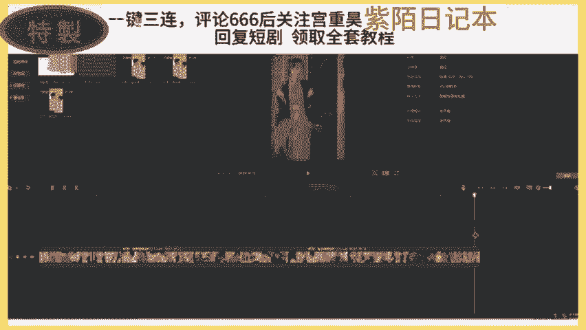

我他转身了，然后我们时接。啊这以上。🎼然后如果说后边有第9集、第10集、第阅、第11集全都是按照第一遍，按照我这个方法来过一遍，只是掐头去尾，还要进行一个连贯，连贯起来之后。

那我们又进行一个接下来的操作。🎼找到高光的石刻，放到1力开头，这傻意思。比如说这个是我们第一集啊。

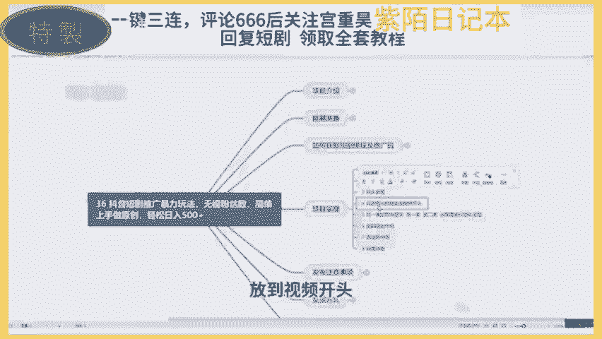

🎼我跟这短剧频是从第一集开始演的，对本？所以说我们要找到一个很高光时刻的开头。🎼这个没有高光的，然后我们去找一另外一个。🎼先拿这个吧，这个事，你要让亲你吧，这就相当于射高帮的开头，我们就直接给他。

🎼采监一下。在这儿。

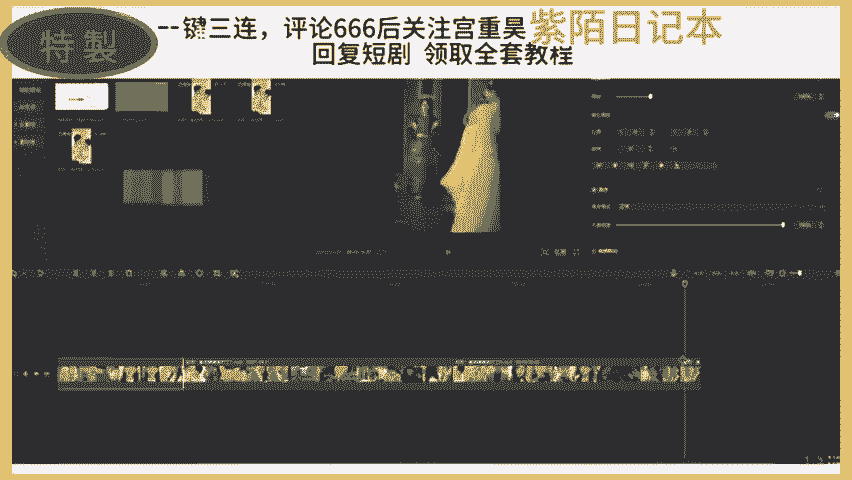

账号抖等。我们来刚哥。🎼分分钟，把之后把地张复制一下。🎼布置完之后，把它放网沟通。🎼快来看一下效果。🎼这个不连贯没有问题啊，因为开头我们就是要做一个数据呢，做一个用户填留的数据。

然后我们开头有个3秒3秒45秒，然后这个开头的一个停留数据我们就做好了，做好之后，然后他就抖音会给我们去推广我们这个视频了。🎼然第四部呢，就是刚才我说的进行一个掐头趣尾。

就是如果说还有第1集啊、第二集、第3集、第4集进行一个掐头趣尾，咱那些拿不连贯的或重复的都把删了，你尿都敢删了。要不然呢用户看起来很麻烦。我看第一集看了还挺好看。然后第二集的话，一看快不来要这不连贯的。

然后很多人就走了，不想看了。😊。

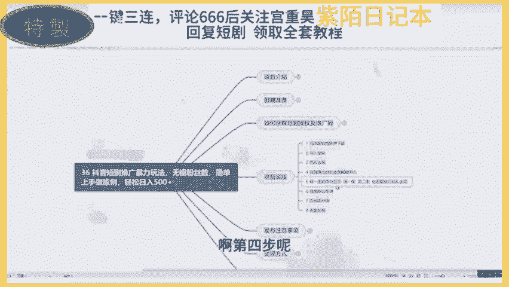

🎼然后我们带这些就是中间要加一个转场，因为我们现在看起来就是不连贯嘛。🎼看他们这个都是有一个转场容面的，你加一个转场在这儿。🎼他这有个动画。🎼动画有分着入场和出场，我们直接选一个入场动画。

那这里边大家随便选择行。然后给大家一个建议，就是选的是要一要选那些动作少的，比如这向下甩入，就直接向下对一个动作。但如果左左右抖动的话，拍摄看到没有使劲弹动走好几遍。

就说我们不要用这种就用就用这种是一个动作的直接让它向下甩入向上甩入，呃轻微抖动，就这种的。🎼然我打来一个动画上。这可以。🎼来看一下。🎼好无天转，借个转场。而这东画烧油牛肉炒，我们是按稍所微点短一。

🎼こない。🎼是是不是阵容好多了就好多了，让这我给你来下一个。动会。向下驶。🎼这样也可以也可以。🎼然后怎么去批量添加呢？就是我们全选，然后点击。🎼啊他这种手机都可以啊，手机个可以电上的，没有办法。

就是全部手机都可以。然后大家用手机套路它就行了。点击动画，然后再选一个，就是然后的全部都选上。

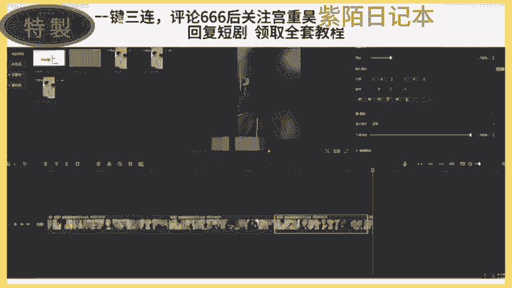

🎼这度完成之后，我们需要进行添加一个画融画。画妆画什么意思？给大家来看一看。😡，🎼所我们还需要导入另外一个另外一个姿态。比如说我们老掉这个姿态。🎼白月素太臭，擦不来拉遢。😡。

🎼阿大臭我现在是不是什么都看不见，没有关系啊，他这有一个滤镜，不是一个滤一波混合模式是合绿色。我们选择绿色，然后把五片无不透明度给它调到一个5或者6。🎼有4到6的一个位置。🎼高大长。

🎼然后把他这个一屏他一定要戒关了，一瓶静音，让他静音好。🎼而这种其实它并不影响用户去一个观感，但是我们有通过这个诱惑炸力他去虫的效果。🎼是吧然后如果说大家不放心的话，我们还可以这么做。

还可以这么多我跟大家说牙。🎼打有关眼珍关也真是啥的是一，有个位置，但一开头砍甲有关野针，撒关眼针之后呢。🎼比方说太演了有5秒，然后我们把后边这个就这个画中画啊移动一下。🎼然后呢带来5秒再等。

🎼把这带在也重要，就是让后边那个东西东西一直在动着，平时靠出来，但是这样的话，抖音它又根本检测不出来。🎼然后这个画妆画的画是推荐大家去实际生活中去拍摄。就比如说你去拍一些人流啊，拍一些车流啊。

🎼或者拍一些高楼大厦，去城市啊，去村拍一些，还有说动物啊、鸭子啊、鹅啊啥的都可以拍，啊不直接放点让我们直接走让它每一帧动起动到最后。🎼是一个非常好的一个祛身效果。🎼说求问完之后呢？

🎼我们可以去改一下他个字幕。🎼改字幕怎么去改，给大家说一下就是。🎼请了请了他这一个请了他这一个之后。🎼这边有个蒙版的功能，点击蒙版。🎼选择第三个镜面。🎼然后上面有一个反转。然后呢给大家来一个。宋下点。

🎼把他这个自己的字母挡上，挡好之后呢，我们在画边这个基础里面有一个最像美个背体填充，我们点模糊。🎼然后随便选一个。🎼这样的话它就不是一个黑色的，就是一个这种像马赛克一样，这种话就是桂音小关。

🎼然后我们再重新来一下识别字孔。🎼看他现在已经识别完字幕了，识别完字幕之后，我们把识别好字幕，把它放到这个背景模糊的地方，然后给大家改一下这个颜色啊，改一下字体啊。😊，🎼就是多多来的感动。

🎼啊黄色标显眼会黑色的。🎼蓝黄色的较黑以的，它放大一点。能带你。🎼他们在这里周全部都云有。🎼这样话就做到一个很好的一个驱容效果，然后我们大家看一看。🎼一开到是这引人入胜的一刻，开头局酿。

然后不开始演导演。到最后，他这儿每一次的每一集的完成之后，都进行一些衔接。那这一块也前就好。🎼然后大家就建议大家呃10级或者15级、20级进行一个这个全部的一个剪辑一下，点进来之后。

因为他整个不剧不是4A1级嘛，然后我们讲20集之后他还想看后面的，那么他就得去搜索他们一搜索，然后在这个平台上一看，然后我们就收益了。我这么着一个道理。另外一个到最后才答页封了，封了。

刚才我们不是已经保存好了吗？然后我们进行一个导入。🎼封面他们即快走进来。🎼然我才加了，费开头。那我打家看一下。🎼就最好短一点一秒或者是不到一秒的时间，加得上。🎼然后这就可以了。

然后呢我们就可以直接导出了。🎼那就直接可找出来，那呦，这就是你做完了做好了想。😡，🎼一共是这8部，大家可以截图一下，或者是一会儿我给大家放到项目资料里边。按照这8步来操作。8布的时候。

我给大家说的就是需要获取一个退广码，然后进行一个扫描链接的一个挂载。然这里面给大家演示演示一下。🎼首先呢我们就是进到这个诱报里边，把这个通光法厅一个保存，保存完之后。🎼我们就要去抖音。

300块钱在这里边就发拉进里面进行一个搜索。🎼然后把我们这个二维码识别下。🎼美意继续访问。🎼让我们创建一个链接。🎼标题中派标题要推往技术。🎼可以资格写上10节或是1到20。🎼这些都可以随随便写然哦。

标记的推广账号就是自己的抖音号，然后进行一个创建推广。🎼但我这一瞎说了，等胖姐对我。🎼然后这个链接已经挂载了，我们请点击一击挂载。🎼然后呢，根据他这个提示，点击这儿，然后换成自己的视频，要点行加好。

就比如说这个是我刚才用电脑做出来那个视频啊，然后点击确定。🎼然后他后边这个呢就可被删了。🎼可以我删除留好，然后我们点保存。🎼延下一步。🎼啊，这就可以了。🎼这周已经把链接挂上，我们迟一点发布就可以了。

然后发布的时候呢，大家要一定要记得，只是打个标签在这里面。😡，🎼你要打个标签，是我刚才我在这里边系列的三个标签，就是一起看短剧，短剧推网，然后短短剧推网抖音短剧第三个把这三个按照我就插上就行。啊。

然后再点击发广条转就发布好了。别人点击这个链接去看的时候就有这收益。🎼不能丢失给大家总结一下，并且跟大家说一下这个变现的么方式啊，变现怎么变现。我们主要靠两个变现。第一个就是去进行一个平台的一个收益。

我们可以多平台分发，比如说快手啊、抖音啊这样平台，他们都是允许去分发的。比如说这个视频做完之后，我们就可以抖音发一个快手发。😊，🎼尽量保持一个收益的对付最大化，然后并且大家推荐大家去做一个矩阵。

做矩阵的话，收益也只会更多。另外也就是进行一个知识付配，因为粉丝多了之后，比如说5万了10万了，每天看你的作品的人就会很多。所以说你可以在主页挂上一个拜师什么什么的，然后进行一个收图便现。

一单可以收他600块钱，800块钱，这样他就是一个很暴力的但是需要你。😊，🎼前期的一个接累城，你需要把这张耀臣垫下去，还能粉丝来，老得他多一点。🎼然后再逐页进行一个自己联系方式，一个挂载。

