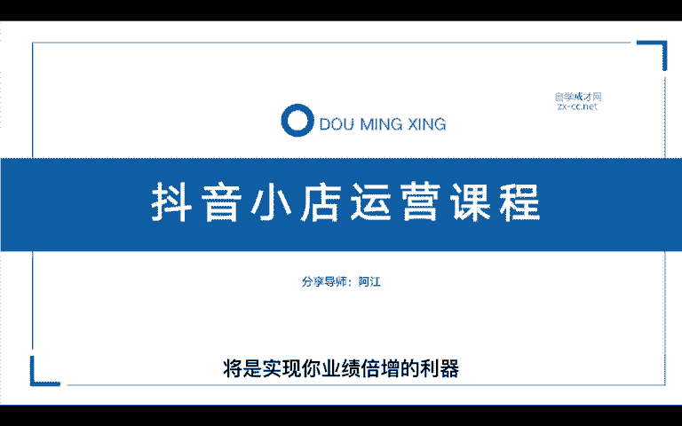
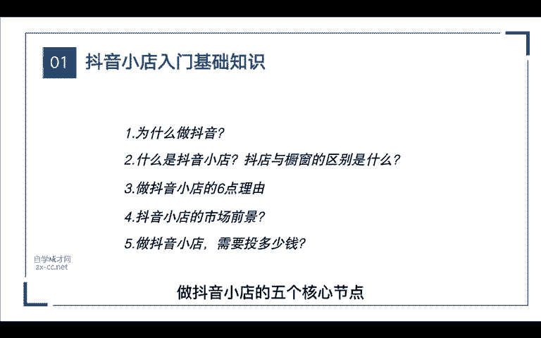
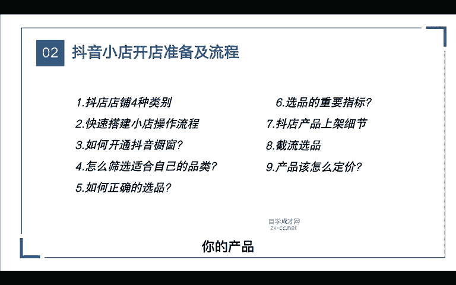
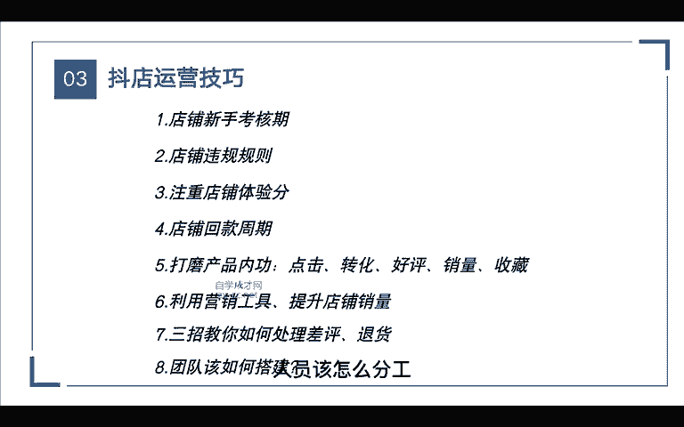

# 抖音自媒体短视频运营养号实战零基础小白教程、如何快速涨粉变现上热门 抖店／头条／短剧／推文赚钱攻略 - P4：课前预习 - 无事打猴子 - BV1x324YVE2y

做传统电商的还是做实体店，又或者你是做生产制造的企业。那如果你想跟上这个时代的新电商浪潮，那么抖音小店将是实现你业绩倍增的力气。那么今天这堂课呢我会分为5个章节来给大家讲解。在第一节课里面呢。

我会重点的通过5个维度给大家讲解一下抖音小店是什么，以及你为什么要做抖音小店，还有最重要的是大家都在思考的，做抖音小店到底要投入多少钱，对吧？这是我们都想知道的。那无论我们在做哪一个平台。

对这个平台是要足个的了解。首先你要了解它的发展趋势，还有它的规则，那这些看起来都很简单。但其实它是最重要的。它所有的认知都在这里面，如果说你连这个基础的层面你都不了解。那么后面你肯定是做不好抖音小店的。

所以在第一节课里面呢，我会给大家总结归纳一下做抖音小店的5个核心节点，具体应该怎么去操作。那在第二节课里面呢，我会讲到开店会需要哪些准备的细节，我会重点通过这9个维度。那这里面比如说。

抖音小店分为几种店铺，你最适合哪一种店铺。在后面的课程呢，我会详细的去说。那这节课里面有个非常重要的就是我们的选品。为什么呢？因为我们无论做哪个平台啊，都要符合那个平台的调性，对吧？

比如说淘宝淘宝属于一个综合性的平台，从小的平类再到大的平台从低的价格再到高的价格，它都能做，对吧？因为它是综合型的，那比如说拼多多拼多多呢它是一个低价的平台，它面向的人群呢就属于三四线的城市。

那最早呢它是从3C类目做起来的，当然还有京东，如果说你是做家电类，3C类的那京东平台可能更适合。那在抖音小店呢，它的流量跟快手又不一样了。那快手主要也是做下层市场，对吧？

它面向的也是一些三四线的城市用户啊，所以在快手上大部分卖的都是一些库存尾货特价的产品，但是在抖音平台呢，它更多的用户是在一二线城市。那么抖音平台到底应该以怎么样的价格才能去销售呢。

那在我后面的课程会给大家重点的去讲解你的。

产品在抖音平台应该怎么样去定价啊，怎么去设计。那在第三节课呢，重点的途径来了，我们想要做好这个平台，是不是首先要懂得它的工具使用。说白了，不管我们做哪个平台，我们所用的不管是套路也好，还是运营。

它都是围绕这个平台的算法。所以在这里面呢重点会通过这8个维度。比如说从店铺的薪酬考核期，再到店铺的规则，哪些错误的动作会导致我们的店铺违规啊等等。那在这里面呢还给大家整理了一些抖店的规则资料包。

那还有很多人都想知道的店铺回款周期具体是多少天，里面还包括了重要的店铺营销工具，我们应该如何使用才能提升店铺的销量。最后还会讲到团队该如何搭建，人员该怎么分工，这节课里面都会详细的去给大家讲解到。

那在第四节课里面呢，总共分为了十八节，每一节呢都是非常重要的。比如说抖音小店有哪几种卖货的玩法，像最常见的就是达人直接挂橱窗卖货，对吧？那其实除了这种玩法，还有很多种。

特别是现在抖音的搜索电商开始的玩法就更多。所以。

在这十八节里面呢，我会详细的讲解到抖店的各种玩法，以及它的具体操作步骤，甚至还包括了大家最想要的7天螺旋补单操作步骤，以及猜你喜欢。那这些玩法呢都是那些会传统电商运营的人必完的项目。

因为抖音现在这些玩法都是红利期。如果你在其他的平台已经做的很好，或者你想增加一个赛道，那么如何才能节省人工成本做这个项目，我会在第十八节里给大家分享一个非常好用的商品上架软件。

所以说这节课每一个点都非常的重要，大家一定要做好笔记，认真的听。如果说一遍听不懂，我们就反复多听几遍，那当你学完前面的东西还不会怎么办？没有关系啊，我在最后一节课整理了一些关于抖店的常见问题解答。

如果当你哪天遇到某一个问题，比如说我们小店被触罚，被扣了保证金应该怎么办？那这些问题在最后一节课都有解答。所以说这是一套非常完整，从零起步的小店运营课程，把这个课程学好了，你的抖音小店就能做起来。

