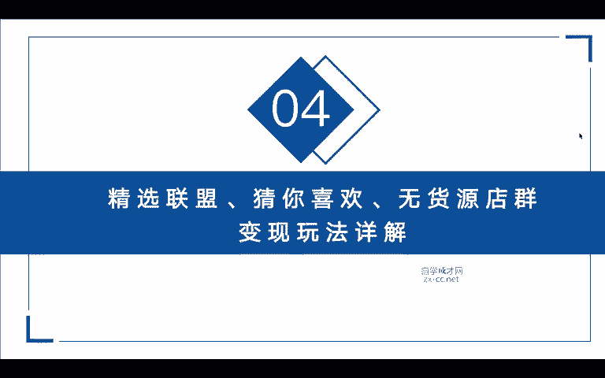
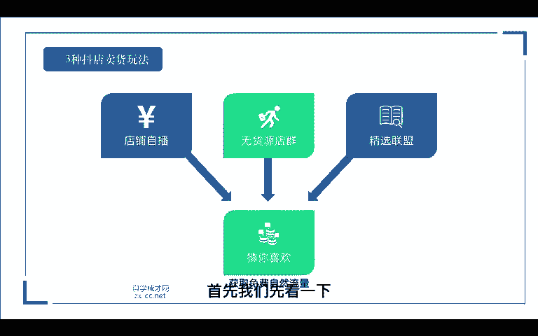
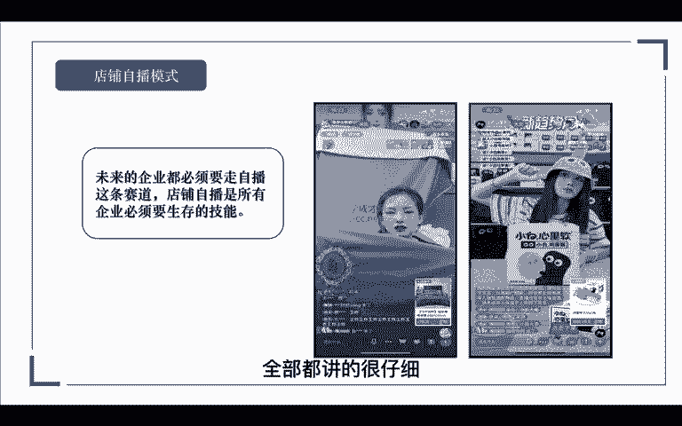
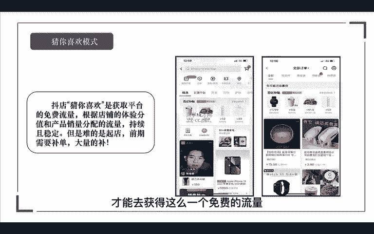
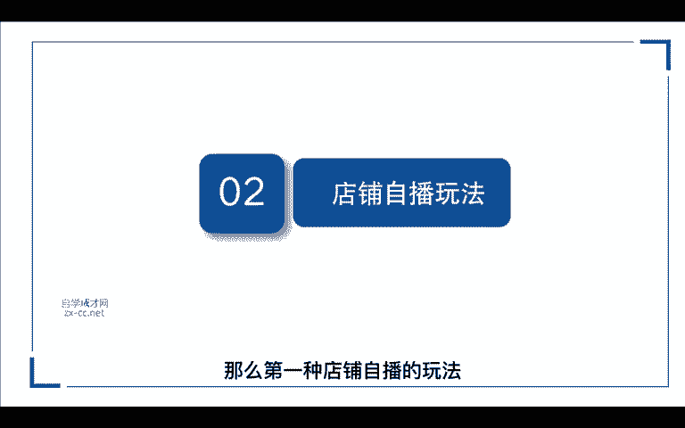
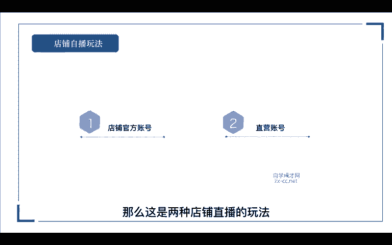

# 抖音自媒体短视频运营养号实战零基础小白教程、如何快速涨粉变现上热门 抖店／头条／短剧／推文赚钱攻略 - P8：抖店四种玩法-自播玩法 - 无事打猴子 - BV1x324YVE2y

接下来进入我们的第四节课。那么在课程开始之前呢，我们要知道抖店有哪几种卖货的玩法。这里呢给大家整理出了我们抖店的三种卖货玩法。第一种店铺直播，第二种无货源店群，第三种精选联盟，那么除了这三种玩法以外呢。

我们还可以去获取一个免费的自然流量，那就是猜你喜欢，首先我们先看一下什么是店铺直播模式，在未来的企业啊都必须要走直播的这条赛道，店铺直播呢是所有企业必须要生存的技能？为什么这么说？

现在目前我们在抖音上看到那些卖的好牛逼的人都是谁？是不是几乎都是达人，对吧？那店铺直播呢是在疫情过后，企业才慢慢入驻进来？那么在更早的时候呢，更多的是达人在带货。因为抖音他本来就是做泛娱乐的嘛。

更多的是达人模型，那么现在你看到的那些卖的很好的。比如说罗永浩啊等等这些大主播的数据，他们都还是达人，对吧？达人说白了就是二道贩子嘛，对吧？以他的个人IP，以他的个人流量去帮别人卖货。

那么他也是需要去链接产品方的。

那如果你本身就是供应链，自身就是品牌方，那你本身的优势就是大于他们的对吧？所以说在未来，所以说在未来所有的企业都是必须要走直播这条赛道的。你看现在这些达人虽然卖的很好。

但是呢这些达人都是存在不稳定的因素。因为在未来呢抖音不会把流量倾斜给哪一位主播，他更多的是希望把流量分散给到所有人，那于是呢这个平台才能健康的发展。如果当下你有自己的产品，你有自己生产，有自己的供应链。

所以说你做直播是必备的。当然直播的时候你会思考，哎，直播我不会搭建团队怎么办？那莫姐呢录制了一套非常完整的直播带货课程，你们可以去看一下，哪怕是一个小白从0到1怎么去取号啊，甚至是团队怎么搭建啊。

团队怎么培养啊，团队岗位应该做什么，全部都讲的很仔细，那么你们是不是就可以形成一个自己的商业帝国。我们再来看一下无会员店群模式。无会员店群呢，其实就是同时去运营多个店铺，对吧？

可能你一个人可以运营5个运营10个，那也就是抖店的矩阵玩法。

到抖店赚取巨大的搜索流量，从而达到出单的效果。那么同样呢我们是不需要去囤货的，也不需要你去运营短视频，也不需要运营短抖音号，对吧？只需要运营好你的店铺就可以了。那么具体的玩法呢。

我会在后面给大家详细的讲解到。那我们再来看一下精选联盟模式。如果说你玩抖音小店不会直播，也不会拍短视频，那怎么办呢？我们是不是可以找达人带货，那这也是最好的方法，通常情况下呢。

我们会把商品发布到精选联盟，然后呢会有一些达人主动添加我们商品去推广去售卖。那如果说你作为一个新店铺，对吧？你的又没有销量，又没有评分。

那达人来找到你那是很少的所以这个时候呢我们就只能主动的去寻找到达人。那关于这个精选联盟的玩法呢，我也在后面会详细的给大家讲解到。最后一个呢就是基于在我们的直播啊，无货源，还有我们的精选联盟三种模式之上。

我们都可以去玩的一种叫猜你喜欢。那抖店的猜你喜欢的，就是去获取平台的一个免费流量。根据我们店铺的体验分值和产品的。销量平台呢会给我们分配流量，而且是持续稳定的。但最难的是什么？就是我们前期起店的时候。

对吧？我们需要大量的去补单，提高我们的基础销量，才能去获得这么一个免费的流量。那么关于补单的流程呢，我在后面也会详细给大家讲到。那么第一种店铺直播的玩法，有哪些玩法，我们可以去玩呢？啊。第一种。

我们可以通过抖店后台绑定一个官方账号，那如果说你的账号没有打算拍视频，只是纯粹的想要绑定一个抖音小店进行直播，那如果说你的产品有优势，那么你要去播的话，我们可以去拉时长去播，对吧？

我们可以组多个的团队轮流的播一个账号，比如说别人一天播6个小时，那你一天播12个小时，对吧？你再牛逼一点，你可以播24个小时，只要是你有足够的团队，主播呢，我们可以每两个小时换一个。

这样子呢把我们的直播时长给它拉到极致。不然你以为那些官方账号啊，他们直播的，怎么做起来的，都是靠这种拉时长慢慢慢慢积累起来的，所以我们要做的话，就一定要坚持的去做。那第二种呢就是绑定我们的。

直营账号。那这里呢你就可以搭建多个的小分队，我们就不要去播一个号拉时长了。我们可以分为几个号。抖店呢可以绑定5个直营账号嘛。我们可以在5个抖音账号里面呢链接到我们同一个小店的商品，对吧？

那我们就可以组成5个团队一起上了，我们就做成了一个直播账号的矩阵了，对吧？这样也是可以的。那么这是两种店铺直播的玩法。

