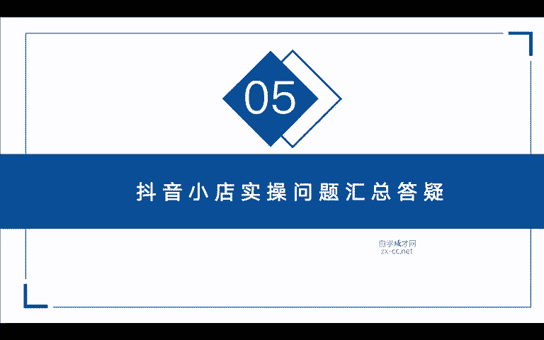
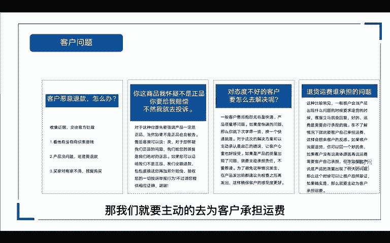
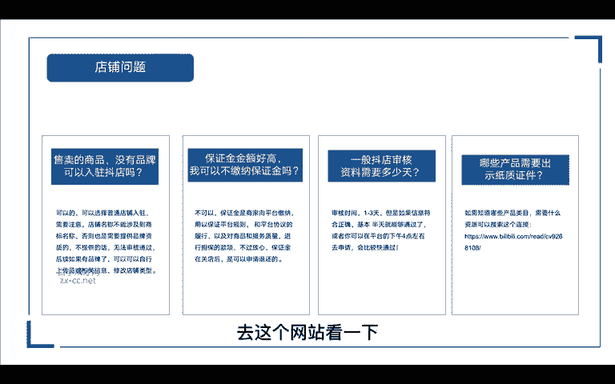
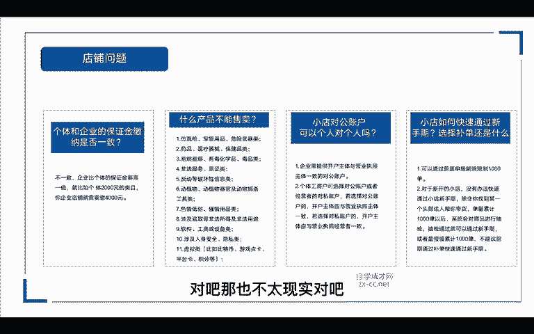
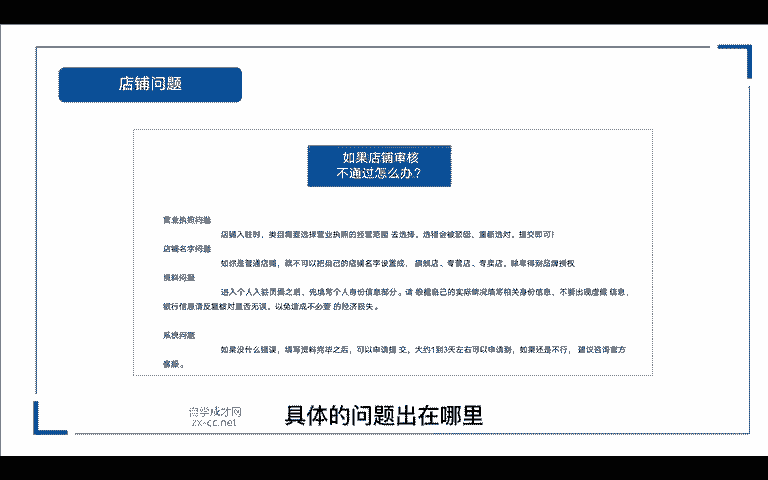
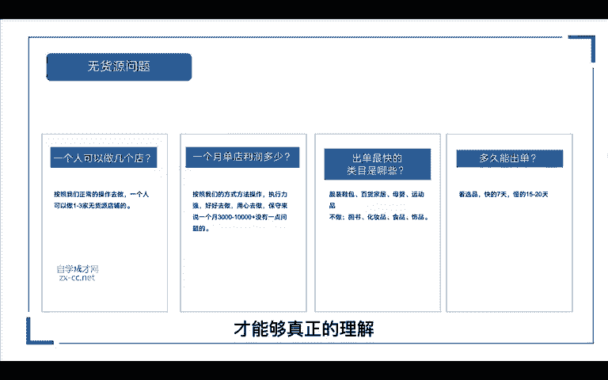
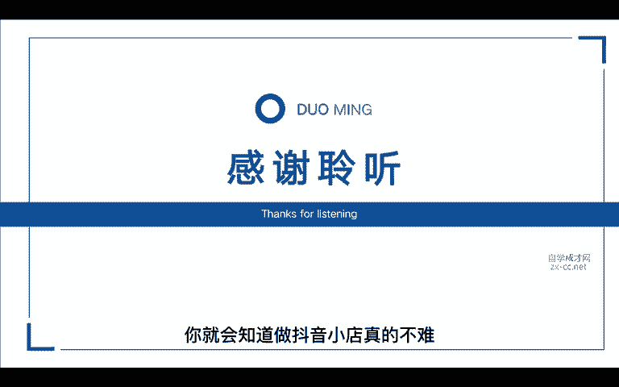

# 抖音自媒体短视频运营养号实战零基础小白教程、如何快速涨粉变现上热门 抖店／头条／短剧／推文赚钱攻略 - P9：抖音小店实操 - 无事打猴子 - BV1x324YVE2y

嗨，我是阿江。接下来进入我们抖音小店实操问题的一个汇总答疑。首先第一个我们会面临客户的一些问题，对吧？如果说有客户恶意的退款，我们这个时候应该怎么办呢？首先我们先去收集证据，对吧？交给官方来处理。

第一个，我们看他有没有向你勒索要钱。第二个，我们看一下我们的产品是不是没有问题。如果说在没有问题的情况下，他还是要退款，对吧？我们可以把聊天记录给他收集起来，第三个。

我们看一下是不是因为他对我们商家不满意，选择报复性的购买，对吧？可能由于前面买过我们店铺的商品啊，我们的服务或者是哪里没有那他满意，他想要来报复我们，再次购买我们的商品，就是要给我们差评。

那针对于这种情况呢，我们把它收集起来去找官方处理就可以了。那第二个，有的客户他会说，哎你这个商品我怀疑不是正品，你要给我赔偿，不然我就去投诉你，对吧？那对于这种呢，你首先要强调我们的产品一定是正品。

当然如果你的产品涉及到某个品牌不是正品的话，也会面临被告。那这个时候我们售后的客服呢，可以说亲，对于您怀疑我们正品的问题呢？我给。您的答复是，我们绝对是正品啊，如果你可以证明我们不是正品呢。

我们可以全额给你退款包包呢，我们直接送给你另外再加补偿，对吧？接受您的一切投诉举报行为。不过请您提供相应的证明，谢谢。这样客户一听一想，哎，我这个东西又不值多少钱，我还要去呃鉴定一下，浪浪费我的时间。

浪费我的成本，对吧？一想哎就算了。那还有一些对态度不好的客户要怎么解决呢？就有的客户啊他会来找你抱怨啊，什么呃快递慢呢，比如说产品质量问题啊等等，他可能就想让你给他一些补偿。

那这时候如果真的是快递的问题，那么下次你就学乖一点，对吧？我们换一个快点的快递。那对于这次解决的方案呢，我们可以先主动承认是自己的错误，让客户的心理呢也比较好接受，对吧？如果是产品的质量出现了问题。

我们就要主动的承担责任，不要去推诿。那为了避免这种情况的发生呢？在产品在产品发出之前都先检查一下颜色也没有发，对，尺码也没有发对，先检查一下再发出，这样呢可以确保客户的感受度更好。

那还有一个就是涉及到退。退货的时候啊，那个运费该谁来承担。那这种是比较常见的一般客户呢会当产品出现什么问题的时候，要求退货。那有的客服就会立马回复。哎，好的，但是运费呢需要自己承担的那在不了解情况下。

就说要客户自己承担运费，这样都会招来客户的反感，对吧？那如果说客户要退货，那你是不是可以先回一个好的，亲，那如果说客户没有说具体的原因，那这个时候我们再来说，哎。

这个运费是要客户自己承担的但是如果客户说是产品质量出现了很大的问题，那么这个时候呢可以让客户拍照取证，对吧？如果确实是产品问题，那我们就要主动的去为客户承担运费，对吧？我们再看一下店铺的问题。

就在我们发货了以后产生了退款该怎么办呢？这个时候我们要及时的去联系商家问一下解决的方案，对吧？就说我这边有一单客户哎，再发货的时候，他他要申请退款。如果商家那边同意退款。

我们这个时候再去到我们小店后台去操作。那第二个呢就是去联系一下买家是什么原因导致他退款，能不能私下去解决一下。第三个呢就是我们要及时的去跟踪这。

订单啊，看他现在处于一个什么样的状态，看一下快递物流啊已经到了哪里，能不能中途把它截取啊，只有一个营业执照，但是想开多个店铺是否可行。那抖音小店呢，一个营业执照只能开通一个店铺。

如果说你想开通更多的店铺呢，我们需要使用其他没有入住过抖音小店的营业执照来进行入住。所以说一个营业执照只能开通一个小店，那店铺违规了，应该怎么办？那我们违规的时候，我们可以去看一下到底是什么违规。

如果是产品违规的话，我们要及时的去改进，看一下是否有违禁词啊，是否有违规的图片，那我们在批量上架的时候呢，也一定要去注意违禁词，以及我们带价格的图片，比如说一些带促销的对吧？敏感词的。

我们就要去及时的修改。那还有一种严重一点的，遇到店铺封店了，怎么办呢？我们去申诉跟客服沟通一下，看一下有没有解决的方案，保证金不足会产生哪些影响呢？如果说抖店保证金金额低于应当缴纳的金额。

那么商家的提现功能就会受到限制，你可能没有办法提现。那比如说原本应该。交纳2000的保证金，对吧？但是你的店铺保证金余额，比如说有些地方扣了分罚了款，对吧？他从我们的保证金里面扣除以后，只剩1500。

那这个时候呢就会导致你卖出去的商品得到的钱，还暂时无法提现。那如果说你开通了货到付款啊。当我们的保证金低于任意类目的时候呢，这个时候呢，这个功能就无法使用。那我们应该怎么办呢？

我们可以去抖店的账户中心去去续充一下保证金。那么以上的问题呢都能够完美的解决掉。售卖的商品没有品牌可以入驻抖店吗？可以的，我们可以选择普通店铺入驻。但是需要注意的是啊，我们的店铺名称。

不能涉及到商标名称啊，否则的话也是需要提供品牌资质的。如果说你不提供的话，就没有办法通过审核。后续如果说我们有的品牌。

我们可以在小店后台去上传品牌相关的信息修改店铺的类型都是可以操作的那还有的人说保证金金额太高，我可以不加纳保证金吗？这不可以的啊，保证金呢是商家向品台缴纳的那我们是用于保证平台的规则和履行平台的协议。

以及呢对商品和服务质量进行担保的款项。不过你可以放心啊，这个保证金在我们关店的时候呢，是可以申请退还的那抖店审核资料需要多少天？一般呢审核时间是1到3天以内，但是如果你的信息符合证确的话。

基本上半天就能通过，或者是说你可以在平台的下午4点钟左右去申请，它会通过的比较快。如果说想要知道哪些产品类目需要资质的，可以搜索这个链接啊，去这个网站看一下。

它都会有详细的说明个体和企业的保证金交纳是否一致啊，这里是不一致的。企业呢比个体的保证金要高出一倍。比如说个体2000块钱的类目，对吧？那你如果是企业店，那你就要交纳4000块钱。

那什么样的产品不能在抖店上售卖呢啊，就是以下11种仿真枪啊，军用用品危险武器类啊，药医药品或者是易燃易爆的以及一些非法的服务证证券、票务类的，还有一些反动反动等破坏性的啊。

还有一些植物类动物植物器官以及动物捕杀的工具。

具啊，色情低俗的不用多说了。还有一些涉及盗取的盗取非法所得的软件工具，还有一些设备，涉及人身安全隐私的，还有一些虚拟类的。比如说比特币啊，游戏点卡啊、平台卡呀积分等等。

这些这些都是不能在平台上销售的那小店的对公账户可以个人对个人吗？啊，这里要注意两点啊，一个是企业的，一个是个人的那企业的话需要提供开户主体与营业执照主体一致的对公账户。

也就是说你用企业营业执照去开通的小店。那么你必须要开通一个对公账户，包括我们后期提现的时候，也是需要用到这个对公账户的但是对公账户是不能对个人的个人呢是可以选择对公账户的。

也就是我们第二个个体公账户可以选择对公账户或者是经营者的对私账户，若果选择对公账户的那么开户主体应该与营业执照主体一致，就是说你要个人对公，对吧？

那你这个个体公账户的法人跟你这个对公账户的法人是一致的那如果是选择对私账户呢。那你开户的主体应该是与营业执照经营者是一致的，也就是你这个私人账号的户主，必须是与营业执照主体的那个法人是一致的啊。

这样才可以小店如何快速通过新手期，是选择补单还是选择什么？那第一啊，我们如果想要快速的通过新手期，那我们有两前面讲了有两种方法，就是前置申报解除限制10千0单啊，具体的操作方法，在前面的课程有奖。

那第二个呢，对于新开的小店，我们是没有办法快速通过小店新手期的。除非说你是找到某一个头部的达人帮你带货，单量累积到10千0单以后呢，系统会对商品进行一个抽检。如果说抽检通过了，那么你的新手机也就通过了。

或者是我们可以慢慢的累积到100单嘛，不建议前期通过补单，快速的去通过新手期，你一个新店刚开，你产品也不多，就那么十几二十款。我们的产品都是每天去递增，除非说你有一个单品啊，真的是靠自然流量爆了。

那还好说，那如果说你通过补单的渠道啊，你一个单品就一上来就搞了1000多单，对吧？那也不太现实，对吧？

我们可以周期性来补嘛，我们以一个月为周期，那也是很快啦。如果店铺审核不通过怎么办？那这里呢可能会遇到四个问题，一个是营业执照的问题，一个是店铺名字的问题，一个是资料的问题啊。

还有最后一个呢就是可能是系统的问题。那营业执照的问题，就是我们店铺入驻的时候，内幕呢一定要去选择营业执照经营范围内的，选错了会被驳回。那我们重新去选选对了提交就可以了。第二个店铺名字的问题。

那如果说你是个普通店，对吧？我们就不能在我们的店铺名字里面加上旗舰店专营店专卖店。那除非是你得到这个品牌的授权，上传相关的资质以后，才可以带有这个店铺的名称。第三个资料的问题。

我们进入个人入驻页面以后呢，先填写个人信息的那一部分，根据自己的实际情况填写相关的身份信息，不能出现虚假的信息啊，银行卡的信息呢也要反复的核对是否无误，以免造成不必要的经济损失。

那最后一个呢是系统的问题。如果说我们没有什么错误，资料也填写完毕之后啊，可以申请提交，大约1到3天呢就可以申请通。果如果到时候还是不行呢，我们就可以去联系一下官方的客服。具体的问题出在哪里。

最后我们再来看一下一些无货源的问题啊，一个人可以操作几个店那么按照我们正常操作去做呢，一个人是可以做1到3家的无货员店铺，真至可以做1到5个店，根据我们的时间去安排就可以了。那一个月单店的利润是多少钱。

如果说按照我们的方式去操作呢？执行能力强的，好好去做，用心去做的，保守来说，一个月3000到1万是没有问题的啊，做的好的，三四万都有可能啊，出单最快的类目是哪些服装鞋包、百货家居、母婴运动品。

这些都是比较出单比较快的。这里不建议大家去做图书、化妆品、食品，还有饰品。为什么呢？图书的话，它需要你提供出版的那个许可证。化妆品也是需要提供资质和质检报告的食品呢也是需要许可证的。

那饰品呢售后比较多啊，不建议去做多久能出单啊，这个根据我们选品来看快的话，7天慢的话，15到20天都能出单。那么这节课呢主要是整理了一些比较常见的问题。

然我们做抖音小店，还会遇到其他各种各样的问题啊，如果说有遇到一些什么不能解决的问题呢，我们可以去找客服去咨询啊，或者是来找我都是可以的。那么我希望你听完这堂课以后呢，能够根据我讲的这些步骤。

去一步步的实操实践一下。课程里面呢可能还有一些地方需要你去反复的多看几遍，才能够真正的理解。当你真正的去实操落地操作以后呢，你就会知道做抖音小店真的不难。那我们这堂抖音小店运营课程就到这里结束了。

