# 抖音运营从0~1全攻略【基础入门篇】B站最良心的最新2024抖音运营全套教程（精华版） - P21：18、视频剪辑方法-9 - 学习的不死鸟 - BV1rD4be1ECv

剪辑环节我是直接实操带你来剪的。所以这个环节我希望你哪怕前面没有做笔记，这个环节把你的小笔记给老师我搞起来啊，不然我讲完了，我明明讲过了，你又忘了，你说这怎么办，是不是来来到我们的剪辑环节呃。

这个时候就可以不用在公屏上面互动了啊，抓紧时间记下来。好，我们用哪个去剪呢，这个剪映黑色的啊，不要下载错了，那么我点开教你们怎么用剪映也是抖音平台的，你放心用它有手机版和电脑版，咱先讲手机。

因为你们可能有的同学没电脑。呃，来手机直接就能剪点这个开始创作，然后把你要的这个视频啊，导进去，比如说你你要剪辑哪条，我剪这个吧，我自己的22秒的，选中之后添加进去。😡。

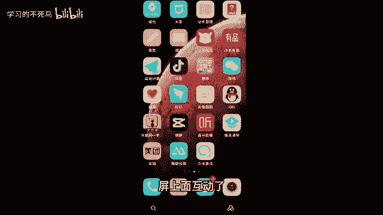

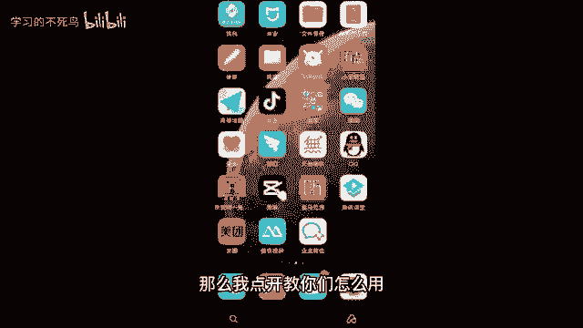

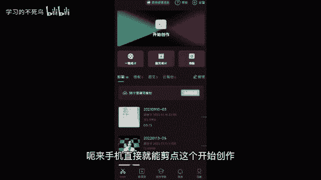

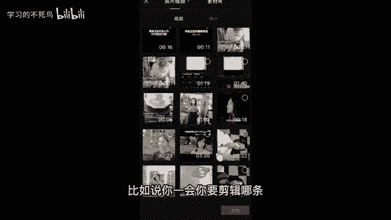

你看这一条就添加进来了。比如说咱们是拍那种生活片段，有好几条开头中间结尾的，你这一条你先把它剪好，剪好之后，你直接点这个加号。😡，你再把第二条再导进来，对吧？你一条一条导一条一条的剪，这样不会乱。

那我们先把这条剪了啊，看问题出在哪儿啊。首先第一步构图比例就错了，怎么解？😡，点一下这个视频，然后往右滑。😡，然后接着点击这个方块编辑。

接着左边点这个旋转。😊，旋转到合适的位置，对吧？如果说再想裁一下比例，可以点第三个裁剪，这里有什么1比14比32比1都可以啊。自己去调一下。咱们第一步先把这个调好好。

调好之后回到主页那我们得听一下这个视频吧。点这个播放，听一下。哎，你发现没？我前面都没说话，这没说话的地方，咱可不能要要了就是浪费时间，这个竖线其实就是一个剪刀，比如说我们想把前面这段剪掉。

竖线就竖在这儿还是一样点一下视频点第一个分割，哎，分成两段了，对吧？前面不要点一下点删除很简单，对不对？来再重复一遍啊，比如说不要的，选中分割来选中分割，中间不要的，选中删除像结尾对吧？关手机的动作。

不要的，还是一样的啊，选中分割选中删除很流畅啊，你就记住选中分割选中删除就能把它剪掉，像结尾这个不要，咱也选中删。😊。

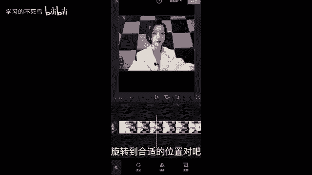

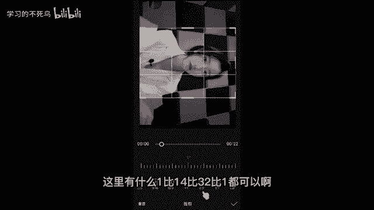

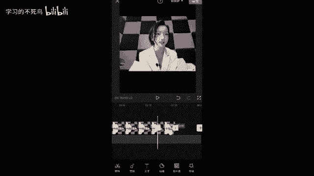

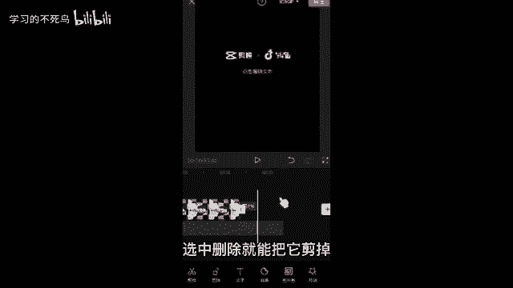

原图。然后接着完整的视频，你这自己去仔细看一看，剪一剪啊，视频剪好了就得加音乐了。第二个就是音频，点一下音频。然后你如果刚才用了淘金阁配音的同学，可以直接点第三个提取音乐，把音乐导入进来。

直接提取就行了。如果没有用淘金格的，直接点第一个加音乐，这里有很多分类，你可以搜歌曲或者看这些音乐的分类，你看美食啊，美妆啊、儿歌呀、萌宠啊，点进去都有一堆歌曲。

包括下面你看你只需要点一下这个头像就能够预览，把这首歌下载下来听一下，如果你觉得这首歌不好听，对吧？你就换一首我们选好了，直接点击使用就行了。你看这首歌它就导进来了，音乐的就进来了，那么怎么剪辑音乐呢。

音乐太长了，还是一样的。来剪刀竖在这儿选中。😊。

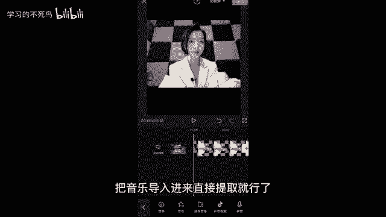

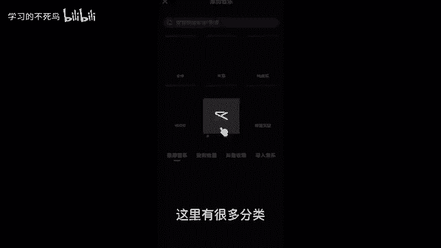

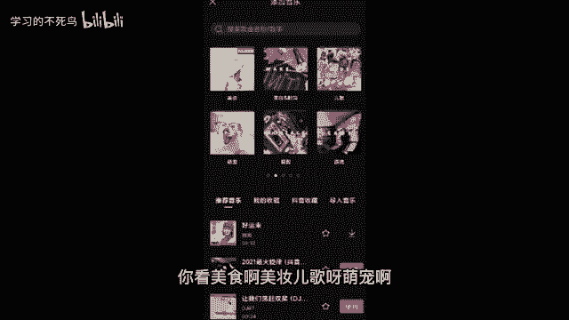

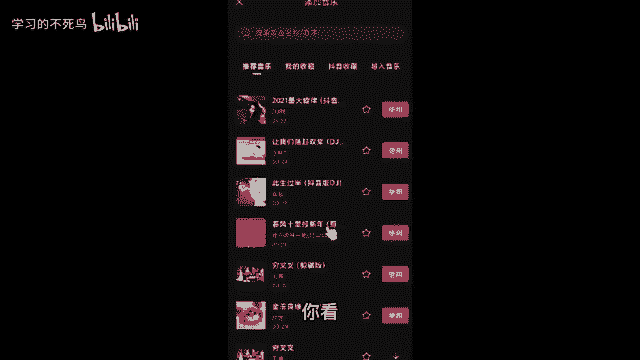

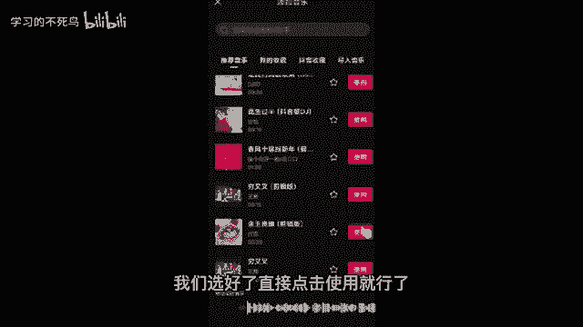

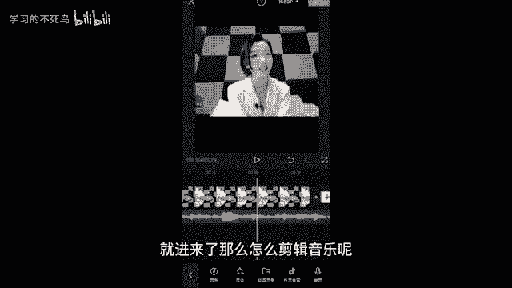

分割选中删除对吧？很流畅啊，然后音乐的大小怎么调？选中这个音乐。左边第一个就是音量，音量可以调小点，调下调大一点，自己去调啊。然后完整的视频是不是要加字幕，怎么加字幕，回到主页。第二个完了。

咱就来到第三个。第三个文字点一下，接着你不要自己一个一个的去加字幕，这样很累，我告诉你一个好方法，你点第三个识别字幕，点一下，然后直接识别嘛，识别紧视频，尽可能别点全部，因为咱们刚才加了音乐。

全部它有歌词，对吧？开始识别左上角就在字幕识别当中，机器人它会自动给我们加字幕，你不用说自己一个个打字，又快哎又方便来识别出来，把它拖到合适的位置，你看后面都在合适的位置。然后你再检查一下错别字。

有错别字了，你就可以双击一下，双击，咱们把错别字删除，修改一下，然后还可以改一下字体，改一下样式。比如说我。😊。

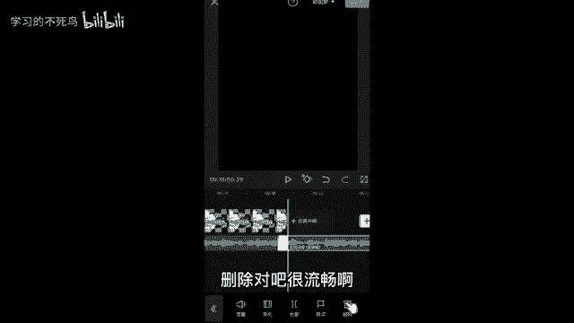

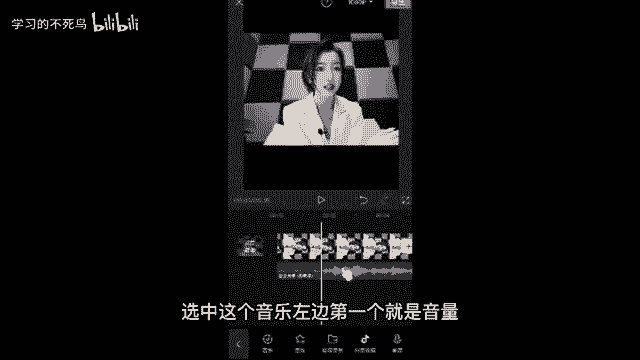

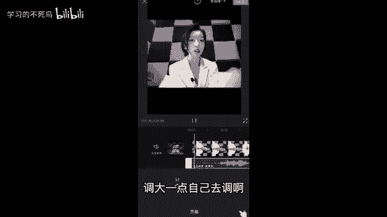

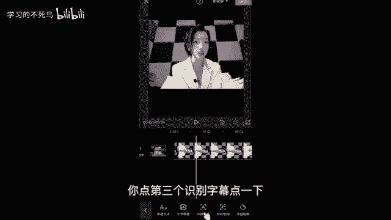

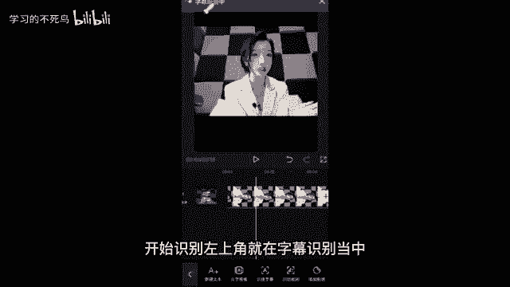

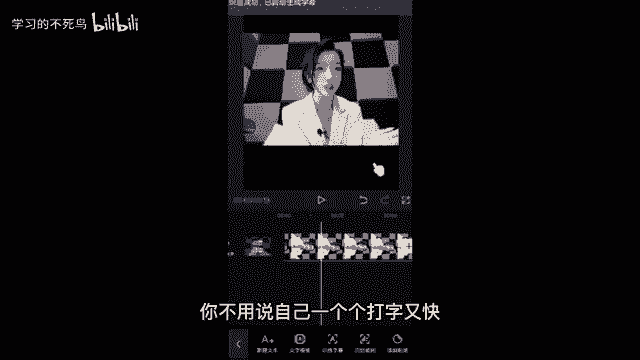

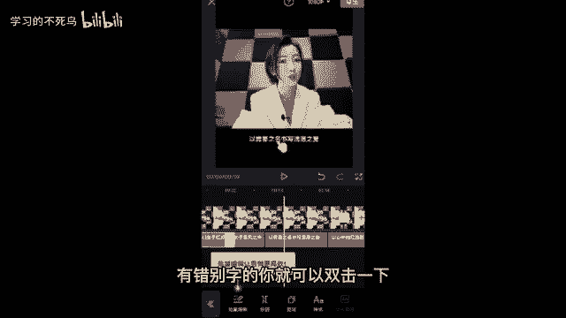

黄衣服我改个黄色的字。😊。

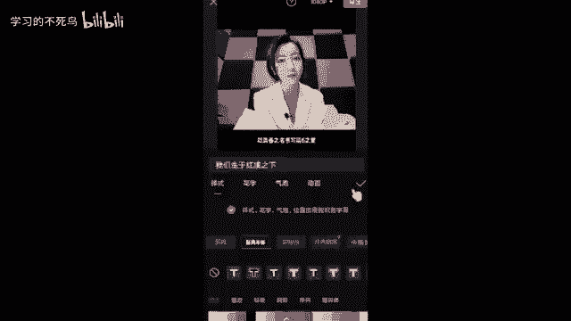

你看到了没有？这些是不是都改好了，我们的比例调好了，对吧？我们的视频剪好了，我们的音乐加好了，我们的字幕也一下就生成了。这个视频其实就很完整，就都有了，就跟种小草那个一样，都有了，你就可以导出了。😊。

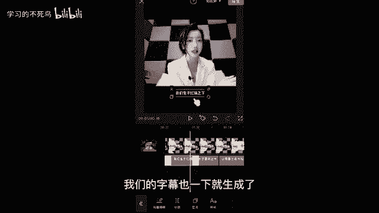

那我跟你们说，导出之前啊，来小细节，这里导出左边点一下，咱们得调整它的一个视频清晰度，你得让它视频不被压缩掉，那怎么办？做抖音你就记住，咱们帧率就调到30，三十做抖音最合适。然后分辨率咱们尽可能拉满。

因为分辨率越高，视频就越高清，你就记住到时候帧率调成30分辨率拉满就可以直接导出了。这个视频我不要啊，我就调低一点，咱们直接导出导出的时候记住，不要锁屏或者是切换程序，我们耐心一点，等它导完就可以了啊。

因为你如果说这个时候切换程序，它没导完，你就给打岔了嘛。好，导完之后啊，直接分享到抖音就行了。因为这个软件它也是抖音的，都是抖音的，直接分享到我们的抖音就可以了。来这个环节你知道怎么弄的。

给老师我扣个666，我看一下，也认真听，也认真记下来了，我都已经一个一个给你们强调了，只要我强调的地方。😡。

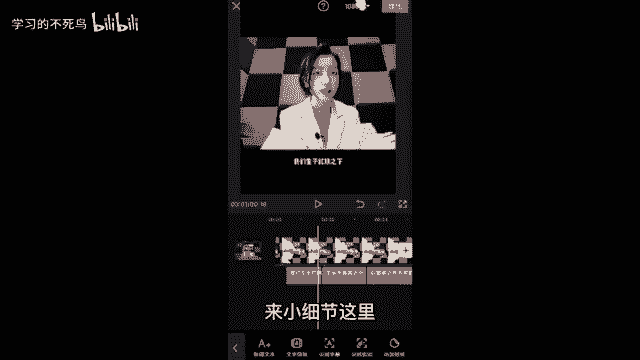

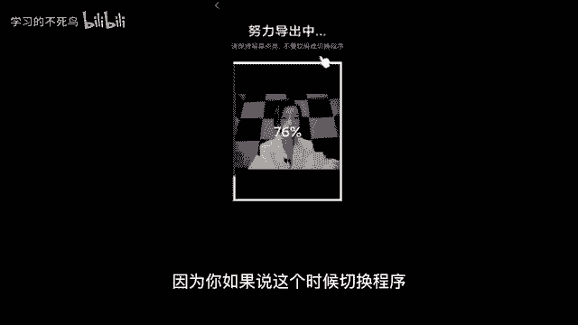

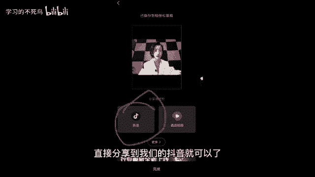

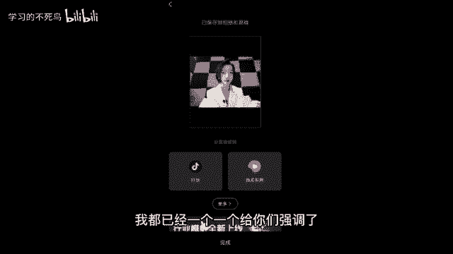

你都记下来，你自己操作一下，应该是没有问题的。实在是还不懂啊。课下可以问问我啊。来，接着我再给我们做口播的同学推荐一个软件，不需要你来背诵了啊，加声音。老师我刚才教过了。😡。

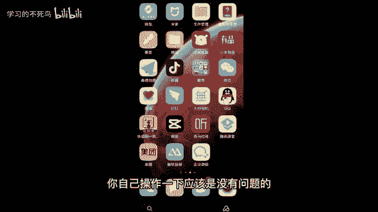

来不需要你们去背诵的啊，来我们下载一个软件，这个软件啊还是一样。我讲课的时候，你不要走神，可能十几秒就是一个知识点。来这个软件叫做爱提词，看到了没有啊，爱提词来你我讲到哪儿，你听到哪儿，你要是错过了。

你要是没有学会的话，你课下问我，不然的话，你前面也没学会，你后面我讲的这个知识点，你又没听进去，结果你就是西瓜也没捡着芝麻都没捡着来爱提词看到了没有？这个怎么用啊，口播的同学点进去，包括你后期想做直播。

记不下来词来点进去点右下角这里有个加号，我们直接点添加，你就可以把你的那个台词，你背不下来的台词直接打字或者复制粘贴，打进来，我先随便打一点啊。然后比如说我们这个台词讲的是情感语录。

我们哎随便啊情感语录打上情感语录。😡。

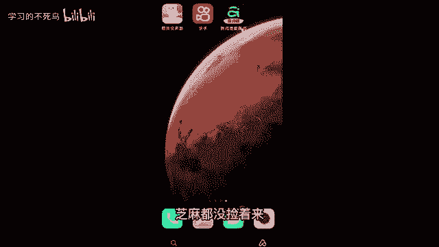

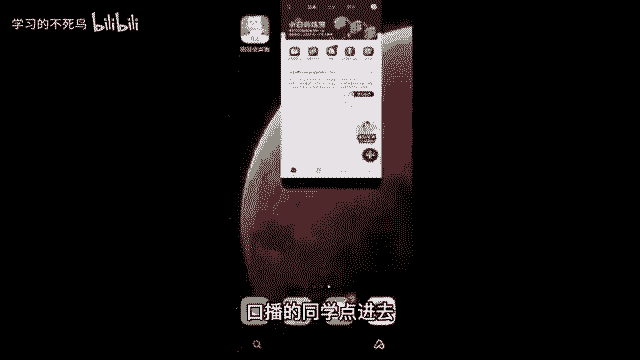

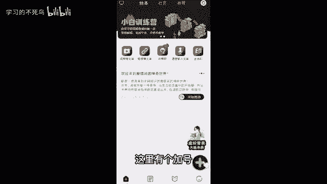

情感我老是打成枪杆。😡，情感语录哎，在这里哎随便打一个标题吧，打完标题我们直接保存啊，保存完了之后怎么用啊？你看我们要录制这个台词，你直接点开始题词，点这个录制模式。😡。

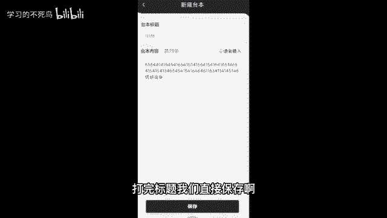

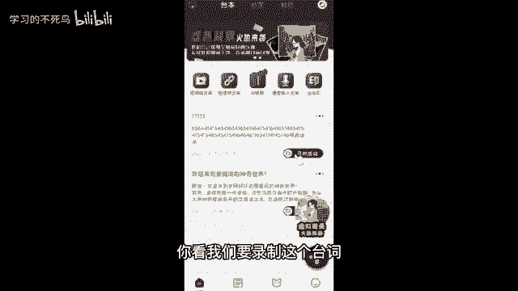

你看咱们就可以一边录制，一边照着读了，你再也不用担心背诵或者记不下来。因为做口播你不需要背诵，你把词准备好就行了。然后如果你近视眼的同学，我们点中间这里啊点这个设置，你可以把字体调大一点，对吧？

你近视眼你都能看得清，就再也不需要背诵了，也可以调小一点都可以啊。然后左下角包括我们拍摄不要用原相机，原相机把人拍的不好看，你用啥，你左下角有个美颜，你可以调个什么瘦脸啊，大眼呀，磨皮啊，美白啊。

祛痘呀，加滤镜啊，对吧？你给自己调的好看一点，这个它的软件的好处就在于它不会像美颜相机给你拍的那么就是拍的那么假滤镜那么厚，你看它没有什么很厚重的滤镜就能给你拍的又自然，就会觉得你的漂亮是天生的一样啊。

这是老师我给你推荐的，能解决，你不知道用什么拍，包括说解决你背不下来。然后这里有一个爆款文案，你看这里有一些直。😡。

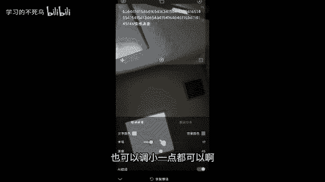

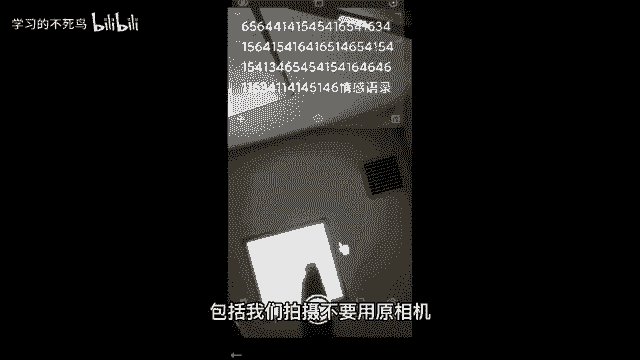

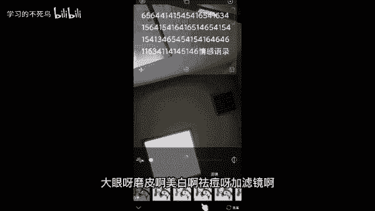

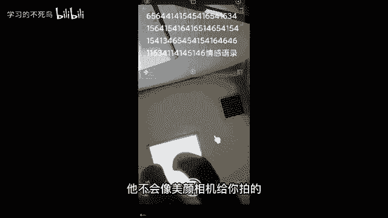

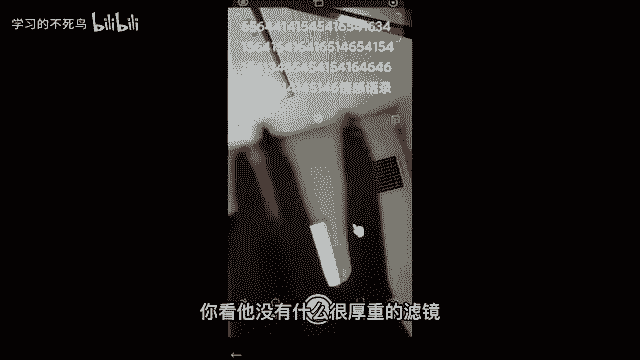

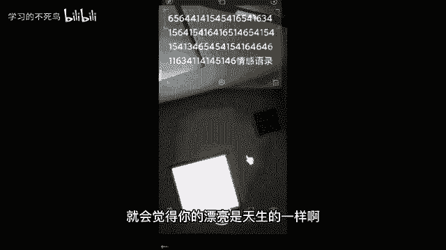

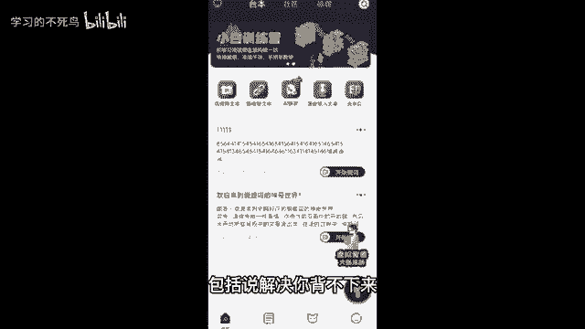

业职场啊，你看创业管理、金融、职场保险、情感健康啊、科普教育啊、生活时尚啊很多类型啊，我觉得你稍微下载下来，花个10分钟看一下，你绝对能会了啊。这个你到时候把这个APP下载下来啊。

这就是老师我给你讲的这个板块。😊。

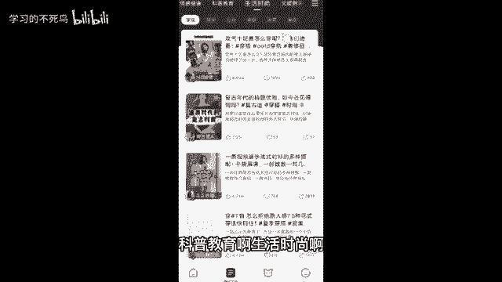