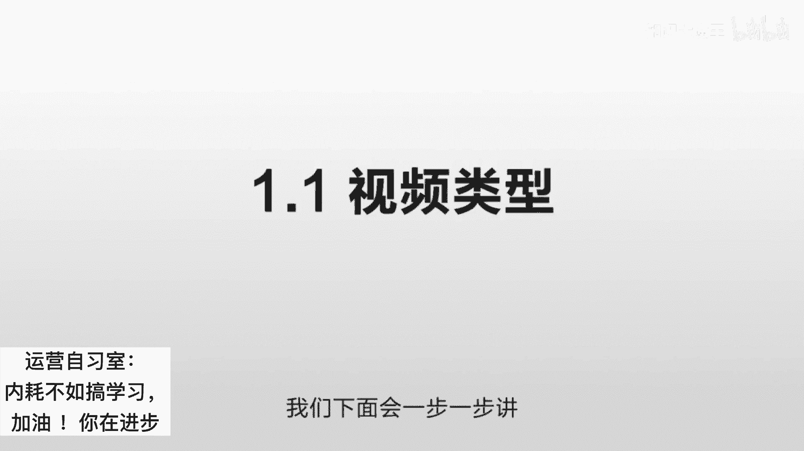
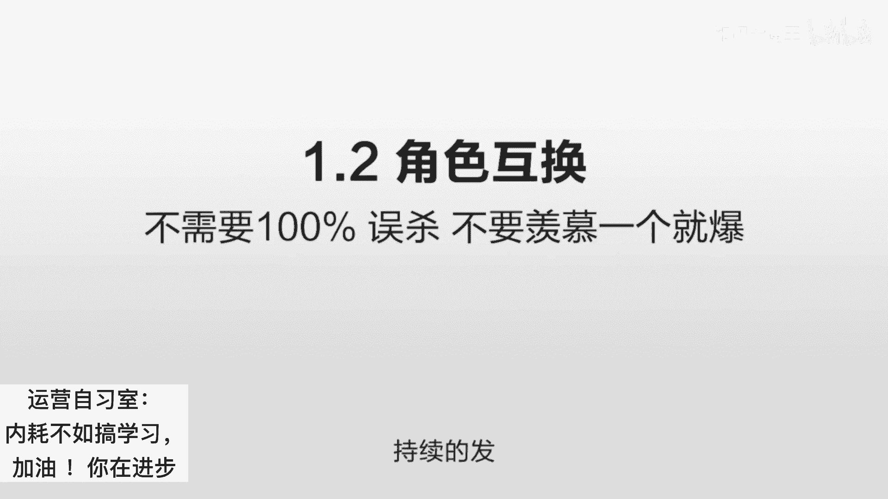
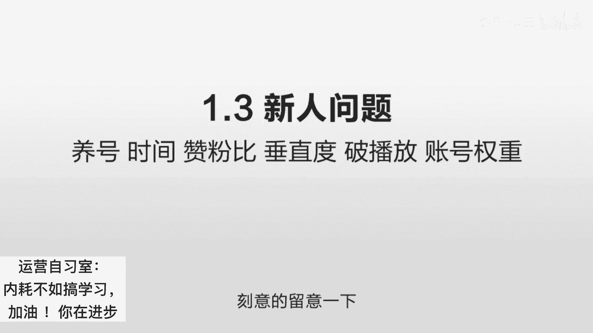

# 抖音运营从0~1全攻略【基础入门篇】B站最良心的最新2024抖音运营起号版全套教程（新媒体运营精华版） - P10：1第1讲：读懂平台算法 秒懂短视频运营逻辑 - 人生不复制 - BV1yWHKeMEud

碧瑶碧瑶，你每次都白嫖，我怎么活啊，碧昂呃，你这个逼占用了我，哈哈好，我们今天就开始讲这个抖音的算法原理。

我们知道自己研究一个事情有两个方式，比如说我想在抖音上面让我的东西大火，那么通常有什么样的方式呢，一个是你自己做测试嘛，我不知道什么样的东西可以火，我也不知道他喜欢什么样的东西。

我也不知道用户喜欢什么样的东西，那怎么办呢，那我就什么样的方式都拍一些各种的测试角度，都尝试一下，最后我看它什么样的规律容易火，这个要自己找规律，要么呢你就是反推它的算法原理，比如说你明白它的原理。

你站在他的角度去看，什么样的东西能够给他带来价值，他会把什么样的东西放在前面，然后你再去反推自己，怎么去迎合他的这个喜好，从而让自己的播放量，来达到一个非常高的一个水平，在实际的操作当中。

这两个方式我们是要同时用的，那我们首先需要很了解它的原理，到底怎么一回事，你才能更清楚自己的角色，那么抖音它到底是个什么东西呢，它实际它是一套程序，它什么也没有，它的所有的内容都是用户自己上传的。

那么他的所有的那些观众，也都是用户自发去传播的，那么等于它两端都不是它的东西，它只是一个连接器的作用，把这一部分人的东西推送给另外一部分人，看它的内容类似于什么呢，UGC就是用户自行的生成东西。

你如果在之前上过论坛的话，你就知道它就类似一个论坛，比如说你有一个discuss一个代码，但这个东西什么都没有啊，它就是一个程序而已，你需要找人往里不停的发帖子，你才能让这个内容量起来起来之后。

你才能进行一个良性的互动，有一些版主有一些用户，然后来实现一个更大的一个传播，它本身是一个框架，它本身什么都没有，它是需要通过这个框架，把这个内容有机地结合起来，像滚雪球一样越来越大，你的内容越来越好。

就会吸引越来越多的人，越来越多的人来给你贡献，越来越多的内容，差不多是这么一个情况，那这里面就有一个问题啊，当你有海量的内容的时候，你怎么通过一个机器的算法，把最优质的东西推送给用户，这个东西很难。

你比如说你十个东西的话，你可能看一下，你告诉大家说哪个好一点，可这个东西如果数量级一旦增加了之后，他就完全变成另外一回事了，你比如说1000个，那可能会你加一些算法，可能可以，那你比如说1万个。

10万个，你如果几10亿个东西，每天会有几千亿几千万个东西去上传的话，你这个东西鉴别就非常非常难，你必须要有一套非常高效，非常合理的机制才可以，这个机制就是我们来反推抖音的关键，那么讲这个东西之前呢。

我们先讲一个大家熟悉的东西，百度是吧，你搜一个东西吧，其实大家都是一样，百度也是它没有任何自己的东西，他所有东西都上网去抓取，先存起来嘛，比如说你在百度里搜一个东西，你说这个苹果手机怎么样。

然后呢会有几比如说几千万个结果，然后他会一页一页的往后排，那么前十个肯定是就是效果是最好的，就是最符合大家需求的，那么问题来了，就是你搜任何的词语，他都可以在0。0几秒之内给你一个反馈。

那么他是怎么知道这些东西是大家最需要的呢，这个就是机器的算法原理，很多时候它和抖音的这个原理是相通的，那我们先讲百度，在最开始的时候是没有百度这个搜索引擎的，它像是雅虎那种分类网站。

比如说我是个做汽车的，我就把所有的汽车网站罗列在一起是吧，我是一个做那个呃女性用品的，我就把所有女性用品都是网站把它罗列在一起，我是个做那个婴儿用品的，就把它罗列在一起。

但这样的问题在于你完全人工去操作的话，效率非常的低，而且网站越来越多，而且它的时效性也有问题，后来他们就增加了一个算法，就是让机器去识别，在那个时候机器非常的弱智的，就是说他怎么去识别呢。

我不能理解你的东西啊对吧，那我就看你的标题里面写了什么东西，比如说你写了一个帕萨特哎，那我就理解你，这个可能是讲那个帕萨特的一个东西，有大家去搜这个帕萨特的时候，我就会把你这个页面排在前面。

比如说如果十个网页，大家全部都放帕萨特的时候，会怎么办呢，你要选一个诶，哪个帕萨特可能更重要一些，他怎么判断重要性啊，他是通过这个帕萨特出现的数量，比如说有一个出现了五次，那个出现了两次。

他就会认为说哎出现五次的更重要，它可能写了更多关于这个车的东西，然后他就会把这个排在前面，但你知道这个他是一个很大的漏洞的对吧，他虽然他不会告诉你算法是怎么样的，但大家可以反推出来，当大家发现说哎。

你里面出现的帕萨特越多的时候，我就越容易排在前面，这个时候就会有人把标题里面写上，100个帕萨特，那这样的话你搜什么东西，只要你搜帕萨特，他就排在你前面了，这个时候就很容易作弊，那么发展到最后。

那么搜索引擎使用了一个最容呃，最有效的防止你作弊的方式是什么呢，是找到那些你很难作弊的因素，比如说你自己的网站，你想怎么写怎么写，但是别人的网站怎么说，你你这个很难确定啊，这个就是靠超链分析。

就是别的网站有多少链接到你这边，然后从而确定你的这个关键性的权重，因为别的网站你没有办法控制的，你可以控制一个两个十个，但是几百个几千个网站，大家怎么来链接你，链接你的时候用什么样的词语来链接你。

这个词语就说明了你的网站是干嘛的，他等于间接的告诉了这个搜索引擎，你这个网站是做什么的，这样的话它就可以通过一个很难作弊的方式啊，来实现精准的判断你的内容，那么更进一步呢，其他的网站指向你的网站的越多。

他就认为你的价值更高，这样的话把一个可以作弊的因素，转化为一个不可以作弊的因素，从而提高这个可信的权重啊，这个后来有很多的攻防，我们就不具体讲了，大概是这么一个意思，那么回到抖音。

他现在日活据说已经是破5亿了，那么在这么多人同时在上传东西，大家都相互看的时候，你怎么去确定你的东西是用户喜欢的呢，他答案是先做一个小范围的测试，就我不知道你的东西是不是喜欢，但是不重要是吧。

我先把你的东西推给100个人看，那么这100个人看了之后，如果觉得好好，那我再把它推给1000个人看，1000个人看觉得好，再推给1万个人看，逐步的它会有一个一个的用户池，你的质量到达一定程度。

你会进到下一个这个用户池，下一个内容尺，然后再到达一定程度，再到下一个内容尺，它是逐渐的一个升级的一个过程，但这个过程你是不知道的，他是随机给你分配用户，然后进一步来确定你的内容质量。

进一步来确定你的文章的权重，也就是说抖音的观念，就是你要做出一个优质的质量，在他推给100个人的时候，让这100个人感兴趣，那么你和谁去比，和另外一个陌生人去比啊。

他比如说你们两个的视频同时推给了100个人，你只要超过你的竞争对手，唉你可能就优先进到下一个那个内容池，然后呢你在下一个内容池再打败你的竞争对手，再进到下下一个内容池，大概是这样的。

你不需要关心它的算法的原理是什么样的，它是通过一个其他用户的反馈，来找到一个你不可以作弊的因素，从而确定你的内容的质量，那么我们现在知道了，你迎合的其实不是抖音，你迎合的是千千万万的用户。

你如何找到用户喜欢的东西，做出他们喜欢看的东西，让他们看完，让他们点赞，让他们评论，这东西最关键啊，重点就在这个方面，也就是说你给抖音提供了更高价值的东西，你黏住了它的用户啊，你让这个人评论。

你让这个人转发，或者你让这个人点赞，你让他的时间在抖音上沉淀下来，抖音才觉得你的东西有价值，你们两个才会形成一个正向的循环，他才会给你分配更多的用户，让你去吸引更多人的时间，从而给他做沉淀。

你明白了这么一个原理，我们下面会一步一步讲下一步的操作。

那么现在我们讲第二点就是角色互换，就很多人做抖音会有一个误区，他们经常说我的东西为什么不火，哎为什么他的东西火，为什么我的这个东西播放量这么低，你知道啊，在这个社会上生存，就你的生与死一点都不重要啊。

你哪怕播放量是零，也对这个世界一点点没有影响，对抖音一点点没有影响，你作为一个成年人，你第一句要问的就是我能给抖音带来什么价值，就我能给你带来什么价值，从而你给我什么东西，而不是上来像一个巨婴一样说。

哎我怎么没有播放量啊，怎么这么低，这个怎么这么差，你永远要明白哈，一个系统他不需要做到百分之百的准确，他只需要把这个准确率做到99%点，后面几个九就OK啦，他只要保证绝大部分的东西是准确的就行了。

而且这个世界是多维的，还是有人觉得你的好，有人觉得他的好是吧，而且大家你比如说你是一个你是一个拍美女的，她是一个拍情节的，她是个讲知识的，你说三个维度到底谁更好，你很难确定啊，他一定是有误差的。

你不要去关心这个误差，你只需要尽量的想，你能给这个平台提供什么价值，怎么能把这个用户黏住，这个才是最重要的，所以你永远不要说怨天尤人，说哎我这边怎么没有播放量，我这边怎么没有浏览量，这个不重要。

永远不要想着说我做一个视频就爆掉，你看到的那些做到一个都爆掉的，那怎么回事，要么就是运气特别好啊，直接一个就爆掉了，要么就是他们是有一个团队有经验的，你看到的是这个视频做了一个就爆掉了。

实际上他前面有几十个账户，全部都没有爆掉，那么他只是到了这个账户之后，才找到了这种感觉，找到这个点，所以一发就爆掉了，那有可能他做了这个之后，他做了斗家的推广，他有可能用其他账号去转发。

这些都是辅助的因素，你不要去看这个东西，我们讲的重点是什么呢，你不要站在自己的角度，你要站在抖音的角度，他一定是有误差的，但我们自己怎么去防止误差，怎么怎么避免自己变成这种牺牲品呢。

答案是你持续的发优秀的作品，当你的作品足够多的时候，这个误差就会越来越小，准确率就会越来越高，你凡事要站在对方的角度去考虑啊，比如说你是抖音的话，几千万个用户同时上传，有很多是新用户。

他可能今天刚刚注册，然后啪就上传一个东西，请问你应该把它推荐给多少人，因为你的总的测试量就有这么多呀，你最开始一定是非常非常少的用户，而这里面就会产生一个问题，当用户少的时候。

他的偏差度一定是非常非常大的，有可能这100个用户他就是不喜欢你的东西，你把这个样本扩大成100万，大家都真的喜欢了，他就是这100个没有推准，这完全有可能，而且你的权重很低。

他没有必要说给你推很大很大的量，所以他一定有一个积累的过程，你一定不要怨天尤人，持续的发。

这个是关键，第三个就是一些新人的问题啊，我们一个一个讲，首先需不需要养号，直接说答案，不需要，就你凡事是要站在对方的角度去想的，就是为什么很多人说去养号，那是站在你的角度说，过了一段时间。

这个账号就起来了，答案是你不需要养，你正常的去发，过一段他也起来了，这个就是我们之前讲到的误差，当你的东西很小的时候，你是很难判断出来你到底是好还是不好，你是一个很小的人，你是个小草。

他没必要为一个小草去付出巨大的鉴别成本，那你要做的就是不停的输出优质的东西，总有一天有一个会爆掉，这个爆掉的东西会带动用户看你其他的东西，从而导致你整个的账户的权重提高，养号是一个无稽之谈。

第二个就是时间，有人说我这个时间应该是多久啊，最开始的时候我们是建议一分钟以内，最好是半分钟以内，你先做好这个完播率，完播率什么意思呢，就是用户看了你的开头，看到你的结尾，100个人看，从开头开始看。

然后有多少个人一直看到了结尾，这个就是完播率，完播率越高，就说明你的价值越大，你能吸引用户，你能把他时间给黏住，这个才是抖音最想要的，他不想让你去其他地方，就让你把它黏住，他认为你有价值。

那么当你的时间变成一分钟或者2分钟，或者一开始就3分钟的时候，会出现一个问题，你的控制力不强，比如说这个东西你15秒或者30秒，你可以把它讲的很有意思，可是你一旦把它变成一分钟，2分钟，3分钟的时候。

你的掌控力就会直线下降，有一个环节你没控制好，这个用户就流失掉了，所以你先从短的时间开始测试，先把这个15秒30秒给做好，做好了之后没问题，我们在一步一步的扩展，再扩展到一分钟啊，一分钟说不清。

我们在2分钟最开始时间一定不要长，15秒到30秒去说清一个问题，简单直击重点，然后是一个破播放的问题，什么是破播放啊，就是一个雕虫小技，一个小技巧，什么意思呢，我们经常说完播率。

那么我如果时间很低很低的话，不就可以提高完播率了吗，就好像有人为了提高那个app的日活，有一个作弊技巧，我头一天发布，第二天还有多少人用，是一个很关键的指标，可如果我把发布时间定在晚上23。5。

19分呢，那你这样的话，几乎百分之百的人都会在第二天用完播率，就这么一个意思啊，我就做一个五秒钟的视频，你还没看完呢，它又播放了下一遍，而且这个重复播放的次数也很重要，很多人用了一些这样的小技巧。

就是呃先吸引用户，然后在里面放很多很多内容，你五秒钟肯定看不完，你肯定要看第二遍，第三遍，第四遍，但这个是一个典型的很容易作弊，也很容易识别的东西嘛，他只要看出你这个时间很短，并且故意的去设置一些东西。

这个方案就很容易失效，而且本质上来讲它是一个雕虫小技，就他完全是一个系的级别的，它不是一个体的级别的，你得你得了解这个来龙去脉，你得知道这个逻辑关系，你才能从体的级别做出一个超出对手的一个。

全面性的行为，而不是说你了解了一个小技巧，就马上可以超出对手，因为破播放是个公开的东西啊，就你会用这个，别人也会用这个这样结果就是大家用了，等于大家都没用啊，不要关注这个完全没有用。

它只是在你最开始测试的时候，你如果对自己的内容实在是不放心，你可以测试一下，那接下来就是一个垂直度的问题，所谓的垂直度啊就是你是做什么内容的，比如说你是做汽车的啊，你是做美妆的啊，你是做这个。

你是做美食的，你是做搞笑剧情的，这个就回到最开始那个搜索引擎的算法，就其实搜索引擎也会给不同的网站，设置一定的垂直度，但实际上来讲，相关度和用户的反馈才最重要，就我知道你是做美食的，但是你做美食的同时。

你百分之百一定是在这个行业吗，你百分之百不会超出这个范围吗，你不会吸引美食之外的人来看你吗，而且不同的账号它的定位实际并没有那么严格，那有一些你可能很难找到，他具体是什么样的定位。

所以相关度和用户体验才是第一位的，就是你不要过分的去关注这个垂直度，垂直度是对你自己而言，比如说你是打算做什么行业，你是打算做这个网上教英语的，那你就做这个呗，你没必要说你坐了一会儿。

你突然又给做成美食了，这个对你来说是没有必要的，但是抖音是没必要按照这个去区分的，他只需要按照用户的习惯去区分，用户的体验去区分，只是说你的垂直度，它可以优先的往这个人群去推送来减少误差。

比如说你是个教英语的，我突然给你网一帮另外的那些用户去推送，这可能会出现较大的误差，不利于发现你的优质内容，但如果你一直是讲英语的，我可能会优先把你的东西推送给另外100个，喜欢看英语的人。

那这样的话我识别的误差就降低了很多，就是说你始终要从他的角度来看，为什么要做那个垂直度，不是为了垂直而垂直，是为了减少误差而垂直，那么这又涉及到下一个问题，就是账号的权重。

就很多人说哎我的播放量为什么没有破500，很正常，你为什么要破500呢，你就是个新人，每个人都破500了，那一共就那么多用户，你说应该分给谁，所以最开始的那些海量的用户啊，你是一个新人。

你的播放量一定一定是很低的，这个是必然的，但是随着你的发的东西越来越多，随着关注你的人的东西越来越多，抖音就开始逐渐对你的账号有清晰的了解了，我刚开始见你第一面，我不知道你是什么样的人。

可是我们生活了一段时间之后呢，我了解了你的习惯，我了解你的这个工作呃，行业我了解了你的这个家庭住址，这些东西我慢慢的都熟悉了之后，我对你的信任度就会增加，抖音也是一样啊，你持续的发东西。

你的信任度就会增加，你的用户关注量会增加，那么他对你的信任权重也会增加，这个时候你的账号的权重就有，慢慢的提高了，但是这个权重提高有什么作用呢，它并不一定意味着，你会比那些低权重的账号一定播放量要高。

它只能是说减少误差，就比如说你是一个新的账户，他可能会给你推送给100个人，但如果你是一个有权重的账户，他认为你的内容天生具有一定的价值，它会给你一个更高的初始量，这个才是战后权重的真正的意义。

你有价值，他把你推给1万个人，这样的话就减少误差，更容易识别出来优质的内容，这会进入一个正向的循环，但是抖音呢它是非常看重内容的东西，并不是说你的权重高，你就一定会比一个账号靠权重低的账户。

你的播放量就一定会超过它，不是这样的，它更多的是看用户的反馈，所以抖音对很多新人来讲是一个很好的机会，就你不需要去在乎对方的权重有多高，这个不重要，你只要有一条视频爆掉，你就可以快速的涨粉。

这个非常非常合适，还有一个就是赞粉比，比如说有一个人他有1万个粉丝，那么他的一共点赞量呢是4万，用4万除以粉丝量，就是赞粉比就是四，这个占分比越低，代表你的账号的价值就越高，它通俗的说明一个什么事情呢。

就是同样的播放量有这么多人点赞了，点赞了之后，有多少人顺便转化为你的粉丝沉淀下来了，这个很重要，你得沉淀你一个东西很有趣，别人点了哈哈一笑哎过去了，这个没用的，人家是一个数字方面的一个繁荣。

一个虚幻的一个繁荣，你得把它变成你的粉丝，所以得想办法做好这个赞粉笔，把它从一个视频的一个用户，转化为你的账号的用户，那通常娱乐行业的这个占分比就很高，呃，比就点赞了很多，很多次才有一个留下来。

你去看那些什么搞笑行业的，基本都是这样的，他说明这个账号虽然有趣，但是对用户的价值不大，因为我关注的人也是有限的，我不可能无限的去关注你，让我笑一下就得了，但是我觉得价值不大，他可能一跳而过。

但你做知识类的这个占分比就很高，你可能做到比如说五比一或者四比一，就说明有四个人点赞了之后，诶可能有一个就会留下来，这个就很有价值，我们要尽量的提升那个占分比，具体的做法我们会在以后讲到。

有很多操作的技巧，就是说你同样是拿到100个用户，我尝试能把他留下来多少个，这个很关键好最后我们总结一下，首先我们要了解对方的原理，就是你自己不重要，对方才重要，你它的原理到底是什么样子。

你能给他提供什么样的价值，怎么样把这个用户沉淀下来，这个才是关键，你从头到尾做抖音，一定要围绕这个东西展开，绝对不要是以自己为中心啊，我怎么怎么样，我怎么怎么样，这个不重要，第二点。

你永远不要羡慕那些一个就爆掉的人，你也不需要说抖音，怎么没有识别出我的好内容啊，不要怨天尤人，你持续的发，只要你持续的发，只要你的内容是有价值的，就说一定会爆，你不用管那个时间，百分之百会报。

绝对不会出问题的，因为你的时间足够长，你的优质的东西足够多，它的准确率就无限的趋近于100%，第三个就是我们讲到的一些新人的问题，你在做的时候尽量的注意一下什么养号的问题，这种时间的问题。

这种占粉比的问题和播放的问题，这些东西你可以记录下来，在你做的时候刻意的留意一下。

