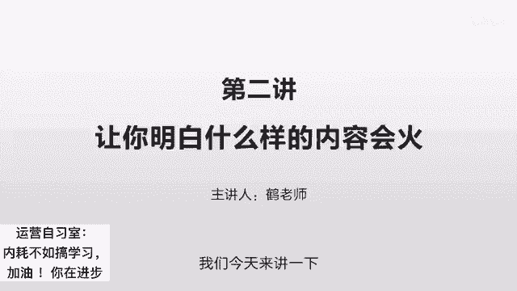
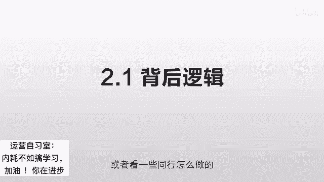
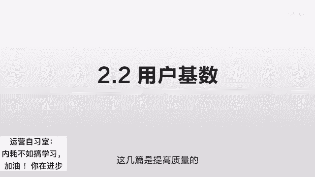
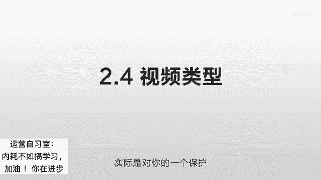

# 抖音运营从0~1全攻略【基础入门篇】B站最良心的最新2024抖音运营起号版全套教程（新媒体运营精华版） - P11：2-第2讲：一句话让你明白什么内容会火 - 人生不复制 - BV1yWHKeMEud

碧瑶碧瑶，你每次都白嫖，我怎么活啊，碧昂你这个逼占用我，哈哈好，我们今天来讲一下什么样的内容会火。

我们之前讲过所谓的抖音的这个程序，它实际就是一个人性的展现，就是用户喜欢什么，他就把什么样的东西推到用户面前，那么我分析了很多这样的作品，那些爆火的作品发现有一个特点就是损失，就是人性是害怕损失的。

只要你的作品迎合了这种害怕损失的特点，通常都会有一个不错的播放量，损失通常有两种，一种呢是当前的，那比如说这个龙利鱼和这个巴沙鱼，到底要怎么区分，那比如说买公寓啊，到底有哪些坑。

那比如说什么样的才是矿泉水，什么样的是普通的水，再比如说公摊面积会有什么样的问题，就是各种各样你不知道的，但是你不知道的话，你又经常会用到，可能会踩到坑的那个地方，这个很有价值，另一个呢就是未来的损失。

比如说你是一个非常有去的一个情节故事，你是一个非常好的一个唱歌的一个片段，或者说你的舞蹈跳的非常的好，或者说你讲了一个非常有意思的笑话，他为了担心说以后找不到你，他就会关注你，他就会点赞。

这些东西使得系统得到一个反馈，认为你的东西非常有价值，从而推送给更多的人，那我们怎么把自己的东西给做火，就是冲着这两个方面损失，最重要的是坑，什么意思，就是你把他经常可能遇到的这样的问题。

你把它适当的夸大，适度的夸大，让他觉得在你这边得到的，在其他地方得不到的东西，实际上你想一想，这个世界上没有什么东西是大家完全不了解的，所有的事实啊都是哪些，关键在于你怎么去加工，你比如说同样的一个坑。

不同人的表达方式不一样，这个播放量就会千差万别，所以你在写的时候是尽量的找到这种感觉，你尽量去找那些，比如说同样的一个坑，你看不同人的播放量，比如说有80万点赞的，可能有8万点赞的。

也有可能有8000点赞的，那么你就看他们在这个表达当中，到底有什么样的区别，你尽量去找那种播放量比较高的，按照他的这个感觉去写，因为他把同一个事情写出了深度，你比如说我写的那个公寓的自住的坑。

实际这个在我的所有的视频里面，属于没有什么技术含量的，因为之前其他的有一些讲经济学啊，有一些讲这个呃金融的一些原理，我自己觉得写的比较深，但它不火，那另外一些呢就是比如说我讲的什么牛奶可乐。

比如说牛奶为什么要装到那个方盒里，可乐为什么要装到圆瓶里，哎这个就很有意思，比我写的那个公寓自住的坑，它实际上是没有太多的表达技巧的，你看一下这个文章，他就是开头告诉你啊，不要买公寓。

然后给你列举了十个坑，最后再得出一个结论，非常简单的一个写作方式，完全没有任何技巧可言，但是这个的播放量非常非常的多，比我其他的视频的播放量都要多很多，就是因为他踩中了一个用户的点。

因为很多人都要买房子，买房子的时候，你经常会听说各种什么地铁口那种精装修，不限购的这种公寓，而且你现场去看，你还觉得房子还确实不错，然后突然有一个人告诉你，千万千万不要买，然后12345。

然后一直讲到十十个点，全部完完整整的告诉你他的缺点在哪，而且配上数据，配上图，配上具体的例子，这个就非常有说服力，网上也有讲这种公寓的坑的，但是没有我讲的这么深，通常我在表达的时候会注意一个特点。

就是宁可断其一指，也不要伤其食指，就一定要把它讲透，就网上也有很多讲究工艺的坑，但他们讲的非常浅，大概告诉你就是税费比较高，转手比较难，或者居住的时候可能会有这样那样的问题，大概提了一下，但是不具体呀。

你把它列成十条，每一条详细的举出例子，然后告诉他他真的住进去会遇到什么样的情况，然后再配上一些，比如说户型图，比如说网上的一些报道，比如说知乎里面的一些问答，把这些图放进去，就增强了这个说服力。

让他觉得确确实实是个坑，同样的一个坑，你搜这个公寓的坑的文章，你可以搜几十个，几百个，几乎都是这么一回事，但你把它总结一下，你把它用这种方式表达出来，把这个坑给它加深夸大，适当的夸张一些。

就可以击中他这个点，让他觉得真的是一个坑，比别人的坑还要坑的一个坑，这样的东西就非常容易火，你仔细观察那些火的就是火的一塌糊涂的东西，很多都是跟坑有关的，那比如说我关注的有一个去讲财经的一个人。

他讲的是什么，他讲的是一些基础的概念，就是各种金融学的概念，它用一个非常简单的一些描述给你讲出来，他的也是一样，就是它火爆的那些东西都是跟坑有关的，比如说我之前讲的一个公摊面积。

但是我讲的是非常的客观好跟不好，哪些地方应该注意，哪些地方不应该注意，哪些地方实际上是没有那么严重，感觉非常的平庸，但他不一样，他告诉你什么是公摊面积，然后直接告诉你，经销商有可能用这个来怎么作弊啊。

比如说他会在呃哪个地方会标注一些什么东西，如果你不仔细看的话，你就有可能会上当，到时候你去起诉的话也没有作用，就提了这么一句话，然后马上就爆掉了，因为用户觉得，我要是不把这个东西记录下来的话。

我很可能会踩坑，这个东西就直接击中它，大量的去转发大量的评论，这个就会增加他的权重，让系统觉得它很重要，从而推给更多的人，这个坑非常非常的重要，尽量的去找你，各个行业中人们经常会遇到的各种坑。

你不会的话，你就想你就去挖，或者看一些同行怎么做的。

反正尽量的去找坑，第二个我们讲一下它的用户基数，这个什么意思呢，就是你的一个内容的播放量的多少，实际和你的内容的关系并不是很大，它主要和你的内容迎合了用户的基数有关系，你比如说你像我去讲一个经济学。

可能关注经济学的人并不是很多，所以我那些讲那些经济学原理啊，讲一些啊，讲一些经济学常见的一些错误的这些东西的话，你可能讲的很好，大家评论也很好，但是问题就是它的播放量很低，但只要把它稍微降维一下。

它的播放量马上起来了，因为大多数人都能看得懂了，比如说那个牛奶可乐经济学，因为它是人们生活化中的例子，你讲经济学，那可能十个人中只有一个人能看，但你要讲这个牛奶为什么要装到方盒，可乐。

为什么要装到原瓶里面，十个人里面有十个人会看，你这个用户基数就大了十倍，所以你可以被推送的量也大了十倍，你把这个用户基数给降低，找到最大的那个人群就最容易爆，就这个东西要尽量的通俗，尽量的沉淀下去。

因为人群它是金字塔结构的，你越底层的越通俗，简单的说就是越low的东西，关注的人越多，你越是把这样的东西一个通俗性的话题，你能把它说的很好，你就很容易爆，你如果太过于专业，往往只能吸引到很少的一部分人。

这个在推送的时候，在算法的时候可能会受到一定的影响，那么在实际的操作过程当中呢，不一定说你所有的东西都要做的非常low，非常low，这个取决于你的定位，一般我的方向呢是怎么做，就是有一些涨粉的。

涨粉呢就是把这个话题做的很low，很通俗，但他涨粉，他这个东西爆了之后，可以给你带来几10万的粉丝，这个很有效，另外一个是提高质量的，你比如说有一些专业的性的问题，他不是很涨粉，但是他可以提升你的IP。

提升你的专业度，让人觉得，比如说那涨粉的人过来之后，发现哎你还有挺深度的文章的啊，这个会进一步提升你的IP，提升你在他心中的形象，为下一步的变现可以做准备，这几篇是涨粉的，这几篇是提高质量的。

这样的话结合在一起效果就比较好，第三个我们讲一下，脱颖而出，大家都拍一样的东西，你凭什么可以火呢，我举个例子哈，现在抖音上有一个非常火的一个内容，就是一个农村的，像一个老妇人一样。

然后她自己拿一个自拍杆，我不知道你看过那个没有，那背后是那个80年代disco的那个音乐，然后他就是左晃右晃，左晃右晃，就长得非常非常土，非常非常low，就完全看不出来有任何特点，然后爆掉了。

然后他的点赞将近200万的点赞，然后下面有人问为啥会火呀，就我觉得我拍的比他好啊，这个人说的是没错，就是你可能长得是比他好一点啊，你拍的可能也比他好一点，清晰度可能也比他好一点。

是你周围房子也比他那个周围的那些，破破烂烂的房子要好，但是不重要，你比他好，反而把你变得平庸了，你知道脱颖而出有两个方向，一个是往上，就你做的特别特别好，特别特别牛啊，牛到别人一看哇，太厉害了。

和别人不一样，一个就是你做的特别特别low，你说low到不行，就全网最low的这个也叫脱颖而出，而中间的那些人恰恰是不伦不类，你往上也没有上去，你往下也没有下去，你随便一个人拿一个自拍杆拍出来。

都是你那种效果，当用户看到千篇一律这种情况的时候，他就会对你无感，他会对那种拍的特别特别棒的人有感觉，或者说那种low到他直接超出他下限的东西，有感觉，而这个东西恰恰就超过他的下限了。

就总之你一定要和你的竞争对手不一样，当大家都做这个的时候，你尽量做的和他不一样，从而产生一种识别度，让用户认识到你，让用户觉得你的标签是和其他人是不同的，那这里面很重要的一个呢就是拍摄的技巧。

比如说现在抖音方面就是很多的拍摄，实际上是一个非常初级的状态，大家实际是在拿手机拍，除了一些专业的团队，他们来做一些剧情剧，他们是拿一些专业的设备去拍，绝大多数人你包括很多知识的博主，都是直接拿手机拍。

这个就是一个非常好的脱颖而出的方向，以后我们会讲这个东西就是如何使用一些简单，用便宜的设备把你的东西拍出专业级的水准，用一些简单的灯光来达到一个专业的效果，从而第一眼抓住用户的眼球。

你比如说你看我的这个排版，几乎全部都是一个样子，这个就非常的震惊，你知道吗，就很多人去看了之后说，我从来没有见过一个人拍了200多个视频，从来没有换过角度，没有换过位置，没有换过光线，就完完全全一样。

像一个模子刻下来复制粘贴一样，这个就会给人一种震惊的感觉，他有技术含量吗，他没有技术含量，他就是做的跟别人不一样，你没人这么做，对不对，那我就是第一个就好了，这个就脱颖而出了。

总之你要想到一个办法脱颖而出，你跟别人不一样，用力去想这些东西，那有的人比如说刚开始的时候去拿一把刷子，去梳子去梳头啊，有的人可能戴一个口罩呢，口罩中间是可以张开的。

反正总之你要是跟别人一定要想办法脱颖而出，反复的去想这个点在哪，我给你举几个例子，这个拍摄有多重要啊，有一个律师呢，他之前呢也是在拍这个抖音，但他的拍摄方式呢非常普通。

就像很多人就是随便就是把自己的一些知识，录在这个视频上，然后发到抖音上去，然后有一个人给他拍，然后那个镜头可能也晃晃晃的，然后他也没有仔细的去剪辑，就对着镜头去说一个东西很长时间都没火到。

后来突然有一天它火爆了，是怎么回事呢，是他找了一个团队，好像是给他正面的去拍摄，然后他穿了一身正装，非常有律师的感觉，而且他的文案非常的精简，就是几十秒的一个东西，直击重点，给你说清楚问题。

而且紧扣热点，那么你去看一下他之前的拍摄效果，跟现在的拍摄效果，画面和声音完全都不一样，整个画质得到了质的提升，音质也得到了质的提升，那么它的内容从头到尾是没有变化的，它不会说我改了一个拍摄方式。

我的知识储量就变化了，没有知识储量是没有变化了，就是这么一个拍摄方式，想办法脱颖而出，做的跟别人不一样，想办法专业精炼，抓住用户眼球，就很容易爆，还有一个汽车领域的，给你举个例子，有一个叫毒辣车评的。

就大家都是做车评的，但是很多人做车评呢，是沿用以前的那种车评的方式，你比如说你去去过汽车之家或者这种网站的话，你知道他们那种长视频怎么做的，大家好，我是谁谁谁，今天我们来到某某某。

今天我们试驾的是一款什么样的车啊，这个车是怎么样的，能给你讲15分钟，特别崩溃，你知道吗，但这个毒辣车评不一样，它非常的精简，非常的干练，他就像一个采访一样，有一个话外音啊，说区长这个车怎么样。

那个车怎么样，这个车有什么的缺点，哪个车离了中国市场活不了，然后他就开始快速的去讲这些知识点，他可以在很短的时间内把这些重点输出给别人，但这只是一个方面，他最开始是采用这个方式，但是一直都没有火爆起来。

后来他采用了一个点，啪一下就爆了，它采用什么点呢，比如说区长十到15万之间，最适合买的合资车是哪些，如果这个时候他正常的去介绍，这就变成一个很普通的一个介绍车的视频了，但是它采用了一个很有意思的点。

他把手往前伸一下，打了一个动作，然后镜头外面给他递了100块钱，然后他把这100块钱揣兜里，然后才开始说哎这个就非常的有特点，就让人一下就记住了，就是他是一个自嘲型的，我是收钱来讲这个事情的。

就马上的就和别人不一样了，这个就脱颖而出的关键，你不需要说花多大的精力，或者说一定要把这个拍摄做到多大的极致，你想办法在不同的点上做到和你的同类不一样，做你能和你的同行区别开，这个就是最关键。

整个事情的关键点呢，你要从对方的角度去考虑，你，比方说我我自己拍这个东西，我觉得很好啊，我觉得这个东西应该是这样的，这个不重要啊，你一定要从对方的角度去想，就是他看到什么样的东西会高兴。

他每天看到这么多东西，看到这么多雷同的东西，大家都在说这个东西，你有什么办法能做的和别人不一样，一定要避免自嗨，另外呢我们在做的时候也要注意节奏，这个节奏呢极其重要，因为短视频的话。

大家的精力都非常的有限，他不像你上课，你40分钟你听这个老师去讲课，这样网上有一篇文章写的是毒舌电影的剪辑，他们的文案在修改的时候，甚至会修改到80多版，然后在剪辑的时候，他们会非常非常的严格。

比如说这个地方为什么会多一秒，那个地方为什么会少一秒，这个地方为什么，文字和这个描述会有一点点的偏差，就这种节奏感非常的紧凑，让用户紧紧地黏住你，黏住它才能提高你的完播率，才能提高系统对你的信任度。

才能转发给更多的用户，实际上目前抖音，很多的创作者没有注意到这个节奏的问题，他们就是处于一个自说自话的一个状态，就比如说我现在跟你说话可能速度比较慢，但是你看我的抖音的速度就很快，为什么呢。

我要争分夺秒把我的信息传递出去，你不需要太多的废话，用户不想听你的口头禅，你这个东西需要在后期剪掉，后来我们会专门出一个这样的课程，来讲一些怎么去剪掉一些不用的废话，后面我们也会去讲。

就是用什么样的软件可以剪掉这些不用的废话，让它的节奏更精炼一些，这个精炼极度极度的重要，你很多时候你能做好长视频，不一定能做好短视频的，这是两个完全不同的逻辑，这个所谓的短视频呢。

就好像你把一个世界名著给改，写成了一个800字的文章，这个东西其实很难的，因为你要在800字的文章里面，把他的东西，最关键的东西用最精炼的语言去表达出来，没有一句废话还能让他看懂。

这个就需要尽量的去把握这个节奏，你只要把这个节奏控制好了，要尽量的压缩，尽量的紧密一些，也就可以在节奏方面，轻而易举地超出很多的竞争对手，从而在这个方面脱颖而出，那我们再讲第四个点，一些高权重的因素。

就是我们这个是从一个系统的角度来讲，就是系统觉得什么样的东西更容易火，更容易有价值，就是系统啊，你要知道他是看不懂你的东西的，他完全不知道你在说什么东西，他完全也不能理解你在说什么东西。

他只能是通过一些参数来判断你的东西诶，是否被用户所喜欢，那这些参数通常有哪些呢，网上的说法完全不一，那么就我自己长时间的观察而言，我觉得这几个因素最重要，首先是完播率，就你这个东西能让人从头看到结尾。

那这就是我们之前讲的那个节奏的问题，你在任何一个环节，你都尽量吸引住它，把它紧紧地扣住，如果你的东西稍微一松散，或者你在中间稍微一打盹，或者稍微一些这个口头禅一多了，他可能就没有耐心了。

他可能就转到别人那去了，你的这个用户就流失了，你本来同行的内容简做紧一点，是可以把它吸引住的，但是因为这个太松散了，它就流走了，所以在实现那个完播率的时候，我们通常有几个小的技巧。

就是开头一定要尽量的吸引，最开始时间就是不要太长，你可能就是半分钟啊，一分钟最多最多一分钟，你先把半分钟的搞定，然后再慢慢尝试一分钟，然后你的控制能力强了一点，再把那个时间再适当的再延长一点。

那么开头怎么去吸引他呢，我举几个例子哈，有一些这种讲，我举几个例子哈，有一个卖小黄鱼的，那么你一打开这个视频呢，他就拿一个大铁锤在上面啊，咣咣咣在那砸，就一堆那个小黄鱼的箱子，他拿一个大铁锤在那砸。

然后呢砸了之后想拼命用尽一切力气把它撕开，撕开之后拿出一袋，然后再撕开，然后告诉你说哎这个是小黄鱼，那请问他为什么要拿那个大锤子去砸呢，他的原因就是吸引你啊，想知道这个家伙到底在干嘛。

你到底是破产了还是精神有问题，还是怎么一回事，让你吸引住他，一旦它吸引你了，你投入的时间成本了，就好像你等一个车一样是吧，你等了2分钟，那个公交车没来，你可能会打一个车走，可你要是等了半个小时。

他还没来，你在打车的时候，你可能就会想一想，万一我刚打车的话，这公交车就来了，我之前不就白等了，开头的作用就是让他付出这个成本，你先把他吸引下来，尽量的环环相扣，把它留在这，等他看了一阵之后再走的话。

他就有一定的时间成本了，开头一定一定要吸引，那还有一些有趣的情节剧，他们在开头的时候用了一个这样的话，年少不知软饭香，错把青春插到秧，哎这个就很有意思啊，这个家伙到底是干嘛呢，你是喜欢富婆啊。

还是被富婆包养啊，还是怎么一个情况，哎你为什么会写出这样的诗呢，哎很有意思的一个诗，马上就被吸引住了，然后再继续往下看，开头非常非常的重要，先在开头抓住它，然后环环相扣。

在最关键的地方把你要表达的东西表达出来，比如说你要表达坑，你就一个坑说透一个，然后再到下一个每一个环节都尽量去吸引住他，才能尽量的来实现这个完播率更高，才能尽量的让这个完播率更高。

完播率你只需要超出竞争对手，当大家都在做这个时候，比如说60%的人看到了最后，你的做到了70%的人看到最后，那么你就会比他们有多几倍的机会，那么系统就会有更大的几率去推送你的东西。

那第二个我认为很重要的是转发量，转发量就是类似于我们之前讲的坑，你把十个坑给他列出来，列出来之后呢，他记不住，他记不住，他就一定会保存，就一定要开这个允许它保存，你不用担心别人去盗你的东西。

因为抖音它有一个保护措施，就是最开始几分钟之内，他为了怕有人专门盯着你的账号，你刚发，他就把你的东西给转到，一个高权重的账号上去了，然后利用这个时间差，利用这个系统判断的误差。

把你的东西误以为是他的东西，所以他给你做了一个保护，在很短的时间内呢，比如说几分钟或者半个小时之内，是不允许别人下载的，到了一定程度之后才允许下载，这个11是对你的一个宝。

