# 抖音运营从0~1全攻略【基础入门篇】B站最良心的最新2024抖音运营起号版全套教程（新媒体运营精华版） - P12：3-第3讲：剪辑软件的选择决定了视频质量 - 人生不复制 - BV1yWHKeMEud

这一节我们来讲一下这个剪辑软件的选择，首先我们先讲第一个剪辑的逻辑，就这个东西你为什么要剪辑，你为什么不能就直接说出来，因为直接说出来没人看啊，直接说出来变成什么，变成上课呀，上课你为什么会听啊。

因为你中途跑了之后，他会扣你学分啊，你必须让他坐40分钟啊，但是短视频不一样啊，大家随手一划，随手一划，你稍微有一点让他不满意，他直接划走了，你就没有机会了，而且你面对的对手并不仅仅是你的同行。

他是各方位的一些竞争啊，比如你是个教音乐的，但是用户可能会看到各行各业的东西，比如说他会看到各种帅哥，各种美女，各种大长腿，各种搞笑片段，各种煽情剧，在这些东西相互竞争，那么你怎么脱颖而出。

那么节奏就非常的重要，这个就是怎么去把它剪的更紧凑一点，这个就是我们今天要讲的这个剪辑的逻辑，尽量把它压缩，尽量来提升完播率，让它能从开头一直看到结尾，环环相扣，非常的紧密，这个本质是一个经历的争夺。

就是你不仅和你的同行去争，你还和其他完全不同的内容去争，实际你放大一个角度，你看抖音和其他的软件，也是在相互争夺时间的是吧，你用抖音的时间多，你用微信的时间就少，用微博的时间，就大家都在抢时间呢。

看什么东西能够最大程度的把这个用户黏住，而我们今天要讲的就是，怎么样在你的内容不变的情况之下，通过剪辑，把一些废话去掉，把它变得更精炼啊，浓缩打浓缩的都是精华，变成这样一个感觉，让他看完之后意犹未尽。

欲罢不能，然后关注你持续的点赞，持续的转发，这样这个剪辑的逻辑啊，就是一定要没有废话，千万千万没有废话，很多人就经常会有一个废话的，一个这样的表述方式，就特别他可能是从小到大就会养成这样的习惯。

你去任何地方发言啊，大家好，我是某，我今天是讲什么东西，基本上前2分钟全是废话，这种东西你放到短视频里面是致命的，你一定要快，完完全全没有任何的废话，你就仔细想一下，你上课的时候，老师怎么给你讲的。

你就完全不能按那个那个路子来，那个录制来一定会出问题的，你要告诉用户什么东西最快，最简单最直接的东西，比如说我自己去学这个pr的时候，就是剪辑软件的时候嘛，你知道网上有很多这种教这种剪辑软件的。

但我都看不下去，因为这哥们儿开始花40分钟去告诉你，这个剪辑软件是怎么回事，是谁开发的，然后要都有哪些功能，恨不得每一个工序都给你讲一遍，然后迟迟不能进展到重点，你看了都崩溃了，所以我之前买了很多。

我全都没有看下去，最后我怎么学会的呢，从我在抖音上学会的啊，你就告诉我这几个功能是干嘛的，1234，别的废话你都不要讲，我就学这一个功能，你不要去给我讲它的历史，不要去给我讲他的未来，不要讲更多的功能。

我就想知道这个点是干嘛的，你给我讲清楚就行了，那这样的话你看抖音上有很多一些教这种剪辑，或者教一些PS的教程，非常非常的短，甚至15秒，15秒去讲一个PS的教程，这在之前是不可想象的。

你最开始你讲一个笔刷，你怎么也得讲三个小时吧，这个就是短视频的逻辑一定要快，一定要把重点连续不断的持续输出给用户，像我之前举的那个例子叫毒舌电影，他就是说文字它修改到80版。

就是看哪些废话可以去掉哪些东西，尽量的环环相扣，让用户在短短几分钟之内，能够完整的看一个三个小时的电影，而且还能把这些关键点，那些精彩的点提炼出来，他的要求非常的苛刻。

每个环节多一秒少一秒都需要反复的修改，就我们自己在做这个剪辑的时候，你不需要做到他那样的精度，但是一定要注意精力的问题，就是一定要把用户的精力放在第一位，最短的时间内把最关键的东西输出，我反复的强调。

这个你知道同样的内容，你把它输出到80分就稍微弄一下，和你把它弄得非常非常的好，非常非常的干练，然后各个环节非常的匹配啊，甚至音乐也恰到好处，一个80分和一个90分的，它的播放量差的可能不是十十五%。

它可能是差的3~5倍甚至几十倍，因为你稍微往上好一点，你一旦超过了你的对手的平均值，那么你就可以得到多得多的资源，所以我们尽量的要求说，你不要说去做太多的东西，你把一个东西给尽量的做好，尽量的给琢磨透。

你做一个东西给做精了，这样的话你摸索出来一个呃熟悉的套路之后，你可以批量化的去生产，使得每一个质量都非常非常高，这个在涨粉的过程当中非常非常关键啊，你在实际录制当中，你的口气可能也是不完美的。

这个感觉可能也是不完美的，但所有的这些不完美，都可以通过后期剪辑来把它修饰掉，尽量的从80分做到95分，尽量的脱颖而出，那么讲完这个剪辑的逻辑呢，我们先来讲一些基本的剪辑软件，第二个就是要讲的就是剪映。

这个是一个最常见的一个剪辑软件，是抖音出的啊，你可以下载看一下，这个操作非常的简单，就是你把东西给导入进去，然后它下面会有一些固定的模板，比如说有一些剪辑啊，有音频啊，你需要加什么音乐呀。

你需要加什么样的文字啊，加什么样的特效啊，滤镜啊，然后怎么去设置这些比例啊，背景怎么调节呀，非常非常的简单，你基本上可以一两个小时，能够把它做的非常非常的熟练，而且它整个的设计也非常符合直觉。

这就是它的优点，很容易上手，很快能熟悉，但它的缺点也非常的明显，就之前我们讲过，对手做什么，你就尽量不要做，你要是做了，你在这个环节就很难脱颖而出，如果大家都不太懂剪辑，大家都在用剪映，那么你也用的话。

就会很容易千篇一律，你就很难脱颖而出，虽然它有很多字体，但翻来覆去都是那些，虽然它有很多效果，翻来覆去也都是那些，而且他没有办法对你的语音进行处理，你只能拿手机去录音，它的文字识别可能也没有那么准确。

你需要一点点在手机上调，可能非常的累，而且他的时间轴也难以微调，这个都是他的缺点，当你想实现一个更精准，就效果更好一点的这种剪辑的效果的时候，他就很难以胜任了，诶这个我们不做重点。

就是你有时间的话去学一下它，可能我觉得一般人一两个小时就学会了，你就去你搜这个教程的话，就去抖音搜这个剪映怎么去剪那个东西啊，就基本就那几个工具，一个一个是剪子嘛，就是这些不用的东西，你给他咔咔一点。

然后中间一删除，然后就等于说把那段废话剪了，头尾一拼就成了，那我们今天重点讲第三个就是pr，就是dobe premiere，就他是和那个PS是同一个公司出的，只是说P2呢是剪辑视频的，PS是处理照片的。

这个软件呢是在windows上面用的哈，我们先说它的缺点，缺点就是有点难啊，你可能得学一下，你剪映的话可能一个小时能搞定，这个的话你估计得一天摸索一下能搞定，但是你注意哈，你一旦把这个缺点攻克了。

剩下的就全都是优点了，因为实际上我们不需要做太复杂的视频，我们只需要说拍一个口播类的东西，或者一个非常简单的一个产品描述，然后把这几个东西拼合在一起，那这样的话，它的功能就比那个剪映要强大得多了。

它剪辑非常的方便，你调色的话，你甚至不需要一点点去调，它有专门的模板，比如说你去网上去买一些，这这种专门的这种辣刺，就是就调色的这种这种模板，你把它装进去之后，就几百人可以选，它是多达几百个。

你想要什么样的，想要什么样的电影效果，只要把它装进去一点，就马上上，那个效果非常非常方便，这个是剪映方面所做不到的，另外呢你可以调整字体，这种字体的话就是你电脑里有什么样的字体。

比如说你想在字体方面跟别人脱颖而出啊，你可以在电脑里面设置这个字体，然后你把这个字体放到这个视频里面，你比如说我的这个字体，你在这个抖音上你几乎看不到，第二个，因为这个是我买的一款字体。

这个是造字工坊的一款，就因为我觉得别的字体可能都没有那么漂亮，而且我需要在比较窄的这个屏幕里面，尽量的表达更多的内容，这个字体呢它是属于比较窄的，所以就同样一句话，他占的空间比较小，所以他非常的合适。

你要用其他的字体的话，它很容易抄出去，而这个字体啊都非常的漂亮，就很容易和别人给区别开，从来没有人用过啊，大家就会记住你，哪怕是一个很小的细节，还有一个就是声音处理，这个剪映没有办法实现的。

就是声音处理，你这个是什么样的，它就是什么样子的，但是pr很方便，它甚至是一个直接的一个功能，你直接点一下这三个按钮，我待会会把那个大概的操作方式跟你说一下，直接这三个按钮一点。

马上声音就会提升一个级别，那当别人去看这个视频，都是手机直接录的时候，你的这个视频是通过同步录音来转进去的，或者说是通过相机里面外接的一个话筒，来录进去的，而且后期还处理了一下声音方面。

你就很容易脱颖而出，比如说你看我的那个视频，你看别人的那个口播视频，可能就声音就没有，那么清晰或者没有那么立体，但这些东西实际都非常的简单，你只需要点几下就会了，还有一些比如说这个锐化呀。

还有设置一些高清啊，你知道用剪映做的话，它会自动的把你的图像进行压缩，那这样的话你上传到上面去的，这个清晰度就和别人有一定的差别，就很多人问我说，你你的视频为什么做的这么高清呢，因为我用pr啊。

我不用剪映啊，它可以直接导出一个非常高清的，无压缩的这么一个画面，非常非常好用，这个东西你不要害怕它，我会用最简单的方式告诉你，我待会会给你截图，大概给你说几个最主要的功能，你大概对照这个图。

我把参数这个设置也给你标明出来，然后你就按照这个设置去一点点的去调，你大概一天的时间就可以滚瓜烂熟，你哪个东西不会，你直接去抖音搜一下，或者去百度查一下这个东西怎么用，搭起一个大的框架。

剩下就一些细节的微调，你需要用哪一个啊，你就问一下这个是怎么用的，马上就会了，非常的方便，而这个好处在于，你最开始花了一点点时间，投入一定的精力以后，你不需要每次都学一遍了，一旦你学会了之后。

他以后的这个边际成本是零，你所有的东西都可以按照，这个高质量内容去输出的，所以我强烈建议大家去学一下这个P2，我自己学的话可能就是一两天时间就学会了，就那几个关键点，你不需要去做出一个特别复杂的。

什么特效什么的，不用你就是把这些片段给剪辑在一起，把废话给去掉，把画面稍微调一下，把声音稍微处理一下，然后调一下高清输出就OK了，就这么几个功能，接下来我们讲那个字幕软件，就第四个，就你用剪映的时候。

比如说你一个东西大概有半分钟，到一分钟的时候，你需要同步的加上文字，但剪映的话，它只能是相对比较傻瓜式的给你加文字，你如果要微调这个顺序或者节奏的话，可能就没有那么容易，但是我们用pr就很容易实现。

但pr本身是没有这个字幕的功能的，我们需要单独用一个字幕的识别软件，这个叫讯飞，听见叫听见字幕，它现在有一个桌面的一个客户端，你把它下载下来，然后呢使用的时候双击打开，然后你看下面有四个一个机器字幕。

一个是人工字幕，一个什么字幕，时间码匹配一个机器文稿，你就点第一个机器字幕，然后进到这么一个界面，你就可以点左边那个选择文件，比如说你要把哪一段视频或者音频，你把它转成文字，直接点选择文件。

然后确定就好了，然后右边呢你就选这个中文到中文字幕啊，订单名称不用写，然后直接提交订单就好了，然后他需要一个扫码支付啊，这个非常的便宜，可能一个几分钟的视频可能也就一块钱。

然后呢你可以在我的订单一个右上角，你可以看到有一个我的订单，你点一下就可以看到已完成，里面有没有你的订单，然后你点击那个查看订单，你看这个结果就已经出来了，左边是一个转写的一个结果，下方呢是时间轴。

那右边呢是一个实际的效果，就你自己甚至可以直接用它这个效果，如果你的要求没有那么高的话，你点一下那个播放，它是可以播放的，然后下面是有文字，你要微调的话，直接在这个里面微调，也非常的傻瓜，非常的方便。

如果你需要下载下来，需要进一步在pr里面处理的话，也可以点一下那个右上角导出，然后选择导出字幕文件存储类型的，你选择SRT的哎，不要管为什么你就选这个就好了，然后一点导出就可以了，导出了之后呢。

它是一个这样的效果，然后这个时候我们需要做一个操作，就双击打开，然后点文件点另存为这个编码，选择UTF8，或者说带有BOM的UTF8，这个不用管它，为什么你就选这个就好了，这个操作的作用是什么呢。

有一些导出的东西在pr里面识别的时候，可能会出现乱码，因为编码的问题，你全部把它改成这个编码就不会有问题了，然后文件名你在下面要加上点SRT啊，我已经标出来了，那保存完SRT之后。

这个字幕文件就已经处理好了，到时候你把它放到P2需要调用的地方就行，那我们下一步就开始讲这个P2的使用的方式，我们在桌面上打开P2，这个下载非常的方便，你直接在淘宝上买一个就行，几块钱一份。

所以安装起来也非常的方便。

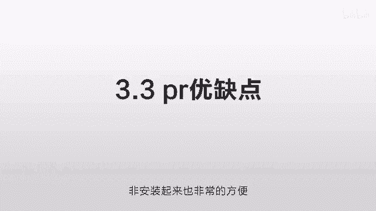

我们主要讲它几个主要的功能，打开之后你要新建一个项目，就这个东西你要干嘛，比如说你剪哪一个片子，你得先新建一个东西，把它放到这个里面去才行，我们点了新建项目之后呢，你随便给它起一个名字。

然后点保存就行了。

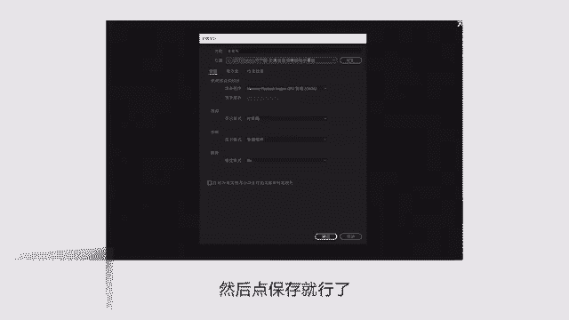

然后进来之后呢，我们要按一下CTRL，然后按一下N，CTRL加N同时按来新建一个序列，为什么先创建一个项目，再创建一个序列呢，我也不知道为什么，反正就这么说的，我就按这么操作就好了，创建序列之后。

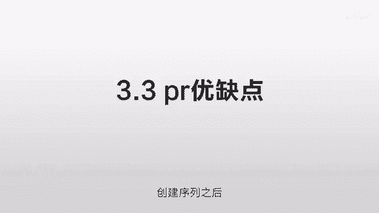

你点击一下设置，注意啊，这些参数我会标出来，你就按我这个设置就好了，编辑模式改为自定义，针的大小呢是10210801920，这个就是九比16，就是适合抖音的竖屏，然后长宽比呢要选择方形像素。

然后场呢选择五场帧数呢是25，为什么这么设置，我也不知道，反正我看别人这么设置的。

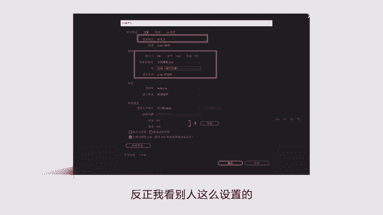

说这样比较清晰，我就这么设置的，你就这么操作就好了，不用管它，那进入这个界面之后呢，我们看一下这个左下角是一些素材，就是你录的一些声音啊，你拍的一些画面啊，还有你一些字幕是放在那个左下角这个红框的。

那么上面的这个地方呢，比如说学习组件或者颜色效果，这个实际是一个快捷键，就它的功能太多了，那我集中，比如说我需要调颜色，我就点一下颜色，或者我点一下这个音频，就是调声音的，一般你就点那个效果就好了。

他这个里面什么都有，然后下方这个粉色的加这个蓝色的，加这个这个有有什么声音的这个这个符号，然后再加上这个文字的，这个是负责剪辑的，可以前后拖动，那右边的那个是一些具体的效果，我们待会仔细讲一下。

不要太纠结，这个我们只是讲一个大概的一个方向，你到时候去摸索一下，看一下下方的功能。

我们讲两个最主要的一个是这个小刀片，你看一下这个小刀片呢就是剪切，你需要在哪个地方剪切，你就点一下这个小刀片，然后在需要剪的，无论是声音还是文字方面点一下，他就可以把那个给切开，你切两个地方。

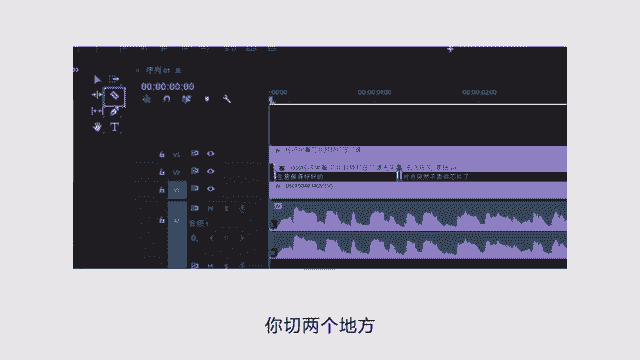

然后把中间一删除，这个中间的废话就取消了，还有一个是选择工具。

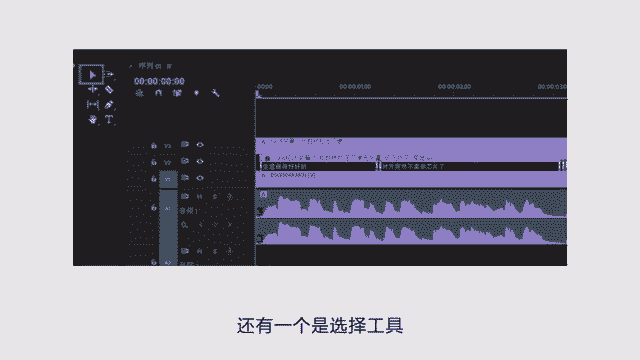

就这个小箭头这个有什么用呢，就是前后拖动啊，然后我们再讲两个主要的功能。

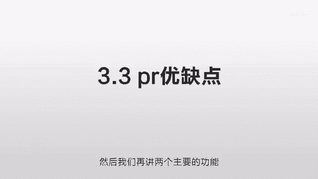

一个是调颜色，一个是调声音，调声音非常方便，它右边有一个基本声音，你看一下，点了之后呢，你点对话，这个就是处理人的声音，我通常会选这三个修复。

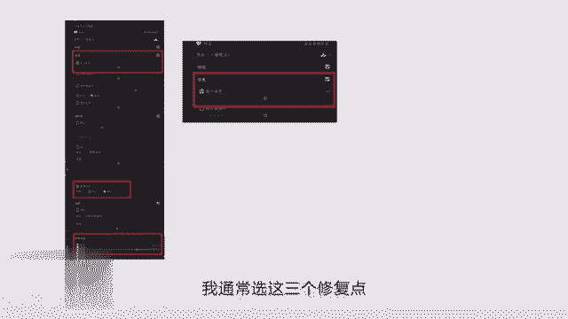

点一些减少杂色点五就行，增强语音呢点男性，然后剪辑音量呢选3db，这个具体你可以微调，这就是调声音的，你把这三个一调声音马上就不一样。

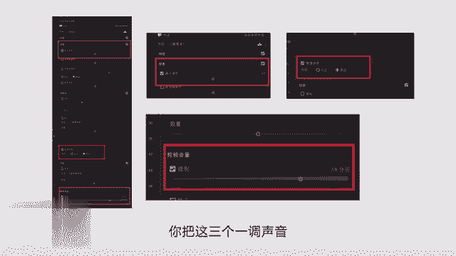

那么颜色怎么调呢，我们看一下这个选择了这个lunch颜色之后呢，它会有一个白平衡啊，或者有一些曝光对比度，我的这个具体的参数都在上面，你可以参考一下，另外有一个重点叫输入lot，这个是什么东西呢。

这个就相当于一个现成的滤镜啊，你可以在里面选一下不同的效果，这个LUT怎么用呢，网上有很多的使用方式，你需要哪个电影效果。

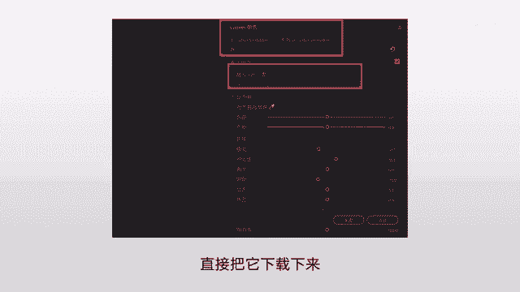

直接把它下载下来，然后直接在里面调用就行，大概就这些功能，就你先新建一个项目，然后再新建一个序列，为什么要这么建呢，我也不知道，反正就这么操作的，然后呢，你这些东西新建在哪里。

把你的所有的素材也都放到这个文件夹里面，这样的好处是什么呢，你万一不小心给把这个删了，你到时候再打开这个文件，它就没有这个图了，它显示空白，你把都放到一个文件夹里就比较好。

那具体的使用方法你可以针对性的去摸索一下，在操作完了之后，你导出如何确保你的东西高清呢，我们点文件，然后点导出点媒体，这样的话就会出来一个这样的界面，右边那个格式啊，你选H点264。

然后匹配源呢选高比特率，这个就是非常适合抖音的一个高清的一个模式，直接导出来就行，大概就这么几个功能，非常的简单，就是你最开始接触的时候，它太多功能，你看起来可能会非常的害怕，那你完全不用害怕它。

大概就这些东西，你就反复的调，反复的摸，那你稍微熟悉一下，他明白这个逻辑，你大概就知道怎么去操作它了，其实就那么1234步，你熟悉了之后就好了，只是我一下子给你讲了那么多，而且又是配图的。

你觉得可能有些听不懂，你这个自己如果需要的话，你需要下载一个东西，对照这些图啊，去摸索一下，到时候我会把这个图给发上来，你们自己看一下啊，这一节大概就是讲了剪辑软件的问题，我们再总结一下。

首先是这个剪辑逻辑啊，为什么要剪辑呢，就是时间的争分夺秒，你来抢占他的时间，抢占他的精力，尽量让他听完，尽量把内容浓缩，第二个我们讲了剪映的优缺点，就如果你实在不会pr的话，你可以先用剪映也没问题。

那第三个呢我们讲了一些P2的优缺点，就是说如果你愿意把东西做的好一点，愿意在这个视觉方面超出你的同行，那么非常强烈的建议你学学pr，非常非常简单，你大概一天的时间就学会，然后你以后所有的东西都可以保持。

这个质量非常好，第四个我们讲的有字幕软件，就是轻建字幕，你先下载他的客户端，然后你注册一个账户，然后你需要把什么样的内容给变成字幕的话，你就直接点击上传就行了，然后处理之后就注意一点。

就是把它保存为SRT的格式就可以了，这个就避免以后出现各种不可控的问题，你把它保存为这个格式就没问题了，然后第五个呢就是pr的一些使用的简介，就大概这几个区域是干嘛的，1234步大概是怎么样的。

你到时候具体需要哪一步，自己去尝试摸索一下。

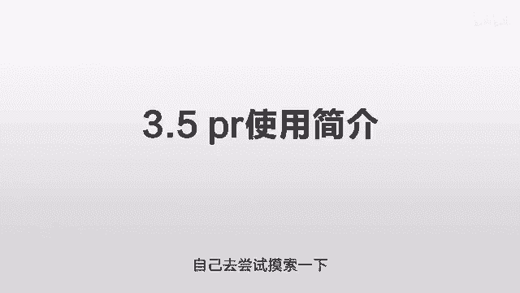