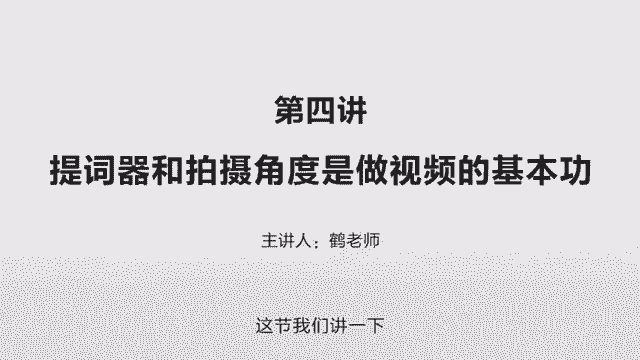
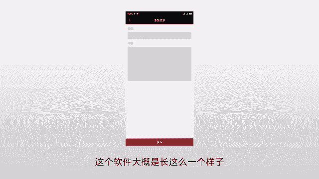
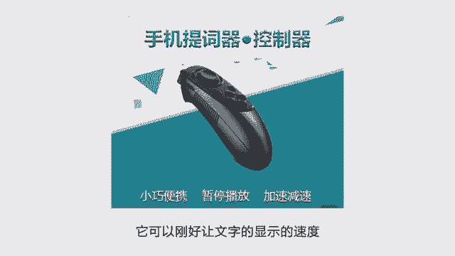
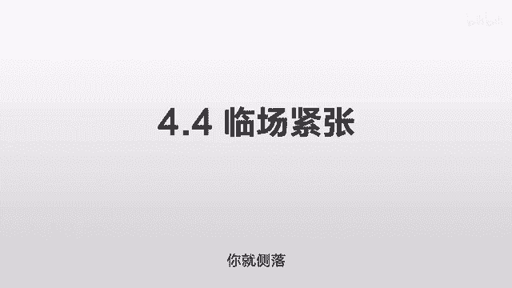

# 抖音运营从0~1全攻略【基础入门篇】B站最良心的最新2024抖音运营起号版全套教程（新媒体运营精华版） - P13：4-第4讲：提词器和拍摄角度是做视频的基本功 - 人生不复制 - BV1yWHKeMEud

这一节我们讲一下拍摄当中遇到的实际问题，第一个提词器，很多人都会问一个问题，说你讲的东西很长，可能两到3分钟也非常的流利，那这个东西你怎么给它背下来，答案是没法背下来，你用提词器你自己写好。

把它放在那边，然后照着读，有人说，那这是不是太没有水平了，答案不是啊，这个稿件非常的重要，你去读文字版的和你把它朗读出来是两个概念，有一些东西它适合文字的类型，但它并不适合你来口播。

你把纯文字的东西通过你的修改，然后变成可以口播的东西播出去，这个东西是很关键的，其实很多的知识啊，书上都有，但是你怎么把它精炼出来，变成几百字，然后再把它口播出去，这个很要功夫的。

你把它精炼的把它写下来，然后能吸引住别人的眼球，这个是核心，那么在保证这个的前提之下，你可能只有一到2分钟的时间，这个就涉及到一个非常实际的情况，就是你绝对不允许出错，你如果给你一个小时。

你是不需要搞的，因为一个小时的话，你只需要列一个大纲，你1234讲什么东西，你万一讲错了怎么办，没关系呀，你绕回来就行了，反正你有足够的时间，但如果这个东西时间很短，它只有15秒。

30秒甚至一分钟的时候，你希望表达的尽量完美，这个词不多不少，这句话不多也不少，每个词都非常的准确，每个点都非常好的击中这个用户，你就需要在下面之前要做很多的功夫，把这个稿件写的尽量完美。

然后在现场的时候，你不需要临场发挥，你只需要把它读出来就行，找到你当时写稿的那个感觉，这个就好像跑百米和跑马拉松一样，你跑马拉松的话，你中途稍微慢一点，这个没有关系，因为它有几10km嘛。

你后面加一加速，你就跑回来了对吧，但你如果是百米，你最开始吹哨的时候不小心你慢了一下，那基本上后来你就不可能赢了，短视频就是这样，你大概只有半分钟一分钟的时间，你中途有一句话说的有问题。

你可能再稍微一照就2分钟了，这个用户就没有时间看了，所以你必须要把它做到完美，极度的完美，就把稿件写的非常的精炼，非常的完美，然后把它照读出来，这个不是水平不水平的问题。

这个是大家没有必要在一个维度去竞争的问题，举个例子，你跑步跑的比我快，你的体力比我好是吧，但是我们从东城到西城的话，你没必要跑过去啊，我可以坐公交车过去啊对吧，别人只看我有没有过来。

他并不关心我是怎么实现这个的，你如果要跑的话，可以没有问题，就像你希望自己去临场发挥也没有问题，但是临场发挥有一个前提，你需要做大量的准备，才能保证你在临场的时候随机不看稿，一句话都不错。

那这个就需要你有大量的练习或者大量的积累，那么在这个基础之上，你可能还需要花很多的精力，来保持一个好的状态，就像一个主持人保持一个好的状态一样，你比如说同样的内容，如果我的状态很好。

我可能会讲上一个小时，甚至每一句话都讲的非常的精彩，如果我今天心情特别低落，我找不到这种灵感，就像你写的东西没有那种灵感，那么这个时候你现场发挥就很容易出问题，你输出的内容的质量就会时高时低。

而我们要求的是长期稳定的输出，保持这个的前提，就是你把需要的东西先转化成文字，你在写文字的时候，考虑到他口播的时候应该是什么样的感觉，尽量的精简成这种文字，你大概要做成多少分钟。

一分钟差不多是250个字，你就按这个去写，写完了之后反复的改，差不多250个字左右之后，哎你把它放到提词器上，你对着镜头把它读出来，这样的话可以大大的减少你现场的紧张的感觉。

就一般人你没有经过这种训练的话，你本来这个说话就可能会有一些问题，你只有半分钟一分钟的时间，你再对着镜头说，咔就很容易紧张，很容易卡壳，这就是很多人遇到的障碍，所以你一定一定要用提词器。

你不要管别人怎么讲，你自己一定要用，那我自己就用提词器的，但我发现用的效果非常好，你比如说我现在讲这个东西是没有提词器的，我只有一个课程大纲，我就根据这几个关键词我自己去发挥对吧，但我讲的时间很长。

所以没有问题，你要是说让我一分钟把这个东西说清楚，而且一句话不错，我是做不到，但我只要把它做成，让你看上去好像我做到的一样就可以了，用户不会关心你的幕后的，他只关心你给他展示了什么东西。

这就是提词器的作用，现在我们讲第二点，提词器的坑，就一提到提词器啊，很多人就第一反应就是，我到淘宝去买一个提词器啊，你会看到啊，有不同价位的，有几百块钱的，有几千块钱的，这个差别在哪呢。

几千块钱的是那种专业的摄影器才用的，这个当然是非常的好，你像央视的，他们都做那个新闻联播，他们就一定会有专业的提词器的，无论是显示效果还是操作还是各个环节，都非常非常合适，但缺点就是价格特别特别贵。

你要是买那几百块钱的看起来很便宜，但是你会遇到很多你想不到的问题，从我自己来讲，我在当时尝试用这个提词器的时候，我自之前自己是没有用过的，那么我就是在网上买了好几个提词器，我同事都买过来。

大概也就那么三四款，我买了之后回家全部给它拆开，拆开之后呢，我看哪一款好用，它有的是用在IPAD上面的，说你那个屏幕大，显示东西大，他有的给你的接口多，就什么样的镜头你都可以接得上。

还有些说是周围不遮挡，就是不会出现说你的屏幕上显示的东西多，但是他投给你的会有遮挡的情况，这样你读的时候就很麻烦，那么我自己试了之后呢，我把所有方案都放弃了，为什么呢，因为这些提示器很便宜，便宜的话。

它的制作就很的粗糙，比如说它弹簧很差，你不要小看弹簧这个很要命的，弹簧很差的话，你每次在上面装那个手机或者IPAD的时候，就觉得非常非常麻烦，你要么死活掰不开，你要么夹住了之后你动不了，你再一微调。

那你就把那个相机给扭了，特别特别讨厌，每一次操作都很消耗心力的，而且有些东西它很复杂，它设计的很大很笨重，那这样的话你往上一夹，你那三脚架又不一定能承受得了，他等于说你加了一个要素。

你所有的要素都得同时加上去才行，所以你看似很简单，那个东西你在实际用的时候，你会发现就各种各样的问题，最后就会导致你不想用这个东西，而且有一些他在投影的时候，那个光线可能还不够强。

比如说你的手机可能亮度不够，因为他那个是折射过来的，亮度不够的话，它折射出来之后就会显得更暗，它有的时候还会有重影，就这个价钱一旦低了之后，它的很多质量是没有办法保证的，它只能勉勉强强达到你的需求。

而它的原理实际非常简单，就是几个木框，反正我买的那是几个三合板，然后再加上一个镜子，把那个镜子放个45度，然后把手机放在下面，这样它反射的东西就可以直接看到了，这个东西在很粗糙的时候。

它会很影响你的创作兴趣的，每一次录的时候，都感觉有一大堆事情要做，稍微弄错一点，整个镜头又得重新调，或者三脚架的位置要重新调，非常非常的麻烦，很耽误你的心情，而且还有一个小的细节，它会影响你的翻转屏。

翻转屏什么意思，就是可以翻转180度，这样的话这个相机来拍摄你自己的时候，你就知道自己是一个什么样的角度对吧，你有没有作证啊，状态怎么样，随时可以看一下，但这个提词器如果在前面的话。

它会很容易挡住一个翻转屏，所以呢最后的结论就是，你要么像电视台那种，你买一个特别专业的，但特别贵，没有必要，你的器材也配不上你，要么那种便宜的干脆不买，所以我自己是把那些东西全部都放弃了。

如果你自己想试也可以，你在淘宝上先买过来，把那几百块钱都买过来，你自己试着安装一下，你要是觉得安装一次，安装两次有点受不了了，这种复杂度，那你就直接把它退了，用我告诉你的这个方案非常的简单易操作。

那现在我们讲到第三个点就是推荐器材，就之前我踩过很多的坑，包括这个提词器的，那么后来我发现这些都不能用，那我自己想了一个什么样的方案呢，我在当时用这个提词器的时候，有一款提词器叫best view。

你买他们的提词器的时候，他会告诉你下载他们这个软件，因为本身它提供的就是一个木框加一个镜子，你把他这个软件啊给装到这个手机里，这个安卓和苹果都可以装，装完之后呢，你把你要读的内容给输入进去。

然后你一点播放呢，它就会以一个非常大的字，然后不停的进行滚动，你还可以调这个速度，调这个字的大小，调这个背景的颜色，然后你就把这个手机呀给放到那个镜子下面，这样的话它就成一个45度。

这个角度你就可以直接对着那个地方读，后来我就发现我不需要你这个提词器啊，我直接需要你这个软件就好，你这个是免费的，那我就下载之后把我的东西放进去就好了，那么我为什么不能直接拿一个手机当提词器。

我弄一个三脚架，把那个手机给固定到这个镜头的下方，然后我就对着这个手机读，它既不会出现重影，也不会出现遮挡，也不会出现这个亮度降低，让你看不清的情况，也不会出现这种各种复杂的安装。

反正你只需要把它往手机，你只需要把它往相机那边一固定就好了，这个时候你需要一些设备，首先是一个八爪鱼的三脚架，你知道你这个拍摄设备，是放到这个三脚架上面去的，这是一个大的三脚架，会对着你正面去拍。

然后你的相机是架在这个三脚架上面，这个时候如果你再需要一个手机的话。

你需要买一个八爪鱼的，大概就长这么一个样子，它就像一个小章鱼一样，它可以随时的来拧他这个腿，来保持各种角度来挂在任何的地方，然后你把你的手机放在这个八爪鱼上面，紧紧的贴着相机的下方，这样的话。

相机的镜头和你的手机几乎是在一个水平线上，那么你就直接对着手机读，而且亮度非常的合适，完全没有问题，操作起来也非常的简单，而且你再也不用担心，这个三脚架稍微挪一下位置，会导致你这个手机的光圈被调整。

或者说手机的角度又偏了，不会有这种情况，也不会出现，你万一是这个180度翻转屏的话，遮挡那个翻转屏的情况，那么你只需要下载一个它的best view软件，然后把你的东西给放进去。

这个软件大概是长这么一个样子。

你输入进去了之后呢，你点一下播放它就可以了，它有两个播放的角度，一个是直接的播放啊，一个是镜像的一个播放，你直接选那个直接的播放就好了，而且你可以去调这个速度，调这个颜色，调这个背景非常的方便。

你找一个你自己适合的速度先反复调，那么最后你需要一个什么东西呢。

你需要一个蓝牙遥控器，这个你在淘宝上买，大概是长这个样子，50块钱就搞定了，它等于说通过蓝牙连接你的手机，来控制这个best view软件，因为你读的速度，和他这个播放的速度是不一样的。

它这个播放速度如果太快，你可能需要让它变慢一点，或者需要让它暂停一下，这个时候你就手里需要拿一个蓝牙遥控器，有时候你看那个抖音的，有些博主他手里就拿着一个黑黑的东西，偶尔这样点一下。

点一下那个就是蓝牙遥控器啊，就他可以刚好让这个文字的显示的速度。

和你表达的速度一样，你自己找到一个那个点就可以了，那么这个器材我们再总结一下，你就是直接需要一个废弃的手机，然后你下载一个best sb软件在上面就可以了，然后你再去买一个很便宜的。

可能几十块钱的一个八爪鱼的三脚架，把它固定到你的这个相机的下面，就紧紧的贴着，然后你去买一个50块钱蓝牙遥控器，然后直接就连上了，非常非常的方便，我自己测试的效果非常好，那我们再讲第四个问题。

就是临场紧张的问题，这是很多人都遇到的一个问题，首先我们说这个问题非常非常常见，因为你就是个普通人，你不是这个专业的播音主持，你也没有经过这种专业的训练，你也没有任何这种临场讲话的这种经历。

所以一到录东西，你必然会紧张，你必然会卡壳，哪怕是你对着题词青念，你也会紧张，你的声音会颤抖，你的有的时候这个运气会用不上，或者觉得胸很闷，各种问题你录你就知道了，你越是希望它完美，你录的就越差。

那这个时候应该怎么办呢，如果你是正对着这个屏幕录的话啊，有一个小技巧，就是说你可以先试录一段，那比如说我这个这段文字啊，我打算要录两遍啊，我第一遍是试录，你试录的时候出现任何错误，其实都没有关系。

你试录完了之后，你再正式录，有的时候你会发现往往你试录的时候，你没有心理压力，反而会录的更好，偶尔有错别的东西把它剪掉就可以了，还有一个方式呢就是你先说一段废话，你不管说什么东西，哪怕说说你对着镜头。

你去打一个电话，去聊一个天啊，随便讲一些东西，哪怕是从一数到十啊，各种等于把你说话这个感觉先说出来，然后突然就开始接上，那这样的话就感觉也可以找到，还有一个呢就是你无限次的重复录。

然后你告诉自己这个东西第五遍的时候，我会用，然后前面四遍你就会没有什么压力啊，你就错了就错了嘛，在没有压力的时候，就往往很容易一遍过，你千万不要告诉自己，不要紧张，不要紧张，你越是这么告诉自己。

你一定会紧张，一定会出问题，到时候一定一定会卡壳的，如果你面对镜头真的非常非常紧张的话，还有一个方式，你可以侧录，网上也有一些人采取这种侧录的方式，侧漏的话也会给人一种比较特别的感觉。

就好像你在跟你的朋友讲话，然后这个摄影机呢是在以另外一个角度来拍，你差不多一个45度的角度，然后你把这个提词器啊直接放到你的正前方，感觉照其思轻念，这样的话你不正对镜头感觉也会更好一点。

然后你录的时候不要说一段一段的录，你把它反复的录上几遍，中途不要暂停，然后再从中间截取出你觉得最满意的那一段，那最后我们再总结一下，第一我们讲到提词器的问题，就是一定要用提词器，这样的话你在表达的时候。

你可以超出别人一个数量级，他没有提词器，你有他没有做准备，你做准备了，他没有精修这个文稿，你精修了，你就在他的水平之上，你的文案就可以超过他，用户就会感觉你比较专业，可以一气呵成。

也永远不会有这种卡壳的东西，第二提词器的坑，就如果你真的觉得特别必要，你可以把那些便宜的提词器都买一下，因为有一些提词器是不是适合你的这个相机啊，它也不一定，买完之后你测试一下，你觉得你不会装。

就很多人第一步装到第一步，那就崩溃了，看起来特别复杂，或者你装起来你又不想用啊，用起来觉得特别麻烦，特别勒手，各种问题也会碰到相机，那你就把它退了，第三个是推荐器材，这是我讲的，你直接用一个废弃的手机。

用一个八爪鱼的三脚架，再加一个best view的软件，加一个蓝牙遥控器就搞定了，第四个是解决临场紧张的问题，就是你不要告诉自己这一次是要用的，你告诉我要用的是在第N遍，我现在只是在练习，我在彩排。

这样就很容易过，如果你实在不行的话。

