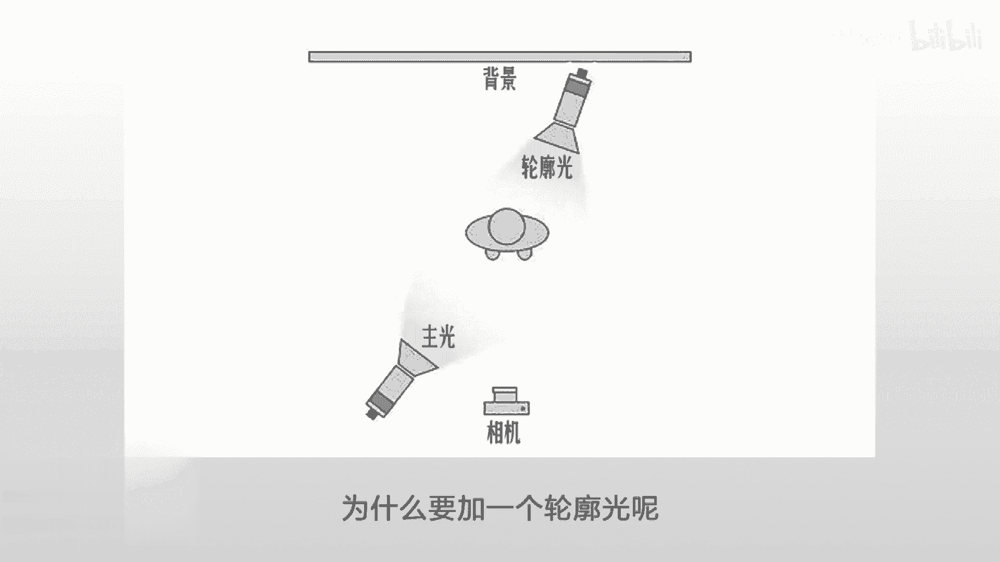
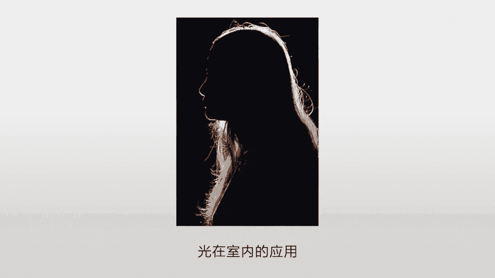
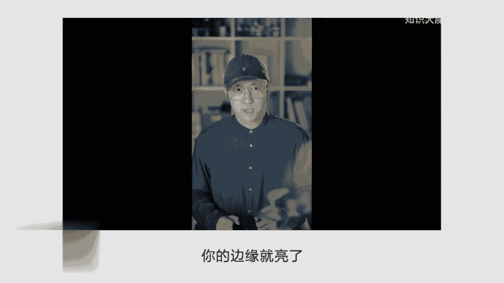
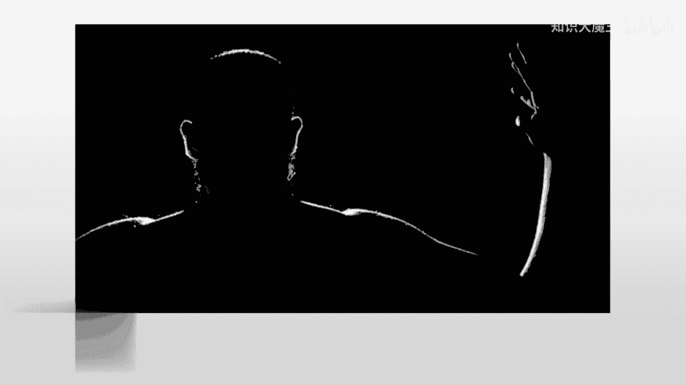
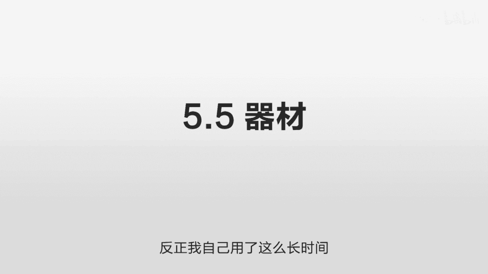

# 抖音运营从0~1全攻略【基础入门篇】B站最良心的最新2024抖音运营起号版全套教程（新媒体运营精华版） - P14：5-第5讲：这样布置光影让拍摄效果事半功倍 - 人生不复制 - BV1yWHKeMEud

好的，这一节我们讲一下拍摄的时候应该如何打光，首先我们讲一下这个摄影的一些重要的要素，你知道你想拍出一个好的照片也好，还是你想拍一个好的这个视频也好，它有几个重要的要素的排序，第一是什么，就不是器材。

是脑子，就你的想法，你的器材可以很有限，可以去小米加步枪，但是你可以有自己的想法呀，把它给利用到极致，最重要的是脑子，除了脑子之外，第二重要的是光线，不是器材，是光线，只要你的光线足够好。

你打光的技术足够好，你用很差的器材可以拍出非常惊艳的作品，你在网上可以看到很多这样的东西，就一个手机拍出像那种广告片一样，就对光线的运用，所以我们经常讲那个摄影是光和影的魔术，你把光线用好了。

是不就成功了一大半，第三重要的才是器材，也就是说在第一脑子，第二光线完全确定完全一样的情况下对比，第三这个器材才有价值，否则的话，比如说我第二光线我用的比你好，我就很容易用一个比较差的器材来超过你。

这个非常非常常见，比如说我们经常看到的有一些摄影大师的作品，他们用的那个相机其实很一般的，但他拍摄的就是非常非常好，非常非常的漂亮，那个场景那个感觉那种捕捉他首先是一个脑子，他希望创造一个什么样的感觉。

希望有一个什么样的冲突，希望表达什么东西把你带进去，这个就是脑子，第二是光剑嘛，然后有些摄影师特别会用光线，比如说这种明暗的对比啊，这种虚实的这种这种对比啊，也可以使得一个非常普通的器材。

拍出的东西非常非常惊艳，我不知道你们有没有留意过，那种很多国产手机啊，特别有意思，他这个手机卖多少钱呢，卖899999，然后他拍的大片都非常的惊艳，为什么就因为光线呀，你知道他怎么拍出这种大片吗。

这个东西是899是没问题，这个手机确实是899块，899的手机对吧，但是我怎么给他拍出这样的东西呢，哎我先找一个一流的摄影师，你先给我一个想法，这个就是脑子啊，比如说我们要去那个某个地方去拍一个日出啊。

去拍一个美国某一个大峡谷对吧，那这个时候你先买一个机票过去嘛，在那住几天，找到一个最合适的时间，然后早上登到那个峡谷上去，在那个最恰当的时间加上各种UV镜，加上各种中灰的滤镜，然后就在那一个时间点。

在那个光线刚刚好的那个时间，可能只有12分钟的时间，转瞬即逝，在这个时候，你拿一个899的手机啪一按拍出来了，别人问怎么拍的，899手机拍的确实是，但他没告诉你，第一他用了脑子很贵很贵的脑子。

第二他用了光线，为了得到这种光线，他付出了更贵的东西，第三才是器材，我确实是用的899的，但是因为我第一第二用的非常好，所以我拍出来的东西就是非常的惊艳，那么现在开始讲第二个问题，光的软硬。

我们知道这个光线的重要性，那么我们在实际拍摄当中，应该用什么样的光线呢，我们简单讲一下光吧，大概分两种，一种是直射光，一种是散射光，直射光呢叫硬光，什么叫直射光，你中午12点出去。

这太阳照得你眼睛睁不开，这个叫直射光，直射光几乎是不能用来拍人的，他除非用那种拍满脸皱纹的那种老汉啊，就就田间耕作那种老汉，就把那个皱纹弄得特别特别明显啊，满脸沧桑，你再加一些锐度，加一些对比度。

只有在这种情况之下，你才会用直射光，其他很多情况你都需要用散射光，就这种软光柔光，你看那种拍照的时候都有一种，都有一个柔光箱对吧，就有很大的一个箱子，前面放了一块布。

就是要把这个直射的硬光通过那个布给它弄软，变成这种散射光，那么在自然的环境当中呢，我们也可以来实现这个效果，就是窗帘嘛，或者说你这个只要你在房间里面，只要阳光没有直射到你房间里面来，它是通过你的墙壁。

通过你的这个玻璃，通过这个窗帘这个折射进来的，透射进来的，那么它就是一个散射光，你就可以直接用这个自然光去拍摄，自然光拍摄的效果也非常的好，但有的时候比如说天气没有那么好，它是有乌云的天气。

那本身乌云它就像一个柔光箱一样，拍出来的东西就相对比较柔，比较自然啊，不会出现那种极度强烈的对比，就如果你对光线实在没有研究的话，你可以直接用这种自然光去拍摄，非常的简单，你不需要加任何的东西。

你只需要在光线充足，你就记住一点，充足充足的话，你的画质就会好，你不要用那个室内那种那种灯光，那种就是极度的不充足，拍出来的，要么就是这种颜色就很奇怪，要么拍出来这个噪点就很大。

然后你在处理了之后就会显得质量就就很差啊，尽量是在太阳，比如说很亮的时候，你找一个时间，你在房间里面这么去拍，你的房间就相当于一个柔光箱，就可以起到一个这样的作用，这个是非常简单，它的优点就极度的简单。

但它也有缺点，就是你每次拍出来的东西不统一，就比如说你上午拍和你下午拍这个颜色，你感觉会有差异，而且有的时候这个光线的强弱也会有差异，所以这个时候我们就需要一个，室内的光线解决方案。

就是我们下面要开始讲的，讲那个之前呢我们先讲第三个叫色温和白平衡，这是一个摄影当中常见的术语，什么叫色温呢，呃我们大家看一下这个图，左边的是偏黄，右边的是偏蓝，你在左边的你会感觉很温暖的感觉。

像那个火炉一样，右边的感觉很冷，有一种冰天雪地的感觉，这个就感觉不同的温度嘛，由暖到冷，这个叫色温，我刚才讲的自然光是个什么情况呢，就是你在不同的环境之下拍，你这个颜色是不一样的，一会儿它变蓝。

它一会儿呢它又变得黄，所以你拍出来很容易不统一，那么相机它自带一个功能叫白平衡，它会尽量的在不同的光线之下，找到一个最合适的感觉，就是尽量在哪怕特别温暖的灯光之下，或者说在特别冷的灯光之下。

都拍出来的东西尽量的接近，但很多时候这个白平衡是有偏差的，所以我们需要室内光，室内光的好处就是它稳定，就像那个图一样，它从1000K到10000K，那么室内光呢可以每次都把它固定在多少K，你这样的话。

你每次拍都是这样，同样的光线，你就完全不受环境的影响，拍出来的东西就非常的统一，你就不会说拍完之后诶这个感觉怎么不对，你又调来调去，那个就非常非常麻烦，你把最开始的不可控因素把它降到最低。

可以节省你后期很多成本，那下面我们讲第四个就是些经典的打光方案，你知道这个用光在摄影里面是一个，非常大的一个一个篇幅，它有非常非常多的内容，非常深的东西值得人去研究啊，比如说你用光线的话有很多种。

比如说叫什么分割布光，叫勃朗伦布光，派拉蒙光，环形布光等等，他也会有各种各样的效果，我们今天就讲一个最经典的打光方案，就是主光加上轮廓光，它大概的曝光的效果是这样的，你看一下这个人是在这个地方，然后呢。

它的主光是在这边有一个非常大的一个柔光箱，来把人的主体照亮，那么背后呢是一个轮廓光，是来勾画它的轮廓的，那为什么要这么打光呢，我们先说主光，这个主光就是照明的这个灯光，也就是说你在拍摄的时候。

你尽量把这个窗帘都给拉上，不要受到这个太阳的影响，然后把你的家里所有的灯都关掉，所有的照明都通过这个主光来照明，然后这个主光呢它是可以调强弱的，它也可以调这个色温的这个主光，你把它调好色温之后。

就把它固定下来，不要动了，然后他的这个亮度呢你也可以调，它是有一个旋钮的，那么你就自己把那个相机放到那边，你来回调，你把色温来回调一下，把这个呃亮度来回调一下，你找到一个最合适的，基本上整个的光线。

最主要都是由这个主光来打的，一般的情况下，这个主光会放到人像的45度的前方，你自己会调节这个高低，调节这个远近的距离，来找到一个最合适的点，那为什么要加一个轮廓光呢。

其实我们把这个主光一关掉，你可以看到这个轮廓光的效果，它很多时候用一个人物的独白的时候，就好像那个阳光侧逆方向，从这个人的肩膀上照过来，就会有一种很特别的一个感觉，比如说你去教堂的时候。

这个神父在朗诵什么的时候，这个阳光啊从背后这个照过来啊，照亮他的这个肩膀，这个背后就感觉非常的神圣，非常的特别，这个这个就是轮廓光在室内的这个应用。

它就类似于这个阳光，从那个侧后方照过来的感觉，你看我的这个感觉，就是我的主光是把我的人给照亮，然后这个轮廓光呢在后方它是一个黄色的感觉，它来照亮我的这个左边的这个侧脸，另外呢它会使得我和这个背景啊。

给适当的分离开，因为它照亮了之后，你的边缘就亮了。

这样的话它可以起到一个画龙点睛的作用，你看我另外一个场景，就是我还有另外一版是这样的，就是把这个轮廓光我实际是放到我的背后，那这样的话他就会把我的脖子还有肩膀，还有这个帽子后面这个地方给打亮。

这个也会显得非常的特别，基本上主光加上轮廓光就可以了，具体的打光方式，主光一般就是在你的左前方45度，刚才讲了距离你自己调，那么轮廓光呢要么就是跟主光在同一轴线上，它在左前方45度。

这个轮廓光就在右后方45度。

要么呢你就把这个轮廓光直接放你背后，说要让你身子去挡住它，这样的话它会把你的整个身子会勾勒出来，一个线条，一个光亮的线条看起来非常的好看。

这就是很经典的打光方案，你不需要学习那么多的打光的技巧，这一个基本就足够用了，尤其是用在口播的时候，非常非常合适，下面我们讲第五个，就是我自己用的什么样的器材，那么我的布光方式呢。

我就把这个图给弄出来了，你看我是坐在这个中间，前面是有一个桌子，后面是有一个书架，然后我的主光呢是在我的右前方来打量，我的整个右脸，那么但是整个房间呢它是反射这个光的，而且它是通过一个柔光罩打过来的。

所以他没有那么硬，所以左边的脸也是可以有一定的光线，也没有那么强烈的对比，等于是照亮的主体适当的有一些强弱的过渡，这个就是主光的作用，那么轮廓光呢我用的是一个宜家的一个台灯，是一个黄色的台灯。

你家里如果有这种台灯的话，你可以把那个角度拧过来，直接对着你，你不需要单独再去买一个这个专业的，这种摄影的灯光来当轮廓光，这样的话非常的复杂，你基本上就需要一个主灯就行。

这个主灯最大的作用就是防止各种不可控因素，你一会儿这个色温高，一会儿色温低啊，一会晴天，一会阴天，导致你拍出来的东西后期反复调，特别的耽误事，你搞一个主光，就把这些所有的不可控因素全部排除了。

那么轮廓光呢，家里有灯的话，就对着打一个就好了，你拍的时候尽量避开它就行，那我买的这些器材呢实际都很便宜，比如说我这个灯光呢是用的神牛的SL60W，然后价格是560块钱一个，就买了一个。

然后柔光箱呢也是，它匹配的是60×90厘米的，这个是100多一点一个，然后还用了一个摄影的灯架，这70块钱一个，三个大概组合起来就是一个主光的效果，有了这么一个打光技巧，再配合一些摄影器材器材。

我们会在以后去讲到，也就基本上可以出现一个非常非常专业的效果，基本上可以秒掉抖，音上几乎是九十八九十九%的人，那我们总结一下今天讲的，第一我们讲了一些摄影的要素，就是光线会比这个器材还要重要。

你要控制好光线，第二我们讲到了光的软硬，就尽量不要用硬光，硬光的话导致你的拍摄效果非常非常差，一定要用柔光箱，或者你用自然光的话，要用各种窗帘，让把这个光线尽量变得柔一点，第三我们讲的这个色温和白平衡。

就你在拍摄的时候，尽量要注意这个色温和白平衡，每个相机上面都有一个，自动来调白平衡的一个设置，你可以研究一下，在我们讲器材的时候，我们会讲到这一点，第四我们讲了一些经典的打光方案。

最经典的就是我们刚才讲的主光加上轮廓光，这个只有主光的话，你会显得整个画面很亮，它不会有误差，但它没有灵魂，这个轮廓光就是灵魂就画龙点睛的那一下啊，就好像你这个牛排烤好之后，上面撒了一层胡椒是吧。

你那个桂花糖藕上面撒了一层糖浆，但没有那个好不好啊，也可以吃，但是味道不够好，第五我们讲的这个器材，就是我自己用的什么样的器材啊，非常非常便宜，也非常非常实用啊，你需要的话，你也可以去淘宝买啊。

如果你觉得贵，你可以去二手买，这个也非常便宜，我基本都用国产的，因为我也不需要那么专业的技巧，我也不需要那么那么耐用的设备，反正我自己用了这么长时间。

还没有出过问题，大概就这些，更多的。