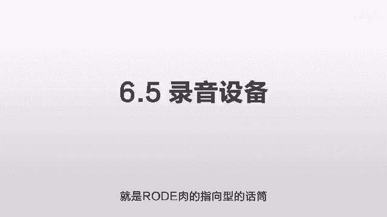
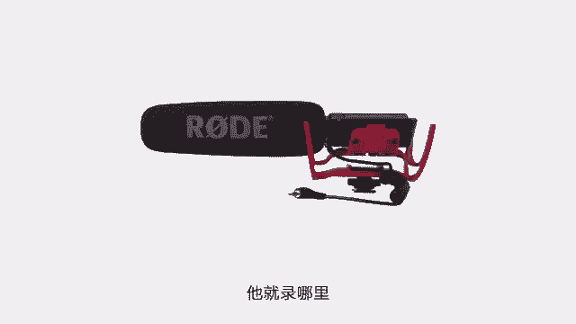
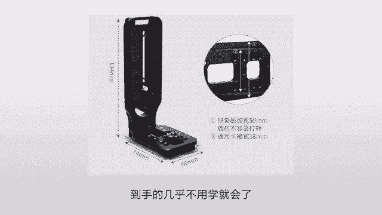

# 抖音运营从0~1全攻略【基础入门篇】B站最良心的最新2024抖音运营起号版全套教程（新媒体运营精华版） - P15：6-第6讲：拍摄器材的的选择和应用 - 人生不复制 - BV1yWHKeMEud

好这一节我们讲一下拍摄应该用什么样的器材，我们先讲第一个手机拍摄，我的建议就是永远永远不要用手机，就是尽管很多人可以告诉你，手机可以拍出来大片，手机也可以拍，这个也可以拍那个。

甚至有人拿手机去拍一个电影，比如说当时的IPHONEX刚出来的时候，有一个导演用他拍了一部电影，他告诉你试用这个东西拍的，是的是没错，但是这个东西不值钱，值钱的是它周围的一大堆东西。

他为了使这个手机可以拍得出来，他得买一大堆比这个手机贵的多的东西，才能出来这么一个效果，看上去是这个手机拍的，实际上是为了满足这个手机的各种缺陷，它需要在其他地方花几十倍的精力，才能达到这么一个效果。

比如它首先需要一个手机支架，这个支架呢是人民币800多块钱，然后呢他还需要一个手持稳定器，这个稳定器在网上卖是2000多块钱，那么他还需要一个高清液晶显示器，这个在网上的售价是9000多块钱。

那么有的时候你可能还需要航拍，在这个航拍的六轴无人机可能是4万多块钱，那么你可能还需要各种转接环，你还需要各种各样的镜头，是一个镜头，按1万块钱算下来，你的整个成本你可能得六到8万块钱。

这六到8万块钱就是你拿你的IPHONEX拍的，和陈导演拿他的IPHONEX拍的区别，就看上你都是IPHONEX，还有一些手机的宣传片嘛，啊就比如说一个999的手机，他怎么能拍出这样的一个大片呢。

啊他确实是他拍的没错，确实是这个手机拍的，他没有作弊没错，但他没有告诉你的，是，为了让这个999的手机，能拍出这么好的一个效果，他们可能花几万块钱雇了一个摄影师，那来回呢又买了几万块钱的机票。

加上住宿啊，加上各个交通费用，然后在全球一些著名的景点，挑一些关键性的时刻，然后来拍一些关键性的照片，但有些照片呢他对时间的要求非常的苛刻，他可能只有在这个时候你才能拍出这个效果。

这个时候你可能提前要开个车，到那个地方去等着，然后等那个太阳和这个光线，达到一个最佳的角度的时候，他的你按一下快门，确实是男的，不要用手机拍，你不要相信那些东西，他在周围花了很多精力，他没有告诉你。

那现在我们讲第二点就是画质的要素，你知道对于一个像而言，它影响它画质的最大的要素是什么呢，啊不是它的像素啊，啊也不是它的光圈啊，也不是他的这个变焦能力，是它的传感器的大小，就很多相机在宣传的时候告诉他。

他多少像素的像素一点用都没有，真正有用的是传感器的大小，这两个什么区别呢，传感器就是胶片，就你之前用过那种胶片相机的话，就是那个胶片的大小，这个胶片越大，它里面能够容纳的一些信息就越多。

那么拍出来的细节就越丰富，而这个像素呢它是数码相机上的一个概念啊，就是说我在这么大的一个相片，我打多少个点，比如说600万像素就是打600万个点啊，800万像素就是打800万个点，问题就在于。

当你的传感器大小很小的时候，你是可以打2000万个点或者5000万个点，但是它的画质会非常非常的差，因为你每个点之间会相互干扰，当你的这个传感器越小的时候，你打的点越多，最终你的画质就会越差。

这是一个几乎没有办法解决的情况，你可以通过算法去优化，但再怎么优化，你也是受制于你的传感器大小，而为什么相机的拍摄效果好，就因为它的传感器大，就它的底片大，底片大的话，我打的一些点比较少。

我的像素比较少，这样的话我的画质反而会更好，这个像素并不等于画质，像素就等于放大的这个大小，比如说你把一个1000万像素的东西，你把它的长宽都加高一倍，那这样的话它就变成了4000万的像素。

但本质上没有区别吗，它把它就一个点变成了四个点，所谓的这个传感器呢，你可以把它理解为一个体格，就好像一个60kg的人，和一个90kg的人啊，他们一起打拳，看谁更厉害。

那这个时候当你的力量出现绝对优势的时候，你的任何的技巧都是浮云，就像很多的手机，它去优化它的算法，这个就相当于一些技巧，你知道有一个相机叫奥林巴斯，后来他倒闭了，为什么呀，因为他第一步走错了。

就别人选的底儿啊，比他的底儿大，它的底很小，但底小有没有好处呢，有啊他相机可以做的小啊对吧，你的镜头就不需要那么粗，你的体型就不需要那么大，但是后来那个无反相机出来之后，他就挂掉了。

因为之前是需要一个反光板的，相机里面的相机可以做的很大，但是后来发现这个反光板可以去掉，这个APC的画幅的比较好，这个你不用管它什么意思，就一般的这种单反啊，无反啊啊，都是这种画幅的。

你比如说索尼的奶昔系列，这个在二手市场很便宜的，你买奶昔三奶昔五的话也就是不到1000块钱，可能是600块钱，800块钱就可以买到，就这样的画风完全可以满足你拍摄的需要。

它可以保证一个非常高清的一个画质，它也可以搭配镜头之后，让你的这个背景虚化，突出你这个主体，更关键的是它一点都不贵，它很便宜，那以后我们会讲到他这个具体的拍摄的这个，设备的选择，现在我们讲到第三点。

虚化背景，你知道手机它没有办法做到一点，就是虚化背景，有人说不对呀，那我的手机可以虚化桌面，有个虚化按钮，那那不一样的，那个是算法做出来的，就好像以前相机有一个功能叫数码变焦，什么叫数码变焦啊。

就他不是通过光学，它不是通过那个望远镜把东西给拉近的，它通过放大，就你像素就这么大，你啪拍完一张之后诶，怎么变焦呢，你把它放大不就等于拉近了这个手机，做虚化也是一样。

它的算法完完全全没有达到这种光学的效果，所以有的时候你会发现虚化的很奇怪，他等于先把你的整个人抠出来，然后再把背景给弄虚，所以更多的时候你只要是用它，你给别人的感觉就是一个五毛钱的特效。

就好像那个绿布那个抠没抠好一样，那个边缘磕磕巴巴的那种，很难看，你用它还不如不用，所以我们要虚化背景的话，必须要用相机来实现，你知道背景叫奶油般的虚化，然后人在这个中间，就好像很多时候去拍一些女孩子诶。

背景是奶油般的散开，然后人物非常的突出，就非常的漂亮，还有一些比如说你看一些韩剧的夜景啊是吧，就男女主人公在聊天的时候，那个背后，就那个那个灯光都会放的非常非常的大，非常非常的漂亮啊。

然后主体非常的突出，你包括看我的这个视频也是一样，你看背后的他那个书架是虚的，这个就是靠相机来实现的，你靠手机是做不到的，那么它虚化的话有几个要素，一个是传感器，一个是光圈，一个是距离，就传感器越大。

它就越容易虚化，你比如说你用了这个相机，你就比这个手机就容易虚化的多，另外一个是光圈，就光圈越大，光圈是分等级的，那比如说1。8，2。0，2。8，你记住啊，它是数字越大，光圈越小，因为它是一个导数。

你比如说1。8的光圈会比2。0的要大，2。0的呢会比2。8的要大，一般我们来选择一个就是50，1。8的，50就是焦距就很适合拍人像的这个50mm，这个是焦距，那么1。8呢就是它的最大光圈是1。8。

一般情况下我们就用50mm的，然后加上这个1。8光圈的就可以了，就很容易拍出那种背景虚化，主体突出的效果，那第四个呢我们讲一下选什么样的相机，选什么样的镜头，之前我们说过的相机就是索尼系列的。

就为什么是他们家呢，因为他们家最早出这种微单的，他们家的微单做的非常非常好，更关键的是他们那个迭代非常非常的快，导致之前的这个老机器非常非常不值钱，但是画质非常非常好，完全不受影响。

而且价格超级超级便宜，比我自己买了一个奶昔三，而且这个屏幕是可以180度翻转的，好像才600多块钱，然后你配上一个镜头，一般情况下呢它是有一个1855，我的一个镜头，就是18mm到55mm的一个镜头。

就是套机，当时他卖的时候呢会配上一个套机的镜头，一般我们不建议你用这个套机的镜头，因为刚才我们说过这个光圈太小，你去买一个51。8的镜头，这个价二手市场也很便宜，你不要买新的，就买二手的完全够用。

这个可能也是不到1000块钱，800~900块钱的样子，这样的话你两个加起来不到1500块钱，就几乎是一个二手手机的价格，你就可以把这个画质有一个质的提升，也远远超过你的竞争对手，第五个我们讲录音设备。

因为你拍摄的时候为了让背景虚化，你和相机是有一定的距离的，你不像那个手机啊，你对着镜头很近，这样录音的效果很清晰，你离相机远一点的话，这个音质就会比较明显的下降，这个时候你可能需要一些话筒。

一个比较简单的方案，你就选择一个road，一个指向型的话筒，就是r o d e road指向型的一个话筒，大概就长这么一个样子，你就把它插到那个相机口上就可以了，它专门有一个插声音的一个地方。

什么叫指向性的呢，就是说他那个头啊指到哪里，他就说拿书本把它垫高了一点，让它离我的嘴巴更近一点，然后指向性更强一点，这样的话你听起来后期的声音就比较结实了，现在我们讲第六个，讲一些其他的设备。

因为你拍摄的时候呢，你这个相机要是要放在三脚架上面的，三脚架的话，我建议你去那个盖德排行去搜，就看你比如说你自己要买什么样的价位的，你搜完之后啊，你不一定要在他那买啊，你可以在闲鱼上买。

因为这种摄影器材实际上一旦卖二手的话，就很不值钱的，你几乎可以说以六折或者以半价的价格，很轻松的拿到，而且这玩意几乎没人去造假，我自己就用的一款，好像也是几百块钱，我觉得还挺好的，买的时候啊。

你注意要带云台，这个云台是什么意思呢，就是放相机的台子，就有的三脚架是带云台的，有的三脚架是不带云台的，一般他都是有一个套餐，你带云台还是不带云台，你就记住云台就是放相机的，你别光买一个三脚架过来。

他没有放相机的地方，你还得单独搭配一个，你去选二手的时候也注意这么一个东西，另外一个很重要的是L型快装板，什么意思呢，你这个视频是得拍竖版的呀，但是一般云台是横版的，就比如说你相机你要是横着放的话。

你拍出来就很奇怪的，你这样的话会浪费很多空间，你必须要把你的相机竖过来，竖过来的话有个最简单的方式，它有一个快装板就长得像字母L1样，大概就长这么一个样子，那这样的话，你就可以把相机固定到这个快装板上。

然后来竖拍，最大程度的利用这个抖音的展示界面，这L快装板好像也非常便宜，也就是几十块钱安装起来非常非常简单，到手了几乎不用学就会了，就把那个螺丝一拧上就好了，好我们总结一下，我们大概讲了六点。

第一个就是手机拍摄，就是我们永远永远不要用手机，如果你真的能用手机拍出一个好的东西，你这个经历完全可以拿相机，拍出一个更好的东西，第二点我们讲了一些画质的要素，最重要的就是传感器。

所以你必须要拿相机去拍，相机的话，一般就选索尼的，因为他在这个微单行业，在这个无法行业确实做的非常非常好，也非常非常便宜，它更新换代非常快，之前的几百块钱就可以买到，你就用坏了，你也不心疼。

第三我们讲虚化背景，这里讲到最重要的就是一个光圈，光圈呢你就尽量选数字小的，比如说1。8的会比2。0的要好，2。0的会比2。8的要好，光圈越大。

