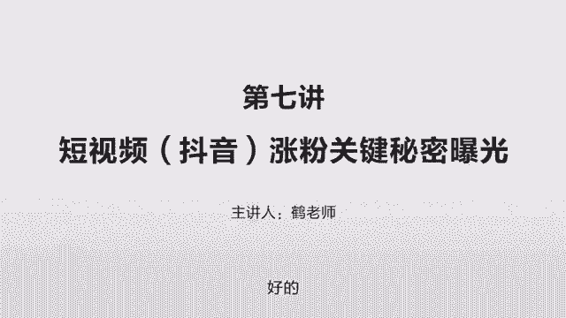
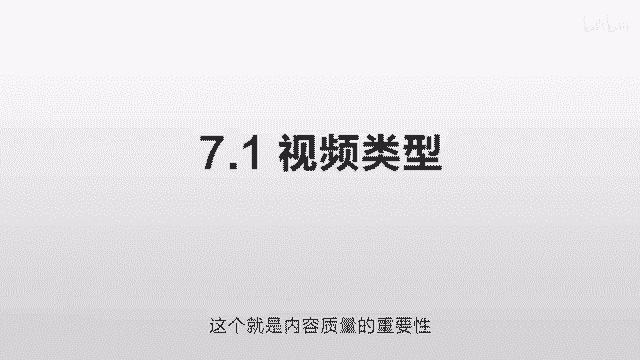
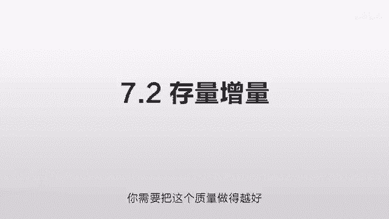
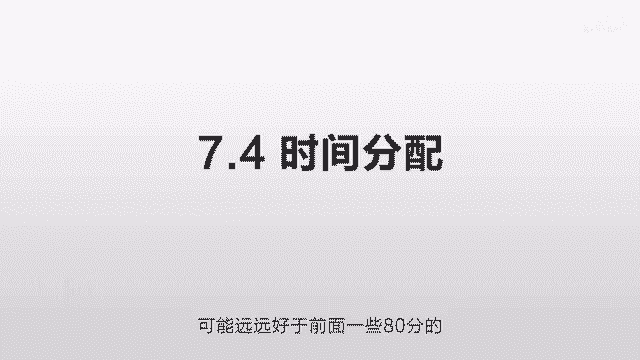
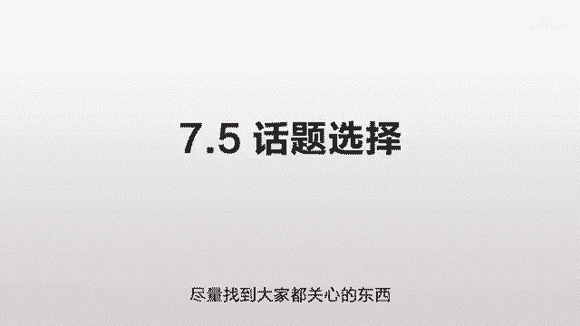
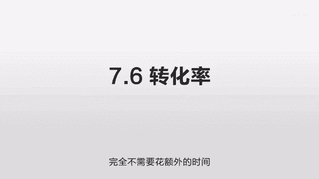

# 抖音运营从0~1全攻略【基础入门篇】B站最良心的最新2024抖音运营起号版全套教程（新媒体运营精华版） - P16：7-第7讲：抖音涨粉关键看这1点 - 人生不复制 - BV1yWHKeMEud

好的这一节我们讲一下这个短视频，尤其是抖音涨粉的关键是在哪，首先我们讲第一个内容质量，任何时候这个内容质量都是第一位的，你知道这个抖音，虽然它每天有几亿的这个访问量，但它的总的池子是有限的。

就像一个饼一样，你多吃两口，我就少吃两口，那这个时候谁应该多吃两口呢，就看谁的质量高啊，那么高质量可能有各个的维度，比如说你的拍摄方式特别好，你拍摄效果特别清晰，哎你介绍的方式特别好。

你口播的技巧特别好，或者说你的剪辑的技巧特别好，或者音乐的效果特别好，总之你得有一个地方脱颖而出，跟别人不一样，从而来获取这个用户的关注啊，增加这个完播率，增加这个点赞量，增加这个评论量。

让系统觉得你的东西特别好，这个就是内容质量的重要性。

第二点呢，我们要分清存量和增量，什么意思，当你粉丝很少的时候，这个涨粉相对容易，因为比如说你就100个粉丝，这个时候你的一个东西拍的非常好，他推的所有的人都不是你的粉丝，这个时候你涨粉就很快。

可是当您的粉丝越来越多，比如说当你有10万个粉丝的时候，你还是100万的播放量，你可能就涨不了这么多粉了，因为100万的播放量，他可能要先推送给你的粉丝，可能先推送给8万元。

那这样的话剩下的人就只有90多万的话，这个转化率就没有你的粉丝少的时候那么多了，所以当你的粉丝越来越多的时候，你实际是需要一些更高的质量，来持续让它爆掉的，比如说当你有100万的粉丝的时候。

你这个播放量可能要达到千万级别，他才可能突破现有的百万粉丝，来推送给更多的人，所以当你粉丝很少的时候，你其实不用担心什么，这个时候你涨粉反而是最快的，就我们刚才讲的，因为他不需要推送给你的老粉丝。

只要你的内容足够好，马上就会有很多人加你，而当你的粉丝多的时候，你就需要仔细控制好这个内容质量，你的粉丝越多，你需要把这个质量做的越好。

才能这个持续的大爆，第三点，我们讲那个持续输出就是抖音，涨粉的关键是持连续出爆款，连续爆款，昨天爆一个，今天再爆一个，昨天一个800万播放，今天又一个800万的播放，这个时候你才会大量的去涨粉。

他从来没有一个一劳永逸的办法，之前我们讲过这个抖音平台的算法，它很有意思，就是他不偏向于老人，他也不偏向于新人，他偏向于内容，就只要你的内容足够好，吸引人，也完全有很短的时间内可以爆发的机会。

但这个的另一方面就在于，就算你成为一个老人，就算你有几百万的粉丝，你也不能掉以轻心，因为当你没有好的质量的时候，你的粉丝就会停滞，而且这些粉丝并不是他随时可以过来看你的，就是它是不受你控制的。

他是受这个平台控制的，就更多的时候他们是一个象征意义，你是有300万的粉丝，但300万的粉丝平台不让他看到你，他就看不到你，这些人就形同虚设，所以你必须要源源不断的有新的更好的内容。

才能激发这些粉丝反复的来访问你的页面，反复的来看你的内容，所以你看那个优点和缺点都很明显，优点是新人有崛起的机会，缺点是你是一个老人，你也不能松懈，所以经常有人说，这个抖音的这个算法会抽干那个创作者。

就是你必须源源不断的给大家提供新鲜的东西，提供好的东西，而且这个东西尽量是越来越好，那我们怎么去找这个爆款呢，你可以用一个软件叫飞瓜，这个是付费的哈，他会有一个热门榜，有每天每周甚至每个月的一些热门。

有分各个行业，你可以找到你的一些对标账户，去看一些他们的爆款到底是什么，到底什么东西导致了它有这么大的一个播放量，你可以参照这个去学习，就你偶尔爆一条是可以的，但是如果你持续爆的话。

这个其实是有很大难度的，对你的创作能力，对你的这个持续输出能力是一个极大的考验，这个也就是后期你能够继续超出他们的关键，我们会有一节课来专门讲这个内容的输出。

第四个我们讲到这个时间的分配，因为我们之前讲到这个持续的输出，就是你连续输出几个80分的，会比你偶尔输出几个90分的要好很多，但这个80分和90分的衡量是你自己衡量的。

就你自己觉得这个90分的特别特别好，但很多时候你去看那个数据，并不是你自己觉得好，他就一定会爆的，你就一定要找到那个点，比如说什么才是真正的高质量，刚才我们说的80分和95分。

只是相对于你自己的时间成本而言，就你自己的实践而言，要么可能是做五条80分的，要么可能是做两条95分的，95分的固然好，它有可能在播放量上面比80分的要多好几倍，但问题在于，你自己认为的95分。

和系统认为的95分是不一样的，所以在创作上我们尽量多试错，在各个风格你都测试一下各种角度，你都测试一下各种80分和95分的，你都测试一下，尽量找到一个你自己的输出效率最高，成本最低。

那么最后结果最好的这么一个方式，你像我自己而言，比如说我自己觉得那些经济学的，我可能写的很好，有的时候我为了把一个文章写的很精啊啊，我自己觉得想让别人有一种惊艳的感觉，反复的修改那些可能改到98分。

99分，就我自己而言，我写这一个的时间，我可能能写十个80分的，你像最开始我一天写那种短的一分钟的那种，我大概可以一天写50个，就那一句话嘛，咣咣就出来了，也不用精修，但后来呢我写到那种80分的时候呢。

我就发现写不了这么多了，我可能得写700字到800字左右了，我这样的话，我一天可能会写四五个，偶尔我需要精修的，我可能两天才能写一个，反反复复的来斟酌这各种细节，那么最后在投放的时候呢。

就发现那种一天写四五十个的播放量很低，可能也就二三十万哎，那种80分的呢播放量比较不错，可能是100万到200万，也有特别特别多的，比如说你碰到的一个热点，或者说这个东西刚好是大家感兴趣的。

哎那个95分的就很奇怪，有的时候他可能会非常非常好，有的时候他的反应非常的平淡，非常的一般，这就是你自己喜欢的，你自己做的精的，并不一定是这个用户喜欢的，你要反复找到这个点，当你找到这个点的时候。

你再把最多的时间放到这个95分的上面，才有价值，也就是说这整个的逻辑在于，你先大量的输出80分的，你质量别太低，太低的话，你很难超过你的竞争对手，但你也别太高，太高的话，你的产出效率太低。

你尽量保证每天能更新一条，或者两天更新一条的这个速度，稳定的去更新，这个是基础，在你保证这个基础，保证这个质量之后，你再找到什么是真正的95分，找到这个点，然后把这个时间放到这个95分上。

一旦有一个95分的爆料，那么它的效果可能远远好于前面一些80分的。

这个需要你自己反复摸索，找到这么一个点，那下一个我们要讲的就是话题选择，就刚才我讲到的80分和95分的例子，就以我自己而言，那很多1000万播放的，甚至2000多万播放的。

很多时候是对我来说是80分的一个内容，就是我当时实际没有花太多精力，但是也没有写的太差，我可能当时没有预料到他为什么会爆，在我后来去反思，再重新看他的时候，我才发现这个问题出在哪。

因为这个人群是个金字塔结构的，就之前我们讲过，你这个东西太高深，太专业的话，你的受众就很有限，那么他推给不同的人的话，并不是所有的人都会对你这个话题感兴趣的，尽管你写的很好，这个前提是在你这个行业。

在大家都关注这个东西的行业觉得很好，但是当抖音把这些东西，往千千万万的普通人去推送的时候，很多人对这个话题可能是不感兴趣，或者他完全听不懂，他没有这个基础，他听不懂，这个时候就会出现问题了。

这个时候算法就可能认为它没有这么好，或者认为没有这么重要，那么在数据上反应的效果就很一般，而当一个东西你把它普及化，你把它降为啊，尽量降的稍微low一点，就让每个人都尽量听得懂，尽量的贴近生活化大众化。

然后每个人都可以用得到，而且能够给的提供价值的时候，这个时候你就有一个很广泛的一个用户基础，这个时候只要你的算法稍微好一点，它就很容易爆掉，比如我自己的那个牛奶可乐经济学嘛，牛奶为什么要放到方和可乐瓶。

放到原瓶，那这个每个人在生活中都会遇到，他就觉得很有意思，你虽然是经济学，可是你没有说讲一些特别专业的一些术语，你就讲了生活中的一个例子，你一旦和他生活结合起来，马上就接地气了，马上很多人就能听懂了。

他管他懂不懂经济学这个例子，他反正是能听懂，这个就有一个很好的效果，还有一个是网赌的那个嘛，就是不要接触这个网络赌博，这个也是每个人生活当中都会接触到的例子啊，周围可能有些朋友深陷其中啊。

我他自己也遇到一些这样的问题啊，而且这确实是一个很大的坑啊，能够给他带来一些价值啊，每个人都会关注，就虽然这些东西都属于经济学，但那个经济学如果贴近每个人的话，它的传播效率会远远好于一些你自己写的。

你觉得很专业的一些内容，在任何领域这个规则都是成立的，你只有不停的尝试降维，把你的东西降的稍微low一点，符合更多人的口味，你才能得到更多的用户，但那个取舍权在于你，你自己想把它降到什么样的程度。

你想在这个专业度和这个用户的广泛度之间，有一个什么样的平衡，这个取决于你那话题的选择，还有一个技巧就是蹭热点，这个热点的话，你可以在飞瓜上看到啊，也可以在抖音的一些这个排行榜上可以看到，每次一打开首页。

你看这些点赞量特别多的，然后一些时事的热点，然后怎么去结合你的这个行业，基本上你去蹭热点的话，都不会有一个特别差的播放，因为蹭热点就是蹭这个用户群体最广泛的，大家都在关注这个，哪怕你讲的很一般。

播放量也会比平时好，就没有这个热点的时候，你这个播放量可能是10万，那有这个热点的话，你的播放量可能是20万，这是个很讨巧的一个方式，要尽量找到这个热点，尽量的往热点上去靠，尽量找到大家都关心的东西。

第六个是转化率，因为之前我们从1~5讲都是什么，都是获取，获取是什么意思啊，就好像你开了一个店啊，每天比如说有100个人到你店里，这个叫获取，你做的任何的东西都是和获取有关的，比如说你怎么去发广告啊。

你怎么去搞这个促销啊，你怎么让更多的人知道你啊，这全部都是获取，让人来到店里，但是你的粉丝是什么，是转化的，就是他到店里有多少人去买你的东西，这个很重要，同样是100万的播放量。

有人可能会转化几万的粉丝，有人可能只能转化几千的粉丝，这个当然和你做的内容有一定的区别了，你比如说你要是一个搞笑的东西，你可能转化率就低一点，那大家觉得笑一笑就完事了。

他可能觉得你并没有给他提供太多的价值，但如果你是个知识型的，或者你解决他一个生活中的一个坑的问题，帮他避免了某个损失，这个时候他就会觉得你很有价值，这个关注率就会增加很多，所以我们说在内容方面。

尽量的给用户提供有价值的东西，你让他觉得错过了你，他就再也找不到了，一旦他有这个损失的感觉，他就会转化，这样的话，同样100万人看到的话，他点关注你的这些人就多了很多，这是一个内容层面的。

那当然还有很多技巧层面的，比如说你看我的这个，我这个有什么特点呢，因为我从头到尾我的拍摄的角度，我的这个位置啊，这从来都没有变化，这就会给人一个新鲜的感觉，就是他在看任何的其他的博主。

从来没有这种感觉的，哎这个家伙从他第一个视频到现在拍了200多，从来没有换过背景，没有换过衣服，这个太有意思了，就哪怕他想看你什么时候换衣服，他也可以点一下关注，就我就想知道这哥们什么时候换衣服。

反正你要找到一个让他关注你的点，那当然还有很多其他的关注点，你比如说你在拍摄方面做的非常的专业，整个制作非常的精良，他也会觉得你是一个优质的内容，这是个潜意识的引导，还有一些细节。

比如你看我的每一个视频的这个标题，大标题都保留五秒钟，这样的话你打开我的首页的话，你不用去点开，你就知道我每个东西讲的是什么，那这样的话他扫一眼就可以看到，对自己有什么价值的东西。

这样的话也方便减少他的判断成本，也方便增加他的关注量，那有一些人呢他可能内容讲的很好，但是你开头少了这个大标题，他也会导致这个关注量不够高，反正就是各个细节，你像我当时做这个的话。

我就希望把这个是属于什么篇给写好，这样的话他一看诶这几类是写这个的，这几类是写这个的，这几类是写这个的，就是分门别类，非常的整齐，而且每一个都写好了标题，他就觉得这个人做的非常的精良，非常的用心。

而且那个视频也给了他一定的帮助，那这个时候他就有很大的概率去关注你，去看你更多的东西，那么这个东西实际也是一个良性的循环，就比如说你一个东西爆了之后，他关注你，关注你了之后，然后他就会看你更多的东西。

你比如说我最开始是发了有将近20个视频，后来都没火，然后第20一个好像20几个火了，火了之后呢，然后这人关注我之后，他就会看我之前的东西，然后把之前的这个播放量也带起来了。

而且这个之前的一些播放量多起来之后呢，之前因为数据太少产生的误差，慢慢的就被消除了，然后到了某一天之后，我的第一个发的那个视频，然后又爆掉了，也是因为他的数据到达一定程度之后，他的判断越来越准确。

他发现这个是一个非常好的内容，也就是说这个关注对你的价值非常非常大，它不仅仅可以帮你把这个用户沉淀下来，另外他可以来增加你其他视频的访问量，当这个访问量多了之后，这个算法的误差就越来越小。

你的优质内容就越来越容易脱颖而出，其中它就是一个良性的循环，好我们总结一下，这个我们主要讲了六点，第一个就是内容质量，就这个池子是有限的，这个饼是有限的，所有人都来分这个时间，那么它应该分给谁多一点。

分给谁少一点，这取决于你的内容，内容质量有很多的一些技巧，那个拍摄方式，介绍方式，剪辑方式，音乐效果，你想办法在各个方面脱颖而出，跟别人做的不一样，也就更容易获得他的一些推荐量，这个是内容质量。

第二个存量增量，他讲的是一个矛盾的一个事情，就当你粉丝少的时候，你涨粉非常非常的快，因为他不需要突破你现有的粉丝的范围，而当你粉丝多的时候呢，你的权重高，推荐量多，但他又遇到一个问题在于。

他需要把你的粉丝全部都推荐一遍，才能推荐给更多的人，这个时候你如果想大爆的话，你需要一些更好的内容，第三我们讲的持续输出，就是从来没有一个一劳永逸的办法，这个抖音的算法就是这样。

你需要持续的输出一些高质量的内容，持续的突破你现有的边界，突破你现有用户群的边界，来抵达更多的用户群，你有100万，你竟然有300万的播放量，你有300万，你竟然有1000万的播放量。

这样的话才使得你的粉丝量越来越多，第四个我们讲的时间分配，时间分配实际是一个投入和产出比的一个衡量，就是我们知道你这个持续发一些东西很重要，持续发一些80分的很重要，但如果你有一些95分的。

一个95分的播放量，可能有十个80分的，那这个时候95分的就更重要，但问题又在于你怎么确定他是真正的95分，你需要尝试各种不同的写作方式，各种不同的内容质量，然后最终看一下这个抖音。

到底你喜欢什么样的质量，用户到底喜欢什么样的质量，然后计算一下你的时间投入产出比，比如说我花一个小时写的东西能够涨多少粉，那我花三个小时的写的东西能够涨多少粉，然后选择一个你觉得更高效的方式。

就有时间的分配，第五个是话题的选择，就是你这个东西一定要降维，你不要太高高在上，那很多一些行业的专业人士，特别容易把这个话题写的高高在上，这的话在专业度上没问题，但是它会严重的影响你的粉丝的扩展。

你需要把它尽量的降低，无论你在任何行业，都尽量找到和大众相关的东西，通俗化热点话来企图抵达更多的受众话题，是你播放量的基础，第六个我们讲的转化率就1~5，我们讲的都是获取，怎么去获取流量。

当你获取了流量之后，比如说有10万个人，100万个人看到你这个视频之后，你怎么把它沉淀下来，这个就是转化，那做好转换，我讲了一些我自己的例子，就是这个首页设置的重要性，你要给人一种不一样的感觉。

他点完这个视频之后，他点了一下你的头像，啪进你的首页了，这个就是你跟他接触的几乎是第一面的，唯一的机会让他时不时关注你，所以你一定要把这个页面做的非常非常好，你在某一个地方震惊它，让他觉得你非常有价值。

把某些东西写的非常的清晰，非常的有条理，把最有价值的东西最快的速度呈现给他啊，让他担心会错过你，然后觉得看到一个好的，还有一堆更好的，这个时候他才会点那个关注，而这些东西通常你一次性的设置好以后。

就一劳永逸了，比如说你在做这之前，你规划好你的这个首页应该怎么去设置，别人看完这一个视频，再看你的这整个页面的时候，你想给他一个什么样的感觉，最开始就规划好以后，完全按那个套路去做。

完全不需要花额外的时间。

一次性做好，一劳永逸。