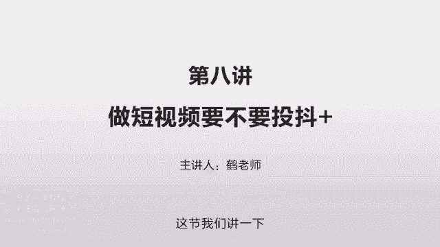
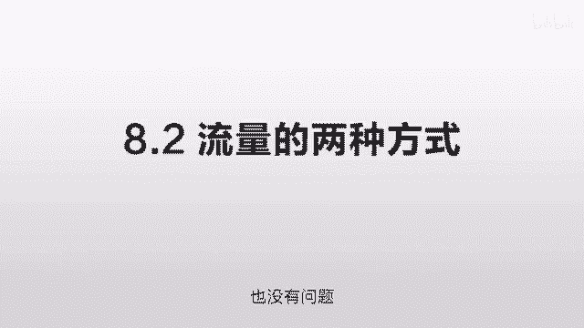

# 抖音运营从0~1全攻略【基础入门篇】B站最良心的最新2024抖音运营起号版全套教程（新媒体运营精华版） - P17：8-第8讲：短视频要不要投抖+ - 人生不复制 - BV1yWHKeMEud

这一集我们讲一下做短视频到底要不要投抖加，这是一个众说纷纭的一个事情，那很多人说这不投抖家，你就根本火不起来，这个就是瞎扯，这个对本质是不了解的，就是我们得弄清楚这个斗架到底是怎么一回事。

你不能人云亦云，毫无方向，就你很难去证明说你不投抖家就火不起来，你有可能你的内容不够好，我们得弄清楚这个本质到底是什么，就我先说我自己哈，我自己到现在为止没有投过斗家，一分钱也没有投过，在开始做的时候。

我也是不清楚这个斗架到底有没有用，但是我当时有两个想法，一个就是说，我觉得抖音是一个这么大的一个软件，你的算法竟然这么强，你一定可以识别出来优质的东西，所以我就看它到底能不能识别出来。

我第二个我想试的就是，万一我投抖加了它火起来了，我就很难知道我这个到底是因为投抖加的火，还是因为没投抖加它自然火起来的，这就多了一个干扰因素，所以当时就想我不如多等一段时间，我就持续的发。

实在实在不行的话，我再尝试这个方式，我先把这个干扰因素做的少一点，这样的话如果内容做起来的话，就完全和斗家无关，你判断的话会更简单一些，我们要首先知道这个抖音的基础的原理是什么。

那你投和不投到底有什么区别，这个我们要讲到第二个就是流量的两种方式。

我们先扯一个题外话，就是百度，百度和抖音其实是很像的，就他们都是一个机器的算法，他们本身都没有任何的内容，他们所有的内容都是从其他地方过来的，然后他只是负责一个推荐，那他们在一些盈利模式上也非常的接近。

就百度给你免费用，但他通过广告去挣钱，抖音也是你可以免费刷一些优质的东西，但他也会给你推送一些广告，他也可以从另外一端去挣钱，那么先讲这个百度，那么说到百度，我们就要说到两个方式，一个是SU。

一个是SEM啊，你不要管这些名词啊，SU就是搜索引擎优化，就是你提供大量优质的内容来让百度觉得你好，你帮助他来黏住这个用户，给用户提供高质量的东西，从而让他把你排到前面去，也就是说要付费。

就任何东西都是可以折损的啊，你花了钱把这一部分用户体验给弥补了，也是一样的，两者是等价的，那我举一个通俗一点的例子，你比如说你是一个卖电器的，有两个方式，那么SU的方式呢就是搜索引擎优化。

就是你提供大量优质的内容，比如说你是一个中关村在线，你做各种相机的一些评测，你去拍这种图片，哎用户搜图片的时候，你的图片拍的比别人好诶，他会觉得你的不错，他点你的点的比较多。

或者在你的时这个页面上留存的时间比较长，大家都认为你的比较好，或者你做了一个视频，你讲解的非常的深刻，比别人的视频都讲的更好，他也会把你的排到前面去，或者是做了一些对比，别人没有的对比啊。

我想知道这个相机和这个相机有什么区别，我也有我这样批量的制造出几万几10万个页面，这样的话我就很容易在搜这些关键词的时候，我这些页面全部都排到前面去，这个就是免费的方式，但这个免费的只是表面上的免费。

只是你没有给百度交钱，但是你还是要花精力，你只是把这个精力给花到了制作内容方面，比如说你要拍照片啊，你要顾这个编辑啊，来写这个东西啊，你要来做这个视频的测试啊，你要来做这个东西的对比啊。

这些都是要花精力的，就是说你把这个精力你没有直接交给百度，你是把精力花到了产品方面，通过产品的方式来向百度证明自己，从而来获取流量，这个叫SEU的方式，通常我们也认为它是一个更长远的一个方式。

因为他获取流量是免费的，每次搜你都会在前面，那么跟这个相反的一个方式呢是SEM的方式，就是我不需要这么复杂的操作，我也不想去找人去拍这些东西啊，我也不想去做这些对比的视频，这个太费劲。

我能不能直接给你交钱，我就是个卖手机的商户对吧，大家一点那个手机就到我们家来买，简单粗暴可不可以，可以没问题，但是因为你没有提供那么多优质的内容，你就要花钱，等于说你同样是花这个精力，只是说把你的精力。

把你的这一部分劳动凝聚为钱交给百度，两者实际是一回事，就是都是要花精力，要么你是你或者采用另外一个简单粗暴的方式，你给他钱，给他提供钱的价值也可以，就完完全全取决于你的产品的思路。

这个思路呢在抖音上也是完全成立的，也就是要么你给抖音提供好的东西啊，比如说你提供一个特别好的一个相声，或者说你提供特别好的一个短句，我给你提供一个特别好的一个知识讲解内容，你给他的用户提供价值。

你把他用户给粘下来，他会给你流量，他会给你播放量，没问题，但如果你想直接卖东西啊，说我就不想那么复杂，我不想绕这么大的圈，我直接给你钱可不可以，你给他钱也没问题，这个就是斗家的推广。

等于你绕开了内容那一步，直接简单粗暴的来做推广也没有问题，所以我们回到那开头的，不投抖家火不起来，这个就是简单粗暴的给了你一个结论，这个结论完全经不起推敲的，因为你给他提供价值价值有两部分。

一个是内容的价值，一个是钱的价值，你要么提供内容的价值，要么提供钱的价值都可以没有，这两者是完完全全等价的，有很多人都没有，投抖家都火了起来，就是因为他们在内容方面花了很多的精力，把内容做的很好。

帮他黏住的用户，这个就是对抖音的价值，你两个价值总得提供一个才行，那么投抖家有一个最大的作用就是变现，就是快速的变现，就像我们刚才讲的，他是另外一种思路，我不需要绕这么大的圈子，我就要简单粗暴。

比如说我这个东西进价十块钱是吧，我投抖加我一个用户可能要花五块钱，那这样的话我一个获客成本是15，那我只要能20块钱给他卖出去。

我每一个东西我就能赚五块钱，我干嘛还要做内容呢，就是你的目的是什么，就你的目的是细水长流，我以生产内容的方式来获取用户更便宜，我就采用这个方式，那么我直接投广告的方式更便宜，我就采用这个方式。

这操作都是表象，目的才是最重要的，只要你的目的是变现，如果抖加能够更好的实现，你就采用抖加的方式，没有问题，这个也是我们要讲的第四个问题，他真正的问题是什么，是一个新人，你刚开始做的时候。

你连那个斗家的炉都没用啊，你的粉丝他是一个公寓流量的，就像抖音这种，他只是一个名义上的数字啊，你的下一次的内容能不能看到，你也是取决于你的内容的质量的，不是说你靠抖架把这个用户给做起来。

你下次再发个什么东西，他就一定能火的，这两者没有任何直接的关系的，就所有的新人，我的建议就是你一定要先把内容做好，把这个内容做明白了，这个效果是远远的好于斗家的效果，当你想花钱去买这个流量的时候。

这个流量是非常非常贵的，而且远超你做这个内容的成本，你只要稍微花一点心思，会花一点努力，花一点拍摄的技巧，制作的技巧，你就很容易超过你的竞争对手。

你给他提供的这种价值，同样的时间创造的这些东西，远远比你给他交钱的效果要好得多得多，除非你对你的产品特别自信，你对你的这个做法特别特别的自信，你轻清楚的比别人都清楚的，来知道你做这个到底是为了什么。

我就是为了快速的变现是吧，我打一枪我就走，捞一笔我就走，这个完全没有问题，但如果你是个新人，连这个内容方面要怎么做好，你都还不清楚，你就擅自去投抖家，几乎是没有什么效果的，这个斗家也是一个非常非常深的。

你比如说像百度的SEM里面，它有一个专门的技巧，就是怎么样用用更少的钱投出更好的效果，它是有很多的监测维度的，怎么选择这个投放的方式，怎么选择这个投放的时间，怎么选择这个投放的各种技巧。

这里面是非常非常深的，你如果真的要往这个方向去走的话，它有很多很多的科技树的，而且很多科技树是密不可宣的，就比如说我100块钱投出来的东西，为什么要比你的转化的要好，就是因为有些技术。

这些技术一般大家是不教的，你用来赚快钱，你对他研究的特别特别深，没问题，但大多数人是非常不适合这个的，抖架会有一些辅助作用，这个就是我们第五个要讲的，所以这个结论就是一般人一个新，你是不要去投抖加。

你就先把那个内容做好，等你先把内容这一块摸熟了，你再去摸斗家的那一块，这两个月有一些违规，那么在传播的时候可能会受到一些影响，可以用来监测你的内容的健康程度，另外一个呢它可以减少误差，就之前我们讲到的。

你一个新人，比如说你发一个东西，可能只有1000的播放量，这个时候就会有比较大的误差，你如果很确定，你的东西在某个行业会比较受欢迎，或者在某个领域是比较有价值的，你可以尝试着投那么一点点的抖加。

而且增加个几千的播放量，你看这个播放量稍微增加的时候，他的判断是不是更精准一点，来减少误差，然后用户更快的发现你的价值，这是会有一定的帮助，但这个只是理论上，我实际没有这么去操作过。

只是如果你真的想测试的话，你可以这么去做一下，这一节我们主要讲了五点，第一个就是众说纷纭嘛，有的人说不投抖家火不起来啊，这个是完全就是瞎扯，对本质不了解，第二个我们讲了流量的两种方式，就拿百度来做例子。

它是有两个方式，要么你提供好的内容来帮他锁住用户，你要么直接花钱来给他提供价值，这两个是一样的，但是后者你花钱的这个钱啊，会比你前者的钱要多很多，因为你在伤害他的用户体验，这个抖音也是一样。

你要么提供高质量的东西，让用户觉得在抖音上非常的有意思，非常的开心，非常的舒服，把他时间给他锁住，要么你直接花钱买广告，那这样的话，用户比如说翻翻翻几个有意思的东西，突然来了一个广告啊。

他可能觉得也没有那么开心，你这个是以折损用户为代价的，那你就花更多的钱，两者原本就是等价的，取决于你到底是要什么，你是要速度还是要成本，你是要短期变现还是要长期收益，想清楚这个再说，要不要淘豆家。

这是我们说的第四个问题。

当一个人刚开始做的时候，当你连内容都还没有摸清楚的时候，你直接去投抖家几乎是不行的，这两个是同样深的，你做内容怎么把内容做好，是一个特别深的一个技术，那你怎么投抖加同样的钱投出更好的效果。

怎么去投这个变现会更好，怎么去找这个价格差来最大程度的变现，这也是非常深的，那第五个我们讲到一些斗家的辅助作用，它就可以帮助你判断一些东西，是不是有潜在的违规。

