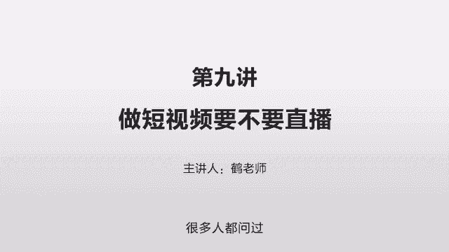
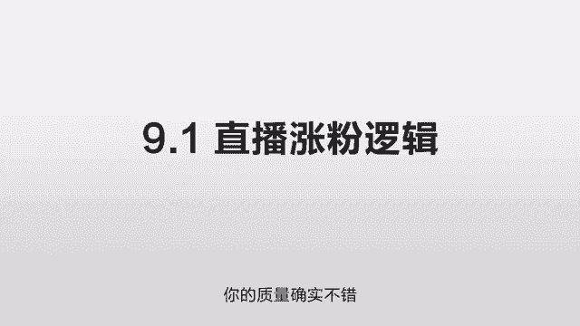
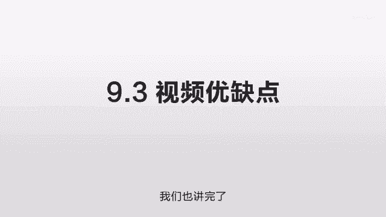
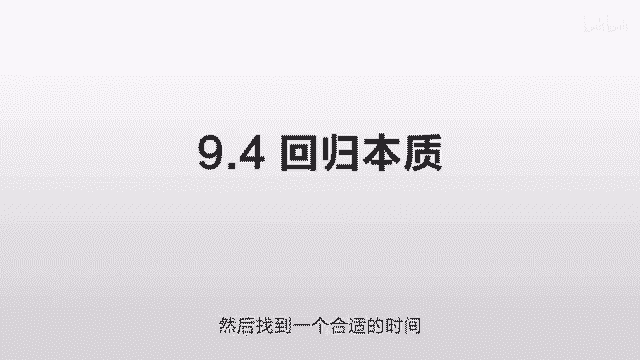
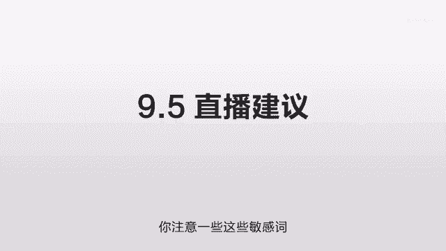

# 抖音运营从0~1全攻略【基础入门篇】B站最良心的最新2024抖音运营起号版全套教程（新媒体运营精华版） - P18：9-第9讲：做短视频品要不要直播 - 人生不复制 - BV1yWHKeMEud

好，这一节我们讲一下这个做短视频，要不要做直播啊，这是一个很重要的问题，很多人都问过这样的问题。

我们先讲第一点，就直播涨粉的逻辑到底是什么，那你可能听过这样的说法，就是说你来做直播的话，哪怕你的最开始用户非常非常少，但只要你持续的做，你努力的去做，然后把每一场都做好，然后你的用户就会越来越多。

他就好像一个很朴素的一个做生意的观点，就是只要你对用户特别特别好，只要你把这个产品做好，你的用户就会越来越多，但是我们想知道它背后的逻辑到底是什么，因为这个说法给人的感觉就是你特别勤奋。

然后上天就会回馈你，但是我们想知道它背后的逻辑到底是什么，为什么你这么做，他就会有这样的结果，因为就我们的观察来讲，确实是这样的，就是你把每一场直播都尽量的做的特别特别好，然后你的总的人数就会越来越多。

那么讲清楚这个问题之前呢，我们先回到这个视频的算法之前，我们讲过就是什么样的视频可以获得流量，那么他获得流量大概有哪些算法的步骤，最关键的就是流量池，就是他先给你一个小部分的流量，先测试一下啊。

看看这些人的反馈，觉得你东西好不好，好的话，再进到下一个流量池，更好的话再进到下下一个流量池，它是一步一步给你测试的，那他通过这个测试呢，来判断出你的内容质量到底是什么样的级别。

最终决定给你一个什么样的推送量，这个是视频的逻辑，那么直播涨粉其实也是同样的逻辑，为什么一个人在他没有什么粉丝的时候，直播他的粉丝会越来越多呢，那有些人可能直播一阵，如果他的状态不是很好。

或者说他直播的不是很好的话，他的粉丝一直没有涨呢，原因也是一样的，因为看直播的人就这么多，那么这些人应该分配给谁，如果你是平台的话，你也会用一样的算法，就是谁做的比较好，我就把流量给谁。

同样是做直播的对吧，就这么多人，他的直播好一点，那我就尽量给他多推一些人，那么在推的时候，因为算法他是看不懂内容的，只有人可以理解内容，他只能通过数据去观察，比如说我给你推了100个用户去看你的直播。

那么这100个用户注意啊，最后留存了多少，同样是两个做直播的，都卖一样的东西，几乎是一样的类型，同样推送了200个人，有一个做直播的留下了50个，另外一个只留下了40个，他可能认为这个50个的质量更高。

那么接下来下一批100个人，他可能更多的去给这个50个人的，也就是说直播它也采用了一样的一个算法逻辑，它通过一层一层的去筛选，一层一层的去对比来看出谁的质量比较好，那么你的质量好的话。

他就会持续的给你一些直播的人，从而使你的这个直播间的人数越来越多，这个是他的底层逻辑，并不是你辛苦，他就一定有这个回报，你要质量好，你要超出你的同行，你要给系统一定的时间，他来判断出来你的质量确实不错。

它会源源不断的给你东西，这样那讲完了这个直播涨粉的逻辑呢，我们再讲第二点，这个直播的优缺点，那我们先说优点吧，优点非常的明显嘛，它和视频不一样，视频是别人录好的啊，直播直接是面对面。

他有个很好的一个信任度，而且你可以推销你的商品，转化率也会非常好，会给一个很亲切的感觉，你见到的不是已经录制好东西，你见到这个活生生的人，他可以直接回答你的问题，它是一个非标品的一个产品。

那么但他的缺点就非常的明显了，我们刚才讲了他这个涨粉的逻辑，那么他对直播者的要求是什么，就是长时间高质量的输出，就你只有高质量不行，你就只直播一个小时不行，你必须长时间的高质量的输出。

使得系统每次到你这边来的时候，每次给你分配人的时候，很多人都可以留存下来，那么从系统的角度来讲，非常非常好啊，他有很多的用户不停的给他输出高质量的内容，来帮他在直播的层面来黏住用户，但是对于直播者来说。

这个就非常非常的伤精力的，应该说是极度的伤精力的，首先你得高质量，你肚子里得有货，你得不停的去说一些有价值的东西，其次你还得长时间的说，你需要长时间来保持一个亢奋的状态。

来叼你所有的能量来留住镜头前面的用户，那另外呢它还是一个非标品，因为你每次面临的客户都不一样，你可能比如说有2000个客户在这看你直播，那过了一个小时呢，可能原来2000客户只剩下1000了。

又来了一个新的1000的客户，这个时候就会出现很多问题，就是他同样的一个问题，这个人问一遍，那个人又会问一遍，你这样的话，你每一次都需要以一个打满鸡血的一个，状态去回复他们。

使得任何一个人在任何一个时间进来看，都是一个很完美的结果，所以这个的劳动强度是极大极大极大的，那这个就是他最大的缺点，他极度的消耗你的心力，它是一个非标品，就全部都是个性化制作的，个性化定做的东西。

它没有办法像一个流水线一样批量制作出来，像那个视频一样批量制作出来，然后就给几10万个人，几百万人，几千万个人看，你需要时时刻刻处在一个，高强度的工作状态之下，时时刻刻把自己最好的一面展示给别人。

非常非常累，好的讲完了直播的优缺点，我们再讲一下这个视频的优缺点，就是第三点，我们先讲视频的缺点吧，其实视频的缺点就是直播的优点，就直播可以面对面，可以提高信任度，可以提升这个转化率。

可以很好的一对一的介绍这个商品，但是这些东西视频都做不到，但视频它有一个好处，这个好处只要它足够大，就可以覆盖它所有的缺点，就是它可以流水线工作，就你不需要保持24小时，长时间的一个高质量。

一个高度亢奋的一个输出状态，你只需要把这个东西写好，找到你最佳的那个状态，那么再找到一个最佳的时间，把这个东西给录好，那么再找到一个最佳的剪辑，把它给剪辑好，也就是说所有的状态你自己可以调整。

你去分配时间，分配精力，只要最终这个东西出现在用户面前，是完美的就好，而且它一旦出现在用户面前，那么它传播的这个边际成本就是零了，因为你已经做好了，只要你的这个东西足够好，它就会不停的推给更多的人。

这样的话你就可以腾出来更多的精力，来忙其他的事情，而不是你长时间的，都把精力消耗到这些用户上面，而且根据经验，只要你的东西做的足够的好，它的传播效果是非常非常好的，可能有个几百万几千万的播放。

涨粉非常非常快，那讲完了这个直播的优缺点，我们也讲完了这个视频的优缺点。

我们讲第四点，回归本质，就这两个事情其实完完全全是一回事啊，他都讲了一个事情，就是说你同样的精力到底应该放在哪里，你的产出才会最大，你当然可以去做直播，你当然可以保持一个长时间的一个亢奋的状态。

但是你是需要花精力的，你需要花时间的，你在这段时间你把这个精力输出出去了，同样的时间你就做不了别的事情，你就没有办法去写一些很精致的稿，你就没有办法去拍一些很精致的视频，你就没有办法在选择传播的时候。

有一些很好的想法，就你所有的时间都在一个机械的输出方面，在你一个熟悉的范围之内不停的输出，不停的输出，那这样留给你思考的时间就很少，你就很难在一个陌生的领域，去探寻它的这个边界，在哪，去找些更大的市场。

就是直播，他会很容易把你带到一个机械而单调，重复的劳动当中，那么我们再看一下这个同样的经历呢，比如说我没有做直播，或者我直播的时间比较少，我能不能拿这个同样的时间精力，我把它做出一些质量更好的视频。

我通过这个流水线的这样的工作一次性做好，然后低成本的去传播，只要我这个东西做的足够好，只要我到达的用户足够多，他依然可以获得非常非常多的用户，效果不一定比这个直播差，一样可以获得很多很多用户。

所以这两个事情它就是一样的，就是你愿意把你的精力放到什么地方，他的产出比较大，那么我们自己的建议来讲，就是你先做视频，因为视频的竞争没有那么激烈，要求也没有那么高，在这个视频的层面。

实际上你去找一下那个对标账户，下面我会讲到这个东西，所以你会发现很多人其实做的非常非常一般，你只需要在这个内容方面做好一点，或者说拍摄方面做好一点啊，录音方面做好一点啊，各个细节稍微注意一点。

就很容易脱颖而出，因为它留给你足够多的时间去想，他不是直播，他是录播，他给了你足够的时间，把最好的一面发挥出来，当你从那个视频开始做起来，逐渐摸清楚这整个套路，摸清楚这个对标账户。

摸清楚怎么去抓住用户的心理，摸清楚怎么写出一个好的文案，拍出一个好的东西，获得一个好的传播，说明你对这个套路已经比较熟悉了，而在经过你前期的一阵操作之后，你现在已经有了一定的用户基础了，比如说有几万。

有十几万的粉丝，这个时候你再来做直播，你就会有一定的基础，就首先你对这个内容制作已经非常的熟悉了，他问你的问题，也基本就是你之前在线下准备的这些问题，而不是上来你就面对一帮陌生的客户。

回答这些陌生的问题，你等于预先经过一个演习了，其次当你有一帮用户群之后，在你做直播的时候，很多人会直接被作为一些默认的客户，给你推送进来，你这样的话你的直播间就会有一些基础的用户，你就不会特别尴尬。

你就不会从零完全做起，就完全靠一个特别高的一个质量，去源源不断的去吸引一些人，就说视频是一个基础，你在打好这个基础的时候，你可以通过直播来给他锦上添花，来增加一些额外的流量。

增加一些视频之外的一些渠道的流量，因为对这个系统来讲，视频的流量和直播流量是分开的，他们是两个不同的算法，因为有些流量呢在视频获取的非常好，但是你直播可能就很一般，这个时候你有一定的基础之后。

你再去做直播，你就可以在直播这个领域再捞一些流量过来，这些人是通过直播来关注你的，这个就有了基础之后，你做这个东西会轻松一些，第三点就是转换，如果你上来就做直播，用户对你完全没有概念。

他就没有见过你之前聊过什么东西，他直接一打开这个人在说这个东西，你需要特别强的一个语言控制能力，和一个特别强的一个现实扭曲场，他能用这个用户去相信你的东西，并且下单，这个非常非常难的。

因为这个客单价一高了之后几乎是不可能的，那么这个时候你就需要用视频来卸掉他的防备，先建立一个信任的基础，就是买不买没关系，你先看我的视频，我每一个视频都在帮你一个忙。

每一个视频都在给你提供一个有价值的信息，哪怕你看完之后不买也没关系，而让他觉得他没有一种压迫感，只要你去店里买东西，那个店员说你买什么东西，买什么东西，我去帮你看一下，这个时候你可能就很反感。

我可能随便看一下，他货的再多了，你可能掉头就走了，但如果他不给你施加这种压力，你自己随便看，觉得哎这个东西也不错，那个东西也不错，那个东西也不错，哎有点意思，在这个时候他恰到好处的给你来一个直播。

他走到你前面说，哎我帮您介绍一下这个东西是不是挺好的，这个时候你有了一个前面的基础，再做转化就会好很多，那么视频跟直播的关系也是这样，你先要通过这个视频去打一个基础，他对你产生一个七八十%的一个信任。

但是还没有足以下单的时候，哎这个时候基础打好了，你再去做这个直播就会好很多，绝对不要上来就做直播，那个非常非常难的，你比如说我自己，我到现在没有做过一场直播，因为我自己在衡量那个性价比啊。

就是对我来讲是做直播的性价比更高，还是做这个视频的性价比更高，我目前觉得是做视频的性价比更高，那么同样做视频，那么是做80分的多做一点呢，还是做95分的，少做一点就性价比更高呢，我也在反复的判断。

从那个数据里面来看出最终的结果，所以出发点不是方式，任何方式都行，我的目的就是要获取用户，就是要变现，就要最大程度地找到廉价的流量，只要符合这个目的，任何方式都行，千万不要被方式所累。

那比如说我做直播的话，其实我就很头疼一点，就很多东西实际上我讲过了，但你要做直播的话，比如说你有几千个用户啊，这个人上来问一下这个房贷到底转不转LPR啊，你告诉他转过5分钟，又一哥们过来问，哎。

这个你房贷到底转不转LPR，你再告诉他转，过几天又一哥们过来问，说哎我那个房贷还剩20年，要不要转个P2，过一会儿又有一个人说，那我的房贷还4。35，要不要找热pr，所以当你没有这个基础的时候。

你每个东西都要回答一遍，特别特别累，你稍微有一些没有回答好，他这个留存度可能就不够高，所以我对我来说，我觉得非常非常累，就觉得自己变成了一个机器了，不停的输出这样同样的内容，而且我没有时间去学习。

没有时间去吸取一些新的东西，没有时间去思考，所以这个对我来说目前来讲性价比是不高的，那么以后我可能会做直播，那么直播的话，可能会涉及到各个方面的脱颖而出，包括直播的各个细节，这就是我们下一节要讲的。

那么至于你自己，你根据自己的产品去选择，有些人可能你完全不需要做直播，你就做视频特别特别好，你做直播完全耽误你时间，那有一些比如说你要是卖东西，你靠这个直播去提升那个转化率。

这个时候你就先把这个流量基础给做起来，做起来之后，然后找到一个合适的时间。

从直播去切入，然后尽量去增加这个销售量，这些都没问题，那第五个就是些直播的建议，就刚才我讲了我自己的例子，就是我如果要做直播的话，我会脱颖而出，怎么脱颖而出呢，就首先是画质啊，就像我们那个拍视频一样。

拍视频永远永远不要用手机做直播，也是永远永远不要用手机，你看起来好像很简单，一个手机一直播就行，那个画质很差很差的，你比如说两个人同样去讲一个东西，就比如同样讲财经的哎，一个很清晰，一个很一般。

但内容一样的话，你一定会选那个清晰的，这就是一个心理的一个暗示，他没有对错，用户他可能也觉得我觉得内容就第一啊，你问他，他肯定说我觉得内容是第一位的，问题是你根本就不知道哪个内容好啊。

你刚进来你怎么知道哪个内容好呢，你就可能就觉得哎这个家伙清晰一点，拍的挺好看的，好像比其他的这个拍摄的角度啊什么的，这个拍摄的效果都要好，我听一下呗，这个东西是让它留存的一个关键的因素。

就是你要拍摄的话，一定要有一些专业的一些直播的设备，那么我自己现在大概研究了一下，就会有一些直播的卡，甚至有些软件也可以，那么你需要一个相机连到你的电脑上，然后再连接你的手机。

那这样的话呢它就可以同步这个画面，就等于说你拿相机拍出来的，然后给投影到这个手机屏幕上，这样的话就清晰很多，声音也是一样啊，你需要有一些好的声音的直播设备，这样的话你的声音可以在听筒前面去。

抓住它的耳朵，这些也很重要，但是从来没有人说过这些东西，这些潜台词，这些细节当中，这些不为人所重视的东西，实际上恰恰是它的关键点，因为你的内容没有办法一夜提升啊，你卖什么东西呢，你对它了解有多少。

你这个东西你几个月之内你不可能有质的变化，但是你在直播的设备上，你的画面上可以几天之内有一个质的变化，你在声音上可以有一个质的变化，这些东西可以很容易让你超出你的竞争对手，比如说你是高清画质。

你这个声音，这个通过这个拾音器出来的声音非常好，处理过，非常有磁性，能够吸引住镜头前的用户啊，给人一种信任感，这些没有办法用语言表达的，隐藏在各个细节当中的关键点才是真正重要的，那么在直播的时候呢。

你自己可能需要先预备一些问题，一般来讲就是你从你的那个视频里面看看，大家都问你什么问题，你把它总结起来，你基本上100~200个问题，就基本上能覆盖所有的用户需求了，偶尔有一些你临场发挥一下就行。

然后你把这些问题先以书面的形式给他写下来，这些标准的答案应该是什么，先滚瓜烂熟，你不用临场去想，你有一个基本的框架，就形成一个条件反射，一旦回答这个问题，啪啪啪三点出来，在你讲完之后，哎你想发挥的话。

你再发挥一下，不要临场去想啊，那样的话会给人感觉，要么你的业务不熟，那么你这个信任度不够，就你要直播的话，你要么就不直播，你要直播的话，就以一个非常自信的状态展示给他面前，那么你要自信的话，你就得有底。

你得先知道对方的底牌，他问什么问题，你做好准备，在这个时候他来一招，你接一招，然后顺便发挥一下才行啊，那么还有一点我们要注意的就是敏感词，我知道像财经领域的，还有房产领域的。

有的时候直播的时候可能会被断掉，就有可能你在说的时候，它涉及到的一些敏感的词语，有些东西不太适合讲，因为直播的这个尺度会比视频的尺度要严很多，所以你在直播的时候，根据你自己的行业。

你去搜一下哪些词是不可以讲的，一定要注意，另外在直播引流的时候，也要尽量找到一个相对安全的方式，因为有可能你的竞争对手在盯着你是吧，他就是给你录屏呢，他就专门找你这些有问题的地方，你是个新人吧。

你这个流量做的挺好是吧，好那你直播没经验是吧，你出错了事，我举报你可不可以，你得防着这么一点，所以你这些东西在安全性的东西你要做好准备，就是哪些东西是不可以的，这些网上有现成的东西。

你就找你具体的行业去搜一下，就了解清楚了之后，免得你在直播的时候哎啪怎么突然断掉了，哪个地方有问题，你现场再去找什么问题，这些能避免的，在直播之前都要尽量避免掉好了，我们再总结一下。

今天我们一共讲了五点，第一个就是直播涨粉的逻辑，就是他也是给你一个测试的池子，然后他给你分配一些用户，100个用户留的多的话，他再给你200个用户，300个，500个，这样的话你的直播的用户会越来越多。

这个就是他直播涨粉的逻辑，那么第二点我们讲了这个直播的优缺点，优点就是面对面嘛，信任度高，转化率高，可以直接介绍商品，那么缺点就是精力成本高昂，极度高昂，那么第三点我们讲的视频的优缺点。

就是跟直播反过来的，就他信任度没有那么高，也不是面对面，转化率可能也差一点，但它的优点是它成本低，它跟流水线作业，第四点我们讲的这个回归，本质就是你不管是直播也好，视频也好，他俩是一回事。

本质上就是你同样的经历，你怎么去获得更多的粉丝，你只要是满足这么一个条件，你用任何的方式都可以，你不要拘泥于视频或者说直播，根据你自己的情况而定，第五个就是直播的一些建议，就是你要做就要做好。

你就要脱颖而出，要么你就不做，那么做的时候怎么脱颖而出呢，比如说你有一些高清的直播设备，你的这个声音把它处理的好一点，那么你把这些问题预先的准备一下，你注意些这些敏感词。

避开这些坑。