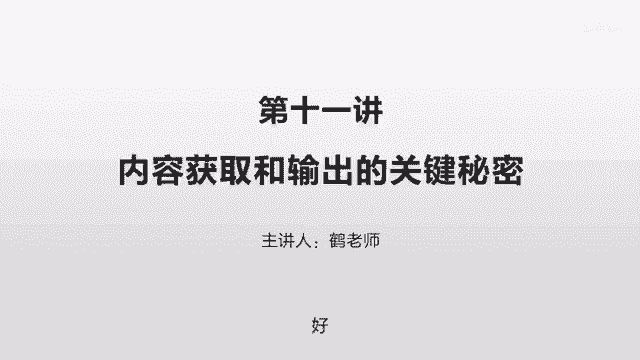
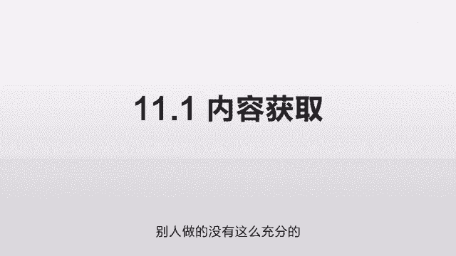
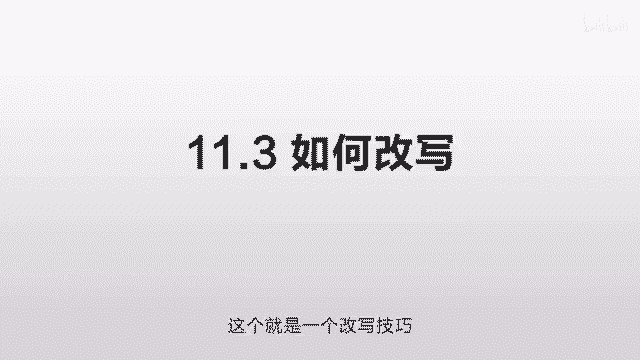
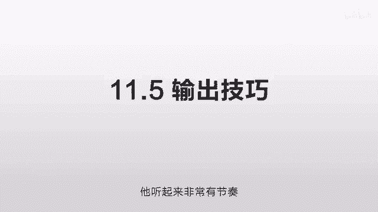
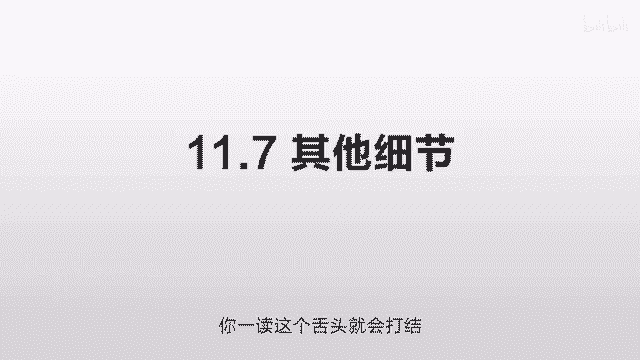

# 抖音运营从0~1全攻略【基础入门篇】B站最良心的最新2024抖音运营起号版全套教程（新媒体运营精华版） - P19：10-第11讲：主播如何保持基业长青的优质内容 - 人生不复制 - BV1yWHKeMEud

好，这节我们讲一下这个内容的获取和输出的，一些关键性的环节，第一个我们先讲这个内容的获取，因为之前我们讲过这个抖音的持续输出，非常非常重要，就你只有持续的输出，持续的爆，才会有源源不断的用户进来。

但是持续的输出你需要有足够的容量才行，就是你得有足够的储备才行，但很多人没有做过这个，我输出两次发现没有东西了，这个时候呢，你就需要找到一个非常好的内容获取源，使得你这东西可以源源不断的输出，几个月。

一年两年3年都没问题，那怎么去找到这个源头呢，还是那个原则，就是你要超出竞争对手，就绝大多数人不做的东西，你去把它做了就好了，一个非常重要的原则，就是在你的这个行业，你想做的任何一个行业。

在淘宝上把他所有的书，就相关的书全部买了，是全部啊，一本都不要少，全部买过来，买过来之后呢，你就可以从里面找一些你觉得有价值的东西，然后呢把它处理一下，变成你自己的内容，因为那个书本的内容。

和网上的内容还是不太一样的，就网上我们很多能搜到的东西，实际上是没有太多价值的，有些东西在书里面的时候，你往往你在网上你是找不到的，这个时候你就会有一个比较独到的一个信息源，当大家都在网上找的时候。

你把书都给他买齐了，你就可以在这个维度超过它，另外我们可以去一些相对私密的圈子，找一些信息，那比如说这个知识星球啊，或者说一些付费的社群啊，付费的微博的一些问答，这个时候也可以提供一些非常好的。

有价值的信息，还有一些是你把你这个行业一些相关的，一些重要的公众号啊，这些相关的微博号啊，你都把它记录下来，然后定期去看他们的内容，你觉得有价值的东西都把它保存下来，然后作为一个文章库。

平时选的时候可以用去搜这些关键词，此外你还可以用搜狗，因为搜狗可以直接搜微信，或者在知乎里面搜这些东西，会比你直接在百度里搜要好很多，有了这么一些渠道，那你基本在这个内容的获取方面。

你就几乎是超过几乎所有的对手了，就别人没有干完的，你把他都干了，别人做的没有这么充分的。

你把它全部都做了，别人不舍得上去买书的，你把它全部都买了，第二点，我们讲一些展示方式，就一定要明白哈，没有所谓的绝对的原创，就你所有的东西都是继承前人的，你要么是把它改写一下。

要么是你自己消化的时候把它输出出来，但是在这个视频领域，它甚至还有一个优势是什么呢，就是你不同的展示方式，它是完全两个不同的内容，什么意思呢，就这一段话在网上有，你可能一搜可能几十个完全一样的结果。

但是视频里面没有啊，你把它拿过来，自己把它读出来，这就是另外一个内容，这就是两个完全不同的东西，所谓的有价值内容，所谓的新的内容不一定是完全，文字方面不相同的，它有可能是表达方式不同。

不同的表达方式就导致了，这是两个完全不同的产品，他接触的是两个完全不同的用户，他是在以两个完全不同的方式来抵达对方，你刷抖音，你就看过有那种主持人，主持人是什么，他这个播报器啊。

人肉播报器他很多是没有自己思想的，哎你看有些主持人，那他那个账号非常好，这个很有意思，你可以研究一下，他们的东西几乎都是在网上抄过来的对吧，你去找一些那些点赞量比较高的，你就把里面的话题网上一搜嘛。

几乎都有哎，这个时候你就会发现很有意思，他没有自己的原创，他就从网上去摘抄一些东西过来，然后把它读出出来，只是它的光线效果非常的好，拍摄效果非常的好，声音的效果非常的好，口播的技巧非常的好。

哎这样就导致他在这个方面脱颖而出，这个给我们提供了非常好的一个思路，就你自己也可以按照这个方式去找，去找一些网上很熟悉，在文字领域有很多这样的结果，但是在视频领域完全没有的，这个就是一片空白。

这是个蓝海，别人没做的，你就可以做，比如我研究的这个账号，有一个主持人，他讲的这个还款方式，这房贷到底应该采用什么样的方式去还款，因为在网上随便搜的就特别特别多一样的结果。

然后他呢从中选择了大概不到200字，慢慢的把它读出来，注意这个抑扬顿挫，然后抓住了这个用户的心理，然后刚好呢这个还房贷也是一个刚需，因此就大概有上百万的点赞，它有技术含量吗，没有技术含量。

他就是打了一个信息差，这个东西在网上还没有，那你是第一个把它做出来的，而且你在做的时候呢，你在表达方式啊，在这口播技巧啊，声音效果超出了对手，这样就行了。

第三个我们讲如何改写，因为我们讲展示方式的时候，很多人会问一个问题，说，那我抄过来，别人会不会找我呀，那么这个在实际操作当中呢，你可以自己改写一下，比如说你讲同样的一个话题，那么你不要去找一个文章。

你去找两到三个甚至四个文章，然后每一个你去找他的一部分，然后你看下他的一个精髓在哪，甚至每个人你去找他一些话，然后你自己用自己的语言，把这些关键点连接起来，连接成一个几百字的，这个其实非常简单。

那这样的话，任何一个文章在这边看来都好像若有若无，你的影子，那这样的话你的文章既像这个，又不像这个，既像这一篇，也不像这一篇，任何一篇都不能说你是抄袭，因为你只借鉴了非常小的一部分。

这个就是一个很好的技巧，他是没有办法通过说抄袭这个方式来找到你的，这个就是一个非常实用的技巧，而且你自己的语言加的越多，你就越锻炼自己的语言组织能力，你以后输出的东西就会越有基础，就你薅羊毛。

你不要老逮着一个羊薅，你每个羊都薅一遍，然后你把它混在一起，你说这是哪个羊的呀，哎不知道这是个商业中的一个小技巧，既借鉴了别人的东西，又有自己的东西在里面，这些东西你稍微融合一下，你自己多练习一下。

这个就几乎是一个纯原创的东西，这个就是一个改写技巧。

那么第四点，我们讲ab测试什么意思呢，这个就是在程序开发中经常遇到的一些问题，比如说有一个APP啊，他想测试一下这个功能，但他不知道这个功能推出来之后好还是不好，那么好，那我就1万个用户推这个功能。

1万个用户不推这个功能，那么我看最后哪个用户的反馈效果比较好，通俗来讲就是分批测试嘛，你看看用户到底喜欢什么，一半一半，然后这一半如果好的话，哎你下一次再在这个地方再多加一些努力，再多增加一些内容。

那么在实际作当中呢，你可以抄写一部分，改写一部分，原创一部分，你看看哪个好，什么抄是什么意思呢，就是你就一个字不改，我就是一个字不改，我就完全抄过来，抄过来，我读哎，这个是抄的改写的。

就是说我们刚才讲的各找30%啊，去找不同的羊，去薅它的羊毛，然后你再加一些自己的语言，这个叫改写，还有一部分的原创，就是你完全自己写，完全自己想，你对这个东西有理解，完全用你自己的语言去表达出来。

完完全全任何地方都百分之百的原创，你把这三个内容都写出来，然后去发布，然后你看看用户更喜欢哪个，这样的话就可以确定你应该往哪个方向去努力，这三个部分你应该怎么去配比，完全原创当然非常非常好。

但是他非常非常耗时间，你直接抄别人的话呢，效率非常非常高，但有可能会遇到投诉的问题，那可能会遇到这个IP下降的问题，就别人发现哎呀，你这个家伙是抄的，信誉度可能会下降，那么中间的就是改写的这个部分。

你自己反复测试。

看一下哪个效果最适合你，然后定下来一个大致的方案，第五个我们讲一个输出技巧，就你写这个文案要怎么写，开头一定要吸引，就八九十%的人都败在了开头上面，我们自己都有这样的经历，尤其是这种大会上的讲话。

有些人特别紧张，上台之后先说大家好，我是某某某某某啊，今天非常非常感谢啊，今天我今天是讲一些什么样的问题，基本上前3分钟都是废话，可能在做抖音的时候，也会把这个坏习惯给带进来，这个非常非常糟糕。

就是大家好，我是某某某，我今天就给大家去讲一个东西，不要说这些东西是吧，开头一定要吸引住他，我们举个不恰当的例子，就好像有一个人在大街上，你想给他讲一下你这个伤心的故事，说你好啊，我叫什么什么名字啊。

我是哪个哪哪毕业的，我家住哪啊，我现在给你讲一下我的故事，那哥们肯定说你神经病吧，直接就走了，在抖音上也是一个人，但凡那么讲，用户就会快速的划走，因为他面临的是很多其他的竞争，他可能是个大长腿。

这边可能是三枝花做表演啊，可能是某个明星在做直播，可能是某个热点新闻，在这个时候有一哥们说啊，你好，我是某某某，我就给你讲一个什么样的东西，马上划走，所以这个时候你要做的是什么呢，你直接走到他面前。

啪抽他一巴掌，这哥们就直接愣住了，说你干嘛打人呢，你干嘛呀，然后你告诉他哎呀认错人了，这个例子非常的极端，然后你再给他讲，哎为什么会出现这种情况，到底怎么怎么回事，不好意思，我道个歉吧。

要不我请您吃顿饭吧，实在实在不好意思啊，这个时候他可能才会有兴趣去听啊，这个家伙到底怎么回事啊，怎么情绪这么大的波动啊，这遭遇过什么呀，感情有什么问题吗，这个时候你就吸引住他了，这是个非常极端的例子啊。

但是你把它用到这个抖音里面，就是这样的，就很多这个话题上来，就是啪抽了这个用户一巴掌，用户就会看哎呀怎么了，怎么回事啊，比如说千万不要提前还房贷，这就啪抽我一巴掌，为什么呀。

或者说千万千万不要买这几种饮料，他都是一个开头的技巧，他想尽一切办法在一句话之内，就十个字之内，你把这个用户给抓住，不让他走，然后你再一步一步去讲你的东西，他才能听下来，你留都没有留下来。

你的东西再有价值是没用的，所以我们做这个抖音，要在足够短的时间内，把足够精彩的东西呈现给他，他没有那么多时间，没有那么多精力听那么多废话的，你在输出的时候尽量要用更简短的句子，那么在输出的时候。

你注意要尽量用一些稍微简短的句子，你不要用那种大长句，大长句在表达的时候，是非常非常不适合抓住人的经历的，这个短句是什么意思呢，它就好像一个镜头不切换，一会换成这个，又换成那个。

为什么有人在给你播东西的时候，他一会切换一下镜头，一会远一会近啊，一会有一个特写啊对吧，他就是为了抓住你的眼球，人的眼睛对这种闪动的东西非常的敏感，你比如一个苍蝇一会儿飞来飞去。

你的眼睛就会情不自禁的去看它，那么在输出技巧上也是，你尽量不要写那种特别特别长的句子，人把它打断打散，尽量能用两到三句说清楚的，不要用一句话，这样的话它听起来非常有节奏。

可以更好地抓住他的注意力，第六个我们讲一下侵权问题，因为你但凡你要抄，你就一定要涉及到侵权问题嘛，对吧，这个一定要是要面对的，那我们的回答是什么呢，先野蛮生长，你就先拼命的生长，先拼命的把自己壮大起来。

这些东西在你没有壮大起来之前，全部都不是问题，你只有几十个几百个几千个播放量，你去关注侵权问题干嘛呢，等你有了几10万几百万几千万的播放量，等你的粉丝不停的往上涨，等你的这个自信无限无限多的时候。

等开始有人去艾特别人说哎这个怎么是抄的，这个时候你再去关注这个侵权问题，再去想怎么去处理它，怎么处理呢，该道歉道歉啊，该赔钱赔钱啊，但至少你得到了一个验证的机会，你不需要在开始的时候完全不存在的时候。

把很多精力给花在这个方面，当你采用一个成功的方式，有几10万几百万的播放量之后，成功的引起原作者的注意之后，其实你得到的东西，已经远远比这些侵权所付出的东西要多了，当然我们不是说侵权好啊。

你如果能自己写，尽量自己写，我们只是说一个性价比的问题，在这个东西没有完全确定之前，在你还没有这个路都没有摸熟之前，不要花太多的时间，就不要过多的去考虑侵权的问题，你先活下来，先成长起来，先长大了。

然后再说，如果你真的侵权别人了，该怎么道歉，怎么道歉嘛，就该怎么赔钱，怎么赔钱嘛，尽量的诚恳一些，其实这些错都不是致命的，你说哪一个企业在发展的时候，没有过侵权的问题，哪一个人在做这个原创的时候。

没有遇到过一些侵权的困扰，遇到了就去解决，用真诚的态度去解决，但是不要在你没有遇到这个问题，其实之前你自己消耗的精力，就把自己给搞挂掉了，这个是关键点。

第七个我们讲一些其他的细节，就是你在写文章的时候，我们刚才讲过，就尽量用短句，不要用长句，因为短句可以更好的吸引住他的精力，而长距的话就往往显得非常非常的拖沓，让他有一种睡觉的感觉。

一不小心就给你划走了，另外我们要注意一下卷舌和平舌，就这个东西你把它写成文字，跟你把它读出来是两个感觉，有些东西呢你在书本里面看，就是你在默念的时候，什么问题都没有，但你一读出来就会出问题。

你尽量在读的时候，不要把那些很难发音的词放在一起，否则你一读这个舌头就会打结。

就这一段怎么都过不去，很麻烦好第八个，我们讲一下发布时间的问题，网经常有这样的说法，就是你在几点到几点之间发布比较好，你超过这个时间发布的就没有那么好，到底是不是这样的呢，我们得从原理上去分析一下。

从抖音的角度来讲，它一定是有一个用户访问的波段的，你比如说你网站也是一样，比如这个时间段人比较多，那个时间段人比较少，比如说晚上八点到十点的人比较多，凌晨3~4点人比较少，这个是必然的对吧。

它符合这个人类的作息规律啊，但是如果你真的按他说的时候，比如说在晚上七点到九点之间发布，也未必能占到便宜，因为很多人也是在这个时间发布，但这个并不是最主要的，最主要的是什么问题呢。

是这个发布时间根本就不会影响你这个新人啊，因为你是一个新人，你一共就这么几百一千，那个播放量非常非常少，他最开始没有给你很多的量，所以你无论是凌晨两点发还是晚上七八点发，还是夜里十一二点发。

还是早上五六点发，都完完全全够你用了，你根本不会超过它的容量的，你如果是一个有几千万粉丝的一个播种，你动不动就几亿个播放量，你凌晨两三点发或者三四点发，他可能没有那么多量，它卡住了，这个是有可能的。

但你如果只有几十个粉丝，几百个粉丝，你的播放量只有几百几千几万几10万，这些完完全全是够用的，跟发布时间没有关系的，任何时候他都有足够的用户来测试你的内容，所以不要太多去在乎这个发布的时间。

一般来讲你就中午下午发布就行，什么时候做好，什么发就行了，就我自己而言，可能晚上五六点会相对好一点，但是没有绝对的，就我自己的理解是，那个时间大家都下班了，可能刷手机的会相对多一点。

但他就是一个纯的心理的暗示而已，更多的是你在这个时间发，你可能更有信心一点，免得你在其他时间发，是不是老觉得时间没选对呃，不要去迷信这个发布时间，这些不重要，重要的是你的内容，其他全部都是细节。

细节是没有办法起到决定性作用的，你只有能内容抓住它，吸引他，给他提供有价值的东西，让他害怕错过，让他给你点赞，让他关注，让他评论，让他转发，这些东西才是最核心的，好的，我们总结一下，一共讲了八点。

第一点就是内容获取，就是你要在内容方面去超过你的竞争对手，最重要的一点就是买书，你把行业的书全部都买下来，另外呢你可以去微博搜啊，可以去这个微信啊，知乎去搜一些东西，或者去一些付费的一些社群。

比如说知识星球啊，这些都是很独特的一些信息获取渠道，第二点我们讲的这个展示方式，就是你不要狭隘的理解内容，就是以文字的方式呈现，你完全可以视频的方式呈现这个东西，文字有视频没有，那视频有蓝海。

你换一种展示方式就是一个新的机会，第三我们讲了如何改写，就是你不要只薅一个羊的羊毛，你去多找一些羊，各去薅他30%，然后加上自己的语言，把它总结一下，把它做成一个四不像，第四我们讲的ab测试。

就是你自己原创一部分，然后改写一部分，然后原封不动的抄一部分，然后你同时发布，看看哪个效果更好，然后做一些精力的分配，第五我们讲的输出技巧，就是你在开头的时候想尽一切办法吸引到他，你只有把它留下来了。

你后面那些高价值的内容他才会读下去，绝对不要让他在第一步就跑掉了，第六我们讲的侵权问题就先生长，先野蛮的生长，就在你的生存问题面前，其他东西都不重要，你在没生长之前，在你没生长起来之前。

所有的问题都不是问题，成长才是第一位的，成长过程中出现什么问题，该怎么解决，怎么解决，第七我们讲了一些其他的细节，一个就是要尽量用一些短句来增加吸引力，长句的话会让人昏昏欲睡。

第二我们讲的就是把这些不好发音的词，尽量不要放在一起，否则你读的时候，你的舌头会打结，这个你在自己写的时候要注意一下，第八我们讲的这个发布时间，就对很多新人来讲，你的发布时间是完完全全没有影响的。

你早上七八点发还是中午12点发，下午三四点发还是晚上八九点发，都没有任何区别，不要太多的去关注细节，关注最根本的东西，关注它的内容。

怎么去留住客户，这些东西才是最核心的。