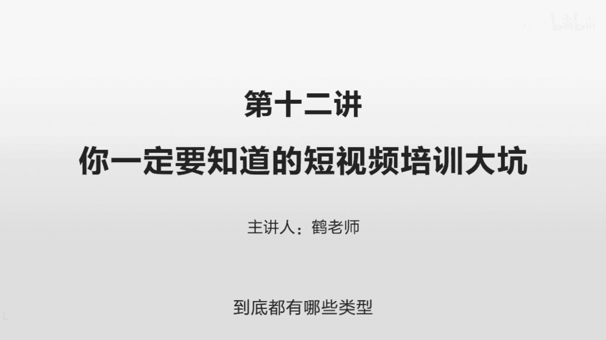
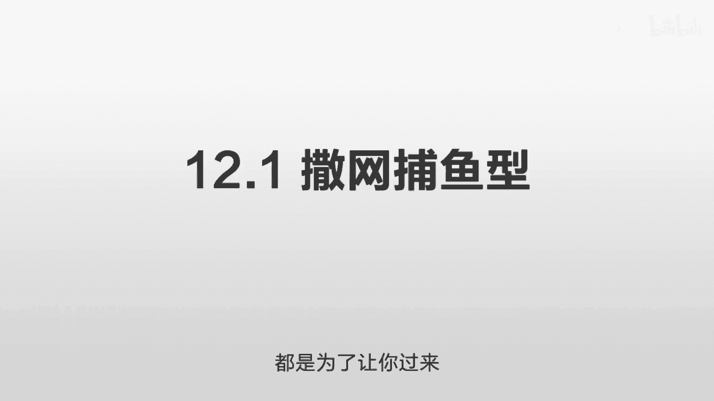
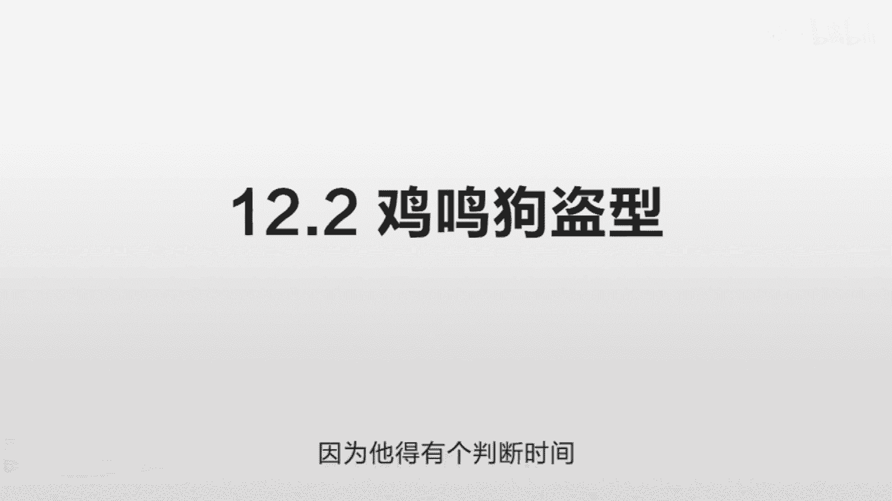
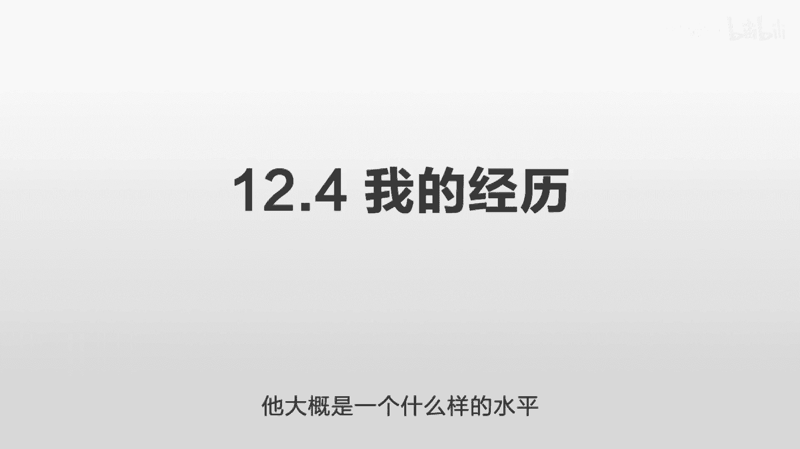
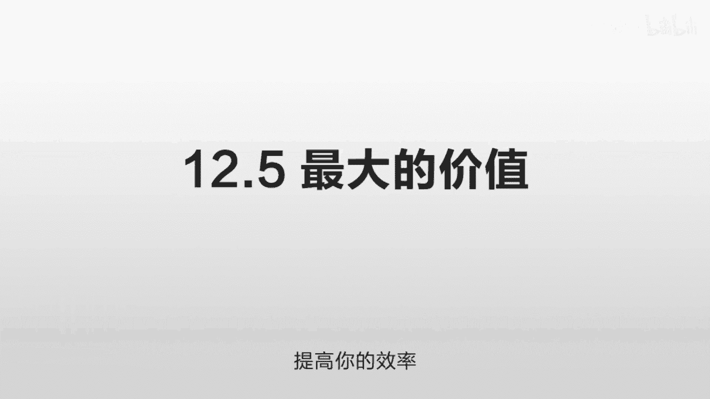

# 抖音运营从0~1全攻略【基础入门篇】B站最良心的最新2024抖音运营起号版全套教程（新媒体运营精华版） - P20：11-第12讲：你一定要知道的短视频培训大坑 - 人生不复制 - BV1yWHKeMEud

好的，我们这一节讲一下你一定要知道的，短视频的培训的大坑，短视频的培训他是有不同的层级的，一个新人，如果你贸然进入这个市场的话，你是不知道大家是什处于什么样的水平，就你可能看起来这个人培训的也不错。

那个人感觉也不错，就良莠不齐，无从分辨，那么我们现在就举几个例子，看一下到底都有哪些类型。

哪一些才是真正有用的，我们先讲第一个撒网捕鱼型，就这个几乎是所有的短视频培训当中，最恶劣的，就是，他是完全为了赚你的培训费而赚你的培训费，他做这个视频的唯一目的就是找到你，他也不希望通过这个去变现。

这个东西完也完全没有办法去变现，但是这个东西来涨粉非常好，它可以用一个非常简单的方式来快速的生成，批量的，比如说几千个几百个这样的内容，然后批量发布到几百个不同的账户，只要有一些账户爆了。

他就在上面留下联系方式，你就可以找到他，尽管这些东西变现非常非常难，但是一个新人他看不到这些东西，他就看这个人哇，一个视频点赞量十几万，几10万，然后有几万的粉，十几万的粉，然后还有一个培训的教程。

手把手教你怎么做，实际这些人看到的都是一个偏差的数据，就是你看到的是这个账户火了，他有可能是做了几十个几百个账户，他可能批量做的完全是机器来生成的，但是对于这个新人来讲，他是不知道这些东西的。

他以为说这个人就专门做了一个这个账户，然后一下就给做火了，实际这些账户的质量非常非常低，然后生成成本也非常非常的低，然后就是靠这种撒网来看哪一个能够爆起来，来找这些算法的漏洞。

你知道这个算法它不可能百分之百精准的，它总有一些漏洞，它总有一些东西给了一些多的流量，那这样的话呢在这些新人看来，就好像是内容特别好，导致他火起来，实际你批量制作内容多到一定程度，一定有一个可以火起来。

记得我之前去观察一个账户的时候，这个人是卖萝卜的，他干嘛呢，他就每天在地里吃萝卜，就拿一个录音机，就拿一个话筒啊，录他那个吃萝卜的那个声音，然后画面是同步的，这样的话你听起来这个声音就非常爽了。

嘎吱嘎吱，那么吃，而这个人呢他发布了几十篇，上百篇，全部都是这种吃萝卜的，但是很有意思啊，你看有的点赞量可能很少，可能几百个，有一些呢可能是一两千诶，偶尔有一个七八十万的点赞，但你仔细看这个东西呢。

和之前的其他几个没有什么区别，它可能是同一个视频，他截取了多一秒或者少一秒，就利用你这个判断的这个误差，也可能是他在两个不同的角度，放了两个不同的手机，然后录下来略有一点点角度的偏差。

但实际是同一个内容，你知道当那个数量级大到一定程度，这个准确率就不可能做到百分之百，那么怎么去钻它的漏洞呢，那你就广撒网吧，总有一些是可以做起来的，这个才是他的根本的原理。

但是很多人就利用这一点去骗一些新人，那么这些新人来了之后，就看到这些，觉得这些东西特别特别好，就想学，还有几个套餐嘛，比如说最低级的可能是有500多的，稍微好一点的，有1000多的，再好一点。

可能有2000多的，这个价格很贵，反正是能捞到一个是一个，那他能给你什么东西呢，哎他告诉你怎么去剪切，那怎么剪切呢，剪映啊，这个剪辑你摸2分钟你可能就会了，他不会教你P2的，P2的，这个学起来的话。

可能也需要几天的时间，如果你要学的比较精的话啊，啊比如我当时还专门加了一个这样的人，他的这个什么入门版是1099，他教怎么做这个短视频，怎么配乐啊，手机的软件剪辑啊，素材大约有320个。

其中有200个是高清的，我高级一点的呢，他会告诉你一个怎么去找这个素材的一个方法，告诉你怎么去直播，怎么去变现，那如果你学了，你很容易就入坑了，因为对他来讲，他的变现方式是通过你，但如果你学了这个。

你通过这个去变现，可能就没有那么容易了，所谓的制作剪辑啊，这些音乐其实都是现成的，就是把这些东西拼起来非常非常简单，这些东西学的几乎是没有用处的，他就是一个广撒网加上幸存者偏差，这个是最恶劣的一个类型。

它就是为了割韭菜而割韭菜，所有的东西都是为了让你过来从你身上赚钱。

那么稍微好一点的是第二个类型，就是鸡鸣狗盗型，就他确实告诉你怎么去做，但他所有的做法呢，都是处于一个鸡鸣狗盗的水平，简单来说就是为了技巧而技巧，所有的东西全部都在技巧的层面，他会告诉你很多很多的技巧。

很多很多的规则，那你学了之后觉得啊懂了好多东西，可是你依然不会做，因为你没有构建成一个体呀，我们举几个简单的例子哈，他会告诉你怎么去养号，他会告诉你首先需要养号，那么你如果一旦跟着他的思路走。

第一步就错了，他如果告诉你养号，你的第一个问题是为什么要养号，你给我讲清楚这个问题，他不讲这个，他上来就告诉你养号，他告诉怎么养呢，啊你要最好是用一个不同的手机，然后单独的去看一些这些东西。

然后让系统觉得你是和这个方面相关的，举个例子啊，你是教声乐的，那么你就专门注册一个账户，就专门看一些声乐的一些博主的东西，那这样的话你看多了之后，他就会觉得你和声乐相关，他甚至还告诉你一些技巧。

如果系统给你推送的不是这个声乐的，你就尽尽快的划过去，然后你可以通过这个博主，再找到一些其他的博主，然后尽量多看这种声乐的东西，每天看多长时间，给你一个时间的要求，时间最好尽量的分散一点。

来模拟一个自然的用户，到底应该是用流量呢，还是应该用WIFI呢，这些细节全部都会告诉你，大概用了，比如说七天或者15天之后啊，你现在就可以发布东西了，发布东西之后呢，你的这个流量就可以慢慢的起来了。

但是我们之前讲过，这个是无稽之谈啊，他没有必要去鉴别你到底是干嘛的，就是你是一个用户身份还是一个发布者的身份，这是两回事儿，你比如说我这个讲财经的，我可能去看其他很多方面的内容都可以，这个是两个行为的。

一个是我的发布行为，一个是我的浏览行为，所以它本质上是归到两个不同的区域里面去的，你发布的话就按照发布的规则，我不停的去给你一些用户池，那么看你的这个数据反馈好不好，这个就是最直接的方式。

那么浏览的话就是另外一个逻辑，就你喜欢看什么，我给你推什么，我是为了取悦你，这是两个事情啊，他们上来就把这个事情给你混为一谈，然后上来就告诉你要养号，然后告诉你一堆的细节，然后1234567。

如你你按照做下去的话，你永远找不到方向的，你全部都是零碎的东西，就是鸡鸣狗盗之术，还有一些比如说他告诉你要回复相关的，比如说你教声乐的，那么你就专门去到一些声乐老师的这些留言，下面去。

你去找一些人去互动，那这样的话系统就会知道你是这个声乐有关的，他可能会给你也带来一些额外的关注，这个也是无稽之谈嘛，刚才我们讲过了，甚至他们还说有几点发布比较好啊，有的时候是上午几点到几点。

有的时候下午几点到几点，其实完全没有用啊，这个东西也是一个体量的问题，我举个简单的例子哈，我们都银行的钱是有限的，对不对，你要是有100个亿，你说你今天取出来这个银行可能没有这么多钱，可能会引起恐慌。

对不对，你可能需要提前预约一下，你要是就取200块钱呢，你是在早上银行开门的时候去取比较好呢，还是中午12点的时候去取比较好呢，还是下午两三点比较好，还是晚上五六点比较好，他都没问题啊。

因为你任何时候去他都有200块钱给你啊，所以你作为一个新人也是一样的呀，你不要去管那个发布时间，其实完全没有区别的，你就那几百的播放量，他什么时候都有量给你的，还有一些人会告诉你破播放，什么叫破播放啊。

之前我们也提过，就把这个视频做的特别特别短，比如说只有三秒钟或者五秒钟，然后里面放一堆的字，然后你在看那个东西的时候，你肯定要看字啊对吧，然后字比较多，你就看不完，然后你就看了第二遍。

第三遍它等于是重复的播放嘛，那这样的话系统就会认为诶你看了很多遍，然后内容比较好，实际这个东西已经越来越无效了，因为你这个东西如果很简单的，能达到一个很大的播放量的效果，那每个人都会用，大家都用。

就等于大家没有用，因为大家都在抢这个流量嘛，另外一方面，这个本质上属于作弊的行为，因为你并没有提供一个高质量的内容，你利用他的一个判断的规则的漏洞，你试图来钻这个漏洞。

那么系统就一定会想到一些反制的做法，如果你大量的全部都是这样的话，有可能会影响你整个账号的，就你是抖音的话，你一定会这么去做的吧，你的目标是建立一个良好的生态，而不是说让这么多人来钻空子是吧。

你可以容忍他偶尔去发一些短的视频，这个没有问题，但如果一个人，比如说他发了几十个，全部都是这种短视频去破播放的话，你就有理由怀疑这是一个作弊的账号，所以如果你要做的长远的话。

不要采用这种非常鸡鸣狗盗的方式，完全没有用，你说它给你带来的那一点点播放量有什么用，没有什么用啊，他就是一个心理安慰，让你觉得又多了一点而已，就我们一定是目的为导向，而不是过程为导向。

就是我这些人到底是要干嘛呢，我怎么去让它变现，怎么让它更好的变现，带来更多的人进入一个良性的循环，而不是一个竖的一个操作，一个很小的一个技巧，做到了一个小技巧就沾沾自喜，这个不是我们要的。

还有一些人他试图去改一些素材，来规避这种搬运的判断，什么意思呢，就抖音是要判断重复的，比如说这个素材如果很多人都用过，怎么办呢，哎你可能会给他，比如说放大一点或缩小一点，或者左右给他扭转一下。

但实际这些东西都是越来越无效的，因为他反作弊一定会越来越强大的，你这个东西，如果你一直沿着这个路线走下去的话，总有一天会挂掉的，就你可以作弊，这个没有问题，我们不是说作弊不好，作弊是一种盈利方式。

你在它的规则之内，找到它规则的漏洞，来实现利益的最大化，这个没有问题，但作弊有一个前提，就是在就是你在最短的时间内实现最大的收入，比如说你抓到他一个空子，可以迅速的达到几10万，几百万，几千万的播放量。

迅速的变现，捞个几10万几百万，你就走，这个没有问题，但如果你想做一个长远的号，长时间的来变现，源源不断的来变现，你可能只有那一个账户，然后你在作弊，这个就非常蠢的行为了。

人家作弊可能是有几百个几千个账号，然后批量化产业化的去运作的，那普通人如果你按这个方式走的话，就可能遇到很大的问题，这就是我们讲的这个鸡鸣狗盗，他就所有的东西都仅限于数字层面，你想怎么养号啊。

你不养号也一样，他就是个幸存者偏差呀，如果你养号七天它起来了，不养号七天它也起来了，因为他得有个判断时间呀。

这个才是本质，我们现在要抓住本质的，这就是我们要讲的第三个就真正有用的是什么，这个真正有用的培训是从体的层面就告诉你，这个整个东西是怎么一回事，我举个例子，就像你玩游戏，你不能上来。

你就去告诉这几个快捷键干嘛的，怎么去打比较快，这一关这一关哪些关键点在哪，这些东西都是鸡毛蒜皮呀，你得知道这个游戏的开发者想干嘛，他的目标客户是谁，他想通过什么样的方式来挣钱，他的竞争对手都有谁。

你把这些利益关系捋清楚了，你才能找到自己的最优解呀，这个做抖音也是一样，就任何时候你不要上来啪就迈出第一步，你但凡你卖出去了，你后面就就只能沿着这个方向走了，你得退回来想一想，就为什么要这么做。

这个东西到底是怎么一回事儿，所以真正的培训就应该是基于体系的级别，他给你讲清楚，这个抖音的逻辑到底是怎么一回事儿，你们之间是一个什么样的关系，如何来达到一个更好的互动。

如何让你在这个生态链当中占到便仁义，如何给对方提供价值，达到一个更长远的良性循环，这个才是关键呀，其实抖音官方也会有一些这样的培训，但是这种培训有点过于官方了，就是他会告诉你去提供一些好的内容。

但是他没有讲清楚这个背后的逻辑，他是希望你能够提供一些优质的东西的，这样的话双方可以良性循环，但是你如果只看那些官方的说明的话，就会进入一个很困惑的一个状态，你不知道什么叫优质。

你不知道这个真正的点在哪，而很多的培训其实抖音并不欢迎你，就很多做这种抖音培训，他自己的粉丝量并不多，有很多技巧，抖音是不希望他能够宣传开的，或者说这种技巧会导致一个质量的下降，所以说他欢迎什么东西。

他欢迎内容啊，就是你把这个内容做的特别精彩，大家特别喜欢更多的是关注最本质的东西，而不是关注这些边边角角的细节，所有的这些细节规则都是为内容来服务的，他之所以定做这些东西。

就是为了让你产出好的东西，同时避免作弊呀，那接下来我们讲第四个就是我自己的经历，那么我当时做的时候呢是完全没有经验的，就我也不知道什么样的培训好，我也不知道什么样的培训不好，那我自己就参加了一些。

就包括那种第一个类型撒网捕鱼型，第二个什么鸡鸣狗盗型，我都参加过，我就先加他，然后看你要给我什么东西，你能给我提供什么样的服务，那我发现第一个我就直接pass掉了，完全没有用，一看就是割韭菜。

那么第二个类型的我也加了他们的群啊，但是我在群里面从来没有说话，他们都是干嘛呢，他们都是哎，我今天又又做了一个什么直播，大家相互点一下呀，啊为什么这个直播间又出问题了呀，啊你一场音浪多少钱啊。

那全部是一些这种闲聊的，特别特别琐碎的一些东西，整体看起来完全没有那种内容感，就没有干货，完全是闲聊这种东西完全没有意义的，所以我也没有做，那除了这个，我还加了一些我自己感觉相对靠谱一点的。

他虽然没有从这个体的层面，但是他从一个非常严谨的科学的角度啊，去看这个做法有没有用，那个做法有没有用诶，我发现他的很多想法和我的一样，那我认为他的做法是比较科学的，比如说有人会讲啊，这个养号是没有用的。

他并没有讲这个逻辑，但是他讲了一些他的观察，讲了一些对比，那我认为这是一个比较科学的方式，而这样的培训我也加了一些，那么加的目的是什么呢，就是验证我自己的想法，就很多时候你看到这些教程并不一定有用。

就你自己摸索出来的才最有用，你在任何一个行业都有无穷无尽的信息，你怎么去判断这个信息的真伪，这个成本特别特别高，所以你必须得先从体系的层面了解是怎么回事，哪怕你没有做过这个。

你也可以倒推出来一个7788，那剩下的20%是你不确定的细节，这个时候你就需要跟行业一些有经验的人，来相互沟通，互补一些信息来验证你的判断，看看哪些地方有没有偏差，这个就是我当时参加的一些培训的目的。

甚至他讲完课之后，我都还没有去听过，因为我担心会不会产生一些误导，所以我就自己先摸索，实在实在不会，我找不出来答案了，那我再去听这些东西，我再去找这些我需要的哎，我当时采用了这么一个方式。

至于那些培训呢，我当时的想法是用钱来换时间，就我不知道你是真是假，我也不知道你的水平怎么样啊，几百块钱，1000块钱我就先加你呗，我看你到底给我提供什么东西，你看他给你提供的东西。

你就知道他大概是一个什么样的水平。

这个就是我自己的经历，那么现在我们讲第五点，短视频培训，它最大的价值是什么，也就这个短视频培训它真正有用的地方在哪，在于信息这个逻辑，就像我之前讲到的东西，你去研究任何一个行业。

你首先得明白这个行业的一些架构，倒推出来一个7788，但是这个不能保证你一定能做成功，你只是原理上没问题，但是细节上可能会有偏差，这个时候怎么去验证这些东西，你就需要找到这个行业里面非常靠谱的一些人。

或者你能找到的最靠谱的一些人，他们有一些经验，他们有更多的数据，他们有更多的案例来做支撑，那么你拿不准的东西和这些案例，和这些数据拿出来对比一下，它可以给你提供一个很有帮助的辅助参考。

这个本身是一个非常有价值的信息，因为你获取这些信息需要大量的时间，需要大量的精力，而如果你加入一个这样的群，加入一个这样的培训，里面是一些相对有价值的信息，它对你的整个摸索体系是一个锦上添花的作用。

一边自己思考，一边拿到行业的数据来反复对比，那这些实用性的技巧呢，包括这个标题怎么起比较好，话题应该怎么选比较好，怎么去找到一些相关的热点，那行业里面有哪些不可以碰的红线，有哪一些是不可以碰。

但他又没有说的地方，这个东西如果你要自己去摸索的话，你碰壁了可能就非常的麻烦，而参加一些这样的培训，互通有无，那是一个相对更好的方案，好我们总结一下，一共讲了五点，就是这个培训行业的一些情况。

第一个就是撒网捕鱼型，就是他是为了割韭菜而割韭菜，那所有东西都是批量化操作的，这种东西毫无价值，你拿到之后也没有办法变现，第二个是好一点的鸡鸣狗盗型，他会告诉你一些小的技巧，但都是特别特别琐碎的东西。

看上去有一些实用价值，实际上完全没有实战意义，第三个我们讲到真正有用的是体的级别，就是你一定要明白这个整个游戏的逻辑关系，明白你和对方之间的关系，明白怎么来实现一个共赢，明白他的一个判断机制。

明白你怎么产出好的东西，明白他怎么判断好的东西，这些东西明白了之后，你有了一个7788，这个才是重要的部分，那第四个我讲了我自己的经历，就是我自己是拿钱换时间，各种各样的培训都参加了一些。

最后我自己发现就是我自己摸索的，这个效率是比较高的，因为它符合这个体的思维，第五个就是短视频培训最大的价值是什么呢，它可以给你提供一个信息，一个有价值的信息作为一个辅助参考，你在摸索的时候有些拿不准的。

可以拿这些东西来印证，还有一些比如独家的消息，还有一些灰色地带的东西，还有哪些东西尽量不要碰，这些东西可以减少你摸索的成本，提高你的效率。

