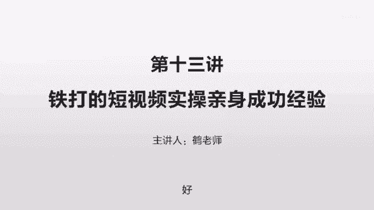
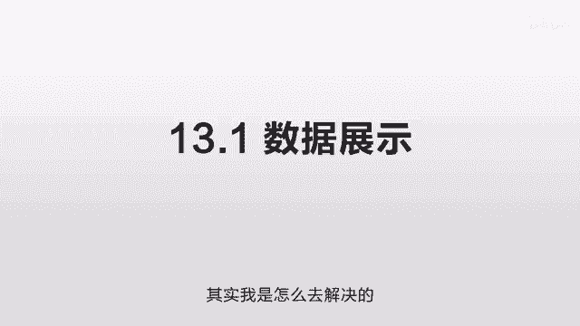

# 抖音运营从0~1全攻略【基础入门篇】B站最良心的最新2024抖音运营起号版全套教程（新媒体运营精华版） - P21：12-第13讲：铁打的短视频实操亲身成功经验 - 人生不复制 - BV1yWHKeMEud

好，这一节我们讲一下这个短视频实操的一些经验，第一个我们先看一下这个数据展示，我说下我自己的，那么做到现在为止，我的抖音大概是380万粉，快手的话是85万，小红书的话40多万，知乎的话是十多万。

这个成绩我自己还是比较满意的，毕竟我之前没有做过这个东西，完全是靠自己摸索一个体，然后慢慢的去找到这个思路应该是怎么样子的，所以最开始的时候走了一个比较大的弯路，浪费了一些时间。

另外呢就是我在中途会研究一些变现的东西啊，有很多的时间花到了这个教程，还有线下的一些变现渠道方面，那么线下的更新可能就慢了一些，这个也会受到一些影响，但总体来讲我对这个结果还是很满意的。

那下面我们就会讲一下，我在操作当中遇到的一些问题，以及我是怎么去解决的。

那么现在我们讲第二个就是内容获取，就之前我们讲过，你做抖音的话，你这个长时间稳定的输出非常非常重要，那这样的话你就需要一个内容源，一个大量的内容源，我自己来做一个经济学的话，我之前就看了很多经济学的书。

我有一些积累，但这个东西我觉得它不太够，因为你如果去写一些东西出来的话，这个没问题，但如果你说每天去写一些东西出来，这个的话可能就会有一些压力，每天会找到一些不同的点呀，找到一些不同的灵感啊。

你可能会遇到有时候没有思路的情况，所以这个时候呢，我是把网上所有的经济学的书全部都卖了，就几乎是所有的经济学的书全部都买了，包括一些金融学，宏观经济学，微观经济学，还有一些什么通俗经济学，全部都买了。

那这样的话我没事去翻一下啊，说不定在什么地方就可以给我一个足够的灵感，我自己也参加了很多这种付费的小密圈，付费的这些微博问答，付费的这些微博社群，各种能参加的社群，我这边都参加了。

尽量是在最大的程度去获取这个信息源，别人没有做到的话，你尽量去做到，你可以在这个维度尽量超过它，这个就是我当时的想法，然后我就这么做，内容源确定了之后，长期输出没有问题之后，那你需要测试这个内容的好坏。

那我当时采用了个AB测试的一个方式，就是我们之前讲到过的，那我采用了三部分，一部分是我完全抄，就把我这一段完完全全一个字不差的，我给抄过来看一下，就我觉得这一段写的特别好，我就给你读出来看一下怎么样。

另外一部分就是改写，就是我抄一部分自己改，一部分拼合成一个四不像的东西，还有一部分就是完全自己写，因为在当时我做的时候，我并不知道用户会喜欢什么样子，我也不知道我这么讲的到底好不好。

我也不知道我写的好不好，就完所有东西全部都是零，你只知道用户喜欢高质量，但什么才是高质量，你很难去确定的话，所以我当时想到的方式就是AB测试，我就每个内容都弄一点，我看看你大家到底喜欢什么样子。

我大概摸索出了一个方向之后，我再把这个渠道尽量把它做到极致，我自己测试的结果呢，就是这三个没有区别或者几乎没有区别，我自己没有看出来有什么明显的差别，因为我很担心说我自己写的写不好，大家不喜欢。

那么先找一些大家特别喜欢的这些文章，或者这一个这一段大家点赞量特别特别高，然后直接读出来看一下效果怎么样，然后自己写一段呢，发现诶好像和那个也差不多，那说明好像没有太大的问题，后期如果你要发展长远的话。

你绝大部分都需要自己写。

就定下了一个最终的发展方向，那么接下来呢我们讲一个拍摄的细节，当时要用什么器材比较好，我自己也是比较头疼，因为我业余时间我是玩一些摄影的，但是我只是拍照片，没有录这个视频，我家里有很多这种相机。

这个相机呢是可以拍视频的，那么到底应该用什么样的相机，配什么样的镜头，怎么去打光，这些我是完全没有经验的，那么我在做的时候就采用了一个原则，就是尽量用最好的，是不是那个底的话，如果我能用大的。

我尽量不用小的那个镜头的话，如果我能用更好一点的，光圈更大一点的，我尽量不用那个光圈更小的，比如那相机的话，我有那个索尼的奶昔，我也有佳能的全画幅，我也有富士的中画幅。

然后甚至还有专门拍视频的BMPCC，那最终呢我就选了一个最贵的，觉得这个底最大价格最贵，拍出来应该不会差，你用这个佳能的全画幅，或者说用那个索尼的奶昔，大家可能都有这样的器材。

但那个复式的这个器材大家比较少，那么用了是不是尽量和别人不一样呢，富士的这个画幅非常的大，这画质非常非常棒，拍照片非常非常清晰，非常非常细节，非常非常丰富，那么他拍视频的话也应该不会差到哪。

我再给他配一个好一点的镜头，那我觉得应该会比那些奶昔，会比那些全画幅要好一些，尽管这种差距有可能并不是肉眼可见的，甚至你传到那个抖音上面，你完全看不出来差别了，但是既然我有这个东西，那我干嘛不用它拍呢。

这个是我当时的策略，拍了之后呢，我想找到一个能够震惊别人的方式，那就是你现在看到的，我所有的东西完全是一个模式的，那么就把这个位置给记录下来，这个光线给记录下来，光笔给记录下来。

这样的话每次拍出来几乎都是一个模子的，这齐刷刷的就会给人一个非常震撼的感觉，这颜色方面呢我也是反复的微调，就找到一个抖音上尽量不一样的一些色调，我当时在pr里面找了很多这种色调。

一点点的调就花了很多很多时间，比如说这几天我完全不干别的事，我就来调这个色调，然后全部调好之后呢，我尝试着把它传到这个抖音的后台，但是设置为只有自己可见，或者只有好友可见，我再拿另外一个手机加我的好友。

我看看另外一个手机，看我这个账号是个什么样的感觉啊，怎么样的排版整齐，这个反复调了很长时间，那包括这个文字应该放在哪，这个也是调了很长时间，当时有几个想法，一个是放到顶部，那是因为背景是白色的。

我放到顶部的话会有点奇怪，所以我就会给放到中下部，那放到中下部哪个地方比较好呢，抖音是这么一个情况，就是他那个介绍啊，是在下方的，那你如果太靠上的话，他可能会挡住你的脸，那个位置感觉很奇怪。

把人给切割开了，那你如果又太往下的话，就会有个问题，你会跟那个字给重叠起来，那个体验就特别特别不好，但是不同的手机呢，它这个遮挡的范围不一样，所以我当时就拿了很多很多手机测试，这个测试的。

包括我到底是应该往上一点还是往下一点，哪个比较好，那么一排到底几个字比较好啊，左右两边都不会挡住，观感非常好，反复的调了很多次，一遍一遍的对比，那么最终在pr里面确定这个字体大小，应该用多少。

上下左右的位置应该是多少，这些东西都是反复的确定之后才定下来，那还有一个细节呢，就是我的文字是购买的，我买的那个造字工房的这个字体，因为当时一个是考虑到文字侵权的问题，你知道现在很多的文字是收费的。

就是它可以不找你的事情，但是万一他要找你的话，你是要给钱的，你你是要吃官司的，而且我看大家都用这样的字体，而且这种字体可能没有特别漂亮，没有脱颖而出，那我想能不能找到一个更好看的字体呢。

我找了这个造字工房啊，他们的这个字体好像一年是几千块钱吧，我就给买了，而且我这个字体的好处在于哪呢，就它是一个非常狭长的一个字体，字体非常的紧凑，这样的话一排的话就可以容纳更多的字。

我后期来做对pr的话，就不需要说反复的把这个文章切成很碎，很碎的段子，就是它可以保证一个基本的一个展示的信息量。

不至于太少，第四个就是我们经常遇到的一个问题，内容悖论，这个问题非常非常关键，就经常有人讲，你要提供优质的内容，优质的内容，但问题是你一个新人，你怎么知道他是优质的内容呢，你找任何一个人。

他都没有办法代替抖音来说，这个是优质的内，因为他是靠机器去判断的，他要是能判断出来的话，他就是大牛了，他就是顶尖的大牛了，那你周围要有这样的人的话，你就早做起来了，正是因为你自己也不知道。

到底什么样的才是优质的内容，你周围也没有这样的人，你才陷入这么一个悖论呢，你怎么知道你的东西是好的呢，我们经常说你这个东西没有火，是因为你太自嗨了啊，你自己觉得很好，但用户觉得不好。

这个就是一个非常现实的问题，你怎么知道这个东西到底是你自己觉得好，还是说它真正好，在你没有判断方式的情况之下，你怎么去验证它，在当时我写了一段文字，我现在可以给大家读一下，我当时是怎么思考这个问题的。

那么解决方案呢是两个，比如说我这个财经领域为例，第一个是我找出这个同行播放量最高的内容，你播放量高，你肯定又好啊，这个是确定的对吧好，我们之前讲过同样的文字内容，你通过不同的表达方式出来。

它就是两个不同的东西，同一段文字你找两个不同的人去读它，结果就不一样，这个办法呢就是你用更好的拍摄，更好的光线效果，更好的摄影效果，更好的音质来去重构这样的内容，简单来说就是你把它重新读一遍。

但是你各个环节都比它好，这样的话你的内容就一定是高质量的，这个文字方面肯定是没有问题的，你所需要的就是时间，等一等时间看他是不是会爆发，第二个方式，就是你可以尝试分发到不同的视频网站，因为同一个网站。

比如说抖音的话，你是一个新人，他可能会有一定的误差，但是你如果是多个不同的视频网站，他们的推送机制是不一样的，虽然也是好的东西去分给不同的人，但是不同的网站他们对好的定义是不一样的。

它的算法只要有一点点差异，这个结果就会有一些差别，那么你就可以通过这样的方式去找到一个，和他算法很接近的一些平台，然后你尝试在不同的平台去发布，来看看不同平台有什么样的反馈，这样的话你就可以得到一个。

相对更靠谱的一个回馈，而不是自己在那瞎猜，因为它背后的原理呢是好的，内容应该是相通的，只是说在99分和99。9分之间，大家的这个选择可能不太一样，但是在99分和79分之间。

这个大家就不会有什么数量级的误差，比如说你这个东西，在小红书的播放量非常非常好，但抖音的播放非常非常差，那你其实就不用担心呃，可能就是他们的算法不一样，小红书可能就是你过来之后，我就给你一些流量。

它不会那种暴涨暴跌，但是不温不火的一个状态，哎你看你这个持续在涨粉，持续在增加点赞，那说明就没有什么大问题，大家的评论也非常好，那更没有什么问题了，那么在抖音上你可能只需要时间，生活中也是一样嘛。

比如说你想知道这两个女孩哪个更漂亮，一个90分，一个60分，那你去找任何一个人去评价，都觉得那个90分的漂亮，这个是毫无疑问的，这个就是我们现在采用的这个验证机制，但你要说这个女孩一个是99分啊。

一个是98分，你说这两个哪个好看，那不同人的结果都不一样，也就是说60分和90分的这个差距，属于数量级的差距，99分和98分的差距，他们不属于数量级的差距，那我们要做的就是看看。

到底会不会有数量级的差距，如果这个没有问题的话，那就可以持续做，很放心了，所以我当时是把它上传到了小红书，还有上传到了一些其他的平台，我看其他平台数据都还不错，我觉得应该没有什么大问题。

尽管抖音一直没有播放量，有可能是有几几十个，几百个，没有超过500的，那到后来的话，我再反推一个算法，我知道他最开始的话会给你一个很低，很低的播放量，他可能系统就设置为500，对于你的权重没有突破。

他还不敢贸然给你很多东西，免得产生浪费，所以一直都是五百五百五百的哎，当他发现这个数据逐渐好一点了之后，哎他也就开始逐渐加量了，那么经过后来的观察，确实是这么一回事，这就是第四个内容悖论的问题。

我们已经很好的解决了，就你遇到问题的话，你也可以这么去做多个渠道来验证，或者找一个模板去参照。

第五个我们讲一下迭代更新，就我之前讲过，就是说我自己在最开始摸索的时候，花了很多的时间，也绕了一些弯路，这个弯路是什么呢，就是我看到很多短视频的网站告诉我，你最开始的话不要去讲太长的东西。

讲太长了可能会有问题，因为完播率可能会有问题，就是说用户没有看完他就走了，这样的话系统可能认为你的质量不够高哦，最开始那几个月，我一直是按照这个方式去做的，所有的东西都压缩到了一分钟之内。

半分钟到一分钟之间，那播放量呢可能是30万，40万，十几万，20万，大概是这样的，偶尔有一些爆的，可能是400万，500万，大概是这么一个情况，这个情况一直持续到了，我大概有七八十万粉的时候。

因为我发现这个涨粉的速度非常非常慢，那么我就去观察了一些爆款的视频，就是一个视频可能有上百万点赞的那种，100万200万点赞的，也是那种口播类型的，那我就看诶，为什么这样的一些视频会有这么多的点赞呢。

那我仔细研究它背后的一些东西，我发现它的核心在于断其一指什么意思呢，你要么就把这个东西给他说透，说的特别特别透，同样讲这个东西，你讲的比别人更透，他得到的在其他地方得不到的东西。

那这样讲透的话就需要时间来做保证啊，就你确保你一分钟没问题之后啊，你一分钟的这个东西可以做到，比如说呃20万30万的这个播放量，说明你在这个掌控方面已经没有什么大问题了。

这个时候你可以尝试往更长的时间去走一点，它背后是两个原因，第一个是如果大家都做一分钟的，那么你做稍微长一点的，你在这个讲透的方面可能就比他要更好，这是一个差异化，另外一个方面就是反推这个规则。

他一定会给这个长视频一个不同的权重，什么意思呢，比如说你这个视频一个一分钟的，一个2分钟的两个都是看到一半划走，这个权重是不一样的，因为你视频越长，你留住用户就越难，所以当你这个视频更长的时候。

哪怕你的流失率相对来讲高一点，但他也会给你一个更高的权重，你来保证你的这个高质量，就是你这个视频长了之后，哪怕你的这个完播率稍微差了一点，但你这个两个是不同级别的呀，你应该说2分钟跟2分钟去对比。

而这个时间越来越长的时候，它这个完播率必然就会越来越低，所以你只需要做到，比2分钟的完播率高一点就行，你不需要去和那个一分钟去比，不需要去和那个半分钟去比，这个核心在于你不要紧盯着这个完播率。

完播率一定要到多少，这个不重要，同一级别的完播率要到多少，这个才重要，你比如说一个视频10分钟或者5分钟，他可能比那个十几秒的那个完播率，可能是只有他10%，但实际上它的播放量可能要比他多很多。

因为大家对这个时长的容忍度是不一样的，他到了一定程度之后，哪怕他的完播率降低了很多，但这个用户能在这么长的时间内能看到这么多，说明它的价值很大，所以你是平台的话，你也会设置这么一个规则。

你30秒的完播率，一分钟的完播率，2分钟的完播率肯定是不一样的，都是把分之30，那么2分钟的那个一定是获得多得多的流量，因为它能够让用户把这2分钟的给看完，说明它的质量远比那个半分钟一分钟要好很多。

而且2分钟可以说透一个东西，这个就是我采用的2。0的写作版本，所以你会发现我的东西在写到一定程度之后，我的时间是加长的，你看那个时间一分钟一分钟之后哎，到某一个节点突然就开始涨了2分钟，3分钟。

因为我这个经济学和别的地方不一样，它不是一个搞笑的，或者说一个什么样的段子，或者说拍一个什么样的小的视频，他需要把一个东西给说透的，有的时候呢你一分钟半分钟你说不透的，你说的一知半解等于伤其食指。

没有断其一指，大家听着好像意犹未尽，说透了吧，好像又不痛，所以在那个2。0的血多版本里面，我花了更长的时间写的更加的系统，尽量把这个点给写透，把一个问题给说明清楚，诶，我发现。

我尽管花了更多的时间来写这个2。0的版本，但它效果远远比我之前的那个，1。0的版本要好，那比如说那个牛奶可乐经济学，就是那个2。0的版本的写作，结果那个视频大概有两分多钟。

就先讲为什么这个牛奶要放在方盒里面，为什么可乐放到原瓶里面，我先讲了一下书上的一些错误的例子，然后分析一下这个例子为什么不合理，然后再讲的真正合理的应该是什么，一个环节一个环节的展开。

把这个事情缓缓的讲清楚啊，但那个播放就非常非常好，因为你讲透了网上没有这么讲的，这个就是迭代更新，你到了一定程度之后，哎，你看一下在你原来的这个基础之上，哎，有没有可能把这个时间加长一倍。

把这东西给说透，各种方式都尝试一下，如果你掌控一分钟的东西完全没有问题之后，你可以试着拉长这个时间，有可能会给你带来意想不到的结果，而且就我自己的观察而言，抖音这些平台也越来越倾向于这个长视频。

你看他那个时间限制吗，最开始可能是15秒嘛，到后来可能是30秒一分钟，到现在你一个信任的话，你可以直接发布长视频，在最开始的时候呢，大家的制作水平都有限，也不知道这个平台怎么玩的。

他为了避免出现太多垃圾的东西，太占用他的空间，尽量的通过控制这个时间来提升这个质量，他把这个时间限制的很短啊，可能就是一个15秒的一个东西，但是大家都熟悉了这个十多秒的这个短视频了，之后啊。

这个时候就会有一种厌倦感，老是重复的东西，老是这一个类型，那么时间的话就可以加长一点，来容纳更多的类型，更多的题材，那么目前能看到的一个趋势，就是，他现在已经开始向更多的知识博主来开放权限。

这个东西可以讲的越来越长，以前只能看到一些对口型的啊，跳跳舞的，说一些这种俏皮话的，那现在你可以看到越来越多的知识分享型的，那这些东西都需要时间做保证的，你对这个时间的长短掌控做好了之后。

尽量的尝试一些长长时间的视频，就是你可以尽量的在现有的这个模式的，基础之上把它升级一下，包括时间的升级啊，包括其他的维度的升级，尽量摸索一些不同的领域，看看哪些东西别人没有做，你能不能把它做了。

能不能先抢到这个红利。

第六个我们讲一下，就是一些不可预料的问题，这个是我自己遇到的，我当时用了一个测试账户来测试，这个片段和排版，刚才讲过嘛，但是我测试的时候呢，它是通过电脑发布的，每一次都可以成功，只是我当时发布的时候。

选择的这个隐私和好友可见，但是在我正式发之后，发现了一个问题，只要电脑端一发布，立刻就提示不适合公开或者未通过，这个就特别有意思啊，我只要一点立刻就不适合公开或者未通过诶，我也没有什么违规的东西呢。

你测试的时候完全没有这种问题，因为你没有选择公开啊，一旦公开了之后，马上就提示不合适，这怎么回事啊，这个时候就需要你自己去反推规则呀，首先你自己的内容有没有违规的，内容长了或许是有违规的。

但是你如果刻意的做一个短视频呢，或者这段话里面完完全全没有任何违规的呢，比如说大家好，我是某某某，很高兴认识大家，就这么一句话，有问题吗，没问题，这个如果发上去还是提示，不通过或者不适宜公开。

那一定是别的地方出问题，你需要一步一步推，那当时我还发现一个时间点，就是他在很短的时间内，就是一秒钟之内马上就判断出来你不合适公开，那这个就有意思了，你如果是传到你的数据库。

然后再比如说几亿个里面去判断一下，我这个是不是重复的，或者是不是有问题的，你去识别一下我的内容，你都需要时间的呀，你可能需要十几秒或者半分钟，你怎么也不可能在一秒钟之内判断出来。

一秒钟之内判断出来你的东西不适合，只有一个可能他可能认为你在作弊，他压根就不看你是什么东西，那为什么会导致这个问题呢，我当时的猜测是不是一个电脑登录了两个账户，导致了这个不可知的情况。

以至于他在反作弊的时候把你给误伤了，这一个电脑的，也可以是同一个WIFI或者同一个网，反正就是你在一个范围之内，出现了两个不一样的东西，他有点怀疑这两个东西是不是在作弊，那最后我自己的测试结果呢。

就我换了个电脑，换了个电脑还是不行，诶那就奇怪了，那哪个地方有问题呢，哎我就换了一个网络，一个是用WIFI上网，另外一个呢我改为一个手机的热点上网，哎我发现只要改为这个手机热点，马上就可以发布成功。

那最后就定位到这个问题出在哪了，就你遇到这种预知的问题，你要一步一步一步一个环节一个环节去找，没有人会告诉你哪个环节出问题，你打电话去问他，客服，他也说啊，可能会出现一些不适宜的东西。

你说你能不能帮我排查一下，人家几个亿的用户怎么帮你排查呀，你只能自己去找这个问题到底出在哪，那么那个找的话就是我们刚才讲到用体的角度，就说你从他的角度去判断，从你的角度去判断一个一个排除。

最终找到一个有可能的问题点，然后把它解决掉，一个很重要的方式呢，就是你反复测试，反复对比，你就像这个例子里面到底适不适宜公开，那么就找一个绝对没有问题的，发布之后还是不适宜公开，那就有问题了。

对比一下时间，一秒钟之内就提示不适宜公开，那一定是某个地方导致了他的误判，那哪个地方导致误判呢，我也没有作弊呀，哎网上搜一下不适宜公开可能有哪些，那就会想到会不会是同一个电脑，你登录了两个账户啊。

哎测试了一下也没有这个问题，那后来发现是不是同一个WIFI登录了两个账户啊，哎发现确实是这样的，但这个东西不代表你会遇到哈，只是我遇到了一个他的一个小bug而已，那可能现在已经完全不存在这种问题了。

但是思路的话是可以借鉴一下，如果你遇到任何这种你从来解释不了的，这样的问题，你问别人，别人也没有遇到过，这个时候你可能要一步一步的，通过这个逻辑的层面去排查，因为在你做的时候。

其实每个人的情况都是不一样的，千差万别的，没有人可以给你一个标准答案，这个时候你自己独立排查能力就至关重要，这个就是第六个不可预料的问题，怎么解决好，我们总结一下这个一共讲了六点。

第一个就是我自己的这个数据展示啊，这个就不提了，第二点我们讲的这个内容的选取，内容的选取呢有两个部分，一个是内容源的长期获得，就买一些书啊，市面上的书全部都买齐，参加一些付费的社群呀。

参加一些付费的圈子啊，这样啊别人没有做到的，你全部都做到，别人做到的话，你把它做到极致，另外一个就是做AB测试，在最开始做的时候，你是个新人，你完全不知道你到底做的好不好，用户喜不喜欢。

那就ABC3个内容同时发布，你看一下有没有差别，然后再选择一个你长期定下来的方案，第三个我讲到一些拍摄的细节，就我自己选什么样的器材，我几乎所有的器材都试了一遍，然后我看一下哪个拍摄效果好。

然后最终定下来一个，我利用我自己最好的器材，现有当中最好的器材拿这个东西来拍，那么在发布之前呢，我希望达到一个震惊别人的一个效果，每一个拍摄几乎都是一个模子，看起来像复制粘贴一样，为了达到这个效果。

我对这个位置反复进行了微调记录，从我到这个相机的位置，相机的高度有光线的比例，光线的角度，各个参数全部都记录下来，然后保证一致性，然后为了让那个颜色和这些抖音上，其他的博主也都不一样了。

我自己反复来调这个色调也是调了很久，然后为了使这个文字处于一个比较好的状态，不能太靠上，也不能太靠下，不能太左，也不能太靠右啊，又不能出现遮挡，还能有很好的一个观感，也是反复的测试，测试了之后。

然后上传到你那个测试账户，拿另外一个好友的手机去看，从从别人的角度来看，你这个到底排版的好不好，能不能达到那个效果，最终没有问题之后我才正式发布的啊，第四个就是内容悖论，就很多人经常遇到的一个问题。

尤其是新人，就你一定要做用户喜欢的东西，问题是你这个新人你怎么知道用户喜不喜欢呢，说吧你做的东西万一说是你自己自嗨呢，那你怎么知道他到底是自嗨还是用户真正喜欢，还是因为时间没到，没判断出来。

这个最开始的时候是非常非常现实的一个问题，我们讲了两个解决办法，一个就是你直接抄，你就把那个你的行业点赞量比较高的，你给抄过来，你自己以更精良的制作再把它输出一遍，肯定就没问题，他一定是高质量的。

如果这个时候他还不火，他有可能就是算法的问题，等时间嘛对吧，另外一个呢，就是你把它发布到各个不同的平台上，你看下各个不同的平台有没有一些大的差异，如果有的平台很好，有的平台非常非常差。

那很可能有时间的问题，因为优质的东西大家其实都可以识别出来，第五个我们讲到了迭代更新，就是你可以一步一步来，最开始呢，先在你可控的时间之内把这个东西做好，好到一定程度之后，你可以尝试在实践方面突破。

或在其他方面突破，好到一定程度之后，你可以尝试一下2。0的一个版本，就比如说把这个时间给弄得更长一点，把这东西给写的更透一点，更清晰一些，就别人没有做到的，你能不能把它做到，并且做得更好。

别人没有讲透的，你把它讲的更透彻，让用户更理解，让他恍然大悟，这些东西对我来讲非常的实用，比如说我那个2。0的那个牛奶的那个，就一下就涨了100万的粉，这一个视频顶我之前几个月的工作量。

后来又持续爆了很多视频，所以那一段涨粉非常非常快，就是因为引用了这个2。0的写作办法，用更长的时间把一个东西给写透，给用户带来，他在其他的博主那边得不到的一些东西。

第六个我们就讲了一些不可预料问题的处理，就我讲了我自己这个误判的例子，你那么你自己在操作过程当中，一定也可能会遇到这种类似的情况，你网上找不到现有的答案，你找的别人呢，他也不知道你到底什么地方出问题了。

那你需要自己从这个逻辑的层面，尽量去把它分析清楚，这就是我们之前讲的题，为什么这么重要，也没有人会给你这个适宜的标准答案，当你反推了这个逻辑之后，你知道这个东西到底怎么一回事之后，那你去反推他。

然后一点点的排除，就很容易找到真正的结果。

