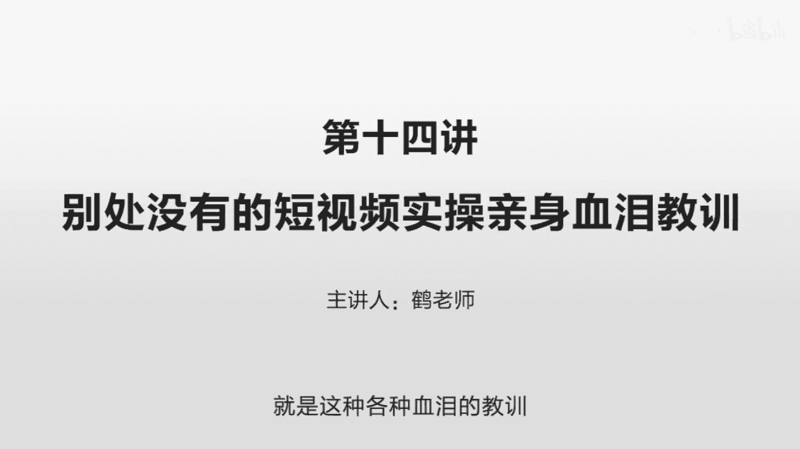
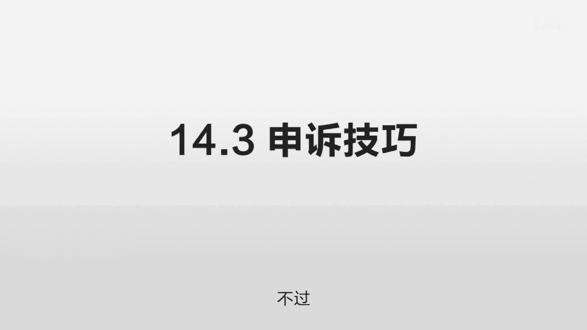
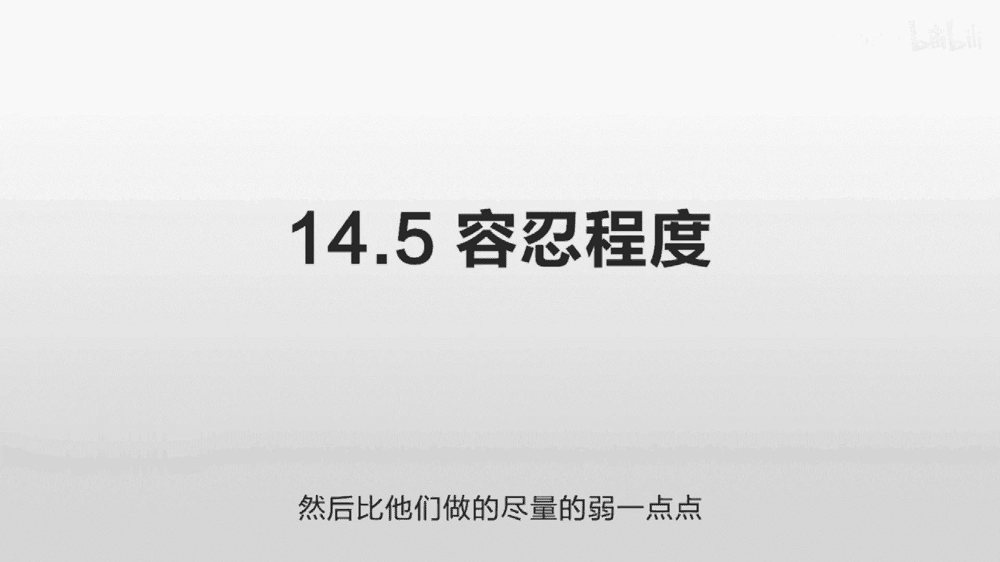
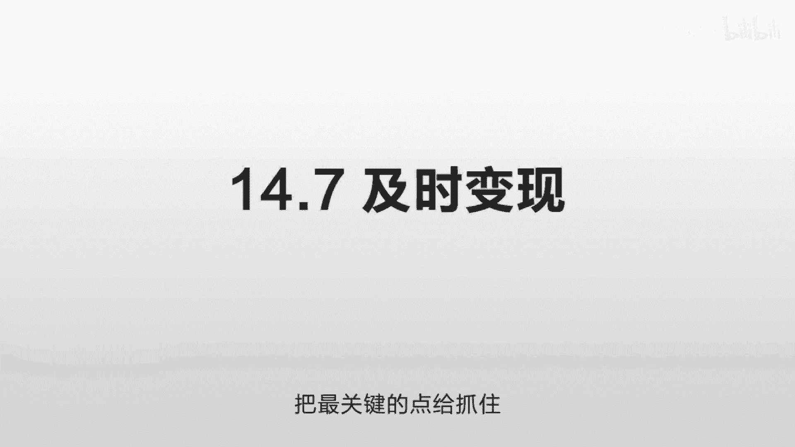

# 抖音运营从0~1全攻略【基础入门篇】B站最良心的最新2024抖音运营起号版全套教程（新媒体运营精华版） - P22：13-第14讲：别处没有的短视频实操 亲身血泪教训 - 人生不复制 - BV1yWHKeMEud

啊这一节我们讲一下，就是短视频实操的一些亲身的经历，就是这种各种血泪的教训。

第一个我们讲侵权问题，就你知道这个世界上是有一个职业，叫版权流氓的，什么意思呢，就一个法律，他在制定的时候就一定留下的有空隙，任何能钻空隙的人就可以获得巨大的利益，我们知道这个保护版权是一个法律的规定。

但是同时也诞生了另外一部分钻那个空子的人，就是我专门把一些东西放到网上，让你去下载，然后你用了之后，我发现你在用我的了，那么就可以起诉你，我这些东西在网上标好价格的哟，比如之前闹得沸沸扬扬的视觉中国。

那除此之外还有很多这种小的公司，他们小到甚至你根本不知道他们的名字，他们会把他们的照片给放到网上，你知道一个正规的，如果你在乎你的版权的话，他会在放出来这些公开的资源上打断他的水印。

你像国外的有很多网站，它就会上面打上这个网站的水印，告诉你这个是我们收费的图片，你不可以随便用的，我们放出来的是一个很小的图片，而且上面有我们的水印，很明确的告诉你，但是也有一些公司他故意不这么告诉你。

他就给他放到网上去啊，你下载了之后呢，就会专门有这样的机构来找到你，看谁用了他的照片，所以用了他的这个视频这样的东西，那让他来起诉你，说我这个东西原本是要多少钱的，这个东西甚至会形成一个商业的模式。

国内有些投资人还批评这样的一些图片公司，就是你这图片根本是卖不出去的，没有人去买这些图片的，那有的甚至非常非常古老的那些图片，但是他们通过这种方式在一个公开渠道发布，但他又不告诉你。

然后就靠这种诉讼的方式来获得收益，他们自己的网站非常非常简陋，他就一个登录用户名，一个密码，然后进去之后就看每一个图片标价是多少，大概怎么一个样子，就很多没有遇到过的人，你觉得根本不存在这样的问题。

但实际上稍微你做大一点的话，就有可能会遇到，那这样的话就会比较麻烦，所以呢我们一定要尽量避开这种侵权的问题，除了这个的话，还有一些电影的一些侵权，比如说这个在抖音里面是属于重灾区。

就是除了抖音自己允许的这种电影的剪辑，像这种毒舌电影啊，还有一些其他的比较大的一些电影的号，其他很多小的电影的号，都是在这种灰色的边缘在寻找这个界限，所以现在做这种电影剪辑号的话就非常的麻烦。

那你去搜这个抖音的这个诉讼的这些历史，你也可以发现有很多来起诉他的，很多都是关于版权的问题，你没有经过我的同意，怎么就在你上面用了，有一搜一大堆，除了这个图片的侵权，除了这个电影视频的这种侵权。

还有一个就是字体的侵权，这个是一个很容易踩的坑，就他如果想找你的话，他一定是可以找到你的，很多人以为这个字体是免费的，不是的，就你在你的windows电脑里面用的那些字体，因为你是个人使用。

所以怎么用都没事，而他的这个诉讼成本也非常非常高，他也不可能找到你，但是你一旦把它用到一个公开场合，你是一个公司的名义在运营，或者说你是在一个团队的形式在盈利，那这个时候的话，他如果要找到你的话。

你可能就比较麻烦，诶，这三个侵权问题，一个是图片，一个是视频，一个是字体，我们讲一下这个解决方案，那图片的话，网上会有一些公开的一些图片渠道，就是它完全免费的，你就可以完全引用，没有问题。

这个具体你搜一下就是免费图库嘛，国外有好几个这样的，但速度可能会稍微慢了一点，国内现在也在逐渐建立这种图片库，你搜的话也可以发现很多，你在百度里搜免费图库，很多这样的网站有些专门推荐国外网站的。

一找一大堆这图片的解决方案，就能用这种免费的，尽量不要用这种收费的，免得会遇到一些问题，如果你真的要用这些图片的话，尽量避免用那些特别专业的拍摄效果的，你可以使用那些路人的拍摄效果。

那这样的话可能会风险会小一点，因为你的鉴别成本非常非常高，你并不知道这个图片到底是谁拍的，他到底是不是收费的，他对他的版权到底在意到一个什么样的程度，所以一定要用的话，尽量找这种不需要版权的。

或者风险尽量小一点的，那视频的话也是这样，另外我们不太建议说，去碰一些这种视频的剪辑号，因为你剪辑的话，这个画面会非常的复杂，你可以用到不同的素材，你一个素材你去申请它的版权，就会非常非常麻烦。

那你直接用的话，它就一定会有这样的风险，文字方面呢你可以直接用抖音提供的那些文字，就是如果你用剪映的话，他那些文字都是免费的，那如果你自己要用的话，要找一个免费的字体，你知道那些方正的那些字体。

还有什么微软雅黑，实际上这个都是不允许商用的，你商用的话你需要花钱买的，那有一款可以商用的字体叫思源字体，思考的思水源的源思源字体，李老师在里面可以找一些自己需要的效果，可以用这样的字体。

这个是完全免费的，我自己是用了一个造字工房的字体，之前说过，就是我是买了他这个版权用一年，因为我觉得这个字体比较漂亮，用起来比较整洁，而且它比较窄，同样的一个屏幕里面可以放更多的字。

还有一个细节就是音乐，有的时候你在讲的时候可能需要一些背景音乐，这背景音乐的话，你同样需要注意版权问题，一般我们建议用这个抖音，他给你提供的这种音乐，因为这些音乐的话其实版权是已经处理过的。

没有什么问题，如果你自己用的话，很可能会出现一个问题，就是你把它上传抖音之后，你一提交会发现说该歌曲不允许在本地区播，放，在你上传之前你是不知道的，你是不知道它这个规则到底是什么样子的。

所以如果你用一些就很热门的歌曲，而且你又不清楚他这个版权的归属的话，就可能会遇到这种问题，你做好了上传了之后，提交了之后才发现他有问题，这时候你再改就非常非常麻烦，就所有涉及版权的东西。

就尽量的谨慎用一些通用的，没有问题的，把这精力放到这个内容方面，第二个我们讲一下字母问题，你知道你为什么看到了很多抖音的这些解说，他有好多字母吗，这个要从抖音的一个算法说起，就是如果是一个文字的话。

比如说像百度，我可以知道你的里面哪些东西是违规，哪些是不违规的，对吧我，我只要一对比有没有这样的词语就可以了，但你这个视频不一样啊，这个机器它不能理解你视频里面的内容啊，它不能说你给他完全看一遍。

这个时间也不够啊，所以他们采用了一个非常高效的一个方式，就是OCR识别，什么意思呢，就是你在那个视频里面打出来的字啊，它会一帧一帧的截取出来，截止出来之后呢，把它变成文字的形式。

然后再看看里面有没有一些关键词啊，是违规的这样，那这里面的话，如果你把一些关键词，完全以这个汉字的形式打出来的话，在你的权重很小的时候，他对这个判断可能是很严格的，很有可能会引起这种误杀。

比如一些法律术语或者一些医学术语的，你不小心用了一个这样的词，虽然你并不是表达这么一个意思，但是在他的这个鉴定机制当中，有可能会对你造成一些干扰，所以为了避免这种各种不可控的麻烦的因素啊。

上传了之后发现怎么又限流了，然后你再申诉特别特别麻烦，你就把一些可能会出现问题的，把它用字母去代替就行了，比如说最好的最贵的就这个最实际是可以用的，它只要不是用用来宣传你的这个产品就可以。

你比如说你表达一段话说啊，对我最亲最好的人是谁，你这里面肯定要用到最呀，你不能说对我更亲更好的人，这个就不对了，但就是像刚才说的，你权重很低的时候，他是这个判断是有很大的误差的。

它很容易因为这个东西把你拦截掉，所以把它改为字母Z就好了，呃当你在做你自己领域的时候，把你这个行业的一些都看一下，把有可能的一些敏感词啊，能替换的，先把它替换掉，完全不会出现这种字体上的问题之后啊。

你再把一些不是很敏感的，再把它替换为汉字，这样的话是一个比较稳妥的办法，那有人说我虽然文字上把它改成一个字母了，但是我还是把它口播出来了，那这样不会有问题吗，答案是这样的，问题比较小。

因为他是一个成本的问题，你如果是OCR识别的话，非常的简单，你把这个针啊给抽取出来，然后把那个文字提取出来，他有现成的技术，但你说音频，你把这个东西全部播放一遍，然后再提取出来，那就为了那么一点点误差。

这个成本很高很高的，他可以做，但是这个成本太高，所以它采用了一个最简单的方式，就直接OCR识别你的文字，文字里面可能有敏感字，直接就拦截掉了啊，所以这一点尽量注意一下，第三个我们讲一些申诉技巧。

就是万一你被拦截了，比如说他你在后台，你看到有一个什么传播数据不佳，以前是没有这个提示的，后来出了一个这样的提示，就以前他给你拦截，你是根本不知道被拦截的，你也不知道这个播放量到底是多是少。

没有一个参考，他后来为了增加和这个创作者的这个互动，让你更了解自己的情况，他增加了这么一个提示，那么传播数据不佳呢，你点一下会发现有什么样的原因不加哎，然后你去提起申诉看看。

比如说他的机器识别是不是出错了，来进行二次的人工判断，这个机器识别经常会容易出问题的啊，就像之前互联网流传的一个笑话是吧，购买春节期间的产品可以打八折，把这句话发出去了之后，然后被拦截了。

因为呢机器是不能理解你这句话的，他只看到有两个字，买春啊，购买春节期间它它不是那么断句的，然后就出问题了，在抖音也会出现这样的问题，我自己就遇到过一次，就我讲那个房产的时候。

就说买房子其实并不是那么简单，你有可能会遇到各种各样的问题，我里面说了一句话，我就说你就不担心这个房贷，会压得你喘不过来气，哎这个直接就被拦截了，他虽然没有直接提示原因。

但是我在查看那个传播数据不佳的时候，他说有一些低俗的东西，我就看从头看到尾，也没有发现我这个讲房产的有哪里低俗了，那后来我就按照这个机器的思路去想，一个是压，一个是喘不过来气，哎，我说是不是这个东西。

让他给理解成另外一个场景了，因为他有可能会把不同的词连在一起，这个文章里面同时出现压喘气啊，这样的东西的时候，他觉得诶你是不是在描述另外一个场景，机器是不懂的，他只能设定一些简单的规则。

这些规则稍不容易就可能会出现漏洞，然后我就发了一个申诉，我说沈浩老师，我这个讲的是房产，我并没有讲其他的东西，完全没有任何的违规啊，请您查看一下，然后来就通过了，然后流量就恢复了。

就你自己平时要注意一些这样的东西，得多看一下后台的数据，有没有这种传播数据不佳，如果有的话，尽量注意看看是哪个地方有问题，以后尽量的避免，免得你花了很多很多时间，很多很多精力做出来一个东西。

然后流量刚起来啪被拦截掉了，那么你申诉的时候呢，也是有技巧的，就是你不要说哎这个怎么出问题啦，我这个明明没有问题啊，你不要以这种口气啊，也就是尊敬的审核老师啊，我的这个东西是帮大家介绍某某知识的。

并没有出现任何的违规，把这个东西简单一句话介绍清楚，把你的目的，然后要说清楚，我就我希望为广大的抖音的网友，提供更多的知识，帮大家宣传某某领域的一些知识点啊，希望可以通过大概是这样的，尽量口气客气一点。

简单的一两句话把这个东西说清楚，然后目的呢是为了抖音的一些网友，提供更多的东西来丰富抖音的平台，希望你不要误杀，就第一个呢先尊敬他，尊敬的某某审核老师，一定要加上这个词语，也不要上来说啊。

这个怎么有问题，我没错啊，然后第二句话简单明了的说清楚，因为他每天会面临很多很多审核，就一句话说清楚，我这个东西哪个地方没有犯错，没有问题，说清楚了之后呢，你之所以做这个东西是为了给他提供好处。

让他的网友看到更多更精彩的东西，所以你不要，所以你不要去误杀我，大概这么一个意思，如果你确定没有什么问题的话，这些误杀是可以被处理的，但如果你确实有些这种擦边球，而且他的这个尺度实际是相对严格的。

那可能就申诉不过。

那你就只能是下一次尽量注意，那接下来我们就讲第四点，就是你万一发错了怎么办，我花了很多时间，很多精力，终于做了一个非常好的一个视频，我发上来了之后，结果因为某个原因不小心，我触碰了这个他的某些规则。

然后就被拦截掉了，然后我就发了申诉，我说这个确实没有出现任何违规啊，这个确实是是正常的一些内容啊，但是他不能做到百分之百准确呀，或者有些东西他也没有办法去鉴别啊，它不是各个行业都像你这么深入的呀。

而且有些行业还有争议点啊，那你说他怎么定，所以很容易会出现和你想的不一样的情况，你做的很好，你希望它能很好的传播到一半咔停住了，这个时候应该怎么办，有一个非常非常重要的点。

就是你一定一定不要把这个视频给删除，你把它隐藏，隐藏为自己可见，然后你再去上传新的就可以了，就千万不要千万不要去把它删除，这个信息非常非常准确，是通过一些内部算法，比如我加了一些就各大头部平台。

比如说抖音啊，快手啊，还有这些小红书啊，就这些作者在这个内部群里交流的时候，他们给出的建议是这样的，因为你一旦删除，你再上传的话，它的算法就会认定你这两个孔是重复的，一旦认定是重复的，就很麻烦。

他就不会给你太多的量了，而你把它隐藏起来之后，然后你再发一个的话，可能在算法的角度来讲，它不会出现这种拦截，他可能认为是个全新的内容，这个你自己一定要注意，至少在目前这个规则是这样的。

就是如果你真的有需要删除的话，你尽量把它隐藏就好了。

重新再发一遍，一定不要直接删好，第五个我们讲一下这个容忍程度，就是对联系方式的容忍程度，就很多人你做这个视频，你肯定要引流啊是吧，你往你的那个私域流量去导啊，你往你的自己的圈子去导啊。

你留在这个平台上没用啊，它只是一个象征性的一个数据啊，但是有不同的平台啊，他对这个容忍程度是不一样的，比如说小红书的这个容忍程度是最低的，就你只要是发一些联系方式，你可能十几万的粉。

几10万的粉可能就给封掉了，小红书呢一般就是允许你留一个邮箱而已，快手抖音呢，你适度一下，你怎么去判断这个度呢，你就看你的对手啊，对手大概是怎么留的，然后那个你不要跟那个粉丝太多的去比啊。

但有一些他可能是经过一些白名单的，他可能没问题，你那么改可能就有问题，比如你看有人在上面留了这个微信的方式，你当然不能说直接用微信了，你可以用字母去代替啊，什么VX啊，或者一个简称V啊，或者加V啊。

这样的意思让大家快速的明白，同时又不直接去触碰它的规则，我参考一下和你差不多同级别的对手吧，几万十几万几10万的这种都差不多，别人如果写了，比如说呃去某某看什么什么什么资料，或者更多的内容。

去某某看或者什么助理，什么联系方式，某某某某，你就可以参照他的写，然后尽量的比他写的稍微弱一点，就不要比他写的更激进，他如果没事的话，你也应该是没有什么问题的，修改了之后呢，如果他直接提示通过了。

就说明基本上没问题，如果你修改了之后呢，他会说需要等一下审核，就有可能说你改的这个东西可能是需要商定的，它需要人工可能再去审核一次，那有些做的太过分了，你看他有些账号显示的已重置，就可能有些签名违规。

可能说这个促销意味过强，这样的话尽量避免一个原则，就是我们刚才讲的就找你的竞争对手，然后比他们做的尽量的弱一点点。

能倒流就行，就不要冲在最前面，第六个我们讲一下MCN有没有用，直接说答案，大多数情况下基本是没有什么用的，就因为你要做这个东西的话，你自己必须要对你的东西非常非常了解，否则的话你就变成一个打工的了。

打工的是不挣钱的，只有当老板才应钱的，因为你承担的决策，你承担的最重要的那一部分，你如果是加了一个MCN机构，如果他真的有很强大的能力，把所有东西都给你提供了，那你就是一个小棋子而已。

就你在他的这个范围之内来按他的游戏去做，这样的话你自己可以发挥的余地就非常非常少，他可以用你，那他可以也可以用其他人，这个完全没区别，就你自己要做的话，你自己要对这个东西很了解，就像一个导演一样。

这个电影应该怎么拍，这角色应该怎么选，这个对白当时应该是一个什么样的感觉，这个导演应该比别人都更清楚，这个事情，导演是非常独断专行的，他哪怕让这个演员自由去发挥发挥的，这一段也是在他独断专行的范围之内。

就这一段我认为让你去发挥更好，你做这个事情也是一样，就你要对这个抖音比任何人都懂，你做的这一块，你很清楚你的目的是什么，而不是说我这也不知道，那也不知道，我找一个资源来对接，这样看肯定是不行的。

而实际上大多MCN机构呢，它也并不能够给你提供什么太多的流量，因为流量本身也是靠高质量内容去转化的，他可能只能给你提供一些，并不是关键领域的一些帮助，比如说他帮你剪辑一下，或者找一个团队帮你拍摄一下呀。

那这个里面又出现一些问题，它如果是一个通用化的模式拍出来，大家可能会千篇一律，做抖音，最重要的就是内容，内容内容，尤其比如说你做这种口播的，你这个内容一定要做的非常非常好。

这个东西它是没有办法帮你解决的，那有些机构可能还有相对苛刻的一些条款，比如说时间限制啊，如果你不懂，你贸然去签了，你认为他可以给你提供很大的帮助，就会容易出问题，你自己先做，其实这个东西一点都不难。

因为很多人他没有什么经验，也没有签约什么机构啊，直接就做起来了，就是他的这个内容很好，你本质上那个抖音就是你帮他留住客户，你这个东西能不能把他的客户给抓住，把他的时间给沉淀下来。

和你加什么机构没有什么关系，那只是机构挣钱，你不一定能挣钱，而且机构如果真的很强大，它的模式很强大的话，他真不需要你，他随便找一个人就能把他推起来，如果你不能百分之百的确定。

他给你提供特别特别强大的资源的话，不要去签，他没有什么用的，不要听他跟你说的天花乱坠的，这些东西，咱还是没有办法在合同里面保证下来的，而且有很多很多那种小机构，你无从判断这种大和小。

就算你进了一个大机构，你在里面得到一个什么样的资源也是不一样的，它有不同的人啊，有100个人，每个人就能得到一点点资源而已，又分散了，那最主要的就是你自己要很理解这个逻辑。

你知道这个最关键的这个内容应该怎么去产出，怎么去长时间的保持一个高质量，那么另外就是一些基本的一些拍摄技巧嘛，声音画面我们之前已经讲过了，其实是不难的，如果你总是寄希望于别人某一个机构。

这种结果往往会让人失望的，第七个我们要讲的就是及时变现，就我自己的经验而言，我就是绕了一个弯路，我的变现有些晚，因为我当时一直看到这个粉丝在不停的增长，增长增长，我就想增长到比如说几10万，100万。

200万之后，我再开始变现，后来我看到一句话，一下就点醒我了，就是粉丝并不是很重要，粉丝上涨的时候才重要，因为这些粉丝并不受你控制的，你比如说你有100万粉丝，然后你发了一个东西。

并不是这100万人都能看到的，取决于你这个内容质量的好坏，您那种质量如果特别好的话，除了100万个人，还有别人可以看到，这个时候就比较好，你如果内容质量一般的话，哪怕你有100万，200万个粉丝。

绝大部分人是看不到的，你可能只有2万3万，可能5万到10万的播放量，所以你大规模变现最好的时机，就是在你粉丝上涨最快的时候，比如说你最开始1万粉丝，然后涨到10万粉丝的时候。

这个时候你如果去挂上一个链接啊，去卖一些东西，或者说或者说你往你自己的流量去导，建立一个线下社群这样的东西，这个粉丝从1万涨到10万的时候，是有大量的人是可以被你捕捉到的，这个时候就可以大量的去变现。

一旦他涨完了，那10万人在那好，那个最关键的点就已经错过了，就对这10万人来讲，你只是在他们的这个联系方式里面，他只是之前看过你，那看你的时候，你什么也没有，也没有写任何的这种转化的变现的方式。

然后他就知道哦，有这么一个人，然后再没有别的事情了，再往后他的经历有可能被别的博主给抓走，所以一定要在他关注你的时候，去首页去点一下这个人哎干嘛的呢，哎讲这些东西讲的挺不错啊，他还卖这个东西。

这个时候是变现最好的时机，涨得最快的时候就是变现最好的时机，否则的话你100万200万，300万没有什么用，它只和你每天的增量有关系，你300万的粉丝，500万的粉丝每天几乎没有增量，也没有什么用。

如果你只有10万，20万的粉丝，你每天比如说涨个一两万的粉丝，这样的话就很好，就每天是完全一波新的人进来，然后直接把新人给转化为你的客户，变现效率就非常非常高，好我们再总结一下，这一节我们主要讲了七点。

第一个就是侵权问题，比如说字体啊，音乐啊，图片啊，电影啊，各种各样的版权，你在做的时候一定要尽量注意，能用免费的就用免费的，能用那种风险小的，就用风险小的，能用那种抖音公开给你提供的，就用他公开提供的。

避免你万一做的稍微大一点，商业化运营了之后遭遇一些官司，这个的话很麻烦，第二点是字母问题，就有一些东西如果你以文字的形式，以汉字的形式写出来的话，可能会遭遇误拦截，那么你可以先搜一下这些敏感词的表。

如果你的文章里面有这样的一些词语的话，不管它会不会涉及这个规则啊，都先把它改为字母，这样的话更稳妥一点，汉字改为字母，不确定的都这么改，第三申诉技巧，申诉技巧的话，我们主要讲了三点，第一点先尊敬对方。

尊敬的审核老师，然后中间一句话写清楚，你的问题不要太多，一句话写清楚，第三点你就写上，我做这个东西的目的是为了什么，是为了给抖音的网友提供更有价值的东西，是为他好，第四点我们讲如果真的是发错了怎么办。

真的是误拦截了你怎么办，所以一定要隐藏再重新发，不要把它直接删除，第五我们讲了一些容忍程度，就是你肯定是要加联系方式的呀，但是不同的平台，他的联系方式这个容忍程度不一样。

那就在抖音快手里面去找一下你的竞争对手，你看别人是怎么填这个联系方式的，尽量的比他弱一点，改的时候呢也稍微注意一下，就是不要一下子改很多东西，1。1点的改，1。1点找到他那个点在哪，广告意味不要太明显。

你不要直接和它规则相冲突，不要说直接什么加微信，用字母去替代观众能理解你，也不直接去违反他的规则，双方也都能有一个这个折中点，第六个我们讲一下MCN啊，基本上是没有用的，比如说你现在还是一个初级的。

刚开始做抖音的人，有一个MCN的机构找到你，他给你提供的那些东西，很多都是一些字面上的，给你一个很好的憧憬，它并不一定能够给你提供一个很好的帮助，而从逻辑上来讲，如果他真的可以这样批量化操作的话。

他是没有必要专门跟你去合作的，他可以流水线的话去生产，那对于你来讲，如果你可以把这些内容做的很好，你实际上也并不需要它，因为你把内容做好的话，抖音就会源源不断的给你流量。

他能够帮助你的就是一些助手可以替代的，你自己也可以找助手嘛，就那机械化重复化的一些劳动，这些东西都不重要，第七个我们讲的及时变现，就是粉丝不重要，粉丝上涨的时候，那个时候才最重要。

所以尽量在粉丝上涨最快的时候，把你的联系方式加上去，能变现的话，尽量去变现，把这个最关键的那个点给抓住好。

